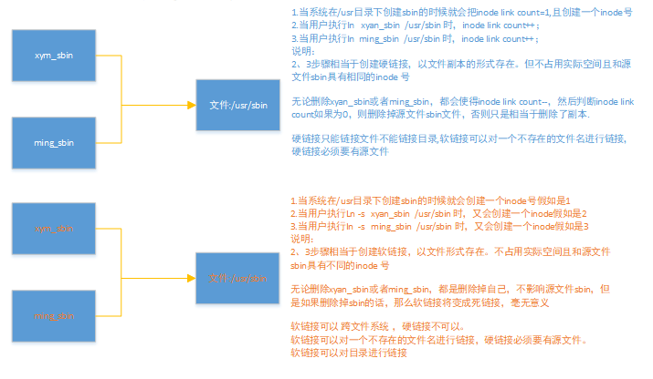

# 常用命令

## Git相关

repo同步SDK

```shell
book@100ask:~/100ask_firefly-rk3288$  ../repo/repo sync -j4
```


## Linux常用命令相关 

查看内核版本

`uname -r`

修改主机名

```
sudo vim /etc/hostname
```

修改组名和用户名

切换到root

```
su -
```

修改用户信息 ,把里面的原来的名字全换成自己想修改的

```
vim /etc/passwd
```

修改用户密码文件，把里面的原来的名字全换成自己想修改的 

```
vim /etc/shadow
```

修改用户组文件，把里面的原来的名字全换成自己想修改的 

```
vim /etc/group
```

修改home目录下用户的目录名字,即把book改为 xym 

```
mv ~/book ~/xym
```

修改xym的权限，编辑xym的权限，并保存

```
chmod u+w /etc/sudoers

# User privilege specification
root    ALL=(ALL:ALL) ALL
xym   ALL=(ALL:ALL) ALL
```

恢复文件权限 

```
chmod u-w /etc/sudoers
```

切换到xym用户即可 

```
su xym
```

 压缩命令

```shell
解压：gzip  tar -xzvf xxx.gz   压缩：tar -czvf xxx.gz    
解压：bzip  tar -xjvf xxx.bz   压缩：tar -cjvf xxx.bz     -C /home/chenxibing  指定目录
```

驱动加载相关

```
加载驱动模块         insmod lradc.ko
查看驱动是否加载成功过 ls /dev/magic-adc
```

```shell
查找文件 ：find . -name gzip_wrapper.c
查找值 grep Z_FIXED . -R

设置权限 和 拥有者

sudo chmod go+rx -R ./ming    给组（g）其他用户（o）添加rx 权限 针对ming目录下的所有文件及目录
sudo chmod go-rx -R ./ming    给组（g）其他用户（o）减去rx 权限 针对ming目录下的所有文件及目录
sudo chown user:userg test.txt 修改test.txt 文件的所有者：
user：用户名
userg：该用户所在的组

u:用户
g：组
o:其他

字符表示
r：可读
w：可写
x：可执行

数字表示
0421
-rwx

例如执行ls -l
drwxr-xr-x 2 book book 4096 Mar 26  2019 Desktop
d:代表类型目录 
其中还有【“-” 普通文件】【“l” 链接文件】【“b” 设备文件(block)】【“c”字符设备文件】【p”命令管道文件】【“s” sock文件】

rwx：用户权限
r-x:组权限
r-x：组权限
2:链接数
第一个book：文件（目录）的拥有者
第二个book：文件（目录）拥有者所在的组
4096:文件（目录）所占用的空间(以字节为单位)
Mar 26 2019 :文件（目录）最近访问（修改）时间
Desktop：文件（目录）名字
```

## 链接文件


在Linux的文件系统中，保存在磁盘分区中的文件不管是什么类型都给它分配一个编号，称为索引节点号inode ，
唯一的标识，还会有个inode link count计数变量表示硬链接的数量


### 软连接和硬链接的特点

软链接：

- 1.软链接是存放另一个文件的路径的形式存在。
- 2.软链接可以 跨文件系统 ，硬链接不可以。
- 3.软链接可以对一个不存在的文件名进行链接，硬链接必须要有源文件。
- 4.软链接可以对目录进行链接。

硬链接：

- 1. 硬链接，以文件副本的形式存在。但不占用实际空间。

- 2. 不允许给目录创建硬链接。

- 3. 硬链接只有在同一个文件系统中才能创建。

- 4. 删除其中一个硬链接文件并不影响其他有相同 inode 号的文件。

  ```
  我们知道硬链接是有着相同 inode 号仅文件名不同的文件，用ls -li命令查看
  [root@localhost dirIn]# ls -li
  1177358 -rw-r--r-- 2 root root 0 5月  31 14:53 infile
  1177358 -rw-r--r-- 2 root root 0 5月  31 14:53 infile_hard_file
  #上面源文件和硬链接文件inode号相同 （第一列就是inode号），指向同一个索引节点。
  1177363 lrwxrwxrwx 1 root root 6 5月  31 15:03 infile_soft_file -> infile  
  软链接是一个链接文件，文件模式那块前面有个l字母，表示是个链接文件。
  
  给文件穿件软链接：
  [root@localhost dirIn]# ln -s infile infile_soft_file    创建软链接用s参数
  [root@localhost dirIn]# ls -l
  总用量 0
  -rw-r--r-- 2 root root 0 5月  31 14:53 infile
  -rw-r--r-- 2 root root 0 5月  31 14:53 infile_hard_file
  lrwxrwxrwx 1 root root 6 5月  31 15:03 infile_soft_file -> infile  软链接
  给文件创建硬链接
  [root@localhost tmp]# mkdir dirIn   创建测试目录
  [root@localhost tmp]# cd dirIn/
  [root@localhost dirIn]# touch infile
  [root@localhost dirIn]# ll
  总用量 0
  -rw-r--r-- 1 root root 0 5月  31 14:53 infile
  [root@localhost dirIn]# ln infile infile_hard_file      在默认不带参数情况下，ln命令创建的是硬链接。
  [root@localhost dirIn]# ll
  总用量 0
  -rw-r--r-- 2 root root 0 5月  31 14:53 infile
  -rw-r--r-- 2 root root 0 5月  31 14:53 infile_hard_file
  
  ```

## 交叉编译器设置相关 

1.临时生效

```shell
book@100ask:~$ export PATH=$PATH:/home/book/100ask_firefly-rk3288/ToolChain/gcc-linaro-6.2.1-2016.11-x86_64_arm-linux-gnueabihf/bin
book@100ask:~$ export ARCH=arm
book@100ask:~$ export CROSS_COMPILE=arm-linux-gnueabihf-

```

2.当前用户永久生效，修改~/.bashrc或者 ~/.bash_profile， 修改完后 执行source ./.bashrc使其生效

```shell
book@100ask:~$ vim ~/.bashrc
在行尾添加或修改：
export ARCH=arm
export CROSS_COMPILE=arm-linux-gnueabihf-
export PATH=$PATH:/home/book/100ask_firefly-rk3288/ToolChain/gcc-linaro-6.2.1-2016.11-x86_64_arm-linux-gnueabihf/bin
book@100ask:~$ source ./.bashrc
```

3.所有用户永久生效，修改/etc/profile文件

```shell
book@100ask:~$ sudo vi /etc/profile
在行尾添加或修改：
export ARCH=arm
export CROSS_COMPILE=arm-linux-gnueabihf-
export PATH=$PATH:/home/book/100ask_firefly-rk3288/ToolChain/gcc-linaro-6.2.1-2016.11-x86_64_arm-linux-gnueabihf/bin
book@100ask:~$ source /etc/profile
```


## TFTP 服务器相关 

1.安装tftp服务器：`sudo apt-get install tftp-hpa tftpd-hpa`
2.配置tftp服务器

```shell
mkdir -p /home/book/tftpboot
chmod 777 /home/book/tftpboot
sudo vim /etc/default/tftpd-hpa
		TFTP_DIRECTORY="/home/book/tftpboot"
		TFTP_OPTIONS="-l -c -s"
```

3.重启TFTP服务:

```
sudo service tftpd-hpa restart
```

4.验证TFTP

```
xym@pc:~/nfs_rootfs$ tftp 192.168.2.147
tftp> get b.txt
tftp> q
xym@pc:~/nfs_rootfs$ ls
b.txt
```


## NFS 服务器相关 

1.安装nfs服务器：

```shell
sudo apt-get install nfs-kernel-server
```

2.配置nfs服务器

```shell
sudo vim /etc/exports
	/home/book/nfs_rootfs *(rw,nohide,insecure,no_subtree_check,async,no_root_squash)
```
3.重启nfs服务:

```
sudo service nfs-kernel-server restart
```

4.验证nfs服务器

```
sudo mount -t nfs 192.168.2.101:/home/book/nfs_rootfs /mnt
```

5.开发板内核启动后挂根网络文件夹

```
[root@firefly-rk3288:/]# mount -t nfs  192.168.2.101:/home/book/nfs_rootfs /mnt
```


## 网络文件系统相关

firefly RK3288

```bash
=> setenv serverip 192.168.2.101
=> setenv ipaddr 192.168.2.102
=> tftpboot 0x01f00000 rk3288-firefly.dtb; tftpboot 0x02000000 zImage; setenv bootargs root=/dev/nfs nfsroot=192.168.2.101:/home/book/nfs_rootfs,vers=3  rw ip=192.168.2.102; bootz 0x02000000 - 0x01f00000
```

zlg imx283，没有搞出来

```bash
setenv bootargs root=/dev/nfs rw console=ttyAM0,115200n8 nfsroot=192.168.2.100:/home/book/nfs_rootfs vers=3 ip=192.168.2.101:192.168.2.100:192.168.2.254:255.255.255.0:epc.zlgmcu.com:eth0:off mem=64M
setenv bootargs gpmi=g console=ttyAM0,115200n8 ubi.mtd=1 root=ubi0:rootfs rootfstype=ubifs fec_mac= ethact mem=64M

```

野火pro

```bash
=> setenv ipaddr 192.168.2.102
=> setenv serverip 192.168.2.61
=> ping 192.168.2.61
Using ethernet@020b4000 device
host 192.168.2.61 is alive
=> setenv nfsroot /home/book/nfs_rootfs,vers=3
=> run netboot
```

## Samb服务器

```shell
第一步：更新软件
#book@100ask:~$ sudo apt-get upgrade
#book@100ask:~$ sudo apt-get update
#book@100ask:~$ sudo apt-get dist-upgrade
第二步：安装samba服务器
book@100ask:~$ sudo apt-get install samba samba-common
#book@100ask:~$ sudo chmod 777 /home/book/
第三步：添加用户
book@100ask:~$ sudo smbpasswd -a book
第三步：配置samba服务器
book@100ask:~$ sudo vim /etc/samba/smb.conf
[share]                           
   comment = this is a  share folder
   browseable = no
   path = /home/book/embdefire
   #path = /home/book/ming
   create mask = 0755
   directory mask = 0755

   valid users = book,ming
   write list = book
   force user = book
   force group = book
   public = yes
   available = yes
   writeable = yes


第四步：从新启动
book@100ask:~$ sudo service smbd restart


参数说明：
[share]                           指定共享名，也就是客户端在访问时所看到的共享目录名字
   comment = this is a share      共享文件说明，有没有都可以
   browseable = no                不让匿名用户看到共享内容
   path = /home/book/embdefire    指定共享目录实际路径，要求必须使用绝对路径
   valid users = book,ming        指定的可以访问Samba 共享的用户
   write list = book              只允许book具有写权限
   create mask = 0755             设置新建文件的权限， （rwx r-x r-x）
   directory mask = 0755          设置新建文件夹的权限， （rwx r-x r-x）
    force user = book             设置用户
   force group = book             设置用户所在的组 这两项可以使在win下创建文件夹和删除文件的权限
   available = yes
   writeable = yes     共享目录是否允许Samba用户写入，虽然设置了所有Samba用户都可以写入，但由于“valid users”设置项限制了只能book,ming访问
sudo smbpasswd -a book 创建smb用户，并创建访问密码
```

