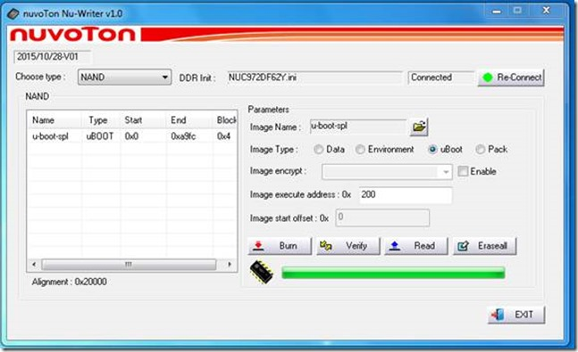
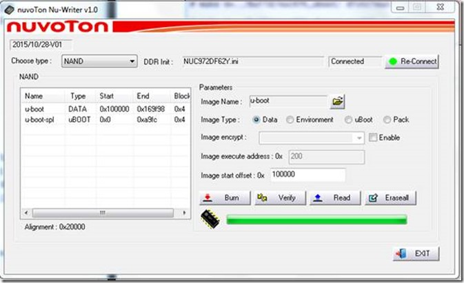
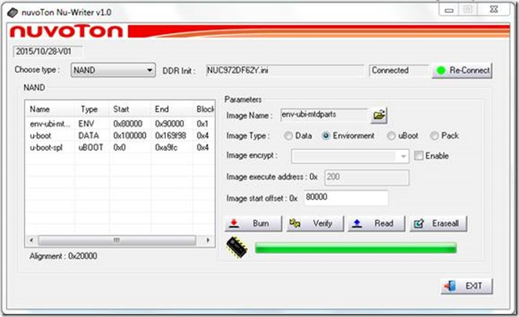
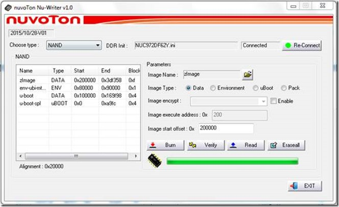
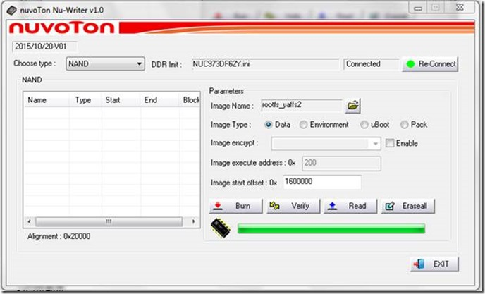

# NUC972文件说明

## 下载文件和执行地址

- u-boot-spl.bin：负责将u-boot.bin从Nand flash搬到DDR中执行。默认执行地址：0x200，可修改;
- u-boot.bin：u-boot程序，默认执行地址：0xE00000，在nand flash中的烧写地址：0x100000;
- env.txt：u-boot环境变量，在Nand Flash中的烧写地址：0x80000;
- uImage：Linux kernel,加载地址：0x7fc0；执行地址：0x8000；烧写地址：0x200000，可变要与u-boot环境参数一致，bootcmd=nboot 0x7fc0 0 0x200000;bootm 0x7fc0.









制作文件系统

```
mkyaffs2 -inband-tags -p 2048 rootfs rootfs_yaffs2.img
```




## 内核配置的Default kernel command string和uboot的bootargs变量区别

如果uboot的bootargs设置了，kernel的Boot options中的Default kernel command string设置与否，都不启作用，即bootargs覆盖掉设置的Default kernel command string，打印的信息也是bootargs传过来的command string。

如果uboot的bootargs未设置的话，kernel就以Boot options中的Default kernel command string的设置进行启动。


总之：

 不管是从NAND还是NOR起动，uboot是用来引导linux的，如果uboot的bootargs设置了的话，uboot在引导Linux时会用bootargs替换掉linux的command string。CONFIG_CMDLINE实在bootloader无法给内核传递参数的情况下才有用，一般是用不到内核自己配的CONFIG_CMDLINE的