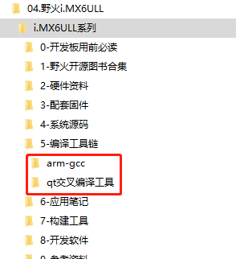
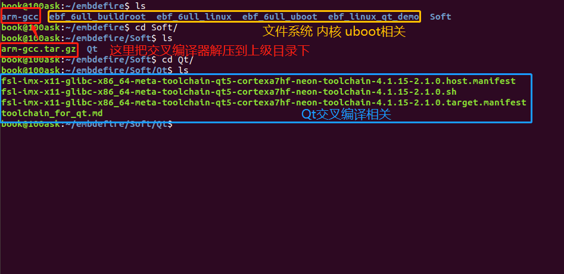
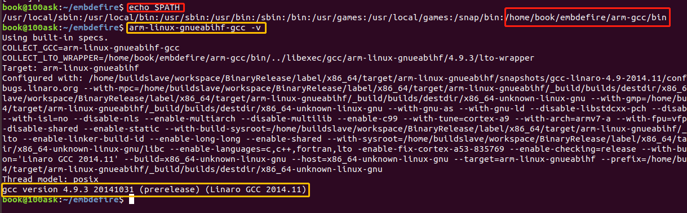
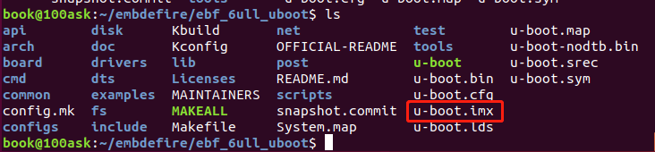

# 野火IMX6 SDK

- 硬件平台：野火IMX6ULL_Pro
- 软件资源：默认虚拟机tftp服务器目录：/home/tftpboot
      默认虚拟机NFS服务器目录：/home/nfs_rootfs
- 参考文档：https://tutorial.linux.doc.embedfire.com/zh_CN/latest/building_image/building_NXP_firmware.html

## 资源下载

1. 野火官方发布地址

| 说明     | 下载地址                                            |
| -------- | --------------------------------------------------- |
| uboot    | https://github.com/Embedfire/ebf_6ull_uboot.git     |
| kernel   | https://github.com/Embedfire/ebf_6ull_linux.git     |
| 文件系统 | https://github.com/Embedfire/ebf_6ull_buildroot.git |
| qt_demo  | https://github.com/Embedfire/ebf_linux_qt_demo.git  |

2. 自己Fork野火代码到自己仓库地址，目前虚拟机上下载的也是下面的地址

| 说明     | 下载地址                                              |
| -------- | ----------------------------------------------------- |
| uboot    | https://github.com/FireIMX6ULL/ebf_6ull_uboot.git     |
| kernel   | https://github.com/FireIMX6ULL/ebf_6ull_linux.git     |
| 文件系统 | https://github.com/FireIMX6ULL/ebf_6ull_buildroot.git |
| qt_demo  | https://github.com/FireIMX6ULL/ebf_linux_qt_demo.git  |

交叉编译器和Qt交叉编译工具，下载后如图所示，需要把arm-gcc 和qt交叉编译工具拷贝到虚拟机里面。

- 链接：https://pan.baidu.com/s/1sUPeMSDt1egJmw6YSk7-DQ
- 提取码：v4kh



最终在虚拟机的目录结构如图所示：



设置交叉编译环境

```bash
book@100ask:~/embdefire$ sudo vim ~/.bashrc
book@100ask:~/embdefire$ source ~/.bashrc     #立即生效，不用重启系统
```

在末尾添加下面代码

```bash
export ARCH=arm
export CROSS_COMPILE=arm-linux-gnueabihf-
export PATH=$PATH:/home/book/embdefire/arm-gcc/bin
```

验证是否添加OK

```bash
book@100ask:~/embdefire$ echo $PATH
/usr/local/sbin:/usr/local/bin:/usr/sbin:/usr/bin:/sbin:/bin:/usr/games:/usr/local/games:/snap/bin:/home/book/embdefire/arm-gcc/bin
book@100ask:~/embdefire$ arm-linux-gnueabihf-gcc -v
```



## uboot编译

```bash
book@100ask:~/embdefire$ cd ebf_6ull_uboot/
book@100ask:~/embdefire/ebf_6ull_uboot$ make distclean 
1. nand版本配置：
book@100ask:~/embdefire/ebf_6ull_uboot$ make mx6ull_14x14_evk_nand_defconfig
2. emmc版本配置：
book@100ask:~/embdefire/ebf_6ull_uboot$ make mx6ull_14x14_evk_emmc_defconfig
3. sd卡版本配置：
book@100ask:~/embdefire/ebf_6ull_uboot$ make mx6ull_14x14_evk_defconfig
book@100ask:~/embdefire/ebf_6ull_uboot$ make -j4

```

编译完后会在`book@100ask:~/embdefire/ebf_6ull_uboot`目录下生成`u-boot.imx`的镜像文件。如下图所示。




## 编译内核

野火源码包是经过修改的，首先进入`ebf_6ull_linux/arch/arm/configs`目录下，可以看到很多默认的deconfig文件，这些是linux源码中的配置文件，其中我们主要关注3个配置文件：

- `imx_v6_v7_defconfig`：nxp官方提供的默认配置文件
- `imx_v7_defconfig `：nxp官方提供的默认配置文件
- `imx6_v7_ebf_defconfig`：野火提供的配置文件


```bash
执行以下命令安装lzop工具
book@100ask:~/embdefire/ebf_6ull_linux$ sudo apt-get install lzop libncurses5-dev
book@100ask:~/embdefire$ cd ebf_6ull_linux/
book@100ask:~/embdefire/ebf_6ull_linux$ make  clean
book@100ask:~/embdefire/ebf_6ull_linux$ make imx6_v7_ebf_defconfig
book@100ask:~/embdefire/ebf_6ull_linux$ make -j10 
book@100ask:~/embdefire/ebf_6ull_linux$ make -j10 dtbs
内核镜像zImage路径：ebf_6ull_linux/arch/arm/boot
设备树输出路径：ebf_6ull_linux/arch/arm/boot/dts

执行./copy.sh脚本拷贝内核和设备树到book@100ask:~/embdefire/ebf_6ull_linux/image目录下，
book@100ask:~/embdefire/ebf_6ull_linux$ ./copy.sh
book@100ask:~/embdefire/ebf_6ull_linux$ cd image/
book@100ask:~/embdefire/ebf_6ull_linux/image$ ls
imx6ull-14x14-evk.dtb
imx6ull-14x14-evk-emmc-43.dtb
imx6ull-14x14-evk-emmc-cam-dht11.dtb
imx6ull-14x14-evk-emmc.dtb
imx6ull-14x14-evk-emmc-hdmi.dtb
imx6ull-14x14-evk-emmc-wifi.dtb
imx6ull-14x14-evk-gpmi-weim-43.dtb
imx6ull-14x14-evk-gpmi-weim-cam-dht11.dtb
imx6ull-14x14-evk-gpmi-weim-hdmi.dtb
imx6ull-14x14-evk-gpmi-weim-wifi.dtb
zImage
 
单独编译设备树
book@100ask:~/embdefire/ebf_6ull_linux$ make -j10 dtbs
```


## 编译文件系统

```shell
book@100ask:~/embdefire$ cd ebf_6ull_buildroot/
book@100ask:~/embdefire/ebf_6ull_buildroot$ make clean
1.带Qt Demo配置
book@100ask:~/embdefire/ebf_6ull_buildroot$ make imx6ull_ebf_pro_defconfig
2.最小的完整镜像配置（文件系统6M左右）
book@100ask:~/embdefire/ebf_6ull_buildroot$ make imx6ull_ebf_minimal_defconfig
3.pico文件系统配置（不编译uboot与内核，文件系统5M左右）
book@100ask:~/embdefire/ebf_6ull_buildroot$ make imx6ull_ebf_pico_defconfig

book@100ask:~/embdefire/ebf_6ull_buildroot$ make menuconfig
book@100ask:~/embdefire/ebf_6ull_buildroot$ make savedefconfig   # 将上面修改保存到默认配置里面
book@100ask:~/embdefire/ebf_6ull_buildroot$ make 

生成的镜像文件在book@100ask:~/embdefire/ebf_6ull_buildroot/output/images/ 目录下
book@100ask:~/embdefire/ebf_6ull_buildroot/output/images$ ll
total 1097656
drwxr-xr-x 2 book book      4096 Nov 15 04:50 ./
drwxr-xr-x 6 book book      4096 Nov 15 04:50 ../
-rw-r--r-- 1 book book  16777216 Nov 15 04:50 boot.vfat
-rw-r--r-- 1 book book     41031 Nov 15 04:49 imx6ull-14x14-evk-btwifi.dtb
-rw-r--r-- 1 book book     40494 Nov 15 04:49 imx6ull-14x14-evk.dtb
-rw-r--r-- 1 book book     40618 Nov 15 04:49 imx6ull-14x14-evk-emmc-43.dtb
-rw-r--r-- 1 book book     40618 Nov 15 04:49 imx6ull-14x14-evk-emmc-cam-dht11.dtb
-rw-r--r-- 1 book book     40618 Nov 15 04:49 imx6ull-14x14-evk-emmc.dtb
-rw-r--r-- 1 book book     40618 Nov 15 04:49 imx6ull-14x14-evk-emmc-hdmi.dtb
-rw-r--r-- 1 book book     41155 Nov 15 04:49 imx6ull-14x14-evk-emmc-wifi.dtb
-rw-r--r-- 1 book book     40494 Nov 15 04:49 imx6ull-14x14-evk-gpmi-weim-43.dtb
-rw-r--r-- 1 book book     40494 Nov 15 04:49 imx6ull-14x14-evk-gpmi-weim-cam-dht11.dtb
-rw-r--r-- 1 book book     40494 Nov 15 04:49 imx6ull-14x14-evk-gpmi-weim-hdmi.dtb
-rw-r--r-- 1 book book     41031 Nov 15 04:49 imx6ull-14x14-evk-gpmi-weim-wifi.dtb
-rw-r--r-- 1 book book  96920576 Nov 15 04:50 rootfs.cpio
-rw-r--r-- 1 book book  44512562 Nov 15 04:50 rootfs.cpio.gz
-rw-r--r-- 1 book book  44512626 Nov 15 04:50 rootfs.cpio.uboot
-rw-r--r-- 1 book book 536870912 Nov 15 04:50 rootfs.ext2
lrwxrwxrwx 1 book book        11 Nov 15 04:50 rootfs.ext4 -> rootfs.ext2
-rw-r--r-- 1 book book 107243520 Nov 15 04:50 rootfs.tar
-rw-r--r-- 1 book book  63832064 Nov 15 04:50 rootfs.ubi
-rw-r--r-- 1 book book  62576640 Nov 15 04:50 rootfs.ubifs
-rw-r--r-- 1 book book 562036736 Nov 15 04:50 sdcard.img
-rw-r--r-- 1 book book    351232 Nov 15 04:41 u-boot.imx
-rw-r--r-- 1 book book   6349896 Nov 15 04:49 zImage


```

## 编译qt

### 安装的SDK

执行如下命令安装qt5的交叉编译工具链：
```bash
./fsl-imx-x11-glibc-x86_64-meta-toolchain-qt5-cortexa7hf-neon-toolchain-4.1.15-2.1.0.sh
```

选择默认设置，安装完成后，会在/opt/fsl-imx-x11/4.1.15-2.1.0/目录下生成我们所需要的工具链。

**注意**：每次打开终端时，都需要执行以下命令设置环境变量：

```bash
source /opt/fsl-imx-x11/4.1.15-2.1.0/environment-setup-cortexa7hf-neon-poky-linux-gnueabi 
```

输入命令
```bash
qmake -v 
```

若环境变量设置正确，则会出现以下信息

```bash
embedfire@dev1:~$ qmake -v
QMake version 3.0
Using Qt version 5.6.2 in /opt/fsl-imx-x11/4.1.15-2.1.0/sysroots/cortexa7hf-neon-poky-linux-gnueabi/usr/lib
```

> 以上是验证SDK安装是否成功！！

### 下载qt源码

```bash
git clone https://github.com/Embdefire/ebf_linux_qt_demo.git
```
### 编译

```bash
chmod +x build.sh   #添加权限
./build.sh          #执行编译脚本
```

### 输出

在当前目录下会创建一个`run_dir`目录，存在`App  libqui  libskin`文件，App是可以直接在开发板上运行的！
与此同时，还会打包一个`fire-app-xxxx.tar.bz2`文件，大家可以拷贝到对应的目录下解压替换掉旧的`App`。

5.清除相关内容

```bash
make distclean
```

## 烧录


待续


## 高级教程

### 修改 uboot

有时候官方的uboot总是不能满足我们的需求，我们得学会修改对应的uboot配置，比如开机的logo，比如显示屏配置，HDMI配置等，我们就简单修改一下我们的配置，让他能在我们的屏幕上运行，也把开机logo替换为我们的logo。

首先我们要知道这些配置写在什么地方，然后才能去修改它，比如我们先改开机logo，找到uboot /tools/目录下的Makefile文件，大约在200行，就有关于开机logo的配置，具体如下：

```
# Generic logo
ifeq ($(LOGO_BMP),)
LOGO_BMP= $(srctree)/$(src)/logos/denx.bmp

# Use board logo and fallback to vendor
ifneq ($(wildcard $(srctree)/$(src)/logos/$(BOARD).bmp),)
LOGO_BMP= $(srctree)/$(src)/logos/$(BOARD).bmp
else
ifneq ($(wildcard $(srctree)/$(src)/logos/$(VENDOR).bmp),)
LOGO_BMP= $(srctree)/$(src)/logos/$(VENDOR).bmp
endif
endif

endif # !LOGO_BMP
```

解释一下Makefile文件的描述：

- 使用ifeq 判断是否指定了LOGO_BMP变量（该变量表示开机logo图片），如果不指定则使用默认logo图片denx.bmp，该图片在logos目录下。

- 然后判断一下是否存在使用开发板名字命名的图片（如(BOARD)，它是一个变量的引用，表示开发板的名字），如果是则使用(BOARD)，它是一个变量的引用，表示开发板的名字），如果是则使用(BOARD).bmp。

- 最后判断一下是否存在以供应商名字命名的图片（如$(VENDOR).bmp），那么很显然，nxp官方提供的uboot必然是以它们的名字命名logo，那么uboot就会使用它们的logo图片，我们可以到uboot /tools/logos目录下查看一番，就会发现存在freescale.bmp文件，如图所示。

  > 注意：开机logo必须是bmp类型的图片，否则可能出现错误。


既然要修改logo，我们把自己的开机logo图片放进去替换原本的logo即可，我们的开机logo如图所示（注意：logo图片格式必须为bmp格式）。


这些logo在uboot启动时就会被显示在屏幕上，具体的显示logo的函数在uboot /board/esd/common/目录下的lcd.c文件中，大约在81行左右，感兴趣的读者可以去看看源码，在这里就不深入分析。

接着我们可以修改显示屏，让我们的开发板支持显示屏的其他尺寸，那么此时就要去配置源码中修改了，nxp官方支持的imx6ull开发板相关的配置源码文件在/uboot/board/freescale/mx6ullevk/目录下的mx6ullevk.c文件中，我们简单修改一下displays这个数组，它是记录了与显示屏相关信息的数组，具体修改如下：

```
struct display_info_t const displays[] = {{
        .bus = MX6UL_LCDIF1_BASE_ADDR,
        .addr = 0,
        .pixfmt = 24,
        .detect = NULL,
        .enable = do_enable_parallel_lcd,
        .mode   = {
                .name           = "TFT43AB",
                .xres           = 480,
                .yres           = 272,
                .pixclock       = 108695,
                .left_margin    = 8,
                .right_margin   = 4,
                .upper_margin   = 2,
                .lower_margin   = 4,
                .hsync_len      = 41,
                .vsync_len      = 10,
                .sync           = 0,
                .vmode          = FB_VMODE_NONINTERLACED
                   }
        },

        {
        .bus = MX6UL_LCDIF1_BASE_ADDR,
        .addr = 0,
        .pixfmt = 24,
        .detect = NULL,
        .enable = do_enable_parallel_lcd,
        .mode   = {
                .name           = "TFT50AB",
                .xres           = 800,
                .yres           = 480,
                .pixclock       = 108695,
                .left_margin    = 46,
                .right_margin   = 22,
                .upper_margin   = 23,
                .lower_margin   = 22,
                .hsync_len      = 1,
                .vsync_len      = 1,
                .sync           = 0,
                .vmode          = FB_VMODE_NONINTERLACED
                   }
        },

        {
        .bus = MX6UL_LCDIF1_BASE_ADDR,
        .addr = 0,
        .pixfmt = 24,
        .detect = NULL,
        .enable = do_enable_parallel_lcd,
        .mode   = {
                .name           = "TFT70AB",
                .xres           = 800,
                .yres           = 480,
                .pixclock       = 108695,
                .left_margin    = 46,
                .right_margin   = 22,
                .upper_margin   = 23,
                .lower_margin   = 22,
                .hsync_len      = 1,
                .vsync_len      = 1,
                .sync           = 0,
                .vmode          = FB_VMODE_NONINTERLACED
                   }
        }

};
```

这里的配置是支持3个野火显示屏尺寸的，4.3寸、5寸、7寸、HDMI的适配等，不同的屏幕尺寸稍微不一样，具体阅读以上配置即可，此处不深入研究，都是比较简单的语法，主要是配置硬件相关的信息。

又比如我们在开机时不想让uboot有延时，我们都可以去修改：

在`ebf_6ull_uboot/include/configs/mx6_common.h`文件中将宏定义改为0：

```
#ifndef CONFIG_BOOTDELAY
#define CONFIG_BOOTDELAY    0
#endif
```

在`ebf_6ull_uboot/include/configs/mx6ullevk.h`文件中设置uboot传给内核的参数，比如设置console、bootargs、bootcmd等：

**nand 版本的参数：**

```
#define CONFIG_EXTRA_ENV_SETTINGS \
    CONFIG_MFG_ENV_SETTINGS \
    "panel=TFT50AB\0" \
    "splashimage=0x82000000\0" \
    "fdt_addr=0x83000000\0" \
    "fdt_high=0xffffffff\0"   \
    "console=ttymxc0\0" \
    "bootargs=console=ttymxc0,115200 ubi.mtd=3 "  \
        "root=ubi0:rootfs rw rootfstype=ubifs "          \
        CONFIG_BOOTARGS_CMA_SIZE \
        "mtdparts=gpmi-nand:64m(boot),16m(kernel),16m(dtb),-(rootfs)\0"\
    "bootcmd=nand read ${loadaddr} 0x4000000 0x800000;"\
        "nand read ${fdt_addr} 0x5000000 0x100000;"\
        "bootz ${loadaddr} - ${fdt_addr}\0"
```

**emmc版本的参数太长了，就不贴代码了，感兴趣的可以自己看源码。**