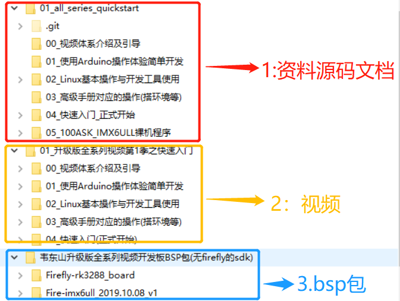
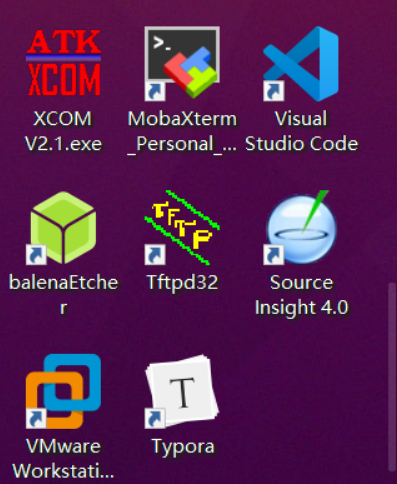

# 资料下载及介绍

## 资料下载

资料分为三部分，如图所示。



各个部分下载地址如下：

1. 【文档源码资料】：【视频】目录存放视频，【文档源码资料】目录存放视频里面的文档代码等。下载地址：

   ```
   git clone https://github.com/100askTeam/01_all_series_quickstart.git
   或者
   git clone https://e.coding.net/weidongshan/01_all_series_quickstart.git
   ```

   以后更新可执行

   ```
   git pull origin
   ```

2. 【视频】：【视频】目录存放视频，【文档源码资料】目录存放视频里面的文档代码等。

   下载地址：百度盘链接：https://eyun.baidu.com/s/3hsTaQ5A 密码：WND3

   在线视频地址： https://www.bilibili.com/video/av65976587

3. 【bsp包】：存放主板的uboot、内核、文件系统等压缩文件。下载地址和上面链接一样。

## 软件安装

开发板【bsp包】配套资料中有一个目录：`01_Tools`里面有部分软件的安装包，其它从百度自行下载安装。



