# 开发板快速上手

## 资料下载

  打开[http://wiki.100ask.net](http://wiki.100ask.net/)，可以看到所有资料的下载地址。找到对应开发板的BSP包，下载对应的BSP包。

## 接线与启动

### 100ASK_IMX6ULL 开发板

#### 串口接线

  在后面的操作里，都是通过串口与板子进行“交流”。串口是串行接口的简称，是指数据一位一位地顺序传送，其特点是通信线路简单。
  在电脑上安装好MobaXterm后，使micro USB数据线，连接电脑和开发板上的6号接口(USB转串口)。
  首先如下图所示将串口线与电脑、板子连接，开发板插上电源。

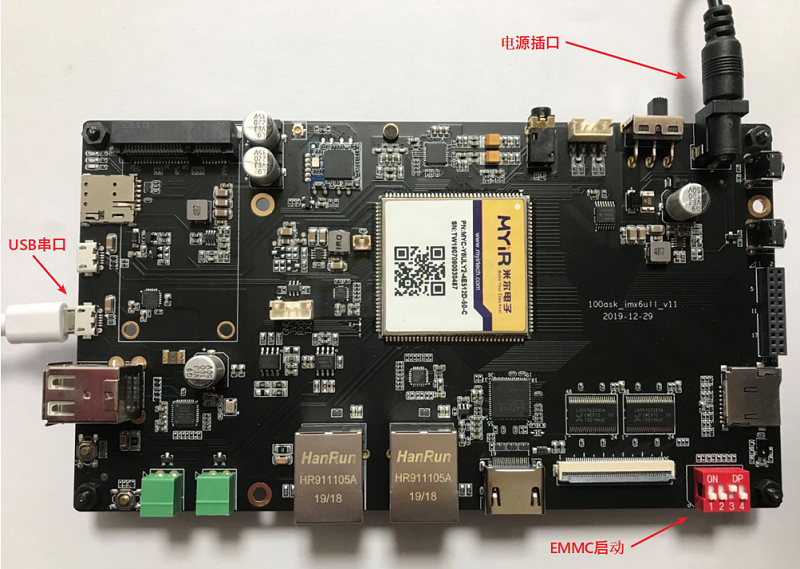

  **这里需要特别注意的几点：**
    a) 板子的启动选择拨到正确的启动方式，保证该启动方式里面有系统可以运行；
    b) 板子如图所示插上配套的电源到电源接口，电源开关暂时不用打开；

  将串口线插上电脑的USB接口上时，Windows会自动安装驱动(安装可能比较慢，等一分钟左右)。
  打开电脑的“设备管理器”，在“端口 (COM和LPT)”项下，可以看到如下图 中的“Silicon Labs CP210x USB to UART Bridge (COM12)”。
  这里的“COM12”可能与你电脑上的不一样，记住你电脑上设备管理器中显示的数字。

  如果电脑没有显示出端口号，就需要手动安装驱动，从[驱动精灵](https://book.100ask.net/source/chapterthird/www.drivergenius.com)官网下载一个驱动精灵，安装、运行、检测，会自动安装上串口驱动。

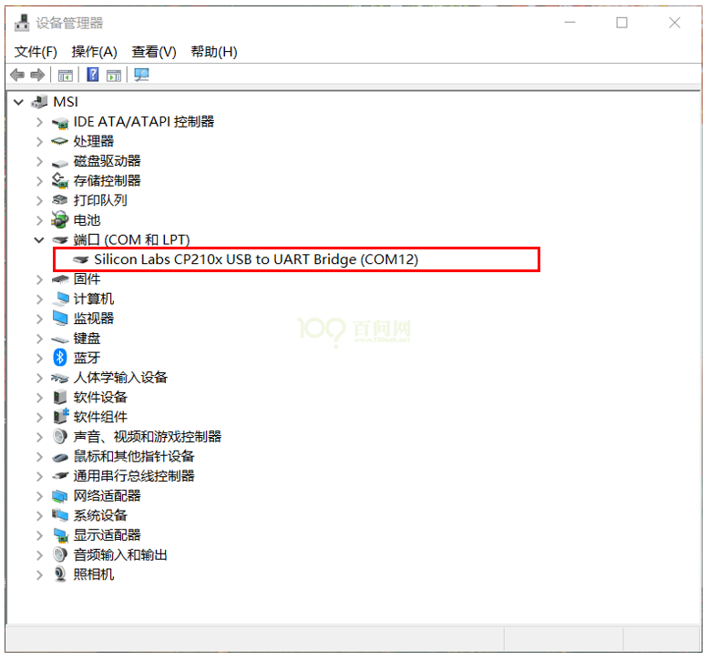

  最后打开MobaXterm，点击左上角的“Session”，在弹出的界面选中“Serial”，如下图所示设置端口号（前面设备管理器显示的端口号）、波特率（Speed:115200）、流控（Flow control:None）,最后点击“OK”即可。
  注意：流控（Flow Control）一定要选择none，否则你将无法在MobaXterm中向串口输入数据。

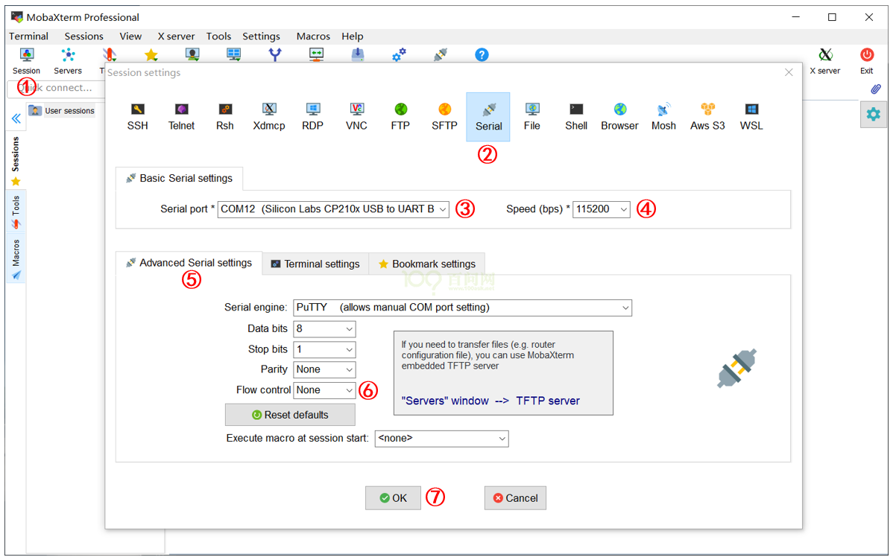

  随后显示一个黑色的窗口， 此时打开板子的电源开关，将收到板子串口发过来的数据，如下图所示：


#### 启动方式选择

  板子上的红色拨码开关用来设置启动方式，支持这3种方式：**EMMC启动、SD卡启动、USB烧写**。
  板子背后画有一个表格，表示这3种方式如何设置。
  表格如下：

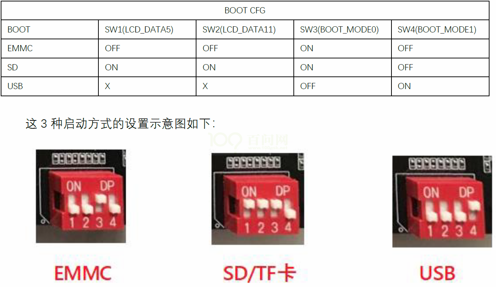

  **要注意的是，设置为USB启动时，不能插上SD卡、TF卡。**
  刚出厂的板子在EMMC上烧写了系统，您可以设置为EMMC启动方式。

### 100ASK_AM335X 开发板

#### 串口连接

  将串口模块与电脑USB口、板子RS232口连接：

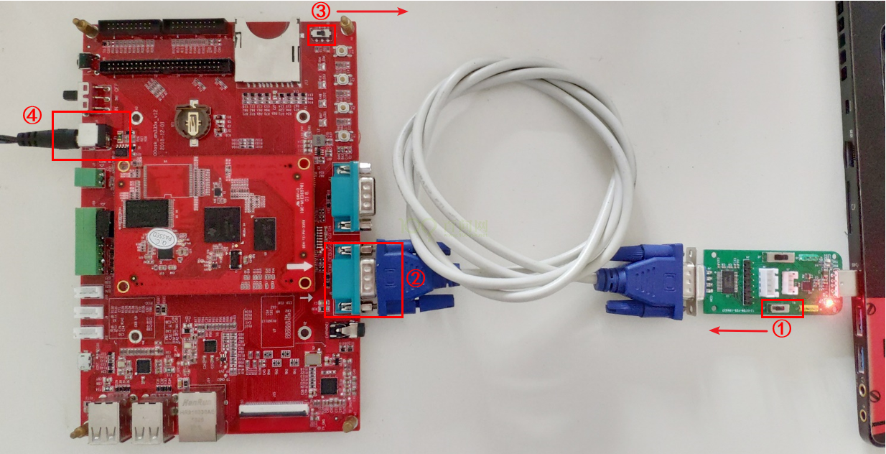

  其中特别需要注意的几点：
    ① 串口模块的电平选择开关拨到如图所示的左边，表示切换到RS232电平；
    ② RS232延长线连接板子如图所示下方的RS232接口，下方的才是默认的debug接口；
    ③ 板子的启动选择拨到如图所示的右边，以选择从Nand Flash启动；
    ④ 板子如图所示插上配套的电源，电源开关暂时不用打开。

  将USB转RS232/TTL串口模块插在电脑USB上时，Windows会自动安装驱动(安装可能比较慢，等一分钟左右)。
  打开电脑的“设备管理器”，在“端口 (COM和LPT)”项下，可以看到如下图 中的“Silicon Labs CP210x USB to UART Bridge (COM12)”。
  这里的“COM12”可能与你电脑上的不一样，记住你电脑上设备管理器中显示的数字。

  如果电脑没有显示出端口号，就需要手动安装驱动，从[驱动精灵](https://book.100ask.net/source/chapterthird/www.drivergenius.com)官网下载一个驱动精灵，安装、运行、检测，会自动安装上串口驱动。


  最后打开MobaXterm，点击左上角的“Session”，在弹出的界面选中“Serial”，如下图所示设置端口号（前面设备管理器显示的端口号）、波特率（Speed:115200）、流控（Flow control:None）,最后点击“OK”即可。
  **注意**：流控（Flow Control）一定要选择none，否则你将无法在MobaXterm中向串口输入数据。


  随后显示一个黑色的窗口， 此时打开板子的电源开关，将收到板子串口发过来的数据，如下图所示：

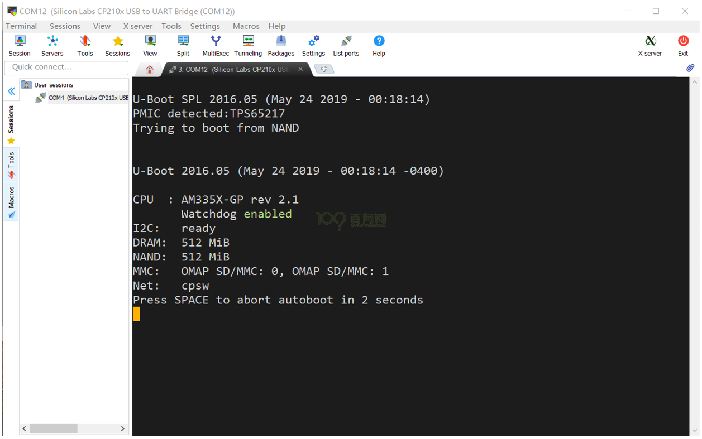

#### 启动方式选择

  如下图，板上有启动方式选择开关，也标有文字：


### Firefly-rk3288开发板

#### 串口连接

  将串口模块与电脑USB口、板子UART口连接：

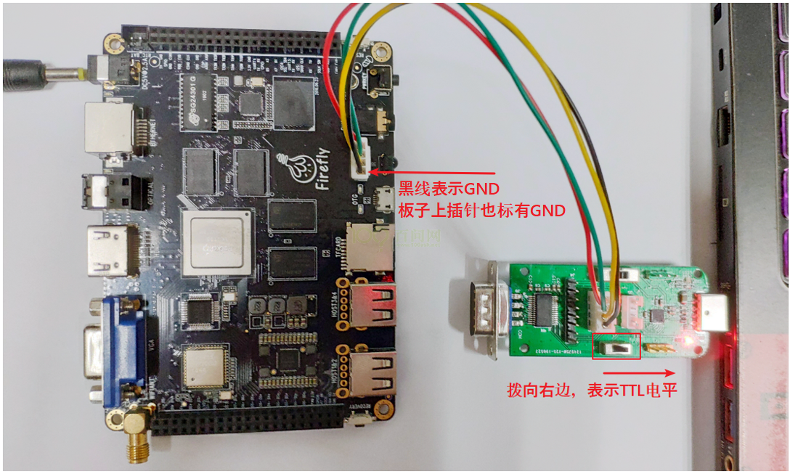

  其中特别需要注意的几点：
    ①串口模块的电平选择开关拨到如图所示的右边，表示切换到TTL电平；
    ②串口模块附赠两条排线，使用较宽的那根(2.54mm间距)连接串口模块最中间接口；
    ③排线的另一端插在Firefly-RK3288如图所示位置，注意黑线(GND)在最下面；
    ④板子如图所示准备好配套的电源，因为没有电源开关，插上就自动启动了，所以暂时先不插电源

  将USB转RS232/TTL串口模块插在电脑USB上时，Windows会自动安装驱动(安装可能比较慢，等一分钟左右)。
  打开电脑的“设备管理器”，在“端口 (COM和LPT)”项下，可以看到如下图 中的“Silicon Labs CP210x USB to UART Bridge (COM12)”。
  这里的“COM12”可能与你电脑上的不一样，记住你电脑上设备管理器中显示的数字。

  如果电脑没有显示出端口号，就需要手动安装驱动，从[驱动精灵](https://book.100ask.net/source/chapterthird/www.drivergenius.com)官网下载一个驱动精灵，安装、运行、检测，会自动安装上串口驱动。


  最后打开MobaXterm，点击左上角的“Session”，在弹出的界面选中“Serial”，如下图所示设置端口号（前面设备管理器显示的端口号）、波特率（Speed:115200）、流控（Flow control:None）,最后点击“OK”即可。
  注意：流控（Flow Control）一定要选择none，否则你将无法在MobaXterm中向串口输入数据。


  随后显示一个黑色的窗口， 此时打开板子的电源开关，将收到板子串口发过来的数据，如下图所示：

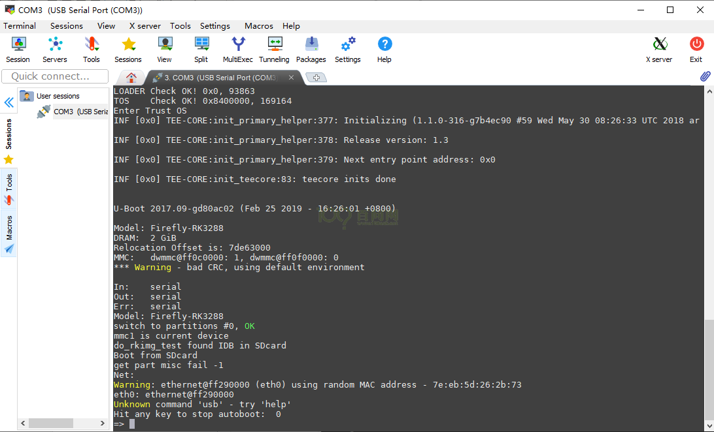

#### 启动方式选择

  Firefly-rk3288开发板没有启动方式选择开关，rk3288芯片会优先从板上Flash启动，如果失败再从SD卡启动。
  板上有电源开关，复位开关，各个功能也标有文字：

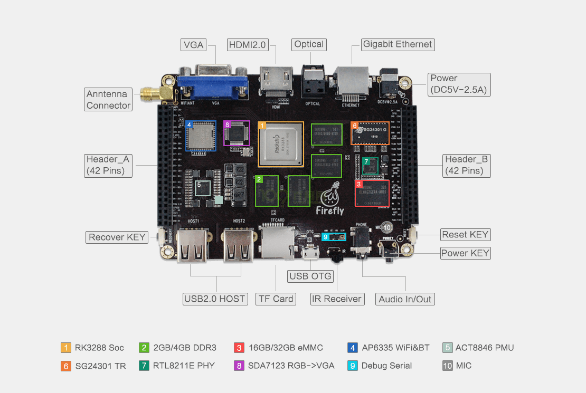

### roc-rk3399-pc开发板

#### 串口连接

  将串口模块与电脑USB口、板子UART口连接：

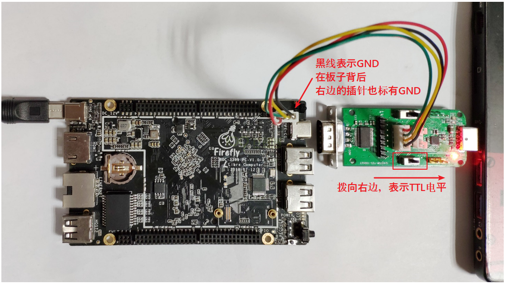

  其中特别需要注意的几点：
    ① 串口模块的电平选择开关拨到如图所示的右边，表示切换到TTL电平；
    ② 串口模块附赠两条排线，使用较宽的那根(2.54mm间距)连接串口模块最中间接口；
    ③ 排线的另一端插在Firefly-RK3288如图所示位置，注意黑线(GND)在最右面；
    ④ 板子如图所示准备好配套的电源，因为没有电源开关，插上就自动启动了，所以暂时先不插电源

  将USB转RS232/TTL串口模块插在电脑USB上时，Windows会自动安装驱动(安装可能比较慢，等一分钟左右)。
  打开电脑的“设备管理器”，在“端口 (COM和LPT)”项下，可以看到如下图 中的“Silicon Labs CP210x USB to UART Bridge (COM12)”。
  这里的“COM12”可能与你电脑上的不一样，记住你电脑上设备管理器中显示的数字。

  如果电脑没有显示出端口号，就需要手动安装驱动，从[驱动精灵](https://book.100ask.net/source/chapterthird/www.drivergenius.com)官网下载一个驱动精灵，安装、运行、检测，会自动安装上串口驱动。


  最后打开MobaXterm，点击左上角的“Session”，在弹出的界面选中“Serial”，如下图所示设置端口号（前面设备管理器显示的端口号）、波特率（Speed:115200）、流控（Flow control:None）,最后点击“OK”即可。
  注意：流控（Flow Control）一定要选择none，否则你将无法在MobaXterm中向串口输入数据。


  随后显示一个黑色的窗口， 此时打开板子的电源开关，将收到板子串口发过来的数据，如下图所示：


#### 启动方式选择

  Firefly的roc-rk3399-pc开发板上没有启动方式选择开关，板子上也没有Flash。所以它只能使用SD卡启动。如果你买了它的EMMC Flash模块，那么RK3399优先从Flash启动，如果失败再从SD卡启动。
  板上有电源开关，各个功能也标有文字：

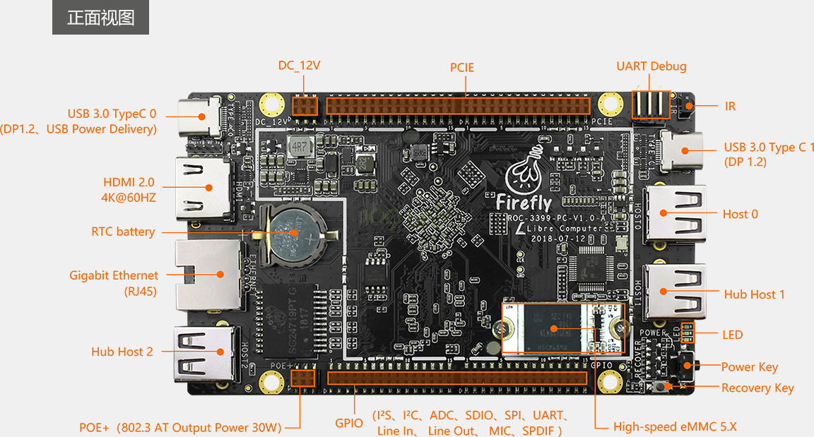

### IMX6ULL开发板

  如果你使用的是野火或正点原子的IMX6ULL开发板，请参考它们的手册接线。
  如果你使用的是百问网IMX6ULL-QEMU虚拟开发板，无需接线。

  野火、正点原子用的内核版本是4.1.15，
  我们用的内核版本是linux 4.9.88，
  都是4.x版本，在学习上没有任何差别。
  你拿到板子后，可以使用他们出厂的系统，
  也可以根据我们提供的高级用户手册更改为我们的系统，高级手册都存放在WIKI中：打开http://wiki.100ask.net，查看左侧开发板，点击进去即可，如下图所示：

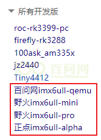

  百问网IMX6ULL-QEMU虚拟开发板的使用也很简单，打开WIKI首页后，点击类似上图的“百问网imx6ull-qemu”进去，即可看到使用方法。

## 系统烧写

  有的开发板配有Flash，出厂时已经烧好系统，那么本章可以先跳过。
  有的开发板没有Flash，需要你在SD卡上烧好系统，然后使用SD卡启动板子，则需要阅读本章内容。
  如果你想重烧系统、更新系统，也需要阅读本章内容。

### 100ASK_IMX6ULL 开发板

  本节主要介绍百问网imx6ull的三种启动方式，分别是：
    ① 板载emmc启动
    ② TF卡启动
    ③ nfs网络挂载方式启动。
  其中可用于TF卡启动的系统有两个，一个是基于buildroot构建的根文件系统，另一个是基于arm架构的Ubuntu发行版系统，用户可以根据自己的需要选择适合自己的进行安装。
  本章需要使用的软件：

```
 win32diskimager-1.0.0-install.exe
```

  100ask_imx6ull开发板支持TF卡、Emmc三种启动方式。使用Nand Flash/Emmc启动之前，如果Emmc上没有可用的系统，则要借助mfgTools把系统烧写到Emmc上。
  SD卡启动、Emmc启动，是二选一，只能选择一个。
  注意: 使用开发板启动系统前需要先设置拨码开关为对应的启动方式。

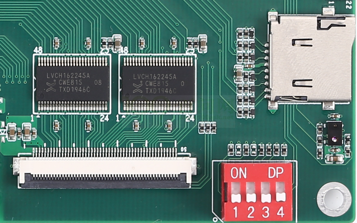

  如上图红框位置为拨码开关，拨码开关的一侧会写着ON 字样，把拨码调至该侧表示对应的选项为高电平1，调至另一侧为0。不同启动方式的见下面表格，也可以直接查看开发板上的丝印说明（一般印在板子背面），表中的X 表示任意电平均可。
+——+——+——+——+——+
| 名称 | SW1 | SW2 | SW3 | SW4 |
+======+======+======+======+======+
|EMMC|OFF|OFF|ON|OFF|
+—-+—+—+–+—+
|SD|ON|ON|ON|OFF|
+—-+—+—+–+—+
|USB|X|X|OFF|ON|
+—-+—+—+–+—+

  开发板上电后会根据拨码开关的状态从不同的存储器加载代码运行，故上电前需要根据自己开发板使用的存储器进行配置，如Emmc核心板就配置为0010，其它依次类推。
  其中的USB 启动模式主要用来配合NXP 官方的mfgtool 工具烧录镜像。

#### Emmc启动

##### 设置开发板启动方式为usb启动

  请参考开发板背面设置启动方式为usb下载模式，设置为0001，注意使用usb下载方式需要先将SD卡取下。

##### 连接开发板下载口至电脑

  使用包装盒配套的micro usb线一端连接到开发板usb otg口另一端连接至电脑usb接口处。
  usb下载接口位置示意图：

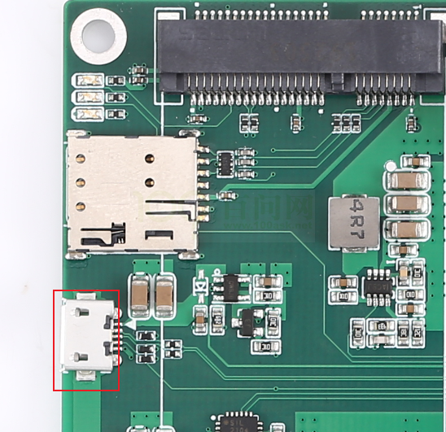

##### 运行mfgtools

  解压缩资料光盘目录下 02_Images\Emmc\100ask_imx6ull-mfgtools.zip到任意文件夹。
  进入解压缩后的100ask_imx6ull-mfgtools文件夹下，双击buildroot-image-100ask_100ask-ddr512m-emmc4g.vbs打开烧写程序，烧写过程中保持usb连接。
    usb otg链接成功示意图，连接成功后点击start按钮开始烧写

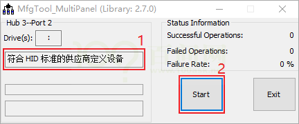

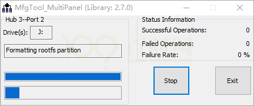

    系统烧写中示意图(烧写完成后点击Stop，再点击Exit即可退出)

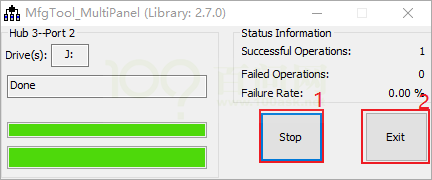

  设置开发板启动方式为Emmc启动即可,(启动方式设置在开发板背面印有丝印说明)

#### SD卡启动

##### 安装映象烧写工具 win32diskimager

  安装资料光盘下01_tools/ win32diskimager-1.0.0-install.exe软件，以后运行它时要“以管理员身份运行”。

##### 烧写映像文件

  1) 把SD卡通过读卡器插入电脑
  2) 使用win32diskimager烧写映像文件sdcard.img
  “以管理员身份运行”win32diskimager，如下图选择SD卡、选择映像文件sdcard.img，然后点击“写入”,操作步骤如下图4.2.2.1所示：
  镜像文件烧写示意图：

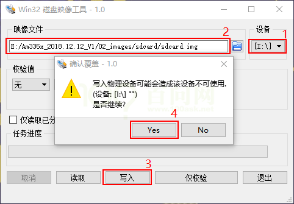

  上图中各序号含义为：
    1. 选择SD卡
    2. 选择映象文件sdcard.img
    3. 点击“写入”
    4. 确定要写入。
  烧写成功后，弹出对话框“写入成功”，此时点击OK，拔下SD卡，将启动开关拨到SD卡处，上电启动开发板。

#### NFS ROOT启动

  Buildroot编译完成之后生成的rootfs.tar.gz，可以解压之后放到NFS服务器上作为NFS ROOT文件系统供开发板使用。使用NFS文件系统，便于程序的开发调试。所谓NFS服务器，就是我们在VMWare上运行的Ubuntu。
  使用NFS文件系统时，我们一般还会在u-boot使用tftpboot命令从ubuntu中下载内核文件zImage，所以ubuntu上既要配置NFS服务，也要配置TFTP服务。
  推荐: 使用如下命令一键配置/初始化开发环境，在后续实验中，不受搭建环境的影响。(此脚本只支持ubuntu-16.04 /ubuntu-18.04)

##### 安装TFTP服务端:

  在ubuntu中执行以下命令安装TFTP服务：

```
	book@100ask:~$ sudo apt-get install tftp-hpa tftpd-hpa
```

  然后，创建TFTP服务器工作目录,并打开TFTP服务配置文件,如下:

```
	book@100ask:~$ mkdir -p /home/book/tftpboot
	book@100ask:~$ chmod 777 /home/book/tftpboot
	book@100ask:~$ sudo vim /etc/default/tftpd-hpa
```

  在配置文件/etc/default/tftpd-hpa中，添加以下字段：

```
	TFTP_DIRECTORY="/home/book/tftpboot"
	TFTP_OPTIONS="-l -c -s"
```

  最后，重启TFTP服务:

```
	book@100ask:~$ sudo service tftpd-hpa restart
```

##### 安装NFS服务:

  NFS即网络文件系统，允许开发板直接通过网络挂载PC机中的文件夹。下面介绍在ubuntu上的NFS服务安装和配置。
  首先，执行以下命令安装NFS服务：

```
	book@100ask:~$ sudo apt-get install nfs-kernel-server
```

  然后编辑/etc/exports文件，添加NFS服务导出的工作目录：

```
	book@100ask:~$ sudo vim /etc/exports
```

  添加NFS目录：下面以/home/book/rootfs为例，将其添加到/etc/exports文件中, 如下：

```
	/home/book/nfs_rootfs *(rw,nohide,insecure,no_subtree_check,async,no_root_squash)
```

  最后，重启NFS服务:

```
	book@100ask:~$ sudo service nfs-kernel-server restart
```

  如果一切正常，可以在ubuntu中测试NFS服务：

```
	book@100ask:~$ sudo mount -t nfs 127.0.0.1:/home/book/nfs_rootfs /mnt
```

##### 在ubuntu中准备好文件

  可以在U-Boot中通过tftpboot命令从ubuntu中下载内核文件zImage 100ask_imx6ull-14x14 .dtb，可以设置内核的启动参数让单板启动后通过NFS挂载ubuntu中的某个目录作为根文件系统。
  注意：所谓根文件系统就是类似Windows的C盘，里面存放有必须的APP、库文件、配置文件。通过NFS可以把Ubuntu的某个目录，当作板子的“C盘”──Linux中称之为根文件系统。
  在操作单板之前，需要在ubuntu上准备好这些内容：zImage、100ask_imx6ull-14x14 .dtb、nfs_rootfs文件夹。

    1) 拷贝内核和设备树文件到tftp目录：
    将出厂镜像或者自行编译的zImage和设备树文件100ask_imx6ull-14x14 .dtb，拷贝到ubuntu的 /home/book/tftpboot 目录。
  2) 把根文件系统压缩包解压到NFS目录：
    把使用buildroot构建得到的根文件系统nfs_rootfs/rootfs.tar.gz，复制、解压到ubuntu的/etc/exports文件中指定的目录里，即复制到/home/book目录下，得到/home/book/nfs_rootfs下众多文件：

```
	book@100ask:~/100ask_imx6ull-sdk/buildroot2019.02/output/images$ cp -rf nfs_rootfs/ ~
	book@100ask:~/100ask_imx6ull-sdk/buildroot2019.02/output/images$ cd ~/nfs_rootfs
	book@100ask:~/nfs_rootfs$ sudo tar -zxvf rootfs.tar.gz
```

##### 在u-boot中通过网络启动单板

  既然要使用网络启动单板，那么双方(开发板、ubuntu)就要确保网络是联通的，假设ubuntu的IP为192.168.1.132，开发板的IP为192.168.1.112。
  首先，在U-boot中设置开发板IP为192.168.1.112, 如下:

```
	># setenv ipaddr 192.168.1.112
```

  然后，在U-boot中使用ping命令测试开发板与NFS服务器是否连通(出现“alive”就表示联通):

```
	# ping 192.168.1.1
```

  最后，在U-Boot控制台执行以下命令启动单板:

```
	># setenv serverip 192.168.1.132
	># setenv ipaddr 192.168.1.112
	># setenv rootpath /home/book/rootfs,vers=3
	># run netboot
```

### 100ASK_AM335X开发板

  100ASK_AM335X开发板配有Flash，出厂时已经烧好系统，可以先跳过本章。

#### NandFlash启动/更新系统

##### 格式化SD卡

  进入资料光盘01_tools目录，右键以管理员权限运行HP USB Disk Storage Format Tool 2.0.6.EXE程序，来格式化SD卡。

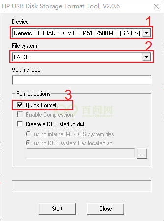

    ① 选择需要格式化的sd卡
    ② 选择sd卡文件系统类型为FAT32
    ③ 选中Quick Format(快速格式化)
    ④ 点击 start开始格式化
    注意：如果点击start 格式化提示错误，则点击确定再次start就可以了。

##### 更新系统

  拷贝资料光盘目录下的nandflash_system下所有文件到格式化好的SD卡中。

  把SD卡插到开发板上，并设置启动方式为mmc启动，打开终端，开发板上电，串口有输出时按下任意键即可进入uboot参数设置界面,如下所示

```
	U-Boot SPL 2016.05 (Jun 11 2019 - 05:46:58)   
	PMIC detected:TPS65217   
	Trying to boot from MMC1   
	reading u-boot.img   
	reading u-boot.img   
   
	U-Boot 2016.05 (Jun 11 2019 - 05:46:58 -0400)   
	CPU  : AM335X-GP rev 2.1   
		Watchdog enabled   
	I2C:   ready   
	DRAM:  512 MiB   
	NAND:  512 MiB   
	MMC:   OMAP SD/MMC: 0, OMAP SD/MMC: 1   
	*** Warning - bad CRC, using default environment   
   
	Net:   cpsw   
	Press SPACE to abort autoboot in 2 seconds   
	100ask# run updatesys   
	100ask#   
```

  此时输入 run updatesys

```
	NAND erase.chip: device 0 whole chip   
	Skipping bad block at  0x0ba60000   
	Erasing at 0x1ffe0000 -- 100% complete.   
	OK   
	switch to partitions #0, OK   
	mmc0 is current device   
	reading MLO   
	51400 bytes read in 8 ms (6.1 MiB/s)   
	HW ECC BCH8 Selected   
   
	NAND write: device 0 offset 0x0, size 0xc8c8   
	51400 bytes written: OK   
	reading 100ask-am335x.dtb   
	42526 bytes read in 10 ms (4.1 MiB/s)   
	HW ECC BCH8 Selected   
   
	NAND write: device 0 offset 0x80000, size 0xa61e   
	42526 bytes written: OK   
	reading u-boot.img   
	434896 bytes read in 31 ms (13.4 MiB/s)   
	HW ECC BCH8 Selected   
   
	NAND write: device 0 offset 0xc0000, size 0x6a2d0   
	434896 bytes written: OK   
	reading zImage   
	5239760 bytes read in 289 ms (17.3 MiB/s)   
	HW ECC BCH8 Selected   
   
	NAND write: device 0 offset 0x200000, size 0x4ff3d0   
	5239760 bytes written: OK   
	reading rootfs.ubi   
	134742016 bytes read in 7306 ms (17.6 MiB/s)   
	SW ECC selected   
   
	NAND write: device 0 offset 0xa00000, size 0x8080000   
	134742016 bytes written: OK   
	nand flash system update OK!   
```

  如上所示，直到系统打印nand flash system update OK!，表示系统烧录nandlflash成功。
  此时可以关闭开发板电源，拔出SD卡,设置启动方式为nand启动，开发板重新上电即可。

#### SD卡启动

##### 格式化sd卡

  首先安装资料光盘下01_tools/SD Card Formatter 5.0.1 Setup.exe软件，安装完成后打开。
  然后把SD卡通过读卡器接到电脑上，使用SdCardFormatter格式化SD卡，格式化步骤如下如所示：

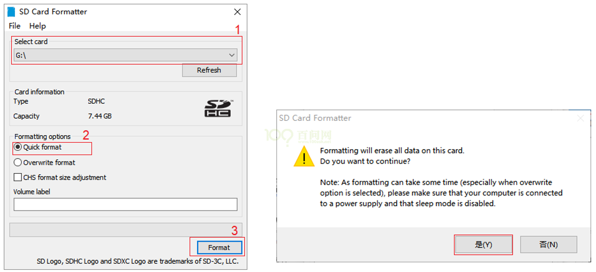

    ① 选择要格式化的SD卡，选中“Quick format”；
    ② 在弹出的对话框中点击“是(Y)”；
    ③ 等待格式化完成，完成时会看到如下图的提示：

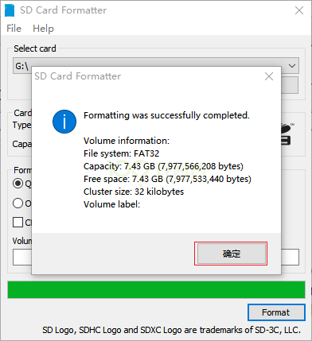

##### 烧写sd卡系统镜像

  首先安装资料光盘下01_tools/ win32diskimager-1.0.0-install.exe软件，安装完成后打开。
  然后使用wind32diskimage烧写编译后的系统镜像，烧写步骤如下所示：

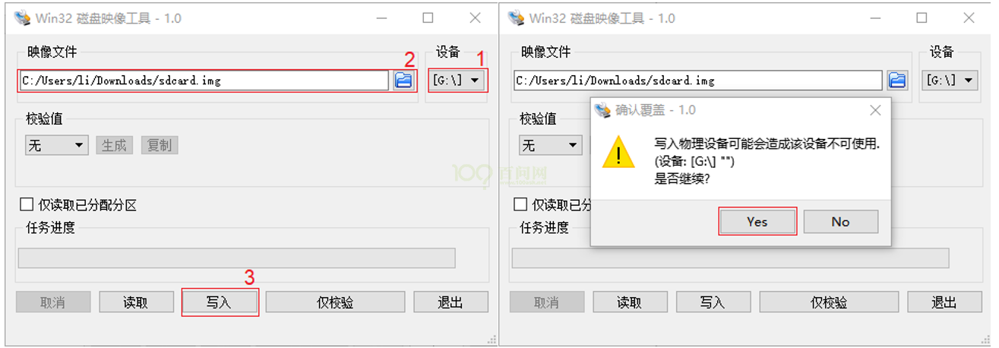

    ① 选中需要烧写的SD卡设备，点击文件图标选择系统镜像文件，点击写入按钮开始烧写
    ② 在弹出的对话框中，点击Yes按钮继续烧写, 等待烧写完成，会看到如下提示：

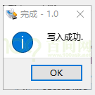

  烧写成功后，拔下SD卡，将启动开关拨到SD卡处，上电启动开发板。

### Firefly-rk3288开发板

  用户拿到全新的Firefly-RK328开发板时，默认系统为Firefly提供的Android系统，为了使用本教材，需要用户先破坏原来的系统，然后再使用SD卡烧写我们提供的系统。
  参考前面Firefly-rk3288串口模块连接实物图，将开发板、串口模块、电脑连接起来。打开MobaXtermr软件的串口界面，插上电源，等待一会，按下键盘“Enter”键，待串口显示“shell@firefly:/ $”则表示进入了系统，接着输入以下三个命令：

```
	shell@firefly:/ $ su   
	shell@firefly:/ # mkdosfs  /dev/block/mmcblk0   
	shell@firefly:/ # sync   
```

  操作效果如下图所示，红色下划线部分为输入命令，操作完成后，即可破坏板上系统，然后就可以根据后面内容烧写SD卡、使用SD卡启动了。

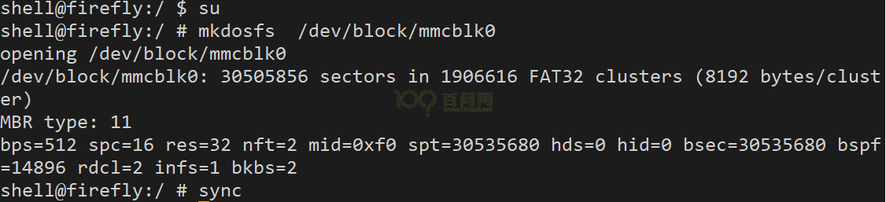

#### SD卡启动

##### 格式化sd卡

  首先安装资料光盘下01_tools/SD Card Formatter 5.0.1 Setup.exe软件，安装完成后打开。
  然后把SD卡通过读卡器接到电脑上，使用SdCardFormatter格式化SD卡，格式化步骤如下如所示：


    ① 选择要格式化的SD卡，选中“Quick format”；
    ② 在弹出的对话框中点击“是(Y)”；
    ③ 等待格式化完成，完成时会看到如下图的提示：


##### 烧写sd卡系统镜像

  首先安装资料光盘下01_tools/ win32diskimager-1.0.0-install.exe软件，安装完成后打开。
  然后使用wind32diskimage烧写编译后的系统镜像，烧写步骤如下所示：


    ① 选中需要烧写的SD卡设备，点击文件图标选择系统镜像文件，点击写入按钮开始烧写
    ② 在弹出的对话框中，点击Yes按钮继续烧写, 等待烧写完成，会看到如下提示：


  烧写成功后，拔下SD卡，将启动开关拨到SD卡处，上电启动开发板。

### roc-rk3399-pc 开发板

Roc-rk3399-pc开发板本身没有Flash；如果你买了配套的EMMC Flash模块，如需使用emmc启动请参考firefly官方文档。
本教程只使用SD卡启动。

#### SD卡启动

##### 格式化sd卡

  首先安装资料光盘下01_tools/SD Card Formatter 5.0.1 Setup.exe软件，安装完成后打开。
  然后把SD卡通过读卡器接到电脑上，使用SdCardFormatter格式化SD卡，格式化步骤如下如所示：


    ① 选择要格式化的SD卡，选中“Quick format”；
    ② 在弹出的对话框中点击“是(Y)”；
    ③ 等待格式化完成，完成时会看到如下图的提示：


##### 烧写sd卡系统镜像

  首先安装资料光盘下01_tools/ win32diskimager-1.0.0-install.exe软件，安装完成后打开。
  然后使用wind32diskimage烧写编译后的系统镜像，烧写步骤如下所示：


    ① 选中需要烧写的SD卡设备，点击文件图标选择系统镜像文件，点击写入按钮开始烧写
    ② 在弹出的对话框中，点击Yes按钮继续烧写, 等待烧写完成，会看到如下提示：


  烧写成功后，拔下SD卡，将启动开关拨到SD卡处，上电启动开发板。

#### IMX6ULL开发板

  如果你使用的是野火或正点原子的IMX6ULL开发板，请参考它们的手册接线。
  如果你使用的是百问网IMX6ULL-QEMU虚拟开发板，无需接线。

  野火、正点原子用的内核版本是4.1.15，
  我们用的内核版本是linux 4.9.88，
  都是4.x版本，在学习上没有任何差别。
  你拿到板子后，可以使用他们出厂的系统，
  也可以根据我们提供的高级用户手册更改为我们的系统，高级手册都存放在WIKI中：打开http://wiki.100ask.net，查看左侧开发板，点击进去即可，如下图所示：


  百问网IMX6ULL-QEMU虚拟开发板的使用也很简单，打开WIKI首页后，点击类似上图的“百问网imx6ull-qemu”进去，即可看到使用方法。

## 部件实验

### 100ASK_IMX6ULL 开发板

  开发板各个功能所在位置以及名称如下图所示，如下所有的功能测试均在串口登录终端下进行测试：

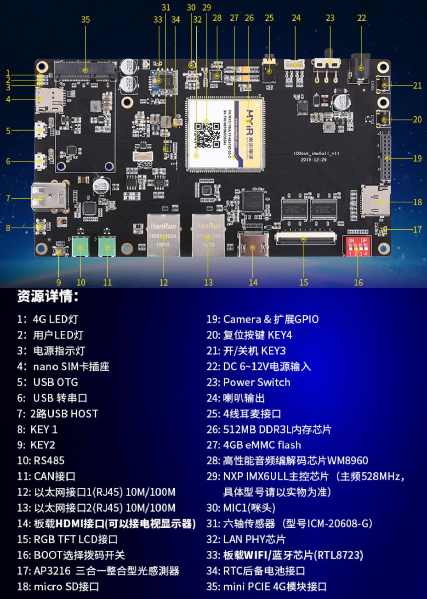

#### 有线网卡接口测试

  此节演示在串口终端下如何设置开发板的ip地址，测试网络的连通性。
  注意：既然是在开发板和电脑之间测试网络，那双方需要有网络连接。两者之间需要有一个路由器，开发板通过网线与路由器连接。而电脑与路由器之间，可以使用网线连接，也可以使用WIFI连接。

  网卡接口位置示意图

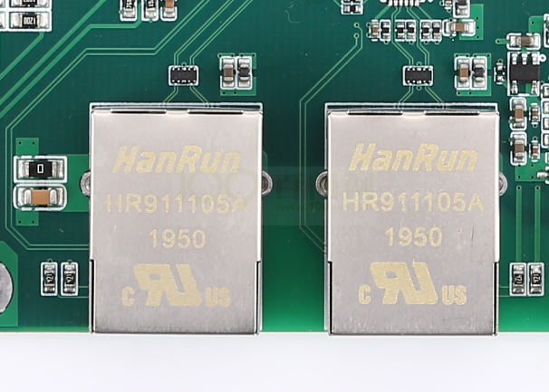

  1) 通过ifconfig命令查看ip地址：


  通过上图可知，开发板已经自动获得IP地址192.168.1.116(你的开发板自动获取的IP可能不一样)。
  如果开发板未能获取IP，则可以使用 udhcpc命令再次尝试获取IP。

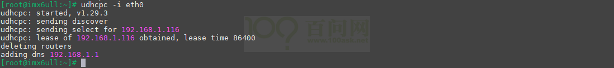

  如果通过udhcpc命令无法获得IP，也可以使用ifconfig命令强制设置IP：
  如下图使用 ifconfig 命令强制指定IP地址为192.168.1.17

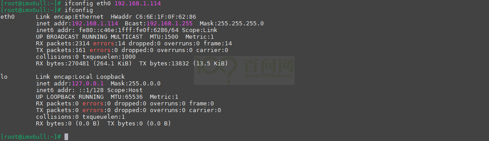

1. 网络连通性测试：   在开发板上执行如下命令，如果有数据返回则表示开发板跟互联网是连通的(前提是你的路由器是可以上网的)：

```
  [root@100ask_imx6ull:~]# ping www.baidu.com
```

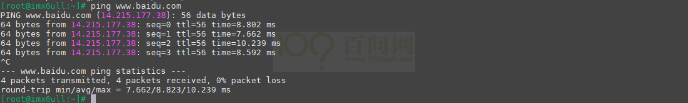

  当然，很多时候开发板不能正通互联网，这也没关系，只要能ping通我们的Windows、Ubuntu即可：
  比如我们的Ubuntu系统IP地址为192.168.1.11此时可以通过ping命令测试两者是否可以相互通信

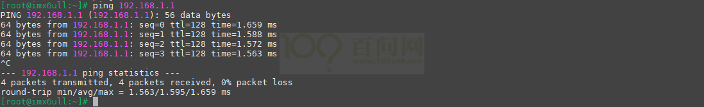

1. 使能网卡一接口   ifconfig -a查看都有那些网卡设备

```
  [root@100ask_imx6ull:~]# ifconfig -a
```

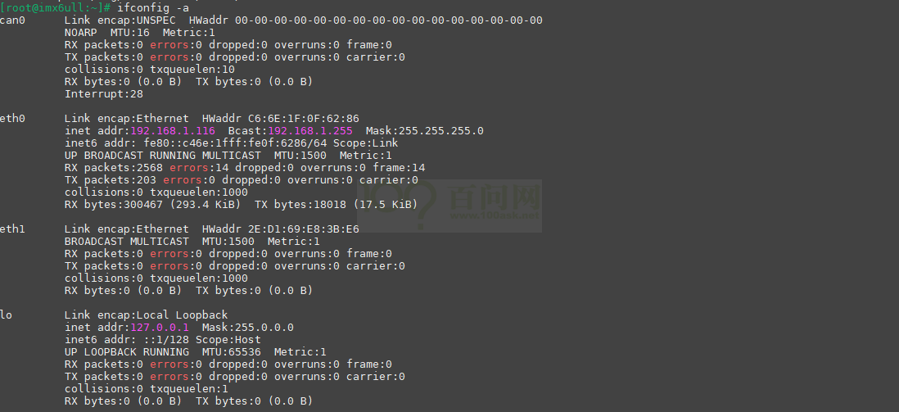

  启用 eth1网卡设备，并使用udhcpc自动获取ip地址

```
	[root@100ask_imx6ull:~]# ifconfig eth1 up
	[root@100ask_imx6ull:~]# udhcpc -i eth1
```

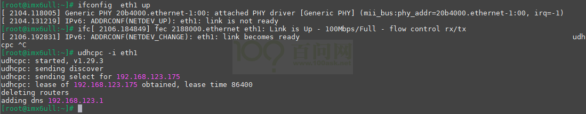

  参考链接：http://wiki.100ask.org/Category:Netdev

#### USB Host接口测试

  此节演示在终端下如何在USB Host接口上使用usb存储设备。
  注意：需要准备一个USB设备，比如U盘、USB蓝牙模块、usb网卡或者usb摄像头等。
  USB host接口位置示意图：

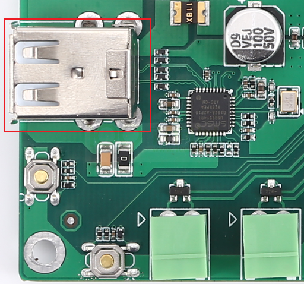

  下面使用一个16G的U盘作为例子，插到任意一个USB Host接口，会打印出如下设备信息：

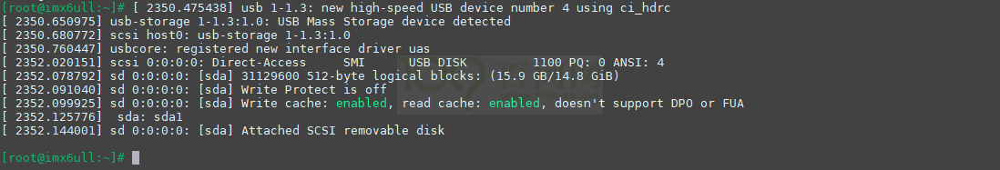

  通过打印的设备信息可知，系统为该usb存储设备创建的设备节点为 /dev/sda。一般来说/dev/sda对应整个U盘，/dev/sda1对应该U盘的第1个分区，/dev/sda2对应第2个分区。
  有些U盘没有划分分区，它只有一个设备节点/dev/sda，而没有/dev/sda1等节点。对于这种情况，/dev/sda既代表整个U盘，也代表第1个分区。
  我们可以挂载某个分区，挂载之前要先通过fdisk命令获取分区类型,如下所示：


  从上图可知/dev/sda2是FAT16格式，挂载时可以指定类型为“vfat”：

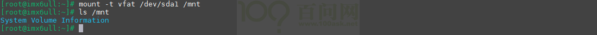

  测试完以后，通过umount卸载/mnt，才可拔下usb设备：

```
	[root@100ask_imx6ull:~]# umount /mnt
```

#### OTG接口测试

  此节演示如何测试OTG接口的两种模式，分别是device模式和host模式。
  注意：需要准备一个 OTG转接头(开发板清单中不配)、micro usb数据线(开发板清单里配有)。这2种设备如下图所示：
  OTG 转换头和 micro usb 线：

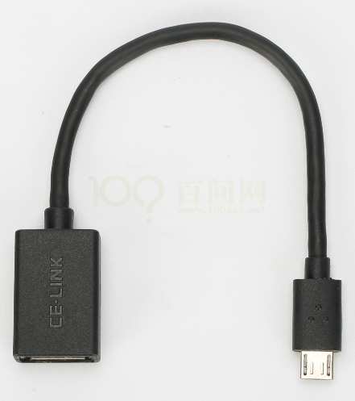

  1) otg device模式测试：
    开发板作为USB从设备，接到电脑上；电脑会把开发板识别为一个U盘。
    先执行以下命令：
[root@100ask_imx6ull:~]# modprobe g_mass_storage file=/dev/mmcblk0p1 removable=1

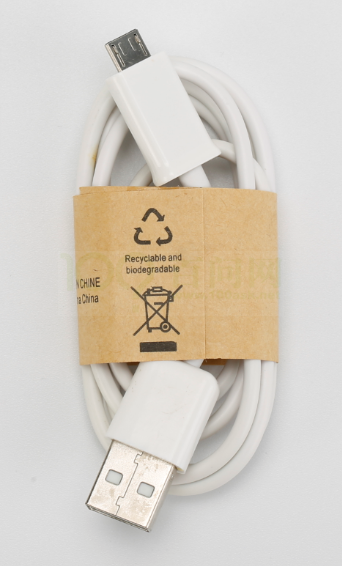

    然后使用micro usb线小的一头插入如下图5.3.1所示的蓝色框所在接口，另一端连接电脑USB接口，micro otg接口位置如下图 5.3.1所示：
    otg device模式连接示意图：

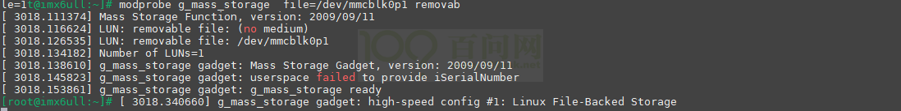

    此时在电脑的设备管理器中可以看到一个名为 linux File-Stor Gadget USB Device的磁盘设备，在windows资源管理器中也可以看到有新的可移动设备盘符弹出：

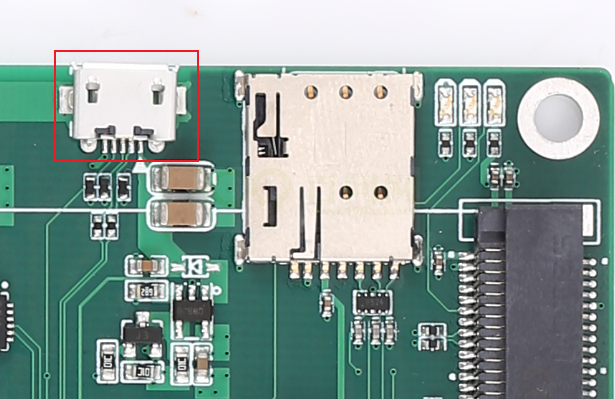

    测试完成后，在终端下执行“rmmod g_mass_storage ”卸载改模块驱动：

```
	[root@100ask_imx6ull:~]# rmmod g_mass_storage
```

  2) otg host模式：
    开发板作为usb主设备，其他USB设备通过otg转接头插入开发板，开发板即可识别出这些USB外设备。
    otg转接头连接示意图：

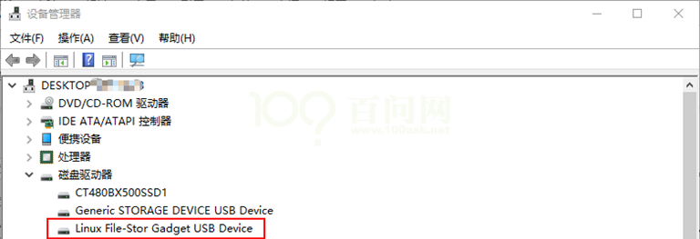

    下图是把U盘通过otg转接头插入开发板后，在串口打印的信息：

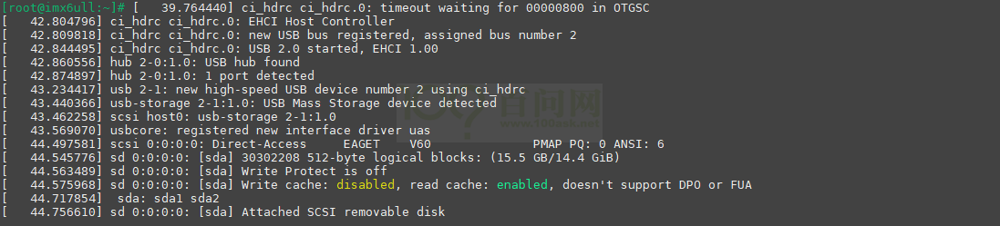

    通过打印的设备信息可知，系统为该usb存储设备创建的设备节点为 /dev/sda。一般来说/dev/sda对应整个U盘，/dev/sda1对应该U盘的第1个分区，/dev/sda2对应第2个分区。
    有些U盘没有划分分区，它只有一个设备节点/dev/sda，而没有/dev/sda1等节点。对于这种情况，/dev/sda既代表整个U盘，也代表第1个分区。
    我们可以挂载某个分区，挂载之前要先通过fdisk命令获取分区类型,如下所示：

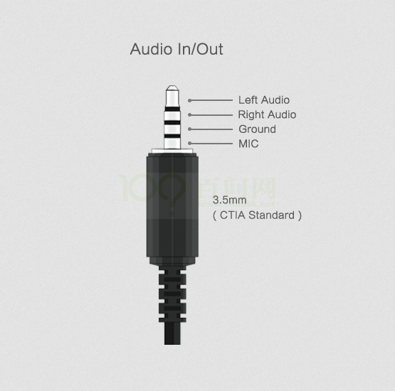

    从上图可知/dev/sda2是FAT16格式，挂载是可以指定类型为“vfat”：

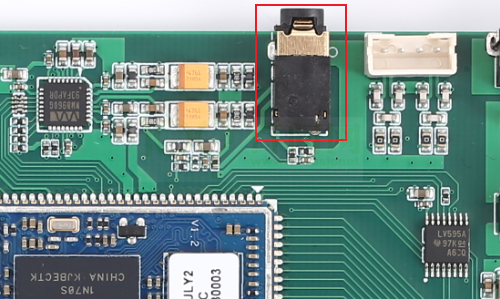

    测试完以后，通过umount卸载/mnt，才可拔下usb设备：

```
	[root@100ask_imx6ull:~]# umount /mnt
```

#### 耳机接口测试

  此节演示使用三段式耳机在100ask_imx6ull开发板上录制声音、播放音频。
  注意: 需要准备一个带麦克风的三段式耳机，如下图5.4.1所示：
  三段式耳机示意图与耳机连接位置示意图：

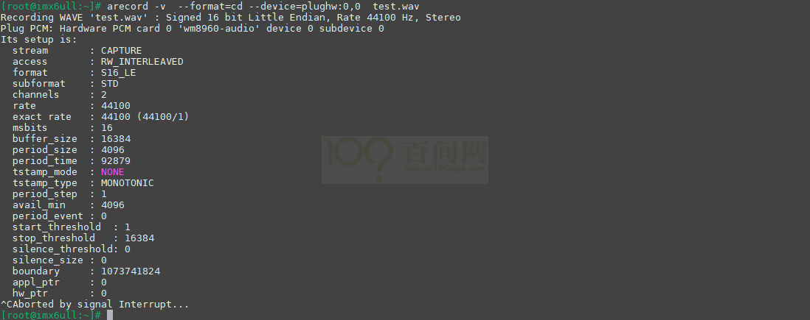

  1) 录制音频：     将耳机插入开发板耳机孔，使用如下命令进行录制(执行命令后，对着麦克风说话)：

```
	[root@100ask_imx6ull:~]# arecord -v --format=cd --device=plughw:0,0 test.wav
```

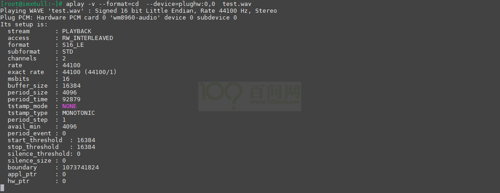

    参数讲解：
 + –format=cd ：设置格式为16 bit little endian, 44100, stereo
 + test.wav ：指定录音文件的名称以及格式。其中test是文件名称，wav是音频格式。支持的格式有wav、raw和au等。
  2) 播放音频：
    将耳机插入开发板耳机孔，使用aplay进行播放音频文件：

```
	[root@100ask_imx6ull:~]# aplay -v --format=cd --device=plughw:0,0 test.wav
```


    参数讲解：
 + –format=cd ：设置格式为16 bit little endian, 44100, stereo
 + test.wav ：指定录音文件的名称以及格式。其中test是文件名称，wav是音频格式。支持的格式有wav、raw和au等。
    还可以通过ssh登录开发板，将电脑中的wav格式的音频上传到开发板，再用用aplay进行播放。

#### LCD显示测试

  此节演示通过fb-test测试程序让lcd显示红绿蓝白4中颜色，用以观察lcd的显示效果。
  1) lcd显示红色：

```
	[root@imx6ull:~]# fb-test -r
	fb-test 1.1.0 (rosetta)
	fb res 1024x600 virtual 1024x600, line_len 4096, bpp 32
```


  2) lcd显示多种颜色：

```
	[root@imx6ull:~]# fb-test f
	fb-test 1.1.0 (rosetta)
	fb res 1024x600 virtual 1024x600, line_len 4096, bpp 32
```

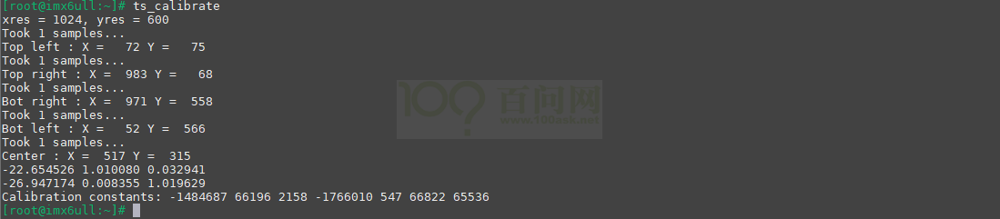

#### 触摸屏校准测试

  此节演示通过ts_calibrate程序校准触摸屏，用以验证触摸屏是否可用。
  在终端里运行 ts_calibrate 程序，此时就能看到lcd上依次弹出“+” 图标，依次点击此图标中心：

```
	[root@100ask_imx6ull:~]# ts_calibrate
```


  如果校准通过，最后会生成较准文件/etc/pointercal。
  这时，可以执行ts_test命令使用触摸屏来在LCD上画线。

#### 屏幕背光调节

  此节演示通过操作LCD在/sys目录下的对应文件，以实现查询、调节背光亮度。
  背光亮度的设置范围为 0～8，0表示最暗，8表示最亮。
  先通过cat命令查看当前背光亮度等级：

```
	[root@100ask_imx6ull:~]# cat /sys/class/backlight/backlight/brightness
```

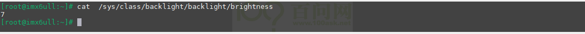

  最后设置背光亮度值为1，同时可以观察屏幕背光亮度是否有变化：

```
	[root@100ask_imx6ull:~]# echo 1 > /sys/class/backlight/backlight/brightness
```

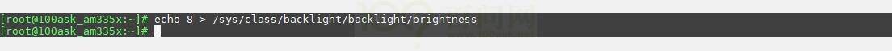

#### RTC测试

  此节演示通过使用date和hwclock命令设置系统时间、硬件时间，并测试当操作系统重启后，系统时钟与硬件时间是否同步。
  一般的板子都会有一个名为RTC(实时时钟)的硬件，RTC使用电池模块来供电，在系统关闭时用来维持时钟。RTC维持的时间，被称为硬件时间。
  rtc电池模块：

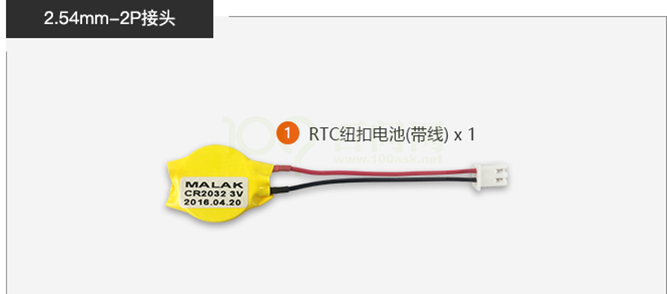

  RTC位置示意图，这里显示的是电池模块的安装位置：

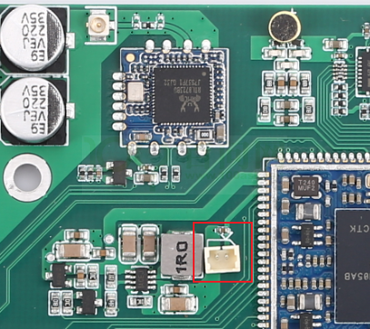

  Linux系统启动之后，它会自己维持时间，这个时间被称为系统时间。系统时间的初始值来源有二：
    ① 如果没有RTC，系统时间初始值为1970年1月1日0点0分0秒
    ② 如果有RTC，Linux启动后，系统时间初始值从RTC读取
  在实际使用过程中，要注意系统时间、硬件时间的同步问题：
    ① 使用date命令查看、设置系统时间，在设置系统时间后，要使用“hwclock -w” 命令同步到RTC；
    ② 使用hwclock查看、设置硬件时间，在设置硬件时间后，要使用“hwclock -s”命令同步到系统时间。
  注意：如果要使用RTC，要确保板子上已经安装了电池模块，模块购买地址请参考页面http://wiki.100ask.org/100ask_imx6ull 。

  以下命令是设置系统时间、并同步到RTC：

```
	[root@100ask_imx6ull:~]# date -s "2020-01-10 12:00:00"
	[root@100ask_imx6ull:~]# hwclock -w
```

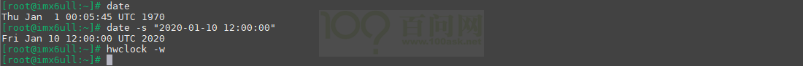

  一般不直接设置硬件时间，要设置硬件时间时，先使用date设置系统时间，再使用“hwclock -w”同步到RTC硬件。
  你使用date、hwclock命令设置好时间后，可以关闭开发板并等待一会后重启，再用date命令查看时间是否正常。

  对RTC硬件的操作使用hwclock命令，常见用法如下：
    hwclock -r ：显示硬件时钟与日期
    hwclock -s ：将系统时钟调整为与目前的硬件时钟一致。
    hwclock -w ：将硬件时钟调整为与目前的系统时钟一致。
  下面是一个示例，读取硬件时间：


#### 无线网卡设备测试

  1) 检查WLAN接口
    查看所有网络设备

```
	[root@100ask_imx6ull:~]# ifconfig -a
```

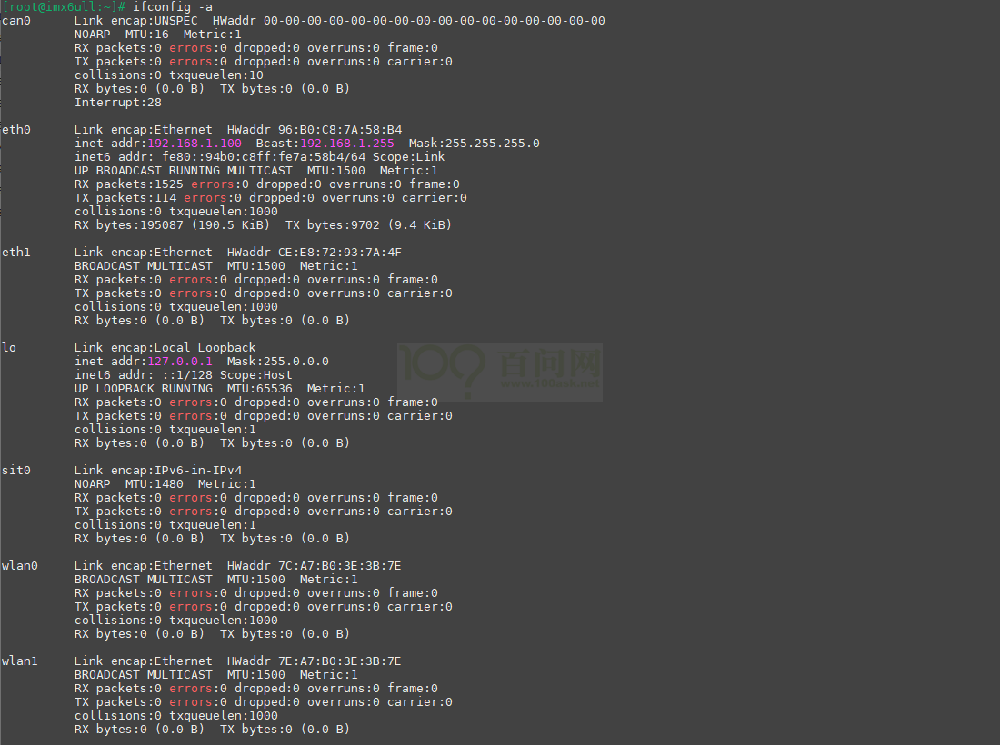

  2) 启用 wlan0 无线网络设备

```
	[root@100ask_imx6ull:~]# ifconfig wlan0 up
```

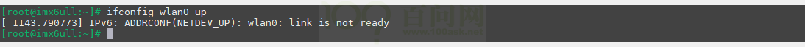

  3) 扫描周围网络设备

```
	[root@100ask_imx6ull:~]# iw dev wlan0 scan |grep SSID
```

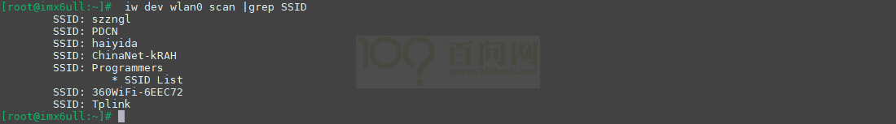

  4) 配置网络连接参数
    比如 我们连接到SSID为 Tplink的wifi设备，已知加密方式为WPA 密码为12345678

```
	[root@100ask_imx6ull:~]# wpa_passphrase Tplink 12345678 >> /etc/wpa_supplicant.conf
```

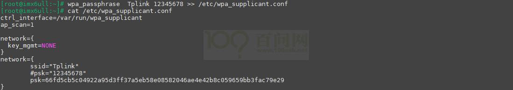

  5) 连接wifi设备

```
	[root@100ask_imx6ull:~]# wpa_supplicant -B -iwlan0 -c /etc/wpa_supplicant.conf
```


  6) 查看连接状态

```
	[root@100ask_imx6ull:~]# iw wlan0 link
```

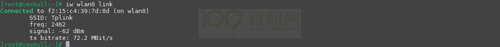

  7) 为wlan0获取ip地址

```
	[root@100ask_imx6ull:~]# udhcpc -i wlan0
```

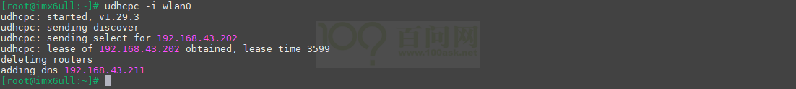

  8) 测试wlan0是否可以上网

```
	[root@100ask_imx6ull:~]# ping -I wlan0 www.baidu.com
```

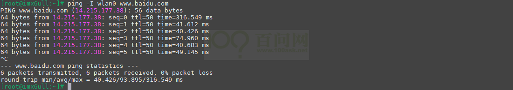

  参考资料 http://wiki.100ask.org/How_to_setup_wifi_connection

#### RS485测试

  此节演示使用rs485_test程序测试rs485接口。
  注意：rs485通信时需要2个rs485设备，使用3.5 15EDG 5P插拔式接线端子进行连接测试，以下测试是通过两块开发板进行测试，背面标有丝印 A B接口位置示意图，默认配置不含接线端子，请自行购买连接测试。
  RS485连接端子示意图:

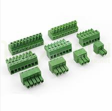

  RS485测试开发板连接位置示意图:

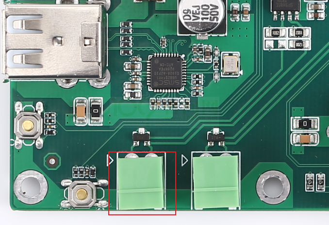

  1) 接收端：

```
	[root@100ask_imx6ull:~]# rs485_test -d /dev/ttyO2 -b 115200
```

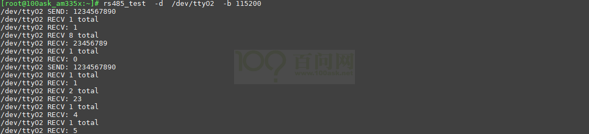

  2) 发送端：

```
	[root@100ask_imx6ull:~]# rs485_test -d /dev/ttyO1 -b 115200
```

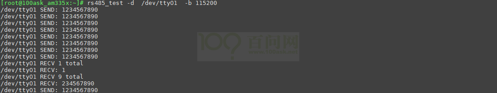

#### CAN功能测试

  此节主要演示使用两块开发板通过ip和can-utils命令测试can0的通信。
  CAN通信需要2个设备，本节使用两块100ask_imx6ull开发板做测试。你需要根据原理图找到CAN接口引脚，用3.5 15EDG 5P插拔式接线端子连接线连接两个CAN接口的H、L两条线，L H背面丝印有注明。用户也可以使用自己的Can设备进行测试。
  CAN接线端子:


  CAN测试开发板连接位置示意图:

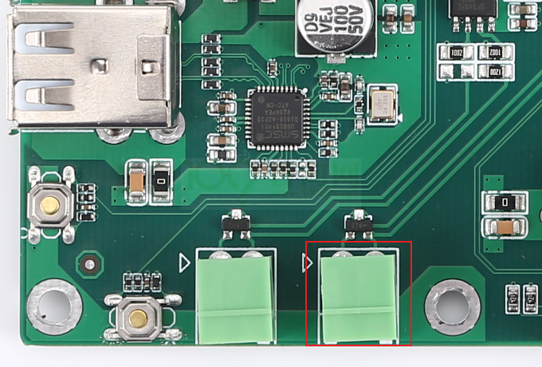

  1) 发送端：
    关闭can0接口：

```
	[root@100ask_imx6ull:~]# ip link set can0 down
```

    设置can0传输速率为50Kbits/sec：

```
	[root@100ask_imx6ull:~]# ip link set can0 type can bitrate 50000
```

    打印can0的信息：

```
	[root@100ask_imx6ull:~]# ip -details link show can0
```

    打开can0接口：

```
	[root@100ask_imx6ull:~]# ip link set can0 up
```

    使用cansend命令向另一端发送数据：

```
	[root@100ask_imx6ull:~]# cansend can0 123#DEADBEEF
	[root@100ask_imx6ull:~]# cansend can0 123#DEADBEEF
	[root@100ask_imx6ull:~]# cansend can0 123#DEADBE23
```

  下图是一个操作示例(建议等接收端设置好并执行candump命令之后，发送端再执行cansend命令)：

  2) 接收端
    关闭can0接口：

```
	[root@100ask_imx6ull:~]# ip link set can0 down
```

    设置can0传输速率为50Kbits/sec：

```
	[root@100ask_imx6ull:~]# ip link set can0 type can bitrate 50000
```

    打印can0的信息：

```
	[root@100ask_imx6ull:~]# ip -details link show can0
```

    打开can0接口：

```
	[root@100ask_imx6ull:~]# ip link set can0 up
```

    打印can0的接收到的数据：

```
	[root@100ask_imx6ull:~]# candump can0
```

#### 其它功能测试

  由于sdk文档不能实时更新，最新相关的测试文档请参考页面：http://wiki.100ask.org/100ask_imx6ull

### 100ASK_AM335X 开发板

  开发板各个功能所在位置以及名称如下图所示，如下所有的功能测试均在串口登录终端下进行测试：

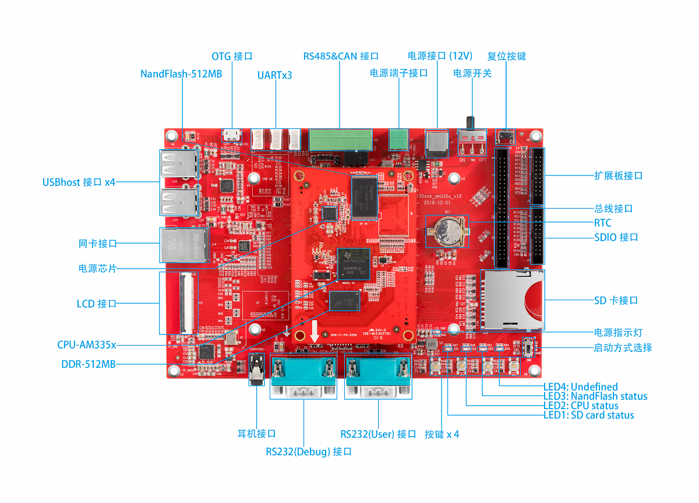

#### 网卡接口测试

  此节演示在终端下如何设置ip地址，测试网络的连通性，以及Http+Php的web环境可用性。
  注意:需要一个可以上网的路由器，并且路由器带有RJ45 LAN接口，准备开发板配套的网线，并将网线一端插到网卡接口处，另一端插到路由器(交换机) LAN 接口处。

  通过ifconfig 查看ip地址

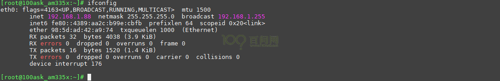

  通过上图得知已经自动获取IP地址，如未能获取则使用 udhcpc命令获取，如下图所示

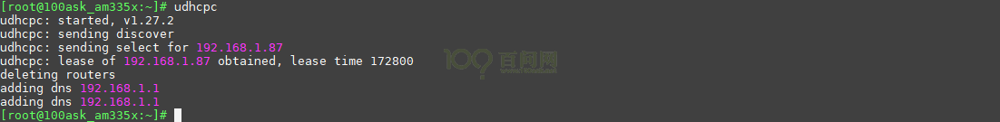

  网络连通性测试

```
	[root@100ask_am335x:~]# ping www.baidu.com    
```

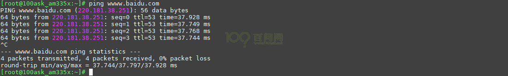

  **http+Php测试**
  其中 inet 后的192.168.1.87是路由分配给此网卡的IP地址，首先确保你的电脑和开发板处于同一个IP地址段，让后通过浏览器访问此IP，就能看到此开发板所支持的php特征描述

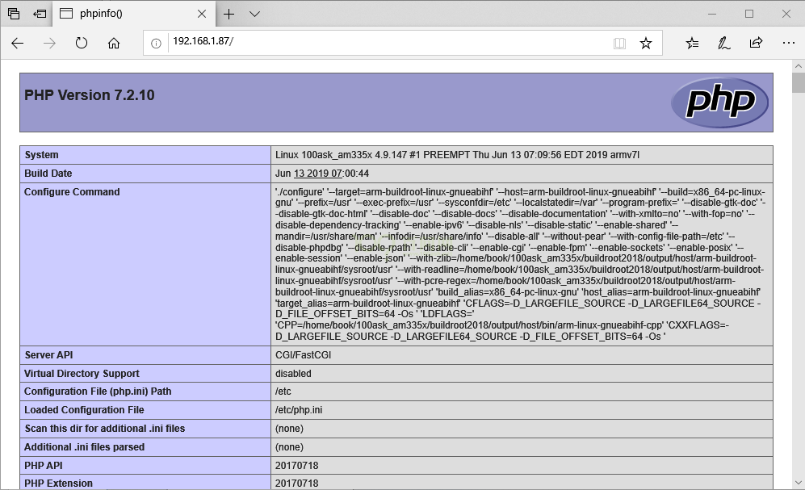

#### USBhost接口测试

  此节演示在终端下如何在USBhost接口上使用usb存储设备。
  注意: 需要准备一个usb2.0接口的设备，U盘，内核支持的USB蓝牙模块usb网卡或者usb摄像头等。

  如下使用一个16G的U盘作为示例，插到USBhost任意接口，会打印出如下设备信息。

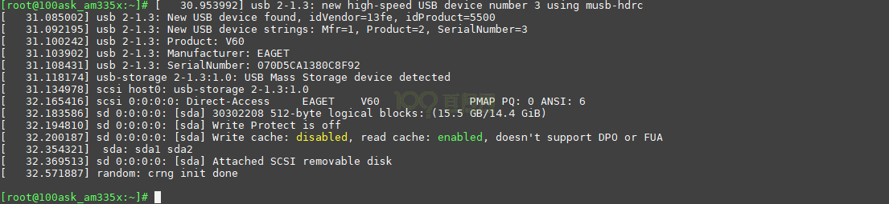

  通过打印的设备信息可知，系统为该usb存储设备创建的设备节点为 /dev/sda
  挂载相应的分区到mnt目录，需先通过fdisk命令获取分区类型,如下所示

```
	[root@100ask_am335x:~]# fdisk -l /dev/sda   
```

  通过fdisk查看u盘分区类型得到/dev/sda分区类型为linux所支持的文件系统类型，


```
	[root@100ask_am335x:/sys/class/leds]# mount -t vfat /dev/sda2 /mnt   
```

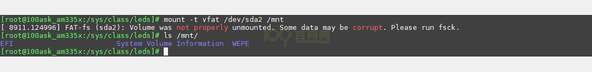

  测试完以后，通过umount卸载/mnt目录的挂载,才可拔下usb设备：

```
	[root@100ask_am335x:/sys/class/leds]# umount  /mnt   
```

#### OTG接口测试

  此节演示如何测试OTG接口的两种模式，分别是device模式和host模式。
  **注意**:需要准备一个 micro otg线，以及开发板配套的micro usb数据线，连接到开发板usb0接口上，具体位置请查看 开发板功能位置图

##### otg device模式测试

  usb作为从设备，被其它设备挂载,把sd卡的分区1挂在到PC机

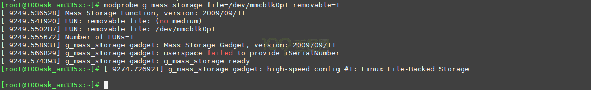


  此时在设备管理器中可以看到一个名为 linux File-Stor Gadget USB Device的磁盘设备，在windows资源管理器中也可以看到有新的可移动设备盘符弹出
  测试完成后，终端下执行rmmod g_mass_storage 卸载改模块驱动。

```
	[root@100ask_am335x:~]# rmmod g_mass_storage   
```

##### otg host模式

  usb作为主设备挂载其它设备)将micro usb otg转接线插入开发板，另一端接常见的usb设备

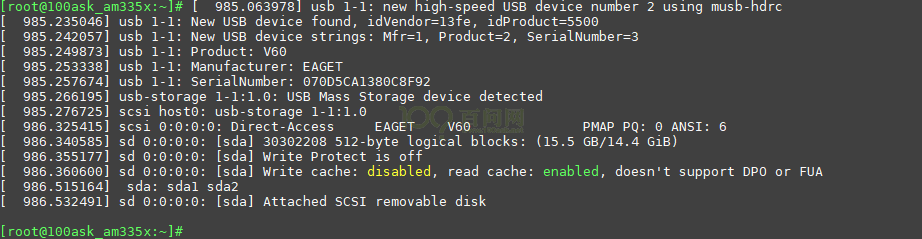

  通过打印的设备信息可知，系统为该usb存储设备创建的设备节点为 /dev/sda
  挂载相应的分区到mnt目录，需先通过fdisk命令获取分区类型,如下所示

```
	[root@100ask_am335x:~]# fdisk -l /dev/sda   
```

通过fdisk查看u盘分区类型得到/dev/sda2分区类型为linux所支持的文件系统类型，


```
	[root@100ask_am335x:/sys/class/leds]# mount -t vfat /dev/sda2 /mnt   
```


  测试完以后，通过umount卸载/mnt目录的挂载,才可拔下usb设备

```
	[root@100ask_am335x:/sys/class/leds]# umount  /mnt   
```

#### 耳机接口测试

  此节演示使用三段式耳机在100ask_am335x开发板上录制声音以及播放音频。
  **注意**: 需要准备一个带麦克风的三段式耳机耳机上带麦克风。

##### 录制音频测试

  将带麦克风的耳机或者独立供电的话筒插入耳机孔，使用如下命令进行录制。

```
	[root@100ask_am335x:~]# arecord -v  --format=cd --device=plughw:0,0  test.wav   
```

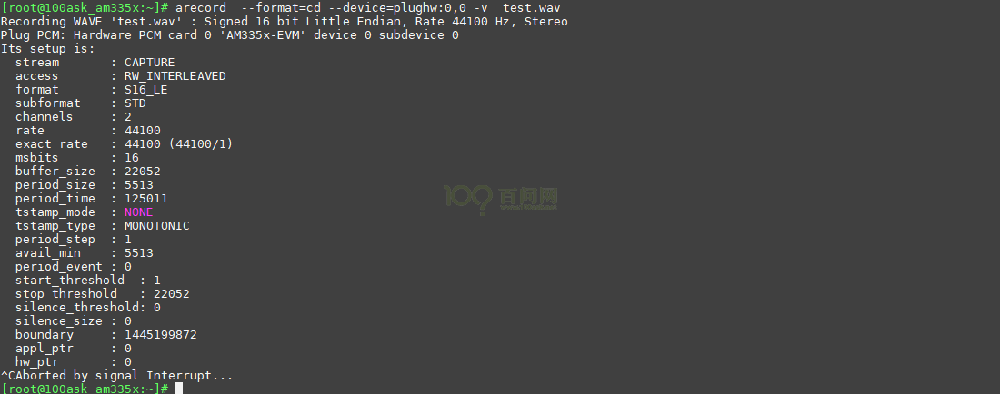

  参数讲解
     –format=cd 指的是16 bit little endian, 44100, stereo
     –device=plughw:0,0 指的是录音音频使用的声卡设备，如果有多个声卡设备，需要指定使用那个
     test.wav 指的是录制音频文件的名称以及格式，其中test是录音音频文件的名称， wav是音频格式，其中都支持(wav, raw or au)这些格式

##### 播放音频测试

  将三段式的耳机线或者音响的音频线插入开发板耳机接口处，通过aplay进行播放。

```
	[root@100ask_am335x:~]# aplay -v--format=cd  --device=plughw:0,0  test.wav   
```

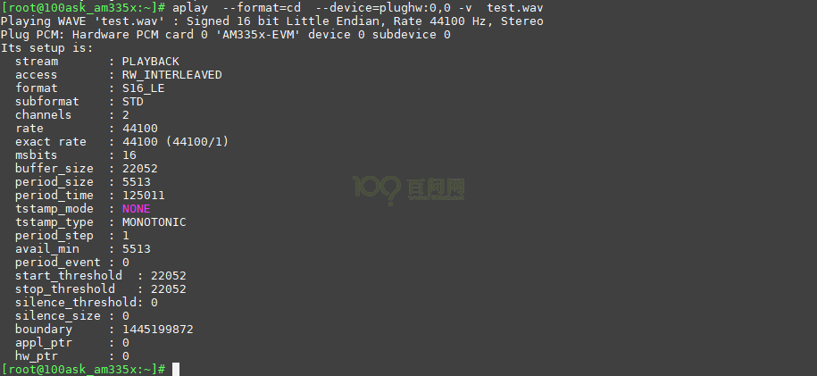

  参数讲解
     –format=cd 指的是16 bit little endian, 44100, stereo
     –device=plughw:0,0 指的是录音音频使用的声卡设备，如果有多个声卡设备，需要指定使用那个
     test.wav 指的是录制音频文件的名称以及格式，其中test是录音音频文件的名称， wav是音频格式，其中都支持(wav, raw or au)这些格式
  可以通过ssh登录开发板板将下载好的wav格式的音频上传至文件系统，用aplay进行播放。

#### LCD显示测试

  此节演示通过fb-test测试程序让lcd显示红绿蓝白4中颜色，用以观察lcd好坏。

##### lcd显示红色

```
	[root@100ask_am335x:~]# fb-test -r   
	fb-test 1.1.0 (rosetta)   
	fb res 480x272 virtual 480x272, line_len 960, bpp 16   
	[root@100ask_am335x:~]#   
```


##### lcd显示所有

```
	[root@100ask_am335x:~]# fb-test f   
	fb-test 1.1.0 (rosetta)   
	fb res 480x272 virtual 480x272, line_len 960, bpp 16   
	[root@100ask_am335x:~]#   
```


#### 触摸屏校准测试

  此节演示通过ts_calibrate程序校准触摸屏，用以验证触摸屏是否可用。
  终端下运行 ts_calibrate 程序。

```
	[root@100ask_am335x:~]# ts_calibrate   
```

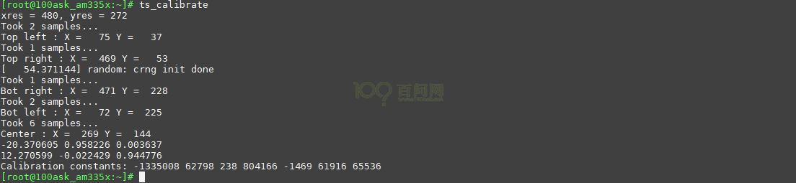

  此时就能看到lcd上依次弹出 + 图标，依次点击即可，最后会生成坐标文件存放在/etc目录下

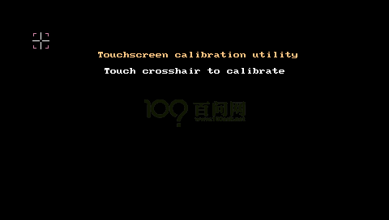

#### 屏幕背光调节

  此节演示通过echo 命令操作/sys目录来实现调节背光亮度。

  背光亮度的设置范围为 0 – 8 ,0表示最暗，8表示最亮。
  通过cat命令查看当前背光亮度等级。

```
	[root@100ask_am335x:~]# cat /sys/class/backlight/backlight/brightness   
```

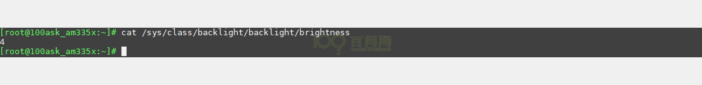

  查看背光最大亮度等级

```
	[root@100ask_am335x:~]# cat /sys/class/backlight/backlight/max_brightness   
```

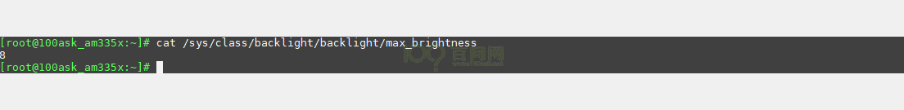

  设置当前背光亮度值为8，此时请注意观察屏幕背光亮度是否有变化。

```
	[root@100ask_am335x:~]# echo 8 > /sys/class/backlight/backlight/brightness   
```

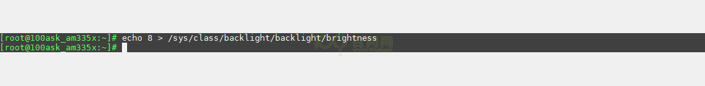

#### RTC测试

  此节演示通过使用date和hwclock工具设置软、硬件时间，测试当操作系统重启的时候，软件时钟读取RTC时钟是否同步（注意：确保板子上已经安装了纽扣电池）。

```
	[root@100ask_am335x:~]# date -s "2019-06-18 12:00:00"   
	[root@100ask_am335x:~]# hwclock -w   
```

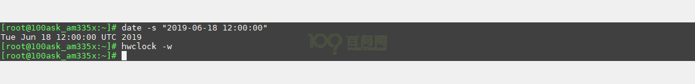

    hwclock –r 显示硬件时钟与日期
    hwclock –s 将系统时钟调整为与目前的硬件时钟一致。
    hwclock –w 将硬件时钟调整为与目前的系统时钟一致。

```
	[root@100ask_am335x:~]# hwclock -r   
```

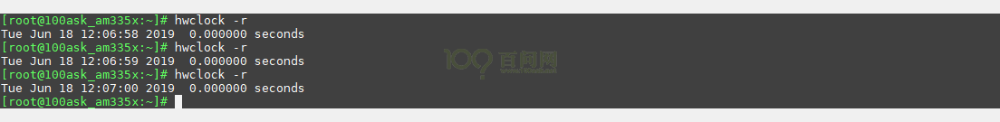

#### 按键测试

  此节演示通过hexdump命令以及dmesg命令来查看按键是否有反应。

```
	[root@100ask_am335x:~]# hexdump  /dev/input/event1   
```

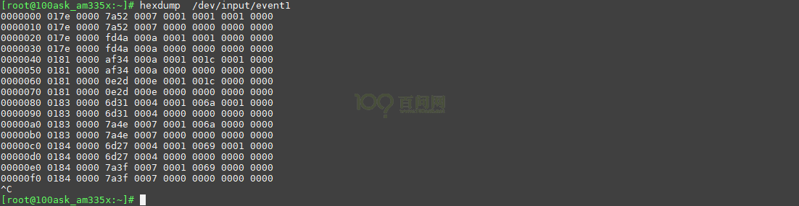

```
	[root@100ask_am335x:~]# dmesg | grep "Dev: input1"   
```

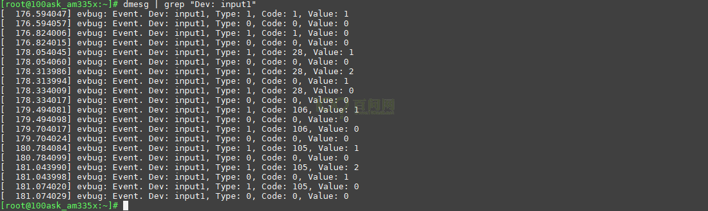

#### LED灯测试

  此节演示通过echo 命令来控制led状态灯的亮灭。
  **注意**: 默认led1 led2 led3灯已经定义为不同功能的状态灯，led4为设置为状态灯，可以自行操作
进入

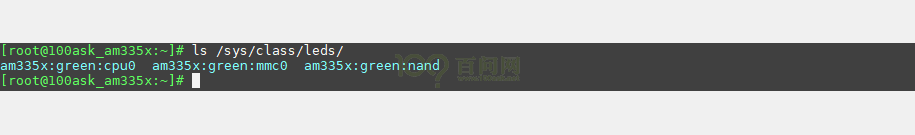

  进入/sys/class/leds 目录查看

```
	[root@100ask_am335x:~]# cd /sys/class/leds/   
```

    am335x:green:cpu0 对应开发板led2
    am335x:green:mmc0 对应开发板led1
    am335x:green:nand 对应开发板led3

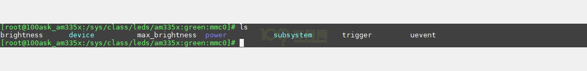

  此时我们通过echo输入值到 brightness即可控制灯的亮灭，以下以am335x:green:mmc0为示例

```
	[root@100ask_am335x:/sys/class/leds/am335x:green:mmc0]# echo 1 > brightness  //灯亮   
	[root@100ask_am335x:/sys/class/leds/am335x:green:mmc0]# echo 0 > brightness  //灯灭   
```

#### 串口测试

  此节演示使用linux-serial-test程序测试串口的可用性。

##### 压力测试

  这发送五秒钟并接收七秒钟，之后它将退出。如果接收的字节数与发送的字节数匹配且接收的模式正确，则退出代码将为零，因此可以将其用作自动测试脚本的一部分。

```
	[root@100ask_am335x:~]# linux-serial-test -s -e -p /dev/ttyO2 -b 115200 -o 5 -i 7   
```

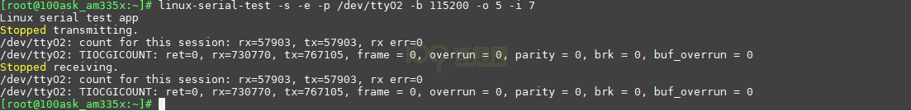

##### 全速压力测试

```
	[root@100ask_am335x:~]# linux-serial-test -s -e -p /dev/ttyO2 -b 3000000   
```

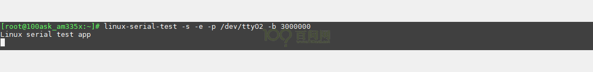

#### RS485测试

  此节演示使用rs485_test程序测试rs485接口的可用性。
  注意:需要准备另一款支持rs485的设备，来保证测试可行,以下测试是通过两块335x开发板进行测试。

##### 接收端

```
	[root@100ask_am335x:~]# rs485_test -d /dev/ttyO2 -b 115200   
```

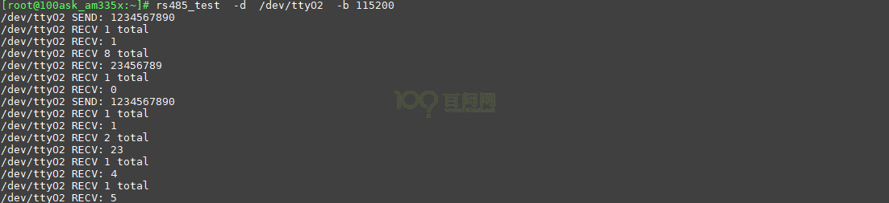

##### 发送端

```
	[root@100ask_am335x:~]# rs485_test -d /dev/ttyO1 -b 115200   
```

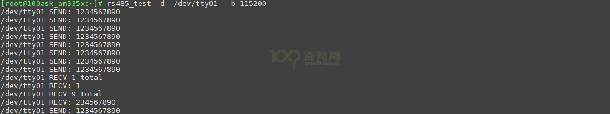

#### Can功能测试

  此节主要演示使用两块开发板通过ip 和 can-utils命令测试can0的通信。
  100ask_am335x可以作为一个CAN设备使用。按照下图所示连接两块am335开发板，并参考原理图找到对应的引脚，用连接线连接100ask_am335x的CAN接线端子的L、H和另一块开发板的CAN接口，用户也可以使用自己的Can设备进行测试。

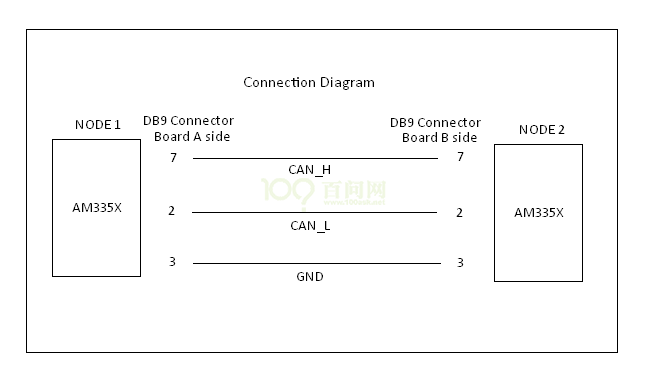

##### 发送端

  关闭can0接口

```
	[root@100ask_am335x:~]# ip link set can0 down   
```

  设置can0传输速率为50Kbits/sec

```
	[root@100ask_am335x:~]# ip link set can0 type can bitrate 50000     
```

  参考can0设置的参数

```
	[root@100ask_am335x:~]# ip -details link show can0   
```

  打开can0接口

```
	[root@100ask_am335x:~]# ip link set can   
```

0 up
  使用cansend命令向另一端发送数据

```
	[root@100ask_am335x:~]# cansend can0 123#DEADBEEF   
	[root@100ask_am335x:~]# cansend can0 123#DEADBEEF   
	[root@100ask_am335x:~]# cansend can0 123#DEADBE23   
```

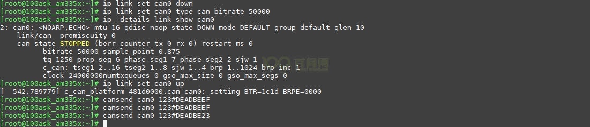

##### 接收端

  关闭can0接口

```
	[root@100ask_am335x:~]# ip link set can0 down   
```

  设置can0传输速率为50Kbits/sec

```
	[root@100ask_am335x:~]# ip link set can0 type can bitrate 50000     
```

  参考can0设置的参数

```
	[root@100ask_am335x:~]# ip -details link show can0   
```

  打开can0接口

```
	[root@100ask_am335x:~]# ip link set can0 up   
```

  打印can0的信息

```
	[root@100ask_am335x:~]# candump can0   
```

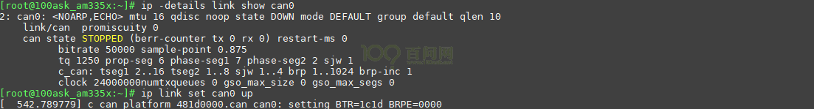

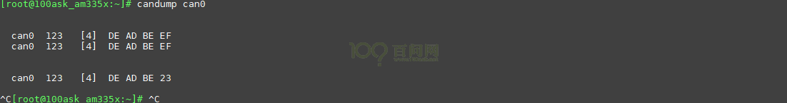

### Firefly-rk3288开发板

  开发板各个功能所在位置以及名称如下图所示，如下所有的功能测试均在串口登录终端下进行测试：


#### 网卡接口测试

  此节演示在串口终端下如何设置开发板的ip地址，测试网络的连通性。并使用电脑通过网络浏览器访问开发板，验证开发板的http+php可用,如图4.2.1.1所示，将网线插到此接口处。
  **注意：**既然是在开发板和电脑之间测试网如，那双方需要有网络连接。两者之间需要有一个路由器，开发板通过网线与路由器连接。而电脑与路由器之间，可以使用网线连接，也可以使用WIFI连接。网卡接口位置示意图：

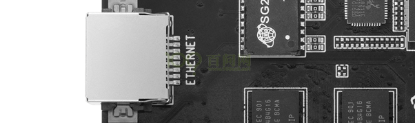

    1)通过udhcpc命令获取ip地址，详细信息如下图(udhcpc获取IP输出示意图)所示：

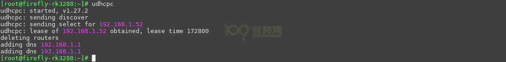

  通过上图可知，使用udhcpc命令使开发板获得IP地址192.168.1.52(你的开发板自动获取的IP可能不一样)。
  如果通过udhcpc命令无法获得IP，也可以使用ifconfig命令强制设置IP为同一网段的 192.168.1.112 ：

```
	[root@firefly-rk3288:~]# ifconfig eth0 192.168.1.112   
```

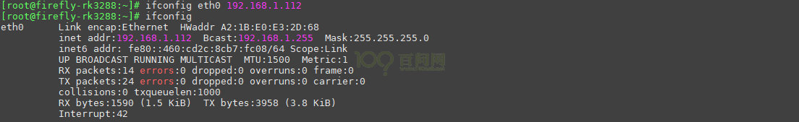

    2)通过ifconfig命令查看详细ip信息：

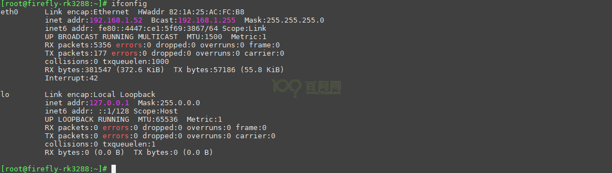

    3)网络连通性测试：
  在开发板上执行如下命令，如果有数据返回则表示开发板跟互联网是连通的(前提是你的路由器是可以上网的)：

```
	[root@firefly-rk3288:~]# ping www.baidu.com    
```


    当然，很多时候开发板不能正通互联网，这也没关系，只要能ping通我们的Windows、Ubuntu即可(例如我们的ubuntu IP地址是192.168.1.163)如下为ping通示例：

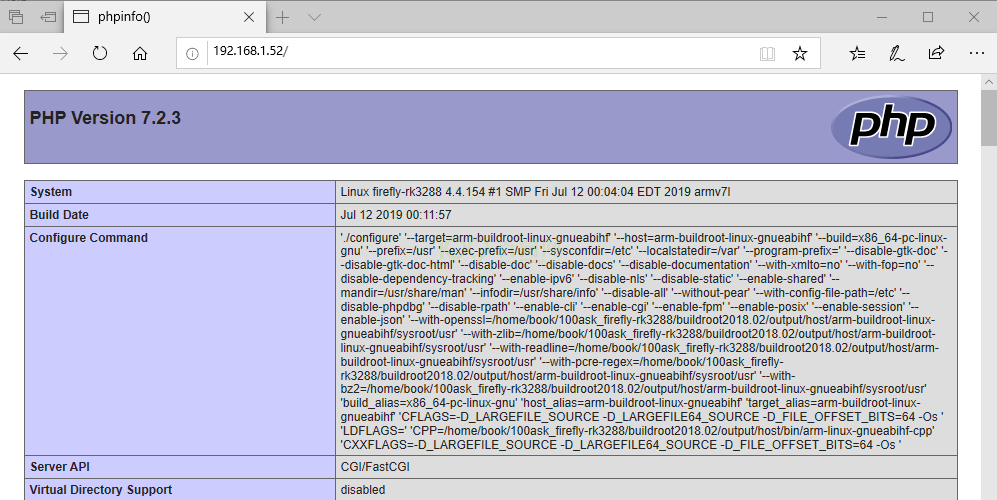

1. http+Php测试：
     假设开发板的 IP 为 192.168.1.52 ，在电脑的网络浏览器中输入此IP，就能看到此开发板所支持的php特征描述：


#### USB Host接口测试

  此节演示在终端下如何在USB Host接口上使用usb存储设备，将usb设备插图图4.2.2所示的usbhost接口处。
  **注意：**需要准备一个U盘、USB蓝牙模块、usb网卡或者usb摄像头等USB设备。 USB host接口位置示意图:

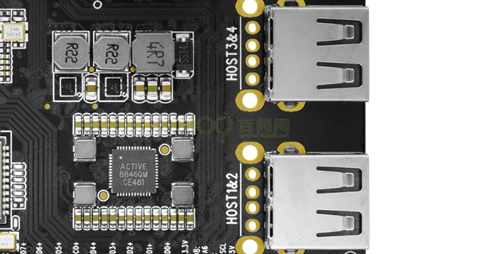

  下面使用一个16G的U盘作为例子，插到任意一个USB Host接口，会打印出如下设备信息：

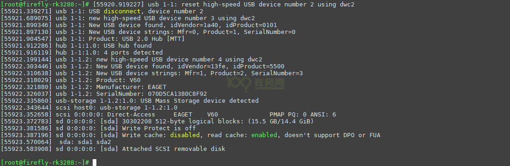

  通过打印的设备信息可知，系统为该usb存储设备创建的设备节点为 /dev/sda。一般来说/dev/sda对应整个U盘，/dev/sda1对应该U盘的第1个分区，/dev/sda2对应第2个分区。
  有些U盘没有划分分区，它只有一个设备节点/dev/sda，而没有/dev/sda1等节点。对于这种情况，/dev/sda即代表整个U盘，也代表第1个分区。
  我们可以挂载某个分区，挂载之前要先通过fdisk命令获取分区类型,如下所示：

```
	[root@firefly-rk3288:~]# fdisk  -l /dev/sda   
```


  从上图可知/dev/sda2是FAT16格式，挂载是可以指定类型为“vfat”：

```
	[root@firefly-rk3288:~]# mount  -t vfat /dev/sda2 /mnt   
```

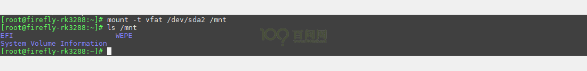

  测试完以后，通过umount卸载/mnt，才可拔下usb设备：

```
	[root@Firefly-rk3288:~]# umount  /mnt   
```

#### OTG接口测试

  此节演示如何测试OTG接口的两种模式，分别是device模式和host模式。
  **注意：**需要准备一个 OTG转接头(开发板清单中不配)、micro usb数据线(开发板清单里配有)。这2种设备如下图所示：
  OTG转换头：

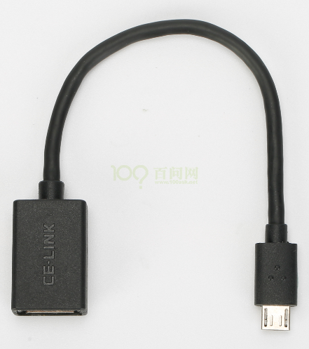

  micro usb线：

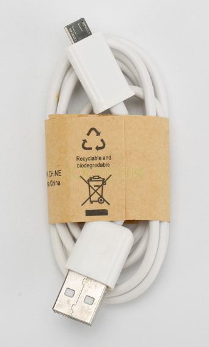

##### otg device模式测试：

  使用micro usb线小的一头插入如下图5.3.1所示的红色框所在接口，另一端连接电脑USB接口，micro otg接口位置如下图(otg device模式连接示意图)所示：

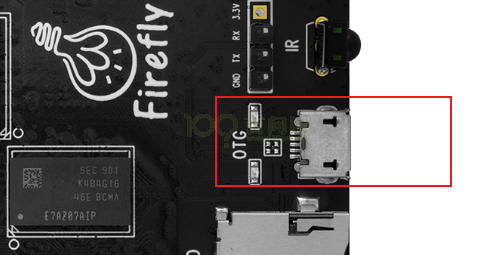

  开发板作为USB从设备，接到电脑上；电脑会把开发板识别为一个U盘。
  先执行以下命令：

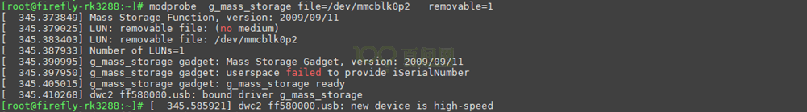

  此时在电脑的设备管理器中可以看到一个名为 linux File-Stor Gadget USB Device的磁盘设备，在windows资源管理器中也可以看到有新的可移动设备盘符弹出：


  测试完成后，在终端下执行“rmmod g_mass_storage ”卸载改模块驱动：

```
	[root@firefly-rk3288:~]# rmmod g_mass_storage   
```

##### otg host模式：

  开发板作为usb主设备，其他USB设备通过otg转接头插入开发板，开发板即可识别出这些USB外设备。otg转接头连接示意图：


  下图是把U盘通过otg转接头插入开发板后，在串口打印的信息：

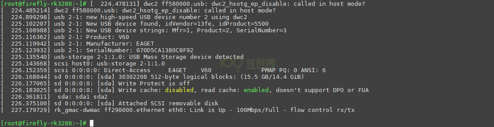

  通过打印的设备信息可知，系统为该usb存储设备创建的设备节点为 /dev/sda。一般来说/dev/sda对应整个U盘，/dev/sda1对应该U盘的第1个分区，/dev/sda2对应第2个分区。
  有些U盘没有划分分区，它只有一个设备节点/dev/sda，而没有/dev/sda1等节点。对于这种情况，/dev/sda即代表整个U盘，也代表第1个分区。

  我们可以挂载某个分区，挂载之前要先通过fdisk命令获取分区类型,如下所示：


  从上图可知/dev/sda2是FAT16格式，挂载是可以指定类型为“vfat”：


  测试完以后，通过umount卸载/mnt，才可拔下usb设备：

```
	[root@Firefly-rk3288:~]# umount  /mnt   
```

#### 耳机接口测试

  此节演示使用三段式耳机在Firefly-rk3288开发板上录制声音、播放音频。
  **注意:** 需要准备一个带麦克风的三段式耳机，如下图4.2.4 所示：
  三段式耳机示意图


  耳机连接位置示意图

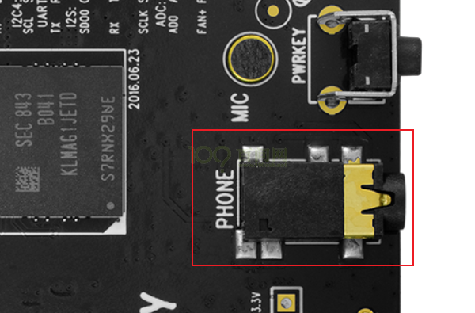

##### 播放音频：

  将耳机插入开发板耳机孔（耳机孔位置如上图红框所示），使用aplay进行播放音频文件：

```
	[root@firefly-rk3288:~]# aplay -vv test.wav   
```

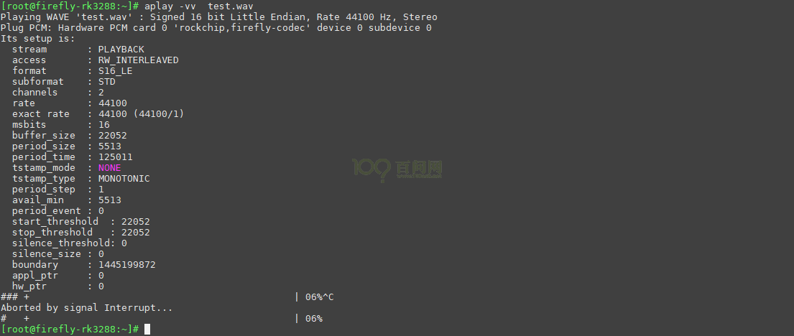

    参数讲解：
      test.wav ：指定录音文件的名称以及格式。其中test是文件名称，wav是音频格式。支持的格式有wav、raw和au等。
还可以通过ssh登录开发板，将电脑中的wav格式的音频上传到开发板，再用用aplay进行播放。

##### 录制音频：

  咪头位置示意图：

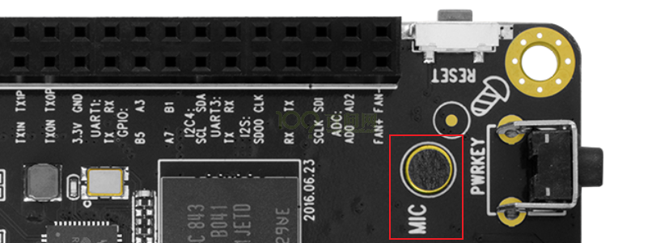

  使用如下命令进行录制,执行命令后，对着咪头说话（咪头位置如上图红框所示）：

```
	[root@firefly-rk3288:~]# arecord -vv  --format=cd --device=plughw:0,0  test.wav   
```

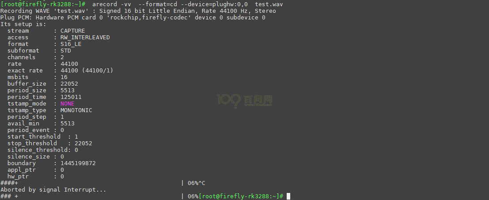

    参数讲解：
      –format=cd ：设置格式为16 bit little endian, 44100, stereo。
      –device=plughw:0,0 指定使用card0 device0设备录制声音。
      test.wav ：指定录音文件的名称以及格式。其中test是文件名称，wav是音频格式。支持的格式有wav、raw和au等。

#### RTC测试

  此节演示通过使用date和hwclock命令设置系统时间、硬件时间，并测试当操作系统重启后，系统时钟与硬件时间是否同步。
  一般的板子都会有一个名为RTC(实时时钟)的硬件，RTC使用钮扣电池供电，在系统关闭时用来维持时钟。RTC维持的时间，被称为硬件时间。
  Linux系统启动之后，它会自己维持时间，这个时间被称为系统时间。系统时间的初始值来源有二：
    ① 如果没有RTC，系统时间初始值为1970年1月1日0点0分0秒
    ② 如果有RTC，Linux启动后，系统时间初始值从RTC读取

  在实际使用过程中，要注意系统时间、硬件时间的同步问题：
    ① 使用date命令查看、设置系统时间，在设置系统时间后，要使用“hwclock -w” 命令同步到RTC；
    ② 使用hwclock查看、设置硬件时间，在设置硬件时间后，要使用“hwclock -s”命令同步到系统时间。

    **注意：**如果要使用RTC，要确保板子上已经安装了纽扣电池。


  RTC位置示意图

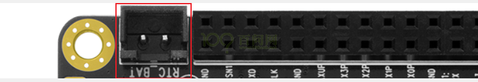

  以下命令是设置系统时间、并同步到RTC：

```
	[root@firefly-rk3288:~]# date -s "2019-06-18 12:00:00"   
	[root@firefly-rk3288:~]# hwclock -w   
```

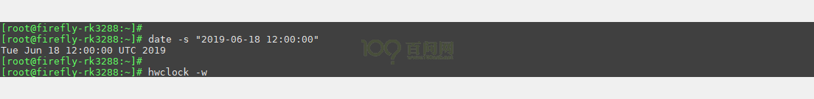

  一般不直接设置硬件时间，要设置硬件时间时，先使用date设置系统时间，再使用“hwclock -w”同步到RTC硬件。
  你使用date、hwclock命令设置好时间后，可以关闭开发板并等待一会后重启，再用date命令查看时间是否正常。

  对RTC硬件的操作使用hwclock命令，常见用法如下：
    hwclock -r ：显示硬件时钟与日期
    hwclock -s ：将系统时钟调整为与目前的硬件时钟一致。
    hwclock -w ：将硬件时钟调整为与目前的系统时钟一致。

  下面是一个示例，读取硬件时间：

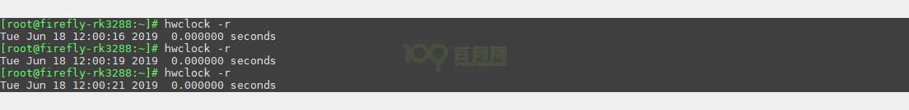

#### 按键测试

  此节演示通过hexdump命令以及dmesg命令来查看按键是否有反应。按键位置示意图：

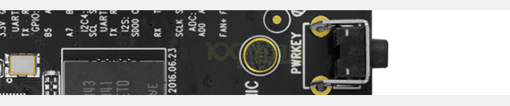

  执行下面命令之后，操作按键，如果一切正常会有打印信息：

```
	[root@firefly-rk3288:~]# hexdump  /dev/input/event2   
```

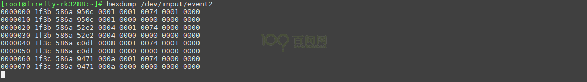

#### LED灯测试

  此节演示通过操作LED在/sys目录下的对应文件，以点亮、熄灭LED。
  **注意:** led1/led2/led3灯已经被定义为系统状态灯，仍可在/sys目录中操作对应文件；led4留给用户用于其他目的。
led灯位置示意图：

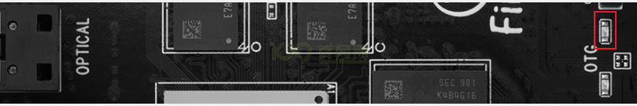

  首先，进入/sys/class/leds目录查看在多少个LED：
[root@firefly-rk3288:~]# cd /sys/class/leds/

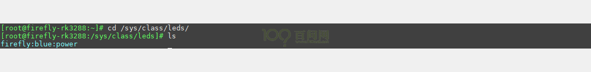

  这些文件对应的LED是：firefly:blue:power

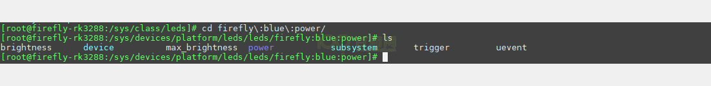

  此时我们通过echo输入值到 brightness即可控制灯的亮灭，以下以firefly:blue:power为示例

```
	[root@firefly-rk3288:/sys/devices/platform/leds/leds/firefly:blue:power]# echo 1 > brightness  //灯亮   
	[root@firefly-rk3288:/sys/devices/platform/leds/leds/firefly:blue:power]# echo 0 > brightness  //灯灭   
```

#### 串口测试

  此节演示使用linux-serial-test程序测试串口的可用性。
  串口测试连接示意图：

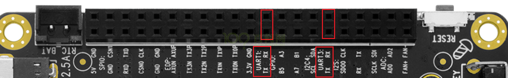

##### 压力测试：

  这发送五秒钟并接收七秒钟，之后它将退出。如果接收的字节数与发送的字节数匹配且接收的模式正确，则退出代码将为零，因此可以将其用作自动测试脚本的一部分。

```
	[root@firefly-rk3288:~]# linux-serial-test -s -e -p /dev/ttyS1 -b 115200 -o 5 -i 7   
```


##### 全速压力测试

```
	[root@firefly-rk3288:~]# linux-serial-test -s -e -p /dev/ttyS1 -b 3000000   
```


    参数详解
      -b， 串口波特率，115200等（默认为115200）
      -p， port Port（/ dev / ttyS0等）（必须指定）
      -s， stats每5秒转储串口数据
      -e， dump-err显示错误
      -o， tx-time要传输的秒数（默认为0，表示没有限制）
      -i， rx-time要接收的秒数（默认为0，表示没有限制）

### roc-rk3399-pc 开发板

  本章介绍如何测试板载功能，开发板各个功能部件所在位置以及名称如下图所示。本章所有的功能测试均在串口登录终端下进行。


#### 网卡接口测试

  此节演示在串口终端下如何设置开发板的ip地址，测试网络的连通性。并使用电脑通过网络浏览器访问开发板，验证开发板的http+php可用,如图5.3.1所示，将网线插到此接口处。
  **注意：**既然是在开发板和电脑之间测试网如，那双方需要有网络连接。两者之间需要有一个路由器，开发板通过网线与路由器连接。而电脑与路由器之间，可以使用网线连接，也可以使用WIFI连接。
  网卡接口位置示意图：

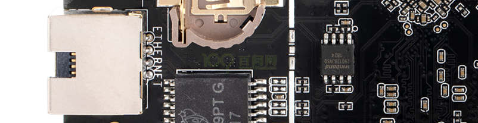

通过udhcpc命令获取ip地址，详细信息如下图(udhcpc获取IP输出示意图)所示：

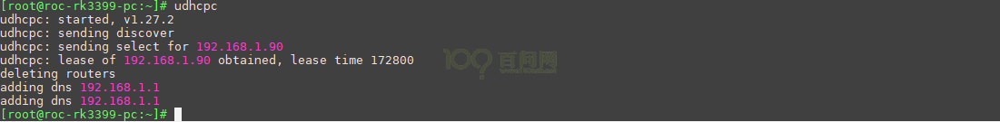

  通过上图可知，使用udhcpc命令使开发板获得IP地址192.168.1.52(你的开发板自动获取的IP可能不一样)。
  如果通过udhcpc命令无法获得IP，也可以使用ifconfig命令强制设置IP：

```
	[root@roc-rk3399-pc:~]# ifconfig eth0 192.168.1.112   
```

  通过ifconfig命令查看详细ip信息：

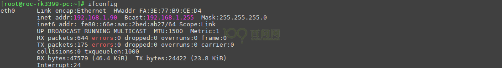

  网络连通性测试：
  在开发板上执行如下命令，如果有数据返回则表示开发板跟互联网是连通的(前提是你的路由器是可以上网的)：

```
	[root@roc-rk3399-pc:~]# ping www.baidu.com    
```

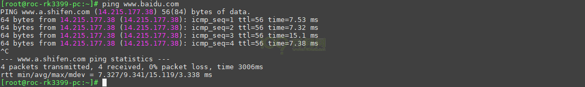

  当然，很多时候开发板不能正通互联网，这也没关系，只要能ping通我们的Windows、Ubuntu即可(例如我们的ubuntu IP地址是192.168.1.163)如下为ping通示例：


  http+Php测试：
    假设开发板的IP为192.168.1.52，在电脑的网络浏览器中输入此IP，就能看到此开发板所支持的php特征描述：

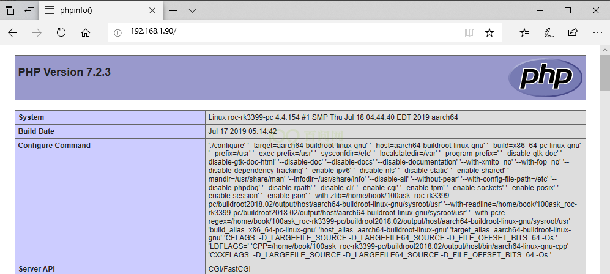

#### USB Host接口测试

  此节演示在终端下如何在USB Host接口上使用usb存储设备，将usb设备插图图4.3.2所示的usbhost接口处。
  **注意：**需要准备一个U盘、USB蓝牙模块、usb网卡或者usb摄像头等USB设备。
  USB host接口位置示意图：


  下面使用一个16G的U盘作为例子，插到任意一个USB Host接口，会打印出如下设备信���：

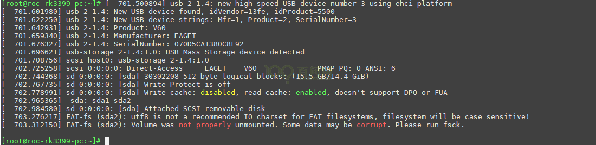

  通过打印的设备信息可知，系统为该usb存储设备创建的设备节点为 /dev/sda。一般来说/dev/sda对应整个U盘，/dev/sda1对应该U盘的第1个分区，/dev/sda2对应第2个分区。
  有些U盘没有划分分区，它只有一个设备节点/dev/sda，而没有/dev/sda1等节点。对于这种情况，/dev/sda即代表整个U盘，也代表第1个分区。
  我们可以挂载某个分区，挂载之前要先通过fdisk命令获取分区类型,如下所示：

```
	[root@roc-rk3399-pc:~]# fdisk  -l  /dev/sda   
```

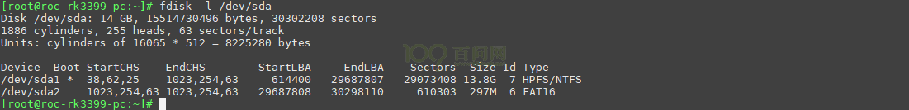

  从上图可知/dev/sda2是FAT16格式，挂载是可以指定类型为“vfat”：

```
	[root@roc-rk3399-pc:~]# mount  -t vfat /dev/sda2 /mnt   
```

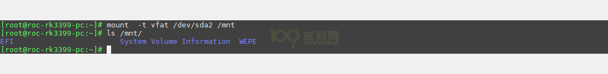

  测试完以后，通过umount卸载/mnt，才可拔下usb设备：

```
	[root@roc-rk3399-pc:~]# umount  /mnt   
```

#### OTG接口测试

  此节演示如何测试OTG接口的两种模式，分别是device模式和host模式。
  **注意：**需要准备一个 OTG转接头(开发板清单中不配)、type C usb数据线(开发板清单里配有)。这2种设备如下图所示：
  OTG转换头：


  type c usb线：


##### otg device模式测试

  使用type usb线小的一头插入如下图所示的红色框所在接口，另一端连接电脑USB接口，typeC otg接口位置如下图所示：
  otg device模式连接示意图：


  开发板作为USB从设备，接到电脑上；电脑会把开发板识别为一个U盘。
  先执行以下命令卸载正在运行的驱动程序：

```
	[root@roc-rk3399-pc:~]# rmmod g_mass_storage   
```

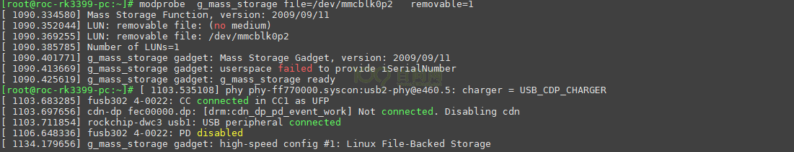

  此时在电脑的设备管理器中可以看到一个名为 linux File-Stor Gadget USB Device的磁盘设备，在windows资源管理器中也可以看到有新的可移动设备盘符弹出：


  测试完成后，在终端下执行“rmmod g_mass_storage ”卸载改模块驱动：

```
	[root@roc-rk3399-pc:~]# rmmod g_mass_storage   
```

##### otg host模式

  开发板作为usb主设备，其他USB设备通过otg转接头插入开发板，开发板即可识别出这些USB外设备。
  otg转接头连接示意图：


  下图是把U盘通过otg转接头插入开发板后，在串口打印的信息：

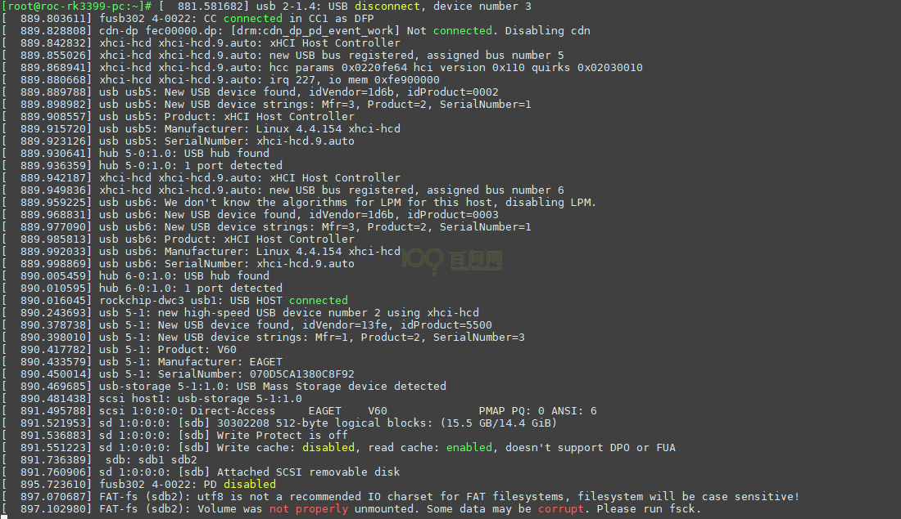

  通过打印的设备信息可知，系统为该usb存储设备创建的设备节点为 /dev/sda。一般来说/dev/sda对应整个U盘，/dev/sda1对应该U盘的第1个分区，/dev/sda2对应第2个分区。
  有些U盘没有划分分区，它只有一个设备节点/dev/sda，而没有/dev/sda1等节点。对于这种情况，/dev/sda即代表整个U盘，也代表第1个分区。

  我们可以挂载某个分区，挂载之前要先通过fdisk命令获取分区类型,如下所示：


  从上图可知/dev/sda2是FAT16格式，挂载是可以指定类型为“vfat”：


  测试完以后，通过umount卸载/mnt，才可拔下usb设备：

```
	[root@Roc-rk3399-pc:~]# umount  /mnt   
```

#### RTC测试

  此节演示通过使用date和hwclock命令设置系统时间、硬件时间，并测试当操作系统重启后，系统时钟与硬件时间是否同步。
  一般的板子都会有一个名为RTC(实时时钟)的硬件，RTC使用钮扣电池供电，在系统关闭时用来维持时钟。RTC维持的时间，被称为硬件时间。
  Linux系统启动之后，它会自己维持时间，这个时间被称为系统时间。系统时间的初始值来源有二：
    ① 如果没有RTC，系统时间初始值为1970年1月1日0点0分0秒
    ② 如果有RTC，Linux启动后，系统时间初始值从RTC读取

  在实际使用过程中，要注意系统时间、硬件时间的同步问题：
    ③ 使用date命令查看、设置系统时间，在设置系统时间后，要使用“hwclock -w” 命令同步到RTC；
    ② 使用hwclock查看、设置硬件时间，在设置硬件时间后，要使用“hwclock -s”命令同步到系统时间。

  注意：如果要使用RTC，要确保板子上已经安装了纽扣电池。
RTC位置示意图：


  以下命令是设置系统时间、并同步到RTC：

```
	[root@roc-rk3399-pc:~]# date -s "2019-06-18 12:00:00"   
	[root@roc-rk3399-pc:~]# hwclock -w   
```


  一般不直接设置硬件时间，要设置硬件时间时，先使用date设置系统时间，再使用“hwclock -w”同步到RTC硬件。
  你使用date、hwclock命令设置好时间后，可以关闭开发板并等待一会后重启，再用date命令查看时间是否正常。

  对RTC硬件的操作使用hwclock命令，常见用法如下：
    hwclock -r ：显示硬件时钟与日期
    hwclock -s ：将系统时钟调整为与目前的硬件时钟一致。
    hwclock -w ：将硬件时钟调整为与目前的系统时钟一致。

  下面是一个示例，读取硬件时间：


#### 按键测试

  此节演示通过hexdump命令以及dmesg命令来查看按键是否有反应。
  按键位置示意图：


  执行下面命令之后，操作按键，如果一切正常会有打印信息：

```
	[root@roc-rk3399-pc:~]# hexdump  /dev/input/event2   
```


#### LED灯测试

  此节演示通过操作LED在/sys目录下的对应文件，以点亮、熄灭LED。
  注意: led1/led2/led3灯已经被定义为系统状态灯，仍可在/sys目录中操作对应文件；led4留给用户用于其他目的。
  led灯位置示意图：


  首先，进入/sys/class/leds目录查看在多少个LED：

```
	[root@roc-rk3399-pc:~]# cd /sys/class/leds/   
```


  这些文件对应的LED是：
    Led1 firefly:red:power 红色电源状态灯
    Led2 firefly:yellow:heartbeat 系统心跳灯
    Led3 firefly:yellow:user 用户灯


  此时我们通过echo输入值到 brightness即可控制灯的亮灭，以下以firefly:yellow:heartbeat为示例
[root@roc-rk3399-pc:/sys/devices/platform/leds/leds/firefly:yellow:heartbeat]# echo 1 > brightness //灯亮

[root@roc-rk3399-pc:/sys/devices/platform/leds/leds/firefly:yellow:heartbeat]# echo 0 > brightness //灯灭

#### 串口测试

  此节演示使用linux-serial-test程序测试串口的可用性。
  串口测试连接示意图：


##### 压力测试

  这发送五秒钟并接收七秒钟，之后它将退出。如果接收的字节数与发送的字节数匹配且接收的模式正确，则退出代码将为零，因此可以将其用作自动测试脚本的一部分。

```
	[root@roc-rk3399-pc:~]# linux-serial-test -s -e -p /dev/ttyS1 -b 115200 -o 5 -i 7   
```


##### 全速压力测试

```
	[root@roc-rk3399-pc:~]# linux-serial-test -s -e -p /dev/ttyS1 -b 3000000   
```


  参数详解
::-b， 串口波特率，115200等（默认为115200）
    -p， port Port（/ dev / ttyS0等）（必须指定）
    -s， stats每5秒转储串口数据
    -e， dump-err显示错误
    -o， tx-time要传输的秒数（默认为0，表示没有限制）
    -i， rx-time要接收的秒数（默认为0，表示没有限制）

## 后续开发准备工作：准备交叉编译工具链、编译内核

  当你想开发应用程序、内核、驱动程序时，需要先安装、设置交叉编译工具链。
  当你想更新内核时，当你想进行驱动开发时，都需要编译内核。
  对于各个开发板，可以观看本章中对应内容，也可以打开htttp://wiki.100ask.net，找到对应的开发板页面。

### 100ASK_IMX6ULL 开发板

#### 获取源码

  源码的获取方法有2种：本地拷贝、在线下载。这2种方法请选择1种，不要同时选择2种方法。

##### 本地拷贝

  通过FileZilla工具上传资料光盘中的(07_bsp_sdk/100ask_imx6ull-sdk)整个文件夹到ubuntu系统/home/book目录下。
  执行 7z x 100ask_imx6ull-sdk.7z.001 解压缩文件

```
	book@100ask:~$ 7z x 100ask_imx6ull-sdk.7z.001
```

  目录结构如下图所示


##### 在线下载

  100ask_imx6ull开发板的所有代码都是保存在git站点上通过repo命令进行统一管理，可以通过如下命令进行下载或同步。
  1) 配置repo
    下载repo工具前需要设置git的邮箱和用户名，git邮箱和用户名请根据个人情况进行配置。

```
	book@100ask:~$ git config --global user.email "user@100ask.com"
	book@100ask:~$ git config --global user.name "100ask"
```

    注意: 请先配置git邮箱和用户名，否则会导致下载失败。
  2) 下载源码
    通过repo管理多个git仓库中的源码，可以及时更新最新代码，以方便开发者学习使用。

```
	book@100ask:~$ git clone https://git.dev.tencent.com/codebug8/repo.git
	book@100ask:~$ mkdir -p 100ask_imx6ull-sdk && cd 100ask_imx6ull-sdk
	book@100ask:~/100ask_imx6ull-sdk$ ../repo/repo init -u https://dev.tencent.com/u/weidongshan/p/manifests/git -b linux-sdk -m imx6ull/100ask_imx6ull_linux4.9.88_release.xml --no-repo-verify
	book@100ask:~/100ask_imx6ull-sdk$ ../repo/repo sync -j4
```

    首次下载如果提示 Testing colorized output (for ‘repo diff’, ‘repo status’): 此时输入 y 即可,继续执行 ../repo/repo sync -j4 命令即可开始同步源码。


    注意：repo在线下载的代码和资料光盘中的代码是一致的，我们会每隔一段时间更新一次源码包，如使用在线方式获取源码 可以直接在 ~/100ask_imx6ull-sdk 目录下执行 ../repo/repo sync -c进行同步更新最新代码！

#### 配置交叉编译工具链

  注意：使用我们提供的ubuntu映象文件时，请按照我们的目录结构，手动设置交叉编译工具链以及编译的架构环境变量配置，（建议配置为永久生效）。

##### 设置交叉编译工具链

  交叉编译工具链用来在ubuntu主机上编译应用程序，而这些应用程序是在ARM等其他平台上运行。
  设置交叉编译工具主要是设置PATH， ARCH和CROSS_COMPILE三个环境变量，下面介绍具体设置方法。
  在本文档中，源码、交叉编译工具链都是存放于/home/book目录下；如果你的目录不一样，请自行修改本节所讲述的命令。
  设置这3个环境变量有多种方法：
  1) 永久生效
    如需永久修改，请修改用户配置文件。在 Ubuntu系统下，修改如下：

```
	vim ~/.bashrc
```

    在行尾添加或修改：

```
	export ARCH=arm
	export CROSS_COMPILE=arm-linux-gnueabihf-
	export PATH=$PATH:/home/book/100ask_imx6ull-sdk/ToolChain/gcc-linaro-6.2.1-2016.11-x86_64_arm-linux-gnueabihf/bin
```

    设置完毕后，要执行 sourc ~/.bashrc 命令使其生效。
  2) 临时生效
    执行完“export”命令后，该设置只对当前终端有效：

```
	book@100ask:~$ export PATH=$PATH:/home/book/100ask_imx6ull-sdk/ToolChain/gcc-linaro-6.2.1-2016.11-x86_64_arm-linux-gnueabihf/bin
	book@100ask:~$ export ARCH=arm
	book@100ask:~$ export CROSS_COMPILE=arm-linux-gnueabihf-
```

  3) 手动指定
    先设置PATH环境变量，然后在make编译时指定ARCH架构 CROSS_COMPILE交叉编译工具链(执行make命令时指定的参数，只对当前命令有效；下次执行make时仍需要再次指定那些参数)：

```
	book@100ask:~$ export PATH=$PATH:/home/book/100ask_imx6ull-sdk/ToolChain/gcc-linaro-6.2.1-2016.11-x86_64_arm-linux-gnueabihf/bin
	book@100ask:~$ make ARCH=arm CROSS_COMPILE=arm-linux-gnueabihf-
```

##### 测试交叉编译工具链

  测试环境变量：

```
	book@100ask:~$ echo $ARCH
	arm
	book@100ask:~$ echo $CROSS_COMPILE
	arm-linux-gnueabihf-
```

  测试交叉编译器：

```
	book@100ask:~$ arm-linux-gnueabihf-gcc -v
```


#### 解压编译bootloader

  我们使用的版本为u-boot-2017.03,我们提供的源码针对板子进行过修改，u-boot官网下载的源码不能直接使用。

##### 编译u-boot镜像

  不同的开发板对应不同的配置文件，配置文件位于 u-boot源码的configs/ 目录,下面以100ask_imx6ull开发板为例，说明u-boot的编译过程：

```
	book@100ask: ~/100ask_imx6ull-sdk$ cd Uboot-2017.03
	book@100ask: ~/100ask_imx6ull-sdk/Uboot-2017.03$ make distclean
	book@100ask: ~/100ask_imx6ull-sdk/Uboot-2017.03$ make mx6ull_14x14_evk_defconfig
	book@100ask: ~/100ask_imx6ull-sdk/Uboot-2017.03$ make
```

  编译完成之后生成u-boot-dtb.imx，可以用于TF卡启动和EMMC启动。为方便学习，建议优先选择从TF卡启动。

##### 烧写uboot镜像

  通过dd命令烧写uboot镜像文件，我们以SD卡为例，首先通过vmware workstation把sd卡设备连接到到ubuntu 18.04虚拟机上，
  VMware挂载sd卡设备：


  使用dmesg命令获取设备挂载的设备节点，根据log信息获得改磁盘设备有两个分区，分别是 /dev/sdb1 /dev/sdb2 主分区是/dev/sdb 如下图得到的设备节点为/dev/sdb

```
	book@100ask: ~/100ask_imx6ull-sdk/Uboot-2017.03 $ dmesg
```

  设备节点输出示意图：


  使用dd命令烧写img镜像文件到 /dev/sdb设备。

```
	book@100ask: ~/100ask_imx6ull-sdk/uboot2017.03$ sudo dd if=u-boot-dtb.imx of=/dev/sdb bs=1k seek=1 conv=fsync
```

  从TF卡启动，启动过程中，通过按空格键可以进入U-Boot命令控制台执行需要的命令。例如：

```
	=> help -- 获取帮助
	=> echo -- 查看变量
```

  注明：
    如何设置启动参数请参考NFS ROOT启动。
    uboot更多使用讲解请参考页面 http://wiki.100ask.org/Category:Uboot

#### 编译linux kernel

##### 编译内核镜像

  不同的开发板对应不同的配置文件，配置文件位于内核源码arch/arm/configs/目录。下面以100ask_imx6ull开发板为例，说明kernel的编译过程：

```
	book@100ask:~/100ask_imx6ull-sdk$ cd Linux-4.9.88
	book@100ask:~/100ask_imx6ull-sdk/Linux-4.9.88$ make mrproper
	book@100ask:~/100ask_imx6ull-sdk/Linux-4.9.88$ make 100ask_imx6ull_defconfig
	book@100ask:~/100ask_imx6ull-sdk/Linux-4.9.88$ make zImage
	book@100ask:~/100ask_imx6ull-sdk/Linux-4.9.88$ make dtbs
```

  编译完成后，在arch/arm/boot目录下生成zImage内核文件, 在arch/arm/boot/dts目录下生成设备树的二进制文件100ask_imx6ull-14x14.dtb。

##### 拷贝内核镜像到开发板

  1) 使用nfs挂载网络文件系统下载
    首先参考页面 安装nfs服务安装并配置nfs，安装完成后，将生成的设备树文件和zImage文件拷贝到nfs目录下。
    连接开发板并进入系统，并确保开发板可以获取到IP地址，如何让开发板联网请参考页面有线网卡接口测试 之后在开发板上执行如下命令，如下示例 192.168.1.134:/home/book/nfs_rootfs 为我的ubuntu nfs所在地址，用户需要更改为自己的地址。

```
	[root@100ask_imx6ull:~]# mount -t nfs -o nolock 192.168.1.134:/home/book/nfs_rootfs /mnt
```

    挂载成功后将已经拷贝到ubuntu nfs目录中的设备树文件拷贝到开发板 /boot目录下 替换掉原有的

```
	[root@100ask_imx6ull:~]# cp /mnt/zImage /boot
	[root@100ask_imx6ull:~]# cp /mnt/100ask_imx6ull-14x14.dtb /boot
	[root@100ask_imx6ull:~]# sync
```

    等待同步完成后重启开发板即可。
    如挂载途中出现问题请参考 http://wiki.100ask.org/Jz2440LearningFAQ#NFS.E9.97.AE.E9.A2.98
  2) 使用ssh登陆开发板系统下载

##### 编译内核模块并安装

  编译内核模块

```
	book@100ask:~/100ask_imx6ull-sdk /Linux-4.9.88$ make ARCH=arm CROSS_COMPILE=arm-linux-gnueabihf- modules
```

  安装内核模块到nfs根文件系统

```
	book@100ask:~/100ask_imx6ull-sdk /Linux-4.9.88$ sudo make ARCH=arm INSTALL_MOD_PATH=/media/rootfs modules_install
```

  说明: 更多关于Linux内核资料请参考页面http://wiki.100ask.org/Category:Linux_Operating_System

#### 构建根文件系统

##### 配置文件说明

|配置文件|含义| |:—-|:—-| | 100ask_imx6ull_nfs_defconfig | 专门用于nfs启动使用的文件系统 | 100ask_imx6ull_defconfig | 默认文件系统版本(包含除qt以外所有工具) | 100ask_imx6ull_qt_defconfig | 包含Qt文件系统版本

##### 编译系统

  下面以100ask_imx6ull_defconfig配置文件为例，说明 Buildroot 的配置过程：

```
	book@100ask: ~/100ask_imx6ull-sdk $ cd Buildroot_2019.02
	book@100ask:~/100ask_imx6ull-sdk/Buildroot_2019.02$ make clean
	book@100ask:~/100ask_imx6ull-sdk/Buildroot_2019.02$ make 100ask_imx6ull_defconfig
	book@100ask:~/100ask_imx6ull-sdk/Buildroot_2019.02$ make all
```

  注意：机器性能不同，编译时间不同。性能差的电脑，有可能需要等待1 ~ 2个小时。

##### 镜像文件

  编译成功后文件输出路径为 output/images

```
	buildroot2019.02
	├── output
	├── images
	├── 100ask_imx6ull-14x14.dtb <--设备树文件
	├── rootfs.ext2 <--ext2格式根文件系统
	├── rootfs.ext4 -> rootfs.ext2 <--ext2格式根文件系统
	├── rootfs.tar <--打包并压缩的根文件系统，用于NFSROOT启动
	├── rootfs.tar.gz
	├── sdcard.img <--完整的SD卡系统镜像
	├── u-boot-dtb.imx <--u-boot镜像
	└── zImage <--内核镜像
```

  注明：如何通过NFS系统根文件系统进行调试，请参考NFS ROOT启动章节
  使用mfgtools 烧写buildroot编译好的系统请先将 u-boot-dtb.imx zImage 100ask_imx6ull-14x14.dtb rootfs.tar.bz2 这4个文件拷贝到资料光盘 02_Images\Emmc\100ask_imx6ull-mfgtools\Profiles\Linux\OS Firmware\files目录下，烧写方式请参考 Emmc启动
  深入了解学习更多关于buildroot知识请参考 http://wiki.100ask.org/Buildroot

### 100ASK_AM335X开发板

#### 获取源码

  获取源码的方式有2种：本地拷贝、在线下载。建议使用后者，更加方便。

##### 本地拷贝

  拷贝资料光盘中的源码通后过ftp工具上传到ubuntu系统中。

##### 在线下载

  100ask_am335x开发板所有代码通过repo进行管理，可以通过如下命令进行下载或同步。
    ① 配置repo
      下载repo工具前需要设置git的邮箱和用户名，git邮箱和用户名请根据个人情况进行配置：

```
			book@100ask$ git config --global user.email "you@example.com"   
			book@100ask$ git config --global user.name "Your Name"   
```

    ② 下载源码
      通过repo管理多个git仓库中的源码，可以及时更新最新代码，以方便开发者学习使用：

```
			book@100ask$ git clone  https://git.dev.tencent.com/codebug8/repo.git   
			book@100ask:~$  mkdir -p 100ask_am335x && cd 100ask_am335x   
			book@100ask:~/100ask_am335x$ ../repo/repo init -u https://dev.tencent.com/u/weidongshan/p/manifests/git -b linux-sdk -m ti335x/100ask-am335x_linux_release_v1.0.xml --no-repo-verify   
			book@100ask:~/100ask_am335x$  ../repo/repo sync -j4   
```

      **注意：**repo在线下载的代码和资料光盘中的代码是一致的，后期方便同步更新。

#### 配置交叉编译工具链

##### 设置交叉编译工具链

  交叉编译工具链主要是用于在ubuntu主机上编译并声称可以在其它平台上运行的系统。设置交叉编译工具主要是设置PATH， ARCH和CROSS_COMPILE三个环境变量，下面介绍具体设置方法。
  有3种方法设置这些环境变量。

    ① 永久生效
      如需永久修改，请修改用户配置文件, Ubuntu系统下，修改如下：

```
			vim ~/.bashrc   
```

      在行尾添加或修改：

```
			export ARCH=arm   
			export CROSS_COMPILE=arm-linux-gnueabihf-   
			export PATH=$PATH:<WORKDIR>100ask_am335x/ToolChain/gcc-linaro-6.2.1-2016.11-x86_64_arm-linux-gnueabihf/bin   
```

    ② 临时生效
      执行完“export”命令后，该设置只对当前终端有效：

```
			book@100ask$ export PATH=$PATH:<WORKDIR>100ask_am335x/ToolChain/gcc-linaro-6.2.1-2016.11-x86_64_arm-linux-gnueabihf/bin   
			book@100ask$ export ARCH=arm   
			book@100ask$ export CROSS_COMPILE=arm-linux-gnueabihf-   
```

    ③ 手动指定
      make编译时指定ARCH架构 CROSS_COMPILE交叉编译工具链，这种方法效率最低：

```
				book@100ask$ make ARCH=arm CROSS_COMPILE=arm-linux-gnueabihf- [命令]   
```

##### 测试交叉编译工具链

  测试环境变量：

```
	book@100ask$ source ~/.bashrc   
	book@100ask$ echo $ARCH   
	arm   
	book@100ask$ echo $CROSS_COMPILE   
	arm-linux-gnueabihf-   
```

  测试交叉编译器：

```
	book@100ask$ arm-linux-gnueabihf-gcc -v   
```


#### 编译内核

##### 5压kernel源码

  如果是本地上传代码到Ubuntu，则进入Kernel目录，解压内核源码：

```
	book@100ask$ cd <WORKDIR>/Kernel   
	book@100ask$ tar -zxvf linux-kernel.tar.gz   
```

  **注意：**如果你使用的是repo在线同步代码，则不需要上面的解压步骤

##### 编译内核

  **注意：**需要先安装交叉编译工具链，设置环境变量。

  不同的开发板对应不同的配置文件，配置文件位linux-kernel/arch/arm/configs/目录,下面以100ask_am335x开发板为例，说明kernel的编译过程：

```
	book@100ask$ cd linux-kernel   
	book@100ask:linux-kernel$ make mrproper   
	book@100ask:linux-kernel$ make 100ask_am335x_defconfig   
	book@100ask:linux-kernel$ make zImage   
	book@100ask:linux-kernel$ make dtbs   
```

  编译完成后，在arch/arm/boot目录下生成zImage文件, 在arch/arm/boot/dts目录下生成设备树的二进制.dtb文件

### Firefly-rk3288 开发板

#### 获取源码

  获取源码的方式有2种：本地拷贝、在线下载。建议使用后者，更加方便。

##### 本地拷贝

  拷贝资料光盘中的源码通过ftp工具上传到ubuntu系统中。

##### 在线下载

  Firefly-rk3288开发板所有代码通过repo进行管理，可以通过如下命令进行下载或同步。
    ① 配置repo
      下载repo工具前需要设置git的邮箱和用户名，git邮箱和用户名请根据个人情况进行配置：

```
			book@100ask$ git config --global user.email "you@example.com"   
			book@100ask$ git config --global user.name "Your Name"   
```

::② 下载源码
      通过repo管理多个git仓库中的源码，可以及时更新最新代码，以方便开发者学习使用：

```
			book@100ask:~$  git clone  https://git.dev.tencent.com/codebug8/repo.git   
			book@100ask:~$  mkdir -p 100ask_firefly-rk3288 && cd 100ask_firefly-rk3288   
			book@100ask:~/100ask_firefly-rk3288$  ../repo/repo init -u https://dev.tencent.com/u/weidongshan/p/manifests/git -b linux-sdk -m rk3288/firefly-rk3288_linux_release.xml --no-repo-verify   
			book@100ask:~/100ask_firefly-rk3288$  ../repo/repo sync -j4   
```

      **注意：**repo在线下载的代码和资料光盘中的代码是一致的，后期方便同步更新。
      首次下载如果提示 Testing colorized output (for ‘repo diff’, ‘repo status’): 此时输入 y 即可,继续执行 ../repo/repo sync -j4 命令即可开始同步源码。


      后期同步开发板最新源码只需要在当前所在目录执行如下命令即可同步更新
book@100ask:~/100ask_roc-rk3399-pc $ ../repo/repo sync -d

#### 配置交叉编译工具链

##### 设置交叉编译工具链

  交叉编译工具链主要是用于在ubuntu主机上编译并声称可以在其它平台上运行的系统。设置交叉编译工具主要是设置PATH， ARCH和CROSS_COMPILE三个环境变量，下面介绍具体设置方法。
  有3种方法设置这些环境变量。
    ① 永久生效
      如需永久修改，请修改用户配置文件, Ubuntu系统下，修改如下：

```
			vim ~/.bashrc   
```

      在行尾添加或修改：

```
			export ARCH=arm   
			export CROSS_COMPILE=arm-linux-gnueabihf-   
			export PATH=$PATH:/home/book/100ask_firefly-rk3288/ToolChain/gcc-linaro-6.2.1-2016.11-x86_64_arm-linux-gnueabihf/bin   
```

      ② 临时生效
        执行完“export”命令后，该设置只对当前终端有效：

```
				book@100ask:~$ export PATH=$PATH:/home/book/100ask_firefly-rk3288/ToolChain/gcc-linaro-6.2.1-2016.11-x86_64_arm-linux-gnueabihf/bin   
				book@100ask:~$ export ARCH=arm   
				book@100ask:~$ export CROSS_COMPILE=arm-linux-gnueabihf-   
```

      ③ 手动指定
        make编译时指定ARCH架构 CROSS_COMPILE交叉编译工具链，这种方法效率最低：
book@100ask$ make ARCH=arm CROSS_COMPILE=arm-linux-gnueabihf- [命令]

##### 测试交叉编译工具链

  测试环境变量：

```
	book@100ask$ source ~/.bashrc   
	book@100ask$ echo $ARCH   
	arm   
	book@100ask$ echo $CROSS_COMPILE   
	arm-linux-gnueabihf-   
```

  测试交叉编译器：

```
	book@100ask$ arm-linux-gnueabihf-gcc -v   
```


#### 编译内核

##### 解压kernel源码

  如果是本地上传代码到Ubuntu，则进入Kernel目录，解压内核源码：

```
	book@100ask:~$ cd /home/book/100ask_firefly-rk3288/   
	book@100ask: ~/100ask_firefly-rk3288$ tar -zxvf linux-4.4.tar.gz   
```

  **注意：**如果你使用的是repo在线同步代码，则不需要上面的解压步骤

##### 编译内核

  **注意：**需要先安装交叉编译工具链，设置环境变量。

  不同的开发板对应不同的配置文件，配置文件位linux-kernel/arch/arm/configs/目录,下面以firefly-rk3288开发板为例，说明kernel的编译过程：

```
	book@100ask:~/100ask_firefly-rk3288$ cd linux-kernel   
	book@100ask:~/100ask_firefly-rk3288/linux-4.4$ make mrproper   
	book@100ask:~/100ask_firefly-rk3288/linux-4.4$ make 100ask_firefly-rk3288_defconfig   
	book@100ask:~/100ask_firefly-rk3288/linux-4.4$ make zImage   
	book@100ask:~/100ask_firefly-rk3288/linux-4.4$ make dtbs   
```

  编译完成后，在arch/arm/boot目录下生成zImage文件, 在arch/arm/boot/dts目录下生成rk3288-firefly.dtb设备树的二进制.dtb文件

### Roc-rk3399-pc 开发板

#### 获取源码

  获取源码的方式有2种：本地拷贝、在线下载。建议使用后者，更加方便。

##### 本地拷贝

  拷贝资料光盘中的源码通过ftp工具上传到ubuntu系统中。

##### 在线下载

  Roc-rk3399-pc开发板所有代码通过repo进行管理，可以通过如下命令进行下载或同步。
    ① 配置repo
      下载repo工具前需要设置git的邮箱和用户名，git邮箱和用户名请根据个人情况进行配置：
book@100ask$ git config –global user.email “you@example.com”
book@100ask$ git config –global user.name “Your Name”
    ② 下载源码
      通过repo管理多个git仓库中的源码，可以及时更新最新代码，以方便开发者学习使用：

```
			book@100ask:~$  git clone  https://git.dev.tencent.com/codebug8/repo.git   
			book@100ask:~$  mkdir -p 100ask_roc-rk3399-pc && cd 100ask_roc-rk3399-pc   
			book@100ask:~/100ask_roc-rk3399-pc $ ../repo/repo init -u https://dev.tencent.com/u/weidongshan/p/manifests/git -b linux-sdk -m rk3399/roc-rk3399-pc_linux_release.xml --no-repo-verify   
			book@100ask:~/100ask_roc-rk3399-pc $  ../repo/repo sync -j4   
```

      注意：repo在线下载的代码和资料光盘中的代码是一致的，后期方便同步更新。
      首次下载如果提示 Testing colorized output (for ‘repo diff’, ‘repo status’): 此时输入 y 即可,继续执行 ../repo/repo sync -j4 命令即可开始同步源码。


      后期同步开发板最新源码只需要在当前所在目录执行如下命令即可同步更新
book@100ask:~/100ask_roc-rk3399-pc $ ../repo/repo sync -d

#### 配置交叉编译工具链

##### 设置交叉编译工具链

  交叉编译工具链主要是用于在ubuntu主机上编译并声称可以在其它平台上运行的系统。设置交叉编译工具主要是设置PATH， ARCH和CROSS_COMPILE三个环境变量，下面介绍具体设置方法。
  有3种方法设置这些环境变量。
    ① 永久生效
      如需永久修改，请修改用户配置文件, Ubuntu系统下，修改如下：

```
			vim ~/.bashrc   
```

      在行尾添加或修改：

```
			xport ARCH=arm64   
			export CROSS_COMPILE=aarch64-linux-gnu-   
			export PATH=$PATH:/home/book/100ask_roc-rk3399-pc/ToolChain-6.3.1/gcc-linaro-6.3.1-2017.05-x86_64_aarch64-linux-gnu/bin   
		e   
```

    ② 临时生效
      执行完“export”命令后，该设置只对当前终端有效：

```
			book@100ask:~$ export PATH=$PATH:/home/book/100ask_roc-rk3399-pc/ToolChain-6.3.1/gcc-linaro-6.3.1-2017.05-x86_64_aarch64-linux-gnu/bin   
			book@100ask:~$ export ARCH=arm64   
			book@100ask:~$ export CROSS_COMPILE=aarch64-linux-gnu-   
```

    ③ 手动指定
      make编译时指定ARCH架构 CROSS_COMPILE交叉编译工具链，这种方法效率最低：
book@100ask:~$ make ARCH=arm64 CROSS_COMPILE=aarch64-linux-gnu- [命令]

##### 测试交叉编译工具链

  测试环境变量：

```
	book@100ask$ source ~/.bashrc   
	book@100ask$ echo $ARCH   
	arm64   
	book@100ask$ echo $CROSS_COMPILE   
	aarch64-linux-gnu-    
```

  测试交叉编译器：

```
	book@100ask:~$ aarch64-linux-gnu-gcc  -v   
```


#### 编译内核

##### 解压kernel源码

  如果是本地上传代码到Ubuntu，则进入Kernel目录，解压内核源码：

```
	book@100ask:~$ cd /home/book/100ask_roc-rk3399-pc/   
	book@100ask: ~/100ask_roc-rk3399-pc$ tar -zxvf linux-4.4.tar.gz   
```

  **注意：**如果你使用的是repo在线同步代码，则不需要上面的解压步骤

##### 编译内核

  **注意：**需要先安装交叉编译工具链，设置环境变量。

  不同的开发板对应不同的配置文件，配置文件位linux-kernel/arch/arm/configs/目录,下面以roc-rk3399-pc开发板为例，说明kernel的编译过程：

```
	book@100ask:~/100ask_roc-rk3399-pc$ cd linux-4.4   
	book@100ask:~/100ask_roc-rk3399-pc/linux-4.4$ make mrproper   
	book@100ask:~/100ask_roc-rk3399-pc/linux-4.4$ make 100ask_roc-rk3399-pc_defconfig   
	book@100ask:~/100ask_roc-rk3399-pc/linux-4.4$ make Image   
	book@100ask:~/100ask_roc-rk3399-pc/linux-4.4$ make dtbs   
```

  编译完成后，在arch/arm/boot目录下生成Image文件, 在arch/arm/boot/dts目录下生成rk3399-roc-pc.dtb设备树的二进制.dtb文件

### IMX6ULL开发板

  野火、正点原子用的内核版本是4.1.15，
  我们用的内核版本是linux 4.9.88，
  都是4.x版本，在学习上没有任何差别。
  你拿到板子后，可以使用他们出厂的系统，
  也可以根据我们提供的高级用户手册更改为我们的系统，高级手册都存放在WIKI中：打开http://wiki.100ask.net，查看左侧开发板，点击进去即可，如下图所示：


  怎么下载内核、编译内核等等，都可以查看WIKI。

  下面以百问网imx6ull-qemu虚拟开发板为例说明。

#### 获取源码

  获取源码的方式有2种：本地拷贝、在线下载。建议使用后者，更加方便。

##### 本地拷贝

  拷贝资料光盘中的源码通过ftp工具上传到ubuntu系统中。

##### 在线下载

  百问网imx6ull-qemu虚拟开发板所有代码通过repo进行管理，可以通过如下命令进行下载或同步。
    ① 配置repo
      下载repo工具前需要设置git的邮箱和用户名，git邮箱和用户名请根据个人情况进行配置：

```
			book@100ask$ git config --global user.email "you@example.com"   
			book@100ask$ git config --global user.name "Your Name"   
```

    ② 下载源码
      通过repo管理多个git仓库中的源码，可以及时更新最新代码，以方便开发者学习使用：

```
			book@100ask:~$  git clone  https://git.dev.tencent.com/codebug8/repo.git   
			book@100ask:~$  mkdir -p 100ask_imx6ull-qemu && cd 100ask_imx6ull-qemu   
			book@100ask:~/100ask_imx6ull-qemu$ ../repo/repo init -u https://dev.tencent.com/u/weidongshan/p/manifests/git -b linux-sdk -m imx6ull/100ask-imx6ull_qemu_release_v1.0.xml --no-repo-verify   
			book@100ask:~/100ask_imx6ull-qemu$ ../repo/repo sync -j4   
```

      **注意：**repo在线下载的代码和资料光盘中的代码是一致的，后期方便同步更新。
      首次下载如果提示 Testing colorized output (for ‘repo diff’, ‘repo status’): 此时输入 y 即可,继续执行 ../repo/repo sync -j4 命令即可开始同步源码。


      后期同步开发板最新源码只需要在当前所在目录执行如下命令即可同步更新
book@100ask:~/100ask_imx6ull-qemu $ ../repo/repo sync -d

#### 配置交叉编译工具链

##### 设置交叉编译工具链

  交叉编译工具链主要是用于在ubuntu主机上编译并声称可以在其它平台上运行的系统。设置交叉编译工具主要是设置PATH， ARCH和CROSS_COMPILE三个环境变量，下面介绍具体设置方法。
  有3种方法设置这些环境变量。
    ① 永久生效
      如需永久修改，请修改用户配置文件, Ubuntu系统下，修改如下：

```
			vim ~/.bashrc   
```

      在行尾添加或修改：

```
			export ARCH=arm   
			export CROSS_COMPILE=arm-linux-gnueabihf-   
			export PATH=$PATH:/home/book/100ask_imx6ull-qemu/ToolChain/gcc-linaro-6.2.1-2016.11-x86_64_arm-linux-gnueabihf/bin   
```

    ② 临时生效
      执行完“export”命令后，该设置只对当前终端有效：

```
			book@100ask:~$ export ARCH=arm   
			book@100ask:~$ export CROSS_COMPILE=arm-linux-gnueabihf-   
			book@100ask:~$ export PATH=$PATH:/home/book/100ask_imx6ull-qemu/ToolChain/gcc-linaro-6.2.1-2016.11-x86_64_arm-linux-gnueabihf/bin   
```

    ③ 手动指定
      make编译时指定ARCH架构 CROSS_COMPILE交叉编译工具链，这种方法效率最低：

```
			book@100ask:~$ make ARCH=arm CROSS_COMPILE=arm-linux-gnueabihf-  [命令]	   
```

##### 测试交叉编译工具链

  测试环境变量：

```
	book@100ask$ source ~/.bashrc   
	book@100ask$ echo $ARCH   
	arm   
	book@100ask$ echo $CROSS_COMPILE   
	arm-linux-gnueabihf-    
```

  测试交叉编译器：

```
	book@100ask:~$ arm-linux-gnueabihf-gcc  -v   
```

#### 编译内核

##### 解压kernel源码

  如果是本地上传代码到Ubuntu，则进入Kernel目录，解压内核源码：

```
	book@100ask:~$ cd /home/book/100ask_imx6ull-qemu/   
	book@100ask: ~/100ask_imx6ull-qemu$ tar -zxvf  linux-4.9.88.tar.gz   
```

  **注意：**如果你使用的是repo在线同步代码，则不需要上面的解压步骤

##### 编译内核

  **注意：**需要先安装交叉编译工具链，设置环境变量。

  不同的开发板对应不同的配置文件，配置文件位linux-kernel/arch/arm/configs/目录,下面以roc-rk3399-pc开发板为例，说明kernel的编译过程：

```
	book@100ask:~/100ask_imx6ull-qemu$ cd linux-4.9.88   
	book@100ask:~/100ask_imx6ull-qemu/linux-4.9.88$ make mrproper   
	book@100ask:~/100ask_imx6ull-qemu/linux-4.9.88$ make 100ask_imx6ull_qemu_defconfig   
	book@100ask:~/100ask_imx6ull-qemu/linux-4.9.88$ make Image   
	book@100ask:~/100ask_imx6ull-qemu/linux-4.9.88$ make dtbs   
```

  编译完成后，在arch/arm/boot目录下生成Image文件, 在arch/arm/boot/dts目录下生成100ask_imx6ull_qemu.dtb设备树的二进制.dtb文件