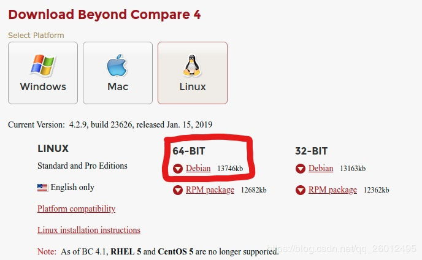
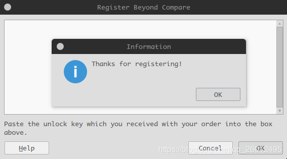

# ubuntu安装Beyond

## 安装

http://www.scootersoftware.com/download.php

ubuntu选择Linux下的Debian，32还是64位根据自己的系统下载。

本人是ubuntu18.04 64位系统下载如下：



下载后直接双击安装即可，默认安装目录：/usr/lib/beyondcompare/

## 破解

1.输入以下两条命令：

```shell
xym@pc:~$ cd /usr/lib/beyondcompare/
xym@pc:/usr/lib/beyondcompare$ sudo sed -i "s/keexjEP3t4Mue23hrnuPtY4TdcsqNiJL-5174TsUdLmJSIXKfG2NGPwBL6vnRPddT7tH29qpkneX63DO9ECSPE9rzY1zhThHERg8lHM9IBFT+rVuiY823aQJuqzxCKIE1bcDqM4wgW01FH6oCBP1G4ub01xmb4BGSUG6ZrjxWHJyNLyIlGvOhoY2HAYzEtzYGwxFZn2JZ66o4RONkXjX0DF9EzsdUef3UAS+JQ+fCYReLawdjEe6tXCv88GKaaPKWxCeaUL9PejICQgRQOLGOZtZQkLgAelrOtehxz5ANOOqCaJgy2mJLQVLM5SJ9Dli909c5ybvEhVmIC0dc9dWH+/N9KmiLVlKMU7RJqnE+WXEEPI1SgglmfmLc1yVH7dqBb9ehOoKG9UE+HAE1YvH1XX2XVGeEqYUY-Tsk7YBTz0WpSpoYyPgx6Iki5KLtQ5G-aKP9eysnkuOAkrvHU8bLbGtZteGwJarev03PhfCioJL4OSqsmQGEvDbHFEbNl1qJtdwEriR+VNZts9vNNLk7UGfeNwIiqpxjk4Mn09nmSd8FhM4ifvcaIbNCRoMPGl6KU12iseSe+w+1kFsLhX+OhQM8WXcWV10cGqBzQE9OqOLUcg9n0krrR3KrohstS9smTwEx9olyLYppvC0p5i7dAx2deWvM1ZxKNs0BvcXGukR+/g" BCompare
[sudo] password for xym: 
xym@pc:/usr/lib/beyondcompare$ 

```

2.打开 Beyond Conpare  `弹出`Trial Mode Error！`弹窗` 

 `单击右下角按钮“Enter Key”，输入以下秘钥【注意：包括开始和结尾的横线行】`  

```shell
--- BEGIN LICENSE KEY ---
GXN1eh9FbDiX1ACdd7XKMV7hL7x0ClBJLUJ-zFfKofjaj2yxE53xauIfkqZ8FoLpcZ0Ux6McTyNmODDSvSIHLYhg1QkTxjCeSCk6ARz0ABJcnUmd3dZYJNWFyJun14rmGByRnVPL49QH+Rs0kjRGKCB-cb8IT4Gf0Ue9WMQ1A6t31MO9jmjoYUeoUmbeAQSofvuK8GN1rLRv7WXfUJ0uyvYlGLqzq1ZoJAJDyo0Kdr4ThF-IXcv2cxVyWVW1SaMq8GFosDEGThnY7C-SgNXW30jqAOgiRjKKRX9RuNeDMFqgP2cuf0NMvyMrMScnM1ZyiAaJJtzbxqN5hZOMClUTE+++
--- END LICENSE KEY -----
```

 出现以下界面则激活成功！ 

