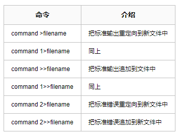
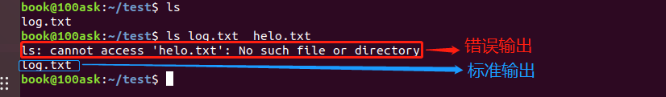
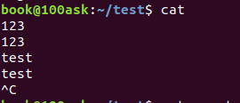
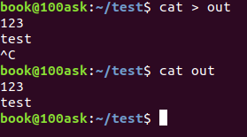
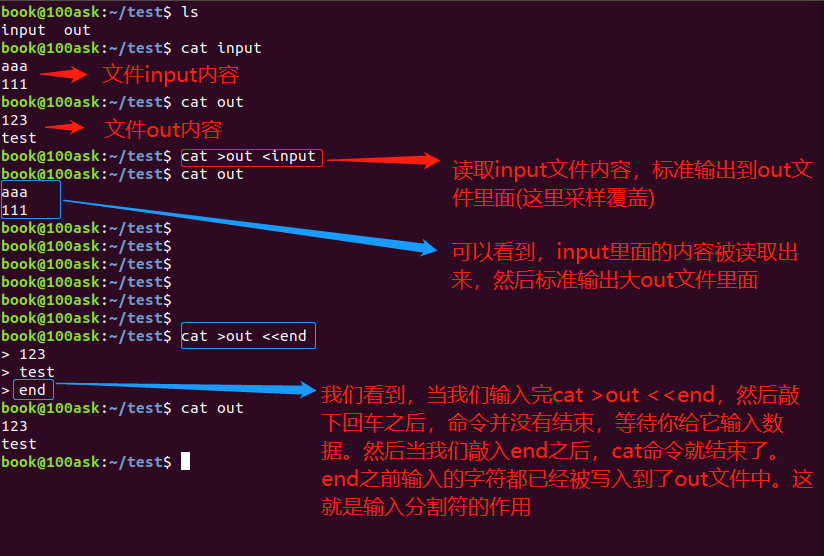
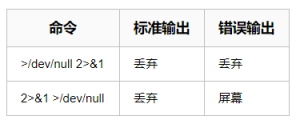

# Linux 输入输出重定向

## 文件描述符

当执行shell命令时，会默认打开3个文件，每个文件有对应的文件描述符来方便我们使用。


## 输出重定向



如图所示，`/test/` 目录下只有个log.txt ,而我们执行的是`ls log.txt helo.txt` ,很明显helo.txt不存在，所以会有错误信息输出。

```
book@100ask:~/test$ ls
book@100ask:~/test$ touch log.txt
book@100ask:~/test$ ls
log.txt
book@100ask:~/test$ ls log.txt  helo.txt
ls: cannot access 'helo.txt': No such file or directory
log.txt
book@100ask:~/test$ ls log.txt  helo.txt 2>>err
log.txt
book@100ask:~/test$ ls
err  log.txt
book@100ask:~/test$ cat err
ls: cannot access 'helo.txt': No such file or directory
book@100ask:~/test$ ls log.txt  helo.txt 1>>err
ls: cannot access 'helo.txt': No such file or directory
book@100ask:~/test$ cat err
ls: cannot access 'helo.txt': No such file or directory
log.txt
```




## 输入重定向


1. cat命令为例，如果cat后面没有跟文件名的话，那它的作用就是将标准输入（比如键盘）回显到标准输出（比如屏幕）上：

   ```
   book@100ask:~/test$ cat 
   123
   123
   test
   test
   ^C
   ```

   



2. 利用输入重定向，将我们在键盘上敲入的字符写入到文件中。我们需要使用ctrl+c来结束输入：

   ```
   book@100ask:~/test$ cat > out
   123
   test
   ^C
   book@100ask:~/test$ cat out 
   123
   test
   ```

   




> ```
> book@100ask:~/test$ ls
> input  out
> book@100ask:~/test$ cat input 
> aaa
> 111
> book@100ask:~/test$ cat out 
> 123
> test
> book@100ask:~/test$ cat >out <input
> book@100ask:~/test$ cat out 
> aaa
> 111
> book@100ask:~/test$ 
> book@100ask:~/test$ 
> book@100ask:~/test$ 
> book@100ask:~/test$ 
> book@100ask:~/test$ 
> book@100ask:~/test$ 
> book@100ask:~/test$ cat >out <<end
> 
> > 123
> > test
> > end
> > book@100ask:~/test$ cat out
> > 123
> > test
> > book@100ask:~/test$ 
> ```
>
> 



## 高级用法

**在shell脚本里面我们会经常看到下面一段代码**

> ```
> ./App > /dev/null 2>&1 &
> ```

那么这个`> /dev/null 2>&1 &`是什么意思？

这条命令其实分为两命令，一个是`>/dev/null`，另一个是`2>&1`，而最后一个&是在后台执行程序，无需解释

1. `> /dev/null` 命令：将标准输出1重定向到`/dev/null`中。 `/dev/null`代表linux的空设备文件，所有往这个文件里面写入的内容都会丢失，俗称“黑洞”。那么执行了`>/dev/null`之后，标准输出就会不再存在，没有任何地方能够找到输出的内容；

2. `2>&1`命令：这条命令用到了重定向绑定，采用&可以将两个输出绑定在一起。这条命令的作用是错误输出将和标准输出同用一个文件描述符，说人话就是错误输出将会和标准输出输出到同一个地方；

3. linux在执行shell命令之前，就会确定好所有的输入输出位置，并且从左到右依次执行重定向的命令，所以`>/dev/null 2>&1`的作用就是让标准输出重定向到`/dev/null`中（丢弃标准输出），然后错误输出由于重用了标准输出的描述符，所以错误输出也被定向到了`/dev/null`中，错误输出同样也被丢弃了。执行了这条命令之后，该条shell命令将不会输出任何信息到控制台，也不会有任何信息输出到文件中。

**还有下面这段代码**

```
2>&1 >/dev/null
```

刚才提到了，linux在执行shell命令之前，就会确定好所有的输入输出位置，并且从左到右依次执行重定向的命令。那么我们同样从左到右地来分析`2>&1 >/dev/null`：

1. `2>&1`，将错误输出绑定到标准输出上，由于此时的标准输出是默认值，也就是输出到屏幕，所以错误输出会输出到屏幕。
2. `>/dev/null`，将标准输出1重定向到`/dev/null`中。

我们用一个表格来更好地说明这两条命令的区别：



## 总结

那么可能会有些同学会疑问，为什么要用重定向绑定，而不是像`>/dev/null 2>/dev/null`这样子重复一遍，将标准输出和错误输出直接这样写。

这是因为采用这种写法，标准输出和错误输出会抢占往null文件的管道，所以可能会导致输出内容的时候出现缺失、覆盖等情况。有时候也有可能出现只有error信息或者只有正常信息的情况。不管怎么说，采用这种写法，最后的情况是无法预估的。

而且，由于null文件被打开了两次，两个文件描述符会抢占性的往文件中输出内容，所以整体IO效率不如`>/dev/null 2>&1`来得高。

总结一句就是**`./App > /dev/null 2>&1 &`** 这条命令把应用程序App的标准输出和错误输出都不显示，且应用程序在后台执行。