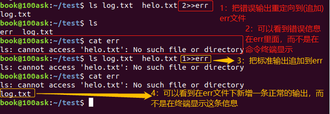
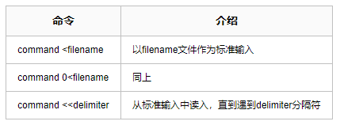

# Linux 输入输出重定向

## 文件描述符

当执行shell命令时，会默认打开3个文件，每个文件有对应的文件描述符来方便我们使用。


## 输出重定向


如图所示，`/test/` 目录下只有个log.txt ,而我们执行的是`ls log.txt helo.txt` ,很明显helo.txt不存在，所以会有错误信息输出。

```
book@100ask:~/test$ ls
book@100ask:~/test$ touch log.txt
book@100ask:~/test$ ls
log.txt
book@100ask:~/test$ ls log.txt  helo.txt
ls: cannot access 'helo.txt': No such file or directory
log.txt
book@100ask:~/test$ ls log.txt  helo.txt 2>>err
log.txt
book@100ask:~/test$ ls
err  log.txt
book@100ask:~/test$ cat err
ls: cannot access 'helo.txt': No such file or directory
book@100ask:~/test$ ls log.txt  helo.txt 1>>err
ls: cannot access 'helo.txt': No such file or directory
book@100ask:~/test$ cat err
ls: cannot access 'helo.txt': No such file or directory
log.txt
```




## 输入重定向



1. cat命令为例，如果cat后面没有跟文件名的话，那它的作用就是将标准输入（比如键盘）回显到标准输出（比如屏幕）上：

   ```
   book@100ask:~/test$ cat 
   123
   123
   test
   test
   ^C
   ```

   


2. 利用输入重定向，将我们在键盘上敲入的字符写入到文件中。我们需要使用ctrl+c来结束输入：

   ```
   book@100ask:~/test$ cat > out
   123
   test
   ^C
   book@100ask:~/test$ cat out 
   123
   test
   ```

   


> ```
> book@100ask:~/test$ ls
> input  out
> book@100ask:~/test$ cat input 
> aaa
> 111
> book@100ask:~/test$ cat out 
> 123
> test
> book@100ask:~/test$ cat >out <input
> book@100ask:~/test$ cat out 
> aaa
> 111
> book@100ask:~/test$ 
> book@100ask:~/test$ 
> book@100ask:~/test$ 
> book@100ask:~/test$ 
> book@100ask:~/test$ 
> book@100ask:~/test$ 
> book@100ask:~/test$ cat >out <<end
> 
> > 123
> > test
> > end
> > book@100ask:~/test$ cat out
> > 123
> > test
> > book@100ask:~/test$ 
> ```
>
> 


## 高级用法

