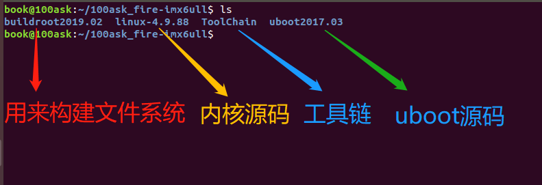
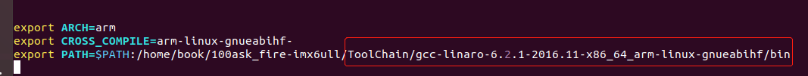
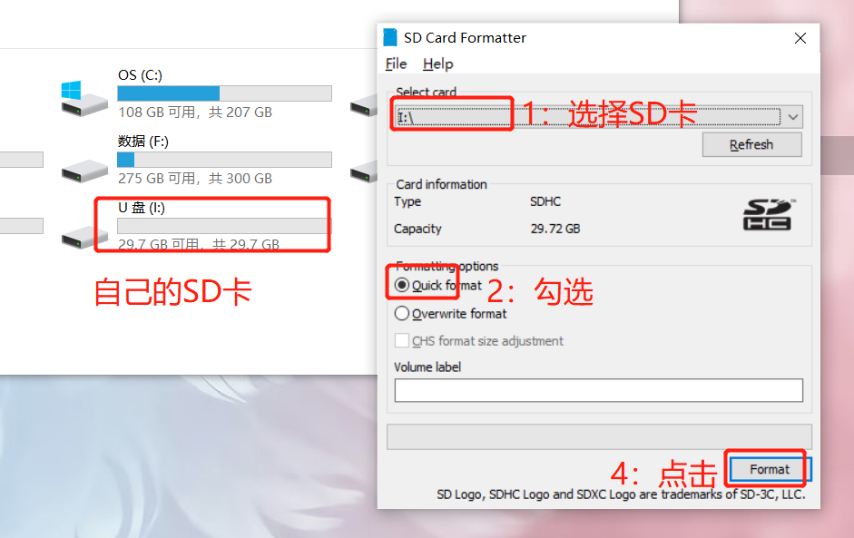
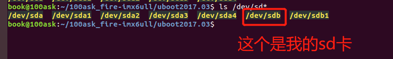
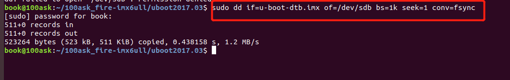
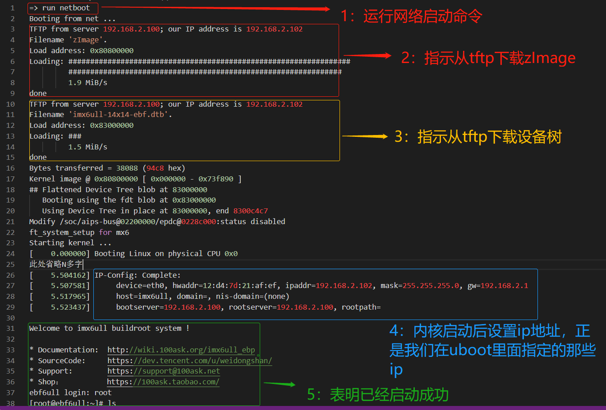

# 韦东山 野火硬件IMX6ULL系统构建

- 硬件平台：野火IMX6ULL_Pro
- 软件资源：默认虚拟机tftp服务器目录：/home/tftpboot
                     默认虚拟机NFS服务器目录：/home/nfs_rootfs
- 参考文档：http://wiki.100ask.org/100ask_Fire-imx6ull_pro

## 资料下载

### 本地拷贝

链接：https://eyun.baidu.com/s/3gfSwVmV 密码：oKx6

下载完后如下图：


拷贝到虚拟机并解压后如下图所示：




### 在线下载


git邮箱账号和用户名配置

```
book@100ask:~$  git config --global user.email "you@example.com"
book@100ask:~$  git config --global user.name "Your Name"
```

初次使用，需要配置用户名和密码才可以进行代码同步，用户名和密码根据自己情况设定，也可以随意设定

考虑到代码仓库过多，特使用repo工具管理代码

```bash
book@100ask:~$  git clone  https://git.dev.tencent.com/codebug8/repo.git
book@100ask:~$  mkdir -p 100ask_fire-imx6ull && cd 100ask_fire-imx6ull
book@100ask:~/100ask_fire-imx6ull$ ../repo/repo init -u https://dev.tencent.com/u/weidongshan/p/manifests/git -b linux-sdk -m imx6ull/fire-imx6ull_linux_release_v1.0.xml --no-repo-verify
book@100ask:~/100ask_fire-imx6ull$ ../repo/repo sync -j4
```

上面使用的repo管理为国内coding仓库

## 设置交叉编译工具链

执行如下命令设置交叉编译器

```
 vim ~/.bashrc
```

 在行尾添加或修改：

```bash
export ARCH=arm
export CROSS_COMPILE=arm-linux-gnueabihf-
export PATH=$PATH:/home/book/100ask_fire-imx6ull/ToolChain/gcc-linaro-6.2.1-2016.11-x86_64_arm-linux-gnueabihf/bin
```

更改立即生效

```
 source ~/.bashrc
```

修改完后的`~/.bashrc`文件的最后内容如下图



## 编译文件系统

```bash
book@100ask:~/100ask_fire-imx6ull$ cd buildroot2019.02
book@100ask:~/100ask_fire-imx6ull/buildroot2019.02$ make clean
book@100ask:~/100ask_fire-imx6ull/buildroot2019.02$ make fire_imx6ull-pro_defconfig
book@100ask:~/100ask_fire-imx6ull/buildroot2019.02$ make menuconfig
book@100ask:~/100ask_fire-imx6ull/buildroot2019.02$ make all
```

**注意：机器性能不同，编译时间不同。性能差的电脑，有可能需要等待1 ~ 2个小时。**

- 编译后生成文件介绍

```bash
buildroot2019.02	
	├── output
		├── images	
			├── imx6ull-14x14-ebf-mini.dtb	    	<--野火imx6ull mini板设备树文件	
            ├── imx6ull-14x14-ebf.dtb	            <--野火imx6ull pro版设备树文件	
			├── rootfs.cpio
			│   rootfs.cpio.gz
			├── rootfs.cpio.uboot
			├── rootfs.ext2			    			<--ext2格式根文件系统
			├── rootfs.ext4 -> rootfs.ext2	    	<--ext2格式根文件系统	
			├── rootfs.tar			    			<--打包并压缩的根文件系统，适用于NFSROOT启动	
			├── rootfs.ubi                          <--用于nandflash启动的文件系统镜像
			├── rootfs.ubifs
			├── sdcard.img			   		 		<--完整的SD卡系统镜像
			├── u-boot-dtb.imx			    		<--u-boot镜像
			└── zImage								<--内核镜像
```

把使用buildroot构建得到的根文件系统nfs_rootfs/rootfs.tar.gz，复制、解压到/home/book目录下，得到/home/book/nfs_rootfs下众多文件：

```bash
book@100ask:~/100ask_fire-imx6ull/buildroot2019.02/output/images$ cp -rf nfs_rootfs/  ~ 
book@100ask:~/100ask_fire-imx6ull/buildroot2019.02/output/images$ cd ~/nfs_rootfs
book@100ask:~/nfs_rootfs$ sudo tar -zxvf rootfs.tar.gz
```

如下图


## 编译内核

- 编译野火imx6ull_mini开发板内核

```
book@100ask:~/100ask_fire-imx6ull$ cd linux-4.9.88
book@100ask:~/100ask_fire-imx6ull/linux-4.9.88$ make mrproper
book@100ask:~/100ask_fire-imx6ull/linux-4.9.88$ make imx_v7_ebf_defconfig
book@100ask:~/100ask_fire-imx6ull/linux-4.9.88$ make zImage -jN //这里可以根据CPU个数，来加速编译系统。 
book@100ask:~/100ask_fire-imx6ull/linux-4.9.88$ make dtbs
```

- 编译内核模块

```
book@100ask:~/100ask_fire-imx6ull/linux-4.9.88$ make ARCH=arm CROSS_COMPILE=arm-linux-gnueabihf- modules
```

安装内核模块到nfs根文件系统

```
book@100ask:~/100ask_fire-imx6ull/linux-4.9.88$ sudo make ARCH=arm INSTALL_MOD_PATH=/media/rootfs  modules_install
```

- uboot通过tftp方式下载内核准备工作

将编译成功的**zImage**文件和设备树**imx6ull-14x14-ebf.dtb**文件，拷贝到ubuntu的`/home/book/tftpboot` 目录下，如图所示。


## 编译uboot

```bash
book@100ask:~$  cd ~/100ask_fire-imx6ull/uboot2017.03
book@100ask: ~/100ask_fire-imx6ull/uboot2017.03 $ make distclean
book@100ask: ~/100ask_fire-imx6ull/uboot2017.03 $ make mx6ull_14x14_S1-pro_defconfig
book@100ask: ~/100ask_fire-imx6ull/uboot2017.03 $ make
```

编译完成后会在`~/100ask_fire-imx6ull/uboot2017.03`目录下产生u-boot-dtb.imx的可执行文件，如下图所示。


## uboot通过TFTP烧录内核，加载NFS网络文件系统

### 烧录u-boot-dtb.imx到sd卡

1. 使用【SD Card Formatter】工具，格式化SD卡，如下图所示。



2. 单独烧写uboot到SD卡

   确定sd卡在虚拟机里面的名字，如图所示，我的是/dev/sdb

   

使用dd命令烧写img镜像文件到TF卡中

```
book@100ask:~/100ask_fire-imx6ull/uboot2017.03 $   sudo dd if=u-boot-dtb.imx of=/dev/sdb bs=1k seek=1 conv=fsync
```

如图所示



### 启动uboot设置启动参数

打印启动参数如下

```
=> print
baudrate=115200
board_name=EVK
board_rev=14X14
boot_fdt=try
bootcmd=run findfdt;run findtee;mmc dev ${mmcdev};mmc dev ${mmcdev}; if mmc rescan; then if run loadbootscript; then run b                                                                ootscript; else if run loadimage; then run mmcboot; else run netboot; fi; fi; else run netboot; fi
bootcmd_mfg=run mfgtool_args; if test ${tee} = yes; then bootm ${tee_addr} ${initrd_addr} ${fdt_addr}; else bootz ${loadad                                                                dr} ${initrd_addr} ${fdt_addr}; fi;
bootdelay=3
bootdir=/boot
bootscript=echo Running bootscript from mmc ...; source
console=ttymxc0
ethact=ethernet@020b4000
ethprime=eth1
fdt_addr=0x83000000
fdt_file=imx6ull-14x14-ebf.dtb
fdt_high=0xffffffff
fdtcontroladdr=9ef40518
findfdt=if test $fdt_file = undefined; then if test $board_name = EVK && test $board_rev = 9X9; then setenv fdt_file imx6u                                                                ll-9x9-evk.dtb; fi; if test $board_name = EVK && test $board_rev = 14X14; then setenv fdt_file imx6ull-14x14-evk.dtb; fi;                                                                 if test $fdt_file = undefined; then setenv fdt_file imx6ull-14x14-ebf.dtb; fi; fi;
image=zImage
initrd_addr=0x83800000
initrd_high=0xffffffff
ip_dyn=yes
loadaddr=0x80800000
loadbootscript=fatload mmc ${mmcdev}:${mmcpart} ${loadaddr} ${script};
loadfdt=ext2load mmc ${mmcdev}:${mmcpart} ${fdt_addr} ${bootdir}/${fdt_file}
loadimage=ext2load mmc ${mmcdev}:${mmcpart} ${loadaddr} ${bootdir}/${image}
loadtee=fatload mmc ${mmcdev}:${mmcpart} ${tee_addr} ${tee_file}
mfgtool_args=setenv bootargs console=${console},${baudrate} rdinit=/linuxrc g_mass_storage.stall=0 g_mass_storage.removabl                                                                e=1 g_mass_storage.file=/fat g_mass_storage.ro=1 g_mass_storage.idVendor=0x066F g_mass_storage.idProduct=0x37FF g_mass_sto                                                                rage.iSerialNumber="" clk_ignore_unused
mmcargs=setenv bootargs console=${console},${baudrate} root=${mmcroot}
mmcautodetect=yes
mmcboot=echo Booting from mmc ...; run mmcargs; if test ${tee} = yes; then run loadfdt; run loadtee; bootm ${tee_addr} - $                                                                {fdt_addr}; else if test ${boot_fdt} = yes || test ${boot_fdt} = try; then if run loadfdt; then bootz ${loadaddr} - ${fdt_                                                                addr}; else if test ${boot_fdt} = try; then bootz; else echo WARN: Cannot load the DT; fi; fi; else bootz; fi; fi;
mmcdev=0
mmcpart=2
mmcroot=/dev/mmcblk0p2 rootwait rw
netargs=setenv bootargs console=${console},${baudrate} root=/dev/nfs ip=dhcp nfsroot=${serverip}:${nfsroot},v3,tcp
netboot=echo Booting from net ...; run netargs; setenv get_cmd tftp; ${get_cmd} ${image}; ${get_cmd} ${fdt_addr} ${fdt_fil                                                                e}; bootz ${loadaddr} - ${fdt_addr};
panel=TFT43AB
script=boot.scr
tee=no
tee_addr=0x84000000
tee_file=uTee-6ullevk

Environment size: 2598/8188 bytes
```

1. 关注参数1：**netargs**目的：设置环境变量 bootargs

```bash
netargs=setenv bootargs console=${console},${baudrate} root=/dev/nfs ip=dhcp nfsroot=${serverip}:${nfsroot},v3,tcp
```

解释：

- console ：是设置终端串口，`${console}`在上面print打印已经定义是`console=ttymxc0`，`${baudrate}`在上面print也定义了`baudrate=115200`；
- `root=/dev/nfs`:启动虚拟NFS设备;
- `ip=dhcp`：内核启动后的ip获取方式是自动获取,如果不需要自动设置的话就需要手动指定，下面会讲。
- `nfsroot=${serverip}:${nfsroot},v3,tcp`:设置boot阶段NFS相关，依赖serverip和nfsroot，而这两个变量并没有定义，所以我们需要手动指定，下面我么会讲。

综上：执行 `run netargs`命令最终就是执行下面的指令

```bash
setenv bootargs console=ttymxc0,115200 root=/dev/nfs ip=dhcp nfsroot=${serverip}:${nfsroot},v3,tcp,v3,tcp
```

2. `netboot`命令

```
netboot=echo Booting from net ...; run netargs; setenv get_cmd tftp; ${get_cmd} ${image}; ${get_cmd} ${fdt_addr} ${fdt_file}; bootz ${loadaddr} - ${fdt_addr};
```

`echo Booting from net ...`：打印输出；

`run netargs`：设置网络命令，上面已经介绍；

`setenv get_cmd tftp`：设置环境 变量`get_cmd = tftp`

`${get_cmd} ${image}`：等效 `tftp zImage` 即这句话就是通过tftp命令下载内核镜像

`${get_cmd} ${fdt_addr} ${fdt_file}`：等效`tftp  0x83000000 imx6ull-14x14-ebf.dtb`很明显是下载设备树。

`bootz ${loadaddr} - ${fdt_addr}`：等效`bootz  0x80800000 -0x83000000` 

综上所述，执行`run netboot`命令等效如下：

```bash
echo Booting from net ...
setenv bootargs console=ttymxc0,115200 root=/dev/nfs ip=dhcp nfsroot=${serverip}:${nfsroot},v3,tcp
tftp zImage
tftp  0x83000000 imx6ull-14x14-ebf.dtb
bootz  0x80800000 -0x83000000
```

很明显，如果想要从TFTP下载镜像，且从nfs挂载网络文件系统，必须设置serverip和nfsroot，并且上面显示内核启动后是自动获取的ip地址，这里我们也修改下，指定为手动设置，且网关子网掩码等网络参数都设置下，最总的命令如下：


```
setenv ethaddr 08:00:00:00:22:02
setenv ipaddr 192.168.2.102
setenv serverip 192.168.2.100
setenv gatewayip 192.168.2.1
setenv netmask 255.255.255.0
setenv nfsroot /home/book/nfs_rootfs

setenv netargs setenv bootargs console=${console},${baudrate} root=/dev/nfs ip=${ipaddr}:${serverip}:${gatewayip}:${netmask}:imx6ull:eth0:off nfsroot=${serverip}:${nfsroot},v3,tcp
savenv

run netboot
```

如图所示：


启动信息如下：**注意，前提是虚拟机的nfs和tftp服务器已经开启。**

