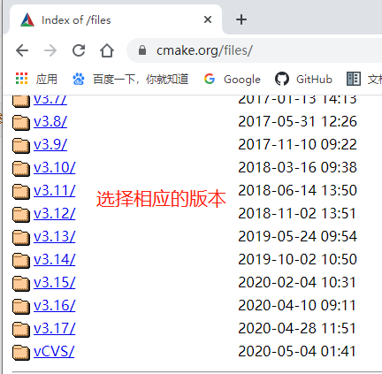
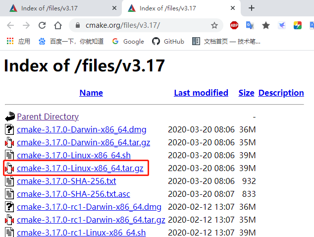
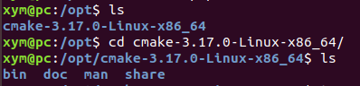
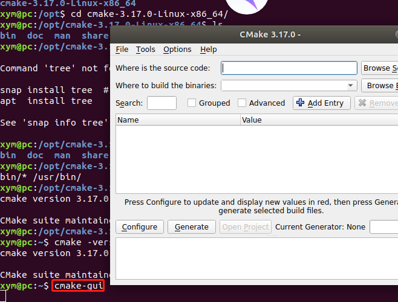
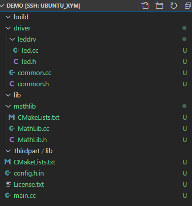
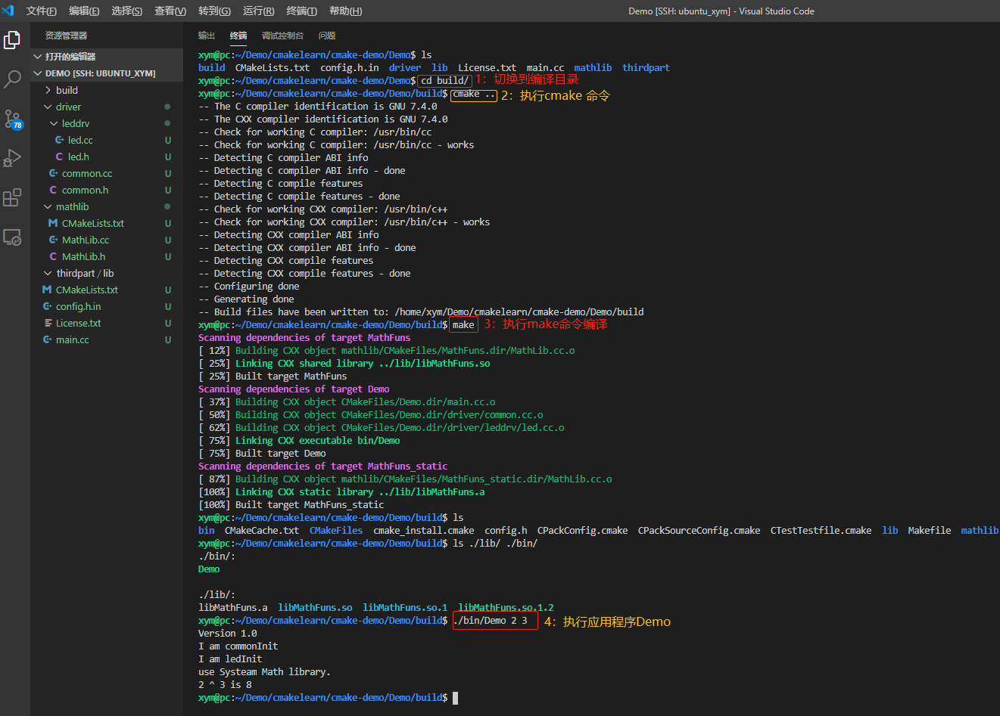
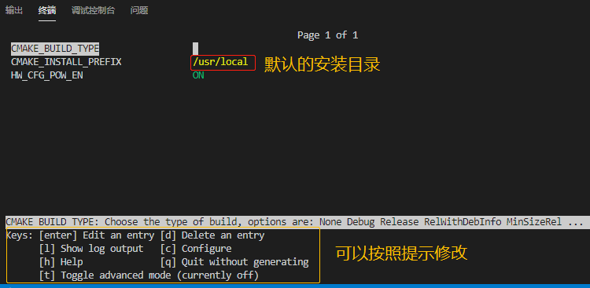
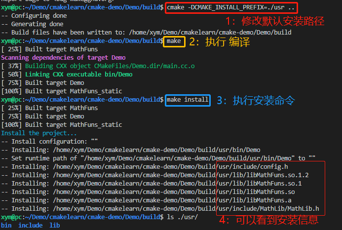
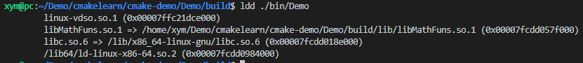
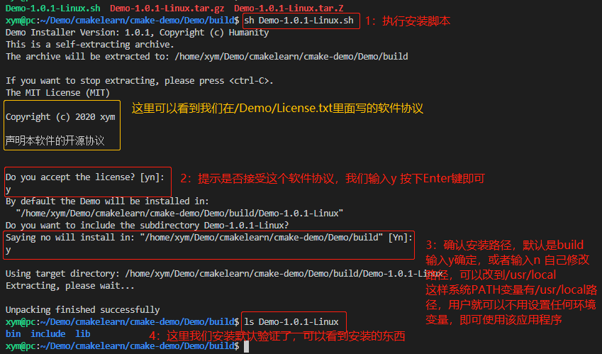

# CMake系列

##  Ubuntu安装CMake

### 下载

```bash
xym@pc:~$ cmake -version 				#查看是否安装了cmake
```

**下载地址：**[https://github.com/RobotFly/cmake_demo.git](https://github.com/RobotFly/cmake_demo.git)



我这里以最新版本v3.17为例说明：下载【`cmake-3.17.0-Linux-x86_64.tar.gz`】



### 安装

刚下载的安装包在`~/xym/Download`目录下，cmake可以安装在`/opt`或者`/usr`下，这里我选择`/opt`目录：

```bash
xym@pc:~/Downloads$ sudo tar -zxvf cmake-3.17.0-Linux-x86_64.tar.gz -C /opt/

```

解压完后查看如下图



添加软连接

```bash
xym@pc:~$ sudo ln -sf /opt/cmake-3.17.0-Linux-x86_64/bin/* /usr/bin/
```

再次查看版本：

```bash
xym@pc:~$ cmake -version
cmake version 3.17.0

CMake suite maintained and supported by Kitware (kitware.com/cmake).
 
```

```bash
xym@pc:~$ cmake-gui  #调出Gui配置界面
```



## 基本命令

### 语法说明

CMakelist中，命令名字是不区分大小写的，而参数和变量是大小写相关的。
CMake中使用"#"表示注释该行代码。
使用${}进行变量的引用
SET(变量 值) 自定义变量

### 内置变量

```bash
# set (CMAKE_INCLUDE_CURRENT_DIR ON) 等同于 
INCLUDE_DIRECTORY(${CMAKE_CURRENT_BINARY_DIR} 
				  ${CMAKE_CURRENT_SOURCE_DIR}
)

# CMAKE_BINARY_DIR,PROJECT_BINARY_DIR,_BINARY_DIR：这三个变量内容一致，<项目目录>/build目录
# CMAKE_SOURCE_DIR,PROJECT_SOURCE_DIR,_SOURCE_DIR：这三个变量内容一致，<项目目录>

# CMAKE_CURRENT_BINARY_DIR：外部编译时，指的是target目录，内部编译时，指的是顶级目录
# CMAKE_CURRENT_SOURCE_DIR：当前CMakeList.txt所在的目录
# CMAKE_CURRENT_LIST_DIR  ：当前CMakeList.txt的完整路径
# CMAKE_CURRENT_LIST_LINE ：当前所在的行
# CMAKE_MODULE_PATH       ：如果工程复杂，可能需要编写一些cmake模块，这里通过SET指定这个变量
# LIBRARY_OUTPUT_DIR,BINARY_OUTPUT_DIR：库和可执行的最终存放目录
# PROJECT_NAME            ：工程名字
```

### 常用命令

1. CMake 最低版本号要求

```bash
cmake_minimum_required (VERSION 2.8)
```

2. 项目信息

```bash
project (Demo)
```

3. `aux_source_directory` 查找当前目录下的所有源文件并将名称保存到 DIR_SRCS 变量

```bash
aux_source_directory(. DIR_SRCS)
```

4. `add_executable` 工程生成目标文件

```bash
add_executable(Demo ${DIR_SRCS})
```

5.  target_link_libraries 将若干库链接到目标库文件

```bash
target_link_libraries(myProject MathFuns) 		# 连接libMathFuns.so库，默认优先链接动态库
target_link_libraries(myProject libMathFuns.a) 	# 显示指定链接静态库
target_link_libraries(myProject libMathFuns.so) # 显示指定链接动态库
target_link_libraries(myProject lib1 lib2 lib3)
```

链接的顺序应当符合gcc链接顺序规则，被链接的库放在依赖它的库的后面，即如果上面的命令中，lib1依赖于lib2, lib2又依赖于lib3，则在上面命令中必须严格按照lib1 lib2 lib3的顺序排列，否则会报错
也可以自定义链接选项, 比如针对lib1使用-WL选项，`target_link_libraries(myProject  lib1 -WL, lib2 lib3)`

6. `add_library` 生成静态链接库和动态库

```bash
add_library(libname [SHARED|STATIC] source1 source2 ... sourceN)
add_library (hello STATIC ${LIBHELLO_SRC}) #生成静态链接库
add_library (hello SHARED ${LIBHELLO_SRC}) #生成动态链接库
```

7. `SET_TARGET_PROPERTIES` 设置输出别名，例如希望 `"hello_static"` 在输出时，不是`"hello_static"`，而是以`"hello"`的名字显示，故设置如下

```bash
SET_TARGET_PROPERTIES (hello_static PROPERTIES OUTPUT_NAME "hello")
GET_TARGET_PROPERTY (OUTPUT_VALUE hello_static OUTPUT_NAME) #获取值
```

8. `include_directories` 设置头文件位置，相当于g++ -I，可以用相对或者绝对路径，也可以用自定义的变量值

```bash
INCLUDE_DIRECTORIES(
    ${PROJECT_SOURCE_DIR}
    ${PROJECT_BINARY_DIR}
    ${PROJECT_SOURCE_DIR}/thirdpart/includes # 本工程需要使用的额外库的头文件存放地
    ${PROJECT_SOURCE_DIR}/driver
    ${PROJECT_SOURCE_DIR}/driver/leddrv
    /usr/local/include                       # 本工程需要包含系统的头文件路径
)
```

9. `link_directories` 添加需要链接的库文件目录,它相当于g++命令的-L选项的作用

```bash
link_directories(
      ${PROJECT_SOURCE_DIR}/thirdpart/lib       # 本工程需要使用的第三方库路径
      /usr/local/lib                            # 本工程需要使用的系统库路径
)
```

10. link_libraries 添加需要链接的库文件路径

```bash
link_libraries(library1 <debug | optimized> library2 ...)
# 直接是全路径
link_libraries(“/home/server/third/lib/libcommon.a”)
# 下面的例子，只有库名，cmake会自动去所包含的目录搜索
link_libraries(iconv)
# 传入变量
link_libraries(${RUNTIME_LIB})
# 也可以链接多个
link_libraries("/opt/MATLAB/R2012a/bin/glnxa64/libeng.so"　
				"/opt/MATLAB/R2012a/bin/glnxa64libmx.so")
```

11. `SET_TARGET_PROPERTIES` 用来设置输出的名称

```bash
SET_TARGET_PROPERTIES (target1 target2 ...PROPERTIES prop1 value1 prop2 value2 ...)
SET_TARGET_PROPERTIES (hello PROPERTIES VERSION 1.2 SOVERSION 1) 实现动态库版本号 VERSION指代动态库版本，SOVERSION指代API版本。
SET_TARGET_PROPERTIES(hello_static PROPERTIES OUTPUT_NAME "hello") 将libhello_static.a库名称输出为libhello.a
```

12.  GET_TARGET_PROPERTY 获取属性值

```bash
GET_TARGET_PROPERTY (VAR target property) VAR:变量 target：目标 property：属性
GET_TARGET_PROPERTY (OUTPUT_VALUE hello_static OUTPUT_NAME)
```

13. MESSAGE 打印cmake时信息

```bash
MESSAGE (STATUS "This is the hello_static OUTPUT_NAME: " ${OUTPUT_VALUE})
# MESSAGE指令的语法是：
# MESSAGE([SEND_ERROR | STATUS | FATAL_ERROR] "message to display" ...)
# 这个指令用于向终端输出用户信息，包含三种类型：
# SEND_ERROR，产生错误，生成过程被跳过。
# SATUS,输出前缀为-的信息。
# FATAL_ERROR，立即终止所有cmake过程
```

14. `add_library` 导入库

```bash
add_library(<name> [STATIC | SHARED | MODULE | UNKNOWN] IMPORTED)
导入了一个已存在的<name>库文件，导入库一般配合set_target_properties使用，这个命令用来指定导入库的路径,比如：
add_library(test SHARED IMPORTED)
set_target_properties( test #指定目标库名称
PROPERTIES IMPORTED_LOCATION #指明要设置的参数
libs/src/${ANDROID_ABI}/libtest.so #设定导入库的路径)
```

15. `set`

```bash
# 设置可执行文件的输出路径(EXCUTABLE_OUTPUT_PATH是全局变量)
set(EXECUTABLE_OUTPUT_PATH [output_path])
# 设置库文件的输出路径(LIBRARY_OUTPUT_PATH是全局变量)
set(LIBRARY_OUTPUT_PATH [output_path])
# 设置C++编译参数(CMAKE_CXX_FLAGS是全局变量)
set(CMAKE_CXX_FLAGS "-Wall std=c++11")
# 设置源文件集合(SOURCE_FILES是本地变量即自定义变量)
set(SOURCE_FILES main.cpp test.cpp ...)
# 设置编译类型debug 或者release。 debug 版会生成相关调试信息，可以使用GDB 进行调试；release不会生成调试信息
set(CMAKE_BUILE_TYPE DEBUG)
# 设置编译器的类型
SET(CMAKE_C_FLAGS_DEBUG “-g -Wall”)
# 设置低版本g++编译器支持c++11，高版本自动识别
set(CMAKE_CXX_STANDARD 11)
```

需要注意的是，在哪里 ADD_EXECUTABLE 或 ADD_LIBRARY,如果需要改变目标存放路径,就在哪里的上面加入上述的定义

16. `add_subdirectory`
    如果当前目录下还有子目录时可以使用add_subdirectory，子目录中也需要包含有CMakeLists.txt

```bash
# sub_dir指定包含CMakeLists.txt和源码文件的子目录位置
# binary_dir是输出路径， 一般可以不指定
add_subdirecroty(sub_dir [binary_dir])
```

17.  文件操作命令`file`

```bash
# 将message写入filename文件中,会覆盖文件原有内容
file(WRITE filename "message")
# 将message写入filename文件中，会追加在文件末尾
file(APPEND filename "message")
# 重命名文件
file(RENAME <oldname> <newname>)
# 删除文件， 等于rm命令
file(REMOVE [file1 ...])
# 创建目录
file(MAKE_DIRECTORY [dir1 dir2 ...])
#这个命令将把该目录下及所有子文件夹内的所有后缀为.cpp的文件的路径，全部放入SRC_LIST这个变量中

file(GLOB_RECURSE SRC_LIST "*.cpp")
file(GLOB_RECURSE HEADERS "*.h")
file(GLOB_RECURSE FORMS "*.ui")
file(GLOB_RECURSE RESOURCES "*.qrc")
```

18. `set_directory_properties` 设置某个路径的一种属性

```bash
set_directory_properties(PROPERTIES prop1 value1 prop2 value2)
prop1 prop代表属性，取值为：
INCLUDE_DIRECTORIES
LINK_DIRECTORIES
INCLUDE_REGULAR_EXPRESSION
ADDITIONAL_MAKE_CLEAN_FILES
```

19. `find_library` 查找库所在目录，并将查找到路径放入到变量中

```bash
find_library(RUNTIME_LIB_VAR rt /usr/lib /usr/local/lib NO_DEFAULT_PATH)
cmake会在目录中查找，如果所有目录中都没有，值RUNTIME_LIB_VAR就会被赋为NO_DEFAULT_PATH
```

2. `add_definitions`

```bash
向 C/C++编译器添加-D 定义,比如:
add_definitions(-DENABLE_DEBUG -DABC),参数之间用空格分割。
如果你的代码中定义了
#ifdef ENABLE_DEBUG 
	这个代码块就会生效
#endif
```

21.  `add_dependencies`

```bash
定义 target 依赖的其他 target,确保在编译本 target 之前,其他的 target 已经被构建。
add_dependencies(target-name depend-target1
depend-target2 ...)
```

22. `file`

```bash
file操作：
message(STATUS "current dir: ${CMAKE_CURRENT_SOURCE_DIR}")  
file(WRITE test1.txt "Some messages to Write\n" )  
file(APPEND test1.txt "Another message to write\n")  
file(READ test1.txt CONTENTS LIMIT 4 OFFSET 12)  
message(STATUS "contents of test1.txt is: \n ${CONTENTS}")  
file(MD5 ${CMAKE_CURRENT_SOURCE_DIR}/test1.txt HASH_CONTENTS)  
message(STATUS "hash contents of test1.txt is: \n ${HASH_CONTENTS}")  
file(STRINGS test1.txt PARSED_STRINGS)  
message(STATUS "\n strings of test1.txt is: \n ${PARSED_STRINGS}")  
file(GLOB files RELATIVE ${CMAKE_CURRENT_SOURCE_DIR} "*.*")  
message(STATUS  "files: ${files}")  
file(MAKE_DIRECTORY dir1 dir2)  
file(RENAME dir2 dir3)  
file(REMOVE dir3)  
file(REMOVE_RECURSE dir3)  
file(RELATIVE_PATH relative_path ${PROJECT_SOURCE_DIR} ${CMAKE_CURRENT_SOURCE_DIR}/test1.txt)  
message(STATUS "relative path : ${relative_path}")  
file(TO_CMAKE_PATH "$ENV{PATH}" cmake_path)  
message(STATUS "cmake path: ${cmake_path}")  
file(TO_NATIVE_PATH "/usr/local/sbin;/usr/local/bin" native_path)  
message(STATUS "native path: ${native_path}")  
file(DOWNLOAD "http://www.baidu.com" ${CMAKE_CURRENT_SOURCE_DIR}/index.html SHOW_PROGRESS)  
file(COPY test1.txt DESTINATION ${CMAKE_CURRENT_SOURCE_DIR}/dir1)  
file(INSTALL test1.txt DESTINATION ${CMAKE_CURRENT_SOURCE_DIR}/dir1)
```

## 工程实例

**工程托管路径：**

### 工程目录结构

```bash
Demo
├── build                       # 编译输出目录，用户需要在此目录下执行 cmake ..
├── CMakeLists.txt              # 顶级CMakeLists.txt
├── config.h.in                 # CMake 配置文件
├── driver                      # 下面是自己的工程的源码目录，源代码都放在这里
│   ├── common.cc
│   ├── common.h
│   └── leddrv
│       ├── led.cc
│       └── led.h                    
├── License.txt    				# 协议
├── main.cc        				# 源码
├── mathlib        				# 源码需要编译成库目录，会生成libMathFuns.so和libMathFuns.a文件
│   ├── CMakeLists.txt 			#生成源码库的二级CMakeLists.txt
│   ├── MathLib.cc     			#库源码
│   └── MathLib.h      			#库头文件
└── thirdpart          			#本工程需要使用的第三方库，
    └── lib

```

在vscode里面显示目录结构如下图所示：



### 源码分析

**顶级Demo/CMakeLists.txt**

```bash
# CMake 最低版本号要求
cmake_minimum_required (VERSION 2.8)

# 项目信息
project (Demo)

# 给项目添加和维护版本号是一个好习惯，这样有利于用户了解每个版本的维护情况，
# 并及时了解当前所用的版本是否过时，或是否可能出现不兼容的情况。

set (Demo_VERSION_MAJOR 1)
set (Demo_VERSION_MINOR 0)

# 设置编译类型debug 或者release。 debug 版会生成相关调试信息，可以使用GDB 进行调试；release不会生成调试信息
set(CMAKE_BUILE_TYPE DEBUG)

#还是编译选项 自己看着加
add_compile_options(-Wall -std=c++11 -O3)

# 加入一个配置头文件，当我们执行cmake .. 时候，会把配置文件config.h.in转换为C语言需要的宏定义放在config.h 里面
configure_file (
  "${PROJECT_SOURCE_DIR}/config.h.in"
  "${PROJECT_BINARY_DIR}/config.h"
)

#  option 命令添加了一个 USE_MYMATH 选项，并且默认值为 ON :可以在build目录下执行 ccmake .. 调用配置界面修改该值
option (HW_CFG_POW_EN "Use provided math implementation" ON)

# 那么 HW_CFG_POW_EN 不会被定义，那么就加入自己写的 libMathFuns.so 库
if (HW_CFG_POW_EN)
  include_directories ("${PROJECT_SOURCE_DIR}/mathlib")
  add_subdirectory (mathlib)  
  set (EXTRA_LIBS ${EXTRA_LIBS} MathFuns)
endif (HW_CFG_POW_EN)

# set (CMAKE_INCLUDE_CURRENT_DIR ON) 等同于 INCLUDE_DIRECTORY(${CMAKE_CURRENT_BINARY_DIR} ${CMAKE_CURRENT_SOURCE_DIR})
# CMAKE_BINARY_DIR,PROJECT_BINARY_DIR,_BINARY_DIR：这三个变量内容一致，如果是内部编译，就指的是工程的顶级目录，如果是外部编译，指的就是工程编译发生的目录。
# CMAKE_SOURCE_DIR,PROJECT_SOURCE_DIR,_SOURCE_DIR：这三个变量内容一致，都指的是工程的顶级目录。

# CMAKE_CURRENT_BINARY_DIR：外部编译时，指的是target目录，内部编译时，指的是顶级目录
# CMAKE_CURRENT_SOURCE_DIR：CMakeList.txt所在的目录
# CMAKE_CURRENT_LIST_DIR  ：CMakeList.txt的完整路径
# CMAKE_CURRENT_LIST_LINE ：当前所在的行
# CMAKE_MODULE_PATH       ：如果工程复杂，可能需要编写一些cmake模块，这里通过SET指定这个变量
# LIBRARY_OUTPUT_DIR,BINARY_OUTPUT_DIR：库和可执行的最终存放目录
# PROJECT_NAME            ：工程名字

INCLUDE_DIRECTORIES(
    ${PROJECT_SOURCE_DIR}
    ${PROJECT_BINARY_DIR}
    ${PROJECT_SOURCE_DIR}/thirdpart/includes # 本工程需要使用的额外库的头文件存放地
    ${PROJECT_SOURCE_DIR}/driver
    ${PROJECT_SOURCE_DIR}/driver/leddrv
    /usr/local/include                       # 本工程需要包含系统的头文件路径
)

link_directories(
      ${PROJECT_SOURCE_DIR}/thirdpart/lib       # 本工程需要使用的第三方库路径
      /usr/local/lib                            # 本工程需要使用的系统库路径
)
# 设置源码文件SOURCE_FILES 变量  或者使用aux_source_directory(dir DIR_SRCS)命令，自动添加dir目录下的所有源码到DIR_SRCS里面

SET(SOURCE_FILES
     ${PROJECT_SOURCE_DIR}/main.cc
     ${PROJECT_SOURCE_DIR}/driver/common.cc
     ${PROJECT_SOURCE_DIR}/driver/leddrv/led.cc
)

SET(EXECUTABLE_OUTPUT_PATH ${PROJECT_BINARY_DIR}/bin)

# 指定生成目标
add_executable(Demo  ${SOURCE_FILES})
target_link_libraries (Demo                     # 为目标Demo 添加库
                      ${EXTRA_LIBS}             # 外部的库
                      pthread)                  # 系统内部库

# TARGET_LINK_LIBRARIES(Demo libMathFuns.a)  显示指定连接静态库，
# TARGET_LINK_LIBRARIES(Demo libMathFuns.so) 显示指定连接动态库，


# 默认安装目录是/usr/local/ 可以运行 ccmake .. 改变默认值 或者在build目录下 [cmake -DCMAKE_INSTALL_PREFIX=prefix_path ..]命令 修改路径为prefix_path 例如./usr 或者/usr/local
# 配置头文件config.h会被放到 prefix_path/include
# 应用程序Demo被放到 prefix_path/bin

install (TARGETS Demo DESTINATION bin)
install (FILES "${PROJECT_BINARY_DIR}/config.h" DESTINATION include)


# 构建一个 CPack 安装包
# 导入 InstallRequiredSystemLibraries 模块，以便之后导入 CPack 模块；
# 设置一些 CPack 相关变量，包括版权信息和版本信息，其中版本信息用了上一节定义的版本号；
# 导入 CPack 模块。

include (InstallRequiredSystemLibraries)    
set (CPACK_RESOURCE_FILE_LICENSE
  "${CMAKE_CURRENT_SOURCE_DIR}/License.txt")
set (CPACK_PACKAGE_VERSION_MAJOR "${Demo_VERSION_MAJOR}")
set (CPACK_PACKAGE_VERSION_MINOR "${Demo_VERSION_MINOR}")
include (CPack)


# 启用测试
enable_testing()

# 测试程序是否成功运行
add_test (test_run Demo 5 2)

# 测试帮助信息是否可以正常提示  PASS_REGULAR_EXPRESSION 用来测试输出是否包含后面跟着的字符串。
add_test (test_usage Demo)
set_tests_properties (test_usage
  PROPERTIES PASS_REGULAR_EXPRESSION "Usage: .* base exponent")

# 定义一个宏，用来简化测试工作
macro (do_test arg1 arg2 result)
  add_test (test_${arg1}_${arg2} Demo ${arg1} ${arg2})
  set_tests_properties (test_${arg1}_${arg2}
    PROPERTIES PASS_REGULAR_EXPRESSION ${result})
endmacro (do_test)
 
# 利用 do_test 宏，测试一系列数据
do_test (5 2 "is 25")


# MESSAGE指令的语法是：
# MESSAGE([SEND_ERROR | STATUS | FATAL_ERROR] "message to display" ...)
# 这个指令用于向终端输出用户信息，包含三种类型：
# SEND_ERROR，产生错误，生成过程被跳过。
# SATUS,输出前缀为-的信息。
# FATAL_ERROR，立即终止所有cmake过程
```

**Demo/config.h.in**

```bash
// the configured options and settings for Tutorial
#define Demo_VERSION_MAJOR @Demo_VERSION_MAJOR@
#define Demo_VERSION_MINOR @Demo_VERSION_MINOR@

// does the platform provide pow function?
#cmakedefine HW_CFG_POW_EN
```

**Demo/License.txt**

```bash
The MIT License (MIT)

Copyright (c) 2020 xym

声明本软件的开源协议
```

**Demo/driver/leddrv/led.cc**

```c
#include "led.h"
#include <stdio.h>
void ledInit(void)
{
   printf("I am ledInit\n");
}
```

**Demo/driver/leddrv/led.h**

```c
#ifndef _LED_H
#define _LED_H
  
void ledInit(void);

#endif
```

**Demo/driver/common.cc**

```c
#include "common.h"
#include <stdio.h>
void commonInit(void)
{
    printf("I am commonInit\n");

}
```

**Demo/driver/common.h**

```c
#ifndef _COMMON_H
#define _COMMON_H

void commonInit(void);

#endif
```

**Demo/mathlib/CMakeLists.txt**

```bash
# 查找当前目录下的所有源文件并将名称保存到 DIR_LIB_SRCS 变量
aux_source_directory(. DIR_LIB_SRCS)

#ADD_LIBRARY(libname [SHARED|STATIC]  source1 source2 ... sourceN)
#库类型：
#SHARED：动态库
#STATIC：静态库


SET(LIBRARY_OUTPUT_PATH ${PROJECT_BINARY_DIR}/lib)           # 指定库文件输出路径 这里实际就是build/lib

add_library (MathFuns        SHARED ${DIR_LIB_SRCS})         # 生成动态库， 
add_library (MathFuns_static STATIC ${DIR_LIB_SRCS})         # 生成静态库， 

SET_TARGET_PROPERTIES(MathFuns_static    PROPERTIES OUTPUT_NAME "MathFuns")  # 为静态库添加个别名，这样生成的名字就是 libMathFuns.so libMathFuns.a
SET_TARGET_PROPERTIES(MathFuns        PROPERTIES CLEAN_DIRECT_OUTPUT 1)      # 必须添加下面两个属性，否则在生成静态库libMathFuns.a的时候后删除上面的libMathFuns.so
SET_TARGET_PROPERTIES(MathFuns_static PROPERTIES CLEAN_DIRECT_OUTPUT 1)

#实现动态库版本号 设置版本号VERSION指动态库版本，SOVERSION指代API版本
SET_TARGET_PROPERTIES(MathFuns PROPERTIES VERSION 1.2 SOVERSION 1) 

# 指定 libMathFuns.so 库的安装路径
# 默认安装目录是/usr/local/ 可以运行 ccmake .. 改变默认值 或者在build目录下 [cmake -DCMAKE_INSTALL_PREFIX=prefix_path ..]命令 修改路径为prefix_path 例如./usr 或者/usr/local
# 库文件libMathFuns.so 会被放到/user/local/lib
# 库头文件MathLib.h会被放到    /user/local/include
# 在执行cmake的时候可以通过修改CMAKE_INSTALL_PREFIX变量改变安装目录


INSTALL(TARGETS MathFuns MathFuns_static
        LIBRARY DESTINATION lib                      # 指定静态库安装路径prefix_path/lib
        ARCHIVE DESTINATION lib)                     # 指定动态库安装路径prefix_path/lib
INSTALL(FILES MathLib.h DESTINATION include/MathLib) # 指定头文件安装路径prefix_path/include/MathLib

```

**Demo/mathlib/MathLib.cc**

```c
#include "MathLib.h"

double power(double base, int exponent)
{
    int result = base;
    int i;

    if (exponent == 0) {
        return 1;
    }
    
    for(i = 1; i < exponent; ++i){
        result = result * base;
    }

    return result;
}
```

**Demo/mathlib/MathLib.h**

```c
#ifndef MATH_LIB_H
#define MATH_LIB_H

double power(double base, int exponent);

#endif

```

从代码可以看出，

1. `Demo/mathlib`需要生成`libMathFuns.so和libMathFuns.a`库文件，

   `make`时候生成库的路径用`SET(LIBRARY_OUTPUT_PATH ${PROJECT_BINARY_DIR}/lib)`指定； 

   `make install`时候安装库目录在`prefix_path/lib`

   库头文件安装在`prefix_path/include/MathLib`目录下

2. `Demo`这个应用程序依赖`common.cc led.cc main.c`源码以及自己生成的库`libMathFuns.so`和第三方的库(放在`thirdpart/lib`目录下，这里没有加上，如果用户新增的话模仿libMathFuns.so添加方式即可)；

3. 且根据`Demo/config.h.in`执行`cmake ..`时候生成配置文件`config.h`在`Demo/build/`目录下

   执行`make install`时候`config.h`安装路径：`prefix_path/include`

   应用程序`Demo`安装在：`prefix_path/bin`

### 代码验证

#### 正常的编译执行

```bash
xym@pc:~/Demo/cmakelearn/cmake-demo/Demo$ cd build/					#切换到编译目录
xym@pc:~/Demo/cmakelearn/cmake-demo/Demo/build$ cmake ..            #执行cmake ..
xym@pc:~/Demo/cmakelearn/cmake-demo/Demo/build$ ls ./lib/ ./bin/    #查看生成的库和应用程序
xym@pc:~/Demo/cmakelearn/cmake-demo/Demo/build$ ./bin/Demo 2 3      #执行应用程序
```



#### 安装应用程序

```bash
xym@pc:~/Demo/cmakelearn/cmake-demo/Demo/build$ ccmake ..  #调用配置界面，配置默认安装路径，
```




```bash
xym@pc:~/Demo/cmakelearn/cmake-demo/Demo/build$ cmake -DCMAKE_INSTALL_PREFIX=./usr ..    #指定安装目录在 当前目录下的/usr目录下即 /build/usr
xym@pc:~/Demo/cmakelearn/cmake-demo/Demo/build$ make
xym@pc:~/Demo/cmakelearn/cmake-demo/Demo/build$ make install
```



查看应用程序连接

```bash
xym@pc:~/Demo/cmakelearn/cmake-demo/Demo/build$ ldd  ./bin/Demo
```



#### 打包

```bash
cpack -C CPackConfig.cmake       #生成二进制安装包
cpack -C CPackSourceConfig.cmake #生成源码安装包
```

步骤如下：

1. 清除build所有文件,从新编译；

   ```bash
   xym@pc:~/Demo/cmakelearn/cmake-demo/Demo/build$ rm -rf ./*
   xym@pc:~/Demo/cmakelearn/cmake-demo/Demo/build$ cmake ..
   xym@pc:~/Demo/cmakelearn/cmake-demo/Demo/build$ make
   ```

2. 执行打包命令

   ```bash
   xym@pc:~/Demo/cmakelearn/cmake-demo/Demo/build$ cpack -C CPackConfig.cmake
   CPack: Create package using STGZ
   CPack: Install projects
   CPack: - Run preinstall target for: Demo
   CPack: - Install project: Demo [CPackConfig.cmake]
   CPack: Create package
   CPack: - package: /home/xym/Demo/cmakelearn/cmake-demo/Demo/build/Demo-1.0.1-Linux.sh generated.
   CPack: Create package using TGZ
   CPack: Install projects
   CPack: - Run preinstall target for: Demo
   CPack: - Install project: Demo [CPackConfig.cmake]
   CPack: Create package
   CPack: - package: /home/xym/Demo/cmakelearn/cmake-demo/Demo/build/Demo-1.0.1-Linux.tar.gz generated.
   CPack: Create package using TZ
   CPack: Install projects
   CPack: - Run preinstall target for: Demo
   CPack: - Install project: Demo [CPackConfig.cmake]
   CPack: Create package
   CPack: - package: /home/xym/Demo/cmakelearn/cmake-demo/Demo/build/Demo-1.0.1-Linux.tar.Z generated.
   ```

   ```bash
   #查看安装包
   
   xym@pc:~/Demo/cmakelearn/cmake-demo/Demo/build$ ls Demo-1.0.1-Linux.* 
   Demo-1.0.1-Linux.sh  Demo-1.0.1-Linux.tar.gz  Demo-1.0.1-Linux.tar.Z
   ```

这 3 个二进制包文件所包含的内容是完全相同的。我们可以执行其中一个。此时会出现一个由 CPack 自动生成的交互式安装界面。

#### 验证打包的程序

```bash
xym@pc:~/Demo/cmakelearn/cmake-demo/Demo/build$ sh Demo-1.0.1-Linux.sh
```

