# Win下VsCodeSSH连接Ubuntu

## 环境检查

### ubuntu检查是否开启ssh服务

```bash
安装SSH命令：sudo apt-get install openssh-server
是否成功安装命令：ssh -V
启动SSH命令：sudo service ssh start
查看是否启动：sudo ps -e |grep ssh
```

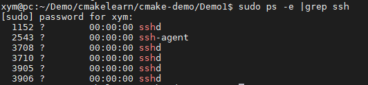

### Win安装ssh客户端

win10系统一般自带的有SSH客户端，且已经打开，如果没有可以通过桌面左下角的设置->应用->管理可选功能->添加功能-，选择OpenSSH Client(Bata)选项

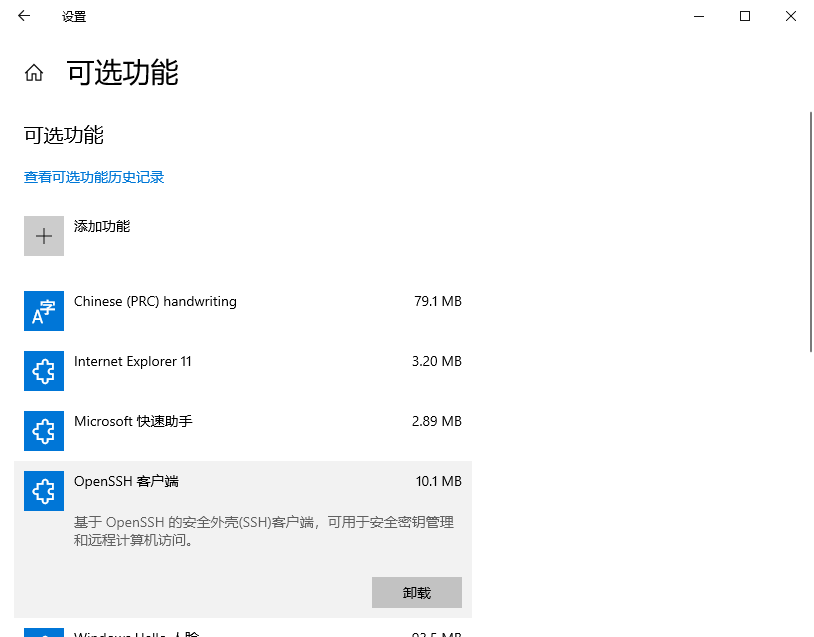

## 插件安装

win下安装vscode插件：`remote development`

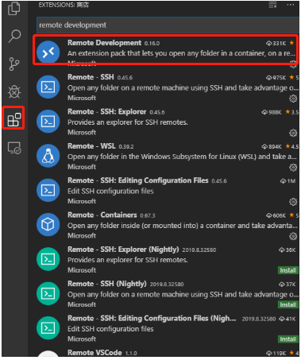

## 配置

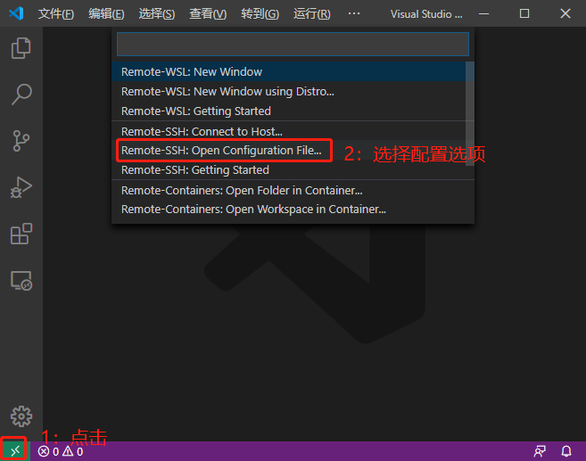

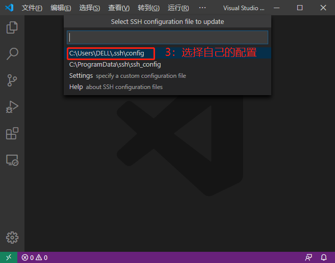

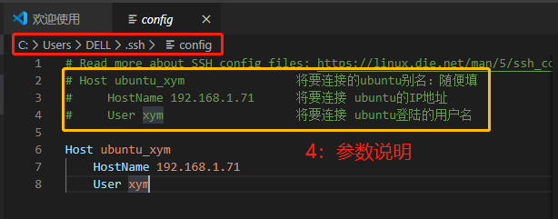

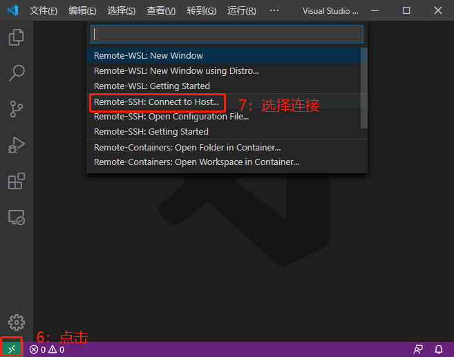

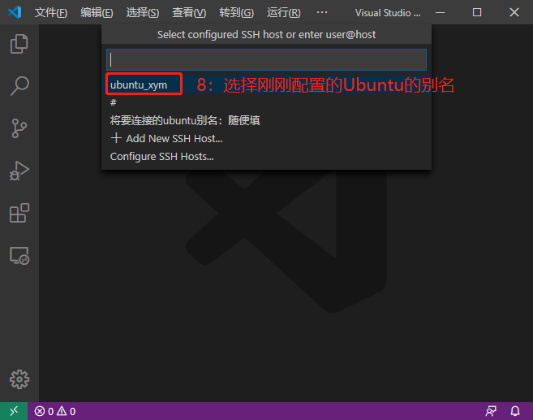

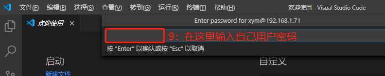

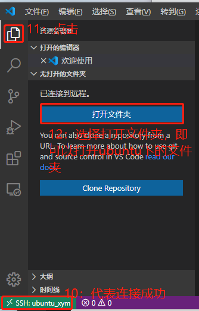

登陆完成后打开自己的终端即可：

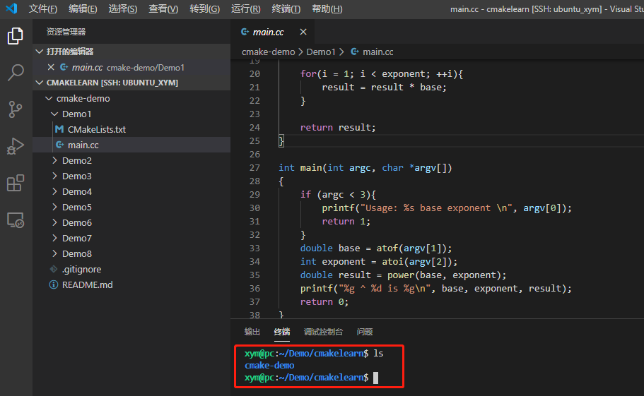


## 免密登陆

 