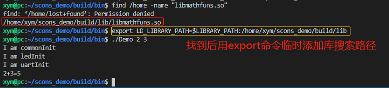

# Linux库使用说明


## 生成静态库

生成静态库使用**ar**工具，其实ar是archive的意思

```bash
$ar -cr libhello.a hello.o  # 生成一个名字为libhello.a的静态库
```

## 生成动态库

用gcc来完成，由于可能存在多个版本，因此通常指定版本号：

```bash
$gcc -shared -fpic -o libhello.so.1.0 hello.o  # 生成一个主版本号为1.0名字为libhello.so的一个动态库
```

## 库文件命名规范
在 linux 下，库文件一般放在`/usr/lib`和`/lib`下， 

- 静态库的名字一般为`libxxxx.a`，其中 xxxx 是该lib的名称；
- 动态库的名字一般为`libxxxx.so.major.minor`，xxxx 是该lib的名称，`major`是主版本号，`minor`是副版本号 

## 库搜索路径

**动态库：**

1. 编译链接时：
   * `-L`、`-rpath`和`-rpath-link`指定库搜索路径；
   * 环境变量`LD_LIBRARY_PATH` 指定的库搜索路径；
   * 默认的动态库搜索路径`/lib`；
   * 默认的动态库搜索路径`/usr/lib`。

2. 运行时：
   - `-rpath`指定的路径还有效(因为链接器已经将库的路径包含在可执行文件中)；
   - 环境变量`LD_LIBRARY_PATH` 指定的动态库搜索路径；
   - `/etc/ld.so.conf`中所缓存的动态库路径；
   - 默认的动态库搜索路径`/lib`；
   - 默认的动态库搜索路径`/usr/lib`。

**静态库：**

1. 编译链接时：
   - -L指定库的搜索路径；
   - 环境变量`LIBRARY_PATH`, 指定的动态库搜索路径；
   - 默认的动态库搜索路径`/lib`
   - 默认的动态库搜索路径`/usr/lib`。
2. 运行时：不存在，因为可执行程序已经把.a文件打包到可执行程序中。

## 常用的命令

   ###  -Wl、-rpath、-I、-L、-l命令

```bash
CFLAGS = -g \
		 -I$(CURDIR) \      			# -I:指定头文件路径

LIBS := -L/$(CURDIR)/lib \  			# -L:指定编译时候库搜索路径
		-lpthread \         			# -l:指定编译时候库名字
        -Wl,-rpath=/home/xym/Demo/lib \ #-Wl,-rpath ：同时指定动态库编译和运行时的路径
		 
```

### 修改库环境变量LD_LIBRARY_PATH和LIBRARY_PATH

```bash
动态库：LD_LIBRARY_PATH
静态库：LIBRARY_PATH

export LD_LIBRARY_PATH =$LIBRARY_PATH:/home/xym/Demo/lib 
如果有多个路径需要添加：中间用:隔开
export LD_LIBRARY_PATH=/home/book/Demo/arm/sqlite/lib:/home/book/nfs_rootfs/lib:$LD_LIBRARY_PATH
```

**注意：**

- 在终端执行，会临时生效，关闭终端后就失效了；

- 如果一直生效，可以在`~/.bashrc`文件的最后追加这段代码，执行`source ~/.bashrc`立即生效即可。

  

### 修改/etc/ld.so.conf中所缓存的动态库路径

```bash
sudo vim /etc/ld.so.conf  #末尾添加自己的库搜索路径
sudo ldconfig             #配置生效
```

**注意**：在嵌入式Linux系统的实际应用中，使用的比较少, 因为有很多系统根本就不支持ld.so.conf。并且该配置只在程序运行时有效。

### ldd命令

查看可执行程序依赖那些动态库或着动态库依赖于那些动态库例如 ：

```bash
xym@pc:~/scons_demo/build/bin$ ldd Demo 
        linux-vdso.so.1 (0x00007ffd2c31a000)
        libmathfuns.so => not found
        libc.so.6 => /lib/x86_64-linux-gnu/libc.so.6 (0x00007f7a04a3d000)
        /lib64/ld-linux-x86-64.so.2 (0x00007f7a05030000)
```

​    可以看到 应用程序`Demo`命令依赖于`linux-vdso.so.1、 libmathfuns.so`库和`libc.so.6 ld-linux-x86-64.so.2` 库 ，这里很明显可以看到`libmathfuns.so => not found` 这个库有问题，那么我么就可以find命令找到这个库，然后采用上刚章节来添加该库的搜索路径来解决这个问题，例如：



此时再次用ldd命令查看，可以看到`libmathfuns.so => /home/xym/scons_demo/build/lib/libmathfuns.so`已经链接成功

```bash
xym@pc:~/scons_demo/build/bin$ ldd Demo 
        linux-vdso.so.1 (0x00007fffecffc000)
        libmathfuns.so => /home/xym/scons_demo/build/lib/libmathfuns.so (0x00007f5a3b24c000)
        libc.so.6 => /lib/x86_64-linux-gnu/libc.so.6 (0x00007f5a3ae5b000)
        /lib64/ld-linux-x86-64.so.2 (0x00007f5a3b650000)
xym@pc:~/scons_demo/build/bin$ 
```

### nm命令

查看静态库和动态库中有那些函数名

- T类：表示函数是当前库中定义的；

- U类：表示函数是被调用的，在其它库中定义的；

- W类：是当前库中定义，被其它库中的函数覆盖，即“弱态”符号。
      

例如，假设开发者希望知道上文提到的`libmathfuns.so`库中是否引用了 `puts()`:

```bash
$ nm libmathfuns.so | grep puts
                 U puts@@GLIBC_2.2.5
```

发现`puts`是U类符号，说明`puts`被引用，但是并没有在库中定义。

由此可以推断，要正常使用`libmathfuns.so`库，必须有其它库支持，使用`ldd`工具查看`libmathfuns.so`依赖于哪些库即可。然后找到库，并添加到搜索路径。

```bash
xym@pc:~/scons_demo/build/lib$ ldd libmathfuns.so 
        linux-vdso.so.1 (0x00007fffb11ff000)
        libc.so.6 => /lib/x86_64-linux-gnu/libc.so.6 (0x00007f4615561000)
        /lib64/ld-linux-x86-64.so.2 (0x00007f4615b54000)
xym@pc:~/scons_demo/build/lib$ 
```

 

### ar命令

可以生成静态库，同时可以查看静态库中包含那些.o文件，即有那些源文件构成

```bash
xym@pc:~/scons_demo/build/lib$ ar -t libmathfuns.a
mathfuns.o
#可以看出库libmathfuns.a是有mathfuns.o文件组成的
```

　　

## Linux程序设计关于库的使用细节

### gcc/g++命令中关于库的参数

1. `-shared`： 该选项指定生成动态连接库（让连接器生成T类型的导出符号表，有时候也生成弱连接W类型的导出符号），不用该标志外部程序无法连接。相当于一个可执行文件；
2. `-fPIC`：表示编译为位置独立(地址无关)的代码，不用此选项的话，编译后的代码是位置相关的，所以动态载入时，是通过代码拷贝的方式来满足不同进程的需要，而不能达到真正代码段共享的目的；
3. `-L`：指定链接库的路径，-L. 表示要连接的库在当前目录中；
4. `-lmathfuns`：指定链接库的名称为mathfuns，编译器查找动态连接库时有隐含的命名规则，即在给出的名字前面加上lib，后面加上.so来确定库的名称；
5. `LD_LIBRARY_PATH`：这个环境变量指示动态连接器可以装载动态库的路径。   当然如果有root权限的话，可以修改`/etc/ld.so.conf`文件，然后调用 `/sbin/ldconfig`来达到同样的目的；不过如果没有root权限，那么只能采用修改`LD_LIBRARY_PATH`环境变量的方法了。 

**注：**调用动态库的时候，有时，明明已经将库的头文件所在目录 通过 `“-I” include`进来了，库所在文件通过 `“-L”`参数引导，并指定了`“-l”`的库名，但通过`ldd`命令察看时，就是死活找不到你指定链接的`so`文件，这时你要作的就是通过修改 `LD_LIBRARY_PATH`指定动态库的目录。通常这样做就可以解决库无法链接的问题了。

### 静态库和动态库同时存在的问题

当一个库同时存在静态库和动态库时，比如`libmathfuns.a`和`libmathfuns.so`同时存在时：在Linux下，gcc/g++的链接程序，默认链接的动态库。可以使用下面的方法，给连接器传递参数，指定链接动态库还是静态库。

```bash
gcc/g++ test.c -o test -WI,-Bstatic -lmathfuns  #指定连接静态库
```

```bash
gcc/g++ test.c -o test -WI,-Bdynamic -lmathfuns  #指定连接动态库
```

如果要完全静态加载，使用`-static`参数，即将所有的库以静态的方式链入可执行程序，这样生成的可执行程序，不再依赖任何库，同时出现的问题是，这样编译出来的程序非常大，占用空间。

### 动态库热升级问题

在动态链接库热升级时，不能直接使用`cp newlib.so oldlib.so`，这样有可能会使程序core掉； 

而应该使用:  

```bash
rm oldlib.so 
cp newlib.so oldlib.so    
或者   
mv oldlib.so oldlib.so_bak 
cp newlib.so oldlib.so
```

