# buildroot之QT文件系统

- 主机环境：ubuntu18.04-64bit
- 硬件版本：野火imx6ull-pro emmc

------

## 制作根文件系统

### 下载buildroot

本篇用的是 buildroot-2019.02.6.tar.gz，制作方法都一样，下载连接地址： [buildroot各版本官方下载页](https://git.busybox.net/buildroot/refs/)

```bash
# 直接在命令行里下载
wget https://git.busybox.net/buildroot/snapshot/buildroot-2019.02.6.tar.gz
# 解压到自己指定目录/home/book/embedfire/ebf_6ull_buildroot/
tar -xvf buildroot-2019.02.6.tar.gz -C /home/book/embedfire/ebf_6ull_buildroot/
```

### 配置buildroot

- 进入配置菜单

```bash
cd ebf_6ull_buildroot/
make menuconfig
```

- 主页面


- **Target options**：目标架构特性

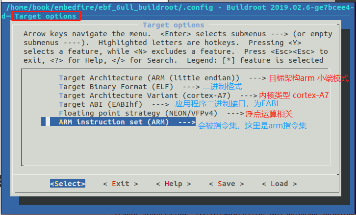

- **Build options** ：编译选项

  主要是一些编译时用到的选项,比如dl的路径,下载代码包使用的路径,同时运行多个编译的上限,是否使能编译器缓冲区等等,这里按照默认就行了.

- **Toolchain**：工具链

  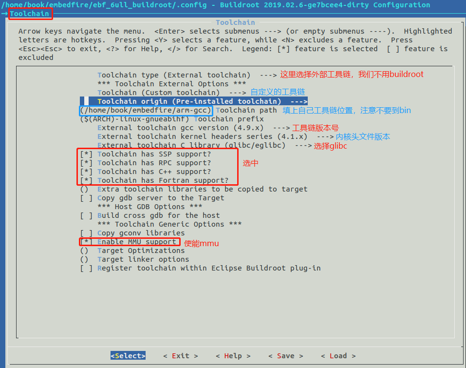

- **System configuration**：系统配置

  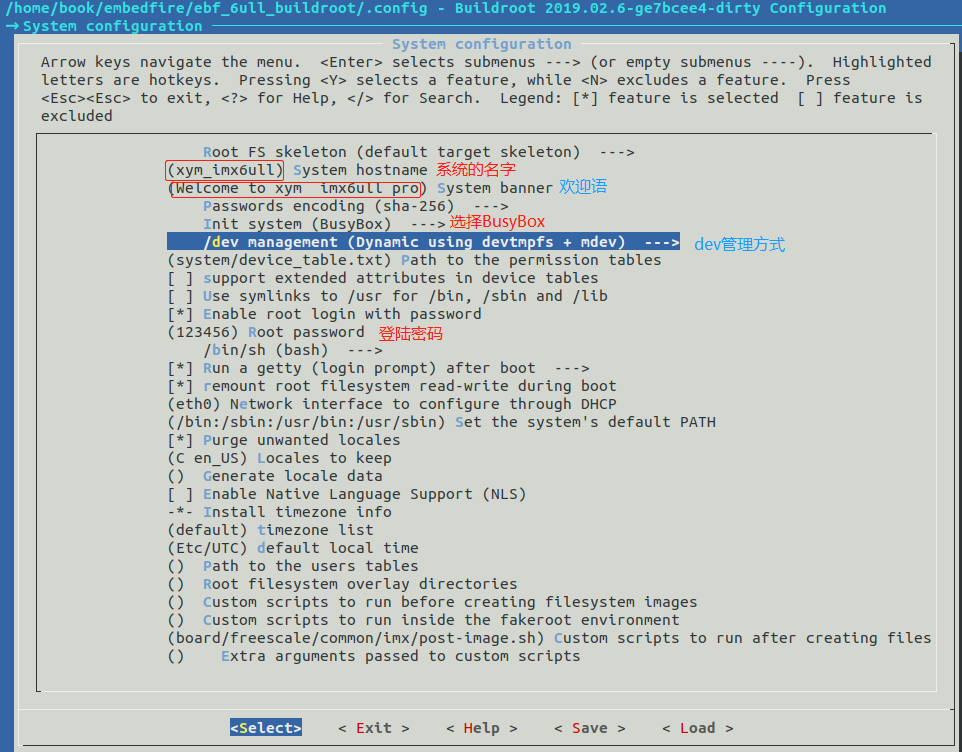

- **Kernel**：内核配置

  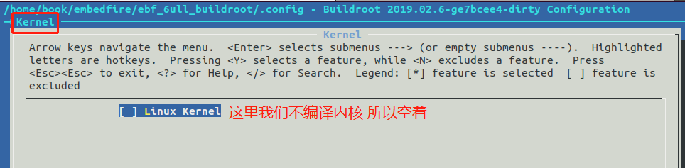

- **Bootloaders**: uboot配置

  

- **Filesystem images**：文件系统

  - 找到ext2/3/4 root filesystem 项 ，如果是 EMMC 或 SD 卡的话就用 ext3/ext4配置成ext4；
  - 找到ubi image containing an ubifs root filesystem选中它，如果使用 NAND 的话就不选，用 ubifs。

  

- **Target packages**：第三方库

  - **使能alsa-lib**

    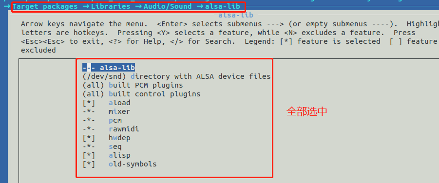

  - **使能 alsa-utils**

    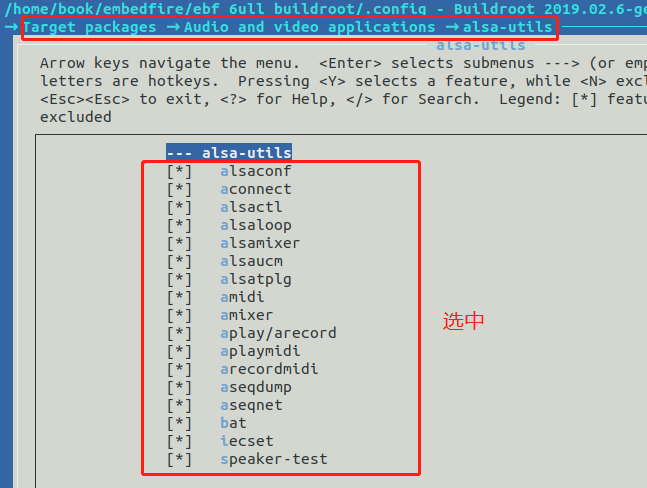

  - **使能QT**

    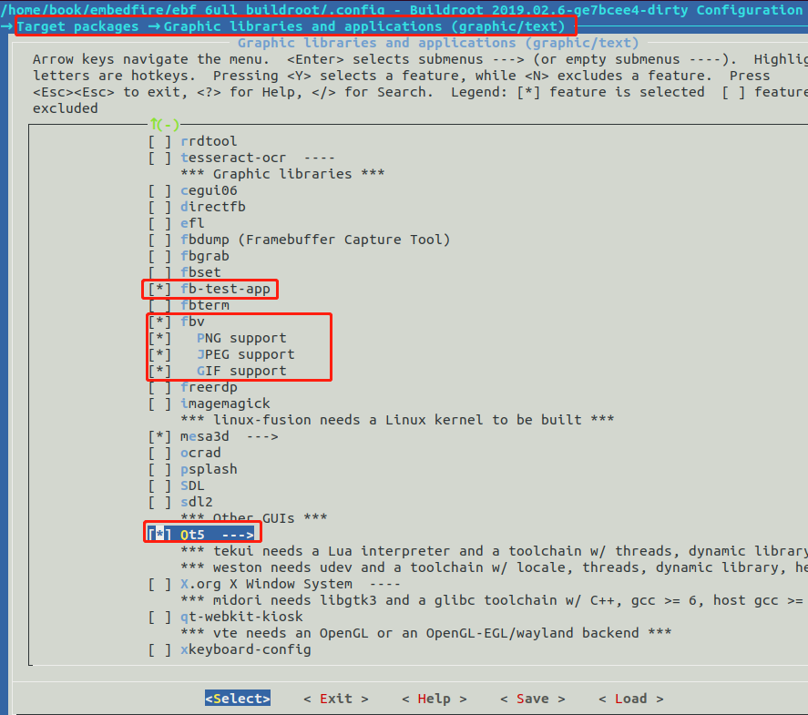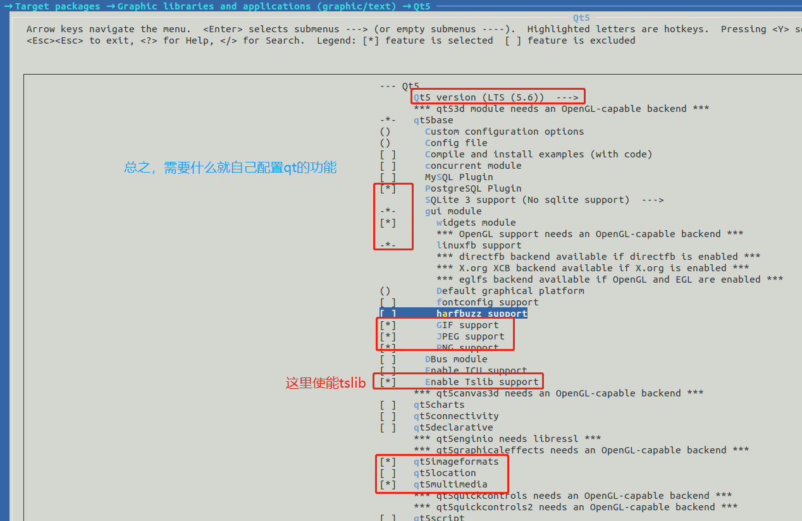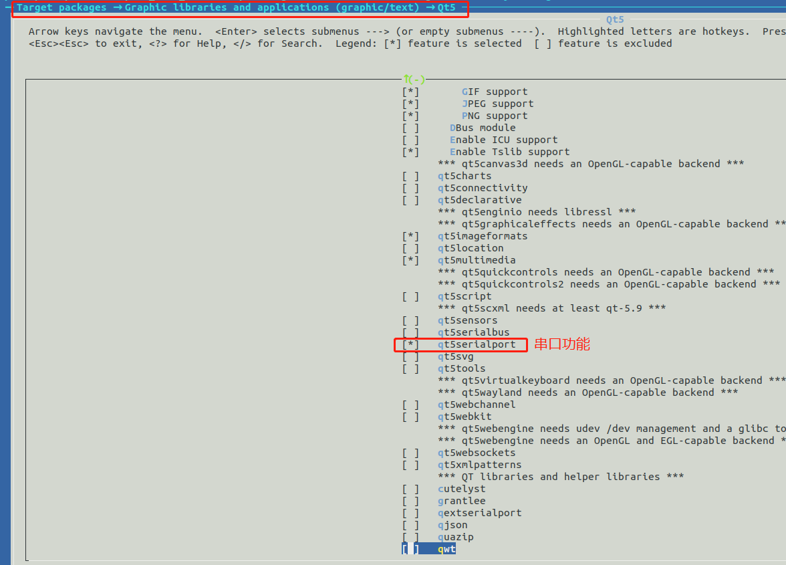


使用我的默认配置点这里查看下载：

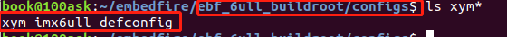

把我的配置文件复制到buildroot目录，并改名为.config。

```bash
cp xym_imx_defconfig .config
```

查看已经配置的软件包

如果时间久忘记了，可以用来查看配置情况。

```
make show-targets
```

### 编译buildroot

很简单，直接make.

```bash
make
```

整个编译过程较长，可能达几个小时。

### 生成的根文件系统和工具链位置

生成根文件系统位置：

```bash
book@100ask:~/embedfire/ebf_6ull_buildroot/output/images$ ls
rootfs.cpio     rootfs.cpio.uboot  rootfs.ext4  rootfs.ubi
rootfs.cpio.gz  rootfs.ext2        rootfs.tar   rootfs.ubifs
```

制作好的qmake工具链位置：

```
book@100ask:~/embedfire/ebf_6ull_buildroot/output/build/qt5base-5.6.3/bin$ ls
fixqt4headers.pl  moc  qlalr  qmake  qt.conf  rcc  syncqt.pl  uic
```

## ubuntu配置Qt Creator

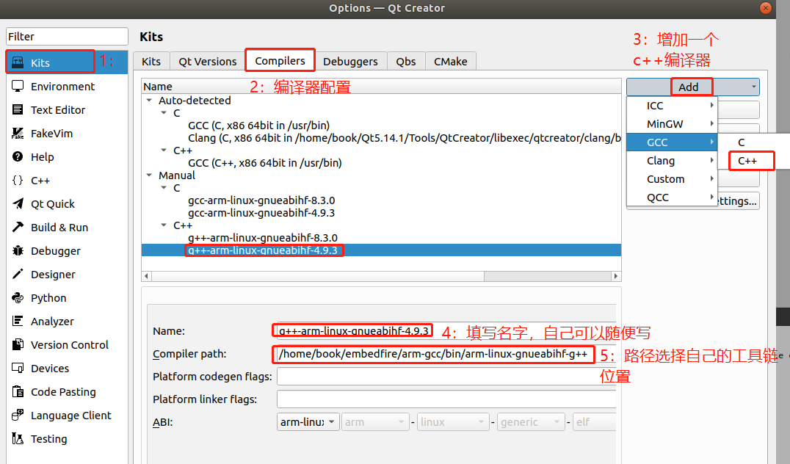

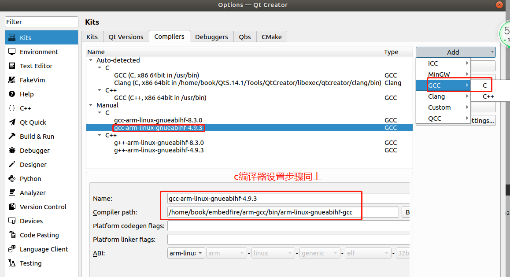

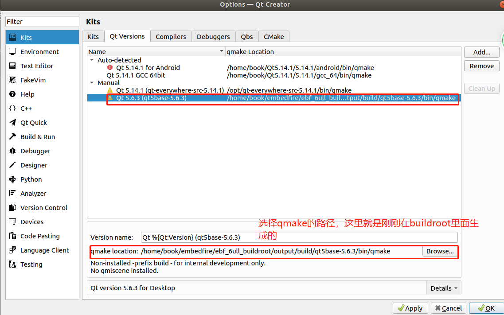

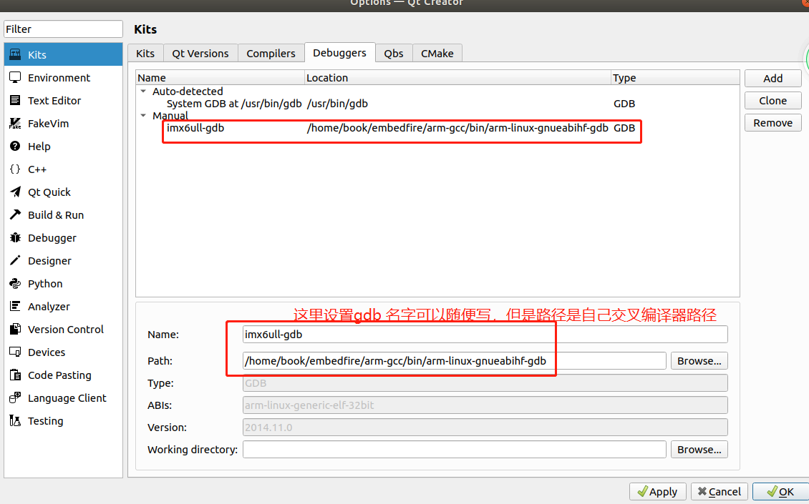


新建个qt的demo，UI里面随便加几个控件如下


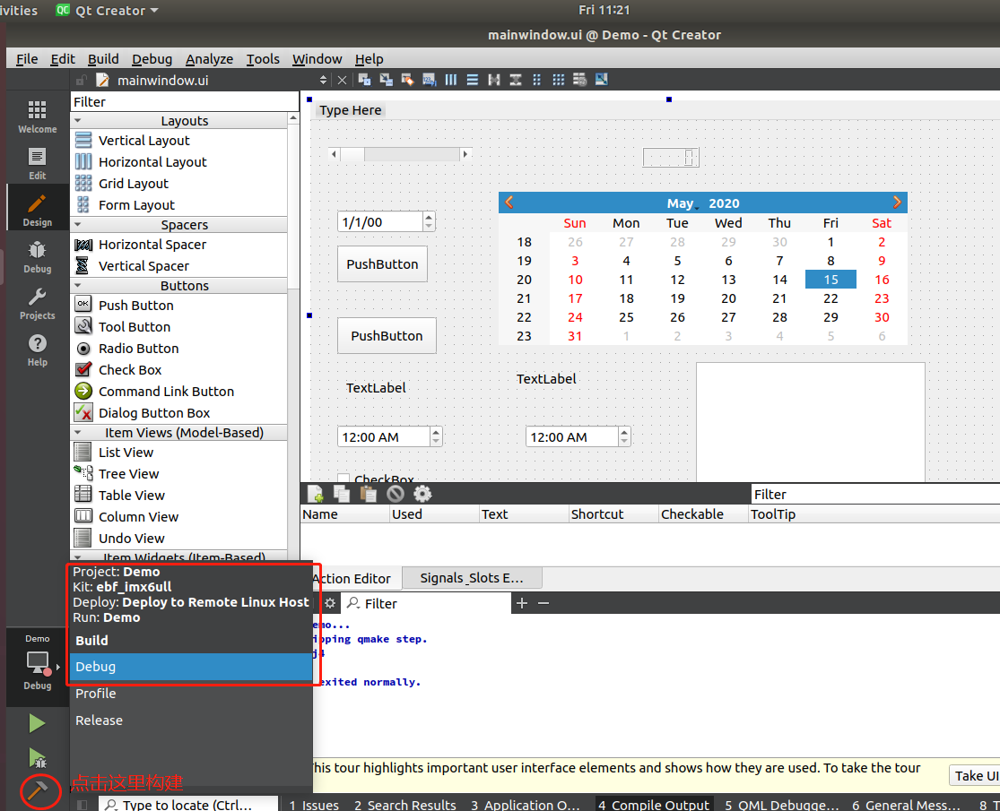

构建完成后在qtDemo工程下会生成Demo的可执行文件，拷贝到开发板的文件系统即可运行。

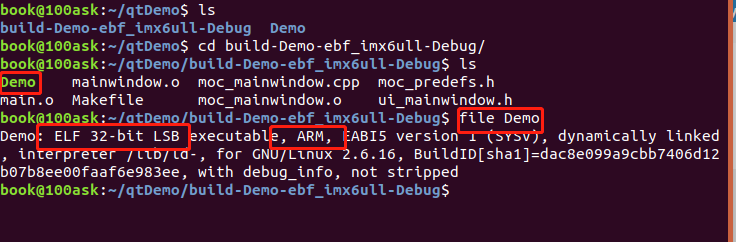

## 测试根文件系统

- 解压文件系统到nfs共享目录，用于nfs网络挂载文件系统

```

book@100ask:~/embedfire/ebf_6ull_buildroot/output/images$ ls
rootfs.cpio  rootfs.cpio.gz  rootfs.cpio.uboot  rootfs.ext2  rootfs.ext4  rootfs.tar  rootfs.ubi  rootfs.ubifs
book@100ask:~/embedfire/ebf_6ull_buildroot/output/images$ sudo tar -xvf rootfs.tar -C /home/book/nfs_rootfs/
```

- 修改`/home/book/nfs_rootfs/etc/profile`显示当前路径和配置qt

```
book@100ask:~/nfs_rootfs$ sudo vim ./etc/profile
修改内容如下：


#if [ "$PS1" ]; then
#       if [ "`id -u`" -eq 0 ]; then
#               export PS1='# '
#       else
#               export PS1='$ '
#       fi
#fi

PS1='[ \u@\h]: \w$:'
export PS1

#QT
export  QT_QPA_PLATFORM=linuxfb:fb=/dev/fb0
export  QT_QPA_EVDEV_TOUCHSCREEN_PARAMETERS=/dev/input/event1:inverty

```

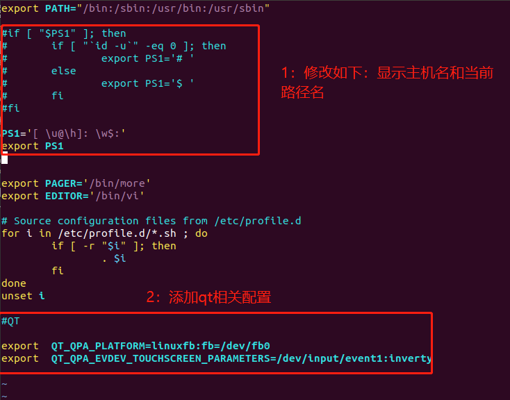

启动开发板后如下：

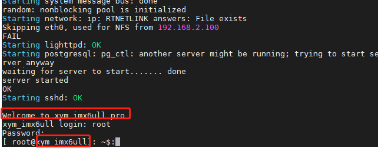

- 运行Demo

  ```
  
  [ root@xym_imx6ull]: /$:ls
  Demo     etc      linuxrc  opt      run      tmp
  bin      lib      media    proc     sbin     usr
  dev      lib32    mnt      root     sys      var
  [ root@xym_imx6ull]: /$:./Demo
  ```

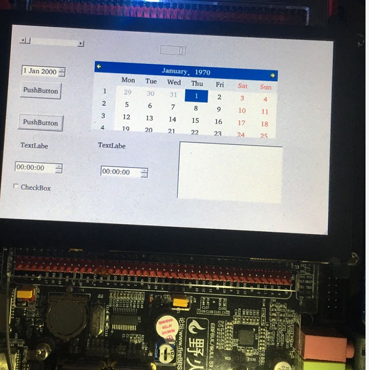