# IMX6ULL U-Boot使用和移植


## U-Boot常用命令

1. `bdinfo`：查看板子信息；

2. `printenv`：打印环境变量；

3. `version`：查看uboot版本信息；

4. 设置启动参数：

   ```bash
   setenv bootargs 'console=ttymxc0,115200 root=/dev/mmcblk1p2 rootwait rw' saveenv
   
   注释：
   console=ttymxc0,115200           控制台参数
   root=/dev/mmcblk1p2 rootwait rw  文件系统指定为mmc1的第二个分区  可读可写属性
   ```

5. 内存操作命令

   - **md**命令：以[.b, .w, .l]为单位读取指定地址address处的 [# of objects]个数据出来

     ```bash
     格式：md[.b, .w, .l] address [# of objects]
     注释：.b .w .l ：1字节 ，2字节，4字节
     eg：读取0x80000000开始地址 0x20个字节大小的数据
     md.b 80000000 20 
     ```

     

   - **nm**命令：修改指定地址的内存值，地址不会自增

     ```bash
     格式：nm [.b, .w, .l] address
     eg：修改80000000处的数据，为12345678 按q退出
     nm.l 80000000
     80000000: ffffffff ? 12345678
     80000000: 12345678 ? q
     
     ```

   - **mm**命令：修改指定地址的内存值，地址自增

     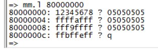

   - **mw**命令：mw用于使一个指定的数据填充段内存

     ```bash
     格式：mw [.b, .w, .l] address value [count]
     
     ```

     比如使用 `.l`格式将以 格式将以 格式将以 0X80000000为起始地址的 为起始地址的  0x10个 内存块 (0x10 * 4=64字节 )填充为 填充为 0X0A0A0A0A

     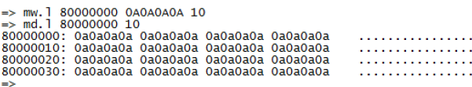

   - **cp**命令：是数据拷贝命令，用于将 将 DRAM中的数据从一段内存拷贝到另一段内存处，或者把 Nor Flash中的数据拷贝到DRAM中。

     ```
     cp [.b, .w, .l] source target count
     source：源地址
     target：目标地址
     count：拷贝个数
     eg：从0x80000000处拷贝0x10个块(这里使用的.l，每个块就是4个字节) 到0x80000100处
     cp.l 80000000 80000100 10
     ```

     

   - **cmp**命令：是比较命令，用于两段内存的数据否相等

     ```
     cmp [.b, .w, .l] addr1 addr2 count
     ```

     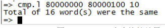

   

6. 网络命令

   uboot支持大量网络命令如：nfs 、tftp、ping、tftpboot等；

   - dhcp命令：从路由器自动获取ip地址；

   - nfs命令：

     ```bash
     格式：nfs [loadAddress] [[hostIPaddr:]bootfilename]
     eg:从nfs目录下载zImage到RAM的0x80800000地址
     nfs 80800000 192.168.1.250:/home/book/nfs_rootfs/zImage
     ```

   - tftp命令

     ```bash
     格式：tftpboot [loadAddress] [[hostIPaddr:]bootfilename]
     eg：从ubuntu的tftp共享目录下载 zImage 到Dram的0x80800000地址
     tftp 80800000 zImage
     eg：从ubuntu的tftp共享目录下载 imx6ull_dtb 到Dram的0x83000000地址
     tftp 83000000 imx6ull_dtb
     ```

7. EMMC命令和SD卡命令

   mmc命令是一些列的命令，输入`？mmc`可以查看有关的命令。

   | 命令            | 描述                              |
   | --------------- | --------------------------------- |
   | mmc info        | 输出MMC设备信息                   |
   | mmc read        | 读取MMC中的数据                   |
   | mmc write       | 向MMC设备写入数据                 |
   | mmc rescan      | 扫描MMC设备                       |
   | mmc  part       | 列出MMC设备分区                   |
   | mmc dev         | 切换到MMC设备                     |
   | mmc list        | 列出当前有效的所有MMC设备         |
   | mmc hwpartition | 设置MMC设备的分区                 |
   | mmc bootbus     | 指定MMC设备BOOT_BUS_WIDTH域的值   |
   | mmc bootpart    | 指定MMC设备的boot和RPMB分区的大小 |
   | mmc partconf    | 指定MMC设备PARTITION_CONFG域的值  |
   | mmc rst         | 复位MMC设备                       |
   | mmc setdsr      | 设置DSR寄存器值                   |

   - mmc info 命令：显示当前选中的设备的信息

   - mmc rescan 命令：扫描当前开发板上所有的MMC设备

   - mmc list 命令：列出当前开发板一共几个MMC设备

     ```bash
     => mmc list
     FSL_SDHC: 0 (SD)      # 表示当前用的是SD卡
     FSL_SDHC: 1
     ########################
     当前开发板有两个设备： FSL_SDHC:0和 FSL_SDHC:1 (eMMC)，现在用的是 EMMC版本的核心板，加上 SD卡一共有两个MMC设备， 设备FSL_SDHC:0是SD卡，FSL_SDHC:1(eMMC)是 EMMC，用命令mmc dev 命令可以切换设备
     ```

   - mmc dev 命令：切换MMC设备

     ```bash
     格式：mmc dev [dev] [part]
     eg：切换到1 mmc设备。即EMMC
     mmc dev 1  
     ```

   - mmc part命令：查看当前设备有多少个分区

     EMMC有三个分区：

     - 0分区：存放uboot；
     - 1分区：存放Linux镜像文件和设备树；
     - 2分区：存放文件系统。

     如果要将EMMC的分区2设置为当前MMC设置，可以使用如下命令`mmc dev 1 2`

   - mmc read 命令：读取mmc设备数据

     ```bash
     mmc read addr blk#cnt    #addr 要读取到DRAM地址，blk要读取的块起始地址（十六进制），一个块是512字节，
     eg:
     mmc dev 1 0               # 切换到 MMC分区 0 
     mmc read 80800000 600 10  # 从EMMC的0x600个块开始，读取0x10个块数据到DRAM的0x80800000地址处
     ```

   - mmc write 命令：从DRAM的addr地址开始，读取cnt个块到MMC设备的第blk个块开始的地址处

     ```bash
     格式 mmc write addr blk# cnt
     
     使用此命令我们可以先通过tftp把uboot下载到DRAM里面，然后通过此命令把DRAM里面的数据写入到MMC设备(即SD卡或者emmc中)，实现在uboot中更新uboot
     ```

     - 更新uboot到SD卡里

       ```bash
       mmc dev 0  					# 切换到 SD卡 
       version             		# 查看uboot版本号
       tftp 80800000 u-boot.imx	# 从tftp服务器下载uboot到DRAM的0x80800000处
       ```

       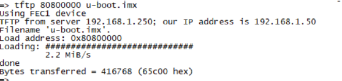

       可以看出下载后uboot的大小是416768字节/512 = 814(0x32E)个块。

       接下来把DRAM中uboot写入到SD卡中

       ```bash
       mmc dev 0 0                  # 切换到SD卡的的第0个分区
       mmc write 80800000 2 32E     # 把DRAM中0x80800000处的uboot写入到SD卡的第二个块开始的地址处，一共烧写0x32E个块大小
       然后重启从SD卡启动即可完成
       再次用version查看uboot的版本 查看是否更新成功
       ```

     - 更新uboot到emmc中

       ```
       mmc dev 1 0 				# 切换到 EMMC分区 0 
       tftp 80800000 u-boot.imx 	# 下载 u-boot.imx到 DRAM 
       mmc write 80800000 2 32E    # 烧写 u-boot.imx到 EMMC中 
       mmc partconf 1 1 0 0        # 分区配置， EMMC需要这一步！ 需要这一步！ 
       ```

       **注意：千万不要写 SD卡或者 卡或者 EMMC的前两个块 (扇区 )，里面保存着分区表！** 

   - mmc erase命令：擦除指定块数据 擦除大小是cnt个块

     ```bash
     格式：
     mmc erase blk# cnt
     #注释：blk为起始块，cnt：要擦除的数量
     ```

8. FAT格式文件系统操作命令

   当需在uboot中对mmc设备进行文件操作的时候，就需要用到相关的命令：fatinfo、fatls、fstype、fatload、fatwrite等。

   - fatinfo命令：查询指定 MMC设置指定分区的文件系统信息

     ```bash
     格式：
     fatinfo <interface> [<dev[:part]>]
     # interface：接口，比如mmc
     # dev：查询的设备号
     # part：要查询的分区
     eg：查询EMMC分区1的文件系统
     fatinfo mmc 1:1
     
     ```

     

   - fatls命令：查询FAT格式设备的目录和文件信息

     ```bash
     格式：
     fatls <interface> [<dev[:part]>] [directory]
     # interface：接口，比如mmc
     # dev：查询的设备号
     #part：要查询的分区
     # directory：要查询的目录
     eg：查询EMMC分区1的所有的目录和文件
     fatls mmc 1:1
     ```

     

   - fstype 命令：查询MMC设备某个分区的文件系统

     ```
     格式：
     fstype <interface> <dev>:<part>
     eg：默认EMMC设备有三个分区。查看这三个分区的文件系统格式
     fstype mmc 1:0 
     fstype mmc 1:1 
     fstype mmc 1:2
     ```

     

   - fatload命令：将制定文件读取到DRAM中

     ```bash
     格式：
     fatload <interface> [<dev[:part]> [<addr> [<filename> [bytes [pos]]]]]
     # interface：接口，比如mmc
     # dev：查询的设备号
     # part：要查询的分区
     # addr：要保存到DRAM	中的地址
     # filename：要读取的文件名
     # bytes ：要读取的字节数，0或者省略表示读取整个文件
     # pos ：要读取文件相对于文件首地址的偏移，0或者省略表示从文件首地址读取
     eg：将EMMC分区1中的zImage 文件读取到DRAM中的0x80800000处
     fatload mmc 1:1 80800000 zImage
     
     ```

     

   - fatwrite命令：将DRAM中的数据写入到MMC设备中

     ```bash
     格式：
     fatwrite <interface> <dev[:part]> <addr> <filename> <bytes>
     # interface：接口，比如mmc
     # dev：查询的设备号
     # part：要查询的分区
     # addr：要写入数据在DRAM中保存的地址
     # filename：要写入数据的文件名
     # bytes ：要写入字节数
     eg：可以通过此命令在uboot中更新linux内核和设备树到我们的mmc设备中
     tftp 80800000 zImage                       #从tftp服务器下载内核到DRAM中
     fatwrite mmc 1:1 80800000 zImage 0x5c2720  #把DRAM中的内核写入到MMC的EMMC的第1个分区里面，写入数据大小是（0x5c2720）自字节，即zImage的实际大小
     fatls mmc 1:1  #查看MMC的设备EMMC的第一个分区
     ```

     **注意**：uboot中默认该命令没有使能。修改mx6ullevk.h 、mx6ull_alientek_emmc.h文件

     等板子不同配置文件也不相同。找到自己板子对应的配置头文件，在最后添加一行宏定义用来使能fatwrite命令

     ```c
     #define CONFIG_FAT_WRITE /* 使能 fatwrite命令 */
     ```

   - 

9. EXT格式文件系统操作命令

   uboot有ext2和ext4两种格式的文件系统操作命令，常用的命令：ext2load、ext2ls、ext4load 、ext4ls、ext4write。这些命令和fat的命令基本一样，都是针对不同的文件系统的命令，例如

   ```bash
   ext4ls mmc 1:2  # 列出MMC的EMMC设备第2个分区中所有的文件和目录
   ```

   

10. NAND命令

    - `? nand`命令：查看NAND相关命令

    - nand info命令：打印nand信息

    - nand device 命令：如果设备支持两个NAND的话，可以通过此命令切换不同的NAND

    - nand erase命令：擦除NAND Flash

      NAND Flash特性决定向NAND Flash中写入数据的时候必须先对写入区域擦除

      ```bash
      格式
      nand erase[.spread] [clean] off size #从指定地址开始(off)开始，擦除指定大小(size)的区域 
      nand erase.part [clean] partition   # 擦除指定的分区
      nand erase.chip [clean] 			# 全篇擦除
      ```

      

    - nand write命令：向NAND Flash指定地址写入指定数据

      ```bash
      格式：
      nand write addr off size
      # addr是要写入的数据首地址
      # off是 NAND中的目地址
      # size是要写入的数据大小
      eg：NAND分区如下
      0x000000000000-0x000004000000 : "boot"      # 64M
      0x000004000000-0x000006000000 : "kernel"    # 32M
      0x000006000000-0x000007000000 : "dtb"       # 16M
      0x000007000000-0x000020000000 : "rootfs"    # 剩下的全部用来存放文件系统
      ```

      - 更新内核到NAND Flash中

        ```bash
        tftp 0x87800000 zImage 			# 下载 zImage到 DRAM中 
        nand erase 0x4000000 0xA00000 	# 从地址0x4000000开始擦除10MB的空间 
        nand write 0x87800000 0x4000000 0xA00000 # 将接收到的zImage写到 NAND中
        ```

      - 更新设备树到NAND Flash中

        ```bash
        tftp 0x87800000 imx6ull-alientek-nand.dtb # 下载dtb到 DRAM中 
        nand erase 0x6000000 0x100000 #从地址 0x6000000开始擦除1MB的空间
        nand write 0x87800000 0x6000000 0x100000 # 将接收到的dtb写到 NAND中
        ```

        

      - 跟文件系统就不要再uboot更新了，文件系统太大了超过mcu的DRAM大小

      - uboot更新：NAND中Uboot要求uboot.imx文件前面加上BCB和DBBT，所以我们就算通过此方式把编译出来的uboot.imx文件更新到NAND Flash中，也无法运行，只能使用mfgtool工具更新uboot到nandflash中，这个工具会用kogs-ng的工具完成BCB和DBBT的添加。

      

    - nand read命令

      ```bash
      格式：
      nand read addr off size
      # addr 目的地址
      # off 是 NAND中的数据源地址
      # size 是要读取的数据大小
      eg：读取NAND中设备树文件到DRAM的0X83000000处
      nand read 0x83000000 0x6000000 0x19000
      # 0x6000000 设备树在nand中的起始地址
      # 0x19000   设备树的大小
      # 0x83000000 设备树在DRAM中的地址
      
      设备树读取到DRAM中后就可以用fdt命令操作设备树了
      fdt addr 83000000   # 设置设备树首地址
      fdt header          # 查看设备树的头信息
      fdt print      		# 查看设备树文件内容
      ```

    - 

11. BOOT命令

    boot命令用来引导linux启动，常用的命令：bootz 、bootm、boot；

    - bootz 命令：

      ```bash
      格式
      bootz [addr [initrd[:size]] [fdt]]
      # addr Linux镜像文件在DRAM中的地址
      # initrd是initrd文件在DRAM中的地址，如果不适用initrd 用 - 代替
      # fdt 设备树在DRAM中地址
      eg1：从tftp下载内核和设备树到DRAM中，然后通过bootz 命令启动内核
      tftp 80800000 zImage    
      tftp 83000000 imx6ull-alientek-emmc.dtb 
      bootz 80800000 – 83000000 
      
      eg2：从EMMC下载内核和设备树到DRAM中，然后通过bootz 命令启动内核
      fatload mmc 1:1 80800000 zImage 
      fatload mmc 1:1 83000000 imx6ull-alientek-emmc.dtb 
      bootz 80800000 - 83000000
      ```

      

    - bootm 命令：用于启动uImage镜像文件

      ```
      bootm addr   # 不使用设备树的情况下 addr是Linux内核在DRAM中地址 ，直接启动内核
      适用设备树的情况和bootz一样
      bootm [addr [initrd[:size]] [fdt]]
      
      ```

      

    - boot命令：

      boot会读取环境变量bootcmd来启动Linux系统

      ```bash
      eg：从tftp服务器下载内核和设备树到DRAM。然后启动
      setenv bootcmd 'tftp 80800000 zImage; tftp 83000000 imx6ull-alientek-emmc.dtb;bootz 80800000 - 83000000' 
      saveenv 
      boot
      
      eg2:从EMMC中第一个分区加载zImage到DRAM的0x80800000里面 加载设备树到0x83000000里面，然后启动
      
      setenv bootcmd 'fatload mmc 1:1 80800000 zImage; fatload mmc 1:1 83000000 imx6ull-alientek_emmc.dtb; bootz 80800000 - 83000000' 
      savenev 
      boot
      ```

    - 

12. go命令

    ```
    格式：
    go addr [arg...]
    addr是应用程序在DRAM中的地址
    eg 比如裸机程序需要在dram中运行
    tftp 0x87800000 app.bin
    go 87800000
    
    ```

    

13. run命令：用于运行环境变量中定义的命令

    ```
    我们经常在NAND EMMC SD卡 TFTP中切换，加载内核到DRAM中运行，如果单纯修改bootcmd可以达到效果，但是比较麻烦，每次都得从新设置bootcmd
    所以我们可以自定义环境变量，结合run命令，实现从不同的设备启动
    # 设置从emmc启动的命令
    
    setenv mybootemmc 'fatload mmc 1:1 80800000 zImage; fatload mmc 1:1 83000000 imx6ull-alientek-emmc.dtb;bootz 80800000 - 83000000' 
    
    # 设置从nand启动的命令
    setenv mybootnand 'nand read 80800000 4000000 800000;nand read 83000000 6000000 100000;bootz 80800000 - 83000000' 
    
    # 设置从网络启动的命令
    setenv mybootnet 'tftp 80800000 zImage; tftp 83000000 imx6ull-alientek-emmc.dtb; bootz 80800000 - 83000000' 
    
    saveenv
    
    下面我们在用的时候就可以
    	run mybootemmc 
    或者 run mytoobnand
    或者run mybootnet
    从不同地方启动内核
    ```

    

14. mtset命令：测试内存读写，用来测试板子DDR

    ```
    格式：
    mtest [start [end [pattern [iterations]]]]
    eg:测试0x80000000~0x800001000这段内存，执行下面命令即可
    mtest 80000000 80001000
    ```

## U-Boot移植

### 编译

```bash

make mx6ull_14x14_evk_emmc_defconfig
make -j4
下载uboot.imx到SD卡
sudo dd if=u-boot-dtb.imx of=/dev/sdb bs=1k seek=1 conv=fsync
```

### 运行

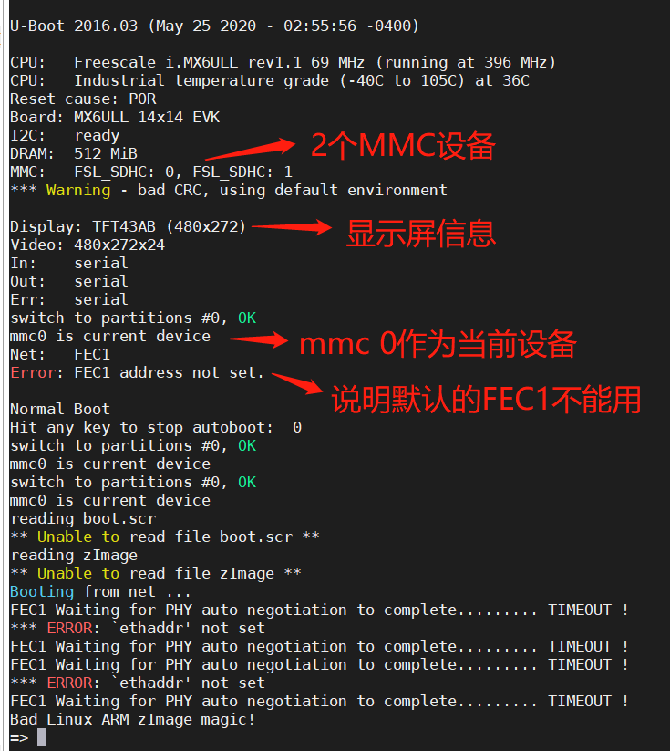

### 检测驱动

#### 测试mmc设备

```bash
# 1：列出所有的mmc设备 说明mmc设备识别OK 且当前是SD卡设备作为默认设备，SD卡是MMC设备0 EMMC是MMC设备1
=> mmc list
FSL_SDHC: 0 (SD)
FSL_SDHC: 1
# 2：显示当前mmc设备的信息 这里的当前设备是是SD卡
=> mmc info
Device: FSL_SDHC
Manufacturer ID: 3
OEM: 5344
Name: SC32G
Tran Speed: 50000000
Rd Block Len: 512
SD version 3.0
High Capacity: Yes
Capacity: 29.7 GiB
Bus Width: 4-bit
Erase Group Size: 512 Bytes
# 3：切换到mmc设备1 也就是EMMC 查看信息
=> mmc dev 1
switch to partitions #0, OK
mmc1(part 0) is current device
=> mmc info
Device: FSL_SDHC
Manufacturer ID: 15
OEM: 100
Name: 8GTF4
Tran Speed: 52000000
Rd Block Len: 512
MMC version 4.0
High Capacity: Yes
Capacity: 7.3 GiB
Bus Width: 8-bit
Erase Group Size: 512 KiB
=>

```

#### 测试网络

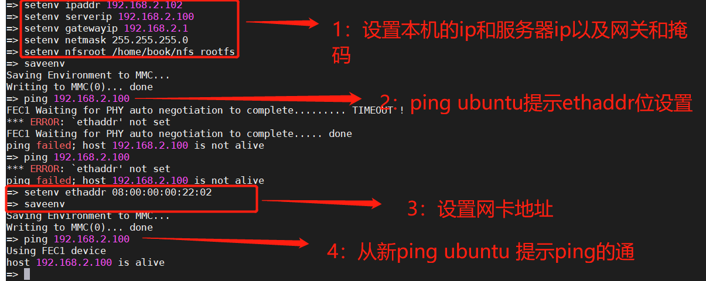

### 在uboot中添加自己的主板

#### 添加开发板默认配置文件

```bash
 cp configs/mx6ull_14x14_evk_emmc_defconfig mx6ull_ming_emmc_defconfig
```

修改后如下图

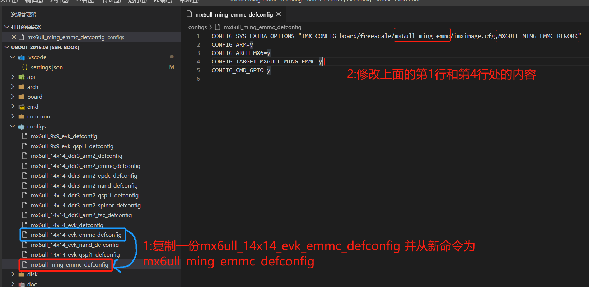

#### 添加开发板对应的头文件

```
cp include/configs/mx6ullevk.h mx6ull_ming_emmc.h
```

修改后如下如

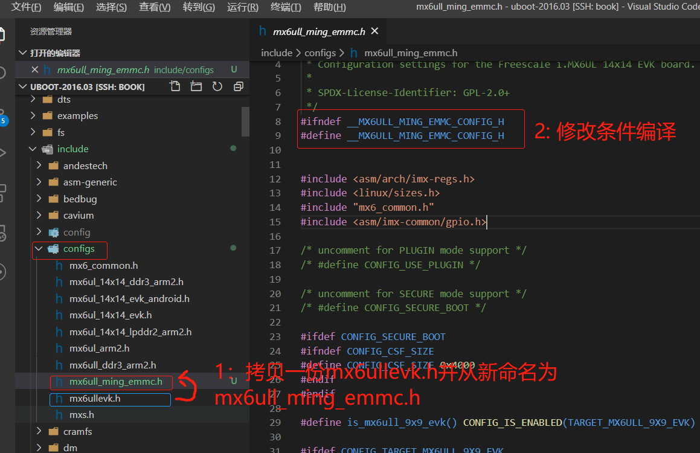

#### 添加主板对应的板级文件夹

```bash
cd board/freescale/ 
cp mx6ullevk/ -r mx6ull_ming_emmc  # 拷贝 mx6ullevk文件夹 命名为 mx6ull_ming_emmc
mv mx6ull_ming_emmc/mx6ullevk.c  mx6ull_ming_emmc/mx6ull_ming_emmc.c #重命名文件名
```

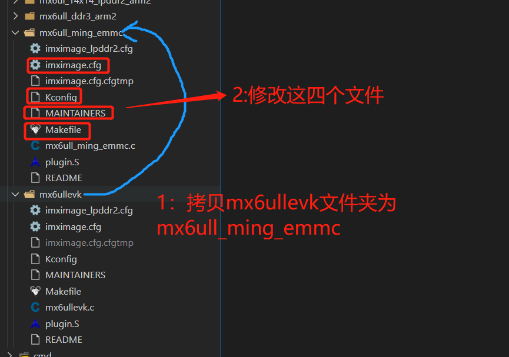

修改后如下图显示

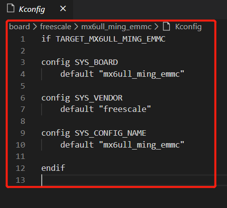


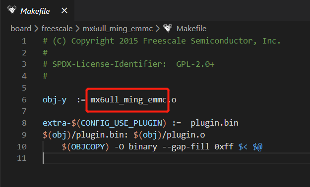

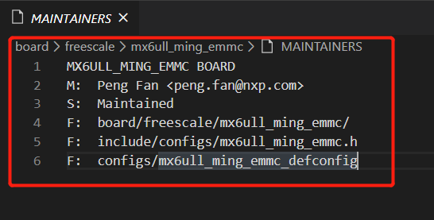

#### 修改uboot图形化配置界面

- 在arch/arm/cpu/armv7/mx6/Kconfig文件的207行新增下面的配置

  ```
  config TARGET_MX6ULL_MING_EMMC
  	bool "Support mx6ull_ming_emmc"
  	select MX6ULL
  	select DM
  	select DM_THERMAL
  ```

  

- 在arch/arm/cpu/armv7/mx6/Kconfig文件最后新增下面的文件

  ```
  source "board/freescale/mx6ull_ming_emmc/Kconfig"
  
  ```


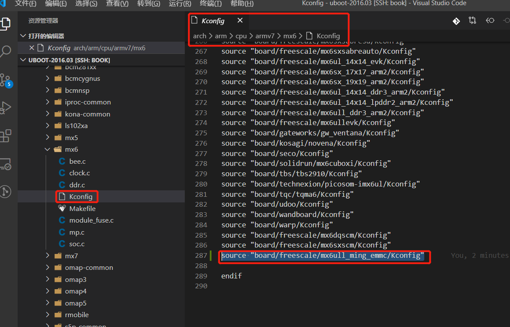


至此修改完毕：编译下载运行验证即可

#### 问题解决

##### 显示屏驱动

- `board/freescale/mx6ull_ming_emmc/mx6ull_ming_emmc.c`

  ```bash
  struct display_info_t const displays[] = {{
          .bus = MX6UL_LCDIF1_BASE_ADDR,
          .addr = 0,
          .pixfmt = 24,
          .detect = NULL,
          .enable = do_enable_parallel_lcd,
          .mode   = {
                  .name           = "TFT43AB",
                  .xres           = 480,
                  .yres           = 272,
                  .pixclock       = 108695,
                  .left_margin    = 8,
                  .right_margin   = 4,
                  .upper_margin   = 2,
                  .lower_margin   = 4,
                  .hsync_len      = 41,
                  .vsync_len      = 10,
                  .sync           = 0,
                  .vmode          = FB_VMODE_NONINTERLACED
                     }
          },
  
          {
          .bus = MX6UL_LCDIF1_BASE_ADDR,
          .addr = 0,
          .pixfmt = 24,
          .detect = NULL,
          .enable = do_enable_parallel_lcd,
          .mode   = {
                  .name           = "TFT50AB",
                  .xres           = 800,
                  .yres           = 480,
                  .pixclock       = 108695,
                  .left_margin    = 46,
                  .right_margin   = 22,
                  .upper_margin   = 23,
                  .lower_margin   = 22,
                  .hsync_len      = 1,
                  .vsync_len      = 1,
                  .sync           = 0,
                  .vmode          = FB_VMODE_NONINTERLACED
                     }
          },
  
          {
          .bus = MX6UL_LCDIF1_BASE_ADDR,
          .addr = 0,
          .pixfmt = 24,
          .detect = NULL,
          .enable = do_enable_parallel_lcd,
          .mode   = {
                  .name           = "TFT70AB",
                  .xres           = 800,
                  .yres           = 480,
                  .pixclock       = 108695,
                  .left_margin    = 46,
                  .right_margin   = 22,
                  .upper_margin   = 23,
                  .lower_margin   = 22,
                  .hsync_len      = 1,
                  .vsync_len      = 1,
                  .sync           = 0,
                  .vmode          = FB_VMODE_NONINTERLACED
                     }
          }
  
  };
  ```

  

- `include/configs/mx6ull_ming_emmc.h`

  ```bash
  把该文件里面所有的(应该有两处)
  panel=TFT43AB
  改为
  panel=TFT50AB
  ```

##### 网络驱动


#####  其他问题

- 修改uboot启动打印的信息

  ```bash
  int checkboard(void)
  {
  	if (is_mx6ull_9x9_evk())
  		puts("Board: MX6ULL 9x9 EVK\n");
  	else
  		puts("Board: MX6ULL MING EMMC BOARD\n");  // 修改的地方
  
  	return 0;
  }
  ```

  ```
  从EMMC启动linux
  setenv bootargs 'console=ttymxc0,115200 root=/dev/mmcblk1p2 rootwait rw' setenv bootcmd 'mmc dev 1; fatload mmc 1:1 80800000 zImage; fatload mmc 1:1 83000000 imx6ull-alientek-emmc.dtb; bootz 80800000 - 83000000;' 
  saveenv
  
  从网络启动linux
  setenv bootargs 'console=ttymxc0,115200 root=/dev/mmcblk1p2 rootwait rw' setenv bootcmd 'tftp 80800000 zImage; tftp 83000000 imx6ull-alientek-emmc.dtb; bootz 80800000 - 83000000' 
  saveenv
  ```

  


