# 驱动编程

## IMX6ULL GPIO操作说明

### GPIO模块资源说明

参考资料：芯片手册《Chapter 26 : General Purpose Input/Output (GPIO)》

一共5组GPIO，每组最多32个，实际上每组可能没有这么多可用的。

GPIO1 有 32 个引脚： GPIO1_IO0~GPIO1_IO31
GPIO2 有 22 个引脚： GPIO2_IO0~GPIO2_IO21
GPIO3 有 29 个引脚： GPIO3_IO0~GPIO3_IO28
GPIO4 有 29 个引脚： GPIO4_IO0~GPIO4_IO28
GPIO5 有 12 个引脚： GPIO5_IO0~GPIO5_IO11

控制GPIO模块分为3大模块：CCM 、 IOMUXC 、 GPIO模块本身；

- CCM：设置GPIO模块时钟使能；

- IOMUXC ：复用功能选择；
- GPIO：设置输入输出上下拉等功能。

所以要想使用GPIO，需要三步：

- 通过CCM模块设置GPIOx时钟使能
- 通过IOMUXC：选择GPIOx引脚的复用功能，以及上下拉等功能
- 通过GPIO模块本身，设置输入输出，读取或者设置输出高低电平

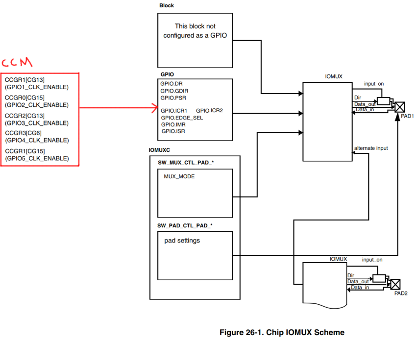

### 使能GPIO模块的时钟

CCM可以用来设置是否使能GPIO模块的时钟，通过设置CCM_CCGRy寄存器中的2位来决定GPIOx模块的时钟是否使能。


| 值   | 说明                                                         |
| ---- | ------------------------------------------------------------ |
| 00   | 一直关闭时钟                                                 |
| 01   | 该GPIO 模块在 CPU run mode 情况下是使能的；在 WAIT 或 STOP 模式下，关闭 |
| 10   | 保留                                                         |
| 11   | 一直使能时钟                                                 |

- **GPIO2**模块的时钟使能有**CCM_CCGR0**寄存器的位决定

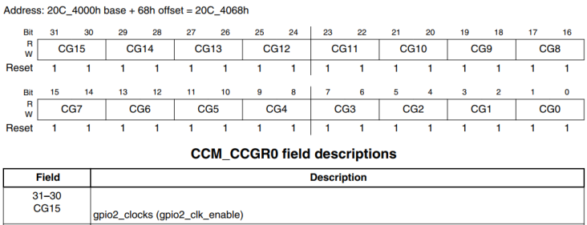

- **GPIO1-5**模块的时钟使能有**CCM_CCGR1**寄存器决定

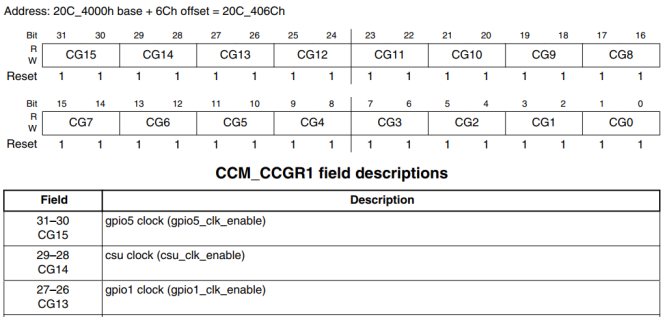

**GPIO3**模块的时钟使能有**CCM_CCGR2**寄存器决定

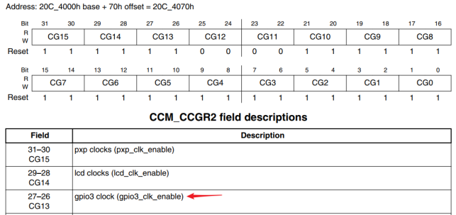

**GPIO4**模块的时钟使能有**CCM_CCGR2**寄存器决定

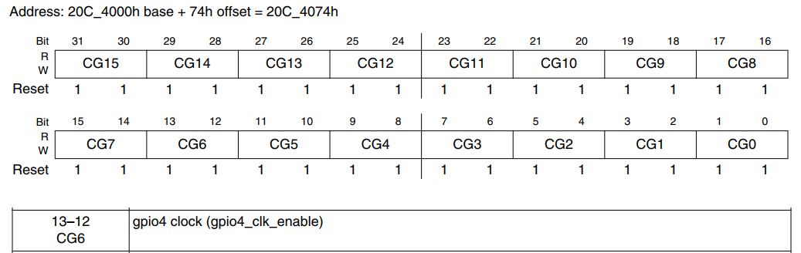


 ### 选择复用功能

IOMUXC模块可以设置引脚的模式 Mode 、功能。参考资料：芯片手册《Chapter 3 2 : IOMUX Controller (IOMU XC) 》

对于某个某组引脚， IOMUXC 中有 2 个寄存器用来设置它：

- IOMUXC_SW_MUX…… ：设置复用功能

- IOMUXC_SW_PAD……：设置上下拉等参数

#### 选择复用功能

IOMUXC_SW_MUX_CTL_PAD_x ：某个引脚的功能寄存器
IOMUXC_SW_MUX_CTL_GRP_<GROUP NAME>：某组引脚的功能寄存器
无论是某个引脚，或是某组预设的引脚，都有8 个可选的模式 alternate (ALT) MUX_MODE。

例如GPIO1_IO00引脚，当把IOMUXC_SW_MUX_CTL_PAD_GPIO1_IO00寄存器的MUX_MODE(bit【0-3】)的位设置为0101(ALT5) 时，GPIO1_IO00引脚被设置为了GPIO功能。

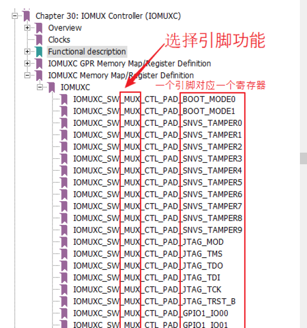

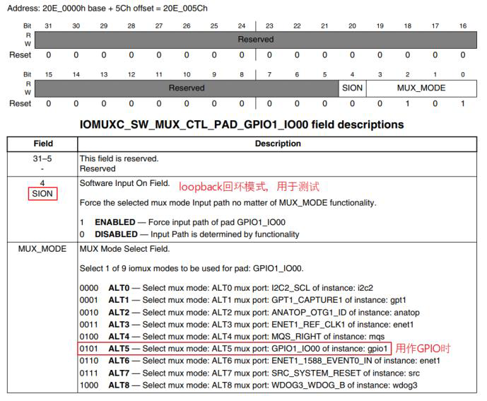

#### 设置上下拉电阻等参数

**IOMUXC_SW_PAD_CTL_PAD_GPIO1_IO00** 寄存器是设置GPIO1_IO00引脚的上下拉等参数的。其他的引脚也是类似，看数据手册即可。

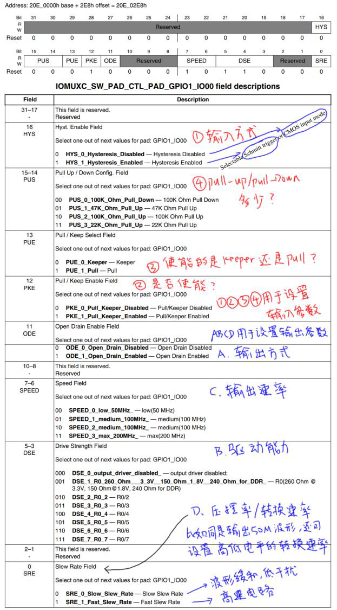

### GPIO模块输入输出设置

内部框图如下：

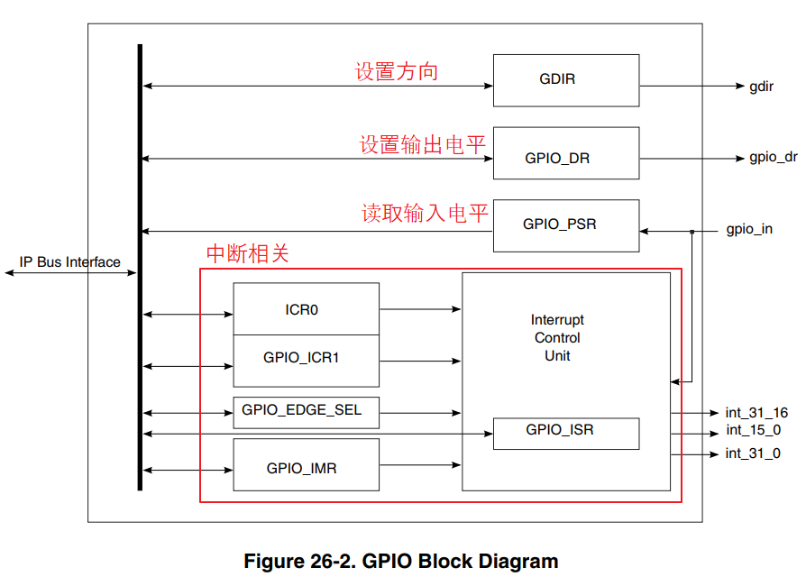

只关心三个寄存器：

- GPIOx_GDIR ：设置引脚方向，每位对应一个引脚 1 output 0 input

  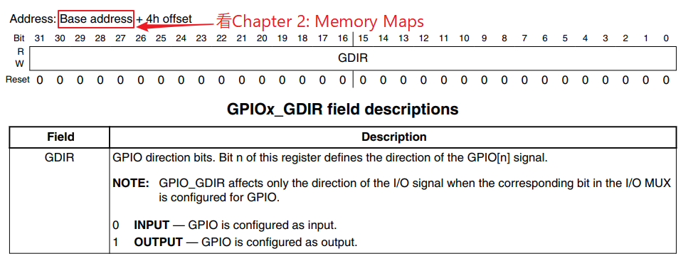

- GPIOx_GDIR ：设置输出引脚的电平，每位对应一个引脚 1 高电平， 0 低电平

  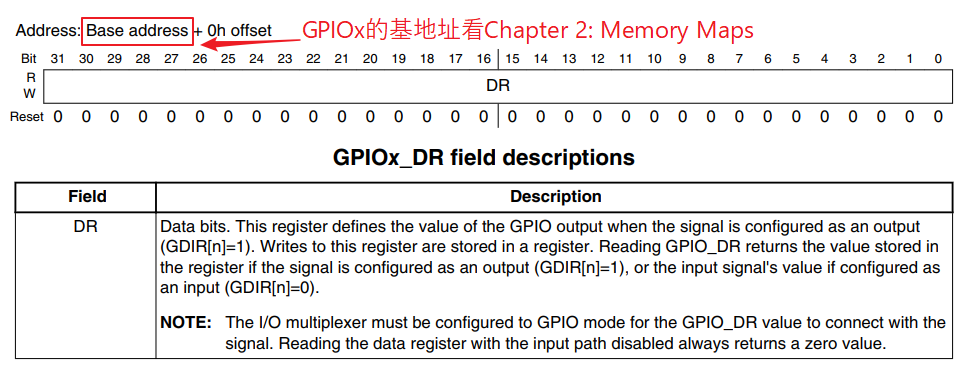

- GPIOx_PSR ：读取引脚的电平，每位对应一个引脚 1 高电平， 0 低电平

  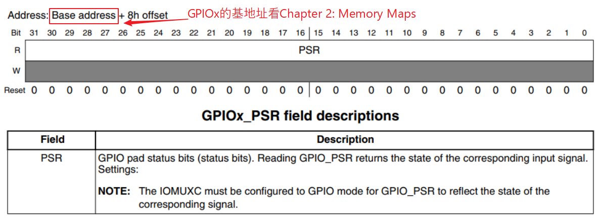

### 编程步骤

#### 读GPIO引脚

① 设置CCM_CCGRx寄存器中某位使能对应的GPIO模块 // 默认是使能的，上图省略了
② 设置IOMUX来选择引脚用于GPIO
③ 设置GPIOx_GDIR中某位为0，把该引脚设置为输入功能
④ 读GPIOx_DR或GPIOx_PSR得到某位的值（读GPIOx_DR返回的是GPIOx_PSR的值）

#### 写GPIO引脚

① 设置CCM_CCGRx寄存器中某位使能对应的GPIO模块 // 默认是使能的，上图省略了
② 设置IOMUX来选择引脚用于GPIO
③ 设置GPIOx_GDIR中某位为1，把该引脚设置为输出功能
④ 写GPIOx_DR某位的值

需要注意的是，你可以设置该引脚的loopback功能，这样就可以从GPIOx_PSR中读到引脚的有实电平；你从GPIOx_DR中读回的只是上次设置的值，它并不能反应引脚的真实电平，比如可能因为硬件故障导致该引脚跟地短路了，你通过设置GPIOx_DR让它输出高电平并不会起效果。


## RK3288 GPIO操作说明

### GPIO模块资源说明

一共9组（GPIO0-GPIO8)，每组又分为四个小组port A、B、C、D，每个小组最多8个IO，所以理论上一组GPIO最多32个，实际上每组可能没有这么多可用的。比如 GPIO0 只有 GPIO0_A0 -A7 、 GPIO0_B0-B7 、 GPIO0_C0
-C2 这些引脚。

RK3288 GPIO模块框图

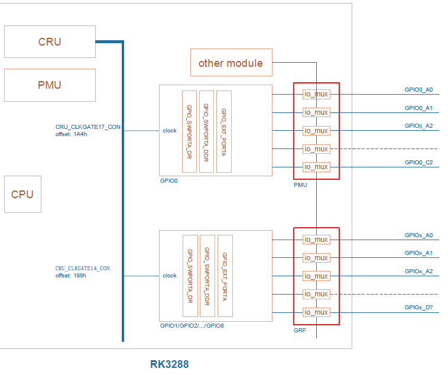


 GPIO的控制涉及 4 大模块： CRU 、 PMU 、 GRF 、 GPIO 模块本身

- CRU ：用于设置是否向 GPIO 模块提供时钟；
- PMU ：
- GRF ：
- GPIO ：

所以要想使用GPIO就得有以下步骤：

- 


### 使能GPIO 时钟

CRU 用于设置是否向 GPIO 模块提供时钟：内部框图如下：

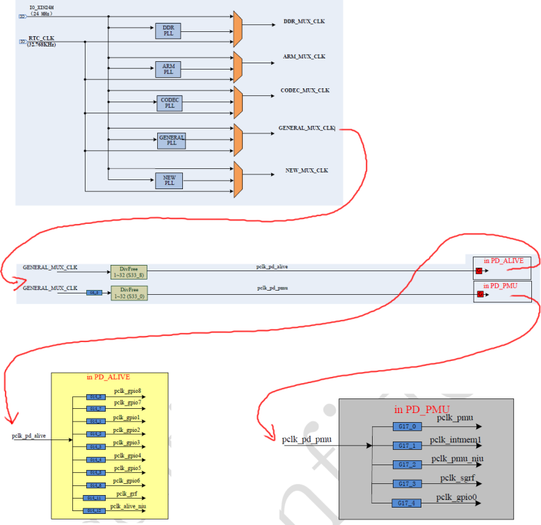

可以设置寄存器使能GPIOx 的时钟：

- CRU_CLKGATE17_CON用于控制 GPIO0
- CRU_CLKGATE14_CON用于控制 GPIO1-8

### PMU控制电源：

电源管理单元里，有多个电源域(power domain ，简称为 PM)，在一个域下有多个设备。
比如PD_ALIVE ，它下面有这些设备 CRU 、 GRF 、 GPIO 1~8 、 TIMER 或 WDT 。
比如PD_PMU ，它下面有这些设备 PMU 、 SRAM(4K) 、 Secure GRF 、 GPIO0 。
可见，GPIO0 、 GPIO1~8 分属不同的 PMU 。GPIO0、 GPIO1~8 都是常供电的 ，它们是否工作取决于其时钟是否使能。

### 设置引脚的模式 (Mode 、功能GPIO0）

GPIO0比较特殊，为了让其引脚用于 GPIO 功能，要设置 PMU 里的相关寄存器。
GPIO1-8 类似，为了让其引脚用于 GPIO 功能，要设置 GRF 里的相关寄存器。

### GPIO模块内部

方向：引脚设置为GPIO 时，可以继续设置寄存器 GPIO_SWPORTA_DDR 确定它是输出引脚，还是输入引
脚。
数值：对于输出引脚，可以设置寄存器GPIO_SWPORTA_DR 让它输出高、低电平
对于输入引脚，可以读取寄存器 GPIO_EXT_PORTA 得到引脚的当前电平 。

### RK3288相关寄存器偏移地址


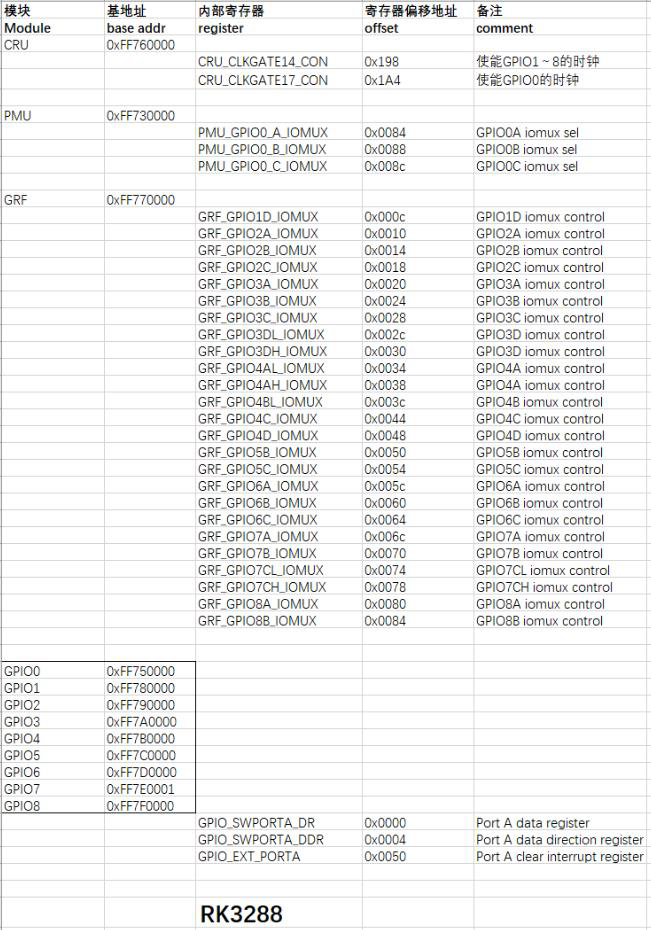

## 字符设备驱动

### Linux设备号
#### 设备号组成
Linux提供`dev_t`的数据类型表示设备号：高12位主设备号(大小:0-4095)，低20位位次设备号
```c
include/linux/types.h
    
typedef __u32 __kernel_dev_t;
typedef __kernel_dev_t dev_t; // 所以可以看出dev_t就是一个uint32_t 的数据

```

#### 设备号常用函数

```c
include/linux/kdev_t.h

#define MINORBITS 20 
#define MINORMASK ((1U << MINORBITS) - 1) 

#define MAJOR(dev) ((unsigned int) ((dev) >> MINORBITS)) // 从设备号中得到主设备号
#define MINOR(dev) ((unsigned int) ((dev) & MINORMASK))  // 从设备号中得到次设备号
#define MKDEV(ma,mi) (((ma) << MINORBITS) | (mi))        // 把主设备号和次设备号组装成dev_t类型的linux设备号
```
### 注册字符设备并确定设备号

#### linux用cdev表示一个字符设备

```c
struct cdev { 
	struct kobject kobj; 
	struct module *owner; 
	const struct file_operations *ops;   // 操作函数集合
	struct list_head list; 
	dev_t dev;                           // 设备id
	unsigned int count; 
};

```

#### 入口函数中定义字符设备步骤如下

```c
struct cdev testcdev;            	// 定义字符设备结构体 
testcdev.owner = THIS_MODULE;     
cdev_init(&testcdev, &test_fops);	// 字符设备结构体 初始化
cdev_add(&testcdev, devid, 1);   	// 把字符设备添加到linux内核中
```

#### 出口函数删除字符设备


```C
cdev_del(&testcdev);
```

#### 函数原型介绍

```c
/**
*
*@cdev：字符设备
*@fops：file_operations结构体指针
*/
void cdev_init(struct cdev *cdev, const struct file_operations *fops)

/**
*用于向 Linux系统添加字符设备 (cdev结构体变量 )
*@p：指向要往系统添加的字符设备
*@count：要添加的设备数量
*/
int cdev_add(struct cdev *p, dev_t dev, unsigned count)

/**
*驱动卸载的时候要从linux内核中卸载字符设备
*@p：指向要往系统添加的字符设备
*/
void cdev_del(struct cdev *p)
```


 在 2.4 的内核我们使用 `major = register_chrdev(0, "xym_led", &led_drv)` 来进行字符设备注册，在注册过程中分配了设备号，这种方式每一个主设备号只能存放一种设备，它们使用相同的 `file_operation` 结构体，也就是说内核最多支持 256 个字符设备驱动程序。

在 2.6 的内核之后，新增了一个 register_chrdev_region 函数，它支持将同一个主设备号下的次设备号进行分段，每一段供给一个字符设备驱动程序使用，使得资源利用率大大提升，同时，2.6 的内核以后保留了原有register_chrdev 方法。在 2.6 的内核中这两种方法都会调用到 __register_chrdev_region 函数进行设备节点的分配。

```c
1：老版本的内核在入口函数都是使用register_chrdev函数来确定主设备号
major = register_chrdev(0, "xym_led", &led_drv); // 第一个参数是0的话表示自动申请设备号
调用关系
register_chrdev
	-》__register_chrdev(major, 0, 256, name, fops)
		-》__register_chrdev_region(major, baseminor, count, name)
		-》cdev = cdev_alloc();
		-》cdev_add
 从上面的调用关系可以看出，register_chrdev不仅仅完成了设备号的申请，还完成了字符设备cdev的创建和添加到内核工作
2：新版本在入口函数中使用register_chrdev_region或者alloc_chrdev_region函数获取主设备号
   if(major){
	    devid = MKDEV(major, 0); 
		register_chrdev_region(devid, 1, "xym_led");  /* 设备号事先确定的情况 */
	}else{
		alloc_chrdev_region(&devid, 0, 1, "xym_led"); /* 设备号事先不确定，申请设备号 */ 
		major = MAJOR(devid); 					      /* 获取主设备号 */ 
		minor = MINOR(devid); 					       /* 获取次设备号 */
	}
   /* 这里 需要手动创建字符设备，并添加到内核 */
	struct cdev cdev;
    cdev.owner = THIS_MODULE;
	cdev_init(&cdev, &led_drv);
    cdev_add(&cdev, devid, 1);

调用关系 1
    register_chrdev_region
    	-》__register_chrdev_region(MAJOR(n), MINOR(n)，next - n, name);
                                   
调用关系 2
	alloc_chrdev_region
    	-》__register_chrdev_region(0, baseminor, count, name);
                                   
从调用关系可以看出无论是新版本还是老版本，获取设备号的方式，最总都是 __register_chrdev_region函数实现，只是老版本register_chrdev不仅仅会分配设备号，还创建了并向内核添加了字符设备cdev

老版本用到函数，原型如下：
/**
* 设备号释放函数
*@major ：主设备号，如果为0，那么系统默认会自动获取主设备号返回
*@name：设备名字
*@fops: 驱动的 file_operations函数集合
*/
include/linux/fs.h
static inline int register_chrdev(unsigned int major, const char *name,
				  const struct file_operations *fops)
{
    /*
    * 这个地方就是我们说的为什么使用register_chrdev函数获取设备号的时候次设备号一下子就没了，这里从0开     * 始，申请了256个次设备号,就是一个主设备号major号下的256个次设备号(0-255)全用完了
    */
	return __register_chrdev(major, 0, 256, name, fops); 
	
}

int __register_chrdev(unsigned int major, unsigned int baseminor,
		      unsigned int count, const char *name,
		      const struct file_operations *fops)
{
	struct char_device_struct *cd;
	struct cdev *cdev;
 
	cd = __register_chrdev_region(major, baseminor, count, name);// 申请设备号
	cdev = cdev_alloc();                                         // 创建cdev
	cdev->owner = fops->owner;
	cdev->ops = fops;
	kobject_set_name(&cdev->kobj, "%s", name);

	err = cdev_add(cdev, MKDEV(cd->major, baseminor), count);     // 增加cdev到内核
	
	cd->cdev = cdev;

	return major ? 0 : cd->major;
   ………………… 
   
}

释放字符设备函数
/**
* 设备号释放函数
*@major ：主设备号，如果为0，那么系统默认会自动获取主设备号返回
*@name：设备名字
*/
static inline void unregister_chrdev(unsigned int major, const char *name)


新版本用到函数，原型如下：
    
1：如果设备号已经确定，那么使用 register_chrdev_region 函数 申请设备id
/**
* 需要在驱动的入口函数申请设备号
*@from		：要从哪个设备id开始申请设备号
*@count		：要申请的设备号数量。
*@name		：设备名字
*/
int register_chrdev_region(dev_t from, unsigned count, const char *name)

2：如果主设备号没有确定 使用alloc_chrdev_region函数申请设备id
/**
* 需要在驱动的入口函数申请设备号
*@dev		：保存申请到的设备号
*@baseminor	：次设备号起始地址,可以申请一段连续的多个设备号，这些设备号的主设备号一样，但是次设备号不同，次设备号以 baseminor为起始地址地址开始递增。一般从0，也就是说次设备号从0开始。
*@count		：要申请的设备号数量。
*@name		：设备名字
*/
int alloc_chrdev_region(dev_t *dev, unsigned baseminor, unsigned count, const char *name)

3：字符设备释放函数，无论是register_chrdev_region或者alloc_chrdev_region注册的字符设备，都用该函数进行释放
/**
* 设备号释放函数，在出口函数中调用，无
*@from ：要释放的设备号。
*@count：表示从 from开始，要释放的设备号数量
*/
void unregister_chrdev_region(dev_t from, unsigned count)
```

**注意**：使用`cat /proc/devices` 命令查看当前系统已经使用的了设备号

### 设备节点

##### 命令行手动创建设备节点
```bash
/dev/chrdevbase ：设备节点名字
c 	:代表字符设备驱动
200	: 主设备号
0	： 次设备号

mknod /dev/chrdevbase c 200 0
```

##### 自动创建设备节点
在驱动入口函数中先创建类，然后在类下创建设备

```
/* 创建类，类名 xym_led_class*/
led_class = class_create(THIS_MODULE, "xym_led_class");    
/* 类下创建设备，那么 /dev/xym_led 即是显示的设备节点*/
device_create(led_class, NULL, devid, NULL, "xym_led");     
```

在出口函数就要设备类和设备节点

```c
  device_destroy(led_class, devid);  // 摧毁类下的设备
  class_destroy(led_class);          // 摧毁类
```


##### 创建类和删除类函数原型

自动创建设备节点相关代码。首先要创建一个 class类， class是个结构体，定义在文件
include/linux/device.h里面。 class_create是类创建函数， class_create是个宏定义，内容如下：

```

/**
*
*@owner：THIS_MODULE
*@name：类名
*/

#define class_create(owner, name) \ 
({ \ 
	static struct lock_class_key __key; \ 
    __class_create(owner, name, &__key); \ 
}) 


struct class *__class_create(struct module *owner, const char *name, 8 struct lock_class_key *key)

/**
*
*@cls：指向要卸载的类指针
*/
void class_destroy(struct class *cls);
```

##### 创建设备

```
/**
*
*@class：指向要在哪个类下面创建设备的类指针
*@parent：父亲，一般为NULL
*@devt  : 设备id
*@drvdata:设备可能会使用的一些数据
*@fmt ：可变参数，设备名字，该名字会在/dev/目录下显示
*/
建好类以后还不能实现自动创建设备节点，我们还需要在这个类下创建一个设备。使用 device_create函数在类下面创建设备， device_create函 数原型如下：

struct device *device_create(struct class *class, struct device *parent, dev_t devt, void *drvdata, const char *fmt, ...)
```

在设备卸载的时候，即出口函数中调用摧毁函数
参数 classs是要删除的设备所处的类，参数 devt是要删除的设备号。

```
/**
*
*@class：指向要删除的设备所处的类
*@devt  : 设备id
*/
void device_destroy(struct class *class, dev_t devt)
```


### mmu地址映射
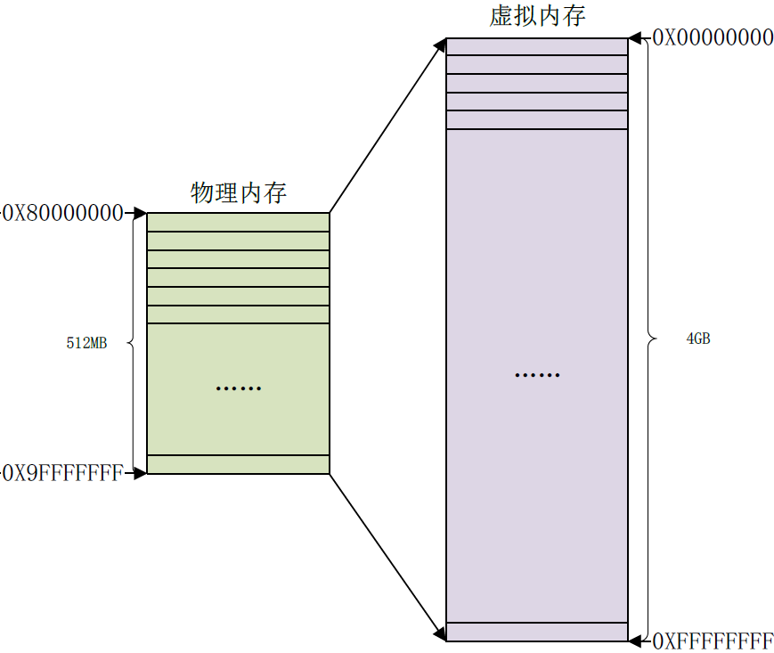
- 完成虚拟空间到物理空间的映射。
- 内存保护，设置存储器的访问权限，设置虚拟存储空间的缓冲特性。

#### `ioremap`

Linux内核启动的时候会初始化MMU，设置好内存映射，设置好以后CPU访问的都是虚
拟地址。当我们想访问物理地址的时候就必须做相应的转换`ioremap`函数。

`ioremap`函数用于获取指定物理地址空间对应的虚拟地址空间，定义在
`arch/arm/include/asm/io.h`文件中，定义如下：

```c
/**
*@phys_addr	：要映射给的物理起始地址。
*@*@size		：要映射的内存空间大小。
mtype ioremap的类型，可以选择 MT_DEVICE、 MT_DEVICE_NONSHARED、MT_DEVICE_CACHED和 *@MT_DEVICE_WC ioremap函数选择 MT_DEVICE。
*返回值		：  __iomem类型的指针，指向映射后的虚拟空间首地址。
*/
#define ioremap(cookie,size) __arm_ioremap((cookie), (size), MT_DEVICE) 
void __iomem * __arm_ioremap(phys_addr_t phys_addr, size_t size, unsigned int mtype) 
{ 
	return arch_ioremap_caller(phys_addr, size, mtype, __builtin_return_address(0)); 
}
```

例如我们要访问GPIO1_IO03的寄存器，可以这样定义

```c
#define SW_MUX_GPIO1_IO03_BASE (0X020E0068)            // 查找手册确定要操作的寄存器物理地址
static void __iomem* SW_MUX_GPIO1_IO03; 
SW_MUX_GPIO1_IO03 = ioremap(SW_MUX_GPIO1_IO03_BASE, 4);// 通过ioremap把物理地址转换为虚拟地址 SW_MUX_GPIO1_IO03 这样就可以用SW_MUX_GPIO1_IO03访问了
```

#### iounmap函数

卸载驱动的时候需要使用 iounmap函数释放掉 ioremap函数所做的映射， iounmap函数原
型如下：

```
函数原型 void iounmap (volatile void __iomem *addr)
iounmap(SW_MUX_GPIO1_IO03);
```

##### 内核空间的内存操作函数

使用 ioremap函数将寄存器的物理地址映射到虚拟地址以后，我们就可以直接通过指针访问这些地址，但是 Linux内核不建议这么做，而是推荐使用一组操作函数来对映射后的内存进行读写操作。

###### 读操作函数

```
u8 readb(const volatile void __iomem *addr) 
u16 readw(const volatile void __iomem *addr) 
u32 readl(const volatile void __iomem *addr)
```

readb、 readw和 readl这三个函数分别对应 8bit、 16bit和 32bit读操作，参数 addr就是要
读取写内存地址，返回值就是读取到的数据。

###### 写操作函数

写操作函数有如下几个：

```
void writeb(u8 value, volatile void __iomem *addr) 
void writew(u16 value, volatile void __iomem *addr) 
void writel(u32 value, volatile void __iomem *addr)
```

writeb、 writew和 writel这三个函数分别对应 8bit、 16bit和 32bit写操作，参数 value是要
写入的数值， addr是要写入的地址。

### printf 和printk

printf运行在用户空间，printk运行在内核空间，可以根据日志级别对消息进行分类，一共有 8个消息级别，
这 8个消息级别定义在文件 include/linux/kern_levels.h里面，定 义如下：

```c
#define KERN_SOH "\001" 
#define KERN_EMERG KERN_SOH "0" /* 紧急事件，一般是内核崩溃 */ 
#define KERN_ALERT KERN_SOH "1" /* 必 须立即采取行动 */ 
#define KERN_CRIT KERN_SOH "2" /* 临界条件，比如严重的软件或硬件错误 */ 
#define KERN_ERR KERN_SOH "3" /* 错误状态，一般设备驱动程序中使用KERN_ERR报告硬件错误 */ 
#define KERN_WARNING KERN_SOH "4" /* 警告信息，不会对系统造成严重影响 */ 
#define KERN_NOTICE KERN_SOH "5" /* 有必要进行提示的一些信息 */ 
#define KERN_INFO KERN_SOH "6" /* 提示性的信息 */ 
#define KERN_DEBUG KERN_SOH "7" /* 调试信息 */ 一共定义了 8个级别，其中 0的优先级最高， 7的优先级最低。
```

如果要设置消息级别，参考如下示例：

```
printk(KERN_EMERG "gsmi: Log Shutdown Reason\n");
```

不显式的设置消息级别，那么 printk将会采用默认级别

```c
MESSAGE_LOGLEVEL_DEFAULT默认为 4。
在 include/linux/printk.h中有个宏 
#define CONSOLE_LOGLEVEL_DEFAULT 7 
```

消息基本高于7的才会被显示出来

## 总线设备驱动模型

### 整体框架

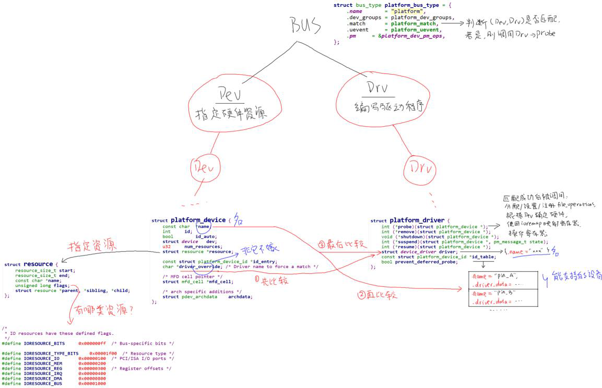

无论先注册平台设备还是平台驱动，程序都会去bus里面找对应的链表，根据匹配规则进行设备和驱动的匹配，当成功后就会调用驱动的probe函数，在probe函数中自己可以注册设备分配自己的file_operotions结构体，并完成硬件的初始化工作。

#### 匹配规则

- 比较`platform_device.driver_override` 和`platform_driver.driver.name`
  可以设置`platform_device .driver_override` ，强制选择某个 `platform_driver` 。

- 然后比较： `platform_ device.name` 和 `platform_driver.id_table[i].name`
  `platform_driver.id_table`是`struct platform_device_id`类型的指针，表示该 drv 支持若干个 device ，它里面
  列出了各个 device 的

  ```c
  {
  	.name;           //表示该 dv 支持的设备的名字
  	.driver_data;    //提供给该 d evice 的私有数据
  }
  ```

  

- 最后比较： `platform_device.name` 和 `platform_driver.driver.name`
  `platform_driver.id_table`可能为空，这时可以根据`platform_driver.driver.name` 来寻找同名的 `platform_device` 。

#### 平台设备注册函数调用关系

```c
platform_device_register
platform_device_add
	device_add
		bus_add_device // 放入链表
		bus_probe_device // probe 枚举设备， 即找到匹配的 dev, drv
			device_initial_probe
				__device_attach
					bus_for_each_drv (...,(...,__device_attach_driver
						__device_attach_driver
							driver_match_device(drv, dev) // 是否匹配
							driver_probe_device // 调用 d rv 的 p robe
```

#### 平台驱动注册函数调用关系

```c
platform_driver_register
__platform_driver_register
	driver_register
		bus_add_driver // 放入链表
			driver_attach(drv)
				bus_for_each_dev(drv bus, NULL, drv, __driver_attach);
					__driver_attach
						driver_match_device(drv, dev) // 是否匹配
						driver_probe_device // 调用 d rv 的 p robe
```

#### 常用函数

```c
drivers/base/platform.c

设备相关
platform_device_register\platform_device_unregister
platform_add_devices// 注册多个 device

驱动相关
platform_driver_register\platform_driver_unregister

获取资源相关
返回该dev 某种类型(type)的资源中的第几个(num)资源
struct resource *platform_get_resource(struct platform_device *dev,
				       unsigned int type, unsigned int num)
eg:获取中断内存资源
    platform_get_resource(dev, IORESOURCE_MEM, i)
    
返回该dev所用的第几个(num) 中断：    
int platform_get_irq(struct platform_device *dev, unsigned int num)

 通过名字返回该dev的某类型的资源 
struct resource *platform_get_resource_byname(struct platform_device *dev,
					      unsigned int type,
					      const char *name)
 通过名字返回该dev的中断号
int platform_get_irq_byname(struct platform_device *dev, const char *name)
```


## 设备树

### 设备树编译与反编译

`/sys/firmware/devicetree`目录下是以目录结构程现的 dtb 文件 , 根节点对应 base 目录 , 每一个节
点对应一个目录 , 每 一个属性对应一个文件 。这些属性的值如果是字符串，可以使用 cat 命令把它打印出来；对于数值，可以用 hexdump 把它打印出来。

```bash
# ls /sys/firmware
devicetree fdt
```

编译设备树

```
在内核根目录下
make dtbs V=1
```

内核目录下`scripts/dtc/dtc` 是设备树的编译工具，直接使用它的话，包含其他文件时不能使用`#include` ，而必须使用 `incldue/`。
编译、反编译的示例命令如下:

-I :指 定输入格式，-O :指定输出格式，-o :指定输出文件

```bash
./scripts/dtc/dtc I dts O dtb o tmp.dtb arch/arm/boot/dts/xxx.dts // 编译 dts 为 dtb
./scripts/dtc/dtc I dtb O dts o tmp.dts arch/arm/boot/dts/xxx.dtb // 反编译 dtb 为 dts
```


### 更换开发板设备树文件

对于 野火 imx6ull pro

```bash
arch/arm/boot/dts/imx6ull_14x14_ebf.dtb   # 编译出来的设备树文件位于内核源码路径下
更换这个文件
/boot/imx6ull_14x14_ebf.dtb               # 开发板启动后设备树文件位于这个目录
```

对于 firefly rk3288

```bash
arch/arm/boot/dts/rk3288_firefly.dtb   # 编译出来的设备树文件位于内核源码路径下
更换这个文件
/boot/rk3288_firefly.dtb               # 开发板启动后设备树文件位于这个目录
```


还可以看到/sys/firmware/fdt 文件，它就是 dtb 格式的设备树文件，可以把它复制出来放到 ubuntu上，执行下面的命令反编译出来 -I dtb ：输入格式是 dtb  -O dts ：输出 格式是 dts)

```bash
./scripts/dtc/dtc I dtb O dts ~/fdt o tmp.dts   # ~/fdt是从开发板上拷贝到ubuntu下的~目录下
```

### 内核对设备树的处理


- dts在PC 机上被编译为 dtb 文件；
- uboot 把 dtb 文件传给内核；
- 内核解析 dtb 文件，把每一个节点都转换为 device_node 结构体；
- 对于某些 device_node 结构体，会被转换 为 platform_device 结构体。

dtb 中每一个节点都被转换为 device_node 结构体。根节点被保存在全局变量`of_root` 中，从 `of_root` 开始可以访问到任意节点。

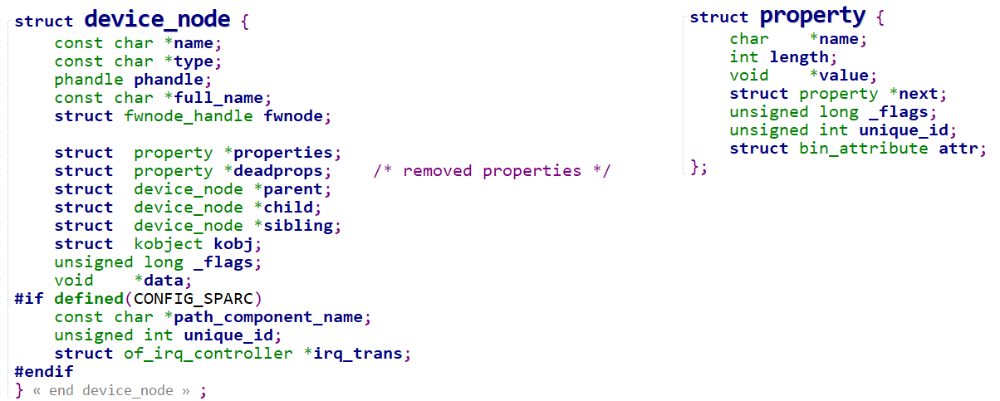


### 设备树节点被转换为 platform_device规则

1. 根节点下含有 compatile 属性的 子节点；
2. 如果一个节点的compatile 属性 ，它的值是这 4 者之一 `simple bus`、`simple`、`mfd`、`isa`、`arm,amb a bus`，那么它的子结点如果包含 compatile 属性 也可以转换为 platform_device 。
3. 总线 I2C 、 SPI 节点下的子节点 不转换 为 p latform_device，某个总线下到子节点，应该交给对应的总线驱动程序来处理 , 它们不应该被转换为 platform_device 。

```c
/{
    /*
     * mytest会被转换为 platform_device,  满足条件1
     * 子节点 mytest@0 也会被转换，满足条件2
     */
	mytest {
		compatile = "mytest", "simple bus";
		mytest@0 {
			compatile = "mytest_0";
		};
	};
    /*
     * i2c会被转换为 platform_device,  满足条件1
     * 子节点 at24c02 不会被转换，它被如何处理完全由父节点的platform_driver决定 , 一般是被创建为一      * 个 i2c_client 
     */
	i2c {
		compatile = "samsung,i2c";
		at24c02 {
			compatile = "a t24c02";
		};
	};
    /*
     * spi 会被转换为 platform_device,  满足条件1
     * 子节点 flash@0 不会被转换，它被如何处理完全由父节点的platform_driver决定 , 一般是被创建为一      * 个 spi_device 
     */
	spi {
		compatile = "samsung,spi";
		flash@0 {
			compatible = "winbond,w25q32dw";
			spi-max-frequency = <25000000>;
			reg = <0>;
		};
	};
};
```

#### 使用设备树后的platform_device如何与 platform_driver的匹配过程

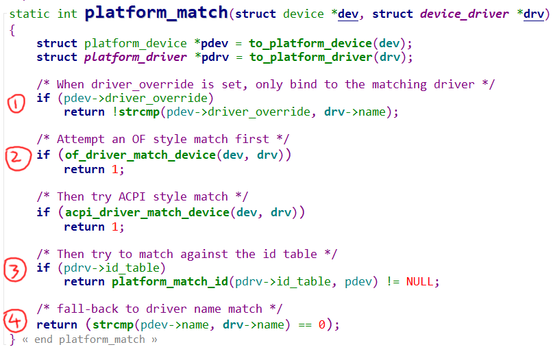


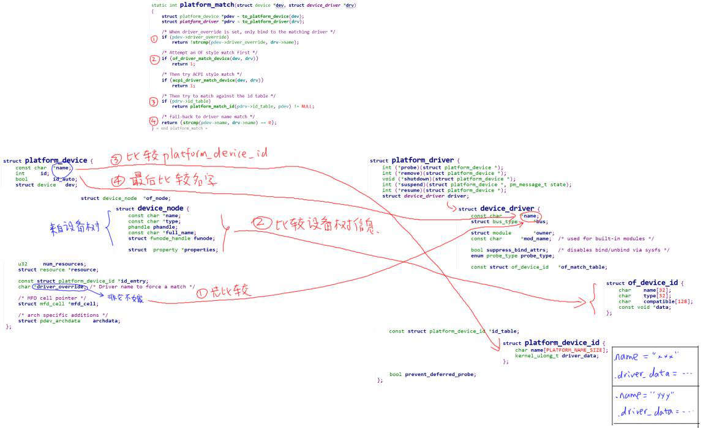

1. 比较`platform_device. driver_override`和`platform_driver.driver.name`

2. 比较：`platform_device.dev.of_node`和`platform_driver.driver.of_match_table`

   由设备树节点转换得来的`platform_device.dev`中，含有一个结构体：of_node。

   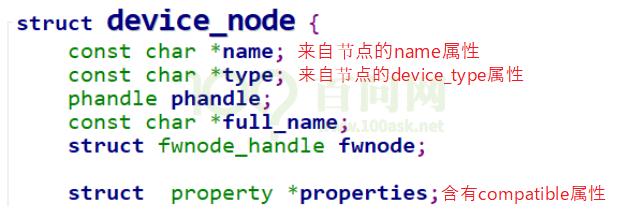

   如果一个platform_driver支持设备树，它的`platform_driver.driver.of_match_table`是一个数组，类型如下

   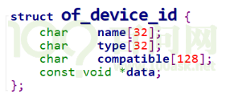

   使用设备树信息来判断dev和drv是否配对时，

   - 首先：如果of_match_table中含有compatible值，就跟dev的compatile属性比较，若一致则成功，否则返回失败；
   - 其次：如果of_match_table中含有type值，就跟dev的device_type属性比较，若一致则成功，否则返回失败；
   - 最后：如果of_match_table中含有name值，就跟dev的name属性比较，若一致则成功，否则返回失败。

   而设备树中建议不再使用devcie_type和name属性，所以基本上只使用设备节点的compatible属性来寻找匹配的platform_driver。

3. 比较`platform_device. name`和`platform_driver.id_table[i].name`，id_table中可能有多项

   platform_driver.id_table是`platform_device_id`指针，表示该drv支持若干个device，它里面列出了各个device的{.name, .driver_data}，其中的“name”表示该drv支持的设备的名字，driver_data是些提供给该device的私有数据

4. platform_driver.id_table可能为空，这时可以根据platform_driver.driver.name来寻找同名的platform_device。

### 设备树常用函数

#### 常用头文件

```
1：处理DTB
of_fdt.h         // dtb文件的相关操作函数, 我们一般用不到,   
		// 因为dtb文件在内核中已经被转换为device_node树(它更易于使用) 
		
2:处理device_node
of.h            // 提供设备树的一般处理函数,   
// 比如 of_property_read_u32(读取某个属性的u32值),   
// of_get_child_count(获取某个device_node的子节点数)   
of_address.h      // 地址相关的函数,   
// 比如 of_get_address(获得reg属性中的addr, size值)   
// of_match_device (从matches数组中取出与当前设备最匹配的一项)   
of_dma.h         // 设备树中DMA相关属性的函数   
of_gpio.h        // GPIO相关的函数   
of_graph.h       // GPU相关驱动中用到的函数, 从设备树中获得GPU信息   
of_iommu.h       // 很少用到   
of_irq.h         // 中断相关的函数   
of_mdio.h        // MDIO (Ethernet PHY) API   
of_net.h         // OF helpers for network devices.   
of_pci.h         // PCI相关函数   
of_pdt.h         // 很少用到   
of_reserved_mem.h  // reserved_mem的相关函数   

处理 platform_device
of_platform.h     // 把device_node转换为platform_device时用到的函数,   
		          // 比如of_device_alloc(根据device_node分配设置platform_device),   
		         // of_find_device_by_node (根据device_node查找到platform_device),   
		         //   of_platform_bus_probe (处理device_node及它的子节点)   
of_device.h      // 设备相关的函数, 比如 of_match_device   

```

#### 常用函数

##### of_find_device_by_node

函数原型为：

```c
extern struct platform_device *of_find_device_by_node(struct device_node *np);   
```

设备树中的每一个节点，在内核里都有一个device_node；你可以使用device_node去找到对应的platform_device。

##### platform_get_resource

这个函数跟设备树没什么关系，但是设备树中的节点被转换为platform_device后，设备树中的reg属性、interrupts属性也会被转换为“resource”。这时，你可以使用这个函数取出这些资源。
函数原型为：

```c
/**   
* platform_get_resource - get a resource for a device   
* @dev: platform device   
* @type: resource type   // 取哪类资源？IORESOURCE_MEM、IORESOURCE_REG   
*                 // IORESOURCE_IRQ等   
* @num: resource index  // 这类资源中的哪一个？   
*/   
struct resource *platform_get_resource(struct platform_device *dev,   
                                       unsigned int type, unsigned int num);   
```

对于设备树节点中的`reg`属性，它属性`IORESOURCE_MEM`类型的资源；
对于设备树节点中的`interrupts`属性，它属性`IORESOURCE_IRQ`类型的资源。

##### 有些节点不会生成platform_device，怎么访问它们

内核会把dtb文件解析出一系列的device_node结构体，我们可以直接访问这些device_node。内核源码`incldue/linux/of.h`中声明了device_node和属性property的操作函数，device_node和property的结构体定义如下：

##### 找到节点

1. `of_find_node_by`
   根据路径找到节点，比如“/”就对应根节点，“/memory”对应memory节点。
   函数原型：

   ```c
   static inline struct device_node *of_find_node_by_path(const char *path);   
   ```

2. `of_find_node_by_name`
   根据名字找到节点，节点如果定义了name属性，那我们可以根据名字找到它。
   函数原型：

   ```c
   extern struct device_node *of_find_node_by_name(struct device_node *from,
                                                   const char *name);   
   ```

   参数from表示从哪一个节点开始寻找，传入NULL表示从根节点开始寻找。
   但是在设备树的官方规范中不建议使用“name”属性，所以这函数也不建议使用。

3. `of_find_node_by_type`
   根据类型找到节点，节点如果定义了device_type属性，那我们可以根据类型找到它。
   函数原型：

   ```c
   		 extern struct device_node *of_find_node_by_type(struct device_node *from,
                                                            const char *type);   
   ```

   参数from表示从哪一个节点开始寻找，传入NULL表示从根节点开始寻找。
   但是在设备树的官方规范中不建议使用“device_type”属性，所以这函数也不建议使用。

4. `of_find_compatible_node`
   根据compatible找到节点，节点如果定义了compatible属性，那我们可以根据compatible属性找到它。
   函数原型：

   ```c
   extern struct device_node *of_find_compatible_node(struct device_node *from,  
                                               const char *type, const char *compat);   
   ```

   参数from表示从哪一个节点开始寻找，传入NULL表示从根节点开始寻找。
   参数compat是一个字符串，用来指定compatible属性的值；
   参数type是一个字符串，用来指定device_type属性的值，可以传入NULL。

5.  `of_find_node_by_phandle`
   根据phandle找到节点。dts文件被编译为dtb文件时，每一个节点都有一个数字ID，这些数字ID彼此不同。可以使用数字ID来找到device_node。这些数字ID就是phandle。函数原型：

   ```c
   extern struct device_node *of_find_node_by_phandle(phandle handle);   
   ```

   参数from表示从哪一个节点开始寻找，传入NULL表示从根节点开始寻找。

6. `of_get_parent`

   找到device_node的父节点。函数原型

   ```c
   extern struct device_node *of_get_parent(const struct device_node *node);   
   ```

   参数from表示从哪一个节点开始寻找，传入NULL表示从根节点开始寻找。

7. `of_get_next_parent`

   这个函数名比较奇怪，怎么可能有`next parent`？

   它实际上也是找到device_node的父节点，跟of_get_parent的返回结果是一样的。
   差别在于它多调用下列函数，把node节点的引用计数减少了1。这意味着调用of_get_next_parent之后，你不再需要调用of_node_put释放node节点。

   ```c
   of_node_put(node);   
   ```

   函数原型：

   ```c
   extern struct device_node *of_get_next_parent(struct device_node *node);   
   ```

   参数from表示从哪一个节点开始寻找，传入NULL表示从根节点开始寻找。

8. `of_get_next_child`

   取出下一个子节点。
   函数原型：

   ```c
   extern struct device_node *of_get_next_child(const struct device_node *node,   
   								    struct device_node *prev);   
   ```

   参数node表示父节点；
   prev表示上一个子节点，设为NULL时表示想找到第1个子节点。

   不断调用of_get_next_child时，不断更新pre参数，就可以得到所有的子节点。

9. `of_get_next_available_child`

   取出下一个“可用”的子节点，有些节点的status是“disabled”，那就会跳过这些节点。函数原型：

   ```c
   struct device_node *of_get_next_available_child(const struct device_node *node,
                                                   struct device_node *prev);   
   ```

   参数node表示父节点；
   prev表示上一个子节点，设为NULL时表示想找到第1个子节点。

10. `of_get_child_by_name`
    根据名字取出子节点。
    函数原型：

    ```c
    extern struct device_node *of_get_child_by_name(const struct device_node *node,   
    								const char *name);   
    ```

    参数node表示父节点；
    name表示子节点的名字。

##### 找到属性

内核源码`incldue/linux/of.h`中声明了device_node的操作函数，当然也包括属性的操作函数。

`of_find_property`
找到节点中的属性。
函数原型：

```c
extern struct property *of_find_property(const struct device_node *np,   
							 const char *name,   
							 int *lenp);   
```

参数np表示节点，我们要在这个节点中找到名为name的属性。
lenp用来保存这个属性的长度，即它的值的长度。

在设备树中，节点大概是这样：

```c
xxx_node {   
	 xxx_pp_name = “hello”;   
};   
```

上述节点中，“xxx_pp_name”就是属性的名字，值的长度是6。

#####  获取属性的值

1. `of_get_property`

   根据名字找到节点的属性，并且返回它的值。
   函数原型：

   ```c
   /*   
   * Find a property with a given name for a given node   
   * and return the value.   
   */   
   const void *of_get_property(const struct device_node *np, const char *name,   
   					   int *lenp)   
   ```

   参数np表示节点，我们要在这个节点中找到名为name的属性，然后返回它的值。
   lenp用来保存这个属性的长度，即它的值的长度。

2. `of_property_count_elems_of_size`

   根据名字找到节点的属性，确定它的值有多少个元素(elem)。
   函数原型：

   ```c
   /* of_property_count_elems_of_size - Count the number of elements in a property   
   *   
   * @np:		device node from which the property value is to be read.   
   * @propname:	name of the property to be searched.   
   * @elem_size:	size of the individual element   
   *   
   * Search for a property in a device node and count the number of elements of   
   * size elem_size in it. Returns number of elements on sucess, -EINVAL if the   
   * property does not exist or its length does not match a multiple of elem_size   
   * and -ENODATA if the property does not have a value.   
   */   
   int of_property_count_elems_of_size(const struct device_node *np,   
   						const char *propname, int elem_size)   
   ```

   参数np表示节点，我们要在这个节点中找到名为propname的属性，然后返回下列结果：

   ```c
   return prop->length / elem_size;   
   ```

   在设备树中，节点大概是这样：

   ```c
   xxx_node {   
   	xxx_pp_name = <0x50000000 1024>  <0x60000000  2048>;   
   };   
   ```

   调用of_property_count_elems_of_size(np, “xxx_pp_name”, 8)时，返回值是2；
   调用of_property_count_elems_of_size(np, “xxx_pp_name”, 4)时，返回值是4。

3. 读整数u32/u64

   函数原型为：

   ```c
   static inline int of_property_read_u32(const struct device_node *np,   
   						      const char *propname,   
   						      u32 *out_value);   
      
   extern int of_property_read_u64(const struct device_node *np,   
   	 				const char *propname, u64 *out_value);   
   ```

   在设备树中，节点大概是这样：

   ```c
   xxx_node {   
   	   name1 = <0x50000000>;   
   	   name2 = <0x50000000  0x60000000>;   
   };   
   ```

   调用of_property_read_u32 (np, “name1”, &val)时，val将得到值0x50000000；
   调用of_property_read_u64 (np, “name2”, &val)时，val将得到值0x0x6000000050000000。

4. 读某个整数u32/u64

   函数原型为：

   ```c
   extern int of_property_read_u32_index(const struct device_node *np,   
   						      const char *propname,   
   						      u32 index, u32 *out_value);   
   ```

   在设备树中，节点大概是这样：

   ```c
   xxx_node {   
   		name2 = <0x50000000  0x60000000>;   
   };   
   ```

   调用of_property_read_u32 (np, “name2”, 1, &val)时，val将得到值0x0x60000000。

5. 读数组

   函数原型为：

   ```c
   int of_property_read_variable_u8_array(const struct device_node *np,   
   							const char *propname, u8 *out_values,   
   							size_t sz_min, size_t sz_max);   
   		   
   int of_property_read_variable_u16_array(const struct device_node *np,   
   							const char *propname, u16 *out_values,   
   							size_t sz_min, size_t sz_max);   
   		   
   int of_property_read_variable_u32_array(const struct device_node *np,   
   					      const char *propname, u32 *out_values,   
   					      size_t sz_min, size_t sz_max);   
   		   
   int of_property_read_variable_u64_array(const struct device_node *np,   
   					      const char *propname, u64 *out_values,   
   					      size_t sz_min, size_t sz_max);   
   ```

   在设备树中，节点大概是这样：

   ```c
   xxx_node {   
   		name2 = <0x50000012  0x60000034>;   
   };   
   ```

   上述例子中属性name2的值，长度为8。

   ```c
   调用of_property_read_variable_u8_array (np, “name2”, out_values, 1, 10)时，out_values中将会保存这8个字节： 0x12,0x00,0x00,0x50,0x34,0x00,0x00,0x60。
   调用of_property_read_variable_u16_array (np, “name2”, out_values, 1, 10)时，out_values中将会保存这4个16位数值： 0x0012, 0x5000,0x0034,0x6000。
   ```

   总之，这些函数要么能取到全部的数值，要么一个数值都取不到；
   如果值的长度在sz_min和sz_max之间，就返回全部的数值；否则一个数值都不返回。

6. 读字符串
   函数原型为：

   ```c
   int of_property_read_string(const struct device_node *np, const char *propname,   
   		 				const char **out_string);   
   ```

   返回节点np的属性(名为propname)的值，(*out_string)指向这个值，把它当作字符串。

### 编写设备树驱动程序

实际工作中工作中，驱动要求设备树节点提供什么，我们就得按这要求去编写设备树。但是，匹配过程所要求的东西是固定的：

1. 设备树要有compatible属性，它的值是一个字符串
2. platform_driver中要有of_match_table，其中一项的.compatible成员设置为一个字符串
3. 上述2个字符串要一致。

如下图所示：

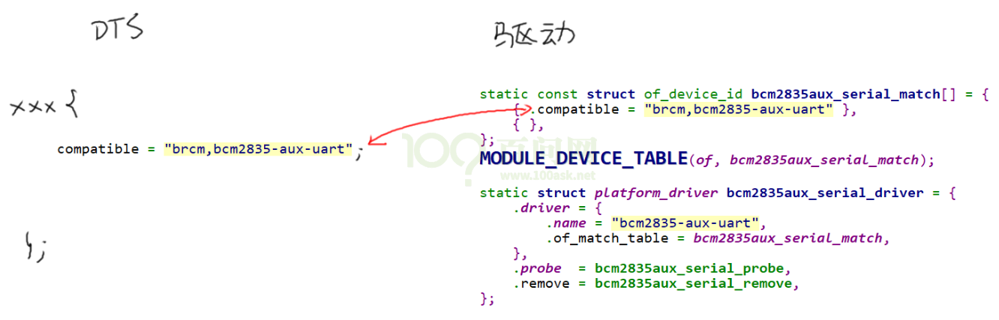

## pinctrl和GPIO子系统

### pinctrl子系统

管理gpio的复用功能

管理gpio的电气特性(上下拉，驱动能力等)

```c
iomuxc: iomuxc@020e0000 {
	compatible = "fsl,imx6ul-iomuxc";	
…… 
	 pinctrl_led{
			fsl,pins = <
				MX6ULL_PAD_SNVS_TAMPER3__GPIO5_IO03 0x1b0b0
			>;
…… 
};	
```


在`arch/arm/boot/dts/imx6ull-pinfunc-snvs.h` 里面有宏定义定义	                                

```c
#define MX6ULL_PAD_SNVS_TAMPER3__GPIO5_IO03   0x0014     0x0058     0x0000     0x5       0x0

```
后面四个值分别代表的意思如下：

```c
0x0014：mux_reg 复用寄存器偏移地址  基地址通过父节点iomuxc找到 可以看出MX6ULL_PAD_SNVS_TAMPER3的mux_reg地址就是020e0000+0x0014   查阅手册就可以看出是正确的
0x0058：conf_reg  配置寄存器偏移地址
0x0000：input_reg 输入寄存器偏移地址 (不是每个io都有，这里就没有所以0x0000无效的值)
0x5   ：mux_mode  配置mux_reg寄存器的值，即选择了ALT5 复用为GPIO
0x0   :input_val  配置input_reg的值，这里无效
```

而pinctrl_led里面的0x1b0b0  就是设置conf_reg寄存器的值，用来设置电器属性（上下拉等等）

所以通过 pinctrl_led描述，就可以确定这个IO功能。

根据`iomuxc的属性compatible = "fsl,imx6ul-iomuxc"`可以确定其驱动程序在
`drivers/pinctrl/freescale/pinctrl-imx6ul.c`文件中，这个即是fsl 官方为linux适配的pinctrl子系统的驱动程序

### gpio子系统

在`arch/arm/boot/dts/imx6ull.dtsi`文件中定义各gpio控制器的属性

```c
gpio5: gpio@020ac000 {
    // 可以找到fsl官方为imx适配的linux的gpio子系统的源代码驱动文件 drivers/gpio/gpio-mxc.c
	compatible = "fsl,imx6ul-gpio", "fsl,imx35-gpio";    
	reg = <0x020ac000 0x4000>;         // GPIO5寄存器的基地址（GPIO5_DR GPIO5_GDIR……）
	interrupts = <GIC_SPI 74 IRQ_TYPE_LEVEL_HIGH>,      
			     <GIC_SPI 75 IRQ_TYPE_LEVEL_HIGH>;
	gpio-controller;                 // 表示 gpio5节点是个 GPIO控制器。
   /* 有两个cells 第一个是GPIO编号，例如&gpio5 3  
   * 第二个指GPIO的电平，0(GPIO_ACTIVE_HIGH)高电平有效  1(GPIO_ACTIVE_LOW)低电平有效。
   */
	#gpio-cells = <2>;                                 
	interrupt-controller;
	#interrupt-cells = <2>;
};
```

 那么我们在下面需要引用到gpio节点的时候如下

```c
 leds {
	compatible    = "xym-led";
	pinctrl-names = "default";
	pinctrl-0     = <&pinctrl_led>;
	led0: cpu {
		gpios  = <&gpio5 3 GPIO_ACTIVE_LOW>;   // 正如这句，说明要用GPIO5_03  默认低电平有效
        status = "okay"; 
	};
};
```

#### 有关gpio子系统的API函数接口
```c
//1: 用于申请一个 GPIO管脚，在使用一个GPIO之前一定要申请 label是给GPIO设置个名字  返回0代表成功 
int gpio_request(unsigned gpio, const char *label)
    
//2:释放
void gpio_free(unsigned gpio)
    
//3: 设置为输入  返回0代表成功 
int gpio_direction_input(unsigned gpio)
 
//4: 设置为输出，默认输出值为value  返回0代表成功 c
int gpio_direction_output(unsigned gpio, int value)

//5: 获取gpio的值，负值失败  
#define gpio_get_value __gpio_get_value                    
int __gpio_get_value(unsigned gpio)

//6: 设置gpio的值， 为value
#define gpio_set_value __gpio_set_value 
void __gpio_set_value(unsigned gpio, int value)     
```

#### 与 gpio相关的 OF函数
```c

int of_gpio_named_count(struct device_node *np, const char *propname)
获取设备树某个属性里面定义了几个 GPIO信息，要注意的是空的 GPIO信息也会被统计到，比如下面的代码会得到的返回值是 4
gpios = <0 
		&gpio1 1 2 
		0 
		&gpio2 3 4>;
```


```c
int of_gpio_count(struct device_node *np)

和of_gpio_named_count函数一样，但是不同的地方在于，此函数统计的是“gpios”这个属
性的GPIO数量，而 of_gpio_named_count函数可以统计任意属性的 GPIO信息，
```

```c
int of_get_named_gpio(struct device_node *np, const char *propname, int index)
此函数获取GPIO编号， 
np：设备节点。
propname：包含要获 取 GPIO信息的属性名。
index GPIO索引，因为一个属性里面可能包含多个 GPIO，此参数指定要获取哪个 GPIO的编号，如果只有一个 GPIO信息的话此参数为 0。
返回值： 正值，获取到的 GPIO编号；负值，失败。

```

## 并发与竞争
### 原子操作
原子操作只能对整形变量或者位进行保护

#### 原子整形操作

```c
include/linux/types.h

如果使用 32位的 SOC
typedef struct {
	int counter;
} atomic_t;


如果使用 64位的 SOC
typedef struct { 
	long long counter; 
} atomic64_t;
下面所有介绍都基于32位系统说明

使用示例
atomic_t a; 				  /*定义a */
atomic_t v = ATOMIC_INIT(0); /* 定义并初始化原子变零v=0 */ 
atomic_set(10); 			/* 设置v=10 */ 
atomic_read(&v); 			/* 读取v的值，肯定是10 */ 
atomic_inc(&v); 			/* v的值加1，v=11 */

```
基本API

| 函数                                        | 功能                                      |
| ------------------------------------------- | ----------------------------------------- |
| ATOMIC_INIT(int i)                          | 定义原子变量的时候对其初始化              |
| int atomic_read(atomic_t *v)                | 读取v的值，并且返回                       |
| void atomic_set(atomic_t *v, int i)         | 向v写入 i值                               |
| void atomic_add(int i, atomic_t *v)         | 给v加上 i值                               |
| void atomic_sub(int i, atomic_t *v)         | 从v减去 i值                               |
| void atomic_inc(atomic_t *v)                | 给v加 1，也就是自增                       |
| void atomic_dec(atomic_t *v)                | 从v减 1，也就是自减                       |
| int atomic_dec_return(atomic_t *v)          | 从v减 1，并且返回 v的值                   |
| int atomic_inc_return(atomic_t *v)          | 给v加 1，并且返回 v的值                   |
| int atomic_sub_and_test(int i, atomic_t *v) | 从v减 i，如果结果为 0就返回真，否则返回假 |
| int atomic_dec_and_test(atomic_t *v)        | 从v减 1，如果结果为 0就返回真，否则返回假 |
| int atomic_inc_and_test(atomic_t *v)        | 给v加 1，如果结果为 0就返回真，否则返回假 |
| int atomic_add_negative(int i, atomic_t *v) | 给v加 i，如果结果为负就返回真，否则返回假 |

#### 原子位操作
基本API

| 函数                                     | 功能                                          |
| ---------------------------------------- | --------------------------------------------- |
| void set_bit(int nr, void *p)            | 将p地址的第 nr位置 1。                        |
| void clear_bit(int nr,void *p)           | 将p地址的第 nr位清零。                        |
| void change_bit(int nr, void *p)         | 将p地址的第 nr位进行翻转。                    |
| int test_bit(int nr, void *p)            | 获取p地址的第 nr位的值。                      |
| int test_and_set_bit(int nr, void *p)    | 将p地址的第 nr位置 1，并且返回 nr位原来的值。 |
| int test_and_clear_bit(int nr, void *p)  | 将p地址的第 nr位清零，并且返回 nr位原来的值。 |
| int test_and_change_bit(int nr, void *p) | 将p地址的第 nr位翻转，并且返回 nr位原来的值。 |

### 自旋锁
对于自旋锁而言，如果自旋锁正在被线程 A持有，线程 B想要获取自旋锁，那么线程 B就会处于忙循环-旋转-等待状态，
线程B不会进入休眠状态或者说去做其他的处理，而是会一直傻傻的在那里“转圈圈”的等待线程A释放锁

缺点：等待自旋锁的线程会一直处于自旋状态，这样会浪费处理器时间，降低系统性能，所以自旋锁
的持有时间不能太长。自旋锁适用于短时期的轻量级加锁，如果遇到需要长时间持有锁的场景那就需要换其他的方法了，

注意事项：自旋锁加锁后。不要调用引起系统睡眠和阻塞的API的函数，否则会可能导致锁死现象
Linux关于自旋锁的结构体定义如下
```c
typedef struct spinlock {
	union { 
	struct raw_spinlock rlock; 
#ifdef CONFIG_DEBUG_LOCK_ALLOC 
	 # define LOCK_PADSIZE (offsetof(struct raw_spinlock, dep_map)) 
		 struct { 
			 u8 __padding[LOCK_PADSIZE];
				struct lockdep_map dep_map;
			 };
#endif
	};
} spinlock_t;
```


自旋锁API 函数
| 函数                                 | 功能                                                         |
| ------------------------------------ | ------------------------------------------------------------ |
| DEFINE_SPINLOCK(spinlock_t lock)     | 定义并初始化一个自旋变量。                                   |
| int spin_lock_init(spinlock_t *lock) | 初始化自旋锁。                                               |
| void spin_lock(spinlock_t *lock)     | 获取指定的自旋锁，也叫做加锁。                               |
| void spin_unlock(spinlock_t *lock)   | 释放指定的自旋锁。                                           |
| int spin_trylock(spinlock_t *lock)   | 尝试获取指定的自旋锁，如果没有获取到就立即返回0，不在自旋等待 |
| int spin_is_locked(spinlock_t *lock) | 检查指定的自旋锁是否被获取，如果没有被获取就返回非0，否则返回0 |

和中断有关的自旋锁

| 函数                                                         | 功能                                                     |
| ------------------------------------------------------------ | -------------------------------------------------------- |
| void spin_lock_irq(spinlock_t *lock)                         | 禁止本地中断并获取自旋锁                                 |
| void spin_unlock_irq(spinlock_t *lock)                       | 激活本地中断，并释放自旋锁                               |
| void spin_lock_irqsave(spinlock_t *lock, unsigned long flags) | 保存中断状态，禁止本地中断，并获取自旋锁。               |
| void spin_unlock_irqrestore(spinlock_t *lock, unsigned long flags) | 将中断状态恢复到以前的状态，并且激活本地中断，释放自旋锁 |

使用场景：

一般在线程中使用 spin_lock_irqsave/ spin_unlock_irqrestore，
在中断中使用 spin_lock/spin_unlock 
应用举例
```c
DEFINE_SPINLOCK(lock) /* 定义并初始化一个锁 */ 
/* 线程A */ 
void functionA ()
{ 
	unsigned long flags; 					/* 中断状态 */ 
	spin_lock_irqsave(&lock, flags) 		/* 获取锁 */ 
	/* 临界区 */ 
	spin_unlock_irqrestore(&lock, flags) 	/* 释放锁 */ 
} 
 /* 中断服务函数 */ 
void irq() 
{ 
	spin_lock(&lock) /* 获取锁 */
	/* 临界区 */ 
	spin_unlock(&lock) /* 释放锁 */ 
}
```
下半部 (BH)也会竞争共享资源，有些资料也会将下半部叫做底半部。如果要在下半部里面使用自旋锁，
API函数：

| 函数                                  | 功能                       |
| ------------------------------------- | -------------------------- |
| void spin_lock_bh(spinlock_t *lock)   | 关闭下半部，并获取自旋锁。 |
| void spin_unlock_bh(spinlock_t *lock) | 打开下半部，并释放自旋锁   |

### 读写自旋锁
在自旋锁的基础上衍生而来
特点：允许读并发

```c
typedef struct { 
	arch_rwlock_t raw_lock; 
} rwlock_t;
```
读写锁API

- 创建和初始化

| 函数                             | 功能               |
| -------------------------------- | ------------------ |
| DEFINE_RWLOCK(rwlock_t lock)     | 定义并初始化读写锁 |
| void rwlock_init(rwlock_t *lock) | 初始化读写锁       |

- 读锁

| 函数                                                         | 功能                                                 |
| ------------------------------------------------------------ | ---------------------------------------------------- |
| void read_lock(rwlock_t *lock)                               | 获取读锁                                             |
| void read_unlock(rwlock_t *lock)                             | 释放读锁                                             |
| void read_lock_irq(rwlock_t *lock)                           | 禁止本地中断，并且获取读锁                           |
| void read_unlock_irq(rwlock_t *lock)                         | 打开本地中断，并且释放读锁                           |
| void read_lock_irqsave(rwlock_t *lock,unsigned long flags)   | 保存中断状态，禁止本地中断，并获取读锁               |
| void read_unlock_irqrestore(rwlock_t *lock,unsigned long flags) | 将中断状态恢复到以前的状态，并且激活本地中断，释放读 |
| void read_lock_bh(rwlock_t *lock)                            | 关闭下半部，并获取读锁                               |
| void read_unlock_bh(rwlock_t *lock)                          | 打开下半部，并释放读锁                               |

- 写锁

| 函数                                                         | 功能                                                   |
| ------------------------------------------------------------ | ------------------------------------------------------ |
| void write_lock(rwlock_t *lock)                              | 获取写 锁                                              |
| void write_unlock(rwlock_t *lock)                            | 释放写 锁                                              |
| void write_lock_irq(rwlock_t *lock)                          | 禁止本地中断，并且获取写 锁                            |
| void write_unlock_irq(rwlock_t *lock)                        | 打开本地中断，并且释放写 锁                            |
| void write_lock_irqsave(rwlock_t *lock,unsigned long flags)  | 保存中断状态，禁止本地中断，并获取写 锁                |
| void write_unlock_irqrestore(rwlock_t *lock,unsigned long flags) | 将中断状态恢复到以前的状态，并且激活本地中断，释放读锁 |
| void write_lock_bh(rwlock_t *lock)                           | 关闭下半部，并获取读锁                                 |
| void write_unlock_bh(rwlock_t *lock)                         | 打开下半部，并释放读锁。                               |

### 顺序锁
在读写锁的基础上衍生而来
允许读写并发，但是在读操作的时候同时进行了写操作，最好重新读取，保证读取的数据正确
最好重新进行读取，保证数据完整性。顺序锁保护的资源不能是指针，因为如果在写操作的时
候可能会导致指针无效，而这个时候恰巧有读操作访问指针的话就可能导致意外发生，比如读
取野指针导致系统崩溃。
Linux 关于顺序锁的定义

```c
typedef struct { 
	struct seqcount seqcount; 
	spinlock_t lock; 
} seqlock_t;

```

- 顺序锁定义并初始化
| 函数                            | 功能               |
| ------------------------------- | ------------------ |
| DEFINE_SEQLOCK(seqlock_t sl)    | 定义并初始化顺序锁 |
| void seqlock_ini seqlock_t *sl) | 初始化顺序锁       |

- 顺序锁写操作
| 函数                                                         | 功能                                               |
| ------------------------------------------------------------ | -------------------------------------------------- |
| void write_seqlock(seqlock_t *sl)                            | 获取写顺序锁。                                     |
| void write_sequnlock(seqlock_t *sl)                          | 释放写顺序锁。                                     |
| void write_seqlock_irq(seqlock_t *sl)                        | 禁止本地中断，并且获取写顺序锁                     |
| void write_sequnlock_irq(seqlock_t *sl)                      | 打开本地中断，并且释放写顺序锁。                   |
| void write_seqlock_irqsave(seqlock_t *sl,unsigned long flags) | 保存中断状态，禁止本地中断，并获取写顺序锁。       |
| void write_sequnlock_irqrestore(seqlock_t *sl,unsigned long flags) | 恢复以前的中断状态，并激活本地中断，释放写顺序锁。 |
| void write_seqlock_bh(seqlock_t *sl)                         | 关闭下半部，并获取写读锁。                         |
| void write_sequnlock_bh(seqlock_t *sl)                       | 打开下半部，并释放写读锁。                         |

- 顺序锁读操作
| 函数                                                       | 功能                                                         |
| ---------------------------------------------------------- | ------------------------------------------------------------ |
| unsigned read_seqbegin(const seqlock_t *sl)                | 读单元访问共享资源的时候调用此函数，此函数会返回顺序锁的顺序号。 |
| unsigned read_seqretry(const seqlock_t *sl,unsigned start) | 读结束以后调用此函数检查在读的过程中有没有对资源进行写操作，如果有的话就要重读 |

自旋锁使用注意事项

- 因为在等待自旋锁的时候处于“自旋”状态，因此锁的持有时间不能太长，一定要
短，否则的话会降低系统性能。如果临界区比较大，运行时间比较长的话要选择其他的并发处
理方式，比如稍后要讲的信号量和互斥体。
- 自旋锁保护的临界区内不能调用任何可能导致线程休眠的 API函数，否则的话可能
导致 死锁。
- 不能递归申请自旋锁，因为一旦通过递归的方式申请一个你正在持有的锁，那么你就
必须“自旋”， 等待锁被释放，然而你正处于“自旋”状态，根本没法释放锁。结果就是自己
把自己锁死了！
- 在编写驱动程序的时候我们必须考虑到驱动的可移植性，因此不管你用的是单核的还
是多核的 SOC，都将其当做多核 SOC来编写驱动程序。

### 信号量
相比于自旋锁，信号量可以使线程进入休眠状态，但是，信号量的开销要比自旋锁大，因为信号量使
线程进入休眠状态 以后会切换线程，切换线程就会有开销。总结一下信号量的特点：
- 因为信号量可以使等待资源线程进入休眠状态，因此适用于那些占用资源比较久的场合；
- 因此信号量不能用于中断中，因为信号量会引起休眠，中断不能休眠；
- 如果共享资源的持有时间比较短，那就不适合使用信号量了，因为频繁的休眠、切换线程引起的开销要远大于信号量带来的那点优势。

数型信号量，计数型信号量不能用于互斥访问，因为它允许多个线程同时访问共享资源。线程申请一次信号量就会自减一次
知道为0；如果要互斥的访问共享资源那么信号量的值就不能大于1，此时的信号量就是一个二值信号量。
Linux内核使用 semaphore结构体表示信号量，结构体内容如下所示：
```c
struct semaphore { 
	raw_spinlock_t lock; 
	unsigned int count; 
	struct list_head wait_list; 
};
```
信号量的API函数
| 函数                                           | 功能                                                         |
| ---------------------------------------------- | ------------------------------------------------------------ |
| DEFINE_SEAMPHORE(name)                         | 定义一个信号量，并且设置信号量的值为                         |
| void sema_init(struct semaphore *sem, int val) | 初始化信号量sem，设置信号量值为 val。                        |
| void down(struct semaphore *sem)               | 获取信号量，因为会导致休眠，因此不能在中断中使用。           |
| int down_trylock(struct semaphore *sem);       | 尝试获取信号量，如果能获取到信号量就获取，并且返回 0。如果不能就返回非 0，并且不会进入休眠。 |
| int down_interruptible(struct semaphore *sem)  | 获取信号量，和down类似，只是使用 down进入休眠状态的线程不能被信号打断。而使用此函数进入休眠以后是可以被信号打断的。 |
| void up(struct semaphore *sem)                 | 释放信号量                                                   |

应用举例
```c
struct semaphore sem; 	/* 定义信号量 */ 
sema_init(&sem, 1)； 	/* 初始化信号量 */ 
down(&sem); 			/* 申请信号量 */ 
/* 临界区 */ 
up(&sem); 				/* 释放信号量 */
```

### 互斥体
将信号量的值设置为1就可以使用信号量进行互斥访问了，虽然可以通过信号量实现互斥，但是 Linux提供了一个比信号量更专业的机制来进行
互斥，它就是互斥体 mutex。互斥访问表示一次只有一个线程可以访问共享资源，不能递归申
请互斥体。
在我们编写 Linux驱动的时候遇到需要互斥访问的地方建议使用 mutex
LINUX关于互斥体的定义如下
```c
struct mutex { 
     
	atomic_t count; /* 1: unlocked, 0: locked, negative: locked, possible waiters */ 
	spinlock_t wait_lock; 
};
```

在使用 mutex之前要先定义一个 mutex变量。在使用 mutex的时候要注 意如下几点：
-  mutex可以导致休眠，因此不能在中断中使用 mutex，中断中只能使用自旋锁。
- 和信号量一样，mutex保护的临界区可以调用引起阻塞的 API函数。
- 因为一次只有一个线程可以持有mutex，因此，必须由 mutex的持有者释放 mutex。并且 mutex不能递归上锁和解锁。

关于互斥体的API函数
| 函数                                             | 功能                                                  |
| ------------------------------------------------ | ----------------------------------------------------- |
| DEFINE_MUTEX(name)                               | 定义并初始化一个mutex变量。                           |
| void mutex_init(mutex *lock)                     | 初始化mutex。                                         |
| void mutex_lock(struct mutex *lock)              | 获取mutex，也就是给 mutex上锁。如果获取不到就进休眠。 |
| void mutex_unlock(struct mutex *lock)            | 释放mutex，也就给 mutex解锁。                         |
| int mutex_trylock(struct mutex *lock)            | 尝试获取mutex，如果成功就返回 1，如果失败就返回 0。   |
| int mutex_is_locked(struct mutex *lock)          | 判断 mutex是否被获取，如果是的话就返回1，否则返回 0。 |
| int mutex_lock_interruptible(struct mutex *lock) | 使用此函数获取信号量失败进入休眠以后可以被信号打断。  |

应用举例
```c
struct mutex lock; /* 定义一个互斥体 */ 
mutex_init(&lock); /* 初始化互斥体 */ 
mutex_lock(&lock); /* 上锁 */ 
 /* 临界区 */ 
mutex_unlock(&lock); /* 解锁 */
```

## Linux内核定时器

### 简介
我们在编译 Linux内核的时候可以通过图形化界面设置系统节拍率，按照如下路径打开配置界面：
-> Kernel Features -> Timer frequency (<choice> [=y])
选中“ Timer frequency”，打开以后如图 

可以看出，可选的系统节拍率为 100Hz、 200Hz、 250Hz、 300Hz、 500Hz和1000Hz，默认情况下选择 100Hz
编写 Linux驱动的时候会常常用到 HZ，HZ表示一秒的节拍数，也就是频率。即上面的这些频率值
定义在include/asm-generic/param.h里面
```c
# undef HZ
# define HZ CONFIG_HZ    // 这里定义 CONFIG_HZ即是通过配置界面生成在.config里面的值
# define USER_HZ 100 
# define CLOCKS_PER_SEC (USER_HZ)
```

Linux内核使用全局变量 jiffies来记录系统从启动以来的系统节拍数，系统启动的时候会
将 jiffies初始化为 0 jiffies定义在文件 `include/linux/jiffies.h`中，定义如下：
```
extern u64 __jiffy_data jiffies_64; 
extern unsigned long volatile __jiffy_data jiffies;

jiffies_64 和jiffies一个是64位的一个是32位的，jiffies其实就是jiffies_64的低32位而已
```

unkown 通常为jiffies，known 通常是需要对比的值。
| 函数                          | 功能                                      |
| ----------------------------- | ----------------------------------------- |
| time_after(unkown, known)     | unkown>known  超时     返回真，否则返回假 |
| time_after_eq(unkown, known)  | unkown>=known 刚超时   返回真，否则返回假 |
| time_before(unkown, known)    | unkown<known  未超时   返回真，否则返回假 |
| time_before_eq(unkown, known) | unkown<=known 刚未超时 返回真，否则返回假 |


用法示例
```c
unsigned long timeout;
timeout = jiffies + (2 * HZ); /* 超时的时间点 */

/*************************************
具体的代码
************************************/

/* 判断有没有超时 */
if(time_before(jiffies, timeout)) {
 /* 超时未发生 */
} else {
 /* 超时发生 */
}
```
ms us ns 和jiffies之间的相互转换函数API
| 函数                                        | 功能                            |
| ------------------------------------------- | ------------------------------- |
| int jiffies_to_msecs(const unsigned long j) | 将jiffies类型的参数 转换为 毫秒 |
| int jiffies_to_usecs(const unsigned long j) | 将jiffies类型的参数 转换为 微秒 |
| u64 jiffies_to_nsecs(const unsigned long j) | 将jiffies类型的参数 转换为 纳秒 |
| long msecs_to_jiffies(const unsigned int m) | 将毫秒转换为jiffies类型         |
| long usecs_to_jiffies(const unsigned int u) | 将微秒转换为jiffies类型         |
| unsigned long nsecs_to_jiffies(u64 n)       | 将纳秒转换为jiffies类型         |

### 内核定时器
Linux内核使用 timer_list结构体表示内核定时器，基于内核系统时钟层面上的软件定时器
```c
struct timer_list { 
	struct list_head entry; 
	unsigned long expires;            /* 定时器超时时间，单位是节拍数 */ 
	struct tvec_base *base; 
	void (*function)(unsigned long); /* 定时处理函数 */
	unsigned long data;              /* 要传递给function函数的参数 */ 
	int slack; 
};
```
内核定时器相关的系统的API函数
| 函数                                                         | 功能                                                         |
| ------------------------------------------------------------ | ------------------------------------------------------------ |
| void init_timer(struct timer_list *timer)                    | 初始化定时器。                                               |
| void add_timer(struct timer_list *timer)                     | 向 Linux内核注册定时器                                       |
| int del_timer(struct timer_list * timer)                     | 删除定时器，不管定时器有没有被激活，都可以使用此函数删除。返回值0：定时器还没被激活 1：定时器已经激活。 |
| int mod_timer(struct timer_list *timer, unsigned long expires) | 函数用于修改定时值，如果定时器还没有激活的话，该函数会激活定时 |


使用示例
```c
struct timer_list timer;            /* 定义定时器 */ 
/* 定时器回调函数 */ 
void function(unsigned long arg) 
{ 
	/* 
	 * 定时器处理代码 
	 */ 
	 
	/* 如果需要定时器周期性运行的话就使用mod_timer 
	 * 函数重新设置超时值并且启动定时器。 
	 */ 
	 mod_timer(&dev->timertest, jiffies + msecs_to_jiffies(2000)); 14 
}
/* 初始化函数 */
void init(void)
{
	init_timer(&timer); /* 初始化定时器 */
	timer.function = function; /* 设置定时处理函数 */
	timer.expires=jffies + msecs_to_jiffies(2000);/* 超时时间2秒 */
	timer.data = (unsigned long)&dev; /* 将设备结构体作为参数 */
	add_timer(&timer); /* 启动定时器 */
}	 
/* 退出函数 */
void exit(void)
{
	del_timer(&timer); /* 立即删除定时器 */
	/* 或者使用 */
	del_timer_sync(&timer); /* 会等定时器处理函数完成后在删除*/
}	 
```
###	内核常用的短延时函数

| 函数                              | 功能          |
| --------------------------------- | ------------- |
| void ndelay(unsigned long nsecs)  | 纳秒 延时函数 |
| void udelay(unsigned long usecs)  | 微秒 延时函数 |
| void mdelay(unsigned long mseces) | 毫秒 延时函数 |

## Cortex-A7中断系统
### 中断向量表

| 向量地址 | 中断类型                                          | 中断模式                  |
| -------- | ------------------------------------------------- | ------------------------- |
| 0X00     | 复位中断(Rest)                                    | 特权模式(SVC)             |
| 0X04     | 未定义指令中断(Undefined Instruction)             | 未定义指令中止模式(Undef) |
| 0X08     | 软中断(Software Interrupt,SWI)                    | 特权模式(SVC)             |
| 0X0C     | 指令预取中止中断(Prefetch Abort)                  | 中止模式                  |
| 0X10     | 数据访问中止中断(Data Abort)                      | 中止模式                  |
| 0X14     | 未使用(Not Used)未使用0X18IRQ中断 (IRQ Interrupt) | 外部中断模式(IRQ)         |
| 0X18     | IRQ中断 (IRQ Interrupt)                           | 外部中断模式(IRQ)         |
| 0X1C     | FIQ中断 (FIQ Interrupt)                           | 快速中断模式(FIQ)         |

我们常见的SDMA_IRQn UART_IRQn等中断都是通过0X18地址的IRQ传递
### GIC 控制器简介
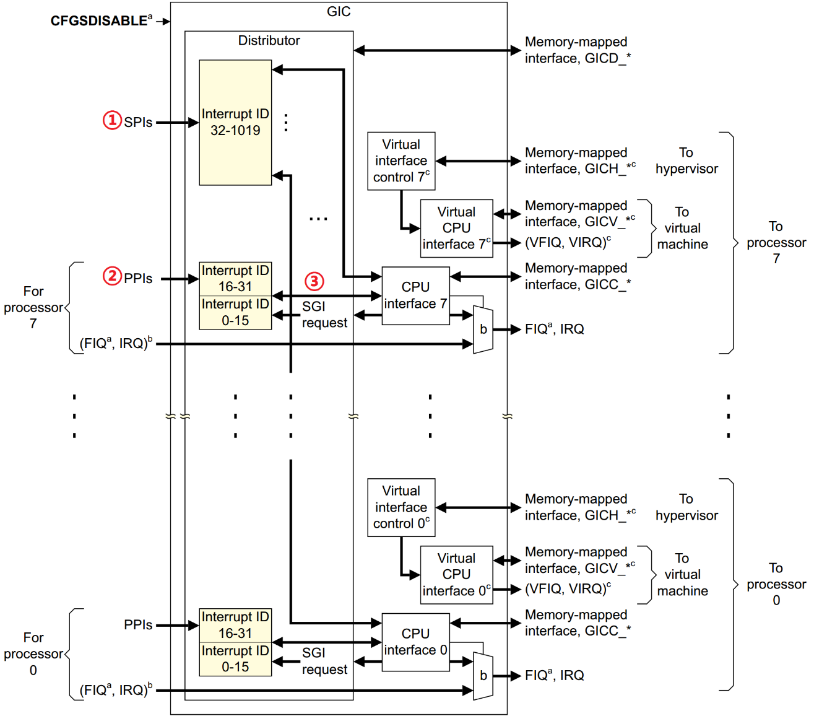

1. SPI(Shared Peripheral Interrupt),共享中断，顾名思义，所有 Core共享的中断，这个是最
常见的，那些外部中断都属于 SPI中断 (注意！不是 SPI总线那个中断 ) 。比如按键中断、串口
中断等等，这些中断所有的 Core都可以处理，不限定特定 Core。
2. PPI(Private Peripheral Interrupt)，私有中断，我们说了 GIC是支持多核的，每个核肯定
有自己独有的中断。这些独有的中断肯定是要指 定的核心处理，因此这些中断就叫做私有中断。
3. SGI(Software-generated Interrupt)，软件中断，由软件触发引起的中断，通过向寄存器
GICD_SGIR写入数据来触发，系统会使用 SGI中断来完成多核之间的通信。

### 中断ID
中断源有很多，为了区分这些不同的中断源肯定要给他们分配一个唯一 ID，这些ID就是
中断ID。每一个CPU最多支持 1020个中断 ID，中断ID号为 ID0~ID1019。这1020个ID包
含了PPI、SPI和SGI，那么这三类中断是如何分配这 1020个中断 ID的呢？这 1020个ID分
配如下：
- ID0~ID15：这 16个 ID分配给 SGI。
- ID16~ID31：这 16个 ID分配给 PPI。
- ID32~ID1019：这 988个 ID分配给 SPI，像 GPIO中断、串口中断等这些外部中断

至于具体到某个ID对应哪个中断那 就由半导体厂商根据实际情况去定义了。比如 I.MX6U的总共
使用了128个中断 ID，加上前面属于 PPI和 SGI的 32个ID I.MX6U的中断源共有 128+32=160个.
这128个中断ID对应的中断在《 I.MX6ULL参考手册》的[3.2 Cortex A7 interrupts]有定义,
限于篇幅原因，摘部分如下。
```c
#define NUMBER_OF_INT_VECTORS 160 /* 中断源160个，SGI+PPI+SPI*/
typedef enum IRQn {
	/* Auxiliary constants */
	NotAvail_IRQn = -128,
	/* Core interrupts */
	Software0_IRQn = 0,
	Software1_IRQn = 1,
	Software2_IRQn = 2,
	Software3_IRQn = 3,
	Software4_IRQn = 4,
	Software5_IRQn = 5,
	Software6_IRQn = 6,
	Software7_IRQn = 7,
	Software8_IRQn = 8,
	Software9_IRQn = 9,
	Software10_IRQn = 10,
	Software11_IRQn = 11,
	Software12_IRQn = 12,
	Software13_IRQn = 13,
	Software14_IRQn = 14,
	Software15_IRQn = 15,
	VirtualMaintenance_IRQn = 25,
	HypervisorTimer_IRQn = 26,
	VirtualTimer_IRQn = 27,
	LegacyFastInt_IRQn = 28,
	SecurePhyTimer_IRQn = 29,
	NonSecurePhyTimer_IRQn = 30,
	LegacyIRQ_IRQn = 31,
	/* Device specific interrupts */
	IOMUXC_IRQn = 32,
	DAP_IRQn = 33,
	SDMA_IRQn = 34,
	TSC_IRQn = 35,
	SNVS_IRQn = 36,
	...... ......
	ENET2_1588_IRQn = 153,
	Reserved154_IRQn = 154,
	Reserved155_IRQn = 155,
	Reserved156_IRQn = 156,
	Reserved157_IRQn = 157,
	Reserved158_IRQn = 158,
	PMU_IRQ2_IRQn = 159
}IRQn_Type;
```

### linux中断常用API函数
#### 申请中断
```c
/*
* 
* @irq：要申请中断的中断号。
* @handler：中断处理函数，当中断发生以后就会执行此中断处理函数。
* @flags  ：中断标志，可以在文件include/linux/interrupt.h里面查看定义
* @name   ：中断名字，设置以后可以在 /proc/interrupts文件中看到对应的中断名字。
* @dev    ：如果将 flags设置为 IRQF_SHARED的话，dev用来区分不同的中断，一般情况下将dev设置为设备结构体，
*           dev会传递给中断处理函数 irq_handler_t的第二个参数。
* @return ：返回值：0 中断申请成功，其他负值 中断申请失败，如果返回 -EBUSY的话表示中断已经被申请了
*/
int request_irq(unsigned int irq, irq_handler_t handler, unsigned long flags, const char *name, void *dev)
```
flags 参数常用的一些如下：
| 标志                 | 描述                                                         |
| -------------------- | ------------------------------------------------------------ |
| IRQF_SHARED          | 多个设备共享一个中断线，如果使用共享中断的话，dev参数就是唯一区分他们的标志 |
| IRQF_ONESHOT         | 单次中断，中断执行一次就 结束                                |
| IRQF_TRIGGER_NONE    | 无触发                                                       |
| IRQF_TRIGGER_RISING  | 上升沿触发                                                   |
| IRQF_TRIGGER_FALLING | 下降沿触发                                                   |
| IRQF_TRIGGER_HIGH    | 高电平 触发                                                  |
| IRQF_TRIGGER_LOW     | 低电平触发                                                   |

#### 释放中断
```c
/*
* 
* @irq：要释放中断的中断号。
* @dev    ：如果将 flags设置为 IRQF_SHARED的话，dev用来区分不同的中断，共享中断只有在释放最后中断处理函数的时候才会被禁止掉。
*           dev会传递给中断处理函数 irq_handler_t的第二个参数。
*/
void free_irq(unsigned int irq, void *dev)
```
#### 中断处理函数
```c
irqreturn_t (*irq_handler_t) (int, void *)
//返回值如下：
enum irqreturn {
	IRQ_NONE = (0 << 0),
	IRQ_HANDLED = (1 << 0),
	IRQ_WAKE_THREAD = (1 << 1),
};
typedef enum irqreturn irqreturn_t;

//可以看出irqreturn_t是个枚举类型，一共有三种返回值。一般中断服务函数返回值使用如下形式：
return IRQ_RETVAL(IRQ_HANDLED)

```

#### 中断使能与禁止函数
```c
void enable_irq(unsigned int irq) 
void disable_irq(unsigned int irq) 
```
注意 ：函数要等到当前正在执行的中断处理函数执行完才返回，因此使用者需要保证不会产生新的中
断，并且确保所有已经开始执行的中断处理程序已经全部退出。在这种情况下，可以使用另外
一个中断禁止函数：
```c
void disable_irq_nosync(unsigned int irq) // 立即返回
```
关闭使能整个中断系统
```c
local_irq_enable() 
local_irq_disable()
local_irq_save(flags) 
local_irq_restore(flags)
```

#### 中断上下半部

1. 如果要处理的内容不希望被其他中断打断，那么可以放到上半部；
2. 如果要处理的任务对时间敏感，可以放到上半部；
3. 如果要处理的任务与硬件有关，可以放到上半部；
4. 除了上述三点以外的其他任务，优先考虑放到下半部。

上半部处理很简单，直接编写中断处理函数就行了，关键是下半部该怎么做呢？

##### 下半部处理机制

###### 软中断
```c
/* 体定义在文件 include/linux/interrupt.h中，内容如下*/
struct softirq_action
{
	void (*action)(struct softirq_action *);
};
/*在 kernel/softirq.c文件中一共定义了 10个软中断，如下所示：*/
static struct softirq_action softirq_vec[NR_SOFTIRQS];
 
/*NR_SOFTIRQS是枚举类型，定义在文件 include/linux/interrupt.h中，定义如下：*/
enum { 
    HI_SOFTIRQ=0, 		/* 高优先级软中断 */ 
	TIMER_SOFTIRQ, 		/* 定时器软中断 */ 
	NET_TX_SOFTIRQ, 	/* 网络数据发送软中断 */ 
	NET_RX_SOFTIRQ, 	/* 网络数据接收软中断 */ 
	BLOCK_SOFTIRQ, 
	BLOCK_IOPOLL_SOFTIRQ, 
	TASKLET_SOFTIRQ, 	/* tasklet软中断 */ 
	SCHED_SOFTIRQ, 		/* 调度软中断 */ 
	HRTIMER_SOFTIRQ, 	/* 高精度定时器软中断 */ 
	RCU_SOFTIRQ, 		/* RCU软中断 */ 
	NR_SOFTIRQS 
};
```
注册对应的软中断处理函数

```c
/*
* @nr：    要开启的软中断类型 上面的枚举中选一个
* @action：软中断对应的处理函数。
*/
void open_softirq(int nr, void (*action)(struct softirq_action *))
```

函数触发 

```
void raise_softirq(unsigned int nr)
```

注意：软中断必须在编译的时候静态注册


###### tasklet(小任务)
tasklet是利用软中断来实现的另外一种下半部机制，在软中断和 tasklet之间，建议大家使用tasklet
linux中关于tasklet的定义
```c
struct tasklet_struct
{
	struct tasklet_struct *next; 	/* 下一个tasklet */
	unsigned long state; 			/* tasklet状态 */
	atomic_t count; 				/* 计数器，记录对tasklet的引用数 */
	void (*func)(unsigned long); 	/* tasklet执行的函数需要用户自己定义 */
	unsigned long data; 			/* 函数func的参数 */
};
```
初始化函数

```
/*
*@t：要初始化的 tasklet
*@func: tasklet的处理函数用户定义好后传入函数指针即可
*@data: 要传递给 func函数的参数
*/

void tasklet_init(struct tasklet_struct *t,void (*func)(unsigned long), unsigned long data);
也可以使用宏一次完成定义和初始化
定义在 include/linux/interrupt.h
DECLARE_TASKLET(name, func, data)
/*
*@t：要调度的 tasklet，也就是 DECLARE_TASKLET宏里面的 name
*/
void tasklet_schedule(struct tasklet_struct *t)
```

使用示例
```c
/* 定义taselet */ 
struct tasklet_struct testtasklet; 
/* tasklet处理函数 */ 
void testtasklet_func(unsigned long data) 
{ 
	/* tasklet具体处理内容 */ 
} 
/* 中断处理函数 */ 
irqreturn_t test_handler(int irq, void *dev_id) 
{ 
	...... 
	/* 调度tasklet */ 
	tasklet_schedule(&testtasklet);  /*让testtasklet在合适的时机引起调度*/
	...... 
} 
/* 驱动入口函数 */ 
static int __init xxxx_init(void) 
{ 
	...... 
	/* 初始化tasklet */
	tasklet_init(&testtasklet, testtasklet_func, data); /* 注册中断处理函数 */ 
	request_irq(xxx_irq, test_handler, 0, "xxx", &xxx_dev); 
	...... 
}
```
###### work queue工作队列
工作队列是另外一种下半部执行方式，工作队列在进程上下文执行，工作队列将要推后的工作交给一个内核线程去执行，因为工作队列工作在进程上下文，因此工作队列允许睡眠或重新调度。因此如果你要推后的工作可以睡眠那么就可以选择工作队列，否则的话就只能选择软中断或tasklet
linux中work_struct结构体表示一个工作，内容如下

```c
struct work_struct { 
	atomic_long_t data; 
	struct list_head entry; 
	work_func_t func; /* 工作队列处理函数 */ 
};
```
这些工作组织成工作队列，工作队列使用 workqueue_struct结构体表示，内容如下
```c
struct workqueue_struct { 
	struct list_head pwqs; 
	struct list_head list; 
	struct mutex mutex; 
	int work_color; 
	int flush_color; 
	atomic_t nr_pwqs_to_flush; 
	struct wq_flusher *first_flusher; 
	struct list_head flusher_queue; 
	struct list_head flusher_overflow; 
	struct list_head maydays; 
	struct worker *rescuer; 
	int nr_drainers; 
	int saved_max_active; 
	struct workqueue_attrs *unbound_attrs; 
	struct pool_workqueue *dfl_pwq; 
	char name[WQ_NAME_LEN]; 
	struct rcu_head rcu; 
	unsigned int flags ____cacheline_aligned; 
	struct pool_workqueue __percpu *cpu_pwqs; 
	struct pool_workqueue __rcu *numa_pwq_tbl[]; 
};
```

Linux内核使用工作者线程 (worker thread)来处理工作队列中的各个工作， Linux内核使用worker结构体表示工作者线程， worker结构体内容如下：
```c
struct worker { 
	union { 
		struct list_head entry; 
		struct hlist_node hentry; 
	}; 
	struct work_struct *current_work; work_func_t current_func; 
	struct pool_workqueue *current_pwq; 
	bool desc_valid; 
	struct list_head scheduled; 
	struct task_struct *task; 
	struct worker_pool *pool; 
	struct list_head node; 
	unsigned long last_active; 
	unsigned int flags; 
	int id; 
	char desc[WORKER_DESC_LEN]; 
	struct workqueue_struct *rescue_wq; 
};
```
可以看出，每个worker都有一个工作队列，工作者线程处理自己工作队列中的所有工作。在实际的驱动开发中，我们只需要定义工作 (work_struct)即可，关于工作队列和工作者线程我们基本不用去管。初始化一个工作
```c
/*
*@_work: 自己定义的 work_struct
*@_func: 处理函数 需要用户自己定义
*/
#define INIT_WORK(_work, _func)
```
或者直接使用宏一次性完成定义和初始化

```c
/*
*@n: 自己定义的 work_struct
*@f: 处理函数 需要用户自己定义
*/
#define DECLARE_WORK(n, f)
```

和 tasklet一样，工作也是需要调度才能运行的，工作的调度函数为 schedule_work，函数原型如下所示：
bool schedule_work(struct work_struct *work)

使用示例代码
```c
/* 定义工作(work) */ 
struct work_struct testwork; 
/* work处理函数 */
void testwork_func_t(struct work_struct *work); 
{ 
	/* work具体处理内容 */ 
} 
/* 中断处理函数 */ 
irqreturn_t test_handler(int irq, void *dev_id) 
{ 
	...... 
	/* 调度work */ 
	schedule_work(&testwork); 
	...... 
} 
/* 驱动入口函数 */ 
static int __init xxxx_init(void) 
{ 
	...... 
	/* 初始化work */ 
	INIT_WORK(&testwork, testwork_func_t); 
	/* 注册中断处理函数 */ 
	request_irq(xxx_irq, test_handler, 0, "xxx", &xxx_dev); 
	...... 
}
```
###### 新技术threaded irq
```c
/*
*@irq: 中断号
*@handler:  中断服务函数，可以为空
*@thread_fn：线程函数
*@flags：
*@name：
*@dev：
*/
extern __must_check
request_threaded_irq(unsigned int irq, irq_handler_t handler,irq_handler_t thread_fn, unsigned long flags, const char *name ,void *dev)
```


你可以只提供thread_fn ，系统会为这个函数创建一个内核线程。发生中断时，内核线程就会执行这个函数。
说你懒是开玩笑，内核开发者也不会那么在乎懒人。
以前用 work 来线程化地处理中断，一个 worker 线程只能由一个 CPU 执行，多个中断的 work 都由同一个worker 线程来处理，
在单 CPU 系统中也只能忍着了。但是在 SMP 系统中，明明有那么多CPU 空着，你偏偏让多个中断挤在这个 CPU 上？
新技术threaded irq ，为每一个中断都创建一个内核线程；多个中断的内核线程可以分配到多个 CPU上执行，这提高了效率。

### 设备树对中断解析
```c
imx6ull.dtsi文件，其中的intc就是中断控制器节点
intc: interrupt-controller@00a01000 {
	compatible = "arm,cortex-a7-gic";/* 可以通过该属性在内核里面找到GIC控制器驱动代码 */
	#interrupt-cells = <3>;
	interrupt-controller;            /* 节点为空，表示当前节点是中断控制器 */
	reg = <0x00a01000 0x1000>,
	<0x00a02000 0x100>;
};

第一个 cells：中断类型，0表示 SPI中断，1表示 PPI中断。
第二个 cells：中断号，对 于SPI中断来说中断号的范围为 0~987，对于 PPI中断来说中断号的范围为 0~15
第三个 cells：标志 
			bit[3:0]表示中断触发类型，  
				1的时候表示上升沿触发
				2的时候表示下降沿触发
				4的时候表示高电平触发 
				8的时候表示低电平触发
              bit[15:8]为 PPI中断的CPU掩码。

```

对于gpio来说，gpio节点也可以作为中断控制器，比如 imx6ull.dtsi文件中的 gpio5节点内容如下所示：
```c
gpio5: gpio@020ac000 {
	compatible = "fsl,imx6ul-gpio", "fsl,imx35-gpio";
	reg = <0x020ac000 0x4000>;
	interrupts = <GIC_SPI 74 IRQ_TYPE_LEVEL_HIGH>,
				 <GIC_SPI 75 IRQ_TYPE_LEVEL_HIGH>;
	gpio-controller;
	#gpio-cells = <2>;
	interrupt-controller;   //表明了 gpio5节点也是个中断控制器用于控制gpio5所有IO的中断
	#interrupt-cells = <2>; //interrupt-cells修改为2
};
```
GPIO5一共用了2个中断号，一个是74，一个是75。可以打开《 IMX6ULL参考手册》的【Chapter 3 Interrupts and DMA Events】章节，
找到表3-1可以确定

```c
74对应 GPIO5_IO00~GPIO5_IO15 这低 16个 IO 
75对应 GPIO5_IO16~GPIOI5_IO31这高 16位 IO 
```

在imx6ull-alientek-emmc.dts文件，我们又可以发现：
``` c
fxls8471@1e {
	compatible = "fsl,fxls8471";
	reg = <0x1e>;
	position = <0>;
	interrupt-parent = <&gpio5>; //设置中断控制器，这里使用 gpio5作为中断控制器。
	interrupts = <0 8>;          //0表示 GPIO5_IO00  8表示低电平触发。
};
```
xls8471是 NXP官方的 6ULL开发板上的一个磁力计芯片，fxls8471有一个中断引脚链接到了I.MX6ULL的 SNVS_TAMPER0因脚上，这个引脚可以复用为GPIO5_IO00所以当我们在fxls8471驱动代码里面就可以得到中断控制的所有信息找到中断号

```c
/*
*@dev   : 设备节点。
*@index : 索引号 interrupts属性可能包含多条中断信息，通过 index指定要获取的信息。
*@return：中断号
*/
unsigned int irq_of_parse_and_map(struct device_node *dev, int index)

如果是GPIO中断，可以使用下面函数来获取 gpio对应的中断号，函数原型如
/*
*@gpio   : 要获取GPIO编号。
*@return：GPIO对应中断号
*/
int gpio_to_irq(unsigned int gpio)
```

#### 其它的外设驱动代码获取中断的情况
之前我们提到过，设备树中的节点有些能被转换为内核里的platform_device有些不能转换（转换规则请参考前面章节），
##### 对于能转换为platform_device的获取方式
```c
/*
* platform_get_resource get a resource for a device
@dev: platform device
@type: resource type // 取哪类资源？ IORESOURCE_MEM 、 IORESOURCE_REG、IORESOURCE_IRQ 等
@num: resource inde x // 这类资源中的哪一个？
*/
struct resource *platform_get_resource(struct platform_device *dev,unsigned int type, unsigned int num);
```


##### 对于I2C 设备节点
I2C总线驱动在处理设备树里的I2C子节点时，也会处理其中的中断信息。一个I2C 设备会被转换为一个 i2c_client 结构体，中断号会保存在 i2c_client 的 irq 成员里，代码如下
drivers/i2c/i2c core.c

对于SPI 设备节点

##### SPI总线驱动在处理设备树里的 SPI子节点时，也会处理其中的中断信息。
一个SPI 设备会被转换为一个 spi_device 结构体，中断号会保存在 spi_device 的 irq 成员里，代码如下
drivers/spi/spi.c
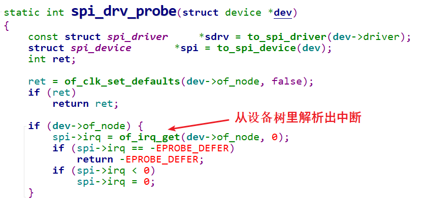

##### 调用 of_irq_get 获得中断号
如果你的设备节点既不能转换为platform_device ，它也不是 I2C 设备，不是 SPI 设备，那么在驱动程
序中可以自行调用 of_irq_get 函数去解析设备树，得到中断号。
##### 对于GPIO
参考：drivers input keyboard gpio_keys.c,可以使用gpio_to_irq 或 gpiod_irq 获得中断号。
举例，假设在设备树中有如下节点：

```c
gpio-keys {
	compatible    = "gpio keys";
	pinctrl-names = "default";
	user{
		label = "User Button";
		gpios = <&gpio5 1 GPIO_ACTIVE_HIGH>;
		gpio-key,wakeup;
		linux,code = <KEY_1>;
	};
};
```
那么可以使用下面的函数获得引脚和 flags
```c
button->gpio = of_get_gpio_flags(pp, 0, &flags);
bdata->gpiod = gpio_to_desc(button->gpio);
```
再去使用gpiod_to_irq 获得中断号：
```c
irq = gpiod_to_irq(bdata ->gpiod);
```

