# LittlevGL基础控件学习

## lv移植相关

### lv绘制过程

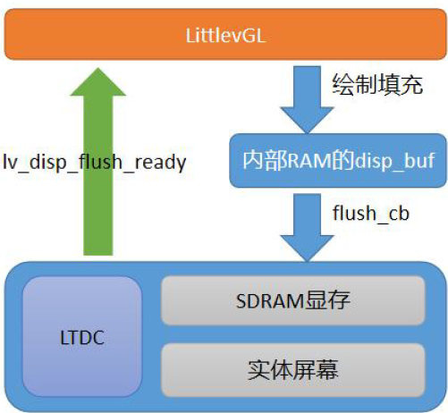

如上图所示，数据会先填充到内部RAM中`disp_buf`，调用`flush_cb`函数，填到不通的屏幕接口，例如mcu屏幕，里面调用mcu打点函数即可,如果支持DMA2D，可以用DMA搬运到SDRAM，如果是framebuf，最后调用`lv_disp_flush_ready`函数通知lv库绘制完成，可以开始其他绘制了。所以我们移植的时候需要定义一个在RAM中的`disp_buf`缓存区和实现`flush_cb`函数。

```c
static lv_disp_buf_t disp_buf1;										//定义缓存区
static lv_color_t buf1_1[LV_HOR_RES_MAX * 120];
lv_disp_buf_init(&disp_buf1, buf1_1, NULL, LV_HOR_RES_MAX * 120);	//初始化缓存区
    
lv_disp_drv_t   disp_drv;											//定义显示设备
lv_disp_drv_init(&disp_drv);             							//初始化显示设备
    -》driver->flush_cb         = NULL;
    -》driver->hor_res          = LV_HOR_RES_MAX; //初始化屏幕大小
    -》driver->ver_res          = LV_VER_RES_MAX;
/*
 * 这里把刚刚定义的disp_buf1缓存首地址赋值给disp_drv.buffer，
 * 且初始化刷新函数 disp_drv.flush_cb = monitor_flush
 */
disp_drv.buffer   = &disp_buf1;    // 显示设备得到缓存地址
disp_drv.flush_cb = monitor_flush; // 刷新函数注册
lv_disp_drv_register(&disp_drv);   
```

下面我们要自己实现刷新函数`monitor_flush`

```c
/*
* area 参数定义了本次刷新的位置和区域，color_p 参数定义了本次刷新的所需要的缓冲区
*/
void monitor_flush(lv_disp_drv_t * disp_drv, const lv_area_t * area, lv_color_t * color_p)
{
    // 第一种方式 如果是framebuf,可以参考下面的
    uint32_t w = lv_area_get_width(area);
    uint32_t *fbp32 = (uint32_t*) info.framebuffer;                 // 得到framebuf地址
    for (y = area->y1; y <= area->y2 && y < disp_drv->ver_res; y++) // 填充数据
    {
        memcpy(&fbp32[y * info.width + area->x1], color_p, w * sizeof(lv_color_t));
        color_p += w;
    }
    lv_disp_flush_ready(disp_drv);
    
    
   //第二种方式 如果是打点,可以参考下面的
    int32_t x;
    int32_t y;
    for(y = area->y1; y <= area->y2; y++) {
    	for(x = area->x1; x <= area->x2; x++) {
    		/* Put a pixel to the display. For example: */
    		/* put_px(x, y, *color_p)*/
    		color_p++;
    	}
    }
	lv_disp_flush_ready(disp_drv);
	
   //第三种方式 如果支持DMA2D,可以参考下面的，和硬件有很大关系
    DMA2D->FGMAR = (uint32_t)color_p; //源地址
    DMA2D->FGOR = 0; 
    DMA2D->OOR = offline;
    /* Set up pixel format */
    DMA2D->FGPFCCR = LTDC_PIXEL_FORMAT_RGB565;  
    DMA2D->CR |= (1 << 0); 
    /* Wait until transfer is done */
    while (DMA2D->CR & DMA2D_CR_START)
    {
    if(time_out++ >= 0XFFFFFFFF)break;
    }
 
    lv_disp_flush_ready(disp_drv);
   
}
```

### 输入设备

lv本身支持键盘、按键、触摸屏、鼠标作为输入设备。

1. 键盘

```c
   lv_indev_drv_t kb_drv;
   lv_indev_drv_init(&kb_drv);
   kb_drv.type = LV_INDEV_TYPE_KEYPAD;			// 键盘类型
   kb_drv.read_cb = keyboard_read;				// 需要用户自己实现的接口函数
   kb_indev = lv_indev_drv_register(&kb_drv);
```

   读取键盘数据的函数

```c
   static uint32_t         last_key;
   static lv_indev_state_t state;
   
   /*
   *  data 用来存放键盘数据
   */
   bool keyboard_read(lv_indev_drv_t * indev_drv, lv_indev_data_t * data)
   {
       (void) indev_drv;      /*Unused*/
       data->state = state;
       data->key = keycode_to_ascii(last_key);
   
       return false;
   }
   
   
   这个函数是键盘有事件了自动调用的处理函数，在这里面更新last_key和state
   void keyboard_handler(SDL_Event * event)
   {
       /* We only care about SDL_KEYDOWN and SDL_KEYUP events */
       switch(event->type) {
           case SDL_KEYDOWN:                       /*Button press*/
               last_key = event->key.keysym.sym;   /*Save the pressed key*/
               state = LV_INDEV_STATE_PR;          /*Save the key is pressed now*/
               break;
           case SDL_KEYUP:                         /*Button release*/
               state = LV_INDEV_STATE_REL;         /*Save the key is released but keep the last key*/
               break;
           default:
               break;
   
       }
   }
   这个函数根据传入参数last_key(键盘的数据)，转换为lv库的键值
   static uint32_t keycode_to_ascii(uint32_t sdl_key)
   {
       /*Remap some key to LV_KEY_... to manage groups*/
       switch(sdl_key) {
           case SDLK_RIGHT:
           case SDLK_KP_PLUS:
               return LV_KEY_RIGHT;
   
           case SDLK_LEFT:
           case SDLK_KP_MINUS:
               return LV_KEY_LEFT;
   
           case SDLK_UP:
               return LV_KEY_UP;
   
           case SDLK_DOWN:
               return LV_KEY_DOWN;
   
           case SDLK_ESCAPE:
               return LV_KEY_ESC;
   
   #ifdef  LV_KEY_BACKSPACE        /*For backward compatibility*/
           case SDLK_BACKSPACE:
               return LV_KEY_BACKSPACE;
   #endif
   
   #ifdef  LV_KEY_DEL        /*For backward compatibility*/
           case SDLK_DELETE:
               return LV_KEY_DEL;
   #endif
           case SDLK_KP_ENTER:
           case '\r':
               return LV_KEY_ENTER;
   
           default:
               return sdl_key;
       }
   }
   #endif
```

   

2. 鼠标

```c
   lv_indev_drv_t indev_drv;
   lv_indev_drv_init(&indev_drv);          
   indev_drv.type = LV_INDEV_TYPE_POINTER;		// 点类型
   indev_drv.read_cb = mouse_read;      		// 需要用户自己实现的接口函数
   lv_indev_drv_register(&indev_drv);
```

   读取鼠标数据函数

```c
   static bool left_button_down = false;
   static int16_t last_x = 0;
   static int16_t last_y = 0;
   /*
   *  data 用来存放鼠标数据
   */
   bool mouse_read(lv_indev_drv_t * indev_drv, lv_indev_data_t * data)
   {
       (void) indev_drv;      /*Unused*/
   
       /*Store the collected data*/
       data->point.x = last_x;
       data->point.y = last_y;
       data->state = left_button_down ? LV_INDEV_STATE_PR : LV_INDEV_STATE_REL;
   
       return false;
   }
   
   
   这个函数系有鼠标事件的时候系统自动调用的，在里面更新last_x last_y
   void mouse_handler(SDL_Event * event)
   {
       switch(event->type) {
           case SDL_MOUSEBUTTONUP:
               if(event->button.button == SDL_BUTTON_LEFT)
                   left_button_down = false;
               break;
           case SDL_MOUSEBUTTONDOWN:
               if(event->button.button == SDL_BUTTON_LEFT) {
                   left_button_down = true;
                   last_x = event->motion.x / MONITOR_ZOOM;
                   last_y = event->motion.y / MONITOR_ZOOM;
               }
               break;
           case SDL_MOUSEMOTION:
               last_x = event->motion.x / MONITOR_ZOOM;
               last_y = event->motion.y / MONITOR_ZOOM;
               break;
   
           case SDL_FINGERUP:
               left_button_down = false;
               last_x = LV_HOR_RES * event->tfinger.x / MONITOR_ZOOM;
               last_y = LV_VER_RES * event->tfinger.y / MONITOR_ZOOM;
               break;
           case SDL_FINGERDOWN:
               left_button_down = true;
               last_x = LV_HOR_RES * event->tfinger.x / MONITOR_ZOOM;
               last_y = LV_VER_RES * event->tfinger.y / MONITOR_ZOOM;
               break;
           case SDL_FINGERMOTION:
               last_x = LV_HOR_RES * event->tfinger.x / MONITOR_ZOOM;
               last_y = LV_VER_RES * event->tfinger.y / MONITOR_ZOOM;
               break;
       }
   
   }
```

   

3. 触摸屏

```c
   lv_indev_drv_init(&indev_drv);
   indev_drv.type = LV_INDEV_TYPE_POINTER;		// 点类型
   indev_drv.read_cb = touchpad_read;			// 需要用户自己实现的接口函数
   indev_touchpad = lv_indev_drv_register(&indev_drv);
```

   读取触摸屏函数

```c
   static bool touchpad_read(lv_indev_drv_t * indev_drv, lv_indev_data_t * data)
   {
       static lv_coord_t last_x = 0;
       static lv_coord_t last_y = 0;
       /*Save the pressed coordinates and the state*/
       if(touchpad_is_pressed()) {
           touchpad_get_xy(&last_x, &last_y);
           data->state = LV_INDEV_STATE_PR;
       } else {
       	data->state = LV_INDEV_STATE_REL;
       }
       /*Set the last pressed coordinates*/
       data->point.x = last_x;
       data->point.y = last_y;
       /*Return `false` because we are not buffering and no more data to read*/
       return false;
   }
   
   1、touchpad_is_pressed()					//读取触摸屏是否被按下，按下返回
   2、touchpad_get_xy(&last_x, &last_y)		//读取坐标
       
   static bool touchpad_is_pressed(void)
   {
       /*Your code comes here*/
       if(gt9147_is_pressed() == 1){
       	gt9147_clear_pressed();
       	return true;
       }
       return false;
   }
   
   
   static void touchpad_get_xy(lv_coord_t * x, lv_coord_t * y)
   {
       /*Your code comes here*/
       static GT9147_PointTypeDef lv_point = {0};
       if(gt9147_scan(&lv_point) == 1){
       	(*x) = lv_point.x[0];
       	(*y) = lv_point.y[0];
       }
   }
```

   ### 滴答心跳

   LittlevGL 的使用需要需要周期性的时钟支持，用户需要定期调用`lv_tick_inc(uint32_t tick_period)`函数.

```c
在单片机里面可以利用滴答定时器的1KHz 去调用这个函数。在滴答定时器的中断服务函数中添加lvgl 时基函数
void SysTick_Handler(void)
{
    /* enter interrupt */
    rt_interrupt_enter();
    /* tick for HAL Library */
    HAL_IncTick();
    lv_tick_inc(1);								// lvgl 时基函数
    rt_tick_increase();
    /* leave interrupt */
    rt_interrupt_leave();
}
在系统里面可以用个线程去调用，确保lv_tick_inc();被周期性调用即可。
static int tick_thread(void *data)
{
    while (1) {
        lv_tick_inc(5);
        SDL_Delay(5);     /*Sleep for 1 millisecond*/
    }

    return 0;
}    
```

### 初始化

```c
int main(int argc, char** argv)
{
  lv_init(); // 初始化，这里面会初始化lv库的链表、内存、数据结构管理等系统内部的东西
  /*
   *  把刚才说的那些回调函数的注册可以放到这里来调用，例如
   */
   // 1. 缓存和显示设备绑定相关
    static lv_disp_buf_t disp_buf1;
    static lv_color_t buf1_1[LV_HOR_RES_MAX * 120];
    lv_disp_buf_init(&disp_buf1, buf1_1, NULL, LV_HOR_RES_MAX * 120);

    lv_disp_drv_t disp_drv;
    lv_disp_drv_init(&disp_drv);            /*Basic initialization*/
    disp_drv.buffer = &disp_buf1;
    disp_drv.flush_cb = monitor_flush;
    lv_disp_drv_register(&disp_drv);

   // 2. 鼠标绑定相关
    mouse_init();
    lv_indev_drv_t indev_drv;
    lv_indev_drv_init(&indev_drv);          /*Basic initialization*/
    indev_drv.type = LV_INDEV_TYPE_POINTER;
    indev_drv.read_cb = mouse_read;       
    lv_indev_drv_register(&indev_drv);

	// 3. 键盘绑定相关
#if USE_KEYBOARD
    lv_indev_drv_t kb_drv;
    lv_indev_drv_init(&kb_drv);
    kb_drv.type = LV_INDEV_TYPE_KEYPAD;
    kb_drv.read_cb = keyboard_read;
    kb_indev = lv_indev_drv_register(&kb_drv);
#endif

  while(1){
  	lv_task_handler();  // 开启lv调度
   	Sleep(10);
  }

}
```

## lv特性

### 对象机制

对象表现为父子关系，父对象就像个容器，子对象在父对象里面，每个子对象只能有一个父对象，但是一个父对象可以有很多个子对象，当父对象移动的时候，子对象跟着一起移动，当子对象移动超出父对象范围的时候，是不显示超出的部分的，一个父对象的所有子对象拥有其父亲的属性，但是每个子对象又有自己的特有属性。
在LittlevGL 中，可以在运行时动态创建和删除对象。这意味着仅当前创建的对象消耗RAM。例如，如果需要图表，则可以在需要时创建它，并在不可见或不必要时将其删除。

- 创建对象

```c
  /*
   *@par1 :parent 指向父对象的指针
   *@可选 ：copy （可选）用于复制具有相同类型的对象的指针。该复制对象可以为NULL，以避免复制操作
   */
  lv_obj_t * lv_xxx_create(lv_obj_t * parent, const lv_obj_t * copy);
```

- 立即删除对象

```c
  void lv_obj_del(lv_obj_t * obj);
```

- 如果出于某种原因不能立即删除该对象，则可以用，例如要在子对象的LV_EVENT_DELETE 信号里面删除它的父对象

```c
  lv_obj_del_async(obj)
```

- 删除对象的所有子对象，但删除对象本身

```c
  void lv_obj_clean(lv_obj_t * obj);
```

对象的基本属性

```c
lv_obj_set_pos(btn, 10, 10); 				/* 设置控件的位置*/
lv_obj_set_size(btn, 100, 100); 			/* 设置控件的大小*/
lv_obj_set_event_cb(btn, my_event_cb); 		/* 设置控件的事件回调函数*/
```

对象的特有属性

```c
每个对象都有特有的属性api控制，以按钮为例
lv_btn_set_state(btn,LV_BTN_STATE_PR);	/* 设置按钮状态 按下或者释放*/
lv_btn_set_toggle(btn,true);			/* 设置按钮切换状态*/
lv_btn_set_fit(btn, LV_FIT_NONE);		/* 设置按钮四周边框的绘制策略为无边框 */
```


#### 屏幕对象

屏幕对象是库初始化的时候就会存在的一个特殊对象，可以理解为顶级父对象，所有控件在创建的时候都可以作为其子对象，在创建控件的时候，往往会先获取当前屏幕，然后将屏幕作为其父对象。

```c
lv_obj_t *scr 	= lv_disp_get_scr_act(NULL); 	/* 获取当前屏幕*/
lv_obj_t *label = lv_label_create(scr, NULL); 	/* 创建label */
```

### 图层 Layer

默认情况下，先创建的对象会显示在底层，后创建的对象会显示在顶层。如下面的代码对应的图像

```c
lv_obj_t *scr = lv_disp_get_scr_act(NULL);				/* 获取当前屏幕 */

/*
* 在当前屏幕上创建两个按钮，按钮上分别显示back 和 front来模拟图层概念
*/
lv_obj_t *btn1		= lv_btn_create	 (scr, NULL);		/* 创建btn 控件*/
lv_obj_t *label1	= lv_label_create(btn1, NULL);		/* 创建label 控件*/
lv_label_set_text(label1, "back");						/* 设置文字*/
lv_obj_set_pos(btn1, 200, 10);							/* 设置坐标*/

lv_obj_t *btn2		= lv_btn_create	 (scr, NULL);		/* 创建btn 控件*/
lv_obj_t *label2	= lv_label_create(btn2, NULL);		/* 创建label 控件*/
lv_label_set_text(label2, "front");						/* 设置文字*/
lv_obj_set_pos(btn2, 260, 50);	
```

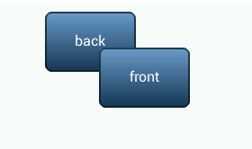

可见back在后面，front在前面。并且无论我们怎么点击back按钮，它始终都在front的后面，如果我们需要点击back按钮后，让它跑到前面该怎么操作？

#### 前后台

解决上节遗留问题，怎么实现点击back的时候，让它跑到front的前面，我们可以加一句`lv_obj_set_top(btn1,true);`让btn1成为前台，那么我们再次点击back的时候就发现它已经在front的前面，但是如果此时再次点击front的时候，发现front不会在back的前面，那么我们只需再添加个代码`lv_obj_set_top(btn2,true);`就会点击谁，谁在前面。这就是前后台的概念。

前后台api函数接口

- `lv_obj_set_top(obj,true)` 如果对象或者其子对象被点击，库会将该对象置于前台，工作方式类似与windows；
- `lv_obj_move_foreground(obj)` 将对象强制置于前台，该函数和`lv_obj_set_top(obj,true)`没有关系；
- `lv_obj_move_background(obj)` 将对象强制置于后台，该函数和`lv_obj_set_top(obj,true)`没有关系；
- `lv_obj_set_parent(obj, new_parent)` obj 将位于new_parent 的前台。

#### 顶层和系统层

LittlevGL 使用两个名为`layer_top` 和`layer_sys` 的特殊层，两者在显示器的所有屏幕上都是可见且通用的。`layer_top` 始终位于默认屏幕`(lv_scr_act())` 的顶部，`layer_sys` 则位于`layer_top` 的顶部。用户可以使用`layer_top` 来创建一些随处可见的内容，例如，菜单栏，对话框。如果启用了click 属性，layer_top 将吸收所用用户的点击并将其模态化。

```c
/*
* 在当前屏幕上创建两个按钮，按钮上分别显示back 和 front来模拟图层概念
*/
lv_obj_t *btn1		= lv_btn_create	 (scr, NULL);			/* 创建btn 控件*/
lv_obj_t *label1	= lv_label_create(btn1, NULL);		/* 创建label 控件*/
lv_label_set_text(label1, "back");						/* 设置文字*/
lv_obj_set_pos(btn1, 200, 10);							/* 设置坐标*/

lv_obj_t *btn2		= lv_btn_create	 (scr, NULL);			/* 创建btn 控件*/
lv_obj_t *label2	= lv_label_create(btn2, NULL);		/* 创建label 控件*/
lv_label_set_text(label2, "front");						/* 设置文字*/
lv_obj_set_pos(btn2, 260, 50);							/* 设置坐标*/


lv_obj_set_top(btn1, true);
lv_obj_set_top(btn2, true);

/*lv_obj_move_foreground(btn1);*/

lv_obj_set_click(lv_layer_top(), true);				  /* 启用后除了lv_layer_top 上的控件会响应输入设备，其他层的控件不会响应 */
lv_obj_t *btn3 = lv_btn_create(lv_layer_top(), NULL); /* 创建一个父对象为lv_layer_top 的按钮 */
lv_obj_t *label3 = lv_label_create(btn3, NULL);
lv_label_set_text(label3, "btn on top");
lv_obj_set_pos(btn3, 180, 60);
```

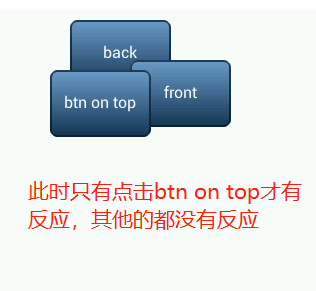

下面再看一个例子

```c
	/*
	 * 在当前屏幕上创建两个按钮，按钮上分别显示back 和 front来模拟图层概念
	 */
	lv_obj_t *btn1		= lv_btn_create	 (scr, NULL);			/* 创建btn 控件*/
	lv_obj_t *label1	= lv_label_create(btn1, NULL);		/* 创建label 控件*/
	lv_label_set_text(label1, "back");						/* 设置文字*/
	lv_obj_set_pos(btn1, 200, 10);							/* 设置坐标*/
	 
	lv_obj_t *btn2		= lv_btn_create	 (scr, NULL);			/* 创建btn 控件*/
	lv_obj_t *label2	= lv_label_create(btn2, NULL);		/* 创建label 控件*/
	lv_label_set_text(label2, "front");						/* 设置文字*/
	lv_obj_set_pos(btn2, 260, 50);							/* 设置坐标*/


	lv_obj_set_top(btn1, true);
	lv_obj_set_top(btn2, true);

	/*lv_obj_move_foreground(btn1);*/


	lv_obj_set_click(lv_layer_sys(), true);				  /* 启用后除了lv_layer_sys 上的控件会响应输入设备，其他层的控件不会响应 */
	lv_obj_t *btn4 = lv_btn_create(lv_layer_sys(), NULL); /* 创建一个父对象为lv_layer_sys 的按钮 */
	lv_obj_t *label4 = lv_label_create(btn4, NULL);
	lv_label_set_text(label4, "btn on sys");
	lv_obj_set_pos(btn4, 180, 80);
	 

	lv_obj_set_click(lv_layer_top(), true);				  /* 启用后除了lv_layer_top 上的控件会响应输入设备，其他层的控件不会响应 */
	lv_obj_t *btn3 = lv_btn_create(lv_layer_top(), NULL); /* 创建一个父对象为lv_layer_top 的按钮 */
	lv_obj_t *label3 = lv_label_create(btn3, NULL);
	lv_label_set_text(label3, "btn on top");
	lv_obj_set_pos(btn3, 180, 60);
```

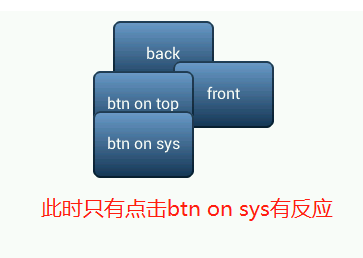

- 如果是下面代码的配置，那么只有btn on sys按钮能点击，其他按钮都不能点击。原因就是前面提到的`lv_layer_sys()`默认位于`lv_layer_top()`的前面，吸收了所有按键事件；

```c
  lv_obj_set_click(lv_layer_sys(), true);	
  lv_obj_set_click(lv_layer_top(), true);
```

- 如果是下面的代码配置，那么只有btn on sys按钮和btn on top按钮能点击，其他按钮都不能点击。原因是sys虽然默认在top上面，但是我们没有使能click事件，所以，sys没有吸收所有的按键事件，会往下下发到top层，但是top层却使能了click事件,所以top层会吸收掉按键事件，就不往下分发了，导致back和front按钮都不能被点击（接收不到点击事件）；

```c
  //lv_obj_set_click(lv_layer_sys(), true);	
  lv_obj_set_click(lv_layer_top(), true);
```

  

- 如果是下面代码的配置，那么只有btn on sys按钮能点击，其他按钮都不能点击。原因就是前面提到的`lv_layer_sys()`默认位于`lv_layer_top()`的前面，吸收了所有按键事件,和第一条完全一样

```c
  lv_obj_set_click(lv_layer_sys(), true);	
  //lv_obj_set_click(lv_layer_top(), true);
```

- 如果是下面代码的配置，那么所有按钮能点击，只是无论怎么点击，sys始终位于top前面，back和front始终位于top的后面，且back和front可以点击谁谁在前面(此时还是top的后面)，

```c
  //lv_obj_set_click(lv_layer_sys(), true);	
  //lv_obj_set_click(lv_layer_top(), true);
```

### 事件 Event

可以为对象创建事件的回调函数，当对象上发生某种事件的时候,会触发回调函数，我们在自己注册的回调函数里面可以根据事件类型，做出自己的处理代码。

```c
/**
* @brief 控件的事件回调函数
* @param obj-控件对象
* @param event-事件类型
* @retval None
* @note 该函数由用户注册,然后由系统调用
*/
static void my_event_cb(lv_obj_t * obj, lv_event_t event)
{
	switch (event) {
	case LV_EVENT_PRESSED:
	printf("pressed value:%d\n", lv_slider_get_value(obj)); // 当slider按下的时候触发该事件
	break;
	case LV_EVENT_VALUE_CHANGED:
	printf("change value:%d\n", lv_slider_get_value(obj));  // 当slider值拖动改变的时候触发该事件
	break;
	case LV_EVENT_RELEASED:
	printf("release value:%d\n", lv_slider_get_value(obj)); // 当slider释放按压的时候触发该事件
	break;
	default:
	break;
	}
}
void lv_event_demo()
{
	lv_obj_t *scr		= lv_disp_get_scr_act(NULL);				/* 获取当前屏幕 */
	lv_obj_t *slider1	= lv_slider_create(scr, NULL);				/* 创建一个slider 滑动控件*/
	lv_obj_set_event_cb(slider1, my_event_cb);						/* 为控件设置事件的回调函数*/
}

```

运行效果如下：

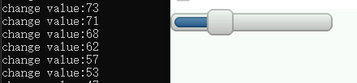

### 事件类型

#### 事件类型

```c
enum {
	/*
	 * 与输入设备有关的事件
	 */
	LV_EVENT_PRESSED,   	// 对象被按下
	LV_EVENT_PRESSING, 		// 对象被长事件按下
	LV_EVENT_PRESS_LOST,    // 对象被按下但是已经被移开到对象的外边
	LV_EVENT_SHORT_CLICKED, // 用户在短时间内按下对象然后释放，拖动不会触发
	LV_EVENT_LONG_PRESSED, 	// 长按超LV_INDEV_DEF_LONG_PRESS_TIME (但实际使用这个宏)并释放，拖动不会触发
	LV_EVENT_LONG_PRESSED_REPEAT,// 长按后的连续汇报事件，拖动则不触发，在长按超过LV_INDEV_DEF_LONG_PRESS_TIME 后每隔这个时间调用一次
	LV_EVENT_CLICKED, 			 // 如果没有拖动且释放了就触发（无论是否长按）
	LV_EVENT_RELEASED, 			 // 任何情况下对象释放了就触发
	/*
	 * 与指针相关事件，以下事件需要使能拖动后才会被触发
	 * lv_obj_set_drag(obj,true)
	 * lv_obj_set_drag_throw(obj,true)
	 */
	LV_EVENT_DRAG_BEGIN,		 //	开始拖动对象
	LV_EVENT_DRAG_END,           //	结束拖动对象（包括惯性拖动
	LV_EVENT_DRAG_THROW_BEGIN,	 // 开始控件的惯性拖动（就是使能drag_throw后，拖动控件然后松开鼠标，控件还会向前移动一段距离）
	
	/*
	 * 跟键盘和按键相关的事件
	 */
	LV_EVENT_KEY,				 // 将键值发送到对象
	LV_EVENT_FOCUSED,			 // 聚焦
	LV_EVENT_DEFOCUSED,			 // 聚焦释放
	/*
	 * 特殊事件 这类事件往往属于某个特殊的控件
	 */
	LV_EVENT_VALUE_CHANGED, 	 //	对象的值改变
	LV_EVENT_INSERT, 			 // 往对象中插入内容（例如label 控件）
	LV_EVENT_REFRESH,			 // 查询以刷新对象，这个事件不会由库触发，用户可以使用
	LV_EVENT_APPLY, 			 // 单击“确定”或类似特殊按钮。（通常来自键盘）
	LV_EVENT_CANCEL, 			 // LV_EVENT_CANCEL 单击“取消”等特殊按钮。（通常来自键盘）
	/*
	 * 一般事件
	 */
	LV_EVENT_DELETE,			 // 控件删除时发送，可以用于释放资源
};


```

#### 事件自定义数据

```c
/**
* @brief 控件的事件回调函数
* @param obj-控件对象
* @param event-事件类型
* @retval None
* @note 该函数由用户注册,然后由系统调用
*/
static void my_event_cb(lv_obj_t * obj, lv_event_t event)
{
	static int *p_value;
	switch (event) {
	case LV_EVENT_PRESSED:
	printf("pressed value:%d\n", lv_slider_get_value(obj)); // 当slider按下的时候触发该事件
	break;
	case LV_EVENT_VALUE_CHANGED:
	printf("change value:%d\n", lv_slider_get_value(obj));  // 当slider值拖动改变的时候触发该事件
	break;
	case LV_EVENT_RELEASED:
	printf("release value:%d\n", lv_slider_get_value(obj)); // 当slider释放按压的时候触发该事件
	break;
	case LV_EVENT_KEY:
			p_value = lv_event_get_data(); /*  获取自定义私有数据  */
			if (p_value != NULL) {
				printf("get private_data :%d\n", *p_value);
			}
				
	break;
	default:
	break;
	}
}
void lv_event_demo()
{
	lv_obj_t *scr		= lv_disp_get_scr_act(NULL);				/* 获取当前屏幕 */
	lv_obj_t *slider1	= lv_slider_create(scr, NULL);				/* 创建一个slider 滑动控件*/
	lv_obj_set_event_cb(slider1, my_event_cb);						/* 为控件设置事件的回调函数*/

	/*
	 *  用户调用该函数发送数据 lv_event_send(lv_obj_t * obj, lv_event_t event, const void * data)
	 */
	int my_private_data = 10;
	lv_event_send(slider1, LV_EVENT_KEY, (void*)&my_private_data);
}


```

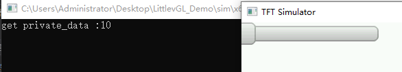

### 样式

样式是LittlevGL 中一个非常重要的特性，利用它可以制作自定义的控件风格，个性化的UI 界面对象仅存储指向样式的指针，因此样式不能是在函数退出后销毁的局部变量。创建样式的时候应该定义为静态变量或者全局变量。

#### 样式结构体

```c
typedef struct
{
	uint8_t glass : 1; 			// 不继承这种风格(为1 的时候对象的子类不会继承这种风格，子类需要重新设置风格)
	/** Object background. */
	struct
	{
		lv_color_t main_color; 	// 对象的主要 背景颜色
		lv_color_t grad_color; 	// 渐变色（底色）
		lv_coord_t radius;  	// 角半径
		lv_opa_t opa; 			// 不透明度（0-255）
		struct
		{
			lv_color_t color; 	// 边框颜色
			lv_coord_t width; 	// 边框宽度
			lv_border_part_t part; //边框部分（选择哪一部分边框， LV_BORDER_LEFT/RIGHT/TOP/BOTTOM/FULL 或者‘OR’ed 的值）
			lv_opa_t opa; 		// 边框不透明度（0-255）
		} border;
		struct
		{
			lv_color_t color; 	// 阴影颜色
			lv_coord_t width; 	// 阴影宽度 
			lv_shadow_type_t type; // 阴影类型（LV_SHADOW_FULL/LV_SHADOW_BOTTOM）
		} shadow;
		struct
		{
			lv_coord_t top;  	// 顶部填充
			lv_coord_t bottom; 	// 底部填充
			lv_coord_t left; 	// 左边部分填充
			lv_coord_t right; 	//右边部分填充
			lv_coord_t inner; 	//内部填充（在内容元素或子元素之间）
		} padding;
	} body;
	/** Style for text drawn by this object. */
	struct
	{
		lv_color_t color; 		// 文字颜色
		lv_color_t sel_color; 	//所选文字颜色
		const lv_font_t * font; //字体
		lv_coord_t letter_space;//字母之间的间隔
		lv_coord_t line_space; 	//线间距（垂直）
		lv_opa_t opa; 			// 不透明度
	} text;
	/**< Style of images. */
	struct
	{
		lv_color_t color; 		// 颜色，使用颜色重新着色图像
		lv_opa_t intense; 		//重新着色的不透明度（0 表示不重新着色）
		lv_opa_t opa; 			// 整个图像不透明度
	} image;
	/**< Style of lines (not borders). */
	struct
	{
		lv_color_t color; 		// 线条颜色
		lv_coord_t width; 		//线条宽度
		lv_opa_t opa;      		//线条透明度 
		uint8_t rounded : 1;  	// 圆角线尾
	} line;
} lv_style_t;

```

#### 内置样式

lv内置了很多样式，内置样式默认情况下将glass = 1，所以子类不会继承父类的样式

```c
lv_label_set_style(label1,LV_LABEL_STYLE_MAIN,&lv_style_transp);
```

如果控件有多种状态，例如btn，可以对不同状态设置不同的样式

```c
lv_btn_set_style(btn,LV_BTN_STYLE_PR, &lv_style_transp);  /* 设置btn 释放时的样式*/
lv_btn_set_style(btn,LV_BTN_STYLE_REL,&lv_style_btn_rel); /* 设置btn 按下时的样式*/
```

#### 自定义样式

我们在自定义样式后，可以复制内置的样式，这样就不需要我们重新定义每一个属性，仅仅需要修改我们改变的一部分属性，比如下面代码中修改字体和文字颜色

```c
static lv_style_t style_cn_24; 								/* 定义一个新的样式,注意使用static */
lv_style_copy(&style_cn_24, &lv_style_pretty_color); 			/* 复制style 的属性*/
style_cn_24.text.font 	= &gb2312_puhui24; 					/* 重新设置style 的字体*/
style_cn_24.text.color 	= LV_COLOR_BLUE; 					/* 重新设置style 的文字颜色*/

lv_obj_t *label4 		= lv_label_create(scr,NULL); 		/* 创建label 控件*/
lv_obj_set_style(label4,&style_cn_24); 						/* 为控件设置新的style */
lv_obj_set_pos(label4,0,100); 								/* 设置控件的坐标*/
lv_label_set_text(label4,"这是一个蓝色的中文字体的label 控件"); 	/* 设置文字*/

```

如果 `lv_obj_set_style(obj,NULL);` 	那么队形obj会继承父对象的样式，。这个函数只能用于基础对象的样式修改，如果是某个控件对象，会有自己的特殊的样式修改函数，例如`lv_btn_set_style()`。

如果修改了对象已经使用的样式，默认不会更新，需要使用函数`lv_obj_refresh_style(obj)` 刷新对象的样式。或者对某个样式修改，可以通知所有使用该样式的对象lv_obj_report_style_mod(&style) ，如果函数的参数为NULL，则会通知所有对象。

### 主题 Theme

```c
void lv_theme_demo()
{
	lv_obj_t *scr = lv_disp_get_scr_act(NULL);				/* 获取当前屏幕 */

	/* 创建主题*/
	lv_theme_t *theme1 = lv_theme_alien_init(10, NULL);
	lv_theme_t *theme2 = lv_theme_night_init(10, NULL);
	///* 创建按钮并设置主题*/
	lv_obj_t *btn1 = lv_btn_create(scr, NULL);
	lv_obj_t *label_btn1 = lv_label_create(btn1, NULL);
	lv_label_set_text(label_btn1, "theme_alien");
	lv_obj_set_pos(btn1, 10, 10);
	lv_btn_set_style(btn1, LV_BTN_STYLE_REL, theme1->style.btn.rel);  /* 设置按钮1主题 */
	lv_btn_set_style(btn1, LV_BTN_STYLE_PR, theme1->style.btn.pr);
	
	lv_obj_t *btn2 = lv_btn_create(scr, NULL);
	lv_obj_t *label_btn2 = lv_label_create(btn2, NULL);
	lv_label_set_text(label_btn2, "theme_night");
	lv_obj_set_pos(btn2, 10, 100);
	lv_btn_set_style(btn2, LV_BTN_STYLE_REL, theme2->style.btn.rel); /* 设置按钮2主题 */
	lv_btn_set_style(btn2, LV_BTN_STYLE_PR, theme2->style.btn.pr);
}
```

运行结果如下

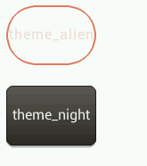

以上方法需要为每个控件设置主题，如果我们的应用或者某一部分控件使用同样的主题时，可以定义当前的主题，这样后面再创建控件的时候默认使用这个主题，例如：

```c
void lv_theme_demo1()
{
	lv_obj_t *scr = lv_disp_get_scr_act(NULL);

	lv_theme_t *theme1 = lv_theme_alien_init(10,NULL); // 创建 主题
	lv_theme_set_current(theme1);                      // 设置当前主题

	lv_obj_t *btn1 = lv_btn_create(scr, NULL);
	lv_obj_t *label_btn1 = lv_label_create(btn1, NULL);
	lv_label_set_text(label_btn1, "theme_alien");
	lv_obj_set_pos(btn1, 10, 10);

	lv_obj_t *btn2 = lv_btn_create(scr, NULL);
	lv_obj_t *label_btn2 = lv_label_create(btn2, NULL);
	lv_label_set_text(label_btn2, "theme_night");
	lv_obj_set_pos(btn2, 10, 100);
}
```

运行结果如下

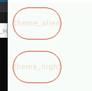

#### 主题实时更新

LittlevGL 允许我们在程序运行时更新主题。在默认情况下，如果再次调用lv_theme_set_current(theme) 不会刷新已经创建的控件的样式，需要在lv_conf.h 中开启`LV_THEME_LIVE_UPDATE` 宏定义以实现实时刷新。实时更新只会更新第一次调用lv_theme_set_current(theme) 之后创建的控件或者手动应用了主题样式的控件。

### 字体

LittlevGL 支持UTF-8 编码的Unicode 字符，在使用时需要确保文件的保存格式为UTF-8
字体具有bpp（每像素位数）属性，他表示用于描述字体中像素的位数，bpp 越高，字体就会越平滑，抗锯齿的效果就会越好，高性能的显示带来的就是字库的存储空间变大。

LittlevGL 官网有在线的字体转换工具，可以将ttf 的字体文件转换为LittlevGL 支持的字体文件，字体可以保存在内部数组，也可以保存在外部flash 或者文件系统。显示中文的c 文件必须使用UTF8 编码，LittlevGL 内置了几种ASCII 字体，可以在`lv_conf.h`中启用。

- LV_FONT_ROBOTO_12
- LV_FONT_ROBOTO_16
- LV_FONT_ROBOTO_22
- LV_FONT_ROBOTO_28

内置字体是全局变量，使用时只需调用即可，内部字体是4bpp，除了ASCII 范围的字体，内置字体还支持符号字体，例如

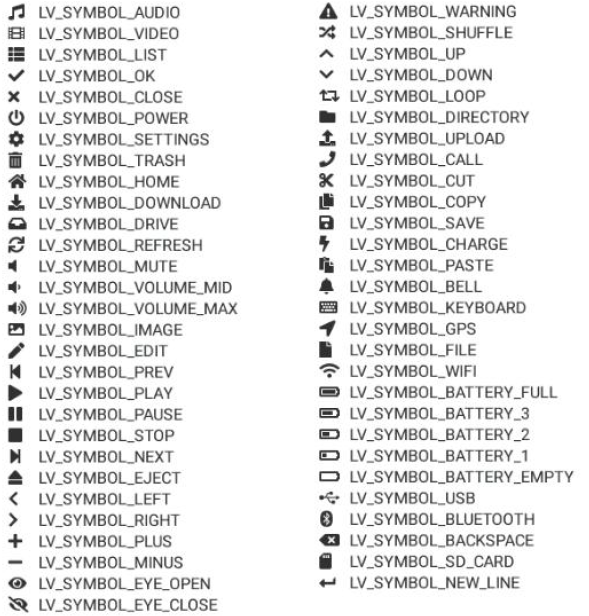

示例如下：

```c
void lv_font_demo()
{
	lv_obj_t *scr = lv_disp_get_scr_act(NULL);

	static lv_style_t style2;
	lv_style_copy(&style2, &lv_style_plain);
	style2.text.font = &gb2312_puhui24;
	/* 创建一个新字体的label */
	lv_obj_t * label = lv_label_create(scr, NULL);
	lv_obj_set_pos(label, 200, 200);
	lv_label_set_style(label, LV_LABEL_STYLE_MAIN, &style2);
	lv_label_set_text(label, "好界");


	lv_obj_t * label2 = lv_label_create(scr, NULL);
	lv_obj_set_pos(label2, 200, 300);
	lv_label_set_text(label2, LV_SYMBOL_AUDIO); 					// 符号字体单独使用

	lv_obj_t * label3 = lv_label_create(scr, NULL);
	lv_obj_set_pos(label3, 200, 400);
	lv_label_set_text(label3, LV_SYMBOL_AUDIO "AUDIO");			// 符号字体配合字符使用


	lv_obj_t * label4 = lv_label_create(scr, NULL);
	lv_obj_set_pos(label4, 200, 500);
	lv_label_set_text(label4, LV_SYMBOL_AUDIO LV_SYMBOL_BELL);	// 符号字体一起使用

}
```

运行效果如下

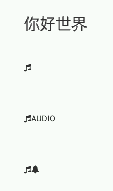

#### 添加新字体

有几种方法可以向项目中添加新字体以及本地化的字体

- 利用官方提供的在线字体转换，可以在浏览器上传您的ttf 字体文件并可以选择范围和文字，然后生成c 字体文件并添加到项目中（这种方法对于国内用户往往较慢）
- 利用论坛网友【阿里】提供的免费字体转换软件，该软件可以将中文转化为C 数组文件或者XBF 的bin 文件存储在外部Flash 或者文件系统。

要使用汉字，需要将文件保存为UTF-8 格式，然后将字体文件加入到工程，在需要显示中文的文件里面声明新字体LV_FONT_DECLARE(gb2312_puhui32)

### 图像

本章节保留

### 动画 Ainmation

保留本章节

### 任务task

保留本章节

### 绘图Drawing

保留本章节

### 中文显示

保留本章节

### 图片

保留本章节

## 控件

### 基础对象

#### 对象的尺寸

```c
lv_obj_set_width(obj, new_width); //设置对象的宽度
lv_obj_set_height(obj, new_height); //设置对象的高度
lv_obj_set_size(obj, new_width, new_height); //设置对象的高宽
```

#### 对象的坐标 相对于父对象

```c
lv_obj_set_x(obj, new_x); //设置对象的X 轴坐标
lv_obj_set_y(obj, new_y); //设置对象的Y 轴坐标
lv_obj_set_pos(obj, new_x, new_y);//设置对象的坐标
```

#### 对齐的方式来设置相对坐标

```c
/*
* obj :是需要设置的对象
* base：是参考对象，如果为NULL，就是用父对象
* align：对齐方式
* x_mod y_mod ：是两个方向的偏移
*/
void lv_obj_align(lv_obj_t * obj, const lv_obj_t * base, lv_align_t align, lv_coord_t x_mod, lv_coord_t y_mod)
```

对齐的选项如下可选：

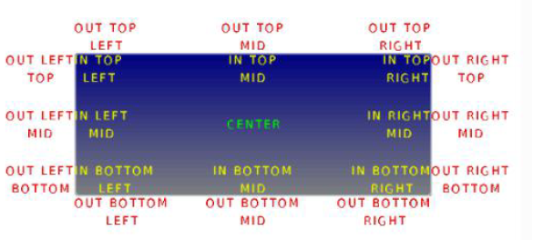


如果要将一个文本在按钮内部的底部中间对齐，可以使用

```c
lv_obj_align(label,btn,LV_ALIGN_IN_BOTTOM_MID,0,0);
```

lv_obj_align_origo 函数的工作原理同lv_obj_align 类似，但是他对齐的原点是对象的中心而不是左上角。
例如，将按钮的中心对准图像的底部。

```
lv_obj_align_origo(btn, image, LV_ALIGN_OUT_BOTTOM_MID, 0, 0);
```

如果在`lv_conf.h` 中使能了`LV_USE_OBJ_REALIGN` ，那么对齐的属性将会保存在对象中，如果对象的尺寸有变化，只需要调用`lv_obj_realign(obj)` 就可以重新对齐对象，等效于`lv_obj_align` 使用相同参数再次调用。
如果使用`lv_obj_set_auto_realign(obj, true)` 进行自动对齐，那么在对象的大小发生变化时，将会自动重新对齐对象。

#### 对象父子结构

- 重新设置新的父对象 `lv_obj_set_parent(obj, new_parent)` 

- 获取父对象 `lv_obj_get_parent(obj)` 

- 从最后到第一获取对象的子代，`lv_obj_get_child(obj，child_prev)`

- 从第一到最后获取对象的子代`lv_obj_get_child_back(obj，child_prev)`

- 要获得第一个子代，请将NULL作为第二个参数传递，并使用返回值遍历子代。如果没有更多的子级，该函数将返回NULL。例如：

```c
  lv_obj_t * child;
  child = lv_obj_get_child(parent, NULL);
  while(child)
  {
  	/* 遍历子代*/
  	child = lv_obj_get_child(parent, child);
  }
```

  

- 获取子代的数量`lv_obj_count_children(obj)`  

- 递归计算子代的数量 `lv_obj_count_children_recursive(obj)`  

- 创建屏幕 `lv_obj_create(NULL, NULL);`创建后可以用`lv_scr_load(screen1)` 来加载它，`lv_scr_act()` 函数提供了指向当前屏幕的指针

### 文本控件  Label

```c
void lv_lable_demo(void)
{

	/* 为样式重新设置文字颜色 */
	style_cn_12.text.color = LV_COLOR_BLUE;
	style_cn_16.text.color = LV_COLOR_BLUE;
	style_cn_24.text.color = LV_COLOR_BLUE;
	style_cn_32.text.color = LV_COLOR_BLUE;


	lv_obj_t *scr = lv_disp_get_scr_act(NULL);				/* 获取当前屏幕 */

	lv_obj_t *label1 = lv_label_create(scr, NULL);					/* 创建label控件 */
	lv_label_set_style(label1, LV_LABEL_STYLE_MAIN, &style_cn_16);	/* 设置为中文字体的style */
	lv_label_set_text(label1, "label控件 ");							/* 设置文字 */
	lv_obj_align(label1, NULL, LV_ALIGN_IN_TOP_MID, 0, 0);			/* 设置位置 */


	lv_obj_t *label2 = lv_label_create(scr, NULL);					/* 创建label控件 */
	lv_label_set_style(label2, LV_LABEL_STYLE_MAIN, &style_cn_16);	/* 设置为中文字体的style */
	lv_label_set_text(label2, "换行label控件\n第二行的");				/* 设置文字 */
	lv_obj_align(label2, label1, LV_ALIGN_OUT_BOTTOM_MID, 0, 0);	/* 设置位置 */


	lv_obj_t *label3 = lv_label_create(scr, NULL);					/* 创建label控件 */
	lv_label_set_style(label3, LV_LABEL_STYLE_MAIN, &style_cn_16);	/* 设置为中文字体的style */
	lv_label_set_text(label3, "这是一个长文本,会进行滚动显示,一万年太久,只争朝夕");	/* 设置长文本 */
	lv_label_set_long_mode(label3, LV_LABEL_LONG_SROLL_CIRC);		/* 设置长文本的模式为循环滚动显示 */
	lv_obj_set_width(label3, 480);									/* 设置label的宽度,注意要放在设置长文本模式后面 */
	lv_obj_align(label3, NULL, LV_ALIGN_CENTER, 0, 0);				/* 设置位置 */


	lv_obj_t *label4 = lv_label_create(scr, NULL);					/* 创建label控件 */
	lv_label_set_style(label4, LV_LABEL_STYLE_MAIN, &style_cn_16);	/* 设置为中文字体的style */
	lv_label_set_recolor(label4, true);								/* 允许文字重新着色 */
	lv_label_set_text(label4, "#000080 多种# #000000 颜色# #6666ff 文本#");	/* 设置不同颜色的文本,注意#号包含以及空格,两个#号中间格式如下： #rgb空格文本# */
	lv_obj_align(label4, label3, LV_ALIGN_OUT_BOTTOM_MID, 0, 0);		/* 设置位置 */


}
```

运行效果如下

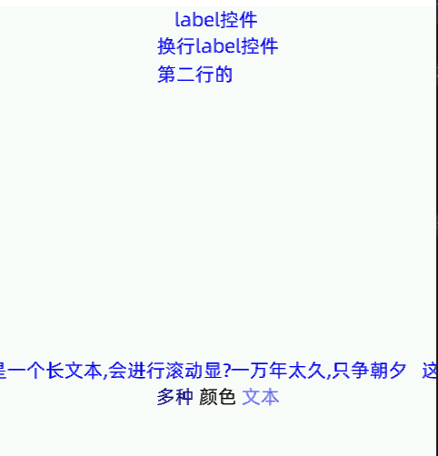

### btn 按钮控件

#### 状态

按钮一共有5 种状态且同一时刻只有一种状态

- LV_BTN_STATE_REL 释放状态
- LV_BTN_STATE_PR 按下状态
- LV_BTN_STATE_TGL_REL 切换释放状态 
- LV_BTN_STATE_TGL_PR 切换按下状态
- LV_BTN_STATE_INA 禁用或无效状态

用户按下或者释放的时候按钮是自动切换状态，但是也可以在程序中手动指定状态，用下面函数实现

```c
lv_btn_set_state(btn,LV_BTN_STATE_TGL_REL)// 手动指定btn状态为释放
```

`lv_btn_set_toggle(btn,true)` 可以配置按钮的toggle 状态，如果使能了toggle,在用户按下后会一直保持按下的状态，直到再次点击才会切换到释放状态。

#### 布局

按钮可以设置它内部子对象布局，函数`lv_btn_set_layout(btn,LV_LAYOUT_...)` ，默认为`LV_LAYOUT_CENTER` ，如果添加了其他控件到按钮上，他会默认居中对齐，而且不能重新设置其位置，如果需要使用`lv_obj_set_pos()`来设置子对象的位置，需要使用禁止布局，函数`lv_btn_set_layout(btn, LV_LAYOUT_OFF)`

可选布局

- LV_LAYOUT_OFF 没有布局
- LV_LAYOUT_CENTER 中心对齐
- LV_LAYOUT_COL_L 列左对齐
- LV_LAYOUT_COL_M 列中间对齐
- LV_LAYOUT_COL_R 列右对齐
- LV_LAYOUT_ROW_T 行顶部对齐
- LV_LAYOUT_ROW_M 行中间对齐
- LV_LAYOUT_ROW_B 行底部对齐
- LV_LAYOUT_PRETTY 将尽可能多的对象放在行中并开始新行
- LV_LAYOUT_GRID 将相同大小的对象对齐到网格中

函数`lv_btn_set_fit/fit2/fit4(btn,LV_FIT_..)` 可以根据子对象以及按钮本身来调节按钮的尺寸。具体的调节方式取决于LV_FIT_.. 的取值。

- LV_FIT_NONE 不自动更改大小
- LV_FIT_TIGHT 收缩到子对象大小
- LV_FIT_FLOOD 将尺寸与父对象的边缘对齐
- LV_FIT_FILL 与父对象边缘对齐

#### 按压动画

在按钮按下的时候，可以启用一种特殊的动画，从用户按下的地方开始，有一个类似墨水散开的动画效果，用于显示按钮按下的状态。需要使用此功能，需要在`lv_conf.h` 中启用`LV_BTN_INK_EFFECT` 为1且需要使用以下函数

- `lv_btn_set_ink_in_time(btn, time_ms)` 设置动画圆圈的生成时间
- `lv_btn_set_ink_wait_time(btn, time_ms)` 设置保持按压状态动画的时间
- `lv_btn_set_ink_out_time(btn, time_ms)` 设置按钮回到释放状态的动画时间

####  样式

按钮一共有5 种状态，对于每一种状态，有对应5 种样式，可以使用函数l
v_btn_set_style(btn,LV_BTN_STYLE_...,&style) 来设置按钮的样式，使用了
style.body 属性
按钮可以使用的5 种样式：

- LV_BTN_STYLE_REL 按钮释放时的样式
- LV_BTN_STYLE_PR   按钮按下时的样式
- LV_BTN_STYLE_TGL_REL 按钮切换释放时的样式
- LV_BTN_STYLE_TGL_PR 按钮切换按下时的样式
- LV_BTN_STYLE_INA 按钮无效时的样式

在按钮上创建label 添加文本的时候，可以直接设置按钮样式的`style.text` 属性，因为label 会继承按钮的样式，而无需再为label 创建新的样式。

#### 事件

除了通用事件以外，按钮还发送以下事件`LV_EVENT_VALUE_CHANGED` 切换按钮时发送

#### demo

```c
lv_obj_t *label_btn1;
lv_obj_t *label_btn2;
lv_img_dsc_t tiaotu_logo80;

static void btn1_event_cb(lv_obj_t * obj, lv_event_t event)
{
	static uint8_t en = 0;
	switch (event) {
	case LV_EVENT_RELEASED:
	lv_obj_set_drag(obj, (en = 1 - en));
	lv_label_set_text(label_btn1, (en ? "按钮可拖动" : "按钮不可拖动"));
	break;
	default:
	break;
	}
}


static void btn2_event_cb(lv_obj_t * obj, lv_event_t event)
{
	switch (event) {
	case LV_EVENT_PRESSED:
	lv_label_set_text(label_btn2, "按钮按下");
	break;
	case LV_EVENT_RELEASED:
	lv_label_set_text(label_btn2, "按钮释放");
	break;
	case LV_EVENT_LONG_PRESSED:
	lv_label_set_text(label_btn2, "按钮长按");
	break;
	default:
	break;
	}
}

/**
  * @brief 控件测试函数
  * @param None
  * @retval	None
  */
void lv_obj_btn_demo(void)
{


	lv_load_img_bin_from_file(&tiaotu_logo80, "0:/lvgl/tiaotu_logo80.bin");	/* 从文件加载 bin 格式的图片到图片变量 */


	static lv_style_t style_desktop;// 创建个新样式

	lv_style_copy(&style_desktop, &lv_style_scr);
	style_desktop.body.main_color = LV_COLOR_BLUE;		/* 设置底色 */

	/* 设置样式的字体颜色 */
	style_cn_12.text.color = LV_COLOR_WHITE;
	style_cn_16.text.color = LV_COLOR_WHITE;
	style_cn_24.text.color = LV_COLOR_WHITE;
	style_cn_32.text.color = LV_COLOR_WHITE;

	lv_obj_t *scr = lv_disp_get_scr_act(NULL);
	lv_obj_set_style(scr, &style_desktop);			/* 设置样式 */

	lv_obj_t *btn1 = lv_btn_create(scr, NULL);		/* 创建按钮 */
	label_btn1 = lv_label_create(btn1, NULL);		/* 创建label,作为按钮子对象 */
	lv_label_set_style(label_btn1, LV_LABEL_STYLE_MAIN, &style_cn_16);	/* 设置label的样式 */
	lv_label_set_text(label_btn1, "按钮可拖动");		/* 设置label文本 */
	lv_obj_set_width(btn1, 150);						/* 设置控件宽度 */
	lv_btn_set_ink_in_time(btn1, 500);					/* 按钮按下的动画 */
	lv_btn_set_ink_wait_time(btn1, 100);
	lv_btn_set_ink_out_time(btn1, 100);
	lv_obj_set_drag(btn1, true);						/* 允许拖动 */
	lv_obj_set_event_cb(btn1, btn1_event_cb);			/* 设置按钮事件回调函数 */

	lv_obj_t *btn2 = lv_btn_create(scr, NULL);			/* 创建按钮 */
	lv_obj_set_size(btn2, 100, 100);					/* 设置控件尺寸 */
	lv_btn_set_style(btn2, LV_BTN_STYLE_REL, &lv_style_transp);		/* 设置按钮释放时的样式,设置为透明 */
	lv_btn_set_style(btn2, LV_BTN_STYLE_PR, &lv_style_btn_ina);		/* 设置按钮按下时的样式,设置为透明带边框 */
	lv_obj_set_pos(btn2, 200, 0);						/* 设置控件绝对坐标 */
	lv_obj_t *image_btn2 = lv_img_create(btn2, NULL);	/* 创建一个图像控件 */
	lv_img_set_src(image_btn2, &tiaotu_logo80);			/* 设置图像的数据 */
	label_btn2 = lv_label_create(scr, NULL);			/* 创建label控件 */
	lv_label_set_style(label_btn2, LV_LABEL_STYLE_MAIN, &style_cn_16);	/* 设置label的样式 */
	lv_label_set_text(label_btn2, "图片按钮");			/* 设置文本 */
	lv_obj_align(label_btn2, btn2, LV_ALIGN_OUT_BOTTOM_MID, 0, 0);	/* 设置位置 */

	lv_obj_set_event_cb(btn2, btn2_event_cb);			/* 设置按钮事件回调函数 */


}
```

运行效果

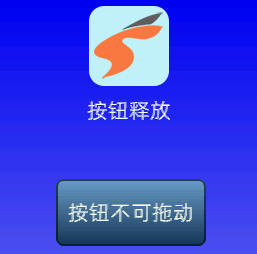

### arc 弧形控件

#### 定义

arc 控件的角度从底部开始，并且沿逆时针方向进行增长，如下图所示。littlevGL V6.0版本的arc 控件是不支持抗锯齿的。

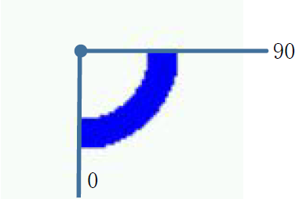

```c
lv_arc_set_angles(arc1,0,90); /* 设置起始角度和终止角度*/
```

#### 样式

arc 只有一个样式类型，使用了以下属性

- `line.rounded` 使端点四舍五入（如果设置为1，不透明度将无法正常工作）
- `line.width` 弧的粗细
- `line.color` 弧的颜色

要设置zrc 的样式，使用函数

```c
lv_arc_set_style(arc,LV_ARC_STYLE_MAIN,&style)
```

#### 常用API函数

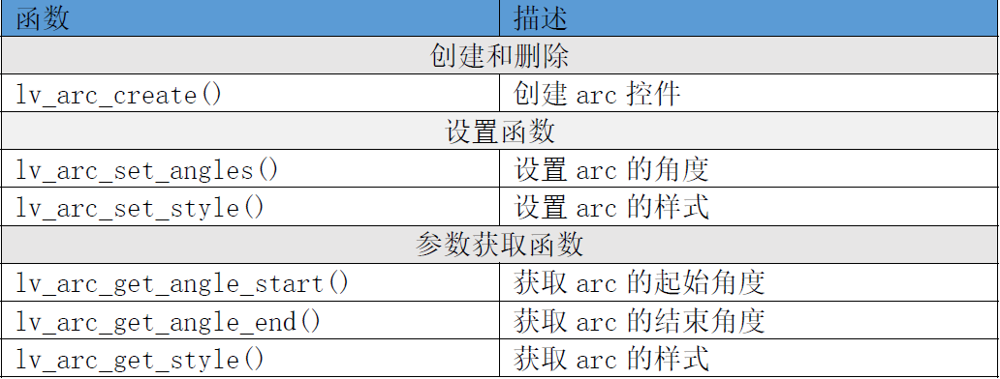

#### demo

```c
lv_obj_t *label_arc1;
lv_obj_t *label_arc2;

/**
  * @brief lvgl任务函数
  * @param t-任务参数
  * @retval	None
  */
static void arc1_loader(lv_task_t * t)
{
	static int16_t a = 0;
	uint8_t buf[4];

	a += 5;
	if (a >= 359) a = 359;

	if (a < 180) {
		lv_arc_set_angles(t->user_data, 180 - a, 180);
		sprintf((char*)buf, "%d", (lv_arc_get_angle_end(t->user_data) - lv_arc_get_angle_start(t->user_data)));
	} else {
		lv_arc_set_angles(t->user_data, 540 - a, 180);
		sprintf((char*)buf, "%d", (lv_arc_get_angle_end(t->user_data) + (360 - lv_arc_get_angle_start(t->user_data))));
	}

	if (a == 359) {
		a = 0;
	}


	lv_label_set_text(label_arc1, (const char*)buf);

}

/**
  * @brief lvgl任务函数
  * @param t-任务参数
  * @retval	None
  */
static void arc2_loader(lv_task_t * t)
{
	static int16_t a = 0;
	uint8_t buf[5];

	a += 5;
	if (a >= 359) a = 359;

	if (a < 180) {
		lv_arc_set_angles(t->user_data, 180 - a, 180);
		sprintf((char*)buf, "%d%%", (int)((float)(lv_arc_get_angle_end(t->user_data) - lv_arc_get_angle_start(t->user_data)) / 360 * 100));
	} else {
		lv_arc_set_angles(t->user_data, 540 - a, 180);
		sprintf((char*)buf, "%d%%", (int)((float)(lv_arc_get_angle_end(t->user_data) + (360 - lv_arc_get_angle_start(t->user_data))) / 360 * 100));
	}

	if (a == 359) {
		a = 0;
	}


	lv_label_set_text(label_arc2, (const char*)buf);
}


/**
  * @brief 控件测试函数
  * @param None
  * @retval	None
  */
void lv_obj_arc_demo(void)
{

	/* 新建样式 */
	static lv_style_t style1;
	static lv_style_t style2;

	lv_obj_t *scr = lv_disp_get_scr_act(NULL);				/* 获取当前屏幕 */

	/* 复制样式并设置新的参数 */
	lv_style_copy(&style1, &lv_style_scr);
	style1.line.color = LV_COLOR_BLUE;
	style1.line.width = 10;

	lv_style_copy(&style2, &lv_style_scr);
	style2.line.color = LV_COLOR_RED;
	style2.line.width = 20;


	lv_obj_t *arc1 = lv_arc_create(scr, NULL);			/* 创建 arc 控件 */
	lv_arc_set_angles(arc1, 0, 90);						/* 设置起始角度和终止角度 */
	lv_arc_set_style(arc1, LV_ARC_STYLE_MAIN, &style1);	/* 设置样式 */
	lv_obj_align(arc1, NULL, LV_ALIGN_IN_TOP_MID, 0, 0);	/* 设置位置 */

	label_arc1 = lv_label_create(arc1, NULL);			/* 创建 label 控件 */
	lv_obj_align(label_arc1, arc1, LV_ALIGN_CENTER, 0, 0);	/* 设置 label 位置 */
	lv_label_set_text(label_arc1, "0");					/* 设置文字 */

	lv_obj_t *arc2 = lv_arc_create(scr, NULL);			/* 创建 arc 控件 */
	lv_arc_set_angles(arc2, 0, 180);						/* 设置起始角度和终止角度 */
	lv_arc_set_style(arc2, LV_ARC_STYLE_MAIN, &style2);	/* 设置样式 */
	lv_obj_set_size(arc2, 200, 200);						/* 设置控件尺寸 */
	lv_obj_align(arc2, arc1, LV_ALIGN_OUT_BOTTOM_MID, 0, 50);/* 设置位置 */

	label_arc2 = lv_label_create(arc2, NULL);			/* 创建 label 控件 */
	lv_obj_align(label_arc2, arc2, LV_ALIGN_CENTER, 0, 0);	/* 设置 label 位置 */
	lv_label_set_text(label_arc2, "0");					/* 设置文字 */

	/* 创建两个 task 用于重设 arc 控件的起始角度和终止角度 */
	lv_task_create(arc1_loader, 100, LV_TASK_PRIO_LOWEST, arc1);
	lv_task_create(arc2_loader, 200, LV_TASK_PRIO_LOWEST, arc2);

}
```

运行效果

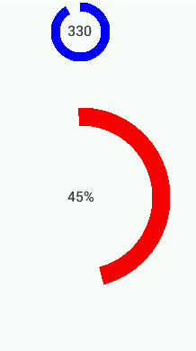

### btnm 按钮阵列控件

btnm 控件的每一个按钮上都有一个文本，我们需要统一设置所有按钮的文本，需要为btnm 控件指定一个被称为map 的字符串数组。控件会根据map 设置按钮的分布，map 的结构应该跟下面的字符串数组类似，需要注意的是，最后一个元素必须为空字符串。

```c
static const uint8_t *btnm_map[] = { "1", "2", "3", "\n",
"4", "5", "6", "\n",
"7", "8", "9", "\n",
"*", "0", "#", "\n",
"OK", "Space", "Cancel", "" };

lv_btnm_set_map(btnm1, btnm_map);
```


#### demo

```c
lv_obj_t *label_btnm1;
uint8_t label_buf[100];


/* 定义btnm控件的map,注意使用全局定义或者static */
static const uint8_t *btnm_map[] = { "1", "2", "3", "\n",
									"4", "5", "6", "\n",
									"7", "8", "9", "\n",
									"*", "0", "#", "\n",
									"OK", "Space", "Cancel", "" };
static void btnm1_event_cb(lv_obj_t * obj, lv_event_t event)
{
	static uint16_t count = 0;
	switch (event) {
	case LV_EVENT_RELEASED:
	if (lv_btnm_get_active_btn(obj) == 14) {
		memset(label_buf, 0, sizeof(label_buf)); // 说明按下的是 Cancel，这个时候要清空显示label_buf
	} else {
		if (strlen(label_buf) <= (sizeof(label_buf) - 10)) {
			strcat(label_buf, lv_btnm_get_active_btn_text(obj));  // 把文本拿到 追加到label_buf缓存里面
		}
	}

	lv_label_set_text(label_btnm1, label_buf);   // label_buf显示出来
	//printf("%d\n", lv_btnm_get_active_btn(obj));
	//printf("%s\n",lv_btnm_get_active_btn_text(obj));
	break;
	default:
	break;
	}
}

/**
  * @brief 控件测试函数
  * @param None
  * @retval	None
  */
void lv_obj_btnm_demo(void)
{

	/* 新建个样式 */
	static lv_style_t style_desktop;

	lv_style_copy(&style_desktop, &lv_style_scr);
	style_desktop.body.main_color = LV_COLOR_BLUE;		/* 设置底色 */

	/* 设置样式的字体颜色 */
	style_cn_12.text.color = LV_COLOR_WHITE;
	style_cn_16.text.color = LV_COLOR_WHITE;
	style_cn_24.text.color = LV_COLOR_WHITE;
	style_cn_32.text.color = LV_COLOR_WHITE;

	lv_obj_t *scr = lv_disp_get_scr_act(NULL);		/* 获取当前屏幕 */
	lv_obj_set_style(scr, &style_desktop);			/* 设置样式 */

	lv_obj_t *btnm1 = lv_btnm_create(scr, NULL);		/* 创建btnm控件 */
	lv_btnm_set_map(btnm1, btnm_map);					/* 设置btnm控件的map,控件会根据map设置按钮的分布 */
	lv_obj_set_size(btnm1, LV_HOR_RES, LV_VER_RES / 2);	/* 设置控件的尺寸 */
	lv_obj_align(btnm1, NULL, LV_ALIGN_IN_BOTTOM_MID, 0, 0);	/* 设置控件位置 */

	lv_obj_set_event_cb(btnm1, btnm1_event_cb);			/* 设置控件事件回调函数 */

	/*
	 *  这个label用来显示 btnm按下的按键值
	 */
	label_btnm1 = lv_label_create(scr, NULL);			/* 创建label控件 */
	lv_label_set_text(label_btnm1, label_buf);			/* 设置label文本 */
	lv_label_set_long_mode(label_btnm1, LV_LABEL_LONG_BREAK);	/* 设置长文本模式为自动换行 */
	lv_obj_set_width(label_btnm1, LV_HOR_RES);			/* 设置控件宽度 */
	lv_obj_set_style(label_btnm1, &style_cn_32);		/* 设置中文字体的样式 */
	lv_obj_align(label_btnm1, NULL, LV_ALIGN_IN_TOP_LEFT, 0, 0);	/* 设置位置 */

}

```

运行效果如下

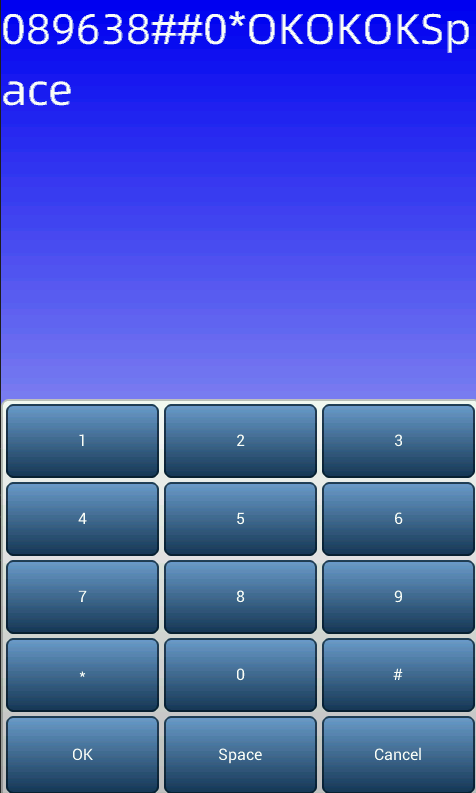

### bar 进度条控件

#### 范围

bar 控件默认的范围是0-100，可以通过函数修改其范围

```
lv_bar_set_range(bar1, 0, 100); /* 设置值的范围,最大值和最小值*/
```

手动设置一个新值

```
lv_bar_set_value(bar1, 100, LV_ANIM_ON); /* 设置bar 的值,动画显示打开*/
```

函数的第三个参数用于确定是否打开动画。参数LV_ANIM_ON/OFF ，动画的时间可以通过函数`lv_bar_set_anim_time(bar, 100)` 进行修改，时间单位为ms

#### 对称

默认情况下，进度条从最左侧开始增长和绘制，但是可以手动配置为从0的位置开始绘制，函数`lv_bar_set_sym(bar,true)` ，例如

```c
lv_obj_t *bar2 = lv_bar_create(scr, NULL); 	/* 创建bar 控件*/
lv_bar_set_sym(bar2, true); 				/* 启用对称*/
lv_bar_set_range(bar2, -100, 100); 			/* 设置范围*/
lv_bar_set_value(bar2, 50, LV_ANIM_ON); 	/* 设置bar 的值,动画显示打开*/
```

效果如下：


#### 样式

bar 控件有两种样式：

- LV_BAR_STYLE_BG 基础背景样式，默认为`lv_style_pretty`
- LV_BAR_STYLE_INDIC 与背景相似，主要用于绘制可以调整的部分，使用上下左右的填充来确定可调整条的大小。默认为`lv_style_pretty_color`

#### 常用API

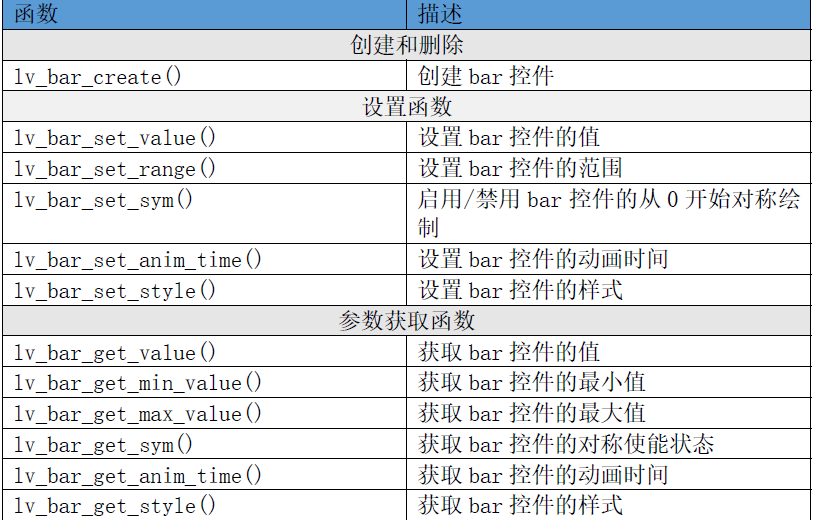

#### demo

```c


static void task_change_bar(lv_task_t *t)
{
	if (lv_bar_get_value(t->user_data) < lv_bar_get_max_value(t->user_data)) {
		lv_bar_set_value(t->user_data, (lv_bar_get_value(t->user_data) + 1), LV_ANIM_OFF); // 自增到最大值
	} else {
		lv_bar_set_value(t->user_data, lv_bar_get_min_value(t->user_data), LV_ANIM_OFF);    // 到最大值后，从最小值开始
	}
}


/**
  * @brief 控件测试函数
  * @param None
  * @retval	None
  */
void lv_obj_bar_demo(void)
{
	/* 新建个样式 */
	static lv_style_t style_desktop;

	lv_style_copy(&style_desktop, &lv_style_scr);
	style_desktop.body.main_color = LV_COLOR_BLUE;		/* 设置底色 */

	/* 设置样式的字体颜色 */
	style_cn_12.text.color = LV_COLOR_WHITE;
	style_cn_16.text.color = LV_COLOR_WHITE;
	style_cn_24.text.color = LV_COLOR_WHITE;
	style_cn_32.text.color = LV_COLOR_WHITE;

	lv_obj_t *scr = lv_disp_get_scr_act(NULL);		/* 获取当前屏幕 */
	lv_obj_set_style(scr, &style_desktop);			/* 设置样式 */

	lv_obj_t *bar1 = lv_bar_create(scr, NULL);		/* 创建bar控件 */
	lv_bar_set_anim_time(bar1, 2000);				/* 设置动画时间 */
	lv_bar_set_range(bar1, 0, 100);					/* 设置值的范围,最大值和最小值 */
	lv_bar_set_value(bar1, 100, LV_ANIM_ON);		/* 设置bar的值,动画显示打开 */
	lv_obj_align(bar1, NULL, LV_ALIGN_IN_TOP_MID, 0, 0);	/* 设置位置 */

	lv_obj_t *bar2 = lv_bar_create(scr, NULL);		/* 创建bar控件 */
	lv_bar_set_sym(bar2, true);						/* 启用对称 */
	lv_bar_set_range(bar2, -100, 100);					/* 设置范围 */
	lv_bar_set_value(bar2, 50, LV_ANIM_ON);		/* 设置bar的值,动画显示打开 */
	lv_obj_align(bar2, bar1, LV_ALIGN_OUT_BOTTOM_MID, 0, 10);	/* 设置位置 */

	lv_task_create(task_change_bar, 100, LV_TASK_PRIO_LOW, bar2);	/* 创建个任务定期修改bar的值 */

}
```

运行效果

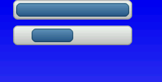

### sw 开关控件

#### 使用函数

```c
lv_sw_on(sw, LV_ANIM_ON/OFF)
lv_sw_off(sw, LV_ANIM_ON/OFF)
lv_sw_toggle(sw, LV_ANOM_ON/OFF)
```

#### 设置动画时间

```c
lv_sw_set_anim_time(sw, anim_time)
```

#### 样式

sw 控件有三种样式，分别绘制其不同的部分：

- LV_SW_STYLE_BG 背景，使用所有style.body 属性
- LV_SW_STYLE_INDIC 填充区域，使用所有style.body 属性
- LV_SW_STYLE_KNOB_OFF 开关关闭时的旋钮样式
- LV_SW_STYLE_KNOB_ON 开关打开时旋钮的样式

#### 事件

除了通用事件外，sw 控件还会发送以下事件`LV_EVENT_VALUE_CHANGED` 在开关更改状态时发送。

#### 常用API

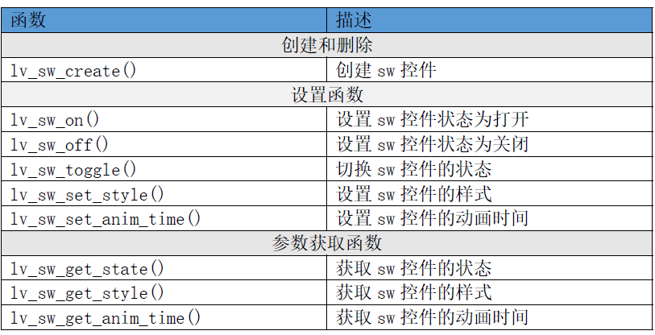

#### demo

```c

static void sw1_event_cb(lv_obj_t * obj, lv_event_t event)
{
	uint32_t color = 0;
	if (event == LV_EVENT_VALUE_CHANGED) {
		color = gui_hal_led_get_current_color();
		(lv_sw_get_state(obj) ? (color |= 0X000000FF) : (color &= ~(0X000000FF)));
		gui_hal_led_set_color(color);

	}
}

static void sw2_event_cb(lv_obj_t * obj, lv_event_t event)
{
	uint32_t color = 0;
	if (event == LV_EVENT_VALUE_CHANGED) {
		color = gui_hal_led_get_current_color();
		(lv_sw_get_state(obj) ? (color |= 0X0000FF00) : (color &= (0X0000FF00)));
		gui_hal_led_set_color(color);
	}
}

static void sw3_event_cb(lv_obj_t * obj, lv_event_t event)
{
	uint32_t color = 0;
	if (event == LV_EVENT_VALUE_CHANGED) {
		color = gui_hal_led_get_current_color();
		(lv_sw_get_state(obj) ? (color |= 0X00FF0000) : (color &= ~(0X00FF0000)));
		gui_hal_led_set_color(color);
	}
}


/**
  * @brief 控件测试函数
  * @param None
  * @retval	None
  */
void lv_obj_sw_demo(void)
{


	/* 新建个样式 */
	static lv_style_t style_desktop;

	lv_style_copy(&style_desktop, &lv_style_scr);
	style_desktop.body.main_color = LV_COLOR_BLUE;		/* 设置底色 */

	/* 设置样式的字体颜色 */
	style_cn_12.text.color = LV_COLOR_WHITE;
	style_cn_16.text.color = LV_COLOR_WHITE;
	style_cn_24.text.color = LV_COLOR_WHITE;
	style_cn_32.text.color = LV_COLOR_WHITE;

	lv_obj_t *scr = lv_disp_get_scr_act(NULL);		/* 获取当前屏幕 */
	lv_obj_set_style(scr, &style_desktop);			/* 设置样式 */

	lv_obj_t *sw = lv_sw_create(scr, NULL);				/* 创建sw控件 */
	lv_obj_align(sw, NULL, LV_ALIGN_IN_TOP_MID, 0, 0);	/* 设置位置 */

	/* 为sw控件新建样式 */
	static lv_style_t bg_style;
	static lv_style_t indic_style;
	static lv_style_t knob_on_style1;
	static lv_style_t knob_on_style2;
	static lv_style_t knob_on_style3;
	static lv_style_t knob_off_style;

	/* 设置style属性 */
	lv_style_copy(&bg_style, &lv_style_pretty);
	bg_style.body.radius = LV_RADIUS_CIRCLE;					/* 圆形 */
	bg_style.body.padding.top = 6;								/* 顶部填充 */
	bg_style.body.padding.bottom = 6;							/* 底部填充 */

	lv_style_copy(&indic_style, &lv_style_pretty_color);
	indic_style.body.radius = LV_RADIUS_CIRCLE;					/* 圆形 */
	indic_style.body.main_color = lv_color_hex(0x9fc8ef);		/* 主颜色 */
	indic_style.body.grad_color = lv_color_hex(0x9fc8ef);		/* 阴影颜色 */
	indic_style.body.padding.left = 0;							/* 上下左右填充 */
	indic_style.body.padding.right = 0;
	indic_style.body.padding.top = 0;
	indic_style.body.padding.bottom = 0;

	lv_style_copy(&knob_off_style, &lv_style_pretty);
	knob_off_style.body.radius = LV_RADIUS_CIRCLE;				/* 圆形 */
	knob_off_style.body.shadow.width = 4;						/* 阴影宽度 */
	knob_off_style.body.shadow.type = LV_SHADOW_BOTTOM;			/* 底部阴影 */

	lv_style_copy(&knob_on_style1, &lv_style_pretty_color);
	knob_on_style1.body.radius = LV_RADIUS_CIRCLE;				/* 圆形 */
	knob_on_style1.body.shadow.width = 4;						/* 阴影宽度 */
	knob_on_style1.body.shadow.type = LV_SHADOW_BOTTOM;			/* 底部阴影 */
	knob_on_style1.body.main_color = LV_COLOR_RED;				/* 主色 */

	/* 创建sw控件并设置样式 */
	lv_obj_t *sw1 = lv_sw_create(scr, NULL);					/* 创建sw控件 */
	lv_sw_set_style(sw1, LV_SW_STYLE_BG, &bg_style);			/* 设置背景样式 */
	lv_sw_set_style(sw1, LV_SW_STYLE_INDIC, &indic_style);		/* 填充样式 */
	lv_sw_set_style(sw1, LV_SW_STYLE_KNOB_ON, &knob_on_style1);	/* 开关打开的样式 */
	lv_sw_set_style(sw1, LV_SW_STYLE_KNOB_OFF, &knob_off_style);/* 开关关闭的样式 */
	lv_obj_set_size(sw1, 120, 50);								/* 设置尺寸 */
	lv_obj_align(sw1, NULL, LV_ALIGN_CENTER, 0, -100);			/* 设置位置 */
	lv_obj_t *label_sw1 = lv_label_create(scr, NULL);			/* 创建label控件 */
	lv_label_set_text(label_sw1, "RED");						/* 设置文本 */
	lv_obj_align(label_sw1, sw1, LV_ALIGN_IN_LEFT_MID, -50, 0);	/* 设置位置 */
	lv_obj_set_event_cb(sw1, sw1_event_cb);						/* 为sw控件设置事件回调函数 */


	lv_style_copy(&knob_on_style2, &knob_on_style1);			/* 复制样式的属性 */
	knob_on_style2.body.main_color = lv_color_hex(0x00ff00);	/* 重设主颜色 */
	lv_obj_t *sw2 = lv_sw_create(scr, sw1);						/* 创建sw控件,从sw1复制属性 */
	lv_sw_set_style(sw2, LV_SW_STYLE_KNOB_ON, &knob_on_style2);	/* 重新设置开关打开的样式 */
	lv_obj_align(sw2, NULL, LV_ALIGN_CENTER, 0, 0);				/* 设置位置 */
	lv_obj_t *label_sw2 = lv_label_create(scr, NULL);			/* 创建label控件 */
	lv_label_set_text(label_sw2, "GREEN");						/* 设置文本 */
	lv_obj_align(label_sw2, sw2, LV_ALIGN_IN_LEFT_MID, -50, 0);	/* 设置位置 */
	lv_obj_set_event_cb(sw2, sw2_event_cb);						/* 设置事件回调函数 */


	lv_style_copy(&knob_on_style3, &knob_on_style2);			/* 复制样式的属性 */
	knob_on_style3.body.main_color = LV_COLOR_BLUE;				/* 重设主颜色 */
	lv_obj_t *sw3 = lv_sw_create(scr, sw1);						/* 创建sw控件,从sw1复制属性 */
	lv_sw_set_style(sw3, LV_SW_STYLE_KNOB_ON, &knob_on_style3);	/* 重新设置开关打开的样式 */
	lv_obj_align(sw3, NULL, LV_ALIGN_CENTER, 0, 100);			/* 设置位置 */
	lv_obj_t *label_sw3 = lv_label_create(scr, NULL);			/* 创建label控件 */
	lv_label_set_text(label_sw3, "BLUE");						/* 设置文本 */
	lv_obj_align(label_sw3, sw3, LV_ALIGN_IN_LEFT_MID, -50, 0);	/* 设置位置 */
	lv_obj_set_event_cb(sw3, sw3_event_cb);						/* 设置事件回调函数 */

}

```

运行效果

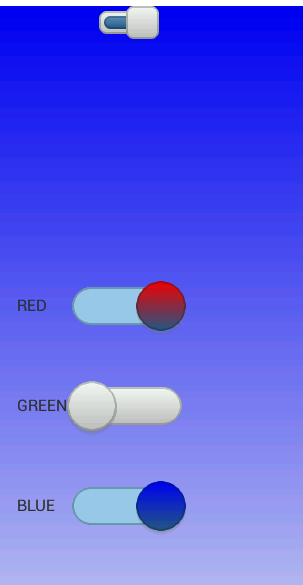

### calendar 日历控件


##### demo

```c
const uint8_t *month_name[12] = { "01","02","03","04","05","06","07","08","09","10","11","12" };
const uint8_t *day_name[7]    = { "7", "1", "2", "3", "4", "5", "6" };

lv_calendar_date_t today_date =
{
	.year = 2019,
	.month = 2,
	.day = 1,


};

static void calendar_handler(lv_obj_t * obj, lv_event_t event)
{
	if (event == LV_EVENT_CLICKED) {
		lv_calendar_date_t * date = lv_calendar_get_pressed_date(obj);	/* 获取按下选择的日期 */
		if (date) {
			lv_calendar_set_today_date(obj, date);		/* 设置日期为当前按下的 */
		}
	}
}


/**
  * @brief 控件测试函数
  * @param None
  * @retval	None
  */
void lv_obj_calender_demo(void)
{


	/* 新建个样式 */
	static lv_style_t style_desktop;
	static lv_style_t style_calendar_header;

	lv_style_copy(&style_desktop, &lv_style_scr);
	style_desktop.body.main_color = LV_COLOR_BLUE;		/* 设置底色 */

	/* 设置样式的字体颜色 */
	style_cn_12.text.color = LV_COLOR_WHITE;
	style_cn_16.text.color = LV_COLOR_WHITE;
	style_cn_24.text.color = LV_COLOR_WHITE;
	style_cn_32.text.color = LV_COLOR_WHITE;

	lv_obj_t *scr = lv_disp_get_scr_act(NULL);			/* 获取当前屏幕 */
	lv_obj_set_style(scr, &style_desktop);				/* 设置样式 */


	lv_obj_t *calendar = lv_calendar_create(scr, NULL);				/* 创建日历控件 */
	lv_style_copy(&style_calendar_header, lv_calendar_get_style(calendar, LV_CALENDAR_STYLE_HEADER));	/* 获取 header 的属性 */
	//style_calendar_header.text.font = style_cn_12.text.font;		/* 设置中文字体 */
	/* header 设置中文后符号字体显示不是很好 */
	lv_calendar_set_style(calendar, LV_CALENDAR_STYLE_HEADER, &style_calendar_header);	/* 设置 header 的样式 */
	lv_obj_align(calendar, NULL, LV_ALIGN_IN_TOP_MID, 0, 10);			/* 设置位置 */
	lv_calendar_set_month_names(calendar, month_name);					/* 设置月份的名称 */
	lv_calendar_set_day_names(calendar, day_name);						/* 设置日期的名称 */
	lv_calendar_set_today_date(calendar, &today_date);					/* 设置当前日期 */
	lv_calendar_set_showed_date(calendar, &today_date);					/* 设置显示日期 */

	/* 高亮日期 */
	static lv_calendar_date_t highlihted_days[3];		/* 定义需要高亮的日期数组,请用全局或者 static */
	highlihted_days[0].year = 2019;
	highlihted_days[0].month = 7;
	highlihted_days[0].day = 26;

	highlihted_days[1].year = today_date.year;
	highlihted_days[1].month = today_date.month;
	highlihted_days[1].day = today_date.day;

	lv_calendar_set_highlighted_dates(calendar, highlihted_days, 2);	/* 设置高亮日期 */

	lv_obj_set_event_cb(calendar, calendar_handler);				/* 设置对象事件回调函数 */

}
```

运行效果

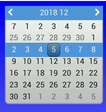

### canvas 画布控件

画布就是一块区域，我们可以在这个区内画很多小组件，比如矩形，文本，图像等等。

#### 缓冲区

canvas 需要一个缓冲区来存储绘制的图像，这个缓冲区可以是一个静态或者全局数组，例如
`static lv_color_t buffer[]`
也可以是动态内存申请的一个指针，例如
`lv_color_t *buf = (lv_color_t*)lv_mem_alloc(LV_HOR_RES*LV_VER_RES * 2);`
定义缓冲区后通过函数设置canvas 的缓冲区

```
lv_canvas_set_buffer(canvas, buf, width, height, LV_IMG_CF_...); /* 设置缓冲区*/
```

画布支持所有内置的颜色格式，在使用时可以根据颜色格式确定缓冲区的
大小。创建canvas 控件后必须先设置缓冲区再进行其他绘制工作。

#### 绘图

canvas 控件支持2D 绘图，例如绘制矩形、圆、线等等。也可以进行打点。函数`lv_canvas_set_px(canvas, x,y,c)` 可以填充canvas 上的某一个点。
也可以直接填充整个画布`lv_canvas_fill_bg(canvas,LV_COLOR_BLUE)`
可以将数组内的内容复制到画布上面
lv_canvas_copy_buf(canvas,buffer_to_copy,x,y,width,height) 使用这个函数需要注意缓冲区的颜色格式与画布相匹配。

#### 绘制函数

```c
lv_canvas_draw_rect(canvas, 100, 100, 100, 100, &style_draw); /* 画矩形*/
lv_canvas_draw_text(canvas, 10, 10, 200, &style_draw, "hello world",LV_LABEL_ALIGN_LEFT); /* 画文字*/
lv_canvas_draw_img(canvas, 100, 100, &lvgl_logo, &style_draw); /* 画图像*/
lv_canvas_draw_arc(canvas, 50, 100, 30, 0, 270, &style_draw); /* 画圆*/
 
lv_canvas_draw_polygon(canvas, polyon_point, 3, &style_draw); /* 画区域*/
lv_canvas_draw_line(canvas, line_point, 5, &style_draw); /* 画线*/
```


在进行绘制的时候需要指定样式，样式对应的属性会影响对应的图形，例如line 属性会影响线条的绘制。

#### demo

```c

LV_IMG_DECLARE(lvgl_logo)


lv_point_t polyon_point[3] = { {200,20}, {200,100}, {350,50} };
lv_point_t line_point[5] = { { 350, 30 }, { 350, 100 }, { 400, 100 }, { 400, 30 }, { 350, 30 } };


/**
  * @brief 控件测试函数
  * @param None
  * @retval	None
  */
void lv_obj_canvas_demo(void)
{


	/* 新建个样式 */
	static lv_style_t style_desktop;
	static lv_style_t style_draw;

	lv_style_copy(&style_desktop, &lv_style_scr);
	style_desktop.body.main_color = LV_COLOR_BLUE;		/* 设置底色 */

	/* 设置样式的字体颜色 */
	style_cn_12.text.color = LV_COLOR_WHITE;
	style_cn_16.text.color = LV_COLOR_WHITE;
	style_cn_24.text.color = LV_COLOR_WHITE;
	style_cn_32.text.color = LV_COLOR_WHITE;

	lv_obj_t *scr = lv_disp_get_scr_act(NULL);			/* 获取当前屏幕 */
	lv_obj_set_style(scr, &style_desktop);				/* 设置样式 */


	lv_style_copy(&style_draw, &lv_style_scr);
	style_draw.body.main_color = LV_COLOR_BLUE;
	style_draw.body.grad_color = style_draw.body.main_color;
	style_draw.line.color      = LV_COLOR_GREEN;

	lv_obj_t *canvas = lv_canvas_create(scr, NULL);					/* 创建 canvas 控件 */


	lv_color_t *buf = (lv_color_t*)lv_mem_alloc(LV_HOR_RES*LV_VER_RES * 2);		/* 申请一个屏幕大小的缓冲区供画布使用 */

	lv_canvas_set_buffer(canvas, buf, LV_HOR_RES, LV_VER_RES, LV_IMG_CF_TRUE_COLOR);	/* 设置缓冲区 */

	//lv_canvas_set_palette(canvas, 3, LV_COLOR_RED);

	lv_canvas_draw_rect(canvas, 100, 100, 100, 100, &style_draw);			/* 画矩形 */

	lv_canvas_draw_text(canvas, 10, 10, 200, &style_draw, "hello world", LV_LABEL_ALIGN_LEFT);	/* 画文字 */

	lv_canvas_draw_img(canvas, 100, 100, &lvgl_logo, &style_draw);			/* 画图像 */

	lv_canvas_draw_arc(canvas, 50, 100, 30, 0, 270, &style_draw);			/* 画圆 */

	lv_canvas_draw_polygon(canvas, polyon_point, 3, &style_draw);			/* 画区域 */

	lv_canvas_draw_line(canvas, line_point, 5, &style_draw);				/* 画线 */

	/* 图像的旋转显示 */
	lv_canvas_rotate(canvas, &lvgl_logo, 30, 0, 300, 0, 0);
	lv_canvas_rotate(canvas, &lvgl_logo, 60, 200, 300, lvgl_logo.header.w / 2, lvgl_logo.header.h / 2);
	lv_canvas_rotate(canvas, &lvgl_logo, -30, 0, 450, lvgl_logo.header.w / 2, lvgl_logo.header.h / 2);


	lv_obj_t *btn = lv_btn_create(canvas, NULL);			/* 创建位于画布上的按钮 */
	lv_obj_set_pos(btn, 300, 130);							/* 设置按钮坐标 */
}


```

运行效果

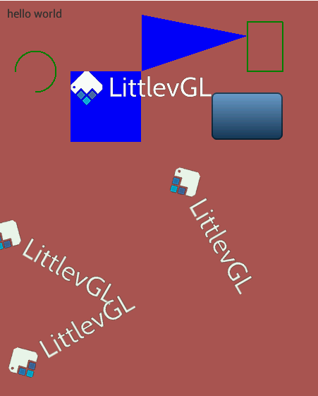

### cb 复选框控件

#### 文本

在前面的介绍中提到cb 控件包含了一个label 文本，可以通过函数修改文本，将会动态分配文本。

```c
lv_cb_set_text(cb, "New text")
```

也可以像label 一样设置静态文本txt，同样需要注意的是，静态文本txt必须是全局变量或者静态变量。

```c
static char txt[]={"hello,word"}
lv_cb_set_static_text( cb, txt)
```

#### 选中和取消

cb 控件可以通过按下进行选择，也可以手动将其选中或取消，函数

```
lv_cb_set_checked(cb, true/false)
```

#### 无效

可以通过函数`lv_cb_set_inactive(cb)` 禁用某个cb 控件，遗憾的是，在6.0 版本没有找到取消禁用的函数。从源码中得到的结果是禁用函数是通过btn的状态设置函数实现的（cb 控件是基于btn 构建的）。禁用cb 控件的实现步骤就是将对应的btn 对象设置为`LV_BTN_STATE_INA`，那么我们可以认为取消禁用就是将btn 对象的属性设置为`LV_BTN_STATE_REL`

#### 样式

cb 控件的样式使用以下函数进行修改：

```c
lv_cb_set_style(cb, LV_CB_STYLE_..., &style)
```

可用的样式属性如下：

- LV_CB_STYLE_BG 背景样式，使用所有style.body 属性，标签使用style.text 属性
- LV_CB_STYLE_BOX_REL 已释放的框的样式，使用style.body 属性
- LV_CB_STYLE_BOX_PR 按下的框的样式，使用style.body 属性
- LV_CB_STYLE_BOX_TGL_REL 选中的已释放的框的样式，使用style.body 属性
- LV_CB_STYLE_BOX_TGL_PR 选中的按下的框的样式，使用style.body 属性
- LV_CB_STYLE_BOX_INA 禁用状态框的样式，使用style.body 属性

#### 事件

除了通用事件以外，cb 控件还发送以下事件：

LV_EVENT_VALUE_CHANGED 切换复选框时发送。
请注意，与通用输入设备相关的事件（如LV_EVENT_PRESSED）在控件禁用
状态下也会发送。您需要检查状态`lv_cb_is_inactive(cb)`以忽略非活动复选框
中的事件。

#### demo

```C
static void cb1_event_cb(lv_obj_t * obj, lv_event_t event)
{
	uint32_t color = 0;
	switch (event) {
	case LV_EVENT_VALUE_CHANGED:
	color = gui_hal_led_get_current_color();
	(lv_cb_is_checked(obj) ? (color |= 0X000000FF) : (color &= ~(0X000000FF)));
	gui_hal_led_set_color(color);

	break;
	default:
	break;
	}
}

static void cb2_event_cb(lv_obj_t * obj, lv_event_t event)
{
	uint32_t color = 0;
	switch (event) {
	case LV_EVENT_VALUE_CHANGED:
	color = gui_hal_led_get_current_color();
	(lv_cb_is_checked(obj) ? (color |= 0X00FF0000) : (color &= ~(0X00FF0000)));
	gui_hal_led_set_color(color);
	break;
	default:
	break;
	}
}

static void cb3_event_cb(lv_obj_t * obj, lv_event_t event)
{
	uint32_t color = 0;
	switch (event) {
	case LV_EVENT_VALUE_CHANGED:
	color = gui_hal_led_get_current_color();
	(lv_cb_is_checked(obj) ? (color |= 0X0000FF00) : (color &= ~(0X0000FF00)));
	gui_hal_led_set_color(color);

	break;
	default:
	break;
	}
}


/**
  * @brief 控件测试函数
  * @param None
  * @retval	None
  */
void lv_obj_checkbox_demo(void)
{


	/* 新建个样式 */
	static lv_style_t style_desktop;
	static lv_style_t style_bg_cb;
	static lv_style_t style_box_cb1;
	static lv_style_t style_box_cb2;
	static lv_style_t style_box_cb3;

	lv_style_copy(&style_desktop, &lv_style_scr);
	style_desktop.body.main_color = LV_COLOR_BLUE;		/* 设置底色 */

	/* 设置样式的字体颜色 */
	style_cn_12.text.color = LV_COLOR_WHITE;
	style_cn_16.text.color = LV_COLOR_WHITE;
	style_cn_24.text.color = LV_COLOR_WHITE;
	style_cn_32.text.color = LV_COLOR_WHITE;

	lv_obj_t *scr = lv_disp_get_scr_act(NULL);			/* 获取当前屏幕 */
	lv_obj_set_style(scr, &style_desktop);				/* 设置样式 */


	lv_obj_t *cb1 = lv_cb_create(scr, NULL);				/* 创建 checkbox 控件 */
	lv_style_copy(&style_bg_cb, &lv_style_plain_color);		/* 复制样式 */
	style_bg_cb.text.font = style_cn_16.text.font;			/* 设置样式字体 */
	style_bg_cb.body.opa = 0;								/* 设置样式不透明度 */
	lv_cb_set_text(cb1, "红灯");							/* 设置复选框文字 */
	lv_cb_set_style(cb1, LV_CB_STYLE_BG, &style_bg_cb);		/* 设置复选框背景的样式 */
	lv_obj_align(cb1, NULL, LV_ALIGN_IN_TOP_MID, 0, 10);	/* 设置位置 */

	lv_style_copy(&style_box_cb1, &lv_style_btn_pr);		/* 复制样式,左边 box 的样式 */
	style_box_cb1.body.main_color = LV_COLOR_RED;			/* 设置样式主颜色为红色 */
	style_box_cb1.body.grad_color = LV_COLOR_RED;			/* 设置样式渐变色,跟主色一样 */
	lv_cb_set_style(cb1, LV_CB_STYLE_BOX_TGL_REL, &style_box_cb1);	/* 设置左边 box 被选中的样式 */

	lv_obj_set_event_cb(cb1, cb1_event_cb);					/* 设置对象事件回调函数 */


	lv_obj_t *cb2 = lv_cb_create(scr, cb1);					/* 创建 checkbox 控件,从前面创建的控件复制属性 */
	lv_cb_set_text(cb2, "蓝灯");							/* 设置文字 */
	lv_obj_align(cb2, cb1, LV_ALIGN_OUT_BOTTOM_MID, 0, 10);	/* 设置位置 */

	lv_style_copy(&style_box_cb2, &style_box_cb1);			/* 复制样式 */
	style_box_cb2.body.main_color = LV_COLOR_BLUE;			/* 设置样式主颜色为蓝色 */
	style_box_cb2.body.grad_color = LV_COLOR_BLUE;			/* 设置样式渐变色跟主色一致 */
	lv_cb_set_style(cb2, LV_CB_STYLE_BOX_TGL_REL, &style_box_cb2); /* 设置左边 box 被选中的样式 */

	lv_obj_set_event_cb(cb2, cb2_event_cb);					/* 设置对象事件回调函数 */

	lv_obj_t *cb3 = lv_cb_create(scr, cb1);					/* 创建 checkbox 控件,从前面创建的控件复制属性 */
	lv_cb_set_text(cb3, "绿灯");							/* 设置文字 */
	lv_obj_align(cb3, cb2, LV_ALIGN_OUT_BOTTOM_MID, 0, 10);	/* 设置位置 */

	lv_style_copy(&style_box_cb3, &style_box_cb1);			/* 复制样式 */
	style_box_cb3.body.main_color = lv_color_hex(0X00FF00);	/* 设置样式主颜色为绿色 */
	style_box_cb3.body.grad_color = lv_color_hex(0X00FF00);	/* 设置样式渐变色跟主色一致 */
	lv_cb_set_style(cb3, LV_CB_STYLE_BOX_TGL_REL, &style_box_cb3);	/* 设置左边 box 被选中的样式 */

	lv_obj_set_event_cb(cb3, cb3_event_cb);					/* 设置对象事件回调函数 */


	lv_obj_t *cb4 = lv_cb_create(scr, NULL);				/* 创建 checkbox 控件,从前面创建的控件复制属性 */
	lv_cb_set_text(cb4, "Check");							/* 设置文字 */
	lv_obj_align(cb4, cb3, LV_ALIGN_OUT_BOTTOM_MID, -100, 50);	/* 设置位置 */
	lv_cb_set_checked(cb4, true);							/* 设置选中 */


	lv_obj_t *cb5 = lv_cb_create(scr, NULL);				/* 创建 checkbox 控件,从前面创建的控件复制属性 */
	lv_cb_set_text(cb5, "Uncheck");							/* 设置文字 */
	lv_obj_align(cb5, cb3, LV_ALIGN_OUT_BOTTOM_MID, 0, 50);	/* 设置位置 */
	lv_cb_set_checked(cb5, false);							/* 设置取消选中 */


	lv_obj_t *cb6 = lv_cb_create(scr, NULL);				/* 创建 checkbox 控件,从前面创建的控件复制属性 */
	lv_cb_set_text(cb6, "Inactive");							/* 设置文字 */
	lv_obj_align(cb6, cb3, LV_ALIGN_OUT_BOTTOM_MID, 100, 50);	/* 设置位置 */
	lv_cb_set_inactive(cb6);								/* 禁用 */
	//lv_btn_set_state(cb6, LV_BTN_STATE_REL);

}

```

运行效果

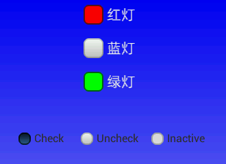

### chart 图表控件

#### 数据序列

在创建图表控件后，是一个空表格，我们需要在表格上添加数据后才是一个完整的表格。函数lv_chart_add_series(chart,color) ，该函数会返回一个`lv_chart_series_t` 结构的指针，利用这个指针就可以往数据集添加数据。

#### 数据序列类型

- LV_CHART_TYPE_NONE 不显示序列
- LV_CHART_TYPE_LINE 用线连接序列
- LV_CHART_TYPE_COLUMN 绘制列，相当于柱状
- LV_CHART_TYPE_POINT 绘制点
- LV_CHART_TYPE_VERTICAL_LINE 仅绘制垂直线以连接点。如果图表宽度等于点数，则很有用，因为它可以比LV_CHART_TYPE_AREA 绘制更快的速度
- LV_CHART_TYPE_AREA 绘制区域函数`lv_chart_set_type(chart, LV_CHART_TYPE_...)` 可以为数据序列设置显示类型，类型可以进行“或”运算，例如`LV_CHART_TYPE_LINE | LV_CHART_TYPE_POINT`


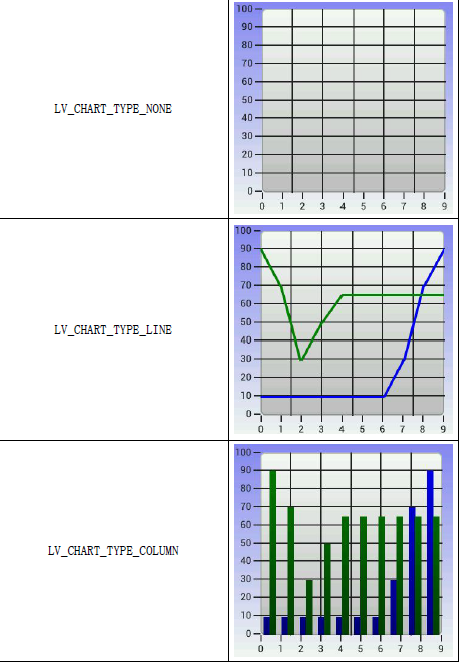

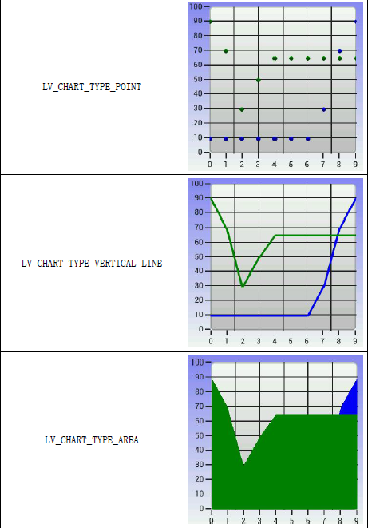


#### 修改数据

如果需要修改数据序列的值，可以通过以下方式：

- 在数组中单独设置某个值`ser2->points[0] = 90;` 然后刷新图表`lv_chart_refresh(chart1)`;
- 使用`lv_chart_set_next(chart, ser, value)` 设置下一个需要显示的值
- 将所有的点初始化为给定值`lv_chart_init_points(chart, ser, value)`
- 使用数组设置序列中的所有点`lv_chart_set_points(chart, ser, value_array)`使用`LV_CHART_POINT_DEF` 的值使库跳过绘制点，列或线段。

#### 更新模式

函数`lv_chart_set_next(chart, ser, value)` 可以根据更新模式来绘制

- LV_CHART_UPDATE_MODE_SHIFT 将旧数据向左移动并向右添加新数据
- LV_CHART_UPDATE_MODE_CIRCULAR 以循环方式添加新数据

可以使用下面函数 设置新的更新模式，默认为模式`LV_CHART_UPDATE_MODE_SHIF`

```c
lv_chart_set_update_mode(chart, LV_CHART_UPDATE_MODE_...)
```

#### 点数量

序列中点的数量可以修改，函数`lv_chart_set_point_count(chart, point_num)` ，默认值为10。需要注意的是，在设置点的数量以后，不要添加过多的点，否则会造成数组越界。

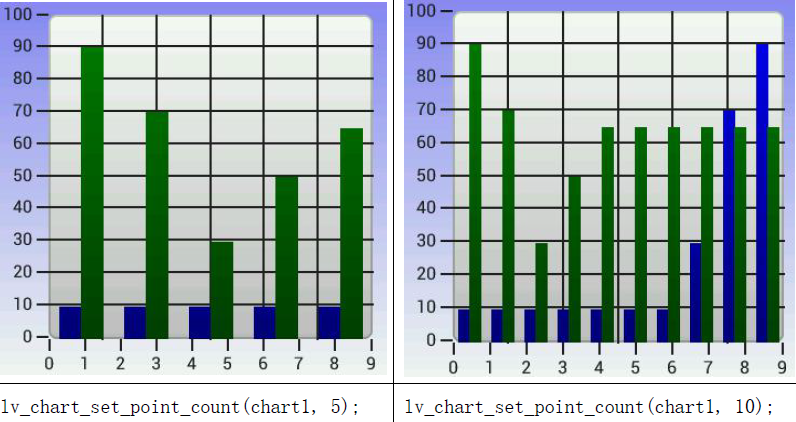

#### 垂直范围

可以通过函数来设置Y 轴上的最大值和最小值，点的值将按比例缩放，默认是0-100。

```c
lv_chart_set_range(chart, y_min, y_max) 
```

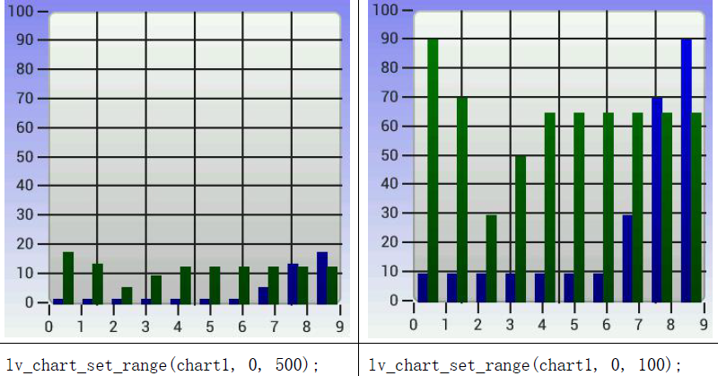

#### 分割线

水平方向和垂直方向的分割线可以通过函数进行修改，默认是3 条水平分割线和5 条垂直分割线。

```c
lv_chart_set_div_line_count(chart, hdiv_num, vdiv_num) 
```

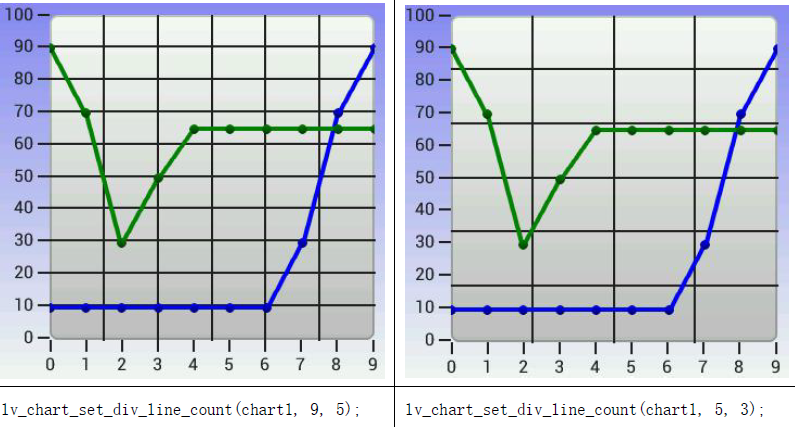

#### 序列的外观

要设置线条的宽和点的半径，使用函数

```c
lv_chart_set_series_width(chart, size) 		//默认为2。线的宽度和点的直径是同步变化的。
```


要设置序列的不透明度，可以使用函数

```c
lv_chart_set_series_opa(chart, opa)			// 默认为LV_OPA_COVER
```


可以在点或者柱状的底部设置颜色渐变，使用函数

```c
lv_chart_set_series_darking(chart, effect) //默认值为LV_OPA_50
```

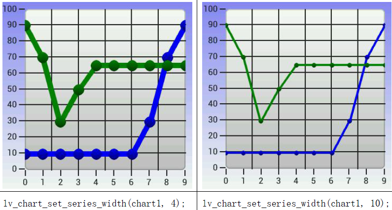

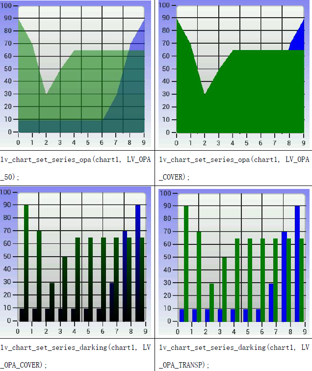

#### 刻度和标记

可以为X 轴或者Y 轴设置刻度和标签。需要注意的是，需要在图表周围为刻度线和文本添加一些额外的空间，否则，将无法看到绘制的刻度。

```c
// 扩展长度根据实际情况进行调整，主要考虑刻度线长度和文本大小。
lv_chart_set_margin(chart,50) 
```

```c
/*
* 用于在X 轴上面添加刻度和文本
* list_of_values的格式如下{"0\n1\n2\n3\n4\n5\n6\n7\n\8\n\9"}
* 每一个刻度后面都要带有’\n’但是最后一个不用
* 如果list_of_values 不为NULL，那么num_tick_marks 为两个标签之间的刻度数，
* 如果list_of_values 为NULL，num_tick_marks 分割刻度的总数。LV_CHART_AXIS_... 用于设置最* 后一个刻度是否绘制
*/
lv_chart_set_x_tick_text(chart, list_of_values, num_tick_marks, LV_CHART_AXIS_...) 
```

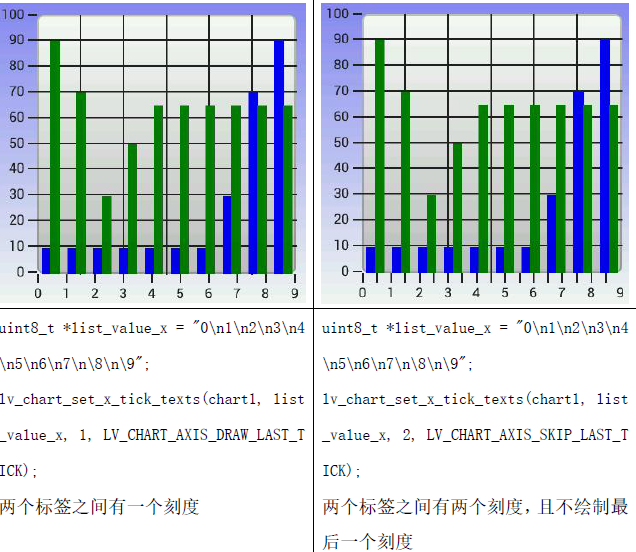

在两个标签之间有大于1 个刻度的时候，就会有主刻度线和次刻度线，主刻度线是有文本标签的，次刻度线就没有，可以设置主刻度线和次刻度线的长度，函数如下

```c
lv_chart_set_x_tick_length(chart, major_tick_len, minor_tick_len)
```

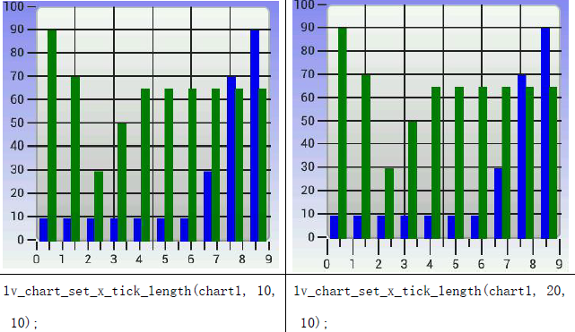

Y 轴的设置同X 轴一样。

#### 样式

chart 控件的样式使用以下函数进行修改：

```c
lv_chart_set_style(chart, LV_CHART_STYLE_MAIN, &style)
    
style.body 属性设置背景的外观
style.line 属性设置分割线的外观
style.text 属性设置轴标签的外观
```

####  事件

仅发送通用事件

常用的API函数

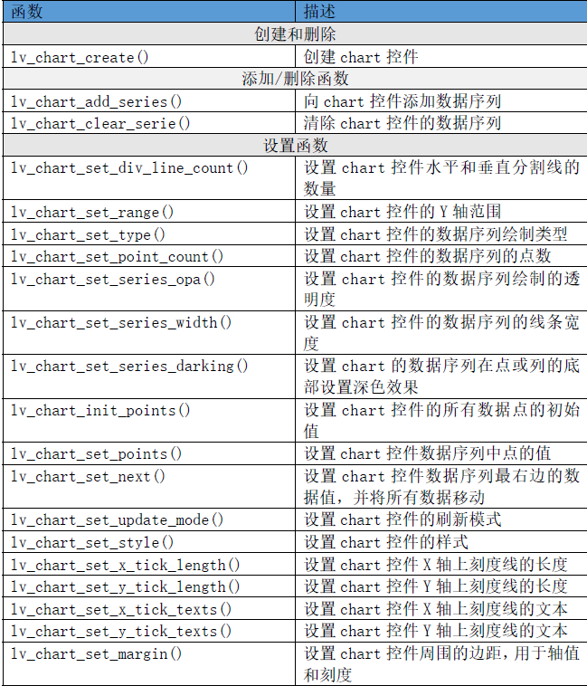

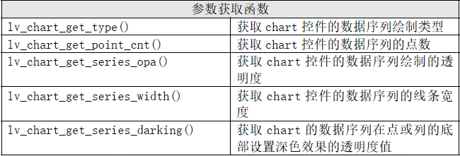

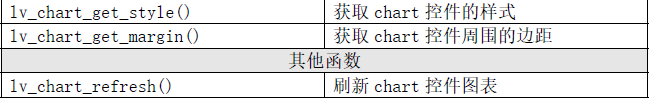

#### demo

```c

uint8_t *list_value_x = "0\n1\n2\n3\n4\n5\n6\n7\n\8\n\9";
uint8_t *list_value_y = "100\n90\n80\n70\n60\n50\n40\n30\n20\n10\n0";

lv_chart_series_t *ser_cpu;
lv_chart_series_t *ser_light;

void math_test(void)
{
	float a = 3.14159f;
	float b = 1.25697f;
	float c;
	uint32_t i = 0;

	for (i = 0; i < 65535; i++) {
		c = a * b;
		c = c * c;

	}
}
static void update_chart(lv_task_t *t)
{
	/* 更新图表 */
	lv_chart_set_next(t->user_data, ser_cpu,   gui_hal_cpuusage_get());
	lv_chart_set_next(t->user_data, ser_light, gui_hal_adc_light_get_ratio());
}


static void btn_event(lv_obj_t * obj, lv_event_t event)
{
	if (event == LV_EVENT_RELEASED) {
		math_test();
	}
}


/**
  * @brief 控件测试函数
  * @param None
  * @retval	None
  */
void lv_obj_chart_demo(void)
{


	/* 新建个样式 */
	static lv_style_t style_desktop;


	lv_style_copy(&style_desktop, &lv_style_scr);
	style_desktop.body.main_color = LV_COLOR_BLUE;		/* 设置底色 */

	/* 设置样式的字体颜色 */
	style_cn_12.text.color = LV_COLOR_WHITE;
	style_cn_16.text.color = LV_COLOR_WHITE;
	style_cn_24.text.color = LV_COLOR_WHITE;
	style_cn_32.text.color = LV_COLOR_WHITE;

	lv_obj_t *scr = lv_disp_get_scr_act(NULL);				/* 获取当前屏幕 */
	lv_obj_set_style(scr, &style_desktop);					/* 设置样式 */

	lv_obj_t *chart = lv_chart_create(scr, NULL);			/* 创建图表控件 */
	lv_obj_align(chart, NULL, LV_ALIGN_IN_TOP_MID, 0, 30);	/* 设置位置 */
	lv_chart_set_point_count(chart, 10);					/* 设置显示的点数量 */
	lv_chart_set_series_width(chart, 4);					/* 设置线宽度 */
	lv_chart_set_range(chart, 0, 100);						/* 设置范围0-100 */
	lv_chart_set_div_line_count(chart, 9, 5);				/* 设置分割线的数量 */
	lv_chart_set_margin(chart, 50);							/* 设置标注的扩展长度 用来显示那些刻度什么的，要根据需要调整 预留出来的空间 */
	lv_chart_set_type(chart, LV_CHART_TYPE_POINT | LV_CHART_TYPE_LINE);	/* 显示方式 显示点和线 */
	lv_chart_set_x_tick_texts(chart, list_value_x, 1, LV_CHART_AXIS_DRAW_LAST_TICK);	/* 设置x轴标注的文本 */
	lv_obj_set_size(chart, 300, 300);						/* 设置控件，就是整个图表chart尺寸 */
	lv_chart_set_x_tick_length(chart, 10, 10);				/* X轴刻度线长度，分为主刻度线和副刻度线 */
	lv_chart_set_y_tick_texts(chart, list_value_y, 1, LV_CHART_AXIS_DRAW_LAST_TICK);	/* 设置Y轴标注的文本 */
	lv_chart_set_y_tick_length(chart, 10, 10);				/* Y轴刻度线长度，分为主刻度线和副刻度线 */


	ser_cpu   = lv_chart_add_series(chart, LV_COLOR_RED);				/* 创建线条 */
	ser_light = lv_chart_add_series(chart, LV_COLOR_BLUE);				/* 创建线条 */

	lv_task_create(update_chart, 500, LV_TASK_PRIO_LOW, chart);			/* 创建定期更新的任务 */


	lv_obj_t *btn = lv_btn_create(scr, NULL);							/* 创建按钮 */
	lv_obj_t *label_btn = lv_label_create(btn, NULL);					/* 创建按钮的文本 */
	lv_label_set_style(label_btn, LV_LABEL_STYLE_MAIN, &style_cn_16);	/* 设置控件样式为中文字体的样式 */
	lv_label_set_text(label_btn, "\xe5\xbc\x80\xe5\xa7\x8b\xe8\xbf\x90\xe7\xae\x97"); /* 设置文本 */
	//lv_label_set_text(label_btn, "开始运算"); /* 设置文本 */
	lv_obj_align(btn, chart, LV_ALIGN_OUT_BOTTOM_MID, 0, 30);		/* 设置位置 */
	lv_obj_set_event_cb(btn, btn_event);							/* 设置对象事件回调函数 */

	/*
	 *  右边的标签，
	 */

	lv_obj_t *label1 = lv_label_create(scr, NULL);					/* 创建label控件 */
	lv_obj_align(label1, chart, LV_ALIGN_OUT_RIGHT_MID, 0, -10);	/* 设置位置 */
	lv_label_set_recolor(label1, true);								/* 允许文字重新着色 */
	lv_label_set_text(label1, "#FF0000 RED:CPU#");					/* 设置文字 */
	lv_label_set_body_draw(label1, true);							/* 允许绘制body */
	lv_label_set_style(label1, LV_LABEL_STYLE_MAIN, &lv_style_scr);	/* 重设样式 */

	lv_obj_t *label2 = lv_label_create(scr, label1);				/* 创建label控件 */
	lv_obj_align(label2, chart, LV_ALIGN_OUT_RIGHT_MID, 0, 10);		/* 设置位置 */
	lv_label_set_text(label2, "#0000FF BLUE:LIGHT#");				/* 设置文字 */

	/*
	 *  下面是第二个图表了
	 */

	lv_obj_t *chart1 = lv_chart_create(scr, NULL);				/* 创建图表控件 */
	lv_obj_align(chart1, NULL, LV_ALIGN_IN_TOP_MID, 0, 450);	/* 设置位置 */
	lv_chart_set_point_count(chart1, 10);						/* 设置显示的点数量 */
	lv_chart_set_series_width(chart1, 4);						/* 设置线宽度 */
	lv_chart_set_series_darking(chart1, LV_OPA_TRANSP);
	lv_chart_set_series_opa(chart1, LV_OPA_COVER);
	lv_chart_set_range(chart1, 0, 100);							/* 设置范围0-100 */
	lv_chart_set_div_line_count(chart1, 9, 5);					/* 设置分割线的数量 */
	lv_chart_set_margin(chart1, 50);							/* 设置标注的扩展长度 */
	lv_chart_set_type(chart1, LV_CHART_TYPE_POINT | LV_CHART_TYPE_LINE);	/* 显示方式 */
	lv_chart_set_x_tick_texts(chart1, list_value_x, 2, LV_CHART_AXIS_DRAW_LAST_TICK);	/* 设置标注的文本 */
	lv_obj_set_size(chart1, 300, 300);							/* 设置控件尺寸 */
	lv_chart_set_x_tick_length(chart1, 20, 10);					/* 刻度线长度 */
	lv_chart_set_y_tick_texts(chart1, list_value_y, 1, LV_CHART_AXIS_DRAW_LAST_TICK);	/* 设置标注的文本 */
	lv_chart_set_y_tick_length(chart1, 10, 10);					/* 刻度线长度 */


	/* 创建线条 */
	lv_chart_series_t * ser1 = lv_chart_add_series(chart1, LV_COLOR_BLUE);
	lv_chart_series_t * ser2 = lv_chart_add_series(chart1, LV_COLOR_GREEN);

	/* 设置数据序列的值 一个一个设置*/
	lv_chart_set_next(chart1, ser1, 10);
	lv_chart_set_next(chart1, ser1, 10);
	lv_chart_set_next(chart1, ser1, 10);
	lv_chart_set_next(chart1, ser1, 10);
	lv_chart_set_next(chart1, ser1, 10);
	lv_chart_set_next(chart1, ser1, 10);
	lv_chart_set_next(chart1, ser1, 10);
	lv_chart_set_next(chart1, ser1, 30);
	lv_chart_set_next(chart1, ser1, 70);
	lv_chart_set_next(chart1, ser1, 90);

	/* 设置数据序列的值 先准备好数据，然后整体刷新*/
	ser2->points[0] = 90;
	ser2->points[1] = 70;
	ser2->points[2] = 30;
	ser2->points[3] = 50;
	ser2->points[4] = 65;
	ser2->points[5] = 65;
	ser2->points[6] = 65;
	ser2->points[7] = 65;
	ser2->points[8] = 65;
	ser2->points[9] = 65;

	lv_chart_refresh(chart1); /* 刷新图表 */
}
```

运行效果如下

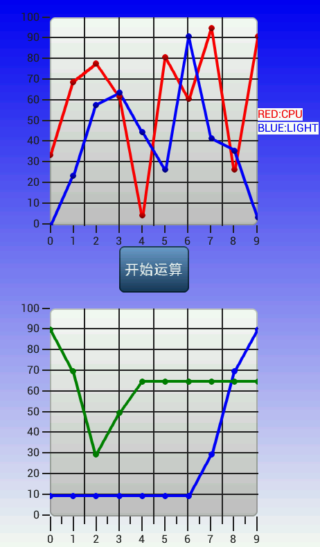

### cont 容器控件
cont 控件可以为子对象提供一个容器，可以设置其布局，其本质上是具有某些特殊功能的基本对象。
#### 布局
可以为容器设置布局，其子对象根据布局进行调整。布局的间距来自样式的style.body.padding 属性。布局选项如下：
- LV_LAYOUT_OFF 没有布局调整
- LV_LAYOUT_CENTER 将子项与列中的中心对齐
- LV_LAYOUT_COL_L 在左对齐的列中对齐子对象
- LV_LAYOUT_COL_M 在居中列中对齐子对象
- LV_LAYOUT_COL_R 在右对齐的列中对齐子对象
- LV_LAYOUT_ROW_T 在顶部对齐的行中对齐子对象
- LV_LAYOUT_ROW_M 在居中行中对齐子对象
- LV_LAYOUT_ROW_B 在底部对齐的行中对齐子对象
- LV_LAYOUT_PRETTY 将尽可能多的对象放在行中并开始新的行
- LV_LAYOUT_GRID 将相同大小的对象对齐到网格中

演示代码

```c
cont2 = lv_cont_create(scr, NULL); /* 创建cont 控件*/
lv_style_copy(&style_cont, lv_cont_get_style(cont2, LV_CONT_STYLE_MAIN));
style_cont.body.padding.top = 10;
style_cont.body.padding.bottom = style_cont.body.padding.top;
style_cont.body.padding.left = style_cont.body.padding.top;
style_cont.body.padding.right = style_cont.body.padding.top;
style_cont.body.padding.inner = style_cont.body.padding.top;

lv_cont_set_style(cont2, LV_CONT_STYLE_MAIN, &style_cont);
lv_obj_set_size(cont2,lv_obj_get_width(lv_scr_act()),400);

lv_cont_set_fit(cont2, LV_FIT_NONE); /* 关闭自动调整模式*/
uint8_t buf[8] = {0};
for (size_t i = 0; i < 6; i++)
{
	lv_obj_t *btn2 = lv_btn_create(cont2, NULL); /* 创建位于cont 上的btn */
	lv_obj_t *label_btn2 = lv_label_create(btn2, NULL);/* 创建btn 上面的label */
	sprintf(buf,"btn%d",i);
	lv_label_set_text(label_btn2, buf); /* 设置文字*/
	
}

//然后设置不同的容器布局
lv_cont_set_layout(cont2, LV_LAYOUT_...); /* 设置容器布局*/

```

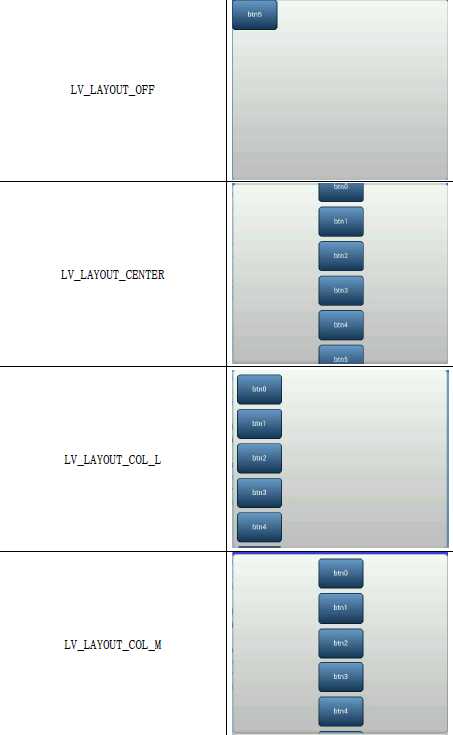

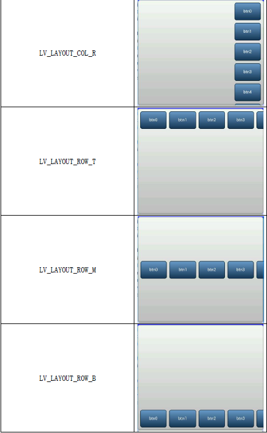

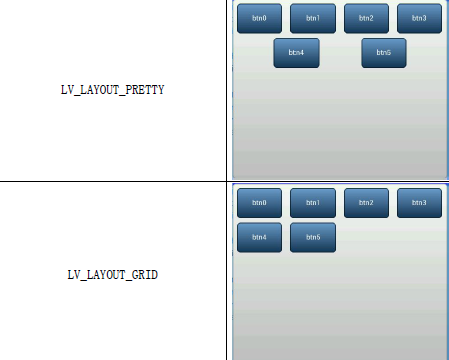


#### 自动调整

在布局的演示中我们关闭了cont 的自动调整是为了演示子对象的布局，在有些场合我们可以根据子对象调整cont 控件。
cont 控件可以根据其父对象大小或者其子对象自动调整自身尺寸，自动调整策略有以下选项：

- LV_FIT_NONE 不自动更改大小
- LV_FIT_TIGHT 收缩包围在子对象上
- LV_FIT_FLOOD 将尺寸与父对象的边缘对齐
- LV_FIT_FILL 首先将尺寸与父对象的边缘对齐，但是如果其中没有对象，则将其放大

可以单独设置水平或者垂直方向的调整策略
```c
lv_cont_set_fit2(cont, hor, ver)
```

也可以单独设置每一个方向的调整策略
```c
lv_cont_set_fit4(cont, left, right, top, bottom)
```
或者为每个方向都设置同样的自动调整策略
```c
lv_cont_set_fit(cont, fit)
```

#### 样式
cont 控件的样式使用以下函数进行修改：使用style.body 属性
```c
lv_cont_set_style(cont, LV_CONT_STYLE_MAIN, &style)
```
#### 事件
仅发送通用事件。

#### 常用API
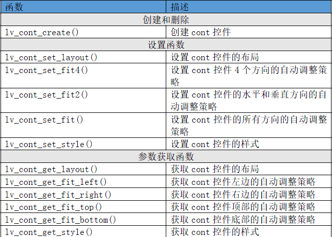

#### demo
```c
static lv_obj_t *cont2;
static const uint8_t *btnm_map1[] = { "LV_LAYOUT_OFF", "LV_LAYOUT_CENTER", "\n",
									"LV_LAYOUT_COL_L", "LV_LAYOUT_COL_M", "LV_LAYOUT_COL_R", "\n",
									"LV_LAYOUT_ROW_T", "LV_LAYOUT_ROW_M", " LV_LAYOUT_ROW_B", "\n",
									"LV_LAYOUT_PRETTY", " LV_LAYOUT_GRID", "" };

static void btn_event_cb(lv_obj_t *obj, lv_event_t event)
{
	if (event == LV_EVENT_RELEASED) {
		/* 按一次按钮往容器添加一个label */
		lv_obj_t *label1 = lv_label_create(lv_obj_get_user_data(obj), NULL);
		lv_label_set_text(label1, "new text");
	}
}


static void btnm_event_cb(lv_obj_t *obj, lv_event_t event)
{
	if (event == LV_EVENT_VALUE_CHANGED) {
		//lv_btnm_get_active_btn();
		lv_cont_set_layout(cont2, lv_btnm_get_active_btn(obj)); /* btnm 上的索引不同，重新设置cont2的布局*/
		lv_btnm_clear_btn_ctrl_all(obj, LV_BTNM_CTRL_TGL_STATE); // 清除btnm 所有按钮的控制属性
		lv_btnm_set_btn_ctrl(obj, lv_btnm_get_active_btn(obj), LV_BTNM_CTRL_TGL_STATE); //设置btnm 所有按钮的控制属性
	}
}


/**
  * @brief 控件测试函数
  * @param None
  * @retval	None
  */
void lv_obj_cont_demo(void)
{


	/* 新建个样式 */
	static lv_style_t style_desktop;
	static lv_style_t style_cont;


	lv_style_copy(&style_desktop, &lv_style_scr);
	style_desktop.body.main_color = LV_COLOR_BLUE;		/* 设置底色 */

	/* 设置样式的字体颜色 */
	style_cn_12.text.color = LV_COLOR_WHITE;
	style_cn_16.text.color = LV_COLOR_WHITE;
	style_cn_24.text.color = LV_COLOR_WHITE;
	style_cn_32.text.color = LV_COLOR_WHITE;

	lv_obj_t *scr = lv_disp_get_scr_act(NULL);					/* 获取当前屏幕 */
	lv_obj_set_style(scr, &style_desktop);						/* 设置样式 */

	/*
	 * 第一个容器 按钮按下的时候，会增加一个label，这个时候容器会自动调整大小来存放label
	 */
	lv_obj_t *cont1 = lv_cont_create(scr, NULL);				/* 创建cont控件 */
	lv_cont_set_fit(cont1, LV_FIT_TIGHT);						/* 设置自动调整模式 */
	lv_obj_align(cont1, NULL, LV_ALIGN_IN_TOP_MID, 0, 20);		/* 设置位置 */
	lv_cont_set_layout(cont1, LV_LAYOUT_COL_M);					/* 设置容器布局为居中对齐 */

	lv_obj_t *label1 = lv_label_create(cont1, NULL);			/* 创建位于cont上的label */
	lv_label_set_text(label1, "text1");							/* 设置文本 */

	lv_obj_t *label2 = lv_label_create(cont1, NULL);			/* 创建位于cont上的label */
	lv_label_set_text(label2, "It is a long text");				/* 设置文本 */

	lv_obj_t *btn = lv_btn_create(cont1, NULL);					/* 创建位于cont上的btn */
	lv_obj_t *label_btn = lv_label_create(btn, NULL);			/* 创建btn上面的label */
	lv_label_set_text(label_btn, "add text");					/* 设置文字 */
	lv_obj_set_event_cb(btn, btn_event_cb);						/* 设置对象的事件回调函数 */
	lv_obj_set_user_data(btn, cont1);							/* 设置对象的用户数据 */


	/*
	 * 第二个容器：关闭自动调整模式，当btnm按钮按下的时候，根据不同的键值，在btnm回调函数中设置容器的布局
	 */
	cont2 = lv_cont_create(scr, NULL);				/* 创建cont控件 */

	/* 复制样式 */
	lv_style_copy(&style_cont, lv_cont_get_style(cont2, LV_CONT_STYLE_MAIN));
	/* 修改样式属性 */
	style_cont.body.padding.top = 10;
	style_cont.body.padding.bottom = style_cont.body.padding.top;
	style_cont.body.padding.left = style_cont.body.padding.top;
	style_cont.body.padding.right = style_cont.body.padding.top;
	style_cont.body.padding.inner = style_cont.body.padding.top;
	/* 设置样式 */
	lv_cont_set_style(cont2, LV_CONT_STYLE_MAIN, &style_cont);

	lv_obj_set_size(cont2, lv_obj_get_width(lv_scr_act()), 400);/* 设置控件尺寸 */
	lv_cont_set_fit(cont2, LV_FIT_NONE);						/* 关闭自动调整模式 */
	lv_obj_align(cont2, NULL, LV_ALIGN_IN_LEFT_MID, 0, 0);		/* 设置位置 */
	lv_cont_set_layout(cont2, LV_LAYOUT_OFF);					/* 设置容器布局 */

	uint8_t buf[8] = { 0 };
	for (size_t i = 0; i < 6; i++) {
		lv_obj_t *btn2 = lv_btn_create(cont2, NULL);					/* 创建位于cont上的btn */
		lv_obj_t *label_btn2 = lv_label_create(btn2, NULL);			/* 创建btn上面的label */
		sprintf(buf, "btn%d", i);
		lv_label_set_text(label_btn2, buf);					/* 设置文字 */
	}


	/* 创建一个btnm控制cont的布局 */
	lv_obj_t *btnm = lv_btnm_create(scr, NULL);
	lv_btnm_set_map(btnm, btnm_map1);
	lv_obj_set_width(btnm, lv_obj_get_width(scr));
	lv_obj_align(btnm, NULL, LV_ALIGN_IN_BOTTOM_MID, 0, 0);
	lv_obj_set_event_cb(btnm, btnm_event_cb);


}
```

运行效果如下

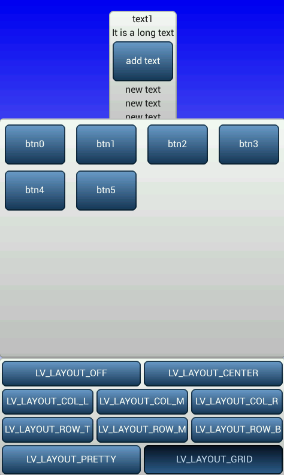

### ddlist 下拉列表控件
#### 设置选项
```c
//options 选项字符串之间通过‘\n’进行分隔，例如"red\ngreen\nblue\nyellow\nwhite\nblack";
lv_ddlist_set_options(ddlist,options) 


//手动设置一个选择项。
lv_ddlist_set_selected(ddlist, id) // 其中id 是选项的索引

```

#### 获取选中项目
```c

//可以获取当前所选选项的字符串，它将所选选项的字符串复制到buf。
lv_ddlist_get_selected_str(ddlist, buf, buf_size) 
```

#### 对齐
选项的文本可以设置对齐方式
```c
lv_ddlist_set_align(ddlist, LV_LABEL_ALIGN_LEFT/CENTER/RIGHT) //可以选择左对齐/居中/右对齐
```
#### 高度和宽度
在下拉列表没打开的时候，库会根据样式和文本大小自动计算高度。在下拉列表打开后，用户可以定义一个固定的高度，
如果高度不能容纳所有的选项显示，可以上下滑动进行选择。如果height 设置为0，那么将会使用自动高度。
```c
lv_ddlist_set_fix_height(ddlist, height)
```
宽度也会自动进行调整，我们可以定义一个固定的宽度，这里的width 设置为0 可以使用自动宽度，大于0 使用用户定义的宽度。需要注意的是，在使用自动宽度的时候，需要确保选项的文本能够正确显示，如果宽度不够显示，库会提供左右滑动的功能，但还是需要开发者设计一个合理的布局
```c
lv_ddlist_set_fix_width(ddlist, width)
```
#### 滚动条

当列表展开后，如果控件的高度或者宽度不足以显示所有的文本，就能够使能滑动功能，也会在底部或者右边出现滚动条，可以通过函数设置滚动条的显示模式
```c
lv_ddlist_set_sb_mode(ddlist, LV_SB_MODE_...) 
```
- LV_SB_MODE_OFF 从不显示滚动条
- LV_SB_MODE_ON 始终显示滚动条
- LV_SB_MODE_DRAG 拖动页面时显示滚动条
- LV_SB_MODE_AUTO 当可滚动容器足够大以进行滚动时显示滚动条
- LV_SB_MODE_HIDE 暂时隐藏滚动条
- LV_SB_MODE_UNHIDE 取消隐藏先前隐藏的滚动条。也恢复其类型

#### 动画时间
下拉列表的打开和关闭的动作可以设置动画时间
```c
lv_ddlist_set_anim_time(ddlist, anim_time) //参数anim_time 设置为0 表示没有动画
```
#### 装饰箭头
下拉列表右侧的向下的箭头可以手动进行设置
```c
lv_ddlist_set_draw_arrow(ddlist, true/false) //默认是关闭的
```

#### 手动打开/关闭
可以使用代码手动打开或者关闭下拉列表
```c
lv_ddlist_open/close(ddlist, anim) //参数anim 表示是否使能动画，在不通过输入设备打开或关闭的时候，这个函数非常有用
```

#### 保持开放
当选择一个选项后，可以强制让下拉列表保持打开的状态。
```c
lv_ddlist_set_stay_open(ddlist, true)//也可以手动打开下拉列表然后保持打开，这样下拉列表就会从初始化开始保持打开状态。
```
#### 样式
ddlist 控件的样式使用以下函数进行修改：
```c
lv_ddlist_set_style(ddlist, LV_DDLIST_STYLE_..., &style)
```
可用的样式选项如下：
- LV_DDLIST_STYLE_BG 背景样式，使用style.body 属性，文本使用style.text 属性
- LV_DDLIST_STYLE_SEL 所选选项的样式，使用style.body 属性，所选的选项将使用style.text.color 重新着色
- LV_DDLIST_STYLE_SB 滚动条样式，使用style.body 属性

#### 事件
除了通用事件以外，ddlist 还发送以下事件：LV_EVENT_VALUE_CHANGED 选择新选项时发送
#### 常用API

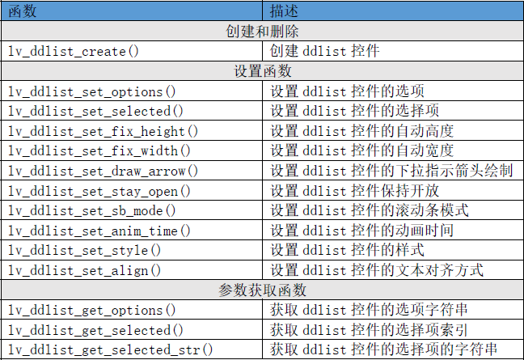

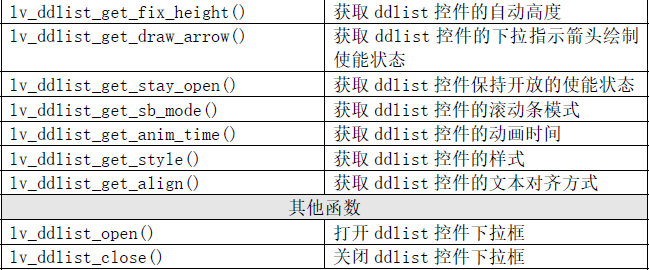

#### demo

```c
const uint8_t *list1_option = "red\ngreen\nblue\nyellow\nwhite\nblack";

static void ddlist_event(lv_obj_t * obj, lv_event_t event)
{
	uint8_t select = 0;
	if (event == LV_EVENT_VALUE_CHANGED) {
		char buf[32];
		lv_ddlist_get_selected_str(obj, buf, sizeof(buf));
		select = lv_ddlist_get_selected(obj);
		switch (select) {
		case 0:
		gui_hal_led_set_color(0X000000FF);
		break;
		case 1:
		gui_hal_led_set_color(0X0000FF00);
		break;
		case 2:
		gui_hal_led_set_color(0X00FF0000);
		break;
		case 3:
		gui_hal_led_set_color(0X0000FFFF);
		break;
		case 4:
		gui_hal_led_set_color(0X00FFFFFF);
		break;
		case 5:
		gui_hal_led_set_color(0X00000000);
		break;
		default:
		break;

		}
		printf("Option: %s index:%d\n", buf, lv_ddlist_get_selected(obj));
	}
}


/**
  * @brief 控件测试函数
  * @param None
  * @retval	None
  */
void lv_obj_ddlist_demo(void)
{


	/* 新建个样式 */
	static lv_style_t style_desktop;
	static lv_style_t style_ddlist_bg;


	lv_style_copy(&style_desktop, &lv_style_scr);
	style_desktop.body.main_color = LV_COLOR_BLUE;		/* 设置底色 */

	/* 设置样式的字体颜色 */
	style_cn_12.text.color = LV_COLOR_WHITE;
	style_cn_16.text.color = LV_COLOR_WHITE;
	style_cn_24.text.color = LV_COLOR_WHITE;
	style_cn_32.text.color = LV_COLOR_WHITE;

	lv_obj_t *scr = lv_disp_get_scr_act(NULL);				/* 获取当前屏幕 */
	lv_obj_set_style(scr, &style_desktop);					/* 设置样式 */

	lv_obj_t *ddlist1 = lv_ddlist_create(scr, NULL);		/* 创建ddlist控件 */

	/* 复制样式并修改一些属性 */
	lv_style_copy(&style_ddlist_bg, lv_ddlist_get_style(ddlist1, LV_DDLIST_STYLE_BG));
	style_ddlist_bg.body.padding.left = 10;
	style_ddlist_bg.body.padding.right = 10;
	style_ddlist_bg.body.padding.top = 10;
	style_ddlist_bg.body.padding.bottom = 10;
	style_ddlist_bg.text.line_space = 10;		/* 文字的垂直间距,这个属性可以增加每个选项的高度 */

	/* 设置样式 */
	lv_ddlist_set_style(ddlist1, LV_DDLIST_STYLE_BG, &style_ddlist_bg);

	lv_ddlist_set_anim_time(ddlist1, 100);		/* 设置动画时间 */
	lv_ddlist_set_options(ddlist1, list1_option);	/* 设置选项 */
	lv_ddlist_set_fix_width(ddlist1, 150);			/* 设置宽度 */
	//lv_ddlist_set_fix_height(ddlist1, 100);		/* 设置高度 */
	//lv_ddlist_set_sb_mode(ddlist1, LV_SB_MODE_UNHIDE);	/* 设置滚动条模式 */
	lv_ddlist_open(ddlist1, true);					/* 打开ddlist下拉 */
	lv_ddlist_set_draw_arrow(ddlist1, true);		/* 显示下拉箭头 */
	lv_obj_align(ddlist1, NULL, LV_ALIGN_IN_TOP_MID, 0, 20);	/* 设置位置 */
	lv_obj_set_event_cb(ddlist1, ddlist_event);		/* 设置事件回调函数 */

}
```

运行效果如下：

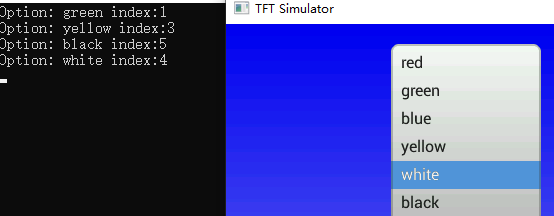

### gauge 量规控件
gauge 控件是带有刻度和标签的仪表。可以用于数据值的图形化显示，显示速度、温湿度或者其他数值。

#### 刻度和标签
gauge 控件创建后，默认角度为220度，6个比例标签和21条线。利用函数可以重设刻度角度以及标签和线的数量
```
lv_gauge_set_scale(gauge, angle, line_num, label_cnt)
```

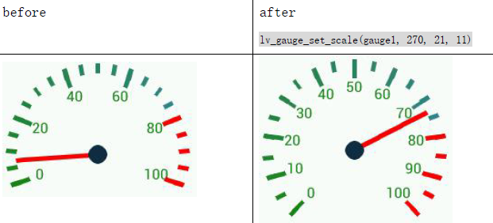

在设置比例标签的数量后，控件会根据标签的数量自动绘制一些加长的刻度线。我们在设计的时候需要注意加长刻度线的美观问题
一般在计算线的数量和标签数量的时候，(线条的数量-1) /(标签的数量-1) 如果为整数的话，加长的线刚好可以绘制在原来的线上面。这样看起来会比较
美观。

#### 指针
gauge 控件在初始化的时候会自带一个指针，他可以显示多于一根指针
```c
/* 
* 数可以指定指针的数量，为每根指针设置颜色。colors[]是lv_color_t 格式的
* 数组，该数组必须是静态或全局变量，因为仅存储其指针。
*/
lv_gauge_set_needle_count(gauge, needle_cnt, colors[]) 
```

```c
/* 
* 指针的值可以通过函数进行修改，
* needle_id 是指针的索引值。设置后指针会指向对应的值的刻度。
*/
lv_gauge_set_value(gauge, needle_id, value) 
```

#### 范围
gauge 控件默认的范围是0-100
```c
lv_gauge_set_range(gauge, min, max) //指定其最大值和最小值。
```

#### 临界值
可以使用函数设置临界值，使得超过这个临界值的刻度可以改变颜色，默认值80，更改颜色请查看样式部分
```c
lv_gauge_set_critical_value(gauge, value)  
```

#### 样式
gauge 控件的样式使用以下函数进行修改：
```c
/*
* 使用以下属性
* body.main_color 比例尺开始处的线条颜色。
* body.grad_color 比例尺末端的线条颜色（与主色的渐变）。
* body.padding.left 行长。
* body.padding.inner 标签与比例线的距离。
* body.radius 针原点圆的半径。
* line.width 线宽。
* line.color 临界值之后的线条颜色。
* text.font / color / letter_space 标签属性。
*/

lv_gauge_set_style(gauge, LV_GAUGE_STYLE_MAIN, &style)

```

#### 事件
仅发送通用事件

#### 常用API

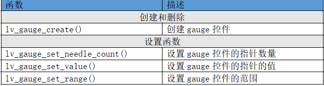

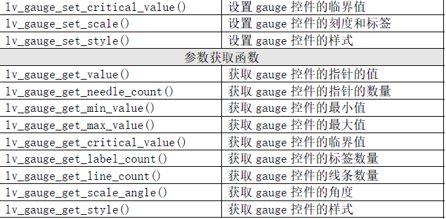

#### demo

```c

static void gauge1_adjust(lv_task_t *t)
{
	static uint8_t value = 0;
	static uint8_t dir = 1;
	if (dir)
		value++;
	else
		value--;
	if (value >= 100)
		dir = 0;
	if (value == 0)
		dir = 1;

	lv_gauge_set_value(t->user_data, 0, value);

}

static void gauge2_adjust(lv_task_t *t)
{
	lv_gauge_set_value(t->user_data, 0, gui_hal_adc_light_get_ratio());

}


/**
  * @brief 控件测试函数
  * @param None
  * @retval	None
  */
void lv_obj_gauge_demo(void)
{


	/* 新建个样式 */
	static lv_style_t style_desktop;
	static lv_style_t style_gauge1;

	/* 用于存储指针颜色的数组 */
	static lv_color_t needle_colors[2];
	needle_colors[0] = LV_COLOR_BLUE;
	needle_colors[1] = LV_COLOR_ORANGE;

	lv_style_copy(&style_desktop, &lv_style_scr);
	style_desktop.body.main_color = LV_COLOR_WHITE;		/* 设置底色 */


	/* 设置样式的字体颜色 */
	style_cn_12.text.color = LV_COLOR_WHITE;
	style_cn_16.text.color = LV_COLOR_WHITE;
	style_cn_24.text.color = LV_COLOR_WHITE;
	style_cn_32.text.color = LV_COLOR_WHITE;

	lv_obj_t *scr = lv_disp_get_scr_act(NULL);				/* 获取当前屏幕 */
	lv_obj_set_style(scr, &style_desktop);					/* 设置样式 */


	lv_style_copy(&style_gauge1, &lv_style_pretty_color);

	style_gauge1.body.main_color = lv_color_hex(0x228b22);		/* 比例尺开始处的线条颜色 */
	style_gauge1.body.grad_color = lv_color_hex(0x4488bb);		/* 比例尺末端的线条颜色(与主色的渐变) */
	style_gauge1.body.padding.left = 10;						/* 行长 */
	style_gauge1.body.padding.inner = 1;						/* 标签与比例线的距离 */
	style_gauge1.body.radius = 10;								/* 针原点圆的半径 */
	style_gauge1.line.width = 5;								/* 线宽 */
	style_gauge1.line.color = LV_COLOR_RED;						/* 临界值之后的线条颜色 */
	style_gauge1.text.color = lv_color_hex(0x228b22);			/* 文本颜色 */


	lv_obj_t *gauge1 = lv_gauge_create(scr, NULL);				/* 创建gauge控件 */
	lv_obj_align(gauge1, NULL, LV_ALIGN_IN_TOP_LEFT, 10, 20);	/* 设置位置 */
	lv_gauge_set_value(gauge1, 0, 10);							/* 设置范围值 */
	lv_gauge_set_critical_value(gauge1, 80);					/* 设置临界值 */
	lv_gauge_set_style(gauge1, LV_GAUGE_STYLE_MAIN, &style_gauge1);	/* 设置样式 */
	lv_gauge_set_scale(gauge1, 270, 16, 6);						/* 设置刻度和标签 */


	lv_obj_t *label = lv_label_create(scr, NULL);				/* 创建label控件 */
	lv_label_set_text(label, "AUTO");							/* 设置文本 */
	lv_obj_align(label, gauge1, LV_ALIGN_OUT_TOP_MID, 0, 0);	/* 设置位置 */


	lv_obj_t *gauge2 = lv_gauge_create(scr, NULL);				/* 创建gauge控件 */
	lv_obj_align(gauge2, NULL, LV_ALIGN_IN_TOP_RIGHT, -10, 20);	/* 设置位置 */
	lv_gauge_set_needle_count(gauge2, 2, needle_colors);		/* 设置指针数量 */
	lv_gauge_set_value(gauge2, 1, 60);							/* 设置指针的值 */

	lv_obj_t *labe2 = lv_label_create(scr, NULL);				/* 创建label控件 */
	lv_label_set_text(labe2, "LIGHT");							/* 设置文本 */
	lv_obj_align(labe2, gauge2, LV_ALIGN_OUT_TOP_MID, 0, 0);	/* 设置位置 */

	lv_task_create(gauge1_adjust, 100, LV_TASK_PRIO_LOW, gauge1);	/* 创建任务刷新gauge指针的值 */

	lv_task_create(gauge2_adjust, 100, LV_TASK_PRIO_LOW, gauge2);	/* 创建任务刷新gauge指针的值 */


}
```
运行效果

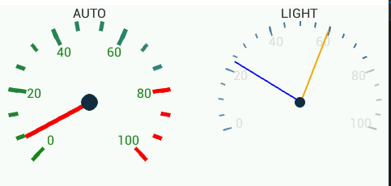

### kb 键盘控件

LittlevGL 为我们提供了一个虚拟键盘的控件，可以实现文本和数组以及符号的输入。kb键盘控件是基于btnm 控件进行构建的，具有预定义的按键映射和其他功能，可以实现虚拟键盘来编写文本
#### 模式
键盘有两种模式可用
- LV_KB_MODE_TEXT 显示字母、数字和符号
- LV_KB_MODE_NUM  显示数字、简单符号

设置模式函数
```c
lv_kb_set_mode(kb, mode) 可以设置键盘模式，默认值为LV_KB_MODE_TEXT
```

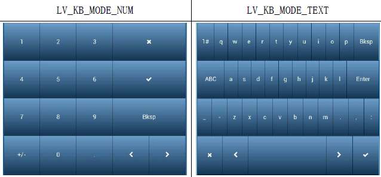

#### 指定文本区域
键盘往往需要配合一个文本输入控件才可以使用，一般使用ta控件，我们需要为键盘指定一个ta控件，这样键盘的内容就会显示到ta控件上面，然后进行处理。
```c
lv_kb_set_ta(kb, ta)
```
可以通过键盘来管理ta控件的光标，分配了键盘后，将隐藏上一个文本区域的光标，并在新的ta 控件上显示光标。在关闭键盘后，光标也会被隐藏。
```c
lv_kb_set_cursor_manage(kb, true) //可以开启/关闭光标功能。默认关闭
```
需要注意的是，在键盘被关闭后，用户有义务处理光标管理

#### 新的按键分布
kb 控件基于btnm 构建，库为kb 控件分配了一套map， 我们也可以重新为kb 控件设置map，函数l`v_kb_set_map(kb, map) 和lv_kb_set_ctrl_map(kb, ctrl_map)` 使用以下关键词作为map，将会与原有的map 具有相同功能：
```c
LV_SYMBOL_OK 	确定
LV_SYMBOL_CLOSE 关闭
LV_SYMBOL_LEFT 	光标左移
LV_SYMBOL_RIGHT 光标右移
"Bksp" 退格删除
"abc" 切换为小写
"ABC" 切换为大写
"Enter" 换行
```
重新设置布局后，我们可以在事件回调函数中处理相关逻辑。例如大小写以及数字键盘的切换。
例如
```c
static const char * kb_map_user[] = {
"1", "2", "3", "Bksp", "\n",
"4", "5", "6", LV_SYMBOL_LEFT, "\n",
"7", "8", "9", LV_SYMBOL_RIGHT, "\n",
" ", "0", LV_SYMBOL_CLOSE, LV_SYMBOL_OK, "" };
...
lv_kb_set_map(kb, kb_map_user);

```

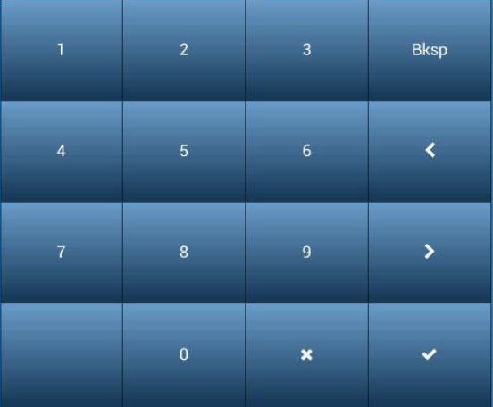


#### 样式
kb 控件的样式跟btnm 一模一样。
```c
/*
* LV_BTNM_STYLE_BG          背景样式。使用所有style.body 属性（包括填充）默认值：lv_style_pretty
* LV_BTNM_STYLE_BTN_REL     释放的按钮的样式。默认值：lv_style_btn_rel
* LV_BTNM_STYLE_BTN_PR      所按下按钮的样式。默认值：lv_style_btn_pr
* LV_BTNM_STYLE_BTN_TGL_REL 切换的释放按钮的样式。默认值：lv_style_btn_tgl_rel
* LV_BTNM_STYLE_BTN_TGL_PR  按下的按钮的样式。默认值：lv_style_btn_tgl_pr
* LV_BTNM_STYLE_BTN_INA     非活动按钮的样式。默认值：lv_style_btn_ina
*/
lv_kb_set_style(kb, LV_KB_STYLE_..., &style) //设置kb 控件的样式。样式的类型如下：
```

#### 事件
除了通用事件以外，kb 控件还会发送以下事件：
- LV_EVENT_VALUE_CHANGED 点击按钮或者长按按钮后定期发送
- LV_EVENT_APPLY 确定按钮被点击
- LV_EVENT_CANCEL 关闭按钮被点击

键盘具有一个默认的事件回调函数lv_kb_def_event_cb 他会处理按钮点击后的文本输入，关闭等操作。用户可以完全替换这个函数，也可以在自定义事件回调函数中调用它，然后在其后面增加用户的逻辑。
#### 常用API

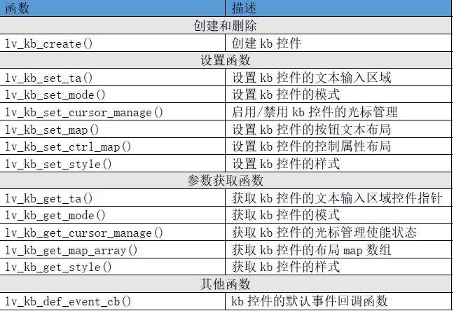

#### demo
```c


static lv_obj_t *kb;

static lv_style_t rel_style, pr_style;

static const char * kb_map_user[] = {
"1", "2", "3", "Bksp", "\n",
"4", "5", "6", LV_SYMBOL_LEFT, "\n",
"7", "8", "9", LV_SYMBOL_RIGHT, "\n",
" ", "0", LV_SYMBOL_CLOSE, LV_SYMBOL_OK, "" };


static void keyboard_event_cb(lv_obj_t * obj, lv_event_t event);
static void text_area_event(lv_obj_t * obj, lv_event_t event);


static void text_area_event(lv_obj_t * obj, lv_event_t event)
{
	if (event == LV_EVENT_CLICKED) {
		/* 创建键盘 */
		if (kb == NULL) {
			kb = lv_kb_create(lv_scr_act(), NULL);
			lv_kb_set_cursor_manage(kb, true);
			lv_kb_set_style(kb, LV_KB_STYLE_BG, &lv_style_transp_tight);
			lv_kb_set_style(kb, LV_KB_STYLE_BTN_REL, &rel_style);
			lv_kb_set_style(kb, LV_KB_STYLE_BTN_PR, &pr_style);
			lv_obj_set_event_cb(kb, keyboard_event_cb);
			lv_kb_set_ta(kb, obj);
		} else {
			lv_kb_set_ta(kb, obj);
		}

	}
}


static void keyboard_event_cb(lv_obj_t * obj, lv_event_t event)
{


	lv_kb_def_event_cb(kb, event);

	if (event == LV_EVENT_APPLY || event == LV_EVENT_CANCEL) {
		/* 确定按钮或者取消按钮被按下 */
		lv_obj_del(kb);
		kb = NULL;
	}
}


/**
  * @brief 控件测试函数
  * @param None
  * @retval	None
  */
void lv_obj_kb_demo(void)
{


	/* 新建个样式 */
	static lv_style_t style_desktop;

	lv_style_copy(&style_desktop, &lv_style_scr);
	style_desktop.body.main_color = LV_COLOR_WHITE;		/* 设置底色 */


	/* 设置样式的字体颜色 */
	style_cn_12.text.color = LV_COLOR_WHITE;
	style_cn_16.text.color = LV_COLOR_WHITE;
	style_cn_24.text.color = LV_COLOR_WHITE;
	style_cn_32.text.color = LV_COLOR_WHITE;

	lv_obj_t *scr = lv_disp_get_scr_act(NULL);				/* 获取当前屏幕 */
	lv_obj_set_style(scr, &style_desktop);					/* 设置样式 */

	/* 设置样式 */
	lv_style_copy(&rel_style, &lv_style_btn_rel);
	rel_style.body.radius = 0;
	rel_style.body.border.width = 1;

	lv_style_copy(&pr_style, &lv_style_btn_pr);
	pr_style.body.radius = 0;
	pr_style.body.border.width = 1;


	kb = lv_kb_create(scr, NULL);								/* 创建键盘控件 */
	lv_kb_set_cursor_manage(kb, true);							/* 打开光标管理 */
	lv_kb_set_style(kb, LV_KB_STYLE_BG, &lv_style_transp_tight);/* 设置键盘的样式 */
	lv_kb_set_style(kb, LV_KB_STYLE_BTN_REL, &rel_style);
	lv_kb_set_style(kb, LV_KB_STYLE_BTN_PR, &pr_style);
	lv_obj_set_event_cb(kb, keyboard_event_cb);					/* 设置对象的事件回调函数 */
	lv_kb_set_mode(kb, LV_KB_MODE_NUM);							/* 设置kb键盘的模式 */
	lv_kb_set_map(kb, kb_map_user);								/* 重设kb键盘的map */

	lv_obj_t *ta1 = lv_ta_create(scr, NULL);					/* 创建文字区域 */
	lv_ta_set_cursor_type(ta1, LV_CURSOR_LINE | LV_CURSOR_HIDDEN);	/* 临时隐藏光标,选择后再显示 */
	lv_obj_align(ta1, NULL, LV_ALIGN_IN_TOP_MID, 0, 10);			/* 设置位置 */
	lv_ta_set_text(ta1, "");										/* 清空文本 */
	lv_obj_set_event_cb(ta1, text_area_event);					/* 设置对象的事件回调函数 */

	lv_obj_t *ta2 = lv_ta_create(scr, NULL);					/* 创建文字区域 */
	lv_ta_set_cursor_type(ta2, LV_CURSOR_LINE | LV_CURSOR_HIDDEN);	/* 临时隐藏光标,选择后再显示 */
	lv_obj_align(ta2, ta1, LV_ALIGN_OUT_BOTTOM_MID, 0, 10);			/* 设置位置 */
	lv_ta_set_text(ta2, "");										/* 清空文本 */
	lv_obj_set_event_cb(ta2, text_area_event);					/* 设置对象的事件回调函数 */

	lv_kb_set_ta(kb, ta1);					/* 给键盘分配文本区域 */


}


```

运行效果

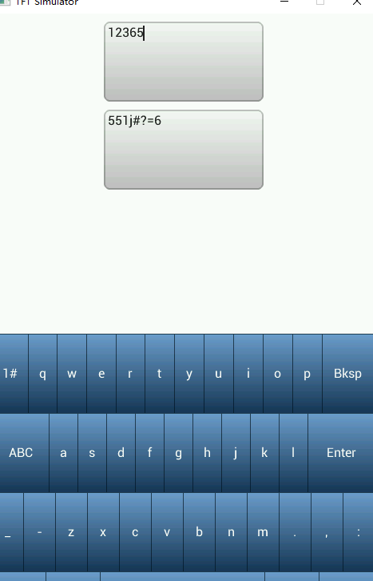

### led 控件
led 控件非常简单，就是一个具有led 形状的基础控件，通过控制其颜色，阴影从而实现模拟LED 开关的功能
- `lv_led_set_bright(led, bright)`  调节亮度
- `lv_led_on(led)`    打开led
- `lv_led_off(led)`   关闭led
- `lv_led_toggle(led)`翻转led

led 控件的样式使用以下函数进行修改：

```c
lv_led_set_style(led, LV_LED_STYLE_MAIN, &style)
```
使用style.body 属性，通过控制阴影、颜色、边框等属性达到对应的开关和亮度效果。默认样式`lv_style_pretty_color`
#### 事件
仅发送通用事件
#### 常用API

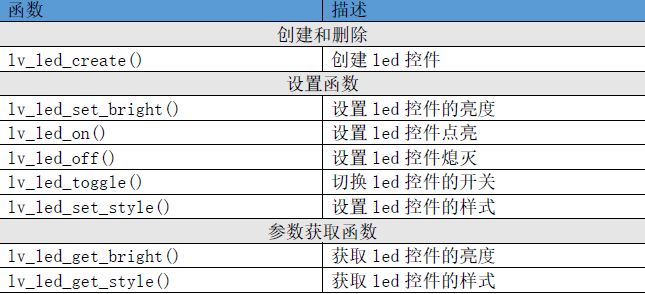

#### demo
```c
static void led_bright_task(lv_task_t *t)
{
	/* 调节亮度 */
	lv_led_set_bright(t->user_data, (uint8_t)(((float)gui_hal_adc_light_get_ratio() / 100) * 255));
}


/**
  * @brief 控件测试函数
  * @param None
  * @retval	None
  */
void lv_obj_led_demo(void)
{


	/* 新建个样式 */
	static lv_style_t style_desktop;
	static lv_style_t style_led;

	lv_style_copy(&style_desktop, &lv_style_scr);
	style_desktop.body.main_color = LV_COLOR_WHITE;		/* 设置底色 */


	/* 设置样式的字体颜色 */
	style_cn_12.text.color = LV_COLOR_WHITE;
	style_cn_16.text.color = LV_COLOR_WHITE;
	style_cn_24.text.color = LV_COLOR_WHITE;
	style_cn_32.text.color = LV_COLOR_WHITE;

	/* 修改led控件的样式,默认的样式看不出led的效果 */
	lv_style_copy(&style_led, &lv_style_pretty_color);
	style_led.body.shadow.width = 5;
	style_led.body.radius = LV_RADIUS_CIRCLE;
	style_led.body.border.width = 3;
	style_led.body.border.opa   = LV_OPA_30;
	style_led.body.main_color   = lv_color_hsv_to_rgb(210, 100, 100);
	style_led.body.grad_color   = lv_color_hsv_to_rgb(210, 100, 40);
	style_led.body.border.color = lv_color_hsv_to_rgb(210, 60, 60);
	style_led.body.shadow.color = lv_color_hsv_to_rgb(210, 100, 100);


	lv_obj_t *scr = lv_disp_get_scr_act(NULL);				/* 获取当前屏幕 */
	lv_obj_set_style(scr, &style_desktop);					/* 设置样式 */


	lv_obj_t *led1 = lv_led_create(scr, NULL);				/* 创建led控件 */
	lv_led_set_style(led1, LV_LED_STYLE_MAIN, &style_led);	/* 设置样式 */
	lv_obj_align(led1, NULL, LV_ALIGN_IN_TOP_MID, -50, 10);	/* 设置位置 */
	lv_led_on(led1);										/* 打开led */


	lv_obj_t *led2 = lv_led_create(scr, led1);				/* 创建led控件,复制之前的属性 */
	lv_obj_align(led2, NULL, LV_ALIGN_IN_TOP_MID, 0, 10);	/* 设置位置 */
	lv_led_off(led2);							/* 关闭led */

	lv_obj_t *led3 = lv_led_create(scr, led1);				/* 创建led控件,复制之前的属性 */
	lv_obj_align(led3, NULL, LV_ALIGN_IN_TOP_MID, 50, 10);	/* 设置位置 */
	lv_led_off(led3);										/* 关闭led */

	lv_task_create(led_bright_task, 500, LV_TASK_PRIO_LOW, led3);	/* 创建任务动态调节led3的亮度 */


}
```

运行效果


### line 线条控件
line 线条控件可以在一组点中绘制直线。

#### 设置点

```c
/*
 * 点必须存储在lv_point_t 类型的数组中point_array，point_cnt 指定点的数量。
 */
lv_line_set_points(line, point_array, point_cnt)

```
#### 自动大小
可以根据点自动设置line 控件的大小，库会根据点之间的最大x 和最大的y 值自动更改控件的宽度和高度，自动调整默认使能。
```c
lv_line_set_auto_size(line, true) //可以设置启用或者禁用。
```
#### 反转Y
默认情况下，向下的方向为y 的正方向，往往与我们习惯中的上下方向不符，line 控件的Y 生长方向可以调整。
```c
lv_line_set_y_invert(line, true)//该功能默认情况下不使用。
```

#### 样式
line 控件的样式使用以下函数进行修改：使用所有style.line属性
```c
lv_line_set_style(line, LV_LINE_STYLE_MAIN, &style)
```
#### 事件
仅发送通用事件。
#### 常用API

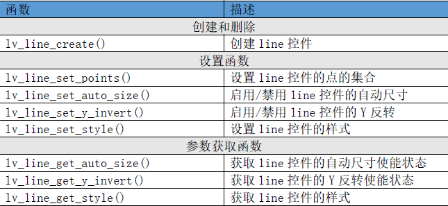

#### demo
```c
lv_point_t line_points[] = { { 5, 5 }, { 70, 70 }, { 120, 10 }, { 180, 60 }, { 240, 10 } };

lv_point_t line_points_weather[] = { { 5, 12 }, { 70, 14 }, { 120, 15 }, { 180, 16 }, { 240, 16 } };

void lv_obj_line_test(void);
void create_line_note(lv_obj_t *line, lv_obj_t *parent, lv_point_t points[], uint16_t num);
void create_line_point(lv_obj_t *line, lv_obj_t *parent, lv_point_t points[], uint16_t num, uint16_t point_size);


/**
  * @brief 控件测试函数
  * @param None
  * @retval	None
  */
void lv_obj_line_demo(void)
{


	/* 新建个样式 */
	static lv_style_t style_desktop;
	static lv_style_t style_line;

	lv_style_copy(&style_desktop, &lv_style_scr);
	style_desktop.body.main_color = LV_COLOR_WHITE;		/* 设置底色 */


	/* 设置样式的字体颜色 */
	style_cn_12.text.color = LV_COLOR_WHITE;
	style_cn_16.text.color = LV_COLOR_WHITE;
	style_cn_24.text.color = LV_COLOR_WHITE;
	style_cn_32.text.color = LV_COLOR_WHITE;

	/* 修改line控件的样式 */
	lv_style_copy(&style_line, &lv_style_plain);
	style_line.line.color   = LV_COLOR_MAKE(0x00, 0x3b, 0x75);
	style_line.line.width   = 3;
	style_line.line.rounded = 1;

	lv_obj_t *scr = lv_disp_get_scr_act(NULL);				/* 获取当前屏幕 */
	lv_obj_set_style(scr, &style_desktop);					/* 设置样式 */

	lv_obj_t *line1 = lv_line_create(scr, NULL);				/* 创建line控件 */
	lv_line_set_style(line1, LV_LINE_STYLE_MAIN, &style_line);	/* 设置样式 */
	lv_line_set_points(line1, line_points, 5);					/* 设置点阵集 */
	lv_obj_align(line1, NULL, LV_ALIGN_IN_TOP_MID, 0, 20);		/* 设置位置 */
	lv_line_set_y_invert(line1, true);							/* 反转y,默认是数字大的在下面,反转后数字大的在上面 */

	create_line_note(line1, scr, line_points, 5);				/* 创建注释 */
	create_line_point(line1, scr, line_points, 5, 8);			/* 创建点 */

	lv_obj_t *line2 = lv_line_create(scr, line1);				/* 创建line控件,复制line1的属性 */
	lv_line_set_points(line2, line_points_weather, 5);			/* 设置点阵集 */
	lv_obj_align(line2, line1, LV_ALIGN_OUT_BOTTOM_MID, 0, 50);	/* 设置位置 */
	create_line_note(line2, scr, line_points_weather, 5);		/* 创建注释 */
	create_line_point(line2, scr, line_points_weather, 5, 5);	/* 创建点 */

}


/**
  * @brief 为line控件创建注释
  * @param line-控件指针
  * @param parent-注释父对象
  * @param points-点阵
  * @param num-数量
  * @retval	None
  */
void create_line_note(lv_obj_t *line, lv_obj_t *parent, lv_point_t points[], uint16_t num)
{
	uint16_t i = 0;
	uint8_t value[25];
	for (i = 0; i < num; i++) {
		memset(value, 0, sizeof(value));
		lv_obj_t *label1 = lv_label_create(parent, NULL);
		sprintf(value, "%d", points[i].y);
		lv_label_set_text(label1, value);
		lv_obj_align(label1, line, LV_ALIGN_IN_BOTTOM_LEFT, points[i].x - 10, (-points[i].y) + 30);

	}
}


/**
  * @brief 为line控件创建放大的点
  * @param line-控件指针
  * @param parent-注释父对象
  * @param points-点阵
  * @param num-数量
  * @param point_size-点的大小
  * @retval	None
  * @note 实际是用led控件模拟点
  */
void create_line_point(lv_obj_t *line, lv_obj_t *parent, lv_point_t points[], uint16_t num, uint16_t point_size)
{
	uint16_t i = 0;

	static lv_style_t style_led;
	lv_style_copy(&style_led, &lv_style_pretty_color);
	style_led.body.radius = LV_RADIUS_CIRCLE;
	style_led.body.main_color = LV_COLOR_MAKE(0xb5, 0x0f, 0x04);
	style_led.body.grad_color = LV_COLOR_MAKE(0x50, 0x07, 0x02);
	style_led.body.border.color = LV_COLOR_MAKE(0xfa, 0x0f, 0x00);
	style_led.body.border.width = 1;
	style_led.body.border.opa = LV_OPA_30;
	style_led.body.shadow.color = LV_COLOR_MAKE(0xb5, 0x0f, 0x04);
	style_led.body.shadow.width = 1;


	for (i = 0; i < num; i++) {

		lv_obj_t *led = lv_led_create(parent, NULL);
		lv_obj_set_size(led, point_size, point_size);
		lv_led_set_style(led, LV_LED_STYLE_MAIN, &style_led);
		lv_obj_align(led, line, LV_ALIGN_IN_BOTTOM_LEFT, points[i].x - 3, (-points[i].y) + 3);
	}
}

```

运行效果

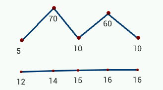

### list 列表控件
list 控件简单分解就是一个背景页面加上顺序排列的按钮组成，按钮里面可以包含一个图标和文本，当然，按钮的布局并不是固定的，库也允许用户重新定义按钮的布局。按钮在添加后如果总大小超过list 控件大小，可以上下滚动。list 控件的应用非常广泛，最常见的就是微信界面，可以把页面当成是一个背景，每一个联系人就是一个按钮控件内包含了头像以及用户名。基于list 控件模拟微信界面：


#### 添加按钮
在创建控件后，是一个空的list，我们需要往list 添加btn 才是一个完整的list
```c
lv_list_add_btn(list, img_src, txt) //该函数会返回所添加的btn 的指针，方便我们对btn 控件进行其他操作。
```
在添加按钮的时候，我们可以指定按钮所使用的图像和文本，也可以使用内置的符号字体作为图像，例如：
```c
// 如果我们不想添加文本，直接输入NULL 即可
lv_list_add_btn(list, LV_SYMBOL_FILE, "file"); /* 添加按钮到list,符号字体作为图标*/
lv_list_add_btn(list, &close_img, "close"); /* 添加按钮到list,图像源作为图标*/
```


按钮的宽度会根据list 的宽度设置为最大，按钮的高度会根据图标和文本，以及按钮样式的填充部分进行自动调整。
添加btn 会指定图标和文本，本质上是一个img 控件和label 控件，我们可以获取这个img 控件和label 控件。
```c
lv_list_get_btn_label(list_btn)//可以获取按钮的label 控件指针
lv_list_get_btn_img(list_btn) //获取按钮的img 控件指针
lv_list_get_btn_text(list_btn)//也可以单独获取按钮的文本
```
获取按钮的label 和img 的作用很大，在很多时候，我们往往需要修改label 的一些参数，比如中文字体的显示，我们就需要获取label 控件的指针，然
后修改其样式和尺寸。

#### 删除按钮
```c
//根据索引来删除按钮，删除成功返回true，index 的值必须大于等于0，且必须小于按钮的数量，
lv_list_remove(list, index) 

lv_list_get_size(list) //获取按钮的数量 
lv_list_clean(list) //清除list 控件上的所有按钮，
```
#### 获取按钮
```c
在创建按钮的时候会返回按钮控件的指针，那么在创建多个按钮以后，我们一样可以获取每个按钮的指针。
lv_list_get_prev_btn(list, prev_btn) // 依次获取prev_btn按钮的上一个按钮指针，如果将第二个参数设置为NULL，则最后一个开始获取按钮
lv_list_get_next_btn(list, prev_btn) // 依次获取prev_btn按钮的下一个按钮指针，如果将第二个参数设置为NULL，则第一个开始获取按钮
```

#### 手动导航
```c
//上下移动按钮
lv_list_up(list) 
lv_list_down(list) 

//直接将焦点放在按钮上
lv_list_focus(btn, LV_ANIM_ON/OFF) 

//可以选择是否打开动画。上下移动焦点时的动画时间也可以进行修改，
lv_list_set_anim_time(list, anim_time) //动画时间设置为0 表示没有动画。
```

#### 边缘闪烁
当list 滑动到最顶部或者最底部的时候，可以显示一个类似圆圈的动态效果，跟智能手机的效果类似
```c
lv_list_set_edge_flash(list, en)//启用或者关闭该功能
```


#### 滚动传播
list 控件内的按钮是可以滑动的，如果list 是创建在page上面，当我们滑动list 到顶部或者底部的时候，就可以将滑动传播到父窗口，这样就可以带
动父窗口进行滚动。我们需要使用函数`lv_list_set_scroll_propagation(list, true)` 来使能该功能。

#### 单选模式
如果按钮使能了toggle，可以使用函数来确保只有一个按钮处于toggle 状态。
```c
lv_list_set_single_mode(list, true) 
```

#### 选中按钮
可以使用函数`lv_list_set_btn_selected(list, btn)` 选中某个按钮，选中后的按钮处于LV_BTN_STATE_PR/TG_PR 状态
#### 滚动条
当添加的按钮超过list 的尺寸后，就会启用滚动条，可以利用函数`lv_list_set_sb_mode(list,mode)` 来设置滚动条的模式，更多内容请参考page 章节。

#### 样式
list 控件的样式使用以下函数进行修改：

```c
lv_list_set_style(list, LV_LIST_STYLE_..., &style)
```

可用的样式类型：

- LV_LIST_STYLE_BG   背景样式。默认：lv_style_transp_fit
- LV_LIST_STYLE_SCRL 滚动部件的样式。默认：lv_style_pretty
- LV_LIST_STYLE_SB   滚动条的样式。默认值：lv_style_pretty_color
- LV_LIST_STYLE_BTN_REL 按钮释放的样式。默认：lv_style_btn_rel
- LV_LIST_STYLE_BTN_PR 按钮按下的样式。默认：lv_style_btn_pr
- LV_LIST_STYLE_BTN_TGL_REL 按钮切换释放样式。默认：lv_style_btn_tgl_rel
- LV_LIST_STYLE_BTN_TGL_PR 按钮切换按下样式。默认：lv_style_btn_tgl_pr
- LV_LIST_STYLE_BTN_INA 按钮处于无效状态。默认：lv_style_btn_ina
#### 事件
仅发送通用事件，要获取按钮的事件，请通过按钮设置
#### 常用API

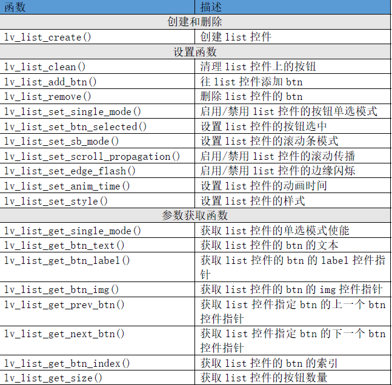

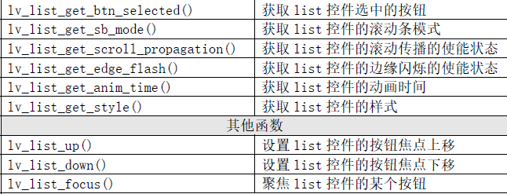

#### demo
```c
lv_img_dsc_t file_img;
lv_img_dsc_t directory_img;
lv_img_dsc_t close_img;
lv_img_dsc_t edit_img;
lv_img_dsc_t save_img;


/**
  * @brief 控件测试函数
  * @param None
  * @retval	None
  */
void lv_obj_list_demo(void)
{
	lv_load_img_bin_from_file(&file_img, "0:/lvgl/file_img.bin");
	lv_load_img_bin_from_file(&directory_img, "0:/lvgl/directory_img.bin");
	lv_load_img_bin_from_file(&close_img, "0:/lvgl/close_img.bin");
	lv_load_img_bin_from_file(&edit_img, "0:/lvgl/edit_img.bin");
	lv_load_img_bin_from_file(&save_img, "0:/lvgl/save_img.bin");

	/* 新建个样式 */
	static lv_style_t style_desktop;

	lv_style_copy(&style_desktop, &lv_style_scr);
	style_desktop.body.main_color = LV_COLOR_GRAY;		/* 设置底色 */


	/* 设置样式的字体颜色 */
	style_cn_12.text.color = LV_COLOR_WHITE;
	style_cn_16.text.color = LV_COLOR_WHITE;
	style_cn_24.text.color = LV_COLOR_WHITE;
	style_cn_32.text.color = LV_COLOR_WHITE;


	lv_obj_t *scr = lv_disp_get_scr_act(NULL);				/* 获取当前屏幕 */
	lv_obj_set_style(scr, &style_desktop);					/* 设置样式 */

	lv_obj_t *list = lv_list_create(scr, NULL);				/* 创建list控件 */
	lv_obj_set_size(list, 160, 200);						/* 设置尺寸宽和高 */
	lv_obj_align(list, NULL, LV_ALIGN_IN_TOP_MID, 0, 10);	/* 设置位置 */
	lv_list_set_edge_flash(list, true);						/* 当滑动到顶部或者底部的时候,有个圆圈的效果 */


	/* 给list添加按钮,直接添加中文不能显示,需要添加按钮的时候文本设置为NULL,然后添加label到按钮 */
	/* 也可以添加中文后获取label控件的指针，然后设置其样式和尺寸等 */
	/* 图标用库自带的或者自己创建的都可以 */
	lv_obj_t *btn;
	lv_obj_t *label;

	btn = lv_list_add_btn(list, LV_SYMBOL_FILE, "新建");			/* 添加按钮到list,符号字体作为图标 */
	label = lv_list_get_btn_label(btn);							/* 获取btn上面的label控件 */
	lv_label_set_style(label, LV_LABEL_STYLE_MAIN, &style_cn_16);		/* 设置label的样式 */
	lv_obj_set_height(label, 32);										/* 设置label的高度,因为默认字体的高度低于汉字字体的,不重新设置高度可能显示不全 */


	btn = lv_list_add_btn(list, LV_SYMBOL_DIRECTORY, "打开文件功能");
	label = lv_list_get_btn_label(btn);
	lv_label_set_style(label, LV_LABEL_STYLE_MAIN, &style_cn_16);
	lv_obj_set_height(label, 32);


	btn = lv_list_add_btn(list, &close_img, NULL);				/* 添加按钮到list,图像源作为图标 */
	label = lv_label_create(btn, NULL);
	lv_label_set_style(label, LV_LABEL_STYLE_MAIN, &style_cn_16);
	lv_label_set_text(label, "关闭");
	lv_btn_set_toggle(btn, true);

	btn = lv_list_add_btn(list, &edit_img, NULL);
	label = lv_label_create(btn, NULL);
	lv_label_set_style(label, LV_LABEL_STYLE_MAIN, &style_cn_16);
	lv_label_set_text(label, "编辑");
	lv_btn_set_toggle(btn, true);

	btn = lv_list_add_btn(list, &save_img, NULL);
	label = lv_label_create(btn, NULL);
	lv_label_set_style(label, LV_LABEL_STYLE_MAIN, &style_cn_16);
	lv_label_set_text(label, "保存");

}
```
运行效果如下

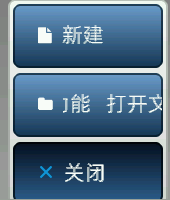


### mbox 消息提示框控件
messagebox 经常用于信息提示，操作选择等场合，他可以弹出一个提示框，引导用户进行操作。mbox 控件是基于cont 控件构建，在上面增加了label 文本和btnm 按钮矩阵，组成了一个完整的消息提示框。但是自带的消息提示框也有缺点，比如没有标题栏。

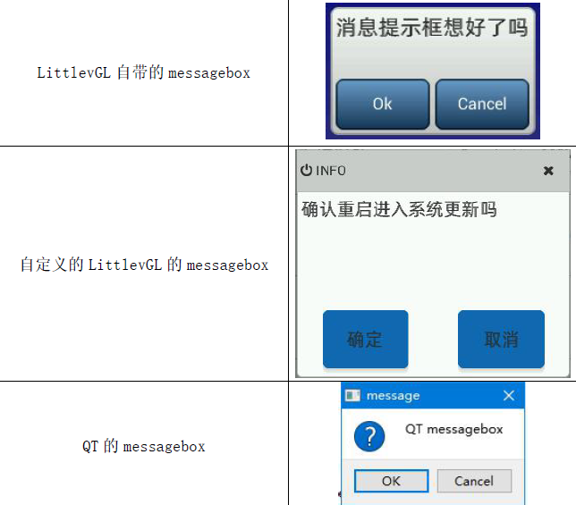


#### 设置文本
创建mbox 控件以后，需要为其添加文本，函数`lv_mbox_set_text(mbox,"text")`
#### 添加按钮
本章开头提到，mbox 上的按钮是基于btnm 的，在创建控件后我们需要像往btnm 添加按钮到mbox。
```c
/*
* 可以向mbox 添加按钮，只需要指定mbox 控件的指针和文本字符串数组即可，可以参考btnm 的按钮布局。
*/
lv_mbox_add_btns(mbox, btn_str) 
```
#### 自动关闭
消息提示框可以设置自动关闭，并且带有动画。
```c
lv_mbox_start_auto_close(mbox, delay) //可以开启该功能。delay 可以设置需要延时时间的毫秒数，到时间到达后会自动关闭mbox。
lv_mbox_stop_auto_close(mbox) //关闭该功能。
lv_mbox_set_anim_time(mbox, anim_time)//关闭时的动画,时间为0，关闭动画
```
#### 文本重新着色
因为mbox 上面的按钮基于btnm，所有也有一些同btnm 相同的属性，比如文本重新着色
```c
lv_mbox_set_recolor(mbox, en) //可以选择是否对按钮文本进行重新着色。
```
#### 样式
mbox 控件的样式使用以下函数进行修改：
```c
lv_mbox_set_style(mbox, LV_MBOX_STYLE_..., &style)
```
可用的样式类型：
- LV_MBOX_STYLE_BG 背景cont 的样式，背景使用style.body 属性，label 使用style.text 属性
- LV_MBOX_STYLE_BTN_BG btnm 的背景样式，默认lv_style_transp_fit
- LV_MBOX_STYLE_BTN_REL 按钮释放的样式，默认lv_style_btn_rel
- LV_MBOX_STYLE_BTN_PR 按钮按下的样式，默认lv_style_btn_pr
- LV_MBOX_STYLE_BTN_TGL_REL 按钮切换释放的样式，默认lv_style_btn_tgl_rel
- LV_MBOX_STYLE_BTN_TGL_PR 按钮切换按下的样式，默认lv_style_btn_tgl_pr
- LV_MBOX_STYLE_BTN_INA 按钮无效的样式，默认lv_style_btn_ina

#### 事件
除了常规事件以外，mbox 控件还会发送以下特殊事件：
LV_EVENT_VALUE_CHANGED 单击该按钮时发送mbox 控件有一个默认的事件回调函数，会关闭自身。
用户可以在自定义的事件回调函数中利用函数
```c
lv_mbox_get_active_btn(mbox) //获取所按下的按钮的索引或者利用函数
lv_mbox_get_active_btn_text(mbox) //获取所按下按钮的文本，这部分跟btnm 一致。
```

#### 常用API

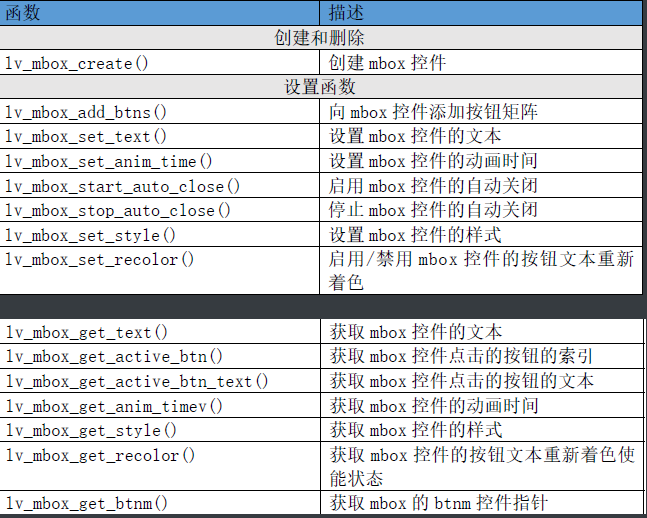


#### demo
```c

lv_img_dsc_t file_img;
lv_img_dsc_t directory_img;
lv_img_dsc_t close_img;
lv_img_dsc_t edit_img;
lv_img_dsc_t save_img;


lv_obj_t *mbox, *info;

static const char * btns2[] = { "Ok", "Cancel", "" };
static void mbox_event_cb(lv_obj_t *obj, lv_event_t event)
{
	if (event == LV_EVENT_DELETE && obj == mbox) {
		/* 删除父窗口,去除模态化效果 */
		lv_obj_del_async(lv_obj_get_parent(mbox));
		mbox = NULL; /* happens before object is actually deleted! */

	} else if (event == LV_EVENT_VALUE_CHANGED) {
		/* 自动关闭 */
		lv_mbox_start_auto_close(mbox, 0);
		/* 获取用户按下的按钮的文本 */
		lv_label_set_text(info, lv_mbox_get_active_btn_text(mbox));

	}


}

static void my_btn_event_cb(lv_obj_t *obj, lv_event_t event)
{
	static lv_style_t style_mbox;
	static lv_style_t style_modal;


	if (event == LV_EVENT_RELEASED) {

		/* 创建一个窗口用于模态化效果 */
		/* Create a full-screen background */
		lv_style_copy(&style_modal, &lv_style_plain_color);
		/* Set the background's style */
		style_modal.body.main_color = style_modal.body.grad_color = LV_COLOR_BLACK;
		style_modal.body.opa = LV_OPA_50;
		/* Create a base object for the modal background */
		lv_obj_t *obj = lv_obj_create(lv_scr_act(), NULL);
		lv_obj_set_style(obj, &style_modal);
		lv_obj_set_pos(obj, 0, 0);
		lv_obj_set_size(obj, LV_HOR_RES, LV_VER_RES);
		lv_obj_set_opa_scale_enable(obj, true); /* Enable opacity scaling for the animation */

		/* 创建消息提示框 */
		mbox = lv_mbox_create(obj, NULL);
		lv_style_copy(&style_mbox, lv_mbox_get_style(mbox, LV_MBOX_STYLE_BG));
		style_mbox.text.font = style_cn_16.text.font;
		lv_mbox_set_style(mbox, LV_MBOX_STYLE_BG, &style_mbox);
		lv_mbox_set_text(mbox, "消息提示框，想好了吗 ");
		lv_mbox_add_btns(mbox, btns2);
		lv_obj_align(mbox, obj, LV_ALIGN_IN_TOP_MID, 0, 150);
		lv_obj_set_event_cb(mbox, mbox_event_cb);

	}
}


/**
  * @brief 控件测试函数
  * @param None
  * @retval	None
  */
void lv_obj_mbox_demo(void)
{

	lv_load_img_bin_from_file(&directory_img, "0:/lvgl/directory_img.bin");

	/* 新建个样式 */
	static lv_style_t style_desktop;

	lv_style_copy(&style_desktop, &lv_style_scr);
	style_desktop.body.main_color = LV_COLOR_BLUE;		/* 设置底色 */


	/* 设置样式的字体颜色 */
	style_cn_12.text.color = LV_COLOR_WHITE;
	style_cn_16.text.color = LV_COLOR_WHITE;
	style_cn_24.text.color = LV_COLOR_WHITE;
	style_cn_32.text.color = LV_COLOR_WHITE;


	lv_obj_t *scr = lv_disp_get_scr_act(NULL);				/* 获取当前屏幕 */
	lv_obj_set_style(scr, &style_desktop);					/* 设置样式 */

	/* 创建一个按钮,设置其事件为打开对话框 */
	lv_obj_t *btn1 = lv_btn_create(scr, NULL);
	lv_obj_set_width(btn1, 230);
	lv_btn_set_layout(btn1, LV_LAYOUT_ROW_M);
	lv_obj_align(btn1, NULL, LV_ALIGN_IN_TOP_MID, 0, 10);

	/* 给按钮添加图标 */
	lv_obj_t *img_btn1 = lv_img_create(btn1, NULL);
	lv_img_set_src(img_btn1, &directory_img);

	/* 给按钮添加文字 */
	lv_obj_t *label_btn1 = lv_label_create(btn1, NULL);
	lv_label_set_style(label_btn1, LV_LABEL_STYLE_MAIN, &style_cn_16);
	lv_label_set_text(label_btn1, "打开一个消息框 ");

	/* 设置按钮的事件回调函数 */
	lv_obj_set_event_cb(btn1, my_btn_event_cb);

	/* 创建用于展示对话框选择的文本 */
	info = lv_label_create(scr, NULL);
	lv_label_set_style(info, LV_LABEL_STYLE_MAIN, &style_cn_16);
	lv_label_set_text(info, "按下按钮打开一个消息提示框 ");
	lv_obj_align(info, btn1, LV_ALIGN_OUT_BOTTOM_MID, 0, 10);


}
```

运行如下

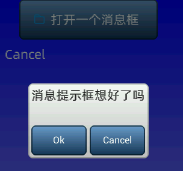

### page 页面控件
page 就像是一个大的容器，可以将子对象添加到这个容器里面，即使添加后的子对象总的尺寸大于page 的尺寸也没关系，只需要在四个方向进行滑动，
就可以完整显示所有子对象。list、ddlist 等控件都是基于page 进行构建的。

#### 滚动条
当添加到page的子对象的尺寸总和大于可滚动区域的尺寸后，就可以显示滚动条，有以下模式进行显示：
- LV_SB_MODE_OFF 从不显示滚动条
- LV_SB_MODE_ON 始终显示滚动条
- LV_SB_MODE_DRAG 拖动页面时显示滚动条
- LV_SB_MODE_AUTO 当可滚动容器足够大以进行滚动时显示滚动条
- LV_SB_MODE_HIDE 暂时隐藏滚动条
- LV_SB_MODE_UNHIDE 取消隐藏先前隐藏的滚动条。也恢复其类型
```c
lv_page_set_sb_mode(page, SB_MODE) //设置page 的滚动条显示模式，默认是LV_SB_MODE_AUTO
```

#### 粘合对象
可以将子对象粘贴在页面上，这样，就可以通过子对象来滚动页面。启用函数为`lv_page_glue_obj(child, true)`
该函数的实现步骤也很简单，就是我们在obj 章节讲到的可拖动属性，使能子对象的可拖动和带动父对象拖动，然后触摸焦点在子对象上面的时候，也能带动page 页面进行拖动。需要注意的是，在page 页面中添加list 或者page 这类自身带有滚动属性的子对象时，需要使能子对象的滚动传播功能。page 控件自身也有滚动传播功能，可以使用函数
`lv_page_set_scroll_propagation(list, true)` 启用，效果就是当page 滑动到最边缘无法继续滑动的时候，可以将滑动传播给父对象。
#### 焦点对象
我们可以使用函数`lv_page_focus(page, child, LV_ANIM_ON/OFF)` 手动聚焦到某一个子对象，这个函数会移动可滚动部分，使聚焦的对象显示在页
面上。动画时间可以用函数`lv_page_set_anim_time(page, anim_time)` 进行设置。

#### 手动导航
在page 上面进行触摸的左右滑动，会滚动显示子对象，也可以使用函数进水平和垂直方向的滑动。输入正数则向右/下方向滚动，输入负数则向左/上方向滚动。
```c
lv_page_scroll_hor(page1, 50); /* 水平滚动页面*/
lv_page_scroll_ver(page1, -50); /* 垂直滚动页面*/
```
#### 边缘闪烁
当page 滑动到最边缘的时候，可以显示一个类似圆圈的动态效果，跟智能手机的效果类似，函数`lv_page_set_edge_flash(list, en)` 可以启动/禁用该功能。
#### 可滚动部分
page 的可滚动部分实际上也是一个obj 对象，我们可以获取这个对象，函数`lv_page_get_scrl(page)` 获取这个部件的对象指针后，可以对其进行其他操作。
page 也提供了一些操作可滚动部件的函数，比如：`lv_page_set_scrl_fit/fint2/fit4(page,fit)` 可以设置可滚动部件的自动调整策略，可以参考cont 控件。

函数`lv_page_set_scrl_width/height(page,w/h)` 可以设置可滚动部件的尺寸。函数lv_page_set_scrl_layout(page,layout) 可以设置可滚动部件的布局策略，可以参考cont 控件部分。我们在设置可滚动部件的尺寸和自动调整的时候要考虑到设置后是否还具有可滚动属性，一般情况下直接使用默认的尺寸。

函数`lv_page_get_fit_width/height(page)` 可以获取能够用于子对象的不会导致尺寸溢出的(显示滚动条表示尺寸溢出)宽度和高度，意义在于可以根据其尺寸来设置子对象的部分尺寸，使子对象的尺寸不会太大，这样可以设置单方向滚动，比如只在垂直方向滚动

#### 样式
page 控件的样式使用以下函数进行修改：
```c
lv_page_set_style(page, LV_PAGE_STYLE_..., &style)
```
可用的样式类型：
- LV_PAGE_STYLE_BG 背景样式，使用style.body 属性
- LV_PAGE_STYLE_SCRL 滚动部件的样式，使用style.body 属性
- LV_PAGE_STYLE_SB 滚动条的样式，使用style.body 属性
- LV_PAGE_STYLE_EDGE_FLASH 边缘闪烁部分的样式，使用style.body.radius 和style.body.opa 属性
#### demo
```c
static const uint8_t text[] = {
	"\xe9\x95\xbf\xe6\x81\xa8\xe6\xad\x8c\n\
	\xe6\xb1\x89\xe7\x9a\x87\xe9\x87\x8d\xe8\x89\xb2\xe6\x80\x9d\xe5\x80\xbe\xe5\x9b\xbd\xef\xbc\x8c\xe5\xbe\xa1\xe5\xae\x87\xe5\xa4\x9a\xe5\xb9\xb4\xe6\xb1\x82\xe4\xb8\x8d\xe5\xbe\x97\xe3\x80\x82\n\
	\xe6\x9d\xa8\xe5\xae\xb6\xe6\x9c\x89\xe5\xa5\xb3\xe5\x88\x9d\xe9\x95\xbf\xe6\x88\x90\xef\xbc\x8c\xe5\x85\xbb\xe5\x9c\xa8\xe6\xb7\xb1\xe9\x97\xba\xe4\xba\xba\xe6\x9c\xaa\xe8\xaf\x86\xe3\x80\x82\n\
	\xe5\xa4\xa9\xe7\x94\x9f\xe4\xb8\xbd\xe8\xb4\xa8\xe9\x9a\xbe\xe8\x87\xaa\xe5\xbc\x83\xef\xbc\x8c\xe4\xb8\x80\xe6\x9c\x9d\xe9\x80\x89\xe5\x9c\xa8\xe5\x90\x9b\xe7\x8e\x8b\xe4\xbe\xa7\xe3\x80\x82\n"
};

static lv_img_dsc_t img_bg;
/**
  * @brief 控件测试函数
  * @param None
  * @retval	None
  */
void lv_obj_page_demo(void)
{

	lv_load_img_bin_from_file(&img_bg, "0:/lvgl/bg01.bin");

	/* 新建个样式 */
	static lv_style_t style_desktop;
	static lv_style_t style_label;
	static lv_style_t style_page_edge_flash;


	lv_style_copy(&style_desktop, &lv_style_scr);
	style_desktop.body.main_color = LV_COLOR_BLUE;		/* 设置底色 */


	/* 设置样式的字体颜色 */
	style_cn_12.text.color = LV_COLOR_WHITE;
	style_cn_16.text.color = LV_COLOR_WHITE;
	style_cn_24.text.color = LV_COLOR_WHITE;
	style_cn_32.text.color = LV_COLOR_WHITE;

	lv_style_copy(&style_page_edge_flash, &lv_style_plain_color);
	style_page_edge_flash.body.radius = 100;
	style_page_edge_flash.body.opa = LV_OPA_30;

	lv_obj_t *scr = lv_disp_get_scr_act(NULL);				/* 获取当前屏幕 */
	lv_obj_set_style(scr, &style_desktop);					/* 设置样式 */

	lv_obj_t * page1 = lv_page_create(scr, NULL);			/* 创建page控件 */
	lv_obj_set_size(page1, LV_HOR_RES, LV_VER_RES);			/* 设置大小 */
	lv_obj_align(page1, NULL, LV_ALIGN_IN_TOP_LEFT, 0, 0);	/* 设置位置 */
	lv_page_set_edge_flash(page1, true);					/* 在滑到边缘的时候有个圆圈的特效 */
	lv_page_set_style(page1, LV_PAGE_STYLE_EDGE_FLASH, &style_page_edge_flash);		/* 设置边缘闪烁部分的样式 */

	//printf("width:%d height:%d\n", lv_page_get_scrl_width(page1), lv_page_get_scrl_height(page1));
	//printf("width:%d height:%d\n", lv_page_get_fit_width(page1), lv_page_get_fit_height(page1));

	//lv_page_set_scrl_fit(page1, LV_FIT_NONE);

	/* 在page控件上添加子对象 */
	lv_obj_t * label_page1 = lv_label_create(page1, NULL);
	lv_style_copy(&style_label, lv_label_get_style(label_page1, LV_LABEL_STYLE_MAIN));
	style_label.text.font = style_cn_16.text.font;
	lv_label_set_style(label_page1, LV_LABEL_STYLE_MAIN, &style_label);
	lv_label_set_long_mode(label_page1, LV_LABEL_LONG_BREAK);
	lv_obj_set_width(label_page1, lv_page_get_fit_width(page1));
	lv_label_set_text(label_page1, text);// 设置字体

	lv_obj_t *btn = lv_btn_create(page1, NULL);
	lv_obj_align(btn, label_page1, LV_ALIGN_OUT_BOTTOM_MID, 0, 0);
	lv_page_glue_obj(btn, true);

	lv_obj_t *btnm = lv_btnm_create(page1, NULL);
	lv_obj_align(btnm, btn, LV_ALIGN_OUT_BOTTOM_MID, 0, 10);
	lv_page_glue_obj(btnm, true);

	lv_obj_t *cont = lv_cont_create(page1, NULL);
	lv_obj_align(cont, btnm, LV_ALIGN_OUT_BOTTOM_MID, 0, 10);
	lv_page_glue_obj(cont, true);

	lv_obj_t *img = lv_img_create(page1, NULL);
	lv_obj_align(img, cont, LV_ALIGN_OUT_BOTTOM_MID, 0, 10);
	lv_img_set_src(img, &img_bg);


	//lv_page_focus(page1, img, LV_ANIM_ON);	/* 聚焦控件 */

	lv_page_scroll_hor(page1, 50); /* 水平滚动页面 */

	lv_page_scroll_ver(page1, -50);	/* 垂直滚动页面 */

	/* 设置布局,设置后子对象的对齐等属性可能失效 */
	lv_page_set_scrl_layout(page1, LV_LAYOUT_CENTER);

}

```
运行效果

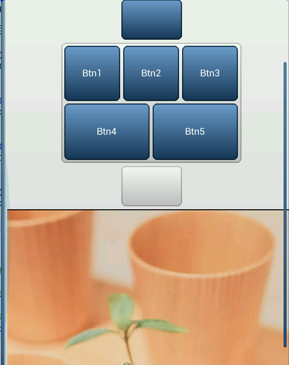

### preload 预加载器控件
预加载器在各种UI 系统中非常常见，它可用于等待某一个事件到达或者等待资源加载。LittlevGL 的preload 控件是基于arc 弧形控件进行构建的，在其基础上增加了与加载相关的操作接口。preload 控件的构成是一个封闭的弧形背景，一个颜色不同的弧形进行旋转。
#### 弧长/角度/速度
preload 控件的弧分两部分，旋转部分和固定部分，固定部分的弧为360 度，旋转部分的弧的角度可以设置,deg为旋转的角度
```c
lv_preload_set_arc_length(preload, deg) // 旋转角度

lv_preload_set_spin_time(preload, time_ms)//旋转速度
```
#### 旋转类型
```c
lv_preload_set_type(preload, LV_PRELOAD_TYPE_...) 
//设置，可以设置的类型如下：
LV_PRELOAD_TYPE_SPINNING_ARC // 旋转弧线，在顶部放慢速度
LV_PRELOAD_TYPE_FILLSPIN_ARC // 旋转弧线，在顶部放慢速度，但也可以拉伸弧线
```

#### 旋转方向
默认情况下会顺时针，设置去旋转方向：
```c
lv_preload_set_dir(preload, LV_PRELOAD_DIR_FORWARD/BACKWARD)
```
#### 样式
preload 控件的样式使用以下函数进行修改：
```c
//style.body.line 属性设置弧形
//style.body.border 设置背景边框部分
lv_preload_set_style(preload, LV_PRELOAD_STYLE_MAIN, &style)
```

#### 事件
仅发送通用事件
#### 常用API 

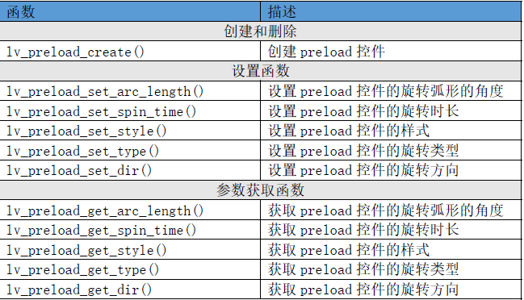

#### demo
```c


/**
  * @brief 控件测试函数
  * @param None
  * @retval	None
  */
void lv_obj_preload_demo(void)
{


	/* 新建个样式 */
	static lv_style_t style_desktop;
	static lv_style_t style_preload;

	lv_style_copy(&style_desktop, &lv_style_scr);
	style_desktop.body.main_color = LV_COLOR_BLUE;		/* 设置底色 */


	/* 设置样式的字体颜色 */
	style_cn_12.text.color = LV_COLOR_WHITE;
	style_cn_16.text.color = LV_COLOR_WHITE;
	style_cn_24.text.color = LV_COLOR_WHITE;
	style_cn_32.text.color = LV_COLOR_WHITE;


	lv_obj_t *scr = lv_disp_get_scr_act(NULL);				/* 获取当前屏幕 */
	lv_obj_set_style(scr, &style_desktop);					/* 设置样式 */

	lv_style_copy(&style_preload, &lv_style_plain);
	style_preload.line.width = 10;							/* 旋转部分线的宽度 */
	style_preload.line.color = lv_color_hex3(0x258);		/* 旋转部分线的颜色 */
	style_preload.body.border.color = lv_color_hex3(0xBBB); /* 背景的颜色 */
	style_preload.body.border.width = 10;					/* 背景的圆圈的宽度 */
	style_preload.body.padding.left = 0;					/* 左边部分填充为0 */

	lv_obj_t * preload = lv_preload_create(scr, NULL);		/* 创建preload控件 */
	lv_obj_set_size(preload, 100, 100);						/* 设置尺寸 */
	lv_obj_align(preload, NULL, LV_ALIGN_IN_TOP_MID, 0, 10);/* 设置位置 */
	lv_preload_set_style(preload, LV_PRELOAD_STYLE_MAIN, &style_preload);	/* 设置样式 */

	lv_preload_set_arc_length(preload, 180);					/* 弧的角度 */
	lv_preload_set_spin_time(preload, 800);					/* 旋转时长 */
	lv_preload_set_type(preload, LV_PRELOAD_TYPE_SPINNING_ARC);	/* 旋转类型 */
	lv_preload_set_dir(preload, LV_PRELOAD_DIR_BACKWARD);		/* 旋转方向 */
}

```

运行效果如下：


### roller 滚动轴控件
roller 控件在智能手机的时间设置中很常见，他可以上下滚动在多个选项中选择某一个选项。roller 的原型是ddlist
#### 设置选项
创建roller 控件后，需要为其设置选项，
```c
/*
*options 选项字符串之间用‘\n’分隔，例如：month
*/
const uint8_t month[] = "January\nFebruary\nMarch\nApril\nMay\nJune\nJuly\nAugust\nSeptember\nOctober\nNovember\nDecember";

lv_roller_set_options(roller, options, LV_ROLLER_MODE_NORMAL/INFINITE)  

/*
 * LV_ROLLER_MODE_NORMAL    //正常模式（滚轴在选项末尾结束）
 * LV_ROLLER_MODE_INIFINITE //无限模式（循环滚动）
 */
lv_roller_set_selected(roller, id)//其中id 是选项的索引。
```

#### 获取选定选项
```c
lv_roller_get_selected(roller) //获取当前选定项的索引，
lv_roller_get_selected_str(roller, buf, buf_size) //获取当前选定项的字符串，存储在buf 中。

```
一般情况下可以在事件回调函数中获取对应的选定项。

#### 对齐选项
选项的标签对齐方式设置
```c
lv_roller_set_align(roller, LV_LABEL_ALIGN_LEFT/CENTER/RIGHT) //对齐。左/中/右。
```
#### 高度和宽度
roller 控件的高度可以根据其显示的行数来设置，设置行数后，库会自动为我们计算高度
```c
lv_roller_set_visible_row_count(roller, num)//设置行数
lv_roller_set_fix_width(roller, width) // 宽度可以根据选项自动调整，也可以主动进行设置。width 设置为0 表示使用自动宽度。
```

#### 动画时间
当滚动轴滚动且没有完全停在某个选项上时，他将自动滚动到最近的有效选项。滚动动画为0 表示没有动画。
```c
lv_roller_set_anim_time(roller, anim_time)
```
#### 样式
roller 控件的样式使用以下函数进行修改：
```c
lv_roller_set_style(roller, LV_ROLLER_STYLE_..., &style)
```
可用的样式类型：
- LV_ROLLER_STYLE_BG 背景样式。使用所有style.body 属性。style.text 用于选项的标签。默认：lv_style_pretty
- LV_ROLLER_STYLE_SEL 所选选项的样式。使用style.body 属性。所选的选项将用重新着色text.color。默认：lv_style_plain_color

#### 事件
除了通用事件以外，roller 控件还会发送以下事件：`LV_EVENT_VALUE_CHANGED` 选择新选项时发送

#### demo
```c

const uint8_t month[] = "January\nFebruary\nMarch\nApril\nMay\nJune\nJuly\nAugust\nSeptember\nOctober\nNovember\nDecember";
const uint8_t year[] = "2019\n2020\n2021\n2022\n2023\n2024\n2025\n2026\n2027\n2028";
uint8_t date[100] = { 0 };
uint8_t min[200] = { 0 };
uint8_t hour[100] = { 0 };

uint8_t date_buf[100];


lv_obj_t *roller_year;
lv_obj_t *roller_month;
lv_obj_t *roller_date;
lv_obj_t *roller_hour;
lv_obj_t *roller_min;
lv_obj_t *label_date;

static void roller_event_cb(lv_obj_t * obj, lv_event_t event)
{
	if (event == LV_EVENT_VALUE_CHANGED) {
		memset(date_buf, 0, sizeof(date_buf));

		char buf[100];
		sprintf(buf, "%02d", lv_roller_get_selected(roller_date) + 1);		/* 获取选择的索引 */
		//lv_roller_get_selected_str(roller_date, buf, sizeof(buf));
		strcat(date_buf, buf);
		strcat(date_buf, " ");
		memset(buf, 0, sizeof(buf));

		lv_roller_get_selected_str(roller_month, buf, sizeof(buf));			/* 获取选择的字符串 */
		strcat(date_buf, buf);
		strcat(date_buf, " ");
		memset(buf, 0, sizeof(buf));

		lv_roller_get_selected_str(roller_year, buf, sizeof(buf));
		strcat(date_buf, buf);
		strcat(date_buf, "   ");
		memset(buf, 0, sizeof(buf));

		sprintf(buf, "%02d", lv_roller_get_selected(roller_hour));
		//lv_roller_get_selected_str(roller_hour, buf, sizeof(buf));
		strcat(date_buf, buf);
		strcat(date_buf, ":");
		memset(buf, 0, sizeof(buf));

		sprintf(buf, "%02d", lv_roller_get_selected(roller_min));
		//lv_roller_get_selected_str(roller_min, buf, sizeof(buf));
		strcat(date_buf, buf);
		strcat(date_buf, " ");
		memset(buf, 0, sizeof(buf));

		lv_label_set_text(label_date, date_buf);						/* 设置选择的时间 */
		lv_obj_align(label_date, NULL, LV_ALIGN_IN_TOP_MID, 0, 10);		/* 文本改变后重新设置一下位置 */
	}
}


/**
  * @brief 控件测试函数
  * @param None
  * @retval	None
  */
void lv_obj_roller_demo(void)
{

	uint8_t i = 0;
	uint8_t buf[10] = { 0 };
	/* 新建个样式 */
	static lv_style_t style_desktop;

	lv_style_copy(&style_desktop, &lv_style_scr);
	style_desktop.body.main_color = LV_COLOR_WHITE;		/* 设置底色 */


	/* 设置样式的字体颜色 */
	style_cn_12.text.color = LV_COLOR_WHITE;
	style_cn_16.text.color = LV_COLOR_WHITE;
	style_cn_24.text.color = LV_COLOR_WHITE;
	style_cn_32.text.color = LV_COLOR_WHITE;


	lv_obj_t *scr = lv_disp_get_scr_act(NULL);				/* 获取当前屏幕 */
	lv_obj_set_style(scr, &style_desktop);					/* 设置样式 */

	roller_year = lv_roller_create(scr, NULL);							/* 创建roller控件 */
	lv_obj_set_pos(roller_year, 0, 50);									/* 设置坐标 */
	lv_roller_set_options(roller_year, year, LV_ROLLER_MODE_INIFINITE);	/* 添加内容 */
	lv_roller_set_fix_width(roller_year, 100);							/* 设置宽度 */
	lv_roller_set_visible_row_count(roller_year, 8);					/* 设置显示的行数 */
	lv_obj_set_event_cb(roller_year, roller_event_cb);					/* 设置事件回调函数 */
	lv_roller_set_selected(roller_year, 0, true);						/* 手动设置选择项 */


	/* 填充日期时间缓冲区 */
	for (i = 1; i <= 31; i++) {
		if (i < 31)
			sprintf(buf, "%d\n", i);
		else
			sprintf(buf, "%d", i);
		strcat(date, buf);
	}

	for (i = 0; i <= 23; i++) {
		if (i < 23)
			sprintf(buf, "%d\n", i);
		else
			sprintf(buf, "%d", i);
		strcat(hour, buf);
	}

	for (i = 0; i <= 59; i++) {
		if (i < 59)
			sprintf(buf, "%d\n", i);
		else
			sprintf(buf, "%d", i);
		strcat(min, buf);
	}

	roller_month = lv_roller_create(scr, NULL);
	lv_obj_set_pos(roller_month, 100, 50);
	lv_roller_set_options(roller_month, month, LV_ROLLER_MODE_INIFINITE);
	lv_roller_set_fix_width(roller_month, 100);
	lv_roller_set_visible_row_count(roller_month, 8);
	lv_obj_set_event_cb(roller_month, roller_event_cb);
	lv_roller_set_selected(roller_month, 12 - 1, true);

	roller_date = lv_roller_create(scr, NULL);
	lv_obj_set_pos(roller_date, 200, 50);
	lv_roller_set_options(roller_date, date, LV_ROLLER_MODE_INIFINITE);
	lv_roller_set_fix_width(roller_date, 100);
	lv_roller_set_visible_row_count(roller_date, 8);
	lv_obj_set_event_cb(roller_date, roller_event_cb);
	lv_roller_set_selected(roller_date, 9 - 1, true);

	roller_hour = lv_roller_create(scr, NULL);
	lv_obj_set_pos(roller_hour, 300, 50);
	lv_roller_set_options(roller_hour, hour, LV_ROLLER_MODE_INIFINITE);
	lv_roller_set_fix_width(roller_hour, 90);
	lv_roller_set_visible_row_count(roller_hour, 8);
	lv_obj_set_event_cb(roller_hour, roller_event_cb);
	lv_roller_set_selected(roller_hour, 21 - 1, true);

	roller_min = lv_roller_create(scr, NULL);
	lv_obj_set_pos(roller_min, 390, 50);
	lv_roller_set_options(roller_min, min, LV_ROLLER_MODE_INIFINITE);
	lv_roller_set_fix_width(roller_min, 90);
	lv_roller_set_visible_row_count(roller_min, 8);
	lv_obj_set_event_cb(roller_min, roller_event_cb);
	lv_roller_set_selected(roller_min, 5 - 1, true);


	/* 创建label用于显示选择的时间 */
	label_date = lv_label_create(scr, NULL);
	lv_label_set_long_mode(label_date, LV_LABEL_LONG_EXPAND);
	lv_label_set_text(label_date, "");

	/* 手动发送一个事件,使得label显示的时间可以更新 */
	lv_event_send(roller_min, LV_EVENT_VALUE_CHANGED, NULL);

}

```

运行效果如下：

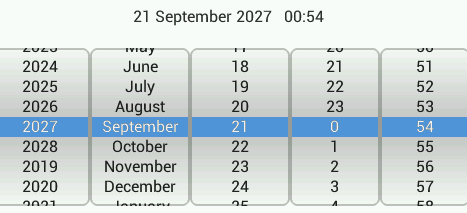

### slider 滑块控件
slider 控件可以通过滑动滑块来设置某一个值，它包含一个固定的背景和一个可以滑动的滑块。可以设置为垂直滑动或者水平滑动。
#### 滑块的值和范围
滑动后，slider 控件的值会变化
```c
lv_slider_set_value(slider, new_value, LV_ANIM_ON/OFF) //手动设置控件的值
lv_slider_set_anim_time(slider, anim_time) //是否打开动画。动画时间
lv_slider_set_range(slider, min , max) //设置滑块的范围，默认是0-100。
```

#### 滑块绘制属性

```c
/*
*设置:有两种方式：
*true：旋钮始终在滑块中绘制；
*false：旋钮可以在边缘上
*/
lv_slider_set_knob_in(slider, true/false) 

```
#### 样式
slider 控件的样式使用以下函数进行修改：
```c
lv_slider_set_style(slider, LV_SLIDER_STYLE_..., &style)
```
可用的样式类型
- LV_SLIDER_STYLE_BG 背景样式。使用所有style.body 属性
- LV_SLIDER_STYLE_INDIC 填充区域的样式。使用所有style.body 属性
- LV_SLIDER_STYLE_KNOB 滑块旋钮的样式。使用style.body 属性
#### 事件
除了通用事件以外，slider 控件还会发送以下事件：LV_EVENT_VALUE_CHANGED 在滑块移动时发送
#### 常用API

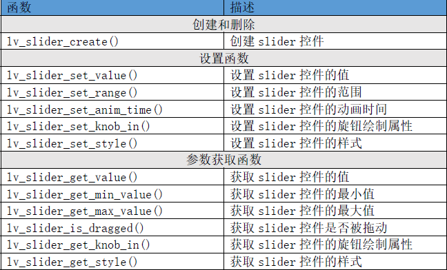

#### demo
```c
static void slider_event_cb(lv_obj_t * obj, lv_event_t event)
{
	if (event == LV_EVENT_VALUE_CHANGED) {
		/* 调节背光 */
		uint8_t value = 0;
		value = lv_slider_get_value(obj);
		gui_hal_backlight(value);
	}
}


/**
* @brief 控件测试函数
* @param None
* @retval	None
*/
void lv_obj_slider_demo(void)
{

	uint8_t i = 0;
	uint8_t buf[10] = { 0 };
	/* 新建个样式 */
	static lv_style_t style_desktop;
	static lv_style_t style_label;
	static lv_style_t style_knob;

	lv_style_copy(&style_desktop, &lv_style_scr);
	style_desktop.body.main_color = LV_COLOR_WHITE;		/* 设置底色 */
	style_desktop.body.grad_color = LV_COLOR_WHITE;		/* 设置渐变色 */

	/* 设置样式的字体颜色 */
	style_cn_12.text.color = LV_COLOR_WHITE;
	style_cn_16.text.color = LV_COLOR_WHITE;
	style_cn_24.text.color = LV_COLOR_WHITE;
	style_cn_32.text.color = LV_COLOR_WHITE;


	lv_obj_t *scr = lv_disp_get_scr_act(NULL);				/* 获取当前屏幕 */
	lv_obj_set_style(scr, &style_desktop);					/* 设置样式 */

	//lv_theme_set_current(lv_theme_material_init(210, NULL));			/* 设置主题 */

	lv_style_copy(&style_knob, &lv_style_pretty);
	style_knob.body.opa = LV_OPA_50;


	lv_obj_t *slider = lv_slider_create(scr, NULL);						/* 创建slider控件 */
	lv_obj_align(slider, NULL, LV_ALIGN_IN_TOP_MID, 0, 30);				/* 设置位置 */
	lv_slider_set_range(slider, 0, 100);								/* 设置滑块的范围 */
	lv_slider_set_value(slider, lv_slider_get_max_value(slider), true);	/* 设置滑块的值为最大值,动画打开 */
	lv_obj_set_event_cb(slider, slider_event_cb);						/* 设置对象的事件回调函数 */
	lv_slider_set_knob_in(slider, false);								/* 旋钮一直在滑块中绘制 */
	lv_slider_set_style(slider, LV_SLIDER_STYLE_KNOB, &style_knob);


	/* 创建label控件 */
	lv_style_copy(&style_label, &style_cn_16);
	style_label.text.color = LV_COLOR_BLACK;
	lv_obj_t *label = lv_label_create(scr, NULL);
	lv_label_set_style(label, LV_LABEL_STYLE_MAIN, &style_label);
	lv_label_set_text(label, "滑动滑块调节背光");
	lv_obj_align(label, NULL, LV_ALIGN_IN_TOP_MID, 0, 0);


}
```

运行效果如下：

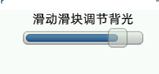

### spinbox 控件
spinbox 控件包含一个文本输入区以及一个数字文本，可以通过按键或者函数增加或减少数字，可以用作特殊的数字输入。遗憾的是。LittlevGL 没有为我们提供可以修改spinbox 的值的btn。

#### 设置格式
spinbox 控件的数字显示的格式可以进行修改，可以设置其显示位数，小数点后的位数等等：
```c
//digit_count 设置显示的总位数，separator_position 设置小数点前的位数。
lv_spinbox_set_digit_format(spinbox,digit_count,separator_position)
```

需要注意的是，在设置显示格式后，控件所代表的数字并没有改变，需要用户去处理。比如设置总显示3 位数，小数点前1 位，那么此时控件的值还是以百为单位，也就是小数点前的那位数的单位是百，至于获取其值，需要用户去处理。在设置其值和范围，获取其值和范围的时候需要注意。
```c
lv_spinbox_set_padding_left(spinbox, cnt) //可以设置数字最左边的空格字符数量。
```

#### 值和范围
```c
lv_spinbox_set_range(spinbox, min, max) // 设置spinbox 控件的范围。默认-99999 到99999。

lv_spinbox_set_value(spinbox, num) //手动设置spinbox 的值和范围
lv_spinbox_increment(spinbox) //增加spinbox 控件的值
lv_spinbox_decrement(spinbox) //减少spinbox 控件的值
lv_spinbox_set_step(spinbox, step) //可以设置增量，在使用增加和减少函数的时候有用
```
#### 当前编辑数字
spinbox 的低位的数字增加到10 后，高位的会对于变化。我们可以左右移动指针使其编辑前一位或者后一位数字：
```c
lv_spinbox_step_next(spinbox)
lv_spinbox_step_prev(lspinbox)
```
#### 样式
spinbox 控件的样式使用以下函数进行修改：
```c
lv_spinbox_set_style(spinbox, LV_SPINBOX_STYLE_..., &style)
```
可用的样式类型如下：
- LV_SPINBOX_STYLE_BG 背景样式，使用style.body 属性
- LV_SPINBOX_STYLE_SB 滚动条样式，使用style.body 属性
- LV_SPINBOX_STYLE_CURSOR 游标的样式，使用style.body 属性

#### 事件
除了通用事件外，spinbox 还会发送以下事件：LV_EVENT_VALUE_CHANGED 在值发生变化的时候发送

#### demo
```c
lv_obj_t * spinbox;
lv_obj_t * label;

const char *my_btnm_map[] = { LV_SYMBOL_PLUS,LV_SYMBOL_PREV,"\n",LV_SYMBOL_MINUS,LV_SYMBOL_NEXT,"" };

static void my_btnm_event_cb(lv_obj_t * obj, lv_event_t event)
{
	if (event == LV_EVENT_VALUE_CHANGED) {
		static uint8_t spinbox_value[16];
		uint8_t btnm_value = lv_btnm_get_active_btn(obj);
		switch (btnm_value) {
		case 0:
		lv_spinbox_increment(spinbox);		/* 当前数字加1 */
		break;
		case 1:
		lv_spinbox_step_prev(spinbox);		/* 编辑的数字左移 */
		break;
		case 2:
		lv_spinbox_decrement(spinbox);		/* 当前数字减1 */
		break;
		case 3:
		lv_spinbox_step_next(spinbox);		/* 编辑的数字右移 */
		break;
		default:
		break;
		}
		sprintf(spinbox_value, "Value: %.2f\n", (float)lv_spinbox_get_value(spinbox) / 100.00f);
		lv_label_set_text(label, spinbox_value);
		lv_obj_align(label, spinbox, LV_ALIGN_OUT_TOP_MID, -10, 10);
		//printf("Value: %.2f\n", (float)lv_spinbox_get_value(spinbox)/100.00f);
	}

}


/**
  * @brief 控件测试函数
  * @param None
  * @retval	None
  */
void lv_obj_spinbox_demo(void)
{

	/* 新建个样式 */
	static lv_style_t style_desktop;

	lv_style_copy(&style_desktop, &lv_style_scr);
	style_desktop.body.main_color = LV_COLOR_WHITE;		/* 设置底色 */
	style_desktop.body.grad_color = LV_COLOR_WHITE;		/* 设置渐变色 */

	/* 设置样式的字体颜色 */
	style_cn_12.text.color = LV_COLOR_WHITE;
	style_cn_16.text.color = LV_COLOR_WHITE;
	style_cn_24.text.color = LV_COLOR_WHITE;
	style_cn_32.text.color = LV_COLOR_WHITE;


	lv_obj_t *scr = lv_disp_get_scr_act(NULL);				/* 获取当前屏幕 */
	lv_obj_set_style(scr, &style_desktop);					/* 设置样式 */


	spinbox = lv_spinbox_create(scr, NULL);						/* 创建spinbox控件 */
	lv_spinbox_set_digit_format(spinbox, 5, 3);					/* 设置数字格式,小数点前3位,总位数5位 */
	lv_spinbox_step_prev(spinbox);								/* 编辑的位号左移动一位 */
	lv_spinbox_set_padding_left(spinbox, 0);
	lv_obj_set_width(spinbox, 100);								/* 设置控件宽度 */
	lv_spinbox_set_range(spinbox, -100, 100);					/* 设置范围,这里要注意上面动了小数点 */
	lv_obj_align(spinbox, NULL, LV_ALIGN_IN_TOP_MID, 0, 50);
	lv_spinbox_set_step(spinbox, 1);							/* 设置增量为1 */


	/* 创建btnm控件用于控制spinbox */
	lv_obj_t *btnm = lv_btnm_create(scr, NULL);
	lv_btnm_set_map(btnm, my_btnm_map);
	lv_obj_set_size(btnm, 100, 100);
	lv_obj_align(btnm, spinbox, LV_ALIGN_OUT_RIGHT_MID, 0, 0);
	lv_obj_set_event_cb(btnm, my_btnm_event_cb);

	/* 创建label控件显示数字 */
	label = lv_label_create(scr, NULL);
	lv_label_set_text(label, "");
	lv_obj_align(label, spinbox, LV_ALIGN_OUT_TOP_MID, 0, 0);
}
```

运行效果如下：

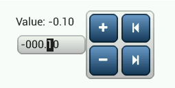

### table 表格控件
LittlevGL 为我们提供了一个具有表格最基础内容的table 控件，由行、列以及文本构成。提供了基本的单元格操作，合并、对齐等。
#### 行和列的数量
table 控件的行和列可以通过函数进行设置：
```c
lv_table_set_col_cnt(table, col_cnt); /* 设置列的数量*/
lv_table_set_row_cnt(table, row_cnt); /* 设置行的数量*/
```
#### 单元格尺寸
列的宽度可以进行设置
```c
//col_id 表示列的索引，表格的总宽度为所有列的总合。
lv_table_set_col_width(table, col_id, width) 
```
表格的高度会根据单元格的样式自动计算，不能手动设置。
#### 单元格的文本
单元格不能直接显示数字，需要先转换为文本然后才能显示在表格上根据行和列确定某一个单元格。库会自动计算列的宽度然后自动换行，也可以在文本中使用换行符。文本的字体暂时不能修改。
```c
lv_table_set_cell_value(table, row, col, "Content") 
```
#### 对齐
单元格中文本可以设置其对齐模式，居中/左对齐/右对齐：
```c
lv_table_set_cell_align(table, row, col, LV_LABEL_ALIGN_LEFT/CENTER/RIGHT)
```

#### 单元格类型
对于某些单元格，我们可以为其设置特殊的类型，每个类型也可以设置不用的样式，有以下特殊的类型
1. 表头
2. 第一栏
3. 突出显示一个单元格
4. 其他特殊单元格
```c
lv_table_set_cell_type(table, row, col, type) //可以设置某个单元格的类型。
```

#### 合并单元格
table 控件可以合并相邻的单元格,使用方法是确定某一个单元格的行和列，然后将其右边相邻的一个单元格进行合并并清除右边单元格大内容。
列方向暂时没有合并单元格的函数。

```c
lv_table_set_cell_merge_right(table, col, row, true) 
```
#### 裁剪文本
默认情况下，单元格的宽度小于文本宽度时，会自动换行，并且增加表格的高度，该功能也可以禁用以裁剪文本
```c
lv_table_set_cell_crop(table, row, col, true)
```

#### 样式
table 控件的样式使用以下函数进行修改：
```c
lv_table_set_style(table, LV_TABLE_STYLE_..., &style)
```
可用的样式类型如下：
- LV_TABLE_STYLE_BG 背景样式，使用style.body 属性
- LV_TABLE_STYLE_CELL1/2/3/4 特殊表格类型的样式，使用style.body 属性
#### 事件
仅发送通用事件
#### 常用API

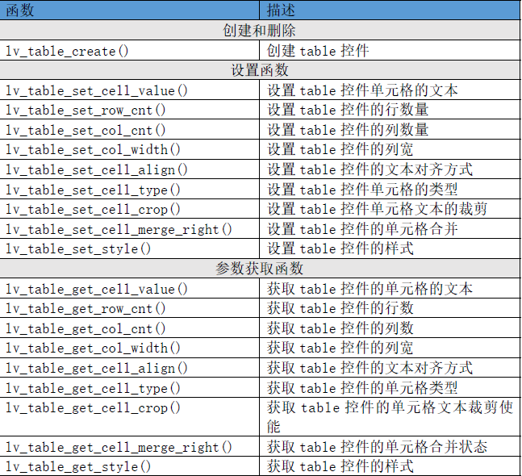

#### demo
```c

/**
  * @brief 控件测试函数
  * @param None
  * @retval	None
  */
void lv_obj_table_demo(void)
{

	/* 新建个样式 */
	static lv_style_t style_desktop;
	static lv_style_t style_cell1;
	static lv_style_t style_cell2;

	lv_style_copy(&style_desktop, &lv_style_scr);
	style_desktop.body.main_color = LV_COLOR_WHITE;		/* 设置底色 */
	style_desktop.body.grad_color = LV_COLOR_WHITE;		/* 设置渐变色 */

	/* 设置样式的字体颜色 */
	style_cn_12.text.color = LV_COLOR_WHITE;
	style_cn_16.text.color = LV_COLOR_WHITE;
	style_cn_24.text.color = LV_COLOR_WHITE;
	style_cn_32.text.color = LV_COLOR_WHITE;


	lv_obj_t *scr = lv_disp_get_scr_act(NULL);				/* 获取当前屏幕 */
	lv_obj_set_style(scr, &style_desktop);					/* 设置样式 */

	//lv_theme_set_current(lv_theme_material_init(210, NULL));			/* 设置主题 */


	lv_style_copy(&style_cell1, &lv_style_plain);
	style_cell1.body.border.width = 1;
	style_cell1.body.border.color = LV_COLOR_BLACK;


	lv_style_copy(&style_cell2, &lv_style_plain);
	style_cell2.body.border.width = 1;
	style_cell2.body.border.color = LV_COLOR_BLACK;
	style_cell2.body.main_color = LV_COLOR_SILVER;
	style_cell2.body.grad_color = LV_COLOR_SILVER;


	lv_obj_t * table = lv_table_create(scr, NULL);			/* 创建table控件 */
	lv_table_set_col_cnt(table, 2);							/* 设置列的数量 */
	lv_table_set_row_cnt(table, 7);							/* 设置行的数量 */
	lv_table_set_col_width(table, 0, 100);					/* 设置列的宽度 */
	lv_table_set_col_width(table, 1, 150);					/* 设置列的宽度 */
	lv_table_set_cell_merge_right(table, 0, 0, true);		/* 合并单元格 */
	lv_table_set_style(table, LV_TABLE_STYLE_CELL1, &style_cell1);
	lv_table_set_style(table, LV_TABLE_STYLE_CELL2, &style_cell2);
	lv_table_set_style(table, LV_TABLE_STYLE_BG, &lv_style_transp_tight);

	lv_table_set_cell_align(table, 0, 0, LV_LABEL_ALIGN_CENTER);	/* 第0行第0列居中对齐 */


	lv_table_set_cell_type(table, 0, 0, 2);


	lv_table_set_cell_value(table, 0, 0, "Bison-Board");
	lv_table_set_cell_value(table, 1, 0, "MCU");
	lv_table_set_cell_value(table, 2, 0, "RAM");
	lv_table_set_cell_value(table, 3, 0, "FLASH");
	lv_table_set_cell_value(table, 4, 0, "DISPLAY");
	lv_table_set_cell_value(table, 5, 0, "USB");
	lv_table_set_cell_value(table, 6, 0, "WIRELESS");


	lv_table_set_cell_value(table, 1, 1, "STM32F429IGT6");
	lv_table_set_cell_value(table, 2, 1, "32M SDRAM");
	lv_table_set_cell_value(table, 3, 1, "16M SPI-FLASH");
	lv_table_set_cell_value(table, 4, 1, "4.3 800*480 RGB565");
	lv_table_set_cell_value(table, 5, 1, "TYPE-C*2");
	lv_table_set_cell_value(table, 6, 1, "WIFI+2.4G");

	lv_obj_align(table, NULL, LV_ALIGN_IN_TOP_MID, 0, 10);


}
```

运行效果如下：

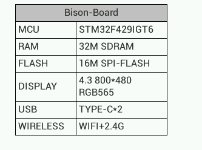

### tableview 表视图控件
tableview控件在移动设备中非常常见，例如很多手机APP底部的页面切换，就是tableview 控件的工作机制类似。tableview 可以用于切换多个页面，每一个页面可以提供一个page 对象，我们可以在这个page 对象上创建我们内容。顶部或者底部会有一个默认是按钮的导航区。
#### 添加页面
新创建的tableview 控件是没有页面的，需要我们为其添加页面。
```c
lv_tabview_add_tab(tabview, "Tab name") //该函数会返回一个page 对象的指针，可以利用该指针操作新页面。
```
#### 切换页面
点击导航栏的按钮或者滑动可以切换页面，也可以手动指定切换到某一个页面。
```c
lv_tabview_set_tab_act(tabview, id, LV_ANIM_ON/OFF) //id 的页面的索引。
```
也可以手动禁用滑动的功能。
```c
lv_tabview_set_sliding(tabview, false)
```
#### 导航栏
创建tableview 控件后，导航栏默认在顶部，也可以设置其位置。
```c
lv_tabview_set_btns_pos(tabview, LV_TABVIEW_BTNS_POS_TOP/BOTTOM/LEFT/RIGHT) 
```
该函数可以改变导航栏的位置，需要注意的是，虽然导航栏的位置变了，但是切换页面的滑动还是只能水平滑动。即使导航栏切换到了左侧或者右侧，也不能使用垂直滑动页面。需要注意的是，在添加页面后，请不要再切换导航栏的位置到左侧或者右侧！

导航栏也可以被隐藏例如我们利用tableview 做一个可以左右滑动的桌面效果，这时候就可以隐藏导航栏，用滑动切换页面,这个功能碉堡了，像qt这么强大的gui框架，做个类似手机左右滑屏的动画，简直是无语了，什么都要用户手动去撸代码。
```c
lv_tabview_set_btns_hidden(tabview, true) 
```
#### 动画时间
切换页面时的动画时间 
```c
lv_tabview_set_anim_time(tabview, anim_time_ms)
```

#### 样式
tableview 控件的样式使用以下函数进行修改：
```c
lv_tabview_set_style(tabview, LV_TABVIEW_STYLE_..., &style)
```
可用的样式类型如下：
- LV_TABVIEW_STYLE_BG 背景样式，使用所有style.body 属性
- LV_TABVIEW_STYLE_INDIC 导航栏的矩形显示卡，使用所有style.body属性
- LV_TABVIEW_STYLE_BTN_BG 导航栏按钮的背景样式，使用所有style.body 属性
- LV_TABVIEW_STYLE_BTN_REL 导航栏按钮释放状态
- LV_TABVIEW_STYLE_BTN_PR 导航栏按钮按下状态
- LV_TABVIEW_STYLE_BTN_TGL_REL 导航栏按钮切换释放状态
- LV_TABVIEW_STYLE_BTN_TGL_PR 导航栏按钮切换按下状态

#### 事件
除了通用事件以外，tableview 控件还会发送以下事件：LV_EVENT_VALUE_CHANGED 通过滑动或单击导航栏选项卡按钮选择新页面的时候发送

#### 常用API

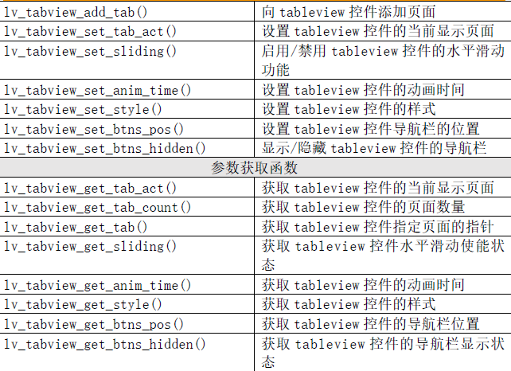

#### demo
```c

/**
  * @brief 控件测试函数
  * @param None
  * @retval	None
  */
void lv_obj_tabview_demo(void)
{
	static lv_img_dsc_t img_desktop;
	lv_load_img_bin_from_file(&img_desktop, "0:/lvgl/bg02.bin");


	/* 新建个样式 */
	static lv_style_t style_desktop;
	static lv_style_t style_tabview;
	static lv_style_t style_label;

	lv_style_copy(&style_desktop, &lv_style_scr);
	style_desktop.body.main_color = LV_COLOR_WHITE;		/* 设置底色 */
	style_desktop.body.grad_color = LV_COLOR_WHITE;		/* 设置渐变色 */

	/* 设置样式的字体颜色 */
	style_cn_12.text.color = LV_COLOR_WHITE;
	style_cn_16.text.color = LV_COLOR_WHITE;
	style_cn_24.text.color = LV_COLOR_WHITE;
	style_cn_32.text.color = LV_COLOR_WHITE;


	lv_obj_t *scr = lv_disp_get_scr_act(NULL);				/* 获取当前屏幕 */
	lv_obj_set_style(scr, &style_desktop);					/* 设置样式 */

	//lv_theme_set_current(lv_theme_material_init(210, NULL));			/* 设置主题 */

	lv_obj_t *img_bg = lv_img_create(scr, NULL);						/* 创建背景 */
	lv_img_set_src(img_bg, &img_desktop);


	lv_obj_t *tabview = lv_tabview_create(scr, NULL);					/* 创建tabview控件 */
	//lv_tabview_set_btns_hidden(tabview, true);						/* 隐藏导航栏目 */
	//lv_tabview_set_btns_pos(tabview, LV_TABVIEW_BTNS_POS_RIGHT);			/* 设置导航栏位置 */
	lv_style_copy(&style_tabview, lv_tabview_get_style(tabview, LV_TABVIEW_STYLE_BG));
	style_tabview.body.opa = 0;											/* 设置全透明 */
	lv_tabview_set_style(tabview, LV_TABVIEW_STYLE_BG, &style_tabview);
	lv_tabview_set_anim_time(tabview, 100);								/* 设置动画时间 */


	/* 添加3个页面 */
	lv_obj_t *tab1 = lv_tabview_add_tab(tabview, "Tab 1");
	lv_obj_t *tab2 = lv_tabview_add_tab(tabview, "Tab 2");
	lv_obj_t *tab3 = lv_tabview_add_tab(tabview, "Tab 3");


	/* 在页面上添加控件 */
	lv_style_copy(&style_label, &lv_style_pretty);
	style_label.text.font = style_cn_16.text.font;
	style_label.body.opa = 150;
	style_label.body.border.width = 0;

	lv_obj_t * label = lv_label_create(tab1, NULL);
	lv_label_set_body_draw(label, true);
	lv_label_set_style(label, LV_LABEL_STYLE_MAIN, &style_label);
	lv_label_set_text(label, "This the first tab");

	label = lv_label_create(tab2, NULL);
	lv_label_set_body_draw(label, true);
	lv_label_set_style(label, LV_LABEL_STYLE_MAIN, &style_label);
	lv_label_set_text(label, "Second tab");

	label = lv_label_create(tab3, NULL);
	lv_label_set_body_draw(label, true);
	lv_label_set_style(label, LV_LABEL_STYLE_MAIN, &style_label);
	lv_label_set_text(label, "Third tab");


}
```
运行效果如下：

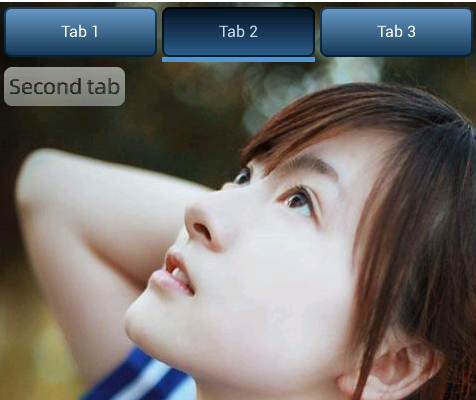

### ta 文字输入控件
ta控件全称text area文字区域，它提供一个文本输入框，可以跟kb键盘控件绑定进行文字输入。
ta 控件是由page 控件和label 控件构成，page 提供输入框，label 提供文本的展示。因此它也继承了很多page 的属性。

#### 文本操作
如果ta 控件绑定了kb 控件，键盘输入的内容就会追加到ta 控件上，也可
以手动添加文本：
```c
lv_ta_add_char(ta,c); 		/* 向ta 控件添加字符*/
lv_ta_add_text(ta,"text"); 	/* 向ta 控件添加文本*/
lv_ta_set_text(ta,"text"); 	/* 设置ta 控件的文本*/
```
ta 控件支持退格和删除：
```c
lv_ta_del_char(ta); 		/* 删除字符,退格删除,删除左侧字符*/
lv_ta_del_char_forward(ta); /* 正常删除,删除右侧字符*/
​```c
在kb 控件的默认回调函数中也是使用上述函数进行文本的追加和删除。
​```c
lv_ta_get_text(ta) 获取ta 控件的文本。
```
占位符
当文本区域为空的时候，可以设置一个占位符用于引导用户输入：
```c
lv_ta_set_placeholder_text(ta, "Placeholder text");/* 设置占位符*/
```
#### 移动光标
光标的位置可以设置一个绝对位置
```c
// pos 表示光标在字符中的新位置，0 表示第一个字符前，LV_TA_CURSOR_LAST 表示最后一个字符后
lv_ta_set_cursor_pos(ta,pos)
```

相对移动的方式设置光标的位置
```c
lv_ta_cursor_down(ta);
lv_ta_cursor_left(ta);
lv_ta_cursor_right(ta);
lv_ta_cursor_up(ta);
```
使能了光标自动转到点击的位置，该功能默认使能。
```c
lv_ta_set_cursor_click_pos(ta, true) 
```
#### 光标显示模式
ta 控件的光标右多种显示模式，可以通过函数进行设置，
```c
lv_ta_set_cursor_type(ta, LV_CURSOR_...)
```
可用的模式如下：可以将任何类型与LV_CURSOR_HIDDEN 进行或操作以暂时隐藏光标。
- LV_CURSOR_NONE 不显示光标
- LV_CURSOR_LINE 简单的垂直线
- LV_CURSOR_BLOCK 在当前字符上填充矩形
- LV_CURSOR_OUTLINE 在当前字符周围显示矩形边框
- LV_CURSOR_UNDERLINE 在当前字符下面显示下划线

光标的闪烁时间可以通过函数进行调节。
```c
lv_ta_set_cursor_blink_time(ta,time_ms) 
```
#### 单行模式
文本输入可以设置为单行模式，这种模式下不接受换行符的输入并且高度自动设置为一行文字的高度。
```c
lv_ta_set_one_line(ta, true)
```
#### 密码模式
文本区域可以设置为密码模式，文本输入经过指定时间后将会显示为\*号。密码模式下获取的文本还是真实文本，而不是*号。
```c
lv_ta_set_pwd_mode(ta, true)
```
明文的可见时间可以通过函数进行调节。
```c
lv_ta_set_pwd_show_time(ta, time_ms)
```

#### 文本对齐
可以设置为文本的左/居中/右对齐 在单行模式下，仅当文本保持对齐时才能水平滚动文本。
```c
lv_ta_set_text_align(ta, LV_LABEL_ALIGN_LET/CENTER/RIGHT)
```

#### 可接受字符
可以设置ta 控件可以接受的字符，其他字符将会自动忽略。该功能跟正则表达式类似，却又没有正则表达式功能丰富。
```c
lv_ta_set_accepted_chars(ta, "0123456789.+-")
```

#### 最大文本长度
ta 控件可以接受的最大文本长度
```c
lv_ta_set_max_length(ta, max_char_num) 进行设置。
```
#### 很长的文本
同label 控件具有同样的属性，在lv_conf.h 中开启LV_LABEL_LONG_TXT_HINT 可以加快超长的文本的绘制速度。
#### 选择文本
```c
lv_ta_set_text_sel(ta, true) //选择一部分文本，就像用鼠标在PC上选择文本一样
```
#### 滚动传播
同page 控件一样，ta 也可以设置滚动传播：可以参考第page 部分。
```c
lv_ta_set_scroll_propagation(ta, true)
```

#### 边缘闪烁
```c
lv_ta_set_edge_flash(ta, true) //启用边缘闪烁，效果跟page 控件一样
```
#### 样式
ta 控件的样式使用以下函数进行修改：
```c
lv_ta_set_style(ta, LV_TA_STYLE_..., &style)
```
可用的样式类型如下：
- LV_TA_STYLE_BG 文字区域背景样式，使用所有style.body 属性，文本使用style.text 属性
- LV_TA_STYLE_SB 滚动条的样式，使用style.body 属性
- LV_TA_STYLE_CURSOR 光标样式，不同的光标使用不同属性
- LV_TA_STYLE_EDGE_FLASH 边缘闪烁部分的样式，使用style.body.radius 和style.body.opa 属性
- LV_TA_STYLE_PLACEHOLDER 占位符样式，使用label 使用的相关属性
#### 事件
除了通用事件以外，ta 控件还会发送以下事件：LV_EVENT_INSERT 在插入字符之前发送，事件的数据是计划插入的文本。
```c
/*
* 替换要插入的文本。新文本不能在局部变量中，该变量在事件回调存在时被销毁。
* "" 表示不要插入任何内容。LV_EVENT_VALUE_CHANGED 更改文本区域的内容时发送
*/
lv_ta_set_insert_replace(ta，"New text") 
```

#### demo
```c
static lv_obj_t *kb;

static void kb_event_cb(lv_obj_t * event_kb, lv_event_t event)
{
	/* Just call the regular event handler */
	lv_kb_def_event_cb(event_kb, event);

}


static void ta_event_cb(lv_obj_t * ta, lv_event_t event)
{
	if (event == LV_EVENT_CLICKED) {
		/* Focus on the clicked text area */
		if (kb != NULL)
			lv_kb_set_ta(kb, ta);
	}
}


/**
  * @brief 控件测试函数
  * @param None
  * @retval	None
  */
void lv_obj_ta_demo(void)
{

	/* 新建个样式 */
	static lv_style_t style_desktop;
	static lv_style_t style_ta_bg;

	lv_style_copy(&style_desktop, &lv_style_scr);
	style_desktop.body.main_color = LV_COLOR_WHITE;		/* 设置底色 */
	style_desktop.body.grad_color = LV_COLOR_WHITE;		/* 设置渐变色 */

	/* 设置样式的字体颜色 */
	style_cn_12.text.color = LV_COLOR_WHITE;
	style_cn_16.text.color = LV_COLOR_WHITE;
	style_cn_24.text.color = LV_COLOR_WHITE;
	style_cn_32.text.color = LV_COLOR_WHITE;


	lv_obj_t *scr = lv_disp_get_scr_act(NULL);				/* 获取当前屏幕 */
	lv_obj_set_style(scr, &style_desktop);					/* 设置样式 */

	//lv_theme_set_current(lv_theme_material_init(210, NULL));			/* 设置主题 */

	lv_style_copy(&style_ta_bg, &lv_style_pretty);
	style_ta_bg.text.font = &lv_font_roboto_28;
	style_ta_bg.text.color = LV_COLOR_RED;

	lv_obj_t *ta_ssid = lv_ta_create(scr, NULL);			/* 创建ta控件 */
	lv_ta_set_text(ta_ssid, "");							/* 设置空文本 */
	lv_ta_set_one_line(ta_ssid, true);						/* 单行模式 */
	lv_obj_set_width(ta_ssid, LV_HOR_RES / 2 - 20);			/* 宽度 */
	lv_obj_set_pos(ta_ssid, 5, 20);							/* 设置坐标 */
	lv_obj_set_event_cb(ta_ssid, ta_event_cb);				/* 设置事件回调函数 */
	lv_ta_set_max_length(ta_ssid, 16);				        /* 设置最大长度 */
	lv_ta_set_style(ta_ssid, LV_TA_STYLE_BG, &style_ta_bg);


	/* 创建label用于引导用户输入 */
	lv_obj_t * label_ssid = lv_label_create(lv_scr_act(), NULL);
	lv_label_set_text(label_ssid, "SSID:");
	lv_obj_align(label_ssid, ta_ssid, LV_ALIGN_OUT_TOP_LEFT, 0, 0);


	lv_obj_t *ta_pwd = lv_ta_create(scr, NULL);
	lv_ta_set_text(ta_pwd, "");
	lv_ta_set_one_line(ta_pwd, true);
	lv_obj_set_width(ta_pwd, LV_HOR_RES / 2 - 20);
	lv_ta_set_cursor_type(ta_pwd, LV_CURSOR_LINE | LV_CURSOR_HIDDEN);	/* 临时隐藏光标,选择后再显示 */
	lv_obj_align(ta_pwd, ta_ssid, LV_ALIGN_OUT_BOTTOM_MID, 0, 50);
	lv_obj_set_event_cb(ta_pwd, ta_event_cb);
	lv_ta_set_pwd_mode(ta_pwd, true);						/* 设置为密文模式 */
	lv_ta_set_max_length(ta_pwd, 16);
	lv_ta_set_pwd_show_time(ta_pwd, 10);					/* 设置密码可以查看的最长时间,过了这个时间以后变成*号 */


	lv_obj_t * label_pwd = lv_label_create(lv_scr_act(), NULL);
	lv_label_set_text(label_pwd, "PWD:");
	lv_obj_align(label_pwd, ta_pwd, LV_ALIGN_OUT_TOP_LEFT, 0, 0);


	lv_obj_t *ta_ip = lv_ta_create(scr, NULL);
	lv_ta_set_text(ta_ip, "");
	lv_ta_set_one_line(ta_ip, true);
	lv_obj_set_width(ta_ip, LV_HOR_RES / 2 - 20);
	lv_ta_set_cursor_type(ta_ip, LV_CURSOR_LINE | LV_CURSOR_HIDDEN);
	lv_obj_align(ta_ip, ta_ssid, LV_ALIGN_OUT_BOTTOM_MID, 0, 150);
	lv_obj_set_event_cb(ta_ip, ta_event_cb);
	lv_ta_set_max_length(ta_ip, 16);
	lv_ta_set_accepted_chars(ta_ip, "0123456789.");			/* 设置可接收的字符,相当于正则表达式 */

	lv_obj_t * label_ip = lv_label_create(lv_scr_act(), NULL);
	lv_label_set_text(label_ip, "SERVER_IP:");
	lv_obj_align(label_ip, ta_ip, LV_ALIGN_OUT_TOP_LEFT, 0, 0);


	lv_obj_t *ta_port = lv_ta_create(scr, NULL);
	lv_ta_set_text(ta_port, "");
	lv_ta_set_one_line(ta_port, true);
	lv_obj_set_width(ta_port, LV_HOR_RES / 2 - 20);
	lv_ta_set_cursor_type(ta_port, LV_CURSOR_LINE | LV_CURSOR_HIDDEN);
	lv_obj_align(ta_port, ta_ssid, LV_ALIGN_OUT_BOTTOM_MID, 0, 250);
	lv_obj_set_event_cb(ta_port, ta_event_cb);
	lv_ta_set_max_length(ta_port, 5);
	lv_ta_set_accepted_chars(ta_port, "0123456789");
	lv_ta_set_placeholder_text(ta_port, "0-65535");		/* 在文本输入框为空的时候,设置一个提示文本 */

	lv_obj_t * label_port = lv_label_create(lv_scr_act(), NULL);
	lv_label_set_text(label_port, "SERVER_PORT:");
	lv_obj_align(label_port, ta_port, LV_ALIGN_OUT_TOP_LEFT, 0, 0);


	/* 创建键盘 */
	kb = lv_kb_create(scr, NULL);
	lv_obj_align(kb, NULL, LV_ALIGN_IN_BOTTOM_MID, 0, 0);
	lv_obj_set_event_cb(kb, kb_event_cb);

	/* 设置键盘对应的输入区域 */
	lv_kb_set_ta(kb, ta_ssid);
	lv_kb_set_cursor_manage(kb, true);

	//lv_obj_t *ta = lv_ta_create(scr,NULL);
	//lv_ta_add_char(ta,c);			/* 向ta控件添加字符 */
	//lv_ta_add_text(ta,"text");		/* 向ta控件添加文本 */
	//lv_ta_set_text(ta,"text");		/* 设置ta控件的文本 */

	//lv_ta_del_char(ta);				/* 删除字符,退格删除,删除左侧字符 */
	//lv_ta_del_char_forward(ta);		/* 正常删除,删除右侧字符 */
	//lv_ta_set_placeholder_text(ta, "Placeholder text");	/* 设置占位符 */
	//

}

```

运行效果如下

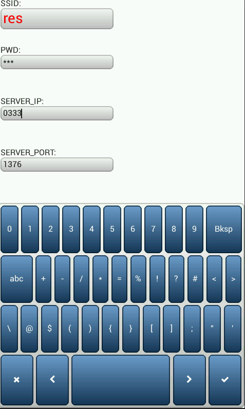

### tileview 平铺视图控件
tileview 控件可以实现多个页面的切换显示，同tableview 类似却也有很多不同的功能。
tileview 提供多个页面的网格类型的排列，可以通过上下左右滑动进行页面切换。如果每个页面都是屏幕大小，就像是智能手表上的上下或者左右切换页面的效果。

#### 有效位置
所有页面可以不是一个完整的网格形式，例如，页面可以构成一个L形状的页面，即2*2 的网格中，右上的网格可以设置为无效。需要设置tileview 的页面布局
```c
/*
* 如果设置成L 形的页面，此时的array 就可以设置成如下形式：
* 注意变量设置为静态或者全局，数组的形式确定了页面的方式。如下图所示，右上的{1,0}处的页面将不会被添加。
*/

static lv_point_t valid_pos[] = { { 0, 0 }, { 0, 1 }, { 1, 1 } }
lv_tileview_set_valid_positions(tileview, valid_pos, array_len)
```
效果如下所示

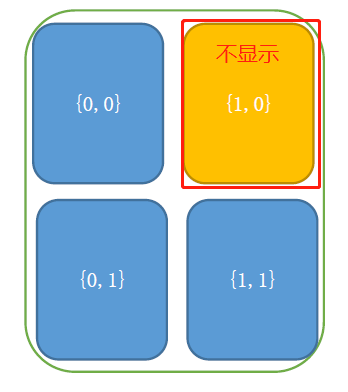

#### 添加元素
要向页面上面添加对象，只需要创建tileview 的子对象并使用函数
```c
lv_tileview_add_element(tielview, element) //element 是子对象的指针。
```
添加的元素的应该与tileview 的页面大小相同，并且需要手动定位到所需位置。例如页面大小为800*480，在2*2 的网格中，
左上第一个页面的大小为800*480，位置应为（0,0），左下的页面位置应该为（0,800）。page、list 这类控件可以使用其滚动传播功能，可以通过滑动控件本身来实现切换页面的功能。
list 上面的btn 也需要使用函数`lv_tileview_add_element(tielview,btn)` 进行添加。

#### 设置当前页面
要手动设置当前显示的页面，请使用函数：
```c
lv_tileview_set_tile_act(tileview,x_id,y_id,LV_ANIM_ON/OFF) // 其中x_id 和y_id  即是valid_pos
```
#### 动画时间
页面滑动和切换的动画时间可以通过函数进行设置。
```c
lv_tileview_set_anim_time(tileview, anim_time) 
```
#### 边缘闪烁
同page 控件一样，tileview 控件也具有边缘闪烁功能
```c
lv_tileview_set_edge_flash(tileview, true)
```
#### 样式
tileview 控件的样式使用以下函数进行修改：
```c
lv_tileview_set_style(slider, LV_TILEVIEW_STYLE_MAIN, &style)
```
样式使用所有style.body 属性
#### 事件
除了通用事件，tileview 还会发送以下事件：LV_EVENT_VALUE_CHANGED 当滚动或加载新页面时发送
#### 常用API函数

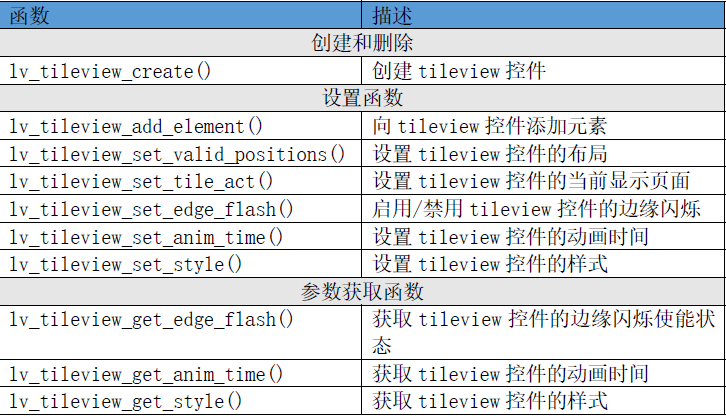

#### demo
```c
/**
  * @brief 控件测试函数
  * @param None
  * @retval	None
  */
void lv_obj_tileview_demo(void)
{

	/* 新建个样式 */
	static lv_style_t style_desktop;
	static lv_style_t style_tabview;
	static lv_style_t style_label;

	lv_style_copy(&style_desktop, &lv_style_scr);
	style_desktop.body.main_color = LV_COLOR_WHITE;		/* 设置底色 */
	style_desktop.body.grad_color = LV_COLOR_WHITE;		/* 设置渐变色 */

	/* 设置样式的字体颜色 */
	style_cn_12.text.color = LV_COLOR_WHITE;
	style_cn_16.text.color = LV_COLOR_WHITE;
	style_cn_24.text.color = LV_COLOR_WHITE;
	style_cn_32.text.color = LV_COLOR_WHITE;


	lv_obj_t *scr = lv_disp_get_scr_act(NULL);				/* 获取当前屏幕 */
	lv_obj_set_style(scr, &style_desktop);					/* 设置样式 */


	static lv_point_t valid_pos[] = { { 0, 0 }, { 0, 1 }, { 1, 1 } };// L型
	lv_obj_t *tileview;
	tileview = lv_tileview_create(scr, NULL);
	lv_tileview_set_valid_positions(tileview, valid_pos, 3);
	lv_tileview_set_edge_flash(tileview, true);

	lv_obj_t * tile1 = lv_obj_create(tileview, NULL);
	lv_obj_set_size(tile1, LV_HOR_RES, LV_VER_RES);
	lv_obj_set_style(tile1, &lv_style_pretty);
	lv_tileview_add_element(tileview, tile1);

	/* 向页面一添加一个label */
	lv_obj_t * label = lv_label_create(tile1, NULL);
	lv_label_set_text(label, "Tile 1");
	lv_obj_align(label, NULL, LV_ALIGN_CENTER, 0, 0);

	/* 向页面二添加一个list */
	lv_obj_t * list = lv_list_create(tileview, NULL);
	lv_obj_set_size(list, LV_HOR_RES, LV_VER_RES);
	lv_obj_set_pos(list, 0, LV_VER_RES);
	lv_list_set_scroll_propagation(list, true);
	lv_list_set_sb_mode(list, LV_SB_MODE_OFF);
	lv_tileview_add_element(tileview, list);

	lv_obj_t * list_btn;
	list_btn = lv_list_add_btn(list, NULL, "One");
	lv_tileview_add_element(tileview, list_btn);

	list_btn = lv_list_add_btn(list, NULL, "Two");
	lv_tileview_add_element(tileview, list_btn);

	list_btn = lv_list_add_btn(list, NULL, "Three");
	lv_tileview_add_element(tileview, list_btn);

	list_btn = lv_list_add_btn(list, NULL, "Four");
	lv_tileview_add_element(tileview, list_btn);

	list_btn = lv_list_add_btn(list, NULL, "Five");
	lv_tileview_add_element(tileview, list_btn);

	list_btn = lv_list_add_btn(list, NULL, "Six");
	lv_tileview_add_element(tileview, list_btn);

	list_btn = lv_list_add_btn(list, NULL, "Seven");
	lv_tileview_add_element(tileview, list_btn);

	list_btn = lv_list_add_btn(list, NULL, "Eight");
	lv_tileview_add_element(tileview, list_btn);

	/* 向页面三添加一个按钮 */
	lv_obj_t * tile3 = lv_obj_create(tileview, tile1);
	lv_obj_set_pos(tile3, LV_HOR_RES, LV_VER_RES);
	lv_tileview_add_element(tileview, tile3);

	lv_obj_t * btn = lv_btn_create(tile3, NULL);
	lv_obj_align(btn, NULL, LV_ALIGN_CENTER, 0, 0);

	label = lv_label_create(btn, NULL);
	lv_label_set_text(label, "Button");


}


```

运行效果如下

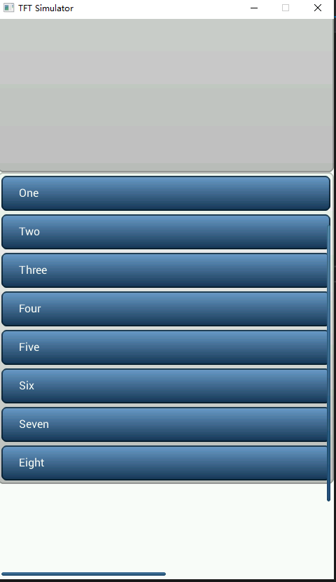


### win 窗口控件
LittlevGL 的win 控件同PC 一样，有标题栏、主页面、关闭按钮等内容。
win 控件也是比较常用的一种控件。win 控件的页面部分就是一个page 控件，所以也有page 控件的某些属性。

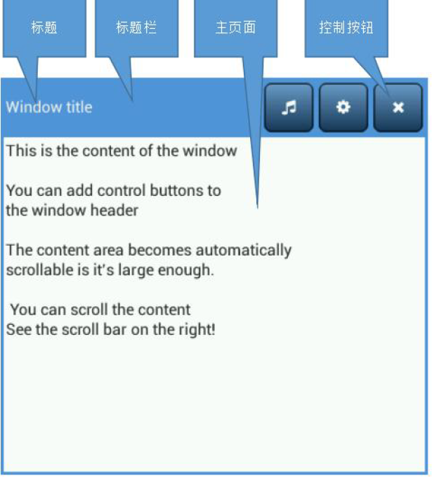

#### 标题
win 控件的上方有一个标题栏，标题的内容可以通过函数进行设置
```c
lv_win_set_title(win, "New title") 
```
#### 控制按钮
可以在win 的右上角添加按钮，添加的按钮将以此从右上角开始绘制
```c
/*
* 函数的第二个参数用于设置按钮的图像，可以是图像源或者是内置的符号字体。如果给win 添加了关闭按钮，
* 只需要把这个按钮的回调事件设置为lv_win_close_event_cb 即可，该回调事件可以自动关闭窗口。
*/
lv_win_add_btn(win, LV_SYMBOL_CLOSE)
```
按钮的尺寸设置。按钮的宽高保持一致。
```c
lv_win_set_btn_size(win, new_size) 
```
#### 主页面
win 控件的主页面就是一个page 控件，因此其具有page 的某些属性，比如水平或垂直滚动
```c
lv_win_get_content(win) //获取对应page 控件的指针。
```
#### 滚动条
win 控件的页面区域可以显示滚动条，其模式可以通过函数
```c
lv_win_set_sb_mode(win, LV_SB_MODE_...) 进行设置，滚动条模式跟page 控件一致。
```
#### 手动滚动或聚焦
同page 控件一样，win 的主页面部分也可以触摸进行滚动或者用函数设置其滚动
```c
lv_win_scroll_hor(win, dist_px)
lv_win_scroll_ver(win, dist_px)
```
也可以设置焦点聚焦到某一个控件上面
```c
lv_win_focus(win, child, LV_ANIM_ON/OFF)
```
#### 布局
win 控件的主页面部分可以设置布局
```c
lv_win_set_layout(win, LV_LAYOUT_...) //布局模式参见cont
```
#### 样式
- LV_WIN_STYLE_BG 背景样式，使用style.body 属性
- LV_WIN_STYLE_CONTENT 主页面可滚动部分的样式，使用style.body 属性
- LV_WIN_STYLE_SB 滚动条的样式
- LV_WIN_STYLE_HEADER 头部标题栏的样式，使用style.body 属性
- LV_WIN_STYLE_BTN_REL 头部按钮释放的样式
- LV_WIN_STYLE_BTN_PR 头部按钮按下的样式
#### 事件
仅发送通用事件。

#### demo
```c

/**
  * @brief 控件测试函数
  * @param None
  * @retval	None
  */
void lv_obj_win_demo(void)
{

	/* 新建个样式 */
	static lv_style_t style_desktop;
	static lv_style_t style_win_bg;
	static lv_style_t style_win_header;
	static lv_style_t style_label;

	lv_style_copy(&style_desktop, &lv_style_scr);
	style_desktop.body.main_color = LV_COLOR_WHITE;		/* 设置底色 */
	style_desktop.body.grad_color = LV_COLOR_WHITE;		/* 设置渐变色 */

	/* 设置样式的字体颜色 */
	style_cn_12.text.color = LV_COLOR_WHITE;
	style_cn_16.text.color = LV_COLOR_WHITE;
	style_cn_24.text.color = LV_COLOR_WHITE;
	style_cn_32.text.color = LV_COLOR_WHITE;


	lv_obj_t *scr = lv_disp_get_scr_act(NULL);				/* 获取当前屏幕 */
	lv_obj_set_style(scr, &style_desktop);					/* 设置样式 */

	lv_obj_t * win = lv_win_create(scr, NULL);				/* 创建win控件 */
	lv_style_copy(&style_win_header, lv_win_get_style(win, LV_WIN_STYLE_HEADER));
	lv_style_copy(&style_win_bg, lv_win_get_style(win, LV_WIN_STYLE_BG));
	style_win_bg.body.border.width = 3;						/* 边框宽度 */
	style_win_bg.body.border.color = style_win_header.body.main_color;	/* 边框颜色 */
	lv_win_set_style(win, LV_WIN_STYLE_BG, &style_win_bg);		/* 设置win控件的样式 */
	lv_win_set_title(win, "Window title");						/* 设置win控件的标题 */
	lv_win_set_btn_size(win, 100);								/* 设置win控件的控制按钮尺寸 */
	lv_obj_set_size(win, lv_obj_get_width(scr) - 50, lv_obj_get_height(scr) / 2);	/* 设置控件尺寸 */
	lv_win_set_drag(win, true);									/* 设置win控件可拖动 */

	lv_obj_t * close_btn = lv_win_add_btn(win, LV_SYMBOL_CLOSE);	/* 创建一个关闭按钮 */
	lv_obj_set_event_cb(close_btn, lv_win_close_event_cb);			/* 设置按钮的事件回调函数 */
	lv_win_add_btn(win, LV_SYMBOL_SETTINGS);						/* 添加一个控制按钮 */

	/* 在主页面创建一个label */
	lv_obj_t * txt = lv_label_create(win, NULL);
	lv_label_set_text(txt, "This is the content of the window\n\n"
					  "You can add control buttons to\n"
					  "the window header\n\n"
					  "The content area becomes automatically\n"
					  "scrollable is it's large enough.\n\n"
					  " You can scroll the content\n"
					  "See the scroll bar on the right!");

}
```
运行效果如下

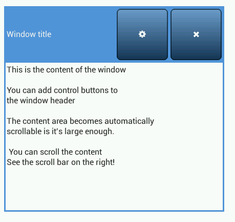