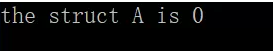
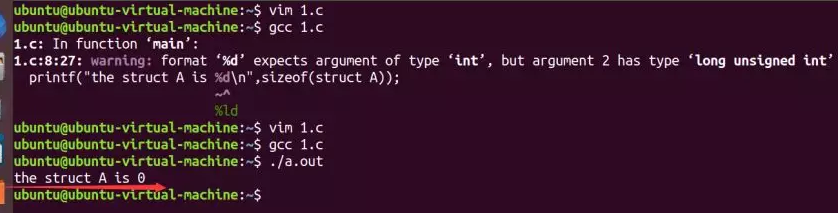
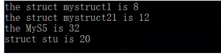
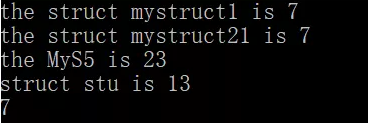
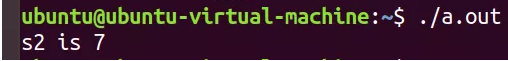
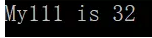
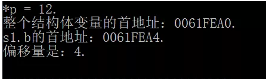
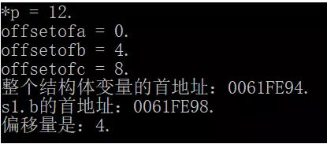
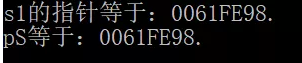

# 结构体对齐问题

​    

   1、在讨论这个问题之前，我们先来看一个代码示例：

```c
#include <stdio.h>
 struct A{

 };
int main(void)
{
  printf("the struct A is %d\n",sizeof(struct A));
  return 0;
}
```


演示结果：



在gcc编译环境演示结果：




说明：

​    

​    从这个试验现象当中，我们可以看出，在结构体初始化的时候，里面什么类型的数据都没有定义的时候，结构体所占用的内存字节大小为0(按照常规思路来想很正常，因为结构体本身就是我们自己定义的一种复杂数据类型，所谓复杂数据就是里面聚集各种基本数据类型，比如int ,  float  char  等；

**2、结构体对齐问题：**


   我们还是先慢慢来引导出这个问题，为此我们先来一个例子：

```c
#include <stdio.h>
struct A{
 int a;
 char b;
 float c;
};
int main(void)
{
    printf("the int is %d\n",sizeof(int));
    printf("the char is %d\n",sizeof(char));
    printf("the float is %d\n",sizeof(float));
    printf("the struct A is %d\n",sizeof(struct A));
    return 0;
}
```


演示输出结果：


说明：

   你会很惊讶，怎么结构体所占用的内存字节大小变成了12个字节，那个int 为4个字节，char 为1个字节，float为4个字节，按道理说，加起来是9个字节才对啊（怎么sizeof出来12个字节了）。这个就是我们接下来要讨论的结构体对齐问题了。

   

**3、下面我们就来接着分析上面最后打印出结构体占用内存大小为12个字节，却不是9个字节大小的原因。****首先我们要搞清楚好端端的结构体为啥要字节对齐呢？****在这之前，我们先来了解一下字节对齐概念：**


​    a、什么是字节对齐：

​     

​      在C语言中，结构体是一种复合数据类型，其构成元素既可以是基本数据类型（如int、long、float等）的变量，也可以是一些复合数据类型（如数组、结构、联合等）的数据单元（我上面有介绍）。在结构中，编译器为结构体的每个成员按其自然边界（alignment）分配空间。各个成员按照它们被声明的顺序在内存中顺序存储，第一个成员的地址和整个结构的地址相同。为了使CPU能够对变量进行快速的访问,变量的起始地址应该具有某些特性,即所谓的”对齐”. 比如4字节的int型,其起始地址应该位于4字节的边界上,即起始地址能够被4整除。


​    **b、为啥要字节对其呢，主要有以下几种原因：**

​       

​    (1)结构体中元素对齐访问主要原因是为了配合硬件，也就是说硬件本身有物理上的限制，如果对齐排布和访问会提高效率，否则会大大降低效率。


​    (2)内存本身是一个物理器件（DDR内存芯片，SoC上的DDR控制器），本身有一定的局限性：如果内存每次访问时按照4字节对齐访问，那么效率是最高的；如果你不对齐访问效率要低很多。


​    (3)还有很多别的因素和原因，导致我们需要对齐访问。譬如Cache的一些缓存特性，还有其他硬件（譬如MMU、LCD显示器）的一些内存依赖特性，所以会要求内存对齐访问。


​    (4)对比对齐访问和不对齐访问：对齐访问牺牲了内存空间，换取了速度性能；而非对齐访问牺牲了访问速度性能，换取了内存空间的完全利用。


- 小结：说白了，就是为访问结构体成员效率高，也就是读取数据更为高效（但是这里也会牺牲一点点内存）。

  

  c、我们还是用上面的那个例子来分析

```c
#include <stdio.h>
struct A{
 int a;
 char b;
 float c;
};
int main(void)
{
    printf("the int is %d\n",sizeof(int));//4
    printf("the char is %d\n",sizeof(char));//1
    printf("the float is %d\n",sizeof(float));//4
    printf("the struct A is %d\n",sizeof(struct A));//12
    return 0;
}
```


分析过程：

​         

​      首先是整个结构体，整个结构体变量4字节对齐是由编译器保证的，我们不用操心。然后是第一个元素a，a的开始地址就是整个结构体的开始地址，所以自然是4字节对齐的。但是a 的结束地址要由下一个元素说了算。然后是第二个元素b，因为上一个元素a本身占4字节，本身就是对齐的。所以留给b的开始地址也是 4字节对齐地址，所以b可以直接放（b放的位置就决定了a一共占4字节，因为不需要填充）。b的起始地址定了后，结束地址不能定（因为可能需要填充，所谓填充就是我上面说的要浪费一点内存了，但是没关系啦，我们提高了访问速度，不用多次去访问。），结束地址要看下一个元素来定。然后是第三个元素c，float类型需要4字节对齐（float类型元素必须放在类似0，2，4，8这样的 地址处，不能放在1，3这样的奇数地址处），因此c不能紧挨着b来存放，解决方案是在b之后添加3字节的填充（padding），然后再开始放c。c放完之后还没结束 **当整个结构体的所有元素都对齐存放后，还没结束，因为整个结构体大小还要是4的整数倍,这一点非常重要，所以最后就是12个字节啦**。下面是我用示意头图来展示：


这里我还要说明一下，有人可能有这样的疑惑，b加一个字节不就是2个字节了吗，然后c直接放到b后面就可以了，这样cpu在访问的时候，也只要访问三次（加起来就是10个字节了），但是这符合我上面说的那个规律（不能被4字节整除，哈哈哈，而且要注意的是，这里我是在32位环境下操作的，这个很关键，不同环境结果会不一样）。

​    

​    下面我再举几个例子来演示（这里我就不仔细分析了，读者可以牛刀小试一下）：

```c
#include <stdio.h>
   struct mystruct1
  {                    // 1字节对齐    4字节对齐
     int a;            // 4            4
     char b;            // 1            2(1+1)
     short c;        // 2            2
  };


  struct mystruct21
  {                    // 1字节对齐    4字节对齐
      char a;            // 1            4(1+3)
      int b;            // 4            4
      short c;        // 2            4(2+2)
 };
 typedef struct myStruct5
 {                            // 1字节对齐    4字节对齐
     int a;                    // 4            4
     struct mystruct1 s1;    // 7            8
     double b;                // 8            8
     int c;                    // 4            4   
  }MyS5;

   struct stu
  {                            // 1字节对齐    4字节对齐
    char sex;              // 1            4(1+3)
    int length;                // 4            4
    char name[10];         // 10           12(10+2)
    };

    int main(void)
     {
       printf("the struct mystruct1 is %d\n",sizeof( struct mystruct1 ));
       printf("the struct mystruct21 is %d\n",sizeof( struct mystruct21));

       printf("the MyS5 is %d\n",sizeof(struct myStruct5));
       printf("struct stu is %d\n",sizeof( struct stu));


        return 0;
    }
```


演示输出结果：



注意：

​    这里的第三个结构体输出结果怎么为32个字节了，注意我电脑是64位的。


**4、gcc支持但不推荐的对齐指令：****#pragma pack()  #pragma pack(n) (n=1/2/4/8)：**

  

  (1)#pragma是用来指挥编译器，或者说设置编译器的对齐方式的。编译器的默认对齐方式是4，但是有时候我不希望对齐方式是4，而希望是别的（譬如希望1字节对齐，也可能希望是8，甚至可能希望128字节对齐）。


  (2)常用的设置编译器编译器对齐命令有2种：第一种是#pragma pack()，这种就是设置编译器1字节对齐（有些人喜欢讲：设置编译器不对齐访问，还有些讲：取消编译器对齐访问）；第二种是#pragma pack(4)，这个括号中的数字就表示我们希望多少字节对齐。


  (3)我们需要#prgama pack(n)开头，以#pragma pack()结尾，定义一个区间，这个区间内的对齐参数就是n。


  (4)#prgma pack的方式在很多C环境下都是支持的，但是gcc虽然也可以，不过不建议使用。

```c
#include <stdio.h>
#pragma pack(1)
struct mystruct1
{                    // 1字节对齐    4字节对齐
   int a;            // 4            4
   char b;           // 1            2(1+1)
   short c;          // 2            2
};


struct mystruct21
{                    // 1字节对齐    4字节对齐
   char a;           // 1            4(1+3)
   int b;            // 4            4
   short c;          // 2            4(2+2)
};
struct myStruct5
{                          // 1字节对齐    4字节对齐
   int a;                  // 4            4
   struct mystruct1 s1;    // 7            8
   double b;               // 8            8
   int c;                  // 4            4   
}MyS5;

struct stu
{                           // 1字节对齐    4字节对齐
  char sex;                 // 1            4(1+3)
 int length;                // 4            4
 char name[8];              // 8            12(10+2)
};

#pragma pack()
int main(void)
{
	printf("the struct mystruct1 is %d\n",sizeof( struct mystruct1 ));
	printf("the struct mystruct21 is %d\n",sizeof( struct mystruct21));

	printf("the MyS5 is %d\n",sizeof(struct myStruct5));
	printf("struct stu is %d\n",sizeof( struct stu));

	printf("%d",sizeof(struct mystruct1));
	return 0;
}
```

输出演示结果：




说明：

   

​    通过实验现象，可以看到我设置了1字节（读者也可以尝试设置一下其他字节对齐，看看结果如何）。


**5、gcc推荐的对齐指令__attribute__((packed)) __attribute__((aligned(n)))：**

**
**

   (1)__attribute__((packed))使用时直接放在要进行内存对齐的类型定义的后面，然后它起作用的范围只有加了这个东西的这一个类型。packed的作用就是取消对齐访问。

```c
#include <stdio.h>

struct mystruct1
 {                    // 1字节对齐    4字节对齐
      int a;          // 4            4
      char b;         // 1            2(1+1)
      short c;        // 2            2
}__attribute__((packed));

int main(void)
{

   struct mystruct1  s2;

   printf("s2 is %d\n",sizeof( s2));
   return 0;
}
```

演示结果：




   (2)__attribute__((aligned(n)))使用时直接放在要进行内存对齐的类型定义的后面，然后它起作用的范围只有加了这个东西的这一个类型。它的作用是让整个结构体变量整体进行n字节对齐（注意是结构体变量整体n字节对齐，而不是结构体内各元素也要n字节对齐）。

```c
#include <stdio.h>

typedef struct mystruct111
{                    // 1字节对齐    4字节对齐       2字节对齐
      int a;            // 4            4               4
      char b;            // 1            2(1+1)          2
      short c;        // 2            2               2
      short d;      // 2            4(2+2)          2
}__attribute__((aligned(32))) My111;

int main(void)
{
    printf("My111 is %d\n",sizeof(My111 ));
    return 0;
}
```

演示输出结果：




**二、.offsetof宏与container_of宏**：


​     1、通过结构体整体变量来访问其中各个元素，本质上是通过指针方式来访问的，形式上是通过.的方式来访问的（这时候其实是编译器帮我们自动计算了偏移量）。

```c
#include <stdio.h>

struct mystruct
{
   char a;         
   int b;          
   short c;        
};
int main(void)
 {
   struct mystruct s1;
   s1.b = 12;

   int *p = (int *)((char *)&s1 + 4);
   printf("*p = %d.\n", *p);

   printf("整个结构体变量的首地址：%p.\n", &s1);
   printf("s1.b的首地址：%p.\n", &(s1.b));
   printf("偏移量是：%d.\n", (char *)&(s1.b) - (char *)&s1);

   return 0;
 }
```

演示结果：




​    **2、offsetof宏：**

**
**

​     (1)offsetof宏的作用是：用宏来计算结构体中某个元素和结构体首地址的偏移量（其实质是通过编译器来帮我们计算）。


​     (2)offsetof宏的原理：我们虚拟一个type类型结构体变量，然后用type.member的方式来访问那个member元素，继而得到member相对于整个变量首地址的偏移量。

```c
#include <stdio.h>

 struct mystruct
 {
     char a;            
     int b;         
     short c;       
 };
// TYPE是结构体类型，MEMBER是结构体中一个元素的元素名
// 这个宏返回的是member元素相对于整个结构体变量的首地址的偏移量，类型是int
 #define     offsetof(TYPE, MEMBER)       ((int) &((TYPE *)0)->MEMBER)
int main(void)
{
     struct mystruct s1;
     s1.b = 12;

     int *p = (int *)((char *)&s1 + 4);
     printf("*p = %d.\n", *p);


     int offsetofa = offsetof(struct mystruct, a);
     printf("offsetofa = %d.\n", offsetofa);

     int offsetofb = offsetof(struct mystruct, b);
     printf("offsetofb = %d.\n", offsetofb);

     int offsetofc = offsetof(struct mystruct, c);
     printf("offsetofc = %d.\n", offsetofc);


     printf("整个结构体变量的首地址：%p.\n", &s1);
     printf("s1.b的首地址：%p.\n", &(s1.b));
     printf("偏移量是：%d.\n", (char *)&(s1.b) - (char *)&s1);

      return 0;
}
```

演示结果：




说明：

​        

   (TYPE *)0	这是一个强制类型转换，把0地址强制类型转换成一个指针， 这个指针指向一个TYPE类型的结构体变量。（实际上这个结构体变量可能不存在，但是只要我们不去解引用这个指针就不会出错）。((TYPE *)0)->MEMBER	(TYPE *)0是一个TYPE类型结构体变量的指针，通过指针来访问这个结构体变量的member元素，&((TYPE *)0)->MEMBER  等效于&(((TYPE *)0)->MEMBER)，意义就是得到member元素的地址。但是因为整个结构体变量的首地址是0，所以就可以计算出它的偏移量来。


​    **3、container_of宏：**

​     

​       (1)作用：知道一个结构体中某个元素的指针，反推这个结构体变量的指针。有了container_of宏，我们可以从一个元素的指针得到整个结构体变量的指针，继而得到结构体中其他元素的指针。


​      (2)typeof关键字的作用是：typepef(a)时由变量a得到a的类型，typeof就是由变量名得到变量数据类型的。


​      (3)这个宏的工作原理：先用typeof得到member元素的类型定义成一个指针，然后用这个指针减去该元素相对于整个结构体变量的偏移量（偏移量用offsetof宏得到的），减去之后得到的就是整个结构体变量的首地址了，再把这个地址强制类型转换为type *即可。

```c
#include <stdio.h>

struct mystruct
{
     char a;            
     int b;         
     short c;       
};

  // TYPE是结构体类型，MEMBER是结构体中一个元素的元素名
  // 这个宏返回的是member元素相对于整个结构体变量的首地址的偏移量，类型是int
  #define offsetof(TYPE, MEMBER) ((int) &((TYPE *)0)->MEMBER)

  // ptr是指向结构体元素member的指针，type是结构体类型，member 是结构体中一个元素的元素名
 // 这个宏返回的就是指向整个结构体变量的指针，类型是(type *)
#define container_of(ptr, type, member) ({            \
const typeof(((type *)0)->member) * __mptr = (ptr); \
(type *)((char *)__mptr - offsetof(type, member)); })

int main(void)
 {
      struct mystruct s1;
      struct mystruct *pS = NULL;

      short *p = &(s1.c);       // p就是指向结构体中某个member的指针

       printf("s1的指针等于：%p.\n", &s1);

       // 问题是要通过p来计算得到s1的指针
       pS = container_of(p, struct mystruct, c);
        printf("pS等于：%p.\n", pS);


         return 0;
}
```

演示结果：



说明：

​    

​    

​    其中代码难以理解的地方就是它灵活地运用了0地址（这个零地址可以看[c专题之指针---野指针和空指针解析](http://mp.weixin.qq.com/s?__biz=MzI3NzYwNTg2Nw==&mid=2247483851&idx=1&sn=5f0ceb0a6156b4783db059f96b6c635c&chksm=eb62fd4fdc157459a7034948df1fd3c4cafb49f48b4f06648a36ecfad630ee64b696093d4487&scene=21#wechat_redirect)，还有const的位置运用，可以看[超实用的const用法](http://mp.weixin.qq.com/s?__biz=MzI3NzYwNTg2Nw==&mid=2247483664&idx=1&sn=b491651140f54c7966884685beb3621c&chksm=eb62fd94dc157482e5a284d4800f4607158a5420773cc6ae91d369ba7ece8256c4306062a8cd&scene=21#wechat_redirect)）。如果觉得&( (struct mystruct *)0 )->member这样的代码不好理解，那么我们可以假设在0地址分配了一个结构体变量struct mystruct a，然后定义结构体指针变量p并指向a（struct mystruct*p = &s1），如此我们就可以通过&p->c获得成员地址的地址。由于a的首地址为0x0，所以成员c的地址就如上图所以。