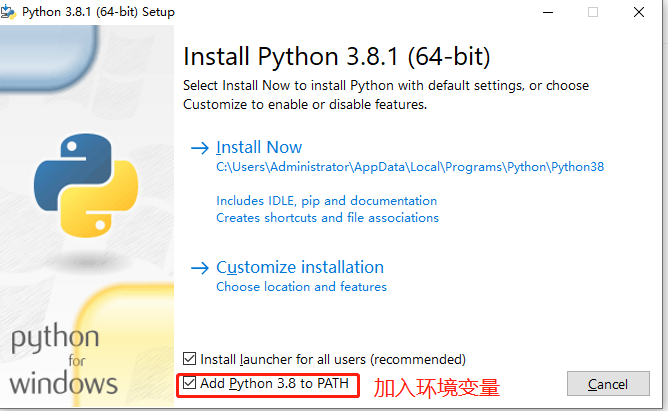
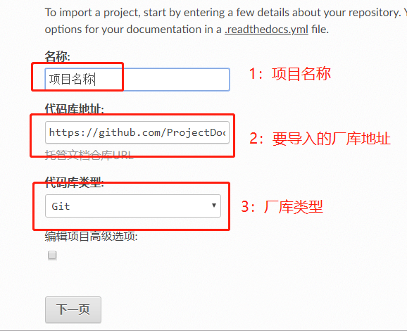

# Sphinx环境配置

## 软件安装

1. 安装vscode

2. 安装python3，并增加到系统环境变量

   

3. 安装sphinx

   ```
   #国内用户推荐使用清华源安装，使用-i指定源
   py -3 -m pip install -i https://pypi.tuna.tsinghua.edu.cn/simple sphinx
   ```

4. 安装python依赖包

   先git模板工程，cd到含有requirements.txt的目录，然后安装所需插件。

   ```
   py -3 -m pip install -r requirements.txt -i https://pypi.tuna.tsinghua.edu.cn/simple
   ```

5. vscode 安装python、reStructuredText和Table Formater插件

6. 使sphinx支持markdown基础语法,安装recommonmark插件

   ```
   pip install recommonmark
   ```

   在conf.py添加扩支持：

   ```
   extensions = ['recommonmark']
   ```

7. 使sphinx支持markdown表格支持

   ```
   pip install sphinx-markdown-tables
   ```

   在conf.py添加扩展支持：

   ```
   extensions = [
      'sphinx_markdown_tables',
   ]
   ```

8. 使用pandoc进行文档转换

   待写***

## 部署

注册the  read docs账号，最好用自己的github账号，方便手动导入自己账号下的工程。在the  read docs网站导入自己的项目，编译即可。

