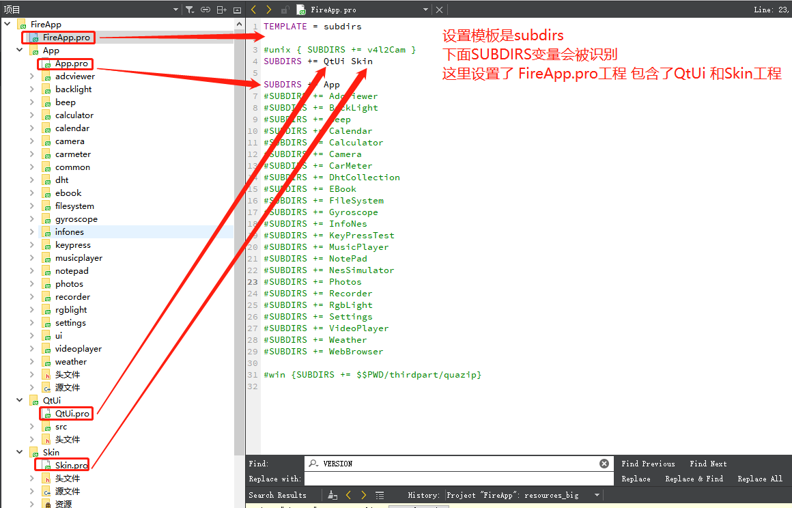

# Qt 工程文件.pro说明

## qmake作用

qmake会根据.pro文件，针对不同的平台和编译器生成不同的Makefile。

如果QT工程新建好了以后，可以用qmake工具对.pro文件执行下面命令生成Makefile：

```
// .pro生成Makefile
qmake hello.pro -o Makefile
// 生成Makefile之后就可以编译程序
make
```

## .pro文件解读

**TEMPLATE 模板变量** 

模块会告诉qmake为这个应用程序生成哪种makefile。

1. `TEMPLATE = app` 建立一个应用程序的Makefile，默认值；
2. `TEMPLATE = lib` 建立一个库的Makefile；
3. `TEMPLATE = vcapp`  建立一个应用程序的`Visual Studio`项目文件 ；
4. `TEMPLATE = vclib`  建立一个库的`Visual Studio`项目文件 ;
5. `TEMPLATE = subdirs`  这是一个特殊的模板， 它可以创建一个能够进入特定目录并且为一个项目文件生成`makefile`，并且为它调用`make`的`makefile`。 

 **“app”模板** 

“app”模板告诉*qmake*为建立一个应用程序生成一个makefile。当使用这个模板时，下面这些*qmake*系统变量是被承认的。你应该在你的.pro文件中使用它们来为你的应用程序指定特定信息。

- QT：指定项目中使用Qt的模块。默认情况下，QT包含core和gui，以确保标准的GUI应用程序无需进一步的配置就可以构建，下面一行将构建一个很小的Qt项目：

  ```
  QT -= gui # 仅仅使用core模块
  ```

  如果要创建一个界面，里面用到XML及网络相关的类，那么需要包含如下模块：

  ```
  QT += core gui widgets xml network
  ```

- HEADERS ：头文件的列表；

  ```
  HEADERS += \
          mainwindow.h \
          statusbarwidget.h \
          threadkey.h \
          threadmousecheck.h
  ```

- SOURCES ：源文件的列表；

  ```
  SOURCES += \
          main.cpp \
          mainwindow.cpp \
          statusbarwidget.cpp \
          threadkey.cpp \
          threadmousecheck.cpp
  ```

- TARGET：可执行应用程序的名称。默认值为项目文件的名称；

  ```
  TARGET = App #编译出来的app名字
  ```

- FORMS ：界面.ui文件的列表；

  ```
  FORMS    += \
          mainwindow.ui
  ```

- DESTDIR：可执行程序目标的输出目录；

  ```
  DESTDIR         = $$PWD/../thirdpart/libqui/lib #指定应用程序输出目录
  ```

- DEFINES：宏定义列表；

  ```
  DEFINES += QTUI_LIBRARY  #定义一个QTUI_LIBRARY宏，相当于define
  ```

- INCLUDEPATH：应用程序所需的额外的包含路径的列表， 一般要编译链接第三方库时配置include目录  

  ```
  INCLUDEPATH += $$PWD/../thirdpart/libskin/include # 如果路径包含空格，需要加双引号
  ```

- RESOURCES：资源文件， 即.qrc 文件；

  ```
  RESOURCES += \
      images.qrc
  ```

- LIBS：加载库文件；

  ```
  LIBS += -L$$PWD/../thirdpart/libskin/lib -lSkin #加载PWD/../thirdpart/libskin/lib路径下的Skin库
  ```

- MOC_DIR： MOC命令将含Q_OBJECT的头文件转换为标准的头文件存放的目录； 

  ```
  MOC_DIR         = $$PWD/../build/app
  ```

- OBJECTS_DIR： 指定所有中间文件.o（.obj）放置的目录；

  ```
  OBJECTS_DIR     = $$PWD/../build/app
  ```

-  TRASHLATIONS ： 加载要用到的语言翻译*.ts文件 ；

  ```
  TRANSLATIONS    = qt_zh.ts qt_en.ts
  ```

- UI_DIR：UIC将ui转化为头文件所存放的目录；

- RCC_DIR：RCC将qrc文件转化为头文件所存放的目录；

- CONFIG变量:

  配置变量指定了编译器所要使用的选项和所需要被连接的库。配置变量中可以添加任何东西，但只有下面这些选项可以被qmake识别。

  下面这些选项控制着使用哪些编译器标志：

  - release：应用程序将以release模式连编。如果“debug”被指定，它将被忽略。
  - debug：应用程序将以debug模式连编。
  - warn_on：编译器会输出尽可能多的警告信息。如果“warn_off”被指定，它将被忽略。
  - warn_off：编译器会输出尽可能少的警告信息。

  下面这些选项定义了所要连编的库/应用程序的类型：

  - qt：应用程序是一个Qt应用程序，并且Qt库将会被连接。
  - thread：应用程序是一个多线程应用程序。
  - x11：应用程序是一个X11应用程序或库。
  - windows：只用于“app”模板：应用程序是一个Windows下的窗口应用程序。
  - console：只用于“app”模板：应用程序是一个Windows下的控制台应用程序。
  - dll：只用于“lib”模板：库是一个共享库（dll）。
  - staticlib：只用于“lib”模板：库是一个静态库。
  - plugin：只用于“lib”模板：库是一个插件，这将会使dll选项生效。

  例如，如果你的应用程序使用Qt库，并且你想把它连编为一个可调试的多线程的应用程序，你的项目文件应该会有下面这行：

    CONFIG += qt thread debug

  注意，你必须使用“+=”，不要使用“=”，否则*qmake*就不能正确使用连编Qt的设置了，比如没法获得所编译的Qt库的类型了。

**“lib”模板**

“lib”模板告诉*qmake*为建立一个库而生成makefile。当使用这个模板时，除了“app”模板中提到系统变量，还有一个*VERSION*是被支持的。你需要在为库指定特定信息的.pro文件中使用它们。

- VERSION：目标库的版本号，比如，2.3.1。

**“subdirs”模板**

“subdirs”模板告诉qmake生成一个makefile，它可以进入到特定子目录并为这个目录中的项目文件生成makefile并且为它调用make。

在这个模板中只有一个系统变量*SUBDIRS*可以被识别。

```
TEMPLATE = subdirs

SUBDIRS += QtUi Skin App

```

