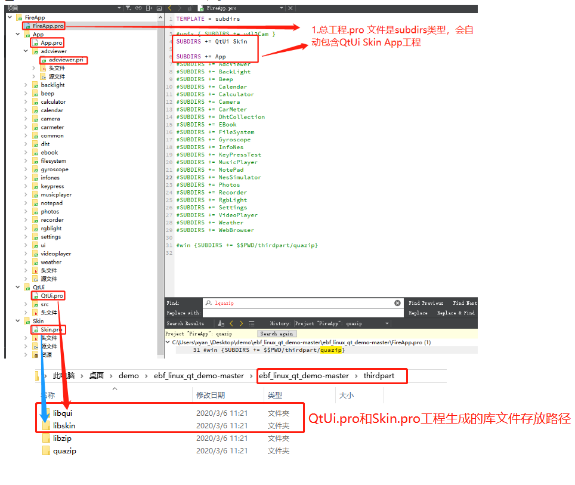
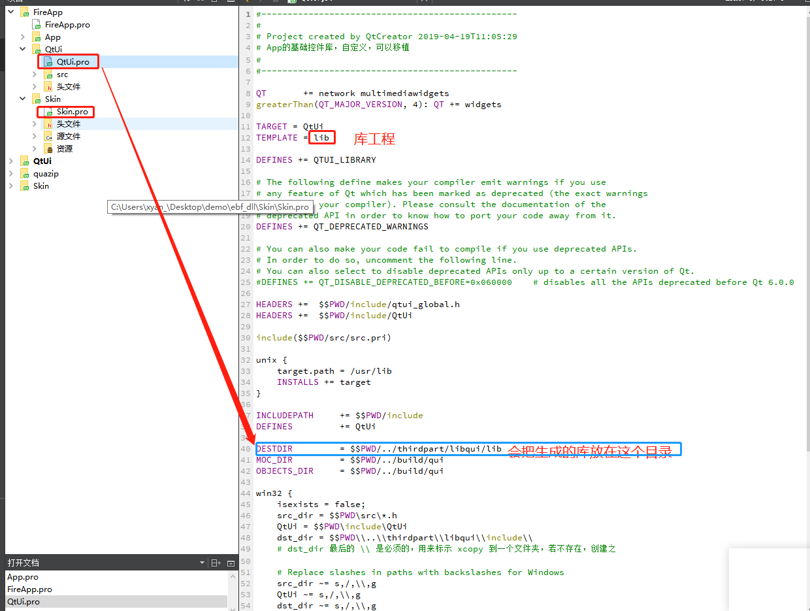
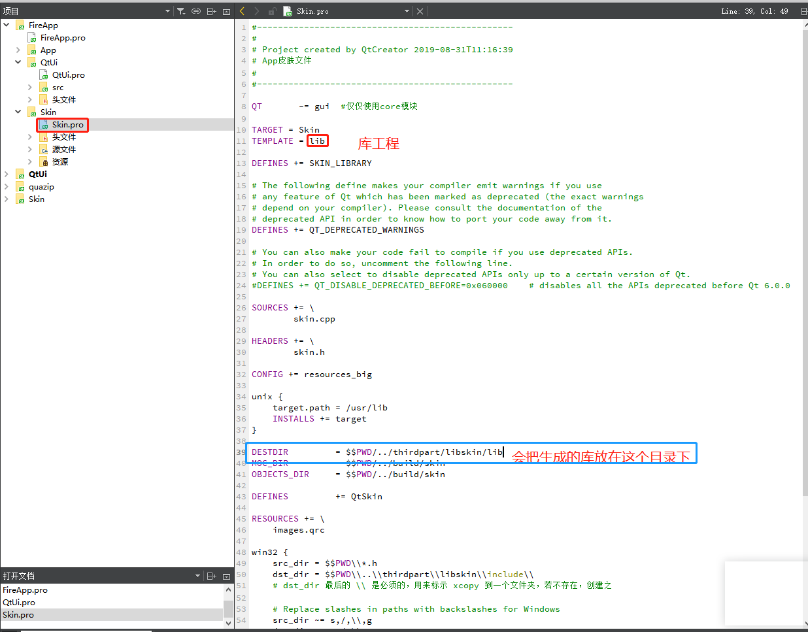
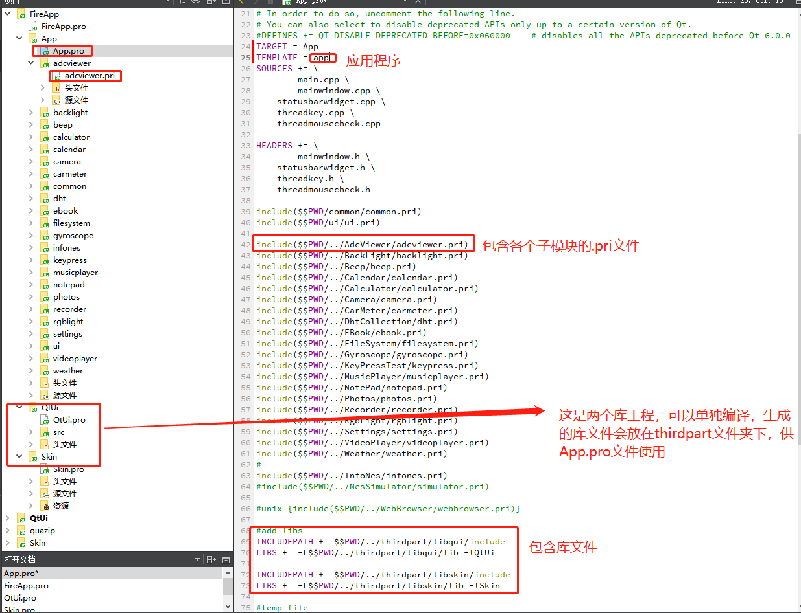

# 野火QtAPP工程解析

## FireApp.pro文件

如下图所示，FireApp.pro指定是个subdirs模板，所以FireApp.pro只会包含各个子模块，例如在这里指明该工程依赖QtUi.pro工程、Skin.pro工程和App.pro工程。在程序编译的时候会先执行QtUi.pro和Skin.pro工程，再编译App.pro工程，实际上后面会介绍，QtUi.pro和Skin.pro工程是个库工程，编译生成的库文件放在**ebf_linux_qt_demo-master\thirdpart**目录下，然后编译App.pro的时候会去该目录下找这些库文件，链接到App中。

从上图还可以看出，**ebf_linux_qt_demo-master\thirdpart**目录下还会有libzip和quazip目录，FireApp.pro文件最后一句有个注释掉的 `#win {SUBDIRS += $$PWD/thirdpart/quazip}`代码，那么libzip和quazip目录是干什么用的？

其实是quazip是一个解压缩的开源工程，可以生成一个库文件供程序使用，生成的存放路径在**ebf_linux_qt_demo-master\thirdpart\libzip**路径下，即**ebf_linux_qt_demo-master\thirdpart\quazip**是源码，生成的库在**ebf_linux_qt_demo-master\thirdpart\libzip**里面存放着。只不过FireApp.pro文件目前没有把这个库编译到工程（前面不是说被注释掉了）。到这里就清楚了**bf_linux_qt_demo-master\thirdpart**路径下的文件都是怎么来的了。

## QtUi.pro和Skin.pro文件

从下图中可以看出QtUi.pro和Skin.pro都是库工程，编译的库存放路径在**ebf_linux_qt_demo-master\thirdpart**路径下。上面说的**ebf_linux_qt_demo-master\thirdpart\quazip**目录下的quazip.pro工程也是一样，这里不再累赘。

## App.pro文件

从下图可以看出，App.pro是一个app模板，会包含各个子模块，例如adcviewer.pri等文件，然后会链接**ebf_linux_qt_demo-master\thirdpart**目录下的QtUi和Skin库文件（即上面介绍的QtUi.pro和Skin.pro工程生成的库文件）。

## 综述

QtUi.pro、Skin.pro和quazip.pro工程都是可以单独拉出来编译的，编译完后生成的库文件在**ebf_linux_qt_demo-master\thirdpart**目录下存放，然后App.pro工程，根据各个子模块的.pri文件和库文件最终生成应用程序存放在app_bin目录下。

