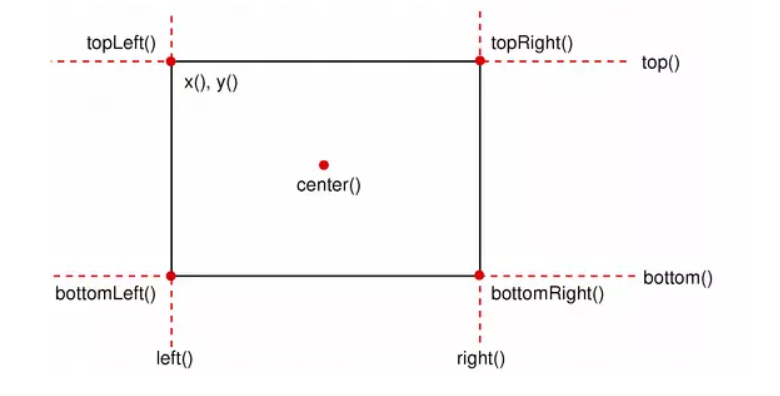

# Rect类说明

如下图所示，QRect   mRect，可以获取以下坐标。

| 函数          | 说明                                                       |
| ------------- | ---------------------------------------------------------- |
| x()           | 返回矩形左上角x坐标，即left()                              |
| y()           | 返回矩形左上角y坐标，即top()                               |
| width()       | 返回矩形宽度                                               |
| height()      | 返回矩形高度                                               |
| left()        | 返回矩形左边x坐标，即左上角x坐标，即x()                    |
| right()       | 返回矩形右边坐标，实际就是left()+width()-1                 |
| top()         | 返回矩形上边的y坐标，即y()                                 |
| topLeft()     | 返回矩形左上角点坐标(x(),y())                              |
| bottomLeft()  | 返回矩形左下角点坐标 （left()，top()+height()-1）          |
| topRight()    | 返回矩形右上角点坐标 （left()+width()-1,top()）            |
| bottomRight() | 返回矩形右下角点坐标 （left()+width()-1,top()+height()-1） |
| center()      | 返回矩形中心点坐标                                         |
|               |                                                            |
|               |                                                            |
|               |                                                            |
|               |                                                            |

