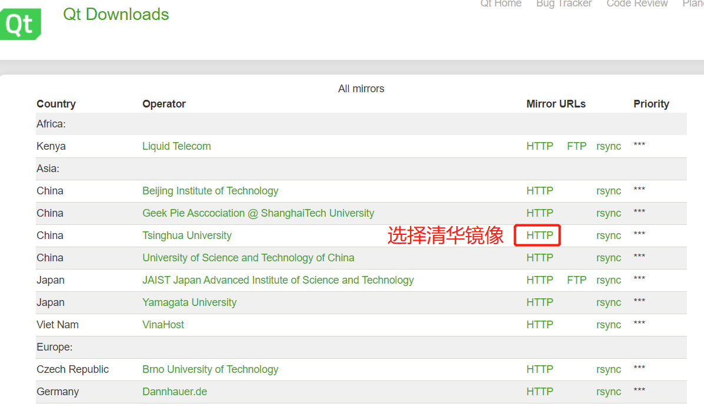
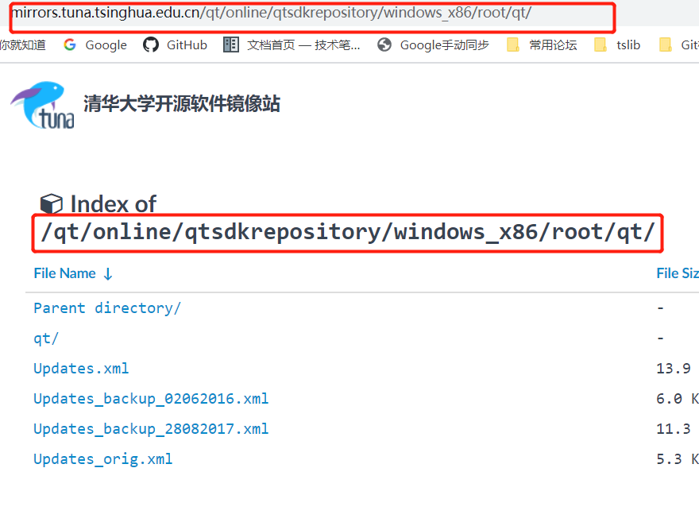
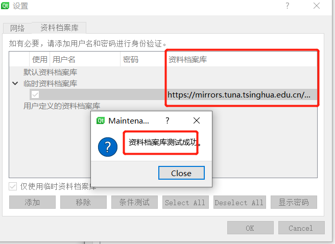
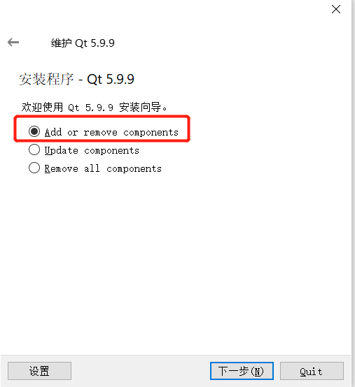

# QT 维护MaintenanceTool.exe

1. 打开 http://download.qt.io/static/mirrorlist/ 这个网站，选择清华镜像。

依次进入【/online/qtsdkrepository/windows_x86/root/qt/】里面，复制当前网址https://mirrors.tuna.tsinghua.edu.cn/qt/online/qtsdkrepository/windows_x86/root/qt/ 

2. 找到QT安装目录：D:\Qt\Qt5.9.9\MaintenanceTool.exe,双击打开设置如下

把复制的网址https://mirrors.tuna.tsinghua.edu.cn/qt/online/qtsdkrepository/windows_x86/root/qt/ 添加到临时资料档案库中。点击条件测试，会提示是否成功。

3. 下一步就可以选择增加或者移除组件了

   