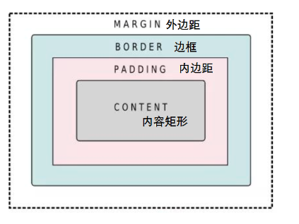

# QT 样式表qss



```
#样式是个键值对，用:隔开
# background-color	设置背景色
# color 			前景色
# font-size:20px  	字体大小
# font-family:		黑体
# border:3px solid red  边框 上下左右可以分开设置
# border 				四条边相同样式
#border-style  			四条线统一设置--上 右 下 左
#四条边分开设置 border-top-style  border-right-style  border-bottom-style  border-left-style
# 3px 边框像素---宽度-单位：像素，也可以em,1em=16px
#border-width 上 右 下 左  ----- 边框宽度
#分开设置：border-top-width   border-right-width  border-bottom-width  border-left-width
# solid 实线----边框样式   dotted 点状边框    none无边框     dashed 虚线
# double    双线    groove 定义3D凹槽边框。其效果取决于border-color的值
# ridge 定义3D垄状边框。其效果取决于 border-color的值
# inset 定义3D inset边框。其效果取决于 border-color的值
# outset 定义3D outset边框。其效果取决于 border-color的值
# red 红色
#统一设置 border-color 上 右 下 左
#四条线分开设置 border-top-color  border-right-color  border-bottom-color  border-left-color
#颜色 可以用rgb(2,2,2)   也可以  #00FF00
#常用颜色 https://blog.csdn.net/zy_heu/article/details/78952173
# width: 40px   设置宽度
# height: 40px  设置高度
# image:url(./大象.png)   添加图片
# margin    外边距
# padding   内边距
# content  内容矩形
# 设置多个属性用;隔开


伪状态    描述

:checked    button部件被选中
:disabled    部件被禁用
:enabled    部件被启用
:focus    部件获得焦点
:hover    鼠标位于部件上
:indeterminate    checkbox或radiobutton被部分选中
:off    部件可以切换，且处于off状态
:on    部件可以切换，且处于on状态
:pressed    部件被鼠标按下
:unchecked    button部件未被选中


 子部件    描述
::down-arrow    combo box或spin box的下拉箭头
::down-button    spin box的向下按钮
::drop-down    combo box的下拉箭头
::indicator    checkbox、radio button或可选择group box的指示器
::item    menu、menu bar或status bar的子项目
::menu-indicator    push button的菜单指示器
::title    group box的标题
::up-arrow    spin box的向上箭头
::up-button    spin box的向上按钮
```

