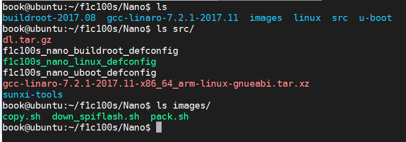
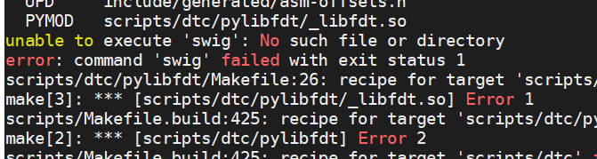
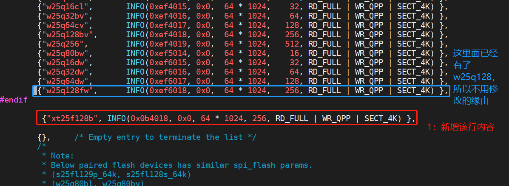
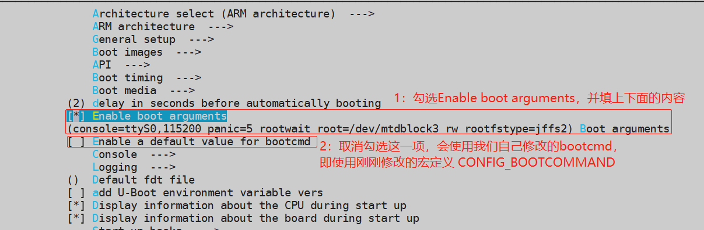
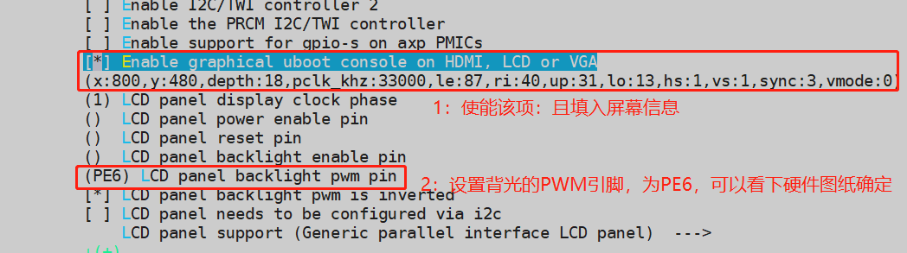
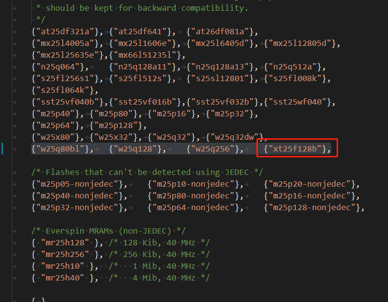
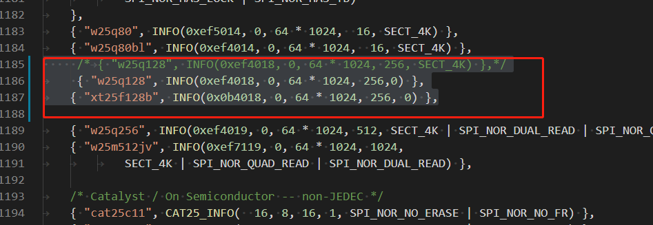
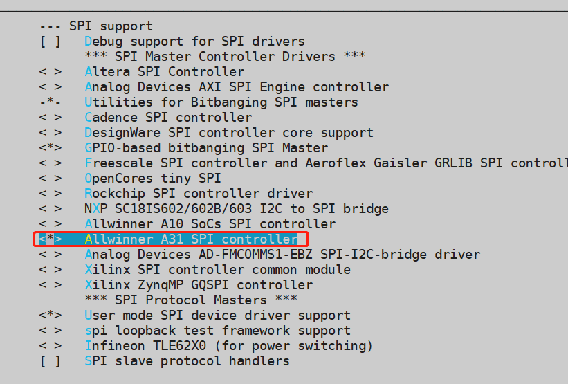

#F1C100S/F1C200S系统构建

## linux

**硬件平台**：荔枝派Nano flash芯片型号：xt25f128b 16M的spi nor flash

**开发平台**：ubuntu18.04

本文档中需要的文件都在`/home/book/f1c100s/Nano` 目录下，以下是我个人的截图：



1. 工作目录：我们所有的编译都在下面的目录下进行，后面会具体讲这些目录的是如何得到的。

   - buildroot-2017.08：用来编译根文件系统；
   - gcc-linaro-7.2.1-2017.11：交叉编译器存放的目录；
   - linux：内核源码目录；
   - u-boot：uboot源码目录。

2. 一些辅助工具和文件

   - src/dl.tar.gz：由于buildroot-2017.08编译时需要下载很多文件，很慢，所以这里打包好了这些所需文件，用的时候直接解压到buildroot-2017.08的目录下即可。

   - src/f1c100s_nano_buildroot_defconfig：文件系统的默认配置文件；

   - src/f1c100s_nano_linux_defconfig：内核的默认配置文件；

   - src/f1c100s_nano_uboot_defconfig：uboot的默认配置文件；

   - src/gcc-linaro-7.2.1-2017.11-x86_64_arm-linux-gnueabi.tar.xz：下载好的交叉编译器原始压缩包

   - src/sunxi-tools：下载好的下载工具原始文件；

   - images/copy.sh  ：我自己写的用来拷贝编译后的uboot zImage 设备树 文件系统到当前目录下的脚本；

     - uboot镜像文件：/home/book/f1c100s/Nano/u-boot/u-boot-sunxi-with-spl.bin
     - 设备树镜像文件：/home/book/f1c100s/Nano/linux/arch/arm/boot/dts/suniv-f1c100s-licheepi-nano.dtb
     - 内核镜像zImage文件：/home/book/f1c100s/Nano/linux/arch/arm/boot/zImage
     - 文件系统镜像文件：/home/book/f1c100s/Nano/buildroot-2017.08/output/images/rootfs.tar

     这些文件在编译后分散在各个文件夹下，这时我们就可以使用该脚本执行拷贝工作：

     ```bash
     sudo sh copy.sh
     ```

     

   - images/pack.sh：我自己写的用来把uboot zImage 设备树 文件系统打包成一个镜像文件的脚本；

     当我们编译出来各个镜像文件后，需要烧录到spiflash里面去执行，烧录方法可以单独一个一个的烧录，如下所示：

     ```bash
     sudo sunxi-fel -p spiflash-write 0 u-boot-sunxi-with-spl.bin
     sudo sunxi-fel -p spiflash-write 0x100000 suniv-f1c100s-licheepi-nano.dtb
     sudo sunxi-fel -p spiflash-write 0x110000 zImage
     sudo sunxi-fel -p spiflash-write 0x510000 rootfs.jffs2
     
     ```

     也可以把这些镜像文件整体打包一个出来，然后一次烧录即可完成：

     ```bash
     sudo pack.sh
     ```

     执行结果会生成 f1c100s_spiflash_16M.bin和jffs2.img文件，其中 `f1c100s_spiflash_16M.bin`即是把内核设备树文件系统uboot打包后的整个镜像文件。

     

   - images/down_spiflash.sh ：我自己写的用来下载打包好的镜像文件到spiflash的脚本；

     当我们完成打包后，可以执行下面的命令完成下载工作。

     ```
     sudo sh down_spiflash.sh 
     或者执行
     sudo sunxi-fel -p spiflash-write 0 ./f1c100s_spiflash_16M.bin
     下载整个镜像文件到spiflash里面
     ```

     

## 开发环境

首先安装必要的库。

```bash
sudo apt-get install build-essential subversion git-core libncurses5-dev zlib1g-dev gawk flex quilt libssl-dev xsltproc libxml-parser-perl mercurial bzr ecj cvs unzip lib32z1 lib32ncurses5 lib32bz2-1.0 -y
sudo apt-get install vim flex bison texinfo u-boot-tools lib32stdc++6 -y
```


## 安装烧录工具

该工具是在ubuntu下烧录spiflash的工具。

注意：使用`sunxi-tools`烧录nano的SPIflash的时候，需要上电前把SPI0-CS 和GND短接，然后usb上电，此时保持短接3s，进入下载模式后，断开短接即可使用工具烧录flash。

```bash
#安装编译必要的库
sudo apt-get install libusb-1.0-0-dev
sudo apt-get install mtd-utils

git clone https://gitee.com/LicheePiNano/sunxi-tools.git
# 查看分支
git branch -a
# 切换到 Nano 分支
git checkout f1c100s-spiflash

#编译并安装工具
cd sunxi-tools
make && sudo make install
```

## 安装交叉编译环境

```bash
#此处为获取7.2.1版本，您可获取其他版本或者通过链接直接下载
wget http://releases.linaro.org/components/toolchain/binaries/7.2-2017.11/arm-linux-gnueabi/gcc-linaro-7.2.1-2017.11-x86_64_arm-linux-gnueabi.tar.xz

tar -vxJf gcc-linaro-7.2.1-2017.11-x86_64_arm-linux-gnueabi.tar.xz

#交叉编译工具的文件名字太长了，我们给重新命名
mv gcc-linaro-7.2.1-2017.11-x86_64_arm-linux-gnueabi gcc-linaro-7.2.1-2017.11

#把工具链的路径添加到环境变量
sudo vim ~/.bashrc

# 在文件末尾 添加以下内容

export ARCH=arm
export CROSS_COMPILE=arm-linux-gnueabi-
export PATH=$PATH:/home/book/f1c100s/Nano/gcc-linaro-7.2.1-2017.11/bin

# 添加完毕

# 使路径生效
source  ~/.bashrc
```


## uboot

### 资源下载

```bash
git clone -b nano-lcd800480 https://gitee.com/LicheePiNano/u-boot.git
```

### 编译

- 执行默认配置

  ```bash
  make f1c100s_nano_uboot_defconfig
  ```

- 编译

  ```bash
  make -j8
  ```

  

- FAQ

  - 问题1：

    
    
    解决
    
```bash
    sudo apt-get install swig
```


​    
- 问题2：
  
  
  
  解决：
  
    ```bash
    sudo apt-get install python-dev
    ```
  
  
  
- 问题3：
  
  欢迎补充

### 烧录

烧录前请使Nano进入usb烧录模式（需要上电前把SPI0-CS 和GND短接，然后usb上电，此时保持短接3s，进入烧录模式后，断开短接即可使用sunxi-fel工具烧录flash），然后把usb设备放到ubuntu下，如下截图，usb设备名字是Onda USB Device，点击连接即可。


烧录：

- ```bash
  直接执行烧录命令
  sudo sunxi-fel -p spiflash-write 0 ./u-boot-sunxi-with-spl.bin
  
  或者执行下载脚本down_uboot_spiflash.sh，
  sudo sh down_uboot_spiflash.sh   #自己写的下载脚本，其实就是把上面的下载命令写入到脚本文件中
  
  注意：上面两条命令执行一个即可完成烧录u-boot-sunxi-with-spl.bin到SPIflash里面
  ```


### 测试

烧录后断电重启后打印log如下：可以看到已经正确识别xt25f128b的flash，且接上显示屏后，屏幕也是正常显示的。


**小技巧：**如果系统已经进入到uboot里面，想重新进入烧录模式可以执行下面的命令，可重新进入烧录模式，不需要再短接SPIflash的cs和gnd引脚

```bash
sf probe 0
sf erase 0 0x100000
reset
```

### 填坑总结

荔枝派Nano官方wiki的uboot链接如下 选取的是nano-v2018.01分支。

```bash
git clone -b nano-v2018.01 https://github.com/Lichee-Pi/u-boot.git
```

由于我这边用这个分支启动后，出现一堆的莫名错误，所以我这边拉取的是nano-lcd800480这个分支，如下：

```
git clone -b nano-lcd800480 https://github.com/Lichee-Pi/u-boot.git
```

由于github的速度实在无法忍受，所以，我在拉取后，把nano-lcd800480分支上传到了码云上，也就是我们现在用的分支链接如下：

```
git clone -b nano-lcd800480 https://gitee.com/LicheePiNano/u-boot.git
```

也就是说，我们现在用的和荔枝派官方wiki 上uboot的代码nano-lcd800480分支一样。这里说明一下。

填坑记录主要有以下几个地方，说明如下。

#### SPI Flash适配

Nano上焊接的SPI Flash型号：w25q128或者xt25f128b，要确定自己的板子上面的实际芯片型号。我们git下来的uboot已经适配了这两款flash，所以如果不想看怎么添加flash适配的话，可以跳过该章节，如果想了解下的话，继续往下看即可。

- 如果是w25q128：那么恭喜你，uboot已经添加了该型号的支持，跳过该章节即可；

- 如果是xt15f128b：需要修改 `u-boot/drivers/mtd/spi/spi_flash_ids.c`文件，用来支持该型号的flash芯片：

  ```c
  
  vim ./drivers/mtd/spi/spi_flash_ids.c
  /*在数组最后新增内容*/
  const struct spi_flash_info spi_flash_ids[]={
  /*·······此处省略N行·······*/
      
  新增内容如下
  {"xt25f128b", INFO(0x0b4018, 0x0, 64 * 1024, 256, RD_FULL | WR_QPP | SECT_4K) },
  
  /*·······此处省略N行·······*/
      
      
  }；
  ```

  修改完后的截图如下所示：

  

  

#### 修改参数

1. 修改文件 `include/configs/suniv.h`

   ```c
   #define CONFIG_BOOTCOMMAND "sf probe 0 50000000; " \
   "sf read 0x80C00000 0x100000 0x10000; " \
   "sf read 0x80008000 0x110000 0x400000; " \
   "bootz 0x80008000 - 0x80C00000"
    
   ```

   我们的SPI分区方案如下：

   | 分区序号 | 分区大小        | 分区作用   | 地址空间及分区名               |
   | -------- | --------------- | ---------- | ------------------------------ |
   | mtd0     | 1MB (0x100000)  | spl+uboot  | 0x0000000-0x0100000 : “uboot”  |
   | mtd1     | 64KB (0x10000)  | dtb文件    | 0x0100000-0x0110000 : “dtb”    |
   | mtd2     | 4MB (0x400000)  | linux内核  | 0x0110000-0x0510000 : “kernel” |
   | mtd3     | 剩余 (0xAF0000) | 根文件系统 | 0x0510000-0x1000000 : “rootfs” |

   上面宏定义`CONFIG_BOOTCOMMAND`的内容解释：

   ```bash
   宏CONFIG_BOOTCOMMAND 会被uboot自动解析，执行宏里面的内容，宏内容解释如下：
   
   sf probe 0 50000000					 相当于片选SPI0总线 设置 50000000HZ速度
   sf read 0x80C00000 0x100000 0x10000	 读取Flash里0x100000地址处的设备树文件(0x10000字节)，写入										 到SDRAM的0x80C00000处
   sf read 0x80008000 0x110000 0x400000 读取Flash里0x110000地址处的内核文件(0x400000字节)，写入到SDRAM的0x80008000处
   
   bootz 0x80008000 - 0x80C00000		uboot从0x80008000处加载内核，从0x80C00000处加载dtb，启动内核
   ```

   

   番外篇-sf用法：sf 称为SPI flash sub-system，即SPI flash 子系统，用来在uboot里面操作SPI Flash的。下面列举一些sf常用的用法：

   ```bash
   sf 用法
   1.初始化SPI设备在SPI总线0上，速度是 50000000HZ
   sf probe 0 50000000 
   
   2.从flash偏移为0x100000地址处读取0x10000个字节到SDRAM的0x80C00000地址处
   sf read 0x80C00000 0x100000 0x10000
                                     
   3.从SDRAM的0x82000000地址处读取0x20000个字节写入到flash的 偏移为0x8000地址处
   sf write 0x82000000 0x8000 0x20000
   
   4.擦除flash地址偏移为0x0处, 到0x10000之间的擦除块, 擦除操作是以erase block为单位的, 要求offset和len参数必须是erase block对齐的
   sf erase 0x0 0x10000     
   
   5. 从sdram的addr地址读取len个字节，然后擦除何写入到flash偏移为 offset地址处          
   sf update addr offset len
   
   
   注意：sf read和sf update命令功能很相似，我们知道flash写前必须保证擦除过了，所以sf read操作前要我们自己保证已经擦除过了，而sf update，是先擦除要写的的地址，然后在自动写入数据。
   
   ```

2. 修改配置文件

   在uboot的源码目录执行 `make  menuconfig` 进入配置界面：

   - 取消 `[] Enable a default value for bootcmd`

   - 勾选 `[*] Enable boot arguments`并在下方一项中填入 bootargs 参数:

     ```bash
     console=ttyS0,115200 panic=5 rootwait root=/dev/mtdblock3 rw rootfstype=jffs2
     ```

     **注解：**`root=/dev/mtdblock3` 指的是文件系统是mtd设备第三分区，分区指定在dts中声明。

     `rootfstype=jffs2`指的是文件系统类型为jffs2

     

     修改完后截图如下所示：

     

3. 修改显示屏信息

   在uboot的源码目录执行 `make  menuconfig` 进入配置界面，找到【ARM architecture ‣ Enable graphical uboot console on HDMI, LCD or VGA】选项：

   勾选`[*] Enable graphical uboot console on HDMI, LCD or VGA`

   并填入LCD的时序参数：

   - 如果是800x480的屏幕：

     ```c
     x:800,y:480,depth:18,pclk_khz:33000,le:87,ri:40,up:31,lo:13,hs:1,vs:1,sync:3,vmode:0
     ```

   - 如果是480x720的屏幕：

     ```c
     x:480,y:272,depth:18,pclk_khz:10000,le:42,ri:8,up:11,lo:4,hs:1,vs:1,sync:3,vmode:0
     ```

   并把LCD 的PWM背光引脚设置为PE6

   设置完成后的截图如下：

   

   

4. 欢迎补充


到这里关于uboot的修改已经OK，再次执行 `make` 即可编译出固件。

#### 环境变量

在【修改参数】章节我们修改了`include/configs/suniv.h`文件的`CONFIG_BOOTCOMMAND`宏定义，和取消勾选了这`【】Enable a default value for bootcmd`这一项，使得我们启动后使用的bootcmd值等于`CONFIG_BOOTCOMMAND`的内容，这也是荔枝派官方的做法。如果不想修改源代码的话我们可以在uboot启动倒计时的按下空格键，进入uboot的终端命令界面，修改环境变量里面的bootcmd也可以完成同样的功能。

```bash
setenv bootcmd 'sf probe 0 50000000;sf read 0x80C00000 0x100000 0x10000;sf read 0x80008000 0x110000 0x400000;bootz 0x80008000 - 0x80C00000'
saveenv
```

那么bootcmd这个值到底取决于谁？宏`CONFIG_BOOTCOMMAND` 、还是配置文件`【y】Enable a default value for bootcmd`使能后里面的值、还是uboot启动阶段的我么自己设置的`setenv bootcmd` ？下面简要说明：

如果`【y】Enable a default value for bootcmd`使能的话，会使用这一项里面填的数据，否则默认是宏`CONFIG_BOOTCOMMAND`内容， 到uboot启动阶段后，如果我们使用命令`setenv bootcmd` 改变了这个值，那么最后使用的就是改变后的，否则就保持先前的。所以我们【修改参数章节】改变了`CONFIG_BOOTCOMMAND`宏定义的内容，还要需要取消掉`【】Enable a default value for bootcmd`这一项才真正意义上使用宏定义的内容`CONFIG_BOOTCOMMAND`作为bootcmd。

所以这里说的，如果不想修改源代码（即修改宏定义`CONFIG_BOOTCOMMAND`内容），可以直接通过setenv bootcmd命令设置我们想要的值，和你`【】Enable a default value for bootcmd`这一项勾选不勾选没有关系，因为最后都被我们重新在uboot启动后通过setenv命令给修改了。

在【修改参数章节】我么勾选 `[*] Enable boot arguments`并在下方一项中填入 bootargs 参数:

```bash
console=ttyS0,115200 panic=5 rootwait root=/dev/mtdblock3 rw rootfstype=jffs2
```

这也是荔枝派官方的做法，当然我们可以不修改这一项，同样在uboot启动后，通过setenv bootargs命令来设置这一项。

```
【仅使用串口输出内核启动打印信息的bootargs】
setenv bootargs 'console=ttyS0,115200 root=/dev/mtdblock3 rootfstype=jffs2 mtdparts=spi0.0:1M(uboot),64K(dtb),4M(kernel),-(rootfs)'

【内核和屏幕均输出内核启动打印信息的bootargs】
setenv bootargs 'console=tty0 console=ttyS0,115200 root=/dev/mtdblock3 rootfstype=jffs2 mtdparts=spi0.0:1M(uboot),64K(dtb),4M(kernel),-(rootfs)'

saveenv
```

这里可以通过命令setenv bootargs设置的时候多了一个`mtdparts=spi0.0:1M(uboot),64K(dtb),4M(kernel),-(rootfs)'`内容，这行的意思是指定spiflash的分区。

我们在下面的【Linux】章节会介绍到在设备树种添加flash的分区信息，如果这里在uboot里面环境变量bootargs参数指定了分区信息，那么可以不用在设备树里面指定，二者选其一即可。

## Linux

### 资源下载

```bash
git clone https://gitee.com/LicheePiNano/Linux.git
```

### 编译

```bash
make f1c100s_nano_linux_defconfig
make
下面三条指令分别是单独编译设备树、模块和把模块安装到指定位置/home/book/f1c100s/Nano/images/rootfs
实际上我们在上面执行make的时候，已经完成了内核 设备树 模块的编译工作，所以下面的命令不是必须的。
make dtbs
make modules
sudo make INSTALL_MOD_PATH=/home/book/f1c100s/Nano/images/rootfs  modules_install
```

### 烧录

```bash
注意生成的设备树和zImage在linux/arch/arm/boot/dts和linux/arch/arm/boot目录下
sudo sunxi-fel -p spiflash-write 0x100000 suniv-f1c100s-licheepi-nano.dtb
sudo sunxi-fel -p spiflash-write 0x110000 zImage
```

### 填坑总结

根据荔枝派官网wiki，我这边默认拉取的是这个分支。

```
git clone --depth=1 -b f1c100s-480272lcd-test https://github.com/Icenowy/linux.git
```

由于gitbub的网速问题，这里拉取后，我重新上传到了码云上，所以才看到这里用的链接是

```
git clone https://gitee.com/LicheePiNano/Linux.git
```

其实二者的代码是一样的，这里做下说明。

填坑记录如下。

#### 修改设备树文件

 `arch/arm/boot/dts/suniv-f1c100s-licheepi-nano.dts`文件修改

**flash相关**

```c
默认情况spi0节点信息如下：
&spi0 {
	pinctrl-names = "default";
	pinctrl-0 = <&spi0_pins_a>;
	status = "okay";

	flash@0 {
		#address-cells = <1>;
		#size-cells = <1>;
		compatible = "winbond,w25q128", "jedec,spi-nor";
		reg = <0>;
		spi-max-frequency = <40000000>;
	};
};
现在把这个节点内容修改为下面的
&spi0 {
    pinctrl-names = "default";
    pinctrl-0 = <&spi0_pins_a>;
    status = "okay";
    spi-max-frequency = <50000000>;
    flash: xt25f128b@0 {
        #address-cells = <1>;
        #size-cells = <1>;
        compatible = "winbond,xt25f128b", "jedec,spi-nor";
        reg = <0>;
        spi-max-frequency = <50000000>;
        partitions {
            compatible = "fixed-partitions";
            #address-cells = <1>;
            #size-cells = <1>;

            partition@0 {
                label = "u-boot";
                reg = <0x000000 0x100000>;
                read-only;
            };

            partition@100000 {
                label = "dtb";
                reg = <0x100000 0x10000>;
                read-only;
            };

            partition@110000 {
                label = "kernel";
                reg = <0x110000 0x400000>;
                read-only;
            };

            partition@510000 {
                label = "rootfs";
                reg = <0x510000 0xAF0000>;
            };
        };
    };
};
```

**屏幕相关**

```c
根节点下的panel内容是适配了480X272大小的屏幕，内容如下：
	panel: panel {
		compatible = "qiaodian,qd43003c0-40", "simple-panel";
		#address-cells = <1>;
		#size-cells = <0>;
		enable-gpios = <&pio 4 6 GPIO_ACTIVE_HIGH>;

		port@0 {
			reg = <0>;
			#address-cells = <1>;
			#size-cells = <0>;

			panel_input: endpoint@0 {
				reg = <0>;
				remote-endpoint = <&tcon0_out_lcd>;
			};
		};
	};
而我的屏幕是800*480的，所以修改如下：
	panel: panel {
		compatible = "lg,lb070wv8", "simple-panel";
		#address-cells = <1>;
		#size-cells = <0>;
		enable-gpios = <&pio 4 6 GPIO_ACTIVE_HIGH>;

		port@0 {
			reg = <0>;
			#address-cells = <1>;
			#size-cells = <0>;

			panel_input: endpoint@0 {
				reg = <0>;
				remote-endpoint = <&tcon0_out_lcd>;
			};
		};
	};

其实就是改了compatible属性，让内核适配屏幕而已，如果参数不合适，自己可以打开这个目录
linux ‣ drivers ‣ gpu ‣ drm ‣ panel 下有许多屏幕的配置，可挑选合适的进行配置；
```


#### 修改flash支持表

`drivers/mtd/devices/m25p80.c`文件修改，找到spi_device_id m25p_ids[]数组，添加`{"xt25f128b"},`即可。

```c
static const struct spi_device_id m25p_ids[] = {
/* 此处省略N行 */

{"w25q80bl"},	{"w25q128"},	{"w25q256"},	{"xt25f128b"},

/* 此处省略N行 */
}
```

我这边修改后的截图如下所示：



#### 修改spi-nor.c

`drivers/mtd/spi-nor/spi-nor.c`文件修改`flash_info spi_nor_ids[]`数组内容。

```c

static const struct flash_info spi_nor_ids[] = {
/* 此处省略N行 */

 /*	{ "w25q128", INFO(0xef4018, 0, 64 * 1024, 256, SECT_4K) },*/
	{ "w25q128", INFO(0xef4018, 0, 64 * 1024, 256,0) },
	{ "xt25f128b", INFO(0x0b4018, 0, 64 * 1024, 256, 0) },

/* 此处省略N行 */

}

```

修改完后的截图如下



#### 配置文件

1. 修正SPI驱动不正确的问题

   ```bash
   Device Drivers -> SPI support
   ​	[] Allwinner A10 SoCs SPI controller  # 取消勾选
   ​	[*]Allwinner A31 SPI Controller       # 勾选这一项
   ```

   修改后的截图如下：

   

2. 添加分区相关的

   ```bash
   Device Drivers -> Memory Technology Device (MTD) support
   	[*]Command line partitioning table parsing #解析内核参数传过来的分区信息，如果用设备树应该可以不选
   	[*]Caching block device access to MTD devices  #生成/dev/mtdblock*设备，不选会在启动的时候卡在 watiting for device /dev/mtdblock*
   
   ```

   修改后的截图：

   

3. 添加对JFFS2文件系统的支持

   ```
   File systems > Miscellaneous filesystems
   	 <*>   Journalling Flash File System v2 (JFFS2) support 
   	 等等，如截图
   ```

   修改后的截图如下所示：

   

   

修改完后保存退出并重新make即可完成修改，重新生成镜像文件和设备树文件。

## 根文件系统

### 资源下载

```bash
git clone https://gitee.com/LicheePiNano/buildroot-2017.08.git
```

### 编译

```bash
make f1c100s_nano_buildroot_defconfig
make
```


### 烧录步骤

```bash
sudo sunxi-fel -p spiflash-write 0x510000 rootfs.jffs2
注意生成的镜像文件在/home/book/f1c100s/Nano/buildroot-2017.08/output/images/ 目录下
```

### 填坑总结

文件系统我采用的荔枝派Nano官方的下载方式如下：

```
wget https://buildroot.org/downloads/buildroot-2017.08.tar.gz
tar xvf buildroot-2017.08.tar.gz
```

我么这里也是下载了这个版本的buildroot，只不过我们没有用官方说的配置文件，因为用官方提供的配置文件编译出来的文件系统94M，我的flash才16M，怎么可能能用，所以这里我下载官方的压缩包后，重新配置了文件系统，保存的默认配置文件名为`f1c100s_nano_buildroot_defconfig`，然后上传到码云，方便git管理。

buildroot编译时相当慢的，所以如果make执行后，等了好久都没有反应，可以尝试`ctrl+c`终止编译，然后把我们开头介绍的`src/dl.tar.gz`解压到`buildroot-2017.08`目录下，再次make即可。

## 制作SD镜像文件

上面的章节介绍的都是把固件烧录到板子自带的spi flash中，本章节介绍如何把固件烧录到sd卡，让板子从sd卡启动。

网上找了个全志A20芯片的启动顺序描述如下：Boot ROM->SPL->Uboot->Kernel->RootFileSystem，启动设备选择程序固化在CPU内部的一个32KB ROM中，默认的启动时序为SD Card0->NAND FLASH->SD Card2->SPI NOR FLASH。另外通过外部的一个启动选择引脚可以使其跳转到USB启动模式。在上电后，执行存储在Boot ROM中的启动代码，将自动检测启动选择引脚状态。只有当该引脚状态为低电平时才选择USB启动模式，否则将按照SD Card0->NAND FLASH->SD Card2->SPI NOR FLASH顺序依次检测。

Nano板子默认只有SD Card0卡和SPI NOR FLASH，所以f1c100s启动顺序默认是从SD Card0->SPI NOR FLASH，也就是默认情况下，如果插上的SD卡，系统会从SD卡启动程序，如果启动失败再尝试从SPI NOR FLASH启动。所以我们制作好SD卡镜像后直接插入到板子，不用做任何跳线即可默认首先从SD卡尝试启动。

### SD卡分区

首先准备一张SD卡，插入到电脑，最好用【SD Card Formatter】工具(win下的SD卡格式化软件，百度一大把)格式化下，格式化后，能被ubuntu识别，可以使用`sudo fdisk -l`命令查看以下自己的SD卡的设备名字，我的是`/dev/sdb`，且默认有一个分区叫`/dev/sdb1`.如下面所示。

```bash
book@ubuntu:~/f1c100s/Nano/images$ sudo fdisk -l
[sudo] password for book: 

Disk /dev/sdb: 29.7 GiB, 31914983424 bytes, 62333952 sectors
Units: sectors of 1 * 512 = 512 bytes
Sector size (logical/physical): 512 bytes / 512 bytes
I/O size (minimum/optimal): 512 bytes / 512 bytes
Disklabel type: dos
Disk identifier: 0xe44cca7d

Device     Boot Start      End  Sectors  Size Id Type
/dev/sdb1        8192 62333951 62325760 29.7G  c W95 FAT32 (LBA)
```

注意：务必要确定自己的SD卡设备名，因为下面要对SD卡进行分区操作。如果选择的设备名不对，有可能破坏我们的ubuntu系统。

SD卡准备分为两个区，sdb1和sdb2，其中两个分区格式和大小如下：

| 分区序号 | 分区大小 | 分区作用         | 分区格式                    |
| -------- | -------- | ---------------- | --------------------------- |
|          | 偏移8k处 | spl+uboot        |                             |
| sdb1     | 32MB     | dtb文件+zImage   | FAT16                       |
| sdb2     | 剩余空间 | 根文件系统rootfs | 0x0100000-0x0110000 : “dtb” |

注意：SD卡前2048个扇区为默认的，我们不用理会，且前8K偏移处存放我们的uboot，后面两个sdb1和sdb2才是我们实际分的区。

**分区步骤：**

1. 卸载SD卡在ubuntu上的挂载的点，有多少个挂载点，就卸载多少个。下面命令是以两个挂载点为例说明

   ```bash
   sudo umount /dev/sdb1
   sudo umount /dev/sdb2
   ```

   

2. 删除当前SD卡所有分区

   ```bash
   sudo fdisk /dev/sdb  	# 进入fdisk工具命令行
   p						# 按下p回撤，会打印当前SD卡上的所有分区
   d						# 按下d回撤，删除SD卡分区，如果只有一个分区，回撤后，下面不会让输入1了
   1                       # 能跑到这说明肯定不是一个分区，所以我们先删除1分区，即这里直接输入1回撤
   d                       # 继续删除2分区，
   2
   ……                      # 继续重复上面的删除分区命令，直到自己SD卡分区全部删除完毕后
   w                       # 保存并退出fdisk工具命令行
   sync					# 同步一下
   ```

   

3. 创建sdb1和sdb2新的分区

   ```bash
   sudo fdisk /dev/sdb  	# 进入fdisk工具命令行
   p						# 按下p回撤，会打印当前SD卡上的所有分区
   n						# 按下n回撤，
   p                       # 按下p回撤
   1                       # 按下1回撤，意思是创建第一个分区，即分区号为1，对应的/dev/sdb1
                           # 这里不输入任何东西，直接回撤即可,意思是保留默认的前2048个扇区
   +32M                    # 输入+32M 回撤，意思是第一个分区的大小为32M字节
   n						# 按下n回撤，
   p                       # 按下p回撤
   2                       # 按下2回撤，意思是创建第二分区，即分区号为2，对应的/dev/sdb2
   						# 这里不输入任何东西，直接回撤即可,意思是默认从当前地址开始
   						# 这里不输入任何东西，直接回撤即可,意思是把剩下空间全部作为第二分区大小
   p						# 按下p回撤，会打印当前SD卡上的所有分区，确定下自己的分区是否正确	
   w                       # 保存并退出fdisk工具命令行
   sync					# 同步一下
   ```

   

4. 格式化分区

   ```bash
   sudo mkfs.vfat /dev/sdb1  # 把刚刚分好的SD卡的1分区格式化为fat格式
   sudo mkfs.ext4 /dev/sdb2  # 把刚刚分好的SD卡的2分区格式化为ext4格式
   sync
   ```

### 烧录固件到SD卡

1. 烧录uboot

   ```bash
   sudo dd if=u-boot-sunxi-with-spl.bin of=/dev/sdb bs=1024 seek=8 # 烧录到SD卡偏移8K处
   sync                                                            # 同步一下
   ```

2. 烧录设备树和zImage

   ```bash
   sudo umount /dev/sdb1								# 卸载第一个分区挂载点，确保没有被挂载
   sudo mount /dev/sdb1 /mnt							# 第一个分区挂载到/mnt目录下
   sudo cp zImage /mnt/ -d								# 拷贝内核到第一个分区
   sudo cp suniv-f1c100s-licheepi-nano.dtb /mnt/ -d    # 拷贝设备树到第一个分区
   sync                                                
   sudo umount /dev/sdb1								# 使用完毕后卸载第一个分区挂载点
   sync
   ```

3. 烧录文件系统

   ```bash
   sudo umount /dev/sdb2				# 卸载第二个分区挂载点，确保没有被挂载
   sudo mount /dev/sdb2 /mnt			# 第二个分区挂载到/mnt目录下
   sudo tar -xf rootfs.tar -C /mnt/	# 直接解压文件系统到第二个分区即可
   sync
   sudo umount /dev/sdb2				# 使用完毕后卸载第二个分区挂载点
   sync
   ```

至此，我么的SD卡分区和烧录工作已经做完，现在等着下一步插上卡到Nano板子，准备修改启动参数启动。

### 修改启动参数，从SD卡启动

插上我么刚刚制作好的镜像文件，上电启动，在进入uboot倒计时界面的时候，按下空格键，进入uboot命令行，修改下启动参数：

```bash
=> setenv bootcmd 'fatload mmc 0:1 0x80800000 zImage;fatload mmc 0:1 0x83000000 suniv-f1c100s-licheepi-nano.dtb;bootz 0x80800000 - 0x83000000'
=> setenv bootargs 'console=ttyS0,115200 panic=5 root=/dev/mmcblk0p2 rootwait rw'
=> saveenv

然后从新上电重启，发现已经从sd卡中启动起来了 ，setenv 后，bootcmd和bootargs就会永久生效


```

注意：环境变量bootcmd和bootargs和我们在【uboot->填坑总结->环境变量】章节介绍的一样，如果不想在启动uboot后通过setenv修改，我们可以直接修改源码宏定义`CONFIG_BOOTCOMMAND`并取消勾选`【】Enable a default value for bootcmd`即可。

```c
#define CONFIG_BOOTCOMMAND "fatload mmc 0:1 0x80800000 zImage; " \
"fatload mmc 0:1 0x83000000 suniv-f1c100s-licheepi-nano.dtb; " \
"bootz 0x80008000 - 0x80C00000"
```

## RT-Thread+LittlevGL

rt-thread在ubunu环境下编译所需环境

```bash
sudo apt install python-pip
pip install requests
sudo apt-get install python-requests
```

### 编译sunxi烧录工具

------

```bash
cd tools/sunxi-tools
make
```

------

### 编译Rt-Thread所用的Boot代码

------

#### 编译

```bash
cd f1c100s_spl
scons
```

#### 清理

```
cd f1c100s_spl
scons -c
```

------

### 编译rt-Thread

------

#### 配置下载ENV工具

```bash
cd rt-thread
scons -c
scons --menuconfig

注意使用此包中的LittleVgl与原始packages里的有冲突。需要屏蔽原来的RTT的环境中的LittleVgl
vim ~/.env/packages/packages/system/Kconfig

修改Kconfig内容如下：

省略N行~~~~~~~~~~~~~~~~~~~~~~~~~~~~~~~~~~
source "$PKGS_DIR/packages/system/FlashDB/Kconfig"
source "$PKGS_DIR/packages/system/sqlite/Kconfig"
source "$PKGS_DIR/packages/system/rti/Kconfig"
#source "$PKGS_DIR/packages/system/LittlevGL2RTT/Kconfig"   # 屏蔽此行即可
source "$PKGS_DIR/packages/system/CMSIS/Kconfig"
source "$PKGS_DIR/packages/system/yaffs2/Kconfig"
source "$PKGS_DIR/packages/system/littlefs/Kconfig"
source "$PKGS_DIR/packages/system/thread_pool/Kconfig"
source "$PKGS_DIR/packages/system/rt-robot/Kconfig"
省略N行~~~~~~~~~~~~~~~~~~~~~~~~~~~~~~~~~~
```

#### rt-thread包更新

```bash
cd rt-thread
soure ~/.env/env.sh
pkgs --update
```

#### 编译

```bash
cd rt-thread
scons
```

#### 清理

```bash
cd rt-thread
scons -c
```

#### 测试

```bash
cd rt-thread
在ram中直接运行
sudo sh ./script/linux/dram_exec.sh 
或者
sudo sh ./script/linux/run.sh
```

#### 烧录到SPI-FLASH

```bash
cd rt-thread
sudo sh ./script/linux/write_spiflash.sh
```

#### 清除SPI-FLASH的SPL

```bash
cd rt-thread
sudo sh ./script/linux/erase_spiflash.sh
```

### 屏幕适配

```bash
scons --menuconfig  #进入配置界面修改屏幕分辨率
```


## MDK+EmWin+RTT

待写~

## MDK+裸机


待写~

## 总结

奈何Nano功能有限，且spi flash大小才有16M，要是挂个spi nand，有个全功能的f1c100s板子就好玩了！