# GIT使用

## SSH key

1. SSH key目的 可以让你在你的电脑和Code服务器之间建立安全的加密连接

2. 查看本地电脑是否已经有ssh key：win一般在C:\Users\Administrator.ssh路径，linux一般在路径 ~/.ssh/id_rsa.pub，如果存在则跳过该步骤，否则执行以下命令生成ssh key。

```
$ ssh-keygen -t rsa -C "xy_m@163.com"
Generating public/private rsa key pair.
Enter file in which to save the key (/c/Users/Administrator/.ssh/id_rsa):
```

注：以上让输入SSH key的路径，直接确定在默认路径下即可。

3. 打开刚才生成的路径，发现里面有三个文件：


拷贝id_rsa.pub里面的数据到剪切板。

```
ssh-rsa AAAAB3NzaC1yc2EAAAADAQABAAABgQC8U7lfN5/t8bQzlm5r/T0L/nXW8NKioELuUiUp+QACTTY+UfUo5Jqzuy+8dwhAqgYgrIzXE8k/bLmB/+OHpjVP+AbMJCYn3Lnsr+bDZ1UC6YYcgWMfkzcyH9rgqQdg0wpJOoOO+PrFqhuozx7lL32WavUK7Ggh6xKq0Yc75sxWgAzZGrzpnbsRzkHjv4anhR9Pe4uxLmgiB7hxEsulh6zP7Bvq0+gyc3x2i/5AjskpMTdLysFEBit0YkLAlopn/KbFve0kgmhALJkozjDovATRb/nA7BAm6DBSO2MVQqJFhTU39ta5AEwyp0YG6STkcJU+Ciwe9HGF1RZ6ZaO6C/zV4DJy/pTv9QtEL/jkihjz4idlq9a2sWjqcgrqa1ZUL6kustkcEvkgbCXtusck311mSIq0KARgSyrFPzWW/eLq4hUM1ufgxGgBkq8ksIjYf4u9JCuJJ1r4d0NQKTU2+kIi0KKDvync7CnI7+4Fi/nirQjDtSBNkHl1cYIeoLE= [xy_m@163.com](http://mailto:)
```


4. 到自己的github账户里面添加即可：[github](https://github.com/) 选择右上角头像选择 setings--> SSH and GPG keys，添加即可。 

检查是否添加成功，在本地终端执行以下命令

```
$ ssh -T git@github.com
Hi RobotFly! You've successfully authenticated, but GitHub does not provide shell access.
```

## Github远程厂库


## 更改远程仓库地址

### 方案1

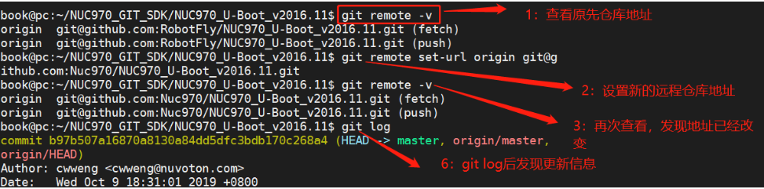

### 方案2

```
git remote rm origin
git remote add origin [url]
```


## 工作区和暂缓区


执行`git init` 的时候Git为我们自动创建的第一个分支`master`，以及指向`master`的一个指针叫`HEAD`

把文件往Git版本库里添加的时候，是分两步执行的：

1. 用`git add`把文件添加进去，修改的文件从 工作区- 》暂缓区；

2. 用`git commit`提交更改，暂存区- 》仓库(master)。

你可以简单理解为，需要提交的文件修改通过`git add`通通放到暂存区，然后，通过 `git commit` 一次性提交暂存区的所有修改。`git commit`只负责把暂存区的修改提交到仓库(master)。

## 基本命令


1. 首先在本地配置git，目的是和code服务器打交道的时候，识别你是谁

   ```
   git config --global user.name "RobotFly"
   git config --global user.email "xy_m@163.com"
   ```

2. 创建本地厂库

   ```
   git init
   ```

3. 增加新文件到暂缓区(工作区 -> stage)

   ```
   git status       		 	#查看工作区修改文件状态 
   git rm --cached <file> 		# 如果想把暂缓区的文件退回到工作区
   git add readme.md 			#添加文件readme.md到暂缓区
   或者
   git add .         			#添加所有文件到暂缓区
   ```

4. 提交文件到本地厂库（暂缓区->本地厂库）

   ```
   git commit -m "自己提交log"
   ```

5. 查看关联的远程仓库地址

   ```
   git remote -v
   ```

6. 关联本地厂库到远程厂库

   ```
   git remote add origin git@github.com:RobotFly/4G.git
   ```

7. 提交本地厂库代码到远程厂库 

   ```
   git push -u origin master # 第一次推送到远程仓库
   git push origin master    # 以后就用该命令推送到远程仓库
   ```

8. 克隆远程厂库代码

   ```
   git clone git@github.com:RobotFly/4G.git
   ```

​      **注：克隆完后可以 执行 `git init` 初始化本地仓库，然后关联到远程仓库，自己就可以提交自己的修改**

9. 查看提交日志

   ```
   git log                    # 显示提交日志的全部信息
   
   git log --pretty=oneline   # 如果嫌弃输出信息太多，执行以下命令
   ```

10. 历史命令 可以查看历史所有命令 

    ```
    git reflog 
    ```

11. 回退到版本

    ```
    git reset --hard HEAD^	  # 回退上个版本，HEAD 代表当前版本，eg:HEAD^^ 代表上上个版本
    git reset --hard~100      # 回退上100个版本，后面的数字代表往前回退多少个版本  
    git reset --hard 1094a    # 回退到指定 1094a版本
    
    ```

版本号 可以用`git log`查看 ， 假如当前最新版本是1055b，我们想回退到指定的版本1094a：

**注：回退后当前版本历史log 在终端没有关闭的时候还是可以用git log查看回退前的版本号，然后用 `git reset --hard 1055b`方式在更新到最新版本，如果已经关闭终端，只能用git reflog查看历史命令，找到最新版本号1055b，然后再回退到最新版本1055b**

12. 放弃工作区的修改

```
git checkout -- file #可以丢弃工作区的修改
```

------

下图显示是基本的操作

```
1.第一部分
git init							# 初始化仓库
在文件夹下新建文件 1.txt				  # 工作区新增文件 
git add 1.txt                       # 工作区 -》 暂缓区
git status                          # 查看状态
git rm --cached 1.txt               # 暂缓区 -》工作区
git status         
git add 1.txt                       # 从新添加1.txt到暂缓区
git commit -m "提交第1个版本"         # 暂缓区-》master
git log

新建文件 2.txt
git status                       
git add 2.txt                      # 把 2.txt从工作区添加到暂缓区
git status
git commit -m "提交第2个版本"        # 把 2.txt从暂缓区添加到master
git log
git log --pretty=oneline           # 显示简单日志
git reset --hard HEAD^             # 回退到上个版本
git log                            # 查看日志，此时2.txt已经不存在了
git status

2.第二部分
关掉终端
git reflog                         # 从历史命令中 找到最新的版本对应的版本号
git --reset hard 版本号             # 恢复到最新版本即可
```

- 下图演示的是第一部分的操作

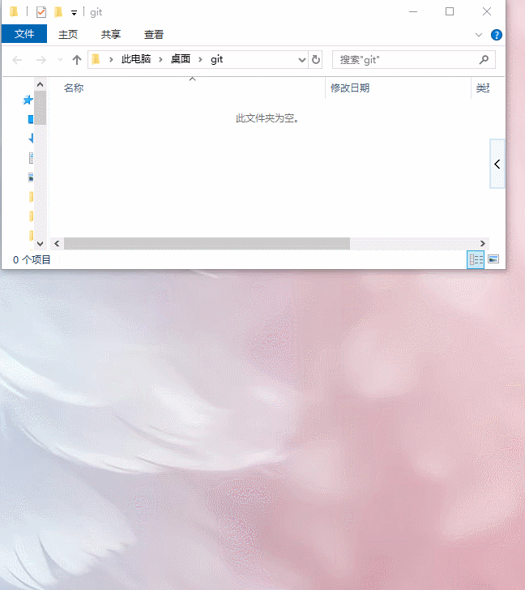

- 下图演示的是第二部分的操作

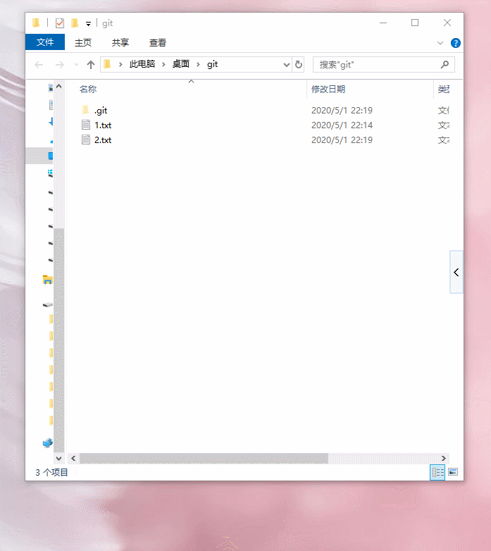

## 分支管理

在前面已经知道，每次提交，Git都把它们串成一条时间线，这条时间线就是一个分支。截止到目前，只有一条时间线，在Git里，这个分支叫主分支，即`master`分支。

一开始的时候，`master`分支是一条线，Git用`master`指向最新的提交，再用`HEAD`指向`master`，就能确定当前分支，以及当前分支的提交点：


每次提交，`master`分支都会向前移动一步，这样，随着你不断提交，`master`分支的线也越来越长。

当我们创建新的分支，例如`dev`时，Git新建了一个指针叫`dev`，指向`master`相同的提交，再把`HEAD`指向`dev`，就表示当前分支在`dev`上：


你看，Git创建一个分支很快，因为除了增加一个`dev`指针，改改`HEAD`的指向，工作区的文件都没有任何变化！

不过，从现在开始，对工作区的修改和提交就是针对`dev`分支了，比如新提交一次后，`dev`指针往前移动一步，而`master`指针不变：


假如我们在`dev`上的工作完成了，就可以把`dev`合并到`master`上。Git怎么合并呢？最简单的方法，就是直接把`master`指向`dev`的当前提交，就完成了合并：


所以Git合并分支也很快！就改改指针，工作区内容也不变！

合并完分支后，甚至可以删除`dev`分支。删除`dev`分支就是把`dev`指针给删掉，删掉后，我们就剩下了一条`master`分支：


真是太神奇了，你看得出来有些提交是通过分支完成的吗？

下面开始实战。

首先，我们创建`dev`分支，然后切换到`dev`分支：

```
$ git checkout -b dev
Switched to a new branch 'dev'
```

`git checkout`命令加上`-b`参数表示创建并切换，相当于以下两条命令：

```
$ git branch dev
$ git checkout dev
Switched to branch 'dev'
```

然后，用`git branch`命令查看当前分支：

```
$ git branch
* dev
  master
```

`git branch`命令会列出所有分支，当前分支前面会标一个`*`号。

然后，我们就可以在`dev`分支上正常提交，比如对`readme.txt`做个修改，加上一行：

```
Creating a new branch is quick.
```

然后提交：

```
$ git add readme.txt 
$ git commit -m "branch test"
[dev b17d20e] branch test
 1 file changed, 1 insertion(+)
```

现在，`dev`分支的工作完成，我们就可以切换回`master`分支：

```
$ git checkout master
Switched to branch 'master'
```

切换回`master`分支后，再查看一个`readme.txt`文件，刚才添加的内容不见了！因为那个提交是在`dev`分支上，而`master`分支此刻的提交点并没有变：


现在，我们把`dev`分支的工作成果合并到`master`分支上：

```
$ git merge dev
Updating d46f35e..b17d20e
Fast-forward
 readme.txt | 1 +
 1 file changed, 1 insertion(+)
```

`git merge`命令用于合并指定分支到当前分支。合并后，再查看`readme.txt`的内容，就可以看到，和`dev`分支的最新提交是完全一样的。

注意到上面的`Fast-forward`信息，Git告诉我们，这次合并是“快进模式”，也就是直接把`master`指向`dev`的当前提交，所以合并速度非常快。

当然，也不是每次合并都能`Fast-forward`，我们后面会讲其他方式的合并。

合并完成后，就可以放心地删除`dev`分支了：

```
$ git branch -d dev
Deleted branch dev (was b17d20e).
```

删除后，查看`branch`，就只剩下`master`分支了：

```
$ git branch
* master
```

**switch**

我们注意到切换分支使用`git checkout `，而前面讲过的撤销修改则是`git checkout -- `，同一个命令，有两种作用，确实有点令人迷惑。

实际上，切换分支这个动作，用`switch`更科学。因此，最新版本的Git提供了新的`git switch`命令来切换分支：

创建并切换到新的`dev`分支，可以使用：

```
$ git switch -c dev
```

直接切换到已有的`master`分支，可以使用：

```
$ git switch master
```

使用新的`git switch`命令，比`git checkout`要更容易理解。

**总结：**

- 查看分支：`git branch`

- 创建分支：`git branch `

- 切换分支：`git checkout `或者`git switch `

- 创建+切换分支：`git checkout -b `或者`git switch -c `

- 合并某分支到当前分支：`git merge `

- 删除分支：`git branch -d `

下图演示的是创建新分支，然后在新分支上执行修改后，又切换为主分支，合并dev分支到master上，然后删除dev分支的过程


## 管理修改

### 管理工作区的修改

```
git add file        # 把修改提交到暂缓区
git checkout --file # 放弃本次修改  最新版本的git 用 git restore <file> 来放弃修改
```


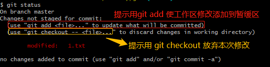

### 管理暂缓区修改

```
git commit -m "log"    # 暂缓区 -》 仓库（master）
git reset HEAD <file>  # 暂缓区-》工作区 
```

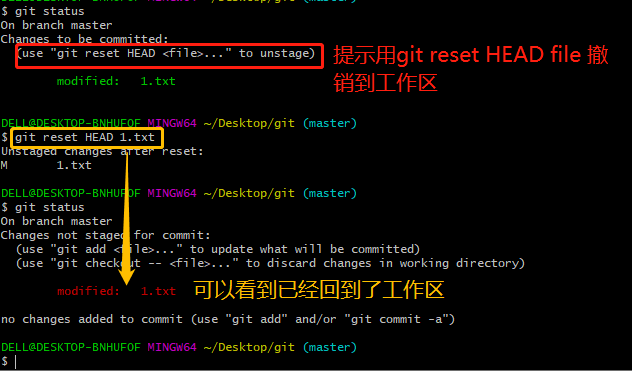


### 管理本地仓库修改

假设你不但改错了东西，还从暂存区提交到了版本库，怎么办呢？还记得[版本回退](https://www.liaoxuefeng.com/wiki/896043488029600/897013573512192)一节吗？可以回退到上一个版本。不过，这是有条件的，就是你还没有把自己的本地版本库推送到远程。

```
撤销操作
git reset --hard HEAD^	  # 回退上个版本，HEAD 代表当前版本，eg:HEAD^^ 代表上上个版本
git reset --hard~100      # 回退上100个版本，后面的数字代表往前回退多少个版本  
git reset --hard 1094a    # 回退到指定 1094a版本
提交到远程库操作
git push origin master
```

**注：假设当前版本e经历了如下例程a->b->c->d->e，一旦从e版本回退版本b，本地的代码包括工作区暂缓区和仓库，都会是b时候的样子，连git log 命令都无法显示c、d、e的提交日志，只能通过reflog命令查看历史操作，才能找到提交c、d、e时候的日志，所以一旦回退，在想更新到c、d或e版本的时候，只能用git reflog命令查看版本号，然后用git reset --hard 版本号 的方式更新到想要的版本**

4. 删除文件

   一般情况下，你通常直接在文件管理器中把没用的文件删了，或者用`rm`命令删了,如果文件只在工作区存在过，那么只能自己去电脑的回收站去看了，git无能为力。

   如果文件已经在暂缓区或者仓库了，这个时候分两种情况:

   - 的确是想删除这个文件：

     ```
     git rm test.txt
     如果想保存本次删除就往下执行
     git add .
     git commit -m "删除 test.txt"
     ```

     

   - 自己不小心误删了，那么就想办法恢复该文件(此时文件在暂缓区或者仓库)

     ```
     git checkout -- test.txt # 因为版本库里还有呢，所以可以很轻松地把误删的文件恢复到最新版本：
     ```

## 解决冲突

应用场景：

1. 两个分支：master和dev；

   - master下的1.txt内容：`我是master`
   - dev下的1.txt内容：`我是dev`

2. 切换到master，修改1.txt，并且提交到仓库，此时master 和分支feature1（即dev）如下

   - master下的1.txt内容：`我是master`
                                              `master 修改了`
   - dev下的1.txt内容：`我是dev`

   

3. 这个时候想执行 `git merge dev`命令合并dev到master，想想，git这个时候会怎么处理，答案是，git会报个冲突，然后提示用户需要手动解决冲突后再 执行 `git add git commit`命令提交，完成本次合并。

   ```
   git status  # 查看冲突
   ```

   我们可以用 `git log --graph --pretty=oneline --abbrev-commit`命令查看合并情况

   

   合并完成后未删除的分支情况如图所示，

   

   最后我们删除掉分支feature1（即dev）

   ```
   git branch -d dev
   ```

   

   **下图显示的是上面的整个流程操作**

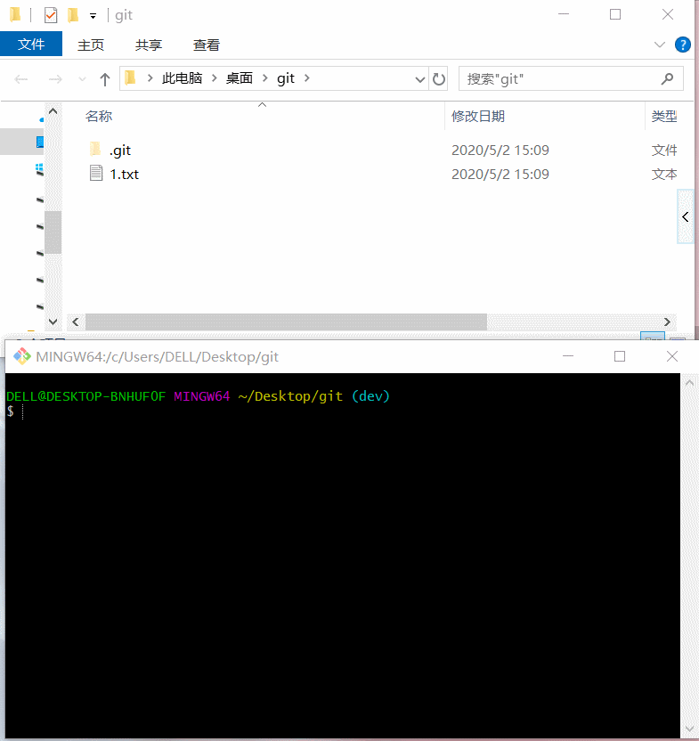

**手动修改1.txt冲突，并重新提交到master，且删除了dev分支**

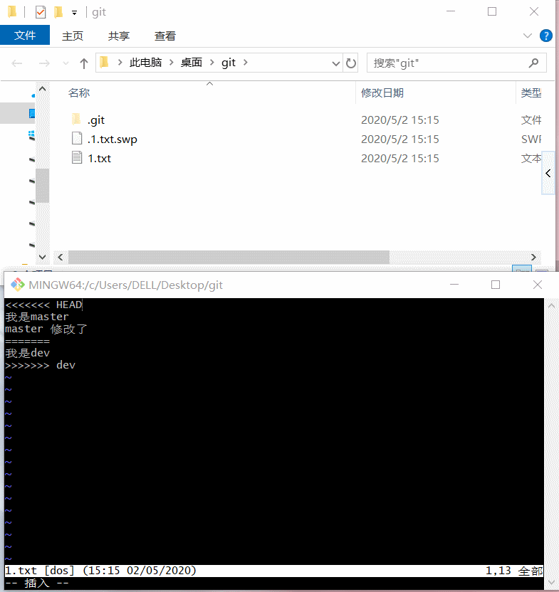

## 分支管理策略

通常，合并分支时，如果可能，Git会用`Fast forward`模式，但这种模式下，删除分支后，会丢掉分支信息。

如果要强制禁用`Fast forward`模式，Git就会在merge时生成一个新的commit，这样，从分支历史上就可以看出分支信息。

下面我们实战一下`--no-ff`方式的`git merge`：

首先，仍然创建并切换`dev`分支：

```
$ git switch -c dev
Switched to a new branch 'dev'
```

修改readme.txt文件，并提交一个新的commit：

```
$ git add readme.txt 
$ git commit -m "add merge"
[dev f52c633] add merge
 1 file changed, 1 insertion(+)
```

现在，我们切换回`master`：

```
$ git switch master
Switched to branch 'master'
```

准备合并`dev`分支，请注意`--no-ff`参数，表示禁用`Fast forward`：

```
$ git merge --no-ff -m "merge with no-ff" dev
Merge made by the 'recursive' strategy.
 readme.txt | 1 +
 1 file changed, 1 insertion(+)
```

因为本次合并要创建一个新的commit，所以加上`-m`参数，把commit描述写进去。

合并后，我们用`git log`看看分支历史：

```
$ git log --graph --pretty=oneline --abbrev-commit
*   e1e9c68 (HEAD -> master) merge with no-ff
|\  
| * f52c633 (dev) add merge
|/  
*   cf810e4 conflict fixed
...
```

可以看到，不使用`Fast forward`模式，merge后就像这样：


### 分支策略

在实际开发中，我们应该按照几个基本原则进行分支管理：

首先，`master`分支应该是非常稳定的，也就是仅用来发布新版本，平时不能在上面干活；

那在哪干活呢？干活都在`dev`分支上，也就是说，`dev`分支是不稳定的，到某个时候，比如1.0版本发布时，再把`dev`分支合并到`master`上，在`master`分支发布1.0版本；

你和你的小伙伴们每个人都在`dev`分支上干活，每个人都有自己的分支，时不时地往`dev`分支上合并就可以了。

所以，团队合作的分支看起来就像这样：


### 小结

Git分支十分强大，在团队开发中应该充分应用。

合并分支时，加上`--no-ff`参数就可以用普通模式合并，合并后的历史有分支，能看出来曾经做过合并，而`fast forward`合并就看不出来曾经做过合并。

## bug 分支

软件开发中，bug就像家常便饭一样。有了bug就需要修复，在Git中，由于分支是如此的强大，所以，每个bug都可以通过一个新的临时分支来修复，修复后，合并分支，然后将临时分支删除。

当你接到一个修复一个代号101的bug的任务时，很自然地，你想创建一个分支`issue-101`来修复它，但是，等等，当前正在`dev`上进行的工作还没有提交：

```
$ git status
On branch dev
Changes to be committed:
  (use "git reset HEAD <file>..." to unstage)

	new file:   hello.py

Changes not staged for commit:
  (use "git add <file>..." to update what will be committed)
  (use "git checkout -- <file>..." to discard changes in working directory)

	modified:   readme.txt
```

并不是你不想提交，而是工作只进行到一半，还没法提交，预计完成还需1天时间。但是，必须在两个小时内修复该bug，怎么办？

幸好，Git还提供了一个`stash`功能，可以把当前工作现场“储藏”起来，等以后恢复现场后继续工作：

```
$ git stash
Saved working directory and index state WIP on dev: f52c633 add merge
```

现在，用`git status`查看工作区，就是干净的（除非有没有被Git管理的文件），因此可以放心地创建分支来修复bug。

首先确定要在哪个分支上修复bug，假定需要在`master`分支上修复，就从`master`创建临时分支：

```
$ git checkout master
Switched to branch 'master'
Your branch is ahead of 'origin/master' by 6 commits.
  (use "git push" to publish your local commits)

$ git checkout -b issue-101
Switched to a new branch 'issue-101'
```

现在修复bug，需要把“Git is free software ...”改为“Git is a free software ...”，然后提交：

```
$ git add readme.txt 
$ git commit -m "fix bug 101"
[issue-101 4c805e2] fix bug 101
 1 file changed, 1 insertion(+), 1 deletion(-)
```

修复完成后，切换到`master`分支，并完成合并，最后删除`issue-101`分支：

```
$ git switch master
Switched to branch 'master'
Your branch is ahead of 'origin/master' by 6 commits.
  (use "git push" to publish your local commits)

$ git merge --no-ff -m "merged bug fix 101" issue-101
Merge made by the 'recursive' strategy.
 readme.txt | 2 +-
 1 file changed, 1 insertion(+), 1 deletion(-)
```

太棒了，原计划两个小时的bug修复只花了5分钟！现在，是时候接着回到`dev`分支干活了！

```
$ git switch dev
Switched to branch 'dev'

$ git status
On branch dev
nothing to commit, working tree clean
```

工作区是干净的，刚才的工作现场存到哪去了？用`git stash list`命令看看：

```
$ git stash list
stash@{0}: WIP on dev: f52c633 add merge
```

工作现场还在，Git把stash内容存在某个地方了，但是需要恢复一下，有两个办法：

一是用`git stash apply`恢复，但是恢复后，stash内容并不删除，你需要用`git stash drop`来删除；

另一种方式是用`git stash pop`，恢复的同时把stash内容也删了：

```
$ git stash pop
On branch dev
Changes to be committed:
  (use "git reset HEAD <file>..." to unstage)

	new file:   hello.py

Changes not staged for commit:
  (use "git add <file>..." to update what will be committed)
  (use "git checkout -- <file>..." to discard changes in working directory)

	modified:   readme.txt

Dropped refs/stash@{0} (5d677e2ee266f39ea296182fb2354265b91b3b2a)
```

再用`git stash list`查看，就看不到任何stash内容了：

```
$ git stash list
```

你可以多次stash，恢复的时候，先用`git stash list`查看，然后恢复指定的stash，用命令：

```
$ git stash apply stash@{0}
```


## feature分支

软件开发中，总有无穷无尽的新的功能要不断添加进来。

添加一个新功能时，你肯定不希望因为一些实验性质的代码，把主分支搞乱了，所以，每添加一个新功能，最好新建一个feature分支，在上面开发，完成后，合并，最后，删除该feature分支。

现在，你终于接到了一个新任务：开发代号为Vulcan的新功能，该功能计划用于下一代星际飞船。

于是准备开发：

```
$ git switch -c feature-vulcan
Switched to a new branch 'feature-vulcan'
```

5分钟后，开发完毕：

```
$ git add vulcan.py

$ git status
On branch feature-vulcan
Changes to be committed:
  (use "git reset HEAD <file>..." to unstage)

	new file:   vulcan.py

$ git commit -m "add feature vulcan"
[feature-vulcan 287773e] add feature vulcan
 1 file changed, 2 insertions(+)
 create mode 100644 vulcan.py
```

切回`dev`，准备合并：

```
$ git switch dev
```

一切顺利的话，feature分支和bug分支是类似的，合并，然后删除。

但是！

就在此时，接到上级命令，因经费不足，新功能必须取消！

虽然白干了，但是这个包含机密资料的分支还是必须就地销毁：

```
$ git branch -d feature-vulcan
error: The branch 'feature-vulcan' is not fully merged.
If you are sure you want to delete it, run 'git branch -D feature-vulcan'.
```

销毁失败。Git友情提醒，`feature-vulcan`分支还没有被合并，如果删除，将丢失掉修改，如果要强行删除，需要使用大写的`-D`参数。。

现在我们强行删除：

```
$ git branch -D feature-vulcan
Deleted branch feature-vulcan (was 287773e).
```

终于删除成功！

### 小结

开发一个新feature，最好新建一个分支；

如果要丢弃一个没有被合并过的分支，可以通过`git branch -D `强行删除


## 多人协作

当你从远程仓库克隆时，实际上Git自动把本地的`master`分支和远程的`master`分支对应起来了，并且，远程仓库的默认名称是`origin`。

要查看远程库的信息，用`git remote`：

```
$ git remote
origin
```

或者，用`git remote -v`显示更详细的信息：

```
$ git remote -v
origin  git@github.com:michaelliao/learngit.git (fetch)
origin  git@github.com:michaelliao/learngit.git (push)
```

上面显示了可以抓取和推送的`origin`的地址。如果没有推送权限，就看不到push的地址。

### 推送分支

推送分支，就是把该分支上的所有本地提交推送到远程库。推送时，要指定本地分支，这样，Git就会把该分支推送到远程库对应的远程分支上：

```
$ git push origin master
```

如果要推送其他分支，比如`dev`，就改成：

```
$ git push origin dev
```

但是，并不是一定要把本地分支往远程推送，那么，哪些分支需要推送，哪些不需要呢？

- `master`分支是主分支，因此要时刻与远程同步；
- `dev`分支是开发分支，团队所有成员都需要在上面工作，所以也需要与远程同步；
- bug分支只用于在本地修复bug，就没必要推到远程了，除非老板要看看你每周到底修复了几个bug；
- feature分支是否推到远程，取决于你是否和你的小伙伴合作在上面开发。

总之，就是在Git中，分支完全可以在本地自己藏着玩，是否推送，视你的心情而定！

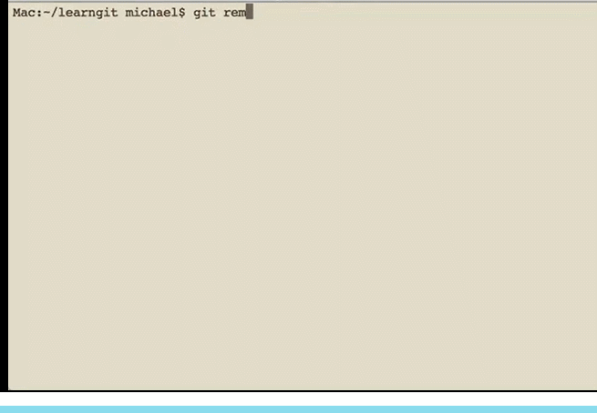

### 抓取分支

多人协作时，大家都会往`master`和`dev`分支上推送各自的修改。

现在，模拟一个你的小伙伴，可以在另一台电脑（注意要把SSH Key添加到GitHub）或者同一台电脑的另一个目录下克隆：

```
$ git clone git@github.com:michaelliao/learngit.git
Cloning into 'learngit'...
remote: Counting objects: 40, done.
remote: Compressing objects: 100% (21/21), done.
remote: Total 40 (delta 14), reused 40 (delta 14), pack-reused 0
Receiving objects: 100% (40/40), done.
Resolving deltas: 100% (14/14), done.
```

当你的小伙伴从远程库clone时，默认情况下，你的小伙伴只能看到本地的`master`分支。不信可以用`git branch`命令看看：

```
$ git branch
* master
```

现在，你的小伙伴要在`dev`分支上开发，就必须创建远程`origin`的`dev`分支到本地，于是他用这个命令创建本地`dev`分支：

```
$ git checkout -b dev origin/dev
```

现在，他就可以在`dev`上继续修改，然后，时不时地把`dev`分支`push`到远程：

```
$ git add env.txt

$ git commit -m "add env"
[dev 7a5e5dd] add env
 1 file changed, 1 insertion(+)
 create mode 100644 env.txt

$ git push origin dev
Counting objects: 3, done.
Delta compression using up to 4 threads.
Compressing objects: 100% (2/2), done.
Writing objects: 100% (3/3), 308 bytes | 308.00 KiB/s, done.
Total 3 (delta 0), reused 0 (delta 0)
To github.com:michaelliao/learngit.git
   f52c633..7a5e5dd  dev -> dev
```


你的小伙伴已经向`origin/dev`分支推送了他的提交，而碰巧你也对同样的文件作了修改，并试图推送：

```
$ cat env.txt
env

$ git add env.txt

$ git commit -m "add new env"
[dev 7bd91f1] add new env
 1 file changed, 1 insertion(+)
 create mode 100644 env.txt

$ git push origin dev
To github.com:michaelliao/learngit.git
 ! [rejected]        dev -> dev (non-fast-forward)
error: failed to push some refs to 'git@github.com:michaelliao/learngit.git'
hint: Updates were rejected because the tip of your current branch is behind
hint: its remote counterpart. Integrate the remote changes (e.g.
hint: 'git pull ...') before pushing again.
hint: See the 'Note about fast-forwards' in 'git push --help' for details.
```

推送失败，因为你的小伙伴的最新提交和你试图推送的提交有冲突，解决办法也很简单，Git已经提示我们，先用`git pull`把最新的提交从`origin/dev`抓下来，然后，在本地合并，解决冲突，再推送：

```
$ git pull
There is no tracking information for the current branch.
Please specify which branch you want to merge with.
See git-pull(1) for details.

    git pull <remote> <branch>

If you wish to set tracking information for this branch you can do so with:

    git branch --set-upstream-to=origin/<branch> dev
```

`git pull`也失败了，原因是没有指定本地`dev`分支与远程`origin/dev`分支的链接，根据提示，设置`dev`和`origin/dev`的链接：

```
$ git branch --set-upstream-to=origin/dev dev
Branch 'dev' set up to track remote branch 'dev' from 'origin'.
```

再pull：

```
$ git pull
Auto-merging env.txt
CONFLICT (add/add): Merge conflict in env.txt
Automatic merge failed; fix conflicts and then commit the result.
```

这回`git pull`成功，但是合并有冲突，需要手动解决，解决的方法和分支管理中的解决冲突完全一样。解决后，提交，再push：

```
$ git commit -m "fix env conflict"
[dev 57c53ab] fix env conflict

$ git push origin dev
Counting objects: 6, done.
Delta compression using up to 4 threads.
Compressing objects: 100% (4/4), done.
Writing objects: 100% (6/6), 621 bytes | 621.00 KiB/s, done.
Total 6 (delta 0), reused 0 (delta 0)
To github.com:michaelliao/learngit.git
   7a5e5dd..57c53ab  dev -> dev
```


因此，多人协作的工作模式通常是这样：

1. 首先，可以试图用`git push origin `推送自己的修改；
2. 如果推送失败，则因为远程分支比你的本地更新，需要先用`git pull`试图合并；
3. 如果合并有冲突，则解决冲突，并在本地提交；
4. 没有冲突或者解决掉冲突后，再用`git push origin `推送就能成功！

如果`git pull`提示`no tracking information`，则说明本地分支和远程分支的链接关系没有创建，用命令`git branch --set-upstream-to  origin/`。

这就是多人协作的工作模式，一旦熟悉了，就非常简单。

### 小结

- 查看远程库信息，使用`git remote -v`；
- 本地新建的分支如果不推送到远程，对其他人就是不可见的；
- 从本地推送分支，使用`git push origin branch-name`，如果推送失败，先用`git pull`抓取远程的新提交；
- 在本地创建和远程分支对应的分支，使用`git checkout -b branch-name origin/branch-name`，本地和远程分支的名称最好一致；
- 建立本地分支和远程分支的关联，使用`git branch --set-upstream branch-name origin/branch-name`；
- 从远程抓取分支，使用`git pull`，如果有冲突，要先处理冲突。

## rebase

在上一节我们看到了，多人在同一个分支上协作时，很容易出现冲突。即使没有冲突，后push的童鞋不得不先pull，在本地合并，然后才能push成功。

每次合并再push后，分支变成了这样：

```
$ git log --graph --pretty=oneline --abbrev-commit
* d1be385 (HEAD -> master, origin/master) init hello
*   e5e69f1 Merge branch 'dev'
|\  
| *   57c53ab (origin/dev, dev) fix env conflict
| |\  
| | * 7a5e5dd add env
| * | 7bd91f1 add new env
| |/  
* |   12a631b merged bug fix 101
|\ \  
| * | 4c805e2 fix bug 101
|/ /  
* |   e1e9c68 merge with no-ff
|\ \  
| |/  
| * f52c633 add merge
|/  
*   cf810e4 conflict fixed
```

总之看上去很乱，有强迫症的童鞋会问：为什么Git的提交历史不能是一条干净的直线？

其实是可以做到的！

Git有一种称为rebase的操作，有人把它翻译成“变基”。


先不要随意展开想象。我们还是从实际问题出发，看看怎么把分叉的提交变成直线。

在和远程分支同步后，我们对`hello.py`这个文件做了两次提交。用`git log`命令看看：

```
$ git log --graph --pretty=oneline --abbrev-commit
* 582d922 (HEAD -> master) add author
* 8875536 add comment
* d1be385 (origin/master) init hello
*   e5e69f1 Merge branch 'dev'
|\  
| *   57c53ab (origin/dev, dev) fix env conflict
| |\  
| | * 7a5e5dd add env
| * | 7bd91f1 add new env
...
```

注意到Git用`(HEAD -> master)`和`(origin/master)`标识出当前分支的HEAD和远程origin的位置分别是`582d922 add author`和`d1be385 init hello`，本地分支比远程分支快两个提交。

现在我们尝试推送本地分支：

```
$ git push origin master
To github.com:michaelliao/learngit.git
 ! [rejected]        master -> master (fetch first)
error: failed to push some refs to 'git@github.com:michaelliao/learngit.git'
hint: Updates were rejected because the remote contains work that you do
hint: not have locally. This is usually caused by another repository pushing
hint: to the same ref. You may want to first integrate the remote changes
hint: (e.g., 'git pull ...') before pushing again.
hint: See the 'Note about fast-forwards' in 'git push --help' for details.
```

很不幸，失败了，这说明有人先于我们推送了远程分支。按照经验，先pull一下：

```
$ git pull
remote: Counting objects: 3, done.
remote: Compressing objects: 100% (1/1), done.
remote: Total 3 (delta 1), reused 3 (delta 1), pack-reused 0
Unpacking objects: 100% (3/3), done.
From github.com:michaelliao/learngit
   d1be385..f005ed4  master     -> origin/master
 * [new tag]         v1.0       -> v1.0
Auto-merging hello.py
Merge made by the 'recursive' strategy.
 hello.py | 1 +
 1 file changed, 1 insertion(+)
```

再用`git status`看看状态：

```
$ git status
On branch master
Your branch is ahead of 'origin/master' by 3 commits.
  (use "git push" to publish your local commits)

nothing to commit, working tree clean
```

加上刚才合并的提交，现在我们本地分支比远程分支超前3个提交。

用`git log`看看：

```
$ git log --graph --pretty=oneline --abbrev-commit
*   e0ea545 (HEAD -> master) Merge branch 'master' of github.com:michaelliao/learngit
|\  
| * f005ed4 (origin/master) set exit=1
* | 582d922 add author
* | 8875536 add comment
|/  
* d1be385 init hello
...
```

对强迫症童鞋来说，现在事情有点不对头，提交历史分叉了。如果现在把本地分支push到远程，有没有问题？

有！

什么问题？

不好看！

有没有解决方法？

有！

这个时候，rebase就派上了用场。我们输入命令`git rebase`试试：

```
$ git rebase
First, rewinding head to replay your work on top of it...
Applying: add comment
Using index info to reconstruct a base tree...
M	hello.py
Falling back to patching base and 3-way merge...
Auto-merging hello.py
Applying: add author
Using index info to reconstruct a base tree...
M	hello.py
Falling back to patching base and 3-way merge...
Auto-merging hello.py
```

输出了一大堆操作，到底是啥效果？再用`git log`看看：

```
$ git log --graph --pretty=oneline --abbrev-commit
* 7e61ed4 (HEAD -> master) add author
* 3611cfe add comment
* f005ed4 (origin/master) set exit=1
* d1be385 init hello
...
```

原本分叉的提交现在变成一条直线了！这种神奇的操作是怎么实现的？其实原理非常简单。我们注意观察，发现Git把我们本地的提交“挪动”了位置，放到了`f005ed4 (origin/master) set exit=1`之后，这样，整个提交历史就成了一条直线。rebase操作前后，最终的提交内容是一致的，但是，我们本地的commit修改内容已经变化了，它们的修改不再基于`d1be385 init hello`，而是基于`f005ed4 (origin/master) set exit=1`，但最后的提交`7e61ed4`内容是一致的。

这就是rebase操作的特点：把分叉的提交历史“整理”成一条直线，看上去更直观。缺点是本地的分叉提交已经被修改过了。

最后，通过push操作把本地分支推送到远程：

```
Mac:~/learngit michael$ git push origin master
Counting objects: 6, done.
Delta compression using up to 4 threads.
Compressing objects: 100% (5/5), done.
Writing objects: 100% (6/6), 576 bytes | 576.00 KiB/s, done.
Total 6 (delta 2), reused 0 (delta 0)
remote: Resolving deltas: 100% (2/2), completed with 1 local object.
To github.com:michaelliao/learngit.git
   f005ed4..7e61ed4  master -> master
```

再用`git log`看看效果：

```
$ git log --graph --pretty=oneline --abbrev-commit
* 7e61ed4 (HEAD -> master, origin/master) add author
* 3611cfe add comment
* f005ed4 set exit=1
* d1be385 init hello
...
```

远程分支的提交历史也是一条直线。


### 小结

- rebase操作可以把本地未push的分叉提交历史整理成直线；
- rebase的目的是使得我们在查看历史提交的变化时更容易，因为分叉的提交需要三方对比。

### git pull merge push

1. 开发分支（dev）上的代码达到上线的标准后，要合并到 master 分支

   ```bash
   git checkout dev     # 切换到dev分支
   git pull             # 同步远程仓库的dev分支下的代码并合并到本地dev的分支下（相当于 git fetch + git merge）
   git checkout master  # 切换到本地主分支
   git merge dev        # 把本地dev分支下的代码合并到本地主分支
   git push  origin master # 把本地master代码推送到远端厂库master分支下
   ```

   **😡注意：**而`git pull`是从远程获取最新版本并`merge`到本地仓库，从安全角度出发，`git fetch`比`git pull`更安全，因为我们可以先比较本地与远程的区别后，选择性的合并。`git push` 默认推送到`master`。

2. 当master代码改动了，需要更新开发分支（dev）上的代码

   ```bash
   git checkout master 
   git pull 
   git checkout dev
   git merge master 
   git push origin dev
   ```

## GIT版本管理

### 发布版本

1.发布版本命令

```
git tag -a v1.0.0 -m"发布初始版本，后续可在此版本上修改应用程序"
```

-a 证明这个标签是注解的

-m 标签消息在本地打上标签


2. 使用命令`git show v1.0.0`（v1.0.0是标签名），来查看某标签的信息

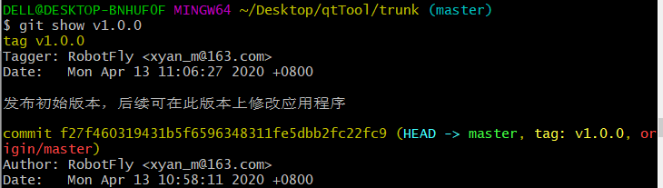

3. 确认无误后，可以将其通过`git push origin v1.0.0`命令推送到远程库，当然，较为罕见的情况，你需要推送多个标签 `git push origin --tags`来代替

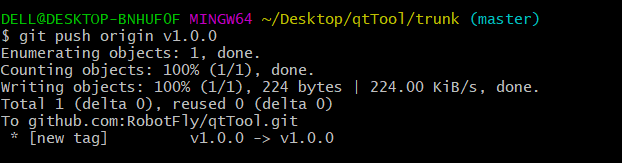

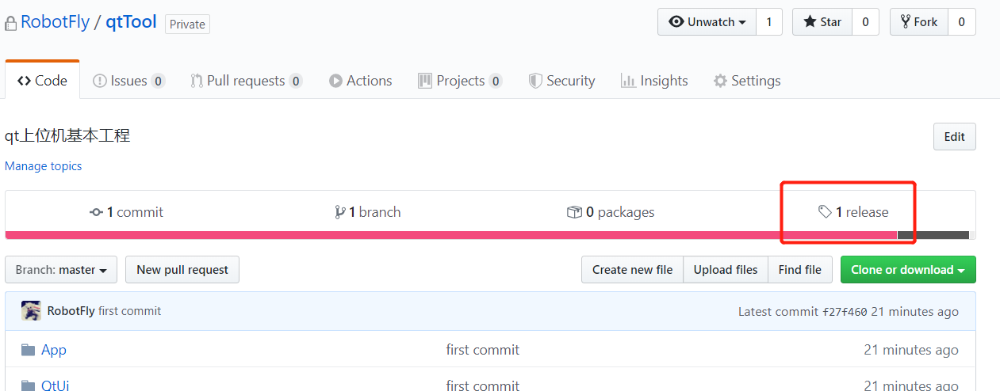

### 删除版本     

`git push origin :refs/tags/v1.0.0                                             `    


## git diff

1. 当工作区有改动，暂存区为空，`git diff`的对比是 **工作区** 和**本地厂库**相同文件的修改；

2. 当工作区有改动，暂存区不为空，`git diff`对比的是**工作区**和**暂存区**相同文件的修改。

3. `git diff --cached` 或 `git diff --staged`显示暂存区(已add但未commit文件)和最后一次commit(HEAD)之间的所有不相同文件的增删改

4. `git diff HEAD`显示工作目录(已track但未add文件)和暂存区(已add但未commit文件)与最后一次commit之间

5. g`it diff <分支名1> <分支名2>` ：比较两个分支上最后 commit 的内容的差别

   - `git diff branch1 branch2 --stat`    显示出所有有差异的文件(不详细,没有对比内容)
   - `git diff branch1 branch2`              显示出所有有差异的文件的详细差异(更详细)
   - `git diff branch1 branch2` 具体文件路径  显示指定文件的详细差异(对比内容)

6. `git log dev ^master` 查看 dev中log有的commit，而 master中log没有的commit

7. `git diff commit-id1 commit-id2 --stat`查看两个提交版本不同，只显示文件的差异

   

8. 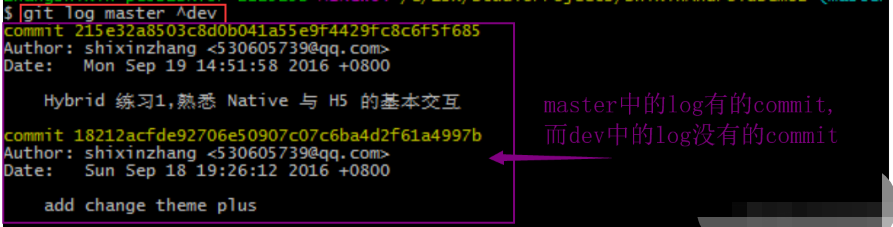

9. `git log master..dev`查看 dev 中的log比 master 中的log多提交了哪些内容(注意，列出来的是两个点“..”后边（此处即dev）多提交的内容)

10. 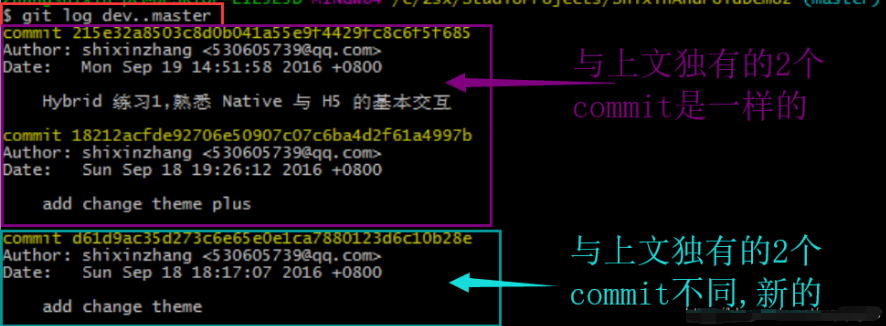

11. `git log dev...master` 不知道谁提交的多谁提交的少，单纯想知道有什么不一样；

    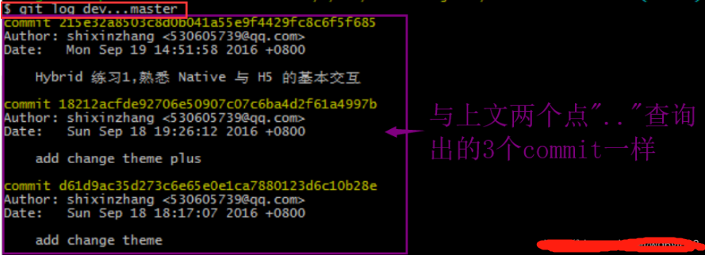

12. g`it log --left-right dev...master` 在上述情况下，再显示出每个提交是在哪个分支上

    **注意：** commit 后面的箭头，根据我们在 `–left-right dev…master` 的顺序，左箭头 `<` 表示是 dev 的，右箭头 `>` 表示是 master的，截图中表示这三个提交都是在 master 分支上的

    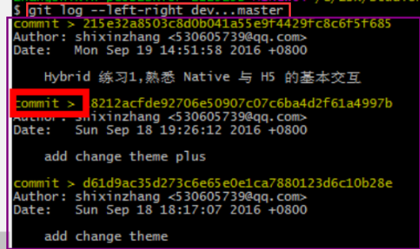

## gitee

使用GitHub时，国内的用户经常遇到的问题是访问速度太慢，有时候还会出现无法连接的情况（原因你懂的）。

如果我们希望体验Git飞一般的速度，可以使用国内的Git托管服务——[Gitee](https://gitee.com/?utm_source=blog_lxf)（[gitee.com](https://gitee.com/?utm_source=blog_lxf)）。和GitHub相比，Gitee也提供免费的Git仓库。此外，还集成了代码质量检测、项目演示等功能。对于团队协作开发，Gitee还提供了项目管理、代码托管、文档管理的服务，5人以下小团队免费。Gitee的免费版本也提供私有库功能，只是有5人的成员上限。使用Gitee和使用GitHub类似，我们在Gitee上注册账号并登录后，需要先上传自己的SSH公钥。选择右上角用户头像 -> 菜单“修改资料”，然后选择“SSH公钥”，填写一个便于识别的标题，然后把用户主目录下的`.ssh/id_rsa.pub`文件的内容粘贴进去：


点击“确定”即可完成并看到刚才添加的Key：


如果我们已经有了一个本地的git仓库（例如，一个名为learngit的本地库），如何把它关联到Gitee的远程库上呢？

首先，我们在Gitee上创建一个新的项目，选择右上角用户头像 -> 菜单“控制面板”，然后点击“创建项目”：


项目名称最好与本地库保持一致：

然后，我们在本地库上使用命令`git remote add`把它和Gitee的远程库关联：

```
git remote add origin git@gitee.com:liaoxuefeng/learngit.git
```

之后，就可以正常地用`git push`和`git pull`推送了！

如果在使用命令`git remote add`时报错：

```
git remote add origin git@gitee.com:liaoxuefeng/learngit.git
fatal: remote origin already exists.
```

这说明本地库已经关联了一个名叫`origin`的远程库，此时，可以先用`git remote -v`查看远程库信息：

```
git remote -v
origin	git@github.com:michaelliao/learngit.git (fetch)
origin	git@github.com:michaelliao/learngit.git (push)
```

可以看到，本地库已经关联了`origin`的远程库，并且，该远程库指向GitHub。

我们可以删除已有的GitHub远程库：

```
git remote rm origin
```

再关联Gitee的远程库（注意路径中需要填写正确的用户名）：

```
git remote add origin git@gitee.com:liaoxuefeng/learngit.git
```

此时，我们再查看远程库信息：

```
git remote -v
origin	git@gitee.com:liaoxuefeng/learngit.git (fetch)
origin	git@gitee.com:liaoxuefeng/learngit.git (push)
```

现在可以看到，origin已经被关联到Gitee的远程库了。通过`git push`命令就可以把本地库推送到Gitee上。

有的小伙伴又要问了，一个本地库能不能既关联GitHub，又关联Gitee呢？

答案是肯定的，因为git本身是分布式版本控制系统，可以同步到另外一个远程库，当然也可以同步到另外两个远程库。

使用多个远程库时，我们要注意，git给远程库起的默认名称是`origin`，如果有多个远程库，我们需要用不同的名称来标识不同的远程库。

仍然以`learngit`本地库为例，我们先删除已关联的名为`origin`的远程库：

```
git remote rm origin
```

然后，先关联GitHub的远程库：

```
git remote add github git@github.com:michaelliao/learngit.git
```

注意，远程库的名称叫`github`，不叫`origin`了。

接着，再关联Gitee的远程库：

```
git remote add gitee git@gitee.com:liaoxuefeng/learngit.git
```

同样注意，远程库的名称叫`gitee`，不叫`origin`。

现在，我们用`git remote -v`查看远程库信息，可以看到两个远程库：

```
git remote -v
gitee	git@gitee.com:liaoxuefeng/learngit.git (fetch)
gitee	git@gitee.com:liaoxuefeng/learngit.git (push)
github	git@github.com:michaelliao/learngit.git (fetch)
github	git@github.com:michaelliao/learngit.git (push)
```

如果要推送到GitHub，使用命令：

```
git push github master
```

如果要推送到Gitee，使用命令：

```
git push gitee master
```

这样一来，我们的本地库就可以同时与多个远程库互相同步：

```
┌─────────┐ ┌─────────┐
│ GitHub  │ │  Gitee  │
└─────────┘ └─────────┘
     ▲           ▲
     └─────┬─────┘
           │
    ┌─────────────┐
    │ Local Repo  │
    └─────────────┘
```

## git 配置

### 配置别名

阅读: 5441015

------

有没有经常敲错命令？比如`git status`？`status`这个单词真心不好记。

如果敲`git st`就表示`git status`那就简单多了，当然这种偷懒的办法我们是极力赞成的。

我们只需要敲一行命令，告诉Git，以后`st`就表示`status`：

```
$ git config --global alias.st status
```

好了，现在敲`git st`看看效果。

当然还有别的命令可以简写，很多人都用`co`表示`checkout`，`ci`表示`commit`，`br`表示`branch`：

```
$ git config --global alias.co checkout
$ git config --global alias.ci commit
$ git config --global alias.br branch
```

以后提交就可以简写成：

```
$ git ci -m "bala bala bala..."
```

`--global`参数是全局参数，也就是这些命令在这台电脑的所有Git仓库下都有用。

在[撤销修改](https://www.liaoxuefeng.com/wiki/896043488029600/897889638509536)一节中，我们知道，命令`git reset HEAD file`可以把暂存区的修改撤销掉（unstage），重新放回工作区。既然是一个unstage操作，就可以配置一个`unstage`别名：

```
$ git config --global alias.unstage 'reset HEAD'
```

当你敲入命令：

```
$ git unstage test.py
```

实际上Git执行的是：

```
$ git reset HEAD test.py
```

配置一个`git last`，让其显示最后一次提交信息：

```
$ git config --global alias.last 'log -1'
```

这样，用`git last`就能显示最近一次的提交：

```
$ git last
commit adca45d317e6d8a4b23f9811c3d7b7f0f180bfe2
Merge: bd6ae48 291bea8
Author: Michael Liao <askxuefeng@gmail.com>
Date:   Thu Aug 22 22:49:22 2013 +0800

    merge & fix hello.py
```

甚至还有人丧心病狂地把`lg`配置成了：

```
git config --global alias.lg "log --color --graph --pretty=format:'%Cred%h%Creset -%C(yellow)%d%Creset %s %Cgreen(%cr) %C(bold blue)<%an>%Creset' --abbrev-commit"
```

来看看`git lg`的效果：


为什么不早点告诉我？别激动，咱不是为了多记几个英文单词嘛！

### 配置文件

配置Git的时候，加上`--global`是针对当前用户起作用的，如果不加，那只针对当前的仓库起作用。

配置文件放哪了？每个仓库的Git配置文件都放在`.git/config`文件中：

```
$ cat .git/config 
[core]
    repositoryformatversion = 0
    filemode = true
    bare = false
    logallrefupdates = true
    ignorecase = true
    precomposeunicode = true
[remote "origin"]
    url = git@github.com:michaelliao/learngit.git
    fetch = +refs/heads/*:refs/remotes/origin/*
[branch "master"]
    remote = origin
    merge = refs/heads/master
[alias]
    last = log -1
```

别名就在`[alias]`后面，要删除别名，直接把对应的行删掉即可。

而当前用户的Git配置文件放在用户主目录下的一个隐藏文件`.gitconfig`中：

```
$ cat .gitconfig
[alias]
    co = checkout
    ci = commit
    br = branch
    st = status
[user]
    name = Your Name
    email = your@email.com
```

配置别名也可以直接修改这个文件，如果改错了，可以删掉文件重新通过命令配置。

### 小结

给Git配置好别名，就可以输入命令时偷个懒。我们鼓励偷懒


## 更新fork的项目


```
git remote -v                  # 用git remote查看远程主机状态
git remote add upstream git@github.com:xxx/xxx.git # 关联fork仓库的并命名为upstream

git fetch upstream #同步远程fork代码到upstream这个分支

git merge upstream/master #把upstream这个分支内容合并到本地厂库的master上

git push origin master    #把自己的origin推送到自己的远程仓库上的master分支
注意：
git pull 相当于 git fetch + git merge
git push 相当于 git origin master
```


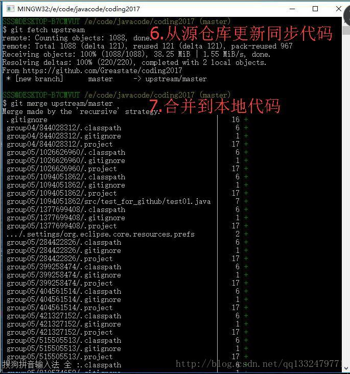

 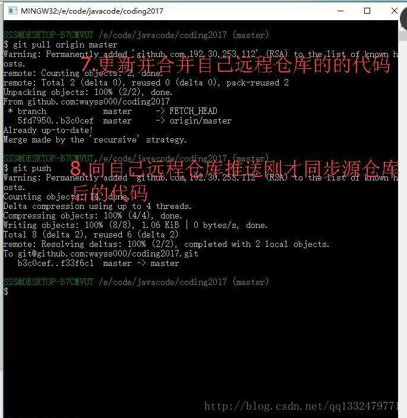

## Ubuntu18.04安装gitk

```bash
sudo apt-get install gitk
进入到工程目录输入
gitk 即可
```

如果安装失败请参考该篇文章https://blog.csdn.net/wto882dim/article/details/86690232


## Win下的git的比较工具Byound Commpare

Byound Commpare安装路径：D:/Program Files (x86)/Beyond Compare/BCompare.exe 打开C:\Users\Administrator.gitconfig

添加以下内容保存即可：

```
[gui]
    encoding = utf-8
[diff]
    tool = bc4
[difftool]
    prompt = false
[difftool "bc4"]
    cmd = "\"D:/Program Files (x86)/Beyond Compare/BCompare.exe\" \"$LOCAL\" \"$REMOTE\""
[merge]
    tool = bc
[mergetool]
    prompt = false
    keepBackup = false
[mergetool "bc"]
    cmd = "\"D:/Program Files (x86)/Beyond Compare/BCompare.exe\" \"$LOCAL\" \"$REMOTE\" \"$BASE\" \"$MERGED\""
[user]
	name = FlyRobot
	email = xyan_m@163.com
```

然后执行git diff的时候不影响以前的使用，当执行 git difftool时候，就会启动BCompare.exe来作为工具对比。 
