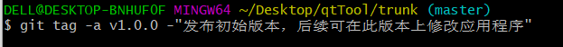
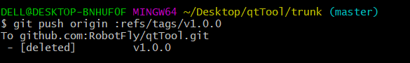
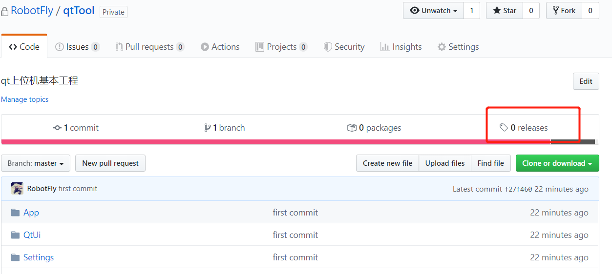
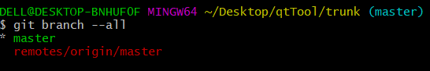

# GIT版本管理

## git 发布版本

1.发布版本命令

```
git tag -a v1.0.0 -m"发布初始版本，后续可在此版本上修改应用程序"
```

-a 证明这个标签是注解的

-m 标签消息在本地打上标签



2. 使用命令`git show v1.0.0`（v1.0.0是标签名），来查看某标签的信息


3. 确认无误后，可以将其通过`git push origin v1.0.0`命令推送到远程库，当然，较为罕见的情况，你需要推送多个标签 `git push origin --tags`来代替


4. 删除标签并推送到远端     

   `git push origin :refs/tags/v1.0.0                                             `    






##  git分支管理

1. 查看所有分支     `git branch --all`    

   

2. 