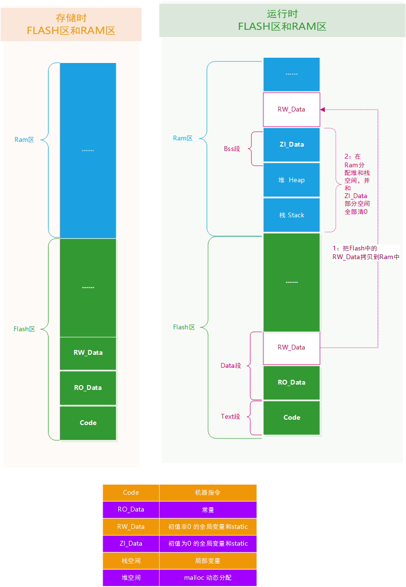
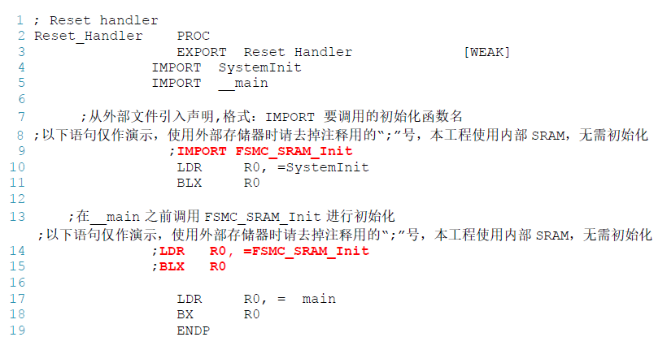

# 程序在Flash和Ram存储分布

## 存储分布

Code：代码域，编译器生成的机器指令，只存储在Flash区。属于Text段；

RO_Data：只读数据域，只存储在Flash区，例如C语言的const变量。属于DATA段;

RW_Data：可读写数据域，初始化非0的全局变量和static 变量，存储在Flash区，运行时候拷贝到RAM区。属于DATA段;

ZI_Data：初始值为0的全局变量和static 变量数据域，栈空间(Stack)及堆空间(Heap)，只在RAM中。属于Bss段;

栈：函数内部定义的局部变量属于栈空间，进入函数的时候从向栈空间申请内存给局部变量，退出时释放局部变量，归还内存空间，**后进先出**，先进入的最后出来，只在Ram区；

堆：使用malloc 动态分配的变量属于堆空间，只在Ram区。

综上：当程序存储在Flash中时，所占用的大小为Code + RO_data + RW_data 。运行时占用Ram大小为Heap+Stack+RW_Data。



## 分散加载

硬件资源：

1. mcu内部flash起始地址是0x08000000，大小是0x00080000；
2. 内部Ram起始地址0x20000000，大小是0x00005000；
3. 外扩Ram起始地址0x60005000，大小0x00007000。

目的：使用分散加载技术达到程序优先使用内部ram，堆分配在外部ram的目的。

修改步骤：

1. 修改启动文件，进入main前需要初始化FSMC_SRAM_Init函数，确保SRAM能用。




2. 修改分散加载文件，确保*.o(HEAP)在外部SRAM里面，并且新建EXRAM节区在外部的SRAM中

```
LR_IROM1 0x08000000 0x00080000{ ; load region size_region
    ER_IROM1 0x08000000 0x00080000{ 	; load address = execution address
        *.o (RESET, +First)
        *(InRoot$$Sections)
        .ANY (+RO)
    }

​    RW_IRAM1 0x20000000 0x00005000 { 	; 内部SRAM
​     	.ANY (+RW +ZI) 					;其余的RW/ZI-data 都分配到这里
​     }
​     RW_ERAM1 0x60005000 0x00007000{ 	; 外部SRAM
​     	*.o(HEAP) 						;选择堆区
​     	.ANY (EXRAM) 					;选择EXRAM 节区
​     }
}
```

3. 应用程序例程

```
#define __EXRAM __attribute__ ((section ("EXRAM")))//使用宏封装，设置变量定义到“EXRAM”节区的宏
uint32_t testValue __EXRAM =7 ;  //使用该宏定义变量到“指定的存储空间” 该变量肯定在外部SRAM中存放

uint32_t testValue2 =7  //定义变量到内部SRAM

uint32_t *pointer = (uint32_t*)malloc(sizeof(uint32_t)*3); //使用malloc 从外部SRAM 中分配空间
```

